# 市场数据提供商架构

<cite>
**本文档引用的文件**
- [backend/app/services/market_providers/base.py](file://backend/app/services/market_providers/base.py)
- [backend/app/services/market_providers/factory.py](file://backend/app/services/market_providers/factory.py)
- [backend/app/services/market_data.py](file://backend/app/services/market_data.py)
- [backend/app/schemas/market_data.py](file://backend/app/schemas/market_data.py)
- [backend/app/models/stock.py](file://backend/app/models/stock.py)
- [backend/app/services/market_providers/yfinance.py](file://backend/app/services/market_providers/yfinance.py)
- [backend/app/services/market_providers/akshare.py](file://backend/app/services/market_providers/akshare.py)
- [backend/app/services/market_providers/alpha_vantage.py](file://backend/app/services/market_providers/alpha_vantage.py)
- [backend/app/services/market_providers/tavily.py](file://backend/app/services/market_providers/tavily.py)
- [backend/app/services/indicators.py](file://backend/app/services/indicators.py)
- [backend/app/api/v1/endpoints/stock.py](file://backend/app/api/v1/endpoints/stock.py)
- [backend/app/api/v1/api.py](file://backend/app/api/v1/api.py)
- [backend/app/main.py](file://backend/app/main.py)
- [backend/app/core/config.py](file://backend/app/core/config.py)
- [backend/scripts/auto_refresh_market_data.py](file://backend/scripts/auto_refresh_market_data.py)
- [backend/scripts/data_collector.py](file://backend/scripts/data_collector.py)
</cite>

## 更新摘要
**变更内容**
- AkShare提供商从单一A股市场重构为双市场支持（A股和美股）
- 新增智能路由逻辑，自动识别A股和美股并选择相应数据源
- 改进缓存策略，为A股和美股分别实现独立缓存机制
- 新增代理绕过机制，解决国内服务器访问AkShare的网络限制
- 工厂模式调整，强制使用AkShare作为默认提供商
- 增强并发刷新能力，支持批量数据同步和后台自动刷新
- 新增速率限制支持，集成API密钥管理和使用限制
- 更新技术指标计算和数据缓存策略
- 新增故障转移和模拟模式的详细说明

## 目录
1. [引言](#引言)
2. [项目结构](#项目结构)
3. [核心组件](#核心组件)
4. [架构概览](#架构概览)
5. [详细组件分析](#详细组件分析)
6. [依赖关系分析](#依赖关系分析)
7. [性能考虑](#性能考虑)
8. [故障排除指南](#故障排除指南)
9. [结论](#结论)

## 引言

AI智能投资顾问系统的市场数据提供商架构是一个高度模块化的异步数据获取和处理系统。该架构通过抽象工厂模式实现了多数据源的统一管理，支持美股(YFinance)、A股(AkShare)和第三方数据源(AlphaVantage)的无缝切换，同时集成了AI增强搜索功能(Tavily)来提供高质量的市场新闻。

**更新** 该系统现已增强以下核心功能：
- **双市场支持**：AkShare提供商现已支持A股和美股两个市场的数据获取
- **智能路由机制**：自动识别股票代码类型并选择相应的数据源
- **改进缓存策略**：为A股和美股分别实现独立的内存缓存机制
- **代理绕过功能**：解决国内服务器访问AkShare的网络限制问题
- **并发刷新能力**：使用信号量控制并发请求，支持批量数据同步
- **速率限制支持**：集成API密钥管理和使用限制，防止服务滥用
- **智能缓存机制**：通过数据库缓存和内存缓存减少API调用频率
- **故障容错设计**：当主要数据源不可用时自动降级到备用方案
- **技术指标计算**：内置完整的K线技术指标计算引擎

该系统的核心设计理念包括：
- **多源数据融合**：支持多个数据提供商的并行获取和故障转移
- **异步并发处理**：利用asyncio实现高效的IO密集型数据获取
- **智能路由机制**：根据股票类型自动选择最优数据源
- **双市场缓存策略**：为不同市场实现独立的缓存优化
- **代理绕过设计**：解决特定网络环境下的访问限制
- **故障容错设计**：当主要数据源不可用时自动降级到备用方案
- **技术指标计算**：内置完整的K线技术指标计算引擎
- **数据质量保证**：通过净化机制确保数据的准确性和一致性

## 项目结构

系统采用分层架构设计，主要分为以下几个层次：

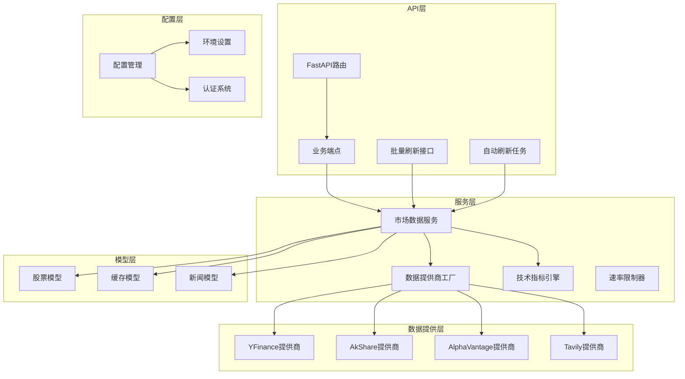

**图表来源**
- [backend/app/main.py](file://backend/app/main.py#L27-L31)
- [backend/app/api/v1/api.py](file://backend/app/api/v1/api.py#L1-L25)
- [backend/app/services/market_data.py](file://backend/app/services/market_data.py#L17-L17)
- [backend/scripts/auto_refresh_market_data.py](file://backend/scripts/auto_refresh_market_data.py#L22-L26)

**章节来源**
- [backend/app/main.py](file://backend/app/main.py#L1-L129)
- [backend/app/api/v1/api.py](file://backend/app/api/v1/api.py#L1-L25)

## 核心组件

### 抽象数据提供商接口

系统定义了统一的MarketDataProvider抽象基类，所有具体的数据提供商都必须实现这些接口：

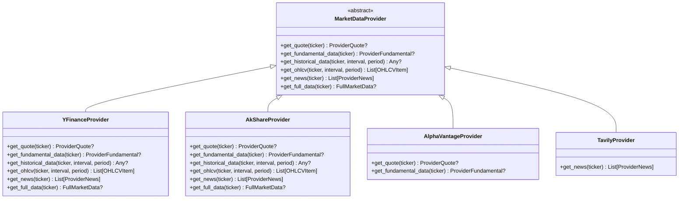

**图表来源**
- [backend/app/services/market_providers/base.py](file://backend/app/services/market_providers/base.py#L9-L50)
- [backend/app/services/market_providers/yfinance.py](file://backend/app/services/market_providers/yfinance.py#L20-L286)
- [backend/app/services/market_providers/akshare.py](file://backend/app/services/market_providers/akshare.py#L40-L480)
- [backend/app/services/market_providers/alpha_vantage.py](file://backend/app/services/market_providers/alpha_vantage.py#L14-L78)
- [backend/app/services/market_providers/tavily.py](file://backend/app/services/market_providers/tavily.py#L11-L72)

### 数据模型架构

系统使用Pydantic模型定义数据结构，确保类型安全和数据验证：

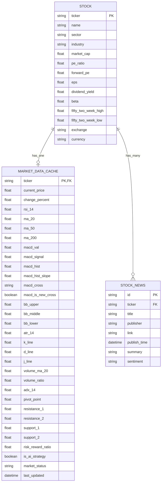

**图表来源**
- [backend/app/models/stock.py](file://backend/app/models/stock.py#L15-L105)
- [backend/app/schemas/market_data.py](file://backend/app/schemas/market_data.py#L12-L65)

**章节来源**
- [backend/app/schemas/market_data.py](file://backend/app/schemas/market_data.py#L1-L65)
- [backend/app/models/stock.py](file://backend/app/models/stock.py#L1-L105)

## 架构概览

### 数据流架构

系统采用异步数据流架构，实现了从API请求到数据持久化的完整流程：

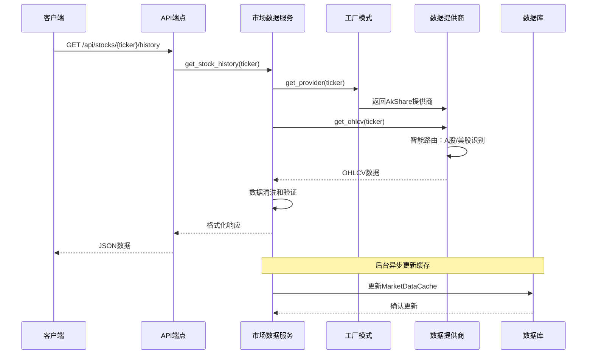

**图表来源**
- [backend/app/api/v1/endpoints/stock.py](file://backend/app/api/v1/endpoints/stock.py#L46-L74)
- [backend/app/services/market_data.py](file://backend/app/services/market_data.py#L18-L58)

### 缓存策略架构

系统实现了多层次的缓存策略来优化性能：

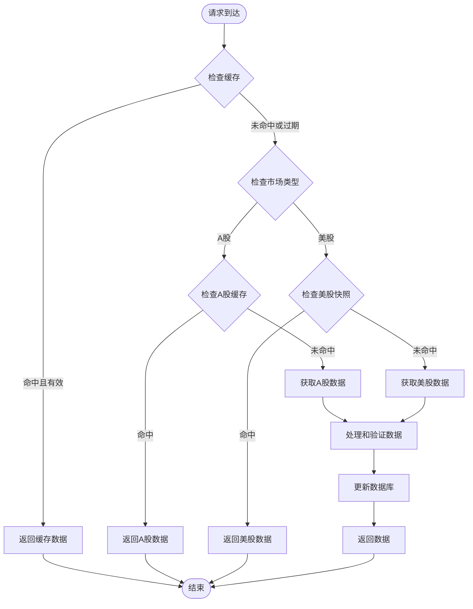

**图表来源**
- [backend/app/services/market_data.py](file://backend/app/services/market_data.py#L34-L57)

**章节来源**
- [backend/app/services/market_data.py](file://backend/app/services/market_data.py#L1-L266)

## 详细组件分析

### 市场数据服务中台

MarketDataService是整个系统的核心协调器，负责：

1. **缓存管理**：检查本地数据库缓存，避免不必要的API调用
2. **并发获取**：使用asyncio.gather并行获取多个数据源
3. **故障转移**：当主要数据源失败时自动切换到备用方案
4. **数据持久化**：将获取的数据同步到数据库模型
5. **数据净化**：通过MD5哈希实现新闻去重和数据验证

**更新** 新增数据净化机制：
- 新闻去重：使用URL的MD5哈希作为唯一ID，避免重复数据
- 数据验证：对获取的数据进行格式和完整性检查
- 异常处理：在网络中断时提供模拟数据保证系统稳定性

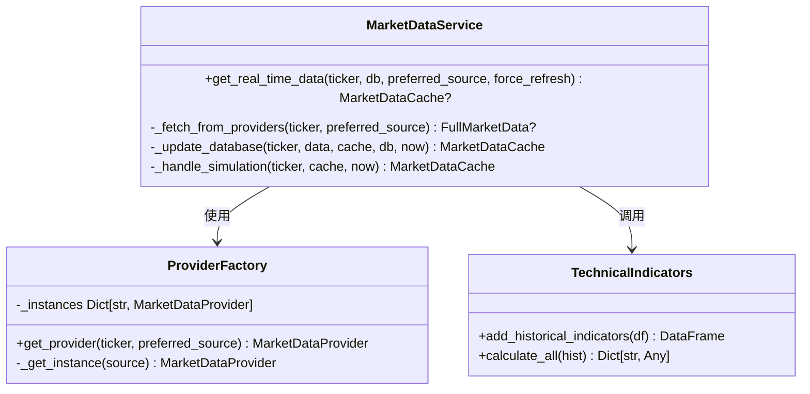

**图表来源**
- [backend/app/services/market_data.py](file://backend/app/services/market_data.py#L17-L266)
- [backend/app/services/market_providers/factory.py](file://backend/app/services/market_providers/factory.py#L11-L50)
- [backend/app/services/indicators.py](file://backend/app/services/indicators.py#L7-L192)

### 数据提供商工厂

ProviderFactory实现了工厂模式，根据股票代码特征自动选择合适的数据提供商：

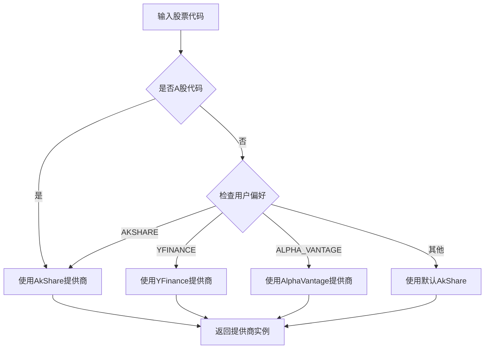

**更新** 工厂模式调整：
- 强制使用AkShare提供商作为默认选项
- 解决国内服务器访问海外API受限的问题
- 提供更好的数据获取稳定性和性能

**图表来源**
- [backend/app/services/market_providers/factory.py](file://backend/app/services/market_providers/factory.py#L16-L33)

### 技术指标计算引擎

系统内置了完整的K线技术指标计算引擎，支持多种技术分析指标：

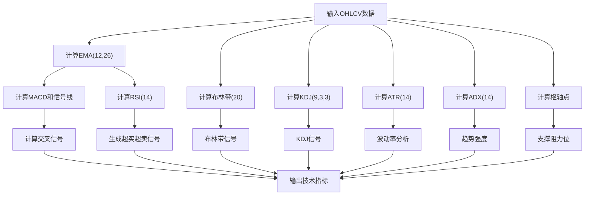

**图表来源**
- [backend/app/services/indicators.py](file://backend/app/services/indicators.py#L44-L191)

**章节来源**
- [backend/app/services/market_providers/factory.py](file://backend/app/services/market_providers/factory.py#L1-L51)
- [backend/app/services/indicators.py](file://backend/app/services/indicators.py#L1-L192)

### 数据提供商实现

#### YFinance提供商

YFinanceProvider是系统中最完善的提供商，支持完整的数据获取功能：

- **实时报价**：获取当前价格、涨跌幅、公司名称
- **基础面数据**：获取行业、市值、市盈率等财务指标
- **历史数据**：获取K线数据并计算技术指标
- **新闻获取**：获取相关市场新闻
- **全量数据**：支持一次性获取所有数据

#### AkShare提供商

**更新** AkShareProvider现已重构为双市场支持：

- **智能路由机制**：自动识别A股和美股代码并选择相应数据源
- **A股市场支持**：支持东方财富、新浪等多个A股数据源
- **美股市场支持**：支持著名的美股股票快照获取
- **代理绕过功能**：通过TLS隔离实现线程级代理绕过
- **双市场缓存策略**：分别为A股和美股实现独立内存缓存
- **A股格式转换**：自动处理A股代码格式转换
- **内存缓存优化**：缓存全市场快照数据，60秒缓存过期

#### AlphaVantage提供商

AlphaVantageProvider提供美国市场的基础数据：

- **实时报价**：获取当前价格和涨跌幅
- **基础面数据**：获取公司财务基本信息
- **API限制**：受AlphaVantage API限制影响

#### Tavily提供商

TavilyProvider提供AI增强的新闻搜索功能：

- **高质量新闻**：通过AI搜索获取精选市场新闻
- **内容摘要**：提供新闻内容摘要
- **去重机制**：使用URL哈希防止重复

**章节来源**
- [backend/app/services/market_providers/yfinance.py](file://backend/app/services/market_providers/yfinance.py#L1-L286)
- [backend/app/services/market_providers/akshare.py](file://backend/app/services/market_providers/akshare.py#L1-L480)
- [backend/app/services/market_providers/alpha_vantage.py](file://backend/app/services/market_providers/alpha_vantage.py#L1-L78)
- [backend/app/services/market_providers/tavily.py](file://backend/app/services/market_providers/tavily.py#L1-L72)

### 并发刷新能力

**新增** 系统现已支持强大的并发刷新能力：

#### 批量刷新接口

系统提供`/refresh_all`接口，支持一键刷新所有关注股票的数据：


**图表来源**
- [backend/app/api/v1/endpoints/stock.py](file://backend/app/api/v1/endpoints/stock.py#L79-L123)

#### 自动刷新任务

系统提供后台自动刷新任务，定期更新最陈旧的股票数据：

- **定时任务**：每5分钟运行一次
- **智能选择**：自动选择最长时间未更新的股票
- **后台执行**：不影响前台用户操作
- **异常处理**：任务失败不会影响系统稳定性

**章节来源**
- [backend/app/api/v1/endpoints/stock.py](file://backend/app/api/v1/endpoints/stock.py#L79-L123)
- [backend/scripts/auto_refresh_market_data.py](file://backend/scripts/auto_refresh_market_data.py#L22-L60)

### 速率限制支持

**新增** 系统现已集成完整的速率限制支持：

#### API密钥管理

系统支持多种API密钥的配置和管理：

- **Gemini API Key**：Google AI模型访问
- **DeepSeek API Key**：DeepSeek AI模型访问  
- **SiliconFlow API Key**：国产AI聚合平台
- **AlphaVantage API Key**：金融数据API
- **Tavily API Key**：AI新闻搜索

#### 使用限制机制

系统实现了多层级的使用限制：

- **免费用户限制**：每日最多3次AI分析请求
- **API配额监控**：跟踪各API的使用情况
- **错误处理**：超过限制时返回429状态码
- **用户引导**：提示用户添加个人API密钥

**章节来源**
- [backend/app/core/config.py](file://backend/app/core/config.py#L14-L21)
- [backend/app/api/v1/endpoints/analysis.py](file://backend/app/api/v1/endpoints/analysis.py#L202-L236)

### 数据净化机制

**新增** 系统实现了全面的数据净化机制：

#### 新闻去重机制

系统使用MD5哈希实现新闻去重：


**图表来源**
- [backend/app/services/market_data.py](file://backend/app/services/market_data.py#L247-L265)

#### 数据验证和清洗

系统对获取的数据进行全面验证：

- **格式验证**：确保数据符合预期格式
- **完整性检查**：验证关键字段是否缺失
- **异常处理**：对异常数据进行降级处理
- **模拟数据**：在网络异常时生成合理模拟数据

**章节来源**
- [backend/app/services/market_data.py](file://backend/app/services/market_data.py#L247-L270)

### 智能路由机制

**新增** AkShareProvider实现了智能路由机制：

#### 市场类型识别

系统通过股票代码特征自动识别市场类型：

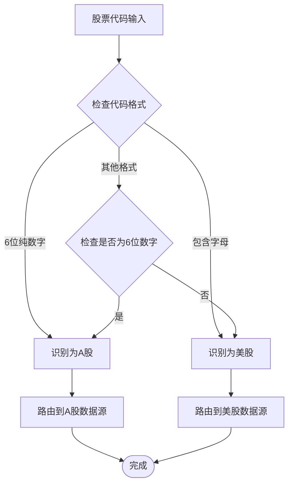

**图表来源**
- [backend/app/services/market_providers/akshare.py](file://backend/app/services/market_providers/akshare.py#L82-L84)

#### 双市场缓存策略

系统为A股和美股分别实现独立缓存：

- **A股缓存**：`_cached_spot_df` - 全市场A股快照
- **美股缓存**：`_cached_us_spot_df` - 美股著名股票快照
- **缓存有效期**：60秒（1分钟）
- **独立锁机制**：避免并发访问冲突

**章节来源**
- [backend/app/services/market_providers/akshare.py](file://backend/app/services/market_providers/akshare.py#L42-L49)
- [backend/app/services/market_providers/akshare.py](file://backend/app/services/market_providers/akshare.py#L92-L200)

### 代理绕过机制

**新增** AkShareProvider实现了代理绕过功能：

#### TLS隔离机制

系统使用线程本地存储(TLS)实现代理绕过：

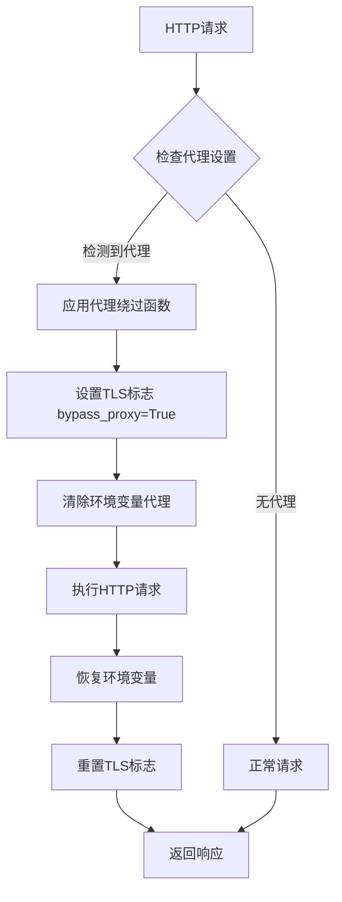

**图表来源**
- [backend/app/services/market_providers/akshare.py](file://backend/app/services/market_providers/akshare.py#L21-L37)
- [backend/app/services/market_providers/akshare.py](file://backend/app/services/market_providers/akshare.py#L57-L77)

#### 线程安全保证

系统确保代理绕过操作的线程安全性：

- **线程本地存储**：每个线程独立的代理状态
- **环境变量清理**：双重保险确保代理完全禁用
- **异常安全**：即使发生异常也能正确恢复环境状态

**章节来源**
- [backend/app/services/market_providers/akshare.py](file://backend/app/services/market_providers/akshare.py#L18-L37)
- [backend/app/services/market_providers/akshare.py](file://backend/app/services/market_providers/akshare.py#L57-L77)

## 依赖关系分析

### 外部依赖关系

系统的主要外部依赖包括：

```mermaid
graph TB
subgraph "Python包依赖"
YF[yfinance]
AK[akshare]
PD[pandas]
NP[numpy]
SQL[SQLAlchemy]
FAST[FastAPI]
HTTP[httpx]
REQ[requests]
END[aioredis]
SEMA[asyncio.Semaphore]
END
subgraph "系统内部模块"
BASE[MarketDataProvider]
FACT[ProviderFactory]
SERVICE[MarketDataService]
IND[TechnicalIndicators]
MODELS[数据模型]
SCHEMAS[数据模式]
end
YF --> BASE
AK --> BASE
PD --> IND
NP --> IND
SQL --> MODELS
FAST --> SERVICE
HTTP --> SERVICE
REQ --> AK
SEMA --> SERVICE
END --> SERVICE
BASE --> FACT
FACT --> SERVICE
SERVICE --> IND
SERVICE --> MODELS
SERVICE --> SCHEMAS
```

**图表来源**
- [backend/app/services/market_providers/yfinance.py](file://backend/app/services/market_providers/yfinance.py#L1-L17)
- [backend/app/services/market_providers/akshare.py](file://backend/app/services/market_providers/akshare.py#L1-L16)
- [backend/app/services/indicators.py](file://backend/app/services/indicators.py#L1-L5)

### 内部模块依赖

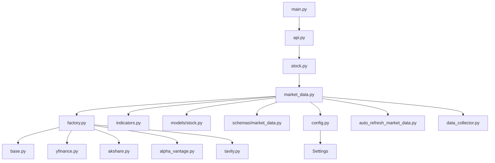

**图表来源**
- [backend/app/main.py](file://backend/app/main.py#L114-L117)
- [backend/app/api/v1/api.py](file://backend/app/api/v1/api.py#L1-L25)
- [backend/app/services/market_data.py](file://backend/app/services/market_data.py#L8-L11)

**章节来源**
- [backend/app/core/config.py](file://backend/app/core/config.py#L1-L28)
- [backend/app/api/v1/endpoints/stock.py](file://backend/app/api/v1/endpoints/stock.py#L1-L121)

## 性能考虑

### 并发优化策略

系统采用了多种并发优化策略来提升性能：

1. **异步IO处理**：所有网络请求都使用asyncio实现
2. **并行数据获取**：使用asyncio.gather并行获取多个数据源
3. **信号量控制**：使用asyncio.Semaphore限制并发数量
4. **超时保护**：设置15秒超时防止阻塞
5. **缓存机制**：数据库缓存和内存缓存双重保护
6. **批量处理**：支持批量刷新功能

**更新** 新增并发控制机制：
- **批量刷新并发限制**：默认限制为5个并发任务
- **后台任务调度**：自动刷新任务每5分钟运行一次
- **任务队列管理**：避免瞬时大量请求导致API限流
- **智能缓存并发控制**：使用异步锁保护共享缓存

### 缓存策略

系统实现了多层次的缓存策略：

- **数据库缓存**：MarketDataCache表存储实时数据
- **内存缓存**：AkShareProvider的类级缓存（A股和美股独立）
- **短期缓存**：默认1分钟缓存过期时间
- **全市场快照**：A股全市场数据的60秒缓存
- **美股快照**：著名美股股票的60秒缓存

### 错误处理和容错

系统具备完善的错误处理机制：

- **故障转移**：主数据源失败时自动切换
- **模拟模式**：网络隔离时生成模拟数据
- **降级策略**：部分数据获取失败时继续返回可用数据
- **超时处理**：防止单个数据源阻塞整体响应
- **异常恢复**：后台任务自动恢复失败的任务
- **代理绕过**：解决特定网络环境下的访问问题

**更新** 新增容错机制：
- **数据净化**：自动去除重复和异常数据
- **速率限制**：防止API滥用和限流
- **任务重试**：后台任务具备自动重试机制
- **智能路由**：自动选择最优数据源

## 故障排除指南

### 常见问题诊断

#### 数据获取失败

**症状**：API返回空数据或错误

**可能原因**：
1. API密钥配置错误
2. 网络连接问题
3. 数据源API限制
4. 股票代码格式错误
5. 速率限制触发
6. 代理绕过失败

**解决方案**：
1. 检查.env文件中的API密钥配置
2. 验证网络连接和代理设置
3. 查看API使用限制和配额
4. 确认股票代码格式正确
5. 等待速率限制解除或添加个人API密钥
6. 检查代理绕过功能是否正常工作

#### 性能问题

**症状**：API响应缓慢

**可能原因**：
1. 缓存未生效
2. 并发请求过多
3. 数据库查询慢
4. 技术指标计算复杂度高
5. 后台任务占用资源
6. 代理绕过导致性能下降

**解决方案**：
1. 检查缓存配置和过期时间
2. 调整并发数量限制
3. 优化数据库索引
4. 考虑简化技术指标计算
5. 监控后台任务执行情况
6. 检查代理绕过配置

#### 数据不一致

**症状**：不同数据源显示不同数据

**可能原因**：
1. 数据源更新时间不同
2. 数据格式转换差异
3. 缓存数据过期
4. API响应格式变化
5. 新闻重复数据
6. 智能路由错误

**解决方案**：
1. 统一数据源优先级
2. 标准化数据格式转换
3. 调整缓存过期策略
4. 监控API响应格式变化
5. 检查新闻去重机制
6. 验证智能路由逻辑

#### 并发问题

**症状**：批量刷新失败或响应异常

**可能原因**：
1. 并发数量超出限制
2. 信号量配置不当
3. 后台任务冲突
4. 资源竞争
5. 缓存锁冲突

**解决方案**：
1. 检查信号量配置（默认5个并发）
2. 监控后台任务执行状态
3. 调整并发参数
4. 检查系统资源使用情况
5. 检查缓存锁机制

#### 速率限制问题

**症状**：API请求被拒绝或返回429状态码

**可能原因**：
1. 免费用户使用次数超限
2. API密钥配置错误
3. 服务器端限流
4. 请求过于频繁
5. 缓存失效导致频繁请求

**解决方案**：
1. 添加个人API密钥
2. 检查API密钥配置
3. 等待限流期结束
4. 降低请求频率
5. 优化缓存策略

#### 代理绕过问题

**症状**：访问AkShare时出现网络错误

**可能原因**：
1. 代理绕过功能失效
2. 线程本地存储配置错误
3. 环境变量清理不彻底
4. 异常处理失败

**解决方案**：
1. 检查代理绕过函数是否正确应用
2. 验证线程本地存储配置
3. 确认环境变量清理过程
4. 检查异常处理逻辑

**章节来源**
- [backend/app/services/market_data.py](file://backend/app/services/market_data.py#L238-L266)
- [backend/app/services/market_providers/akshare.py](file://backend/app/services/market_providers/akshare.py#L48-L53)
- [backend/app/api/v1/endpoints/stock.py](file://backend/app/api/v1/endpoints/stock.py#L79-L123)
- [backend/app/api/v1/endpoints/analysis.py](file://backend/app/api/v1/endpoints/analysis.py#L217-L236)

## 结论

AI智能投资顾问系统的市场数据提供商架构展现了现代异步数据处理系统的最佳实践。通过抽象工厂模式实现了数据源的统一管理，通过多层缓存策略优化了性能，通过并发处理提升了用户体验。

**更新** 该架构现已显著增强：

### 主要优势

1. **高度模块化**：每个组件职责明确，易于维护和扩展
2. **双市场支持**：AkShare提供商支持A股和美股两个市场的数据获取
3. **智能路由机制**：自动识别股票类型并选择最优数据源
4. **强大的容错能力**：多重故障转移机制确保系统稳定性
5. **优秀的性能表现**：异步并发和缓存策略提供了良好的响应速度
6. **灵活的扩展性**：新的数据提供商可以轻松集成
7. **完善的监控机制**：详细的日志记录便于问题诊断
8. **数据质量保证**：通过净化机制确保数据准确性
9. **智能并发控制**：通过信号量和后台任务优化资源使用
10. **速率限制支持**：防止API滥用和限流问题
11. **代理绕过功能**：解决特定网络环境下的访问限制

### 新增功能亮点

- **双市场缓存策略**：为A股和美股分别实现独立缓存优化
- **智能路由机制**：自动识别A股和美股并选择相应数据源
- **代理绕过功能**：解决国内服务器访问AkShare的网络限制
- **数据净化机制**：通过MD5哈希实现新闻去重，提升数据质量
- **并发刷新能力**：支持批量数据同步和后台自动刷新
- **速率限制支持**：集成API密钥管理和使用限制
- **智能缓存策略**：多层次缓存优化系统性能
- **故障转移机制**：网络异常时提供模拟数据保证系统稳定

### 未来发展方向

- 增加更多的数据源支持
- 优化技术指标计算性能
- 增强AI搜索功能
- 扩展实时数据推送能力
- 实现更精细的速率限制控制
- 增强数据质量监控机制
- 改进智能路由算法
- 增强代理绕过功能的稳定性

该系统为AI智能投资顾问提供了坚实的数据基础设施，通过持续的功能增强和技术优化，能够更好地满足用户的投资决策需求。