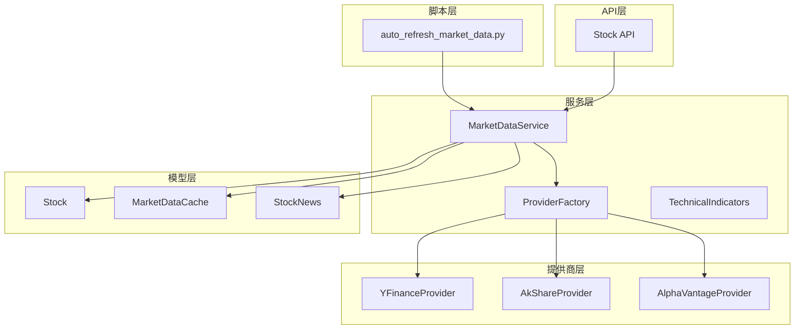
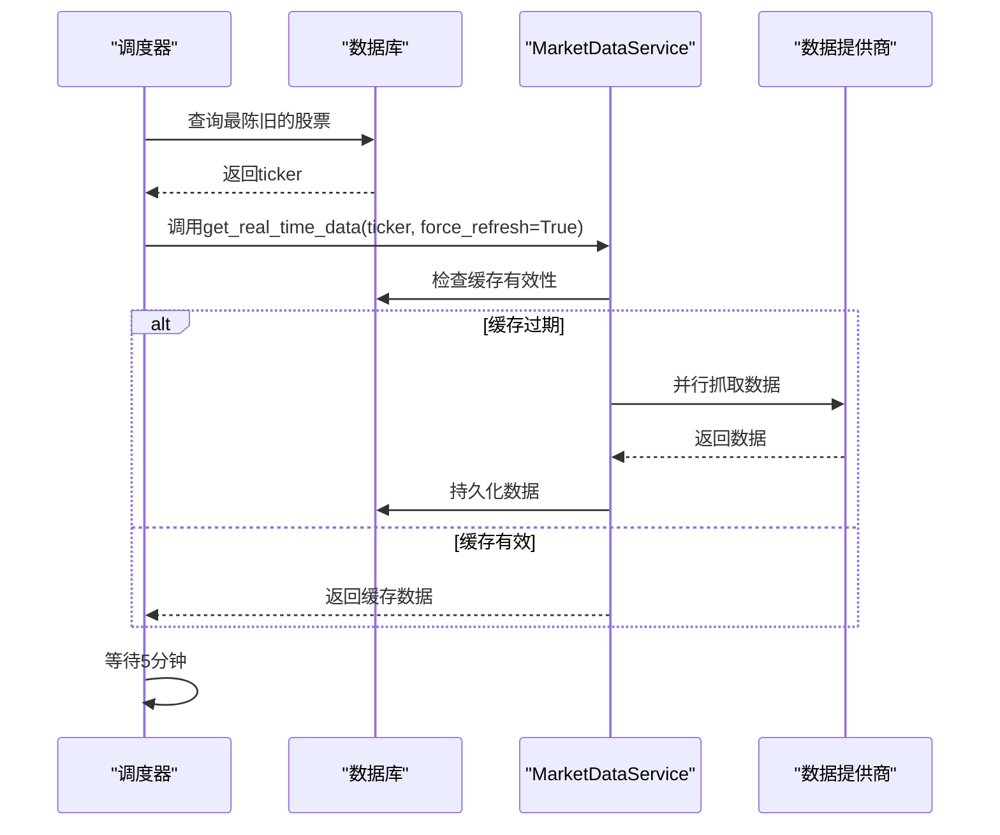
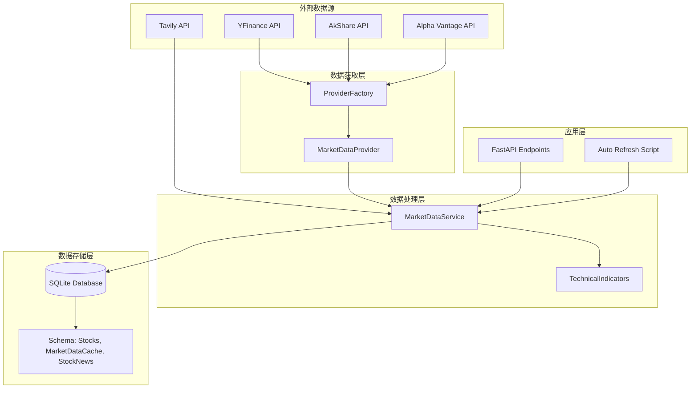
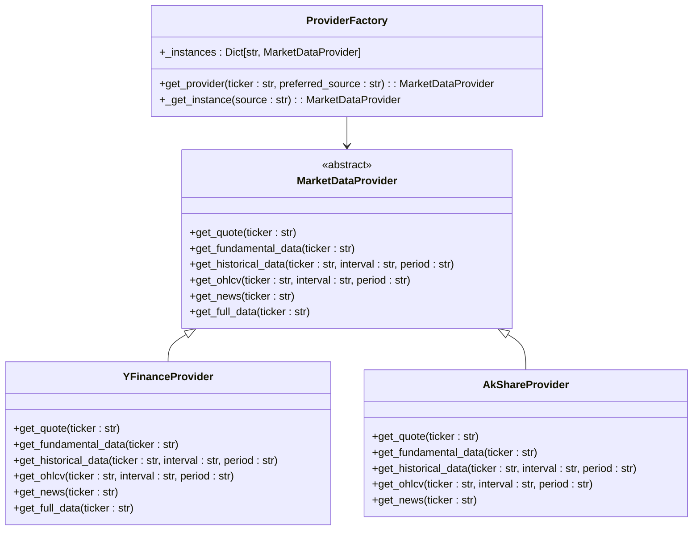
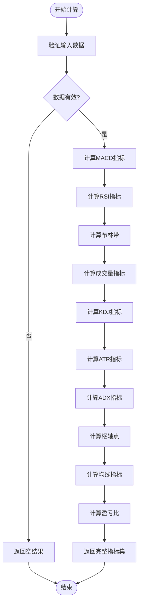
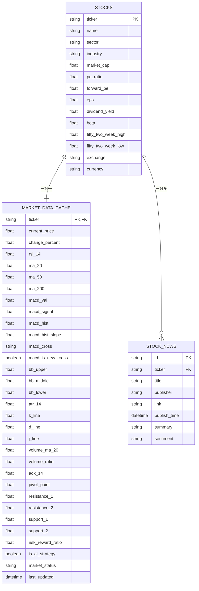
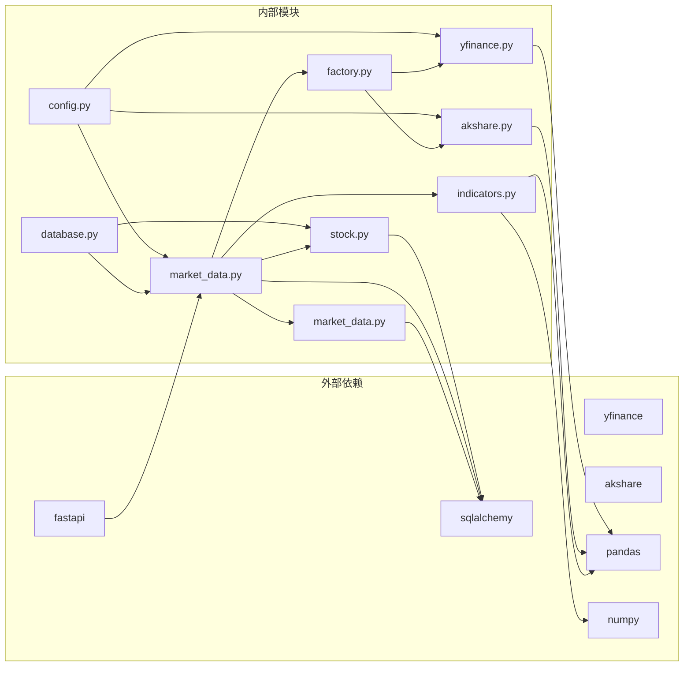
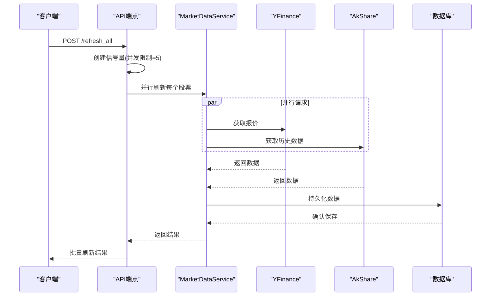

# 自动化市场数据刷新

<cite>
**本文档引用的文件**
- [auto_refresh_market_data.py](file://backend/scripts/auto_refresh_market_data.py)
- [market_data.py](file://backend/app/services/market_data.py)
- [factory.py](file://backend/app/services/market_providers/factory.py)
- [base.py](file://backend/app/services/market_providers/base.py)
- [yfinance.py](file://backend/app/services/market_providers/yfinance.py)
- [akshare.py](file://backend/app/services/market_providers/akshare.py)
- [stock.py](file://backend/app/models/stock.py)
- [market_data.py](file://backend/app/schemas/market_data.py)
- [indicators.py](file://backend/app/services/indicators.py)
- [stock.py](file://backend/app/api/v1/endpoints/stock.py)
- [config.py](file://backend/app/core/config.py)
- [main.py](file://backend/app/main.py)
</cite>

## 目录
1. [简介](#简介)
2. [项目结构](#项目结构)
3. [核心组件](#核心组件)
4. [架构概览](#架构概览)
5. [详细组件分析](#详细组件分析)
6. [依赖关系分析](#依赖关系分析)
7. [性能考虑](#性能考虑)
8. [故障排除指南](#故障排除指南)
9. [结论](#结论)

## 简介

本项目是一个AI驱动的智能投资顾问平台，专注于自动化市场数据刷新功能。系统实现了智能的后台数据刷新机制，能够自动检测最陈旧的股票数据并进行刷新，确保用户始终获得最新的市场信息。

该系统的核心特性包括：
- 基于时间戳的智能数据刷新策略
- 多数据源提供商支持（YFinance、AkShare、Alpha Vantage）
- 并发数据抓取和缓存管理
- 故障转移和模拟模式
- 支撑阻力位和盈亏比计算

## 项目结构

**图表来源**
- [auto_refresh_market_data.py](file://backend/scripts/auto_refresh_market_data.py#L1-L67)
- [market_data.py](file://backend/app/services/market_data.py#L1-L266)
- [factory.py](file://backend/app/services/market_providers/factory.py#L1-L51)

**章节来源**
- [auto_refresh_market_data.py](file://backend/scripts/auto_refresh_market_data.py#L1-L67)
- [market_data.py](file://backend/app/services/market_data.py#L1-L266)
- [factory.py](file://backend/app/services/market_providers/factory.py#L1-L51)

## 核心组件

### 自动刷新作业 (Auto Refresh Job)

自动刷新作业是系统的核心组件，负责定时检测和刷新最陈旧的股票数据。

**图表来源**
- [auto_refresh_market_data.py](file://backend/scripts/auto_refresh_market_data.py#L22-L60)
- [market_data.py](file://backend/app/services/market_data.py#L18-L57)

### 市场数据服务 (Market Data Service)

MarketDataService是数据处理的核心，负责协调多个数据源、处理缓存逻辑和并行抓取数据。

**章节来源**
- [market_data.py](file://backend/app/services/market_data.py#L17-L266)

## 架构概览

**图表来源**
- [factory.py](file://backend/app/services/market_providers/factory.py#L9-L51)
- [market_data.py](file://backend/app/services/market_data.py#L15-L266)
- [stock.py](file://backend/app/models/stock.py#L14-L105)

## 详细组件分析

### Provider 工厂模式

ProviderFactory实现了工厂模式，根据股票代码特征自动选择合适的数据提供商。

**图表来源**
- [factory.py](file://backend/app/services/market_providers/factory.py#L9-L51)
- [base.py](file://backend/app/services/market_providers/base.py#L6-L51)
- [yfinance.py](file://backend/app/services/market_providers/yfinance.py#L19-L286)
- [akshare.py](file://backend/app/services/market_providers/akshare.py#L40-L480)

**章节来源**
- [factory.py](file://backend/app/services/market_providers/factory.py#L11-L51)
- [base.py](file://backend/app/services/market_providers/base.py#L9-L51)

### 技术指标计算引擎

TechnicalIndicators提供了全面的技术指标计算功能，支持多种常用的金融技术分析指标。

**图表来源**
- [indicators.py](file://backend/app/services/indicators.py#L44-L192)

**章节来源**
- [indicators.py](file://backend/app/services/indicators.py#L7-L192)

### 数据模型架构

系统使用SQLAlchemy ORM定义了完整的数据模型，支持股票基本信息、实时数据缓存和相关新闻。

**图表来源**
- [stock.py](file://backend/app/models/stock.py#L14-L105)

**章节来源**
- [stock.py](file://backend/app/models/stock.py#L14-L105)

### API 端点集成

系统提供了RESTful API端点，支持历史数据查询和批量数据刷新功能。

**章节来源**
- [stock.py](file://backend/app/api/v1/endpoints/stock.py#L46-L121)

## 依赖关系分析

**图表来源**
- [config.py](file://backend/app/core/config.py#L1-L28)
- [market_data.py](file://backend/app/services/market_data.py#L1-L13)
- [yfinance.py](file://backend/app/services/market_providers/yfinance.py#L1-L16)
- [akshare.py](file://backend/app/services/market_providers/akshare.py#L1-L17)

**章节来源**
- [config.py](file://backend/app/core/config.py#L1-L28)
- [main.py](file://backend/app/main.py#L1-L129)

## 性能考虑

### 缓存策略

系统实现了多层次的缓存策略来优化性能：

1. **数据库缓存**：默认1分钟缓存有效期，避免频繁API调用
2. **内存缓存**：AkShare提供全市场快照的60秒内存缓存
3. **并发控制**：使用信号量限制同时进行的API请求数量

### 并发优化

**图表来源**
- [stock.py](file://backend/app/api/v1/endpoints/stock.py#L76-L121)
- [market_data.py](file://backend/app/services/market_data.py#L60-L115)

### 错误处理和故障转移

系统实现了完善的错误处理机制：

1. **超时保护**：15秒超时防止单个数据源阻塞
2. **故障转移**：主数据源失败时自动切换到备用提供商
3. **模拟模式**：网络隔离时生成随机波动数据维持UI完整性
4. **渐进式降级**：部分数据获取失败时仍返回可用数据

**章节来源**
- [market_data.py](file://backend/app/services/market_data.py#L86-L115)
- [yfinance.py](file://backend/app/services/market_providers/yfinance.py#L29-L34)

## 故障排除指南

### 常见问题诊断

1. **数据刷新不生效**
   - 检查自动刷新脚本是否正常运行
   - 验证数据库连接配置
   - 查看日志文件获取详细错误信息

2. **API请求超时**
   - 检查网络连接和代理设置
   - 调整超时参数
   - 验证API密钥有效性

3. **数据不一致**
   - 检查数据库事务处理
   - 验证并发访问控制
   - 确认缓存失效策略

### 日志监控

系统提供了详细的日志记录机制：

- **INFO级别**：正常操作和状态信息
- **WARNING级别**：潜在问题和警告
- **ERROR级别**：错误和异常情况
- **DEBUG级别**：详细调试信息

**章节来源**
- [auto_refresh_market_data.py](file://backend/scripts/auto_refresh_market_data.py#L15-L20)
- [market_data.py](file://backend/app/services/market_data.py#L13-L13)

## 结论

该自动化市场数据刷新系统展现了现代金融数据处理的最佳实践：

### 核心优势

1. **智能化刷新策略**：基于数据时效性的智能检测机制
2. **多源数据整合**：支持多种数据提供商的灵活切换
3. **高性能并发处理**：优化的并发控制和缓存策略
4. **健壮的错误处理**：完善的故障转移和降级机制
5. **可扩展架构**：模块化的组件设计便于功能扩展

### 技术亮点

- **工厂模式**：灵活的数据提供商选择机制
- **技术指标引擎**：全面的量化分析支持
- **缓存优化**：多层次的缓存策略提升性能
- **并发控制**：智能的并发限制防止API限制
- **故障转移**：可靠的备用数据源保障

该系统为AI驱动的投资决策提供了坚实的数据基础设施，通过自动化和智能化的数据处理确保用户能够及时获得准确的市场信息。