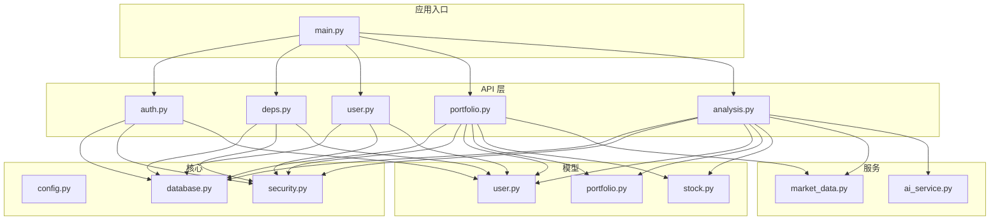
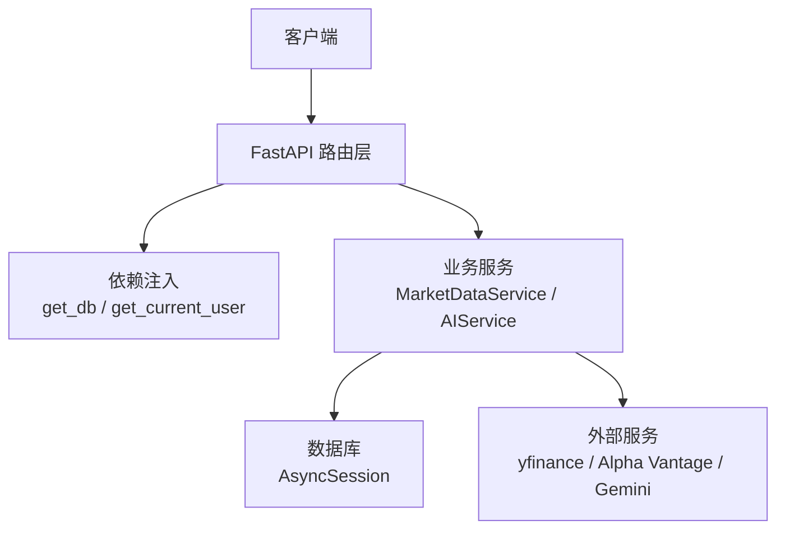
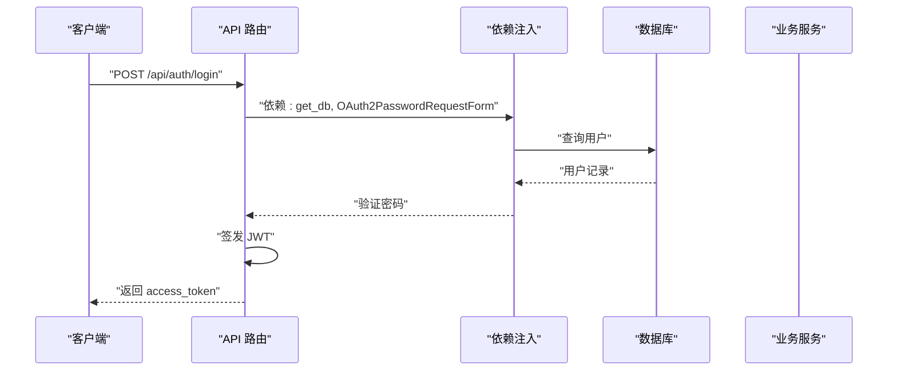
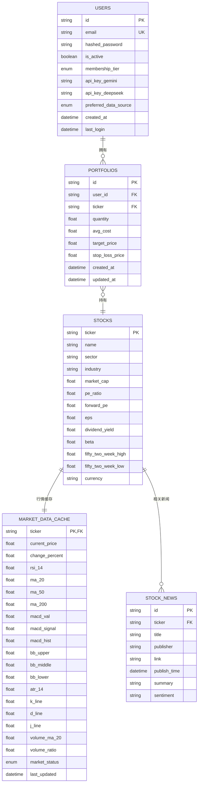
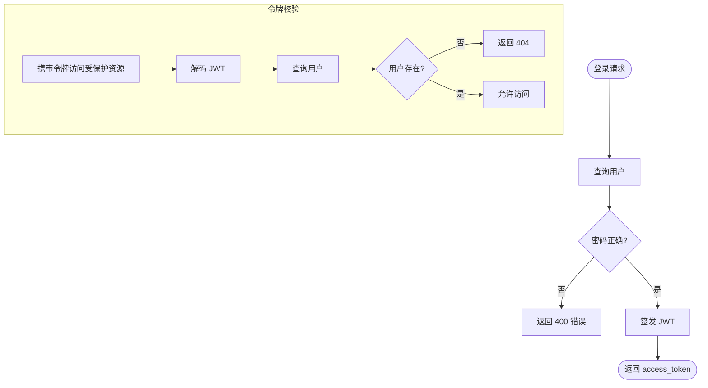
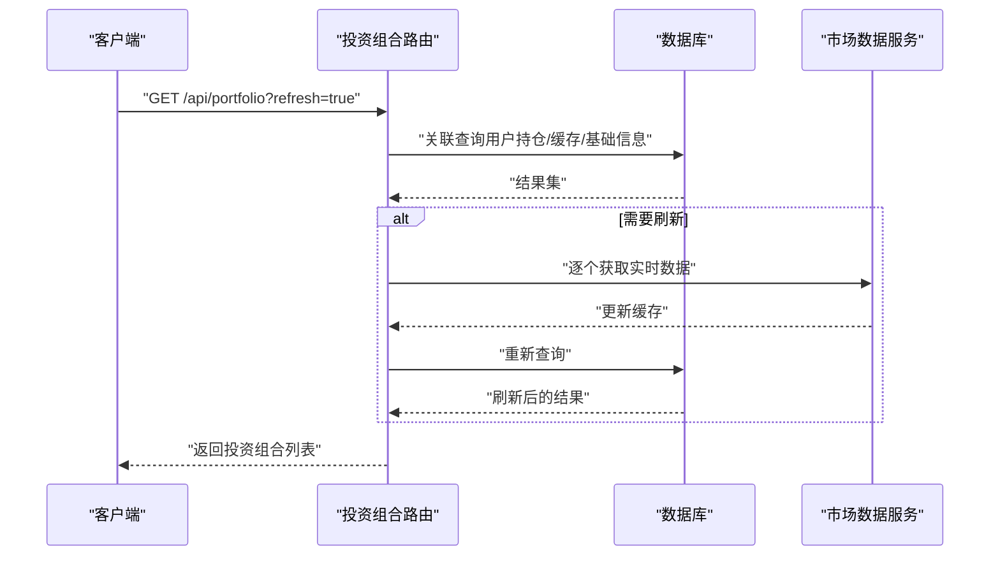
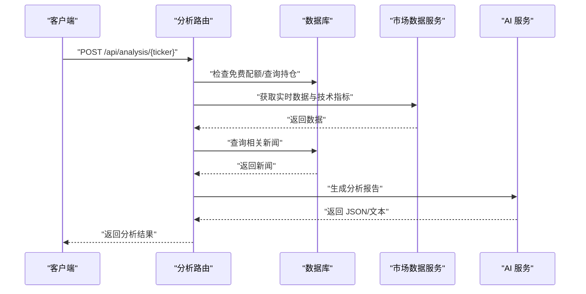
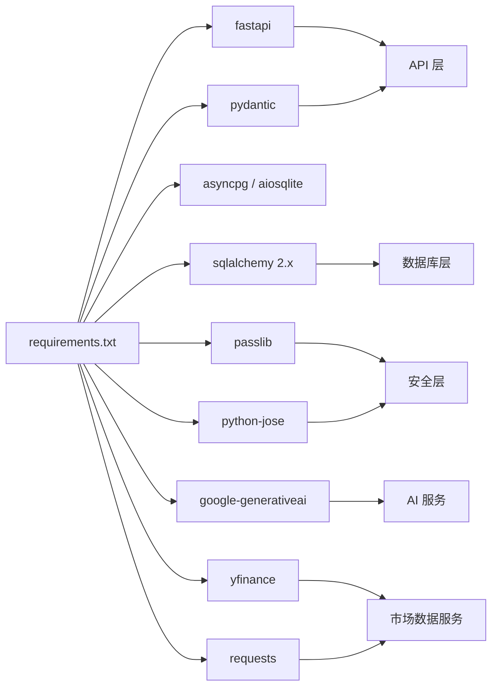

# 后端开发指南

<cite>
**本文档引用的文件**
- [backend/app/main.py](file://backend/app/main.py)
- [backend/app/core/config.py](file://backend/app/core/config.py)
- [backend/app/core/database.py](file://backend/app/core/database.py)
- [backend/app/core/security.py](file://backend/app/core/security.py)
- [backend/app/api/auth.py](file://backend/app/api/auth.py)
- [backend/app/api/deps.py](file://backend/app/api/deps.py)
- [backend/app/api/user.py](file://backend/app/api/user.py)
- [backend/app/api/portfolio.py](file://backend/app/api/portfolio.py)
- [backend/app/api/analysis.py](file://backend/app/api/analysis.py)
- [backend/app/models/user.py](file://backend/app/models/user.py)
- [backend/app/models/portfolio.py](file://backend/app/models/portfolio.py)
- [backend/app/models/stock.py](file://backend/app/models/stock.py)
- [backend/app/services/ai_service.py](file://backend/app/services/ai_service.py)
- [backend/app/services/market_data.py](file://backend/app/services/market_data.py)
- [backend/requirements.txt](file://backend/requirements.txt)
</cite>

## 目录
1. [简介](#简介)
2. [项目结构](#项目结构)
3. [核心组件](#核心组件)
4. [架构总览](#架构总览)
5. [详细组件分析](#详细组件分析)
6. [依赖关系分析](#依赖关系分析)
7. [性能考虑](#性能考虑)
8. [故障排查指南](#故障排查指南)
9. [结论](#结论)
10. [附录](#附录)

## 简介
本指南面向后端开发者，系统性讲解基于 FastAPI 的 AI 股票顾问后端开发要点，涵盖路由设计、依赖注入、数据库模型与关系映射、API 设计与错误处理、业务逻辑（认证、投资组合管理、AI 分析）、代码组织与命名约定、开发与调试、性能优化、异步并发策略以及测试最佳实践。目标是帮助团队快速上手并高质量交付。

## 项目结构
后端采用按功能分层的模块化组织方式：
- 应用入口与路由聚合：app/main.py
- 核心配置与数据库：app/core/config.py、app/core/database.py、app/core/security.py
- API 层：app/api/{auth, deps, user, portfolio, analysis}
- 数据模型：app/models/{user, portfolio, stock, analysis}
- 服务层：app/services/{ai_service, market_data}
- 依赖声明：backend/requirements.txt

图表来源
- [backend/app/main.py](file://backend/app/main.py#L1-L38)
- [backend/app/api/auth.py](file://backend/app/api/auth.py#L1-L88)
- [backend/app/api/deps.py](file://backend/app/api/deps.py#L1-L44)
- [backend/app/api/user.py](file://backend/app/api/user.py#L1-L48)
- [backend/app/api/portfolio.py](file://backend/app/api/portfolio.py#L1-L297)
- [backend/app/api/analysis.py](file://backend/app/api/analysis.py#L1-L124)
- [backend/app/core/config.py](file://backend/app/core/config.py#L1-L24)
- [backend/app/core/database.py](file://backend/app/core/database.py#L1-L24)
- [backend/app/core/security.py](file://backend/app/core/security.py#L1-L26)
- [backend/app/models/user.py](file://backend/app/models/user.py#L1-L31)
- [backend/app/models/portfolio.py](file://backend/app/models/portfolio.py#L1-L26)
- [backend/app/models/stock.py](file://backend/app/models/stock.py#L1-L85)
- [backend/app/services/market_data.py](file://backend/app/services/market_data.py#L1-L370)
- [backend/app/services/ai_service.py](file://backend/app/services/ai_service.py#L1-L112)

章节来源
- [backend/app/main.py](file://backend/app/main.py#L1-L38)
- [backend/requirements.txt](file://backend/requirements.txt#L1-L75)

## 核心组件
- 应用入口与路由聚合：定义 FastAPI 实例、CORS 中间件、根路径与健康检查，并挂载各模块路由。
- 配置中心：集中管理数据库连接、安全密钥、外部 API 密钥与代理设置。
- 数据库与会话：基于 SQLAlchemy 2.x 异步引擎与 AsyncSession，提供 get_db 依赖。
- 安全与认证：密码哈希、JWT 签发与校验、OAuth2 密码流令牌端点。
- API 层：认证、用户、投资组合、分析等业务路由，统一使用依赖注入获取数据库会话与当前用户。
- 模型层：用户、投资组合、股票与行情缓存、新闻等实体与关系。
- 服务层：市场数据服务（yfinance/Alpha Vantage/模拟回退）、AI 分析服务（Gemini）。

章节来源
- [backend/app/main.py](file://backend/app/main.py#L1-L38)
- [backend/app/core/config.py](file://backend/app/core/config.py#L1-L24)
- [backend/app/core/database.py](file://backend/app/core/database.py#L1-L24)
- [backend/app/core/security.py](file://backend/app/core/security.py#L1-L26)
- [backend/app/api/auth.py](file://backend/app/api/auth.py#L1-L88)
- [backend/app/api/deps.py](file://backend/app/api/deps.py#L1-L44)
- [backend/app/api/user.py](file://backend/app/api/user.py#L1-L48)
- [backend/app/api/portfolio.py](file://backend/app/api/portfolio.py#L1-L297)
- [backend/app/api/analysis.py](file://backend/app/api/analysis.py#L1-L124)
- [backend/app/models/user.py](file://backend/app/models/user.py#L1-L31)
- [backend/app/models/portfolio.py](file://backend/app/models/portfolio.py#L1-L26)
- [backend/app/models/stock.py](file://backend/app/models/stock.py#L1-L85)
- [backend/app/services/market_data.py](file://backend/app/services/market_data.py#L1-L370)
- [backend/app/services/ai_service.py](file://backend/app/services/ai_service.py#L1-L112)

## 架构总览
系统采用“API 层 → 服务层 → 数据层”的分层架构，配合依赖注入与异步数据库访问，实现高内聚低耦合。

图表来源
- [backend/app/main.py](file://backend/app/main.py#L24-L29)
- [backend/app/api/deps.py](file://backend/app/api/deps.py#L17-L44)
- [backend/app/core/database.py](file://backend/app/core/database.py#L21-L24)
- [backend/app/services/market_data.py](file://backend/app/services/market_data.py#L13-L170)
- [backend/app/services/ai_service.py](file://backend/app/services/ai_service.py#L43-L112)

## 详细组件分析

### 路由与依赖注入
- 路由设计原则
  - 按资源分组：/api/auth、/api/user、/api/portfolio、/api/analysis。
  - 统一前缀与标签，便于 OpenAPI 文档与前端对接。
  - 使用 Pydantic 模型进行请求/响应建模，确保类型安全与自动校验。
- 依赖注入
  - get_db 提供 AsyncSession，贯穿所有 API。
  - reusable_oauth2 与 get_current_user 实现 JWT 认证中间件，自动解析并校验令牌，解析当前用户。
  - 通过 Depends 组合依赖，保证鉴权与数据访问的一致性。

图表来源
- [backend/app/api/auth.py](file://backend/app/api/auth.py#L24-L50)
- [backend/app/api/deps.py](file://backend/app/api/deps.py#L17-L44)
- [backend/app/core/database.py](file://backend/app/core/database.py#L21-L24)

章节来源
- [backend/app/main.py](file://backend/app/main.py#L24-L29)
- [backend/app/api/deps.py](file://backend/app/api/deps.py#L1-L44)
- [backend/app/api/auth.py](file://backend/app/api/auth.py#L1-L88)

### 数据库模型与关系映射
- 用户模型：支持会员等级、首选数据源、加密存储的第三方 API Key。
- 投资组合模型：用户与股票多对一关系，唯一约束 user_id + ticker。
- 股票与行情缓存：一对一关系，缓存技术指标与市场状态；股票与新闻一对多级联删除。
- 关系映射：通过 SQLAlchemy relationship 声明，便于跨表查询与更新。

图表来源
- [backend/app/models/user.py](file://backend/app/models/user.py#L15-L31)
- [backend/app/models/stock.py](file://backend/app/models/stock.py#L13-L85)
- [backend/app/models/portfolio.py](file://backend/app/models/portfolio.py#L7-L26)

章节来源
- [backend/app/models/user.py](file://backend/app/models/user.py#L1-L31)
- [backend/app/models/portfolio.py](file://backend/app/models/portfolio.py#L1-L26)
- [backend/app/models/stock.py](file://backend/app/models/stock.py#L1-L85)

### 认证与安全
- 密码处理：bcrypt 哈希，提供 verify_password 与 get_password_hash。
- JWT 签发：create_access_token 支持自定义过期时间，默认 24 小时。
- 认证流程：OAuth2 密码流，令牌校验失败抛出 403，用户不存在抛出 404。
- 安全配置：密钥、算法、过期时间集中于 Settings。

图表来源
- [backend/app/api/auth.py](file://backend/app/api/auth.py#L24-L50)
- [backend/app/api/deps.py](file://backend/app/api/deps.py#L17-L44)
- [backend/app/core/security.py](file://backend/app/core/security.py#L11-L26)

章节来源
- [backend/app/core/security.py](file://backend/app/core/security.py#L1-L26)
- [backend/app/api/auth.py](file://backend/app/api/auth.py#L1-L88)
- [backend/app/api/deps.py](file://backend/app/api/deps.py#L1-L44)

### 投资组合管理
- 搜索股票：本地模糊搜索 + 可选远程 yfinance 快速校验，自动补全缺失条目。
- 获取投资组合：一次性关联查询缓存与基础信息，支持刷新（顺序拉取避免并发问题）。
- 新增/更新：去重约束，新增项后台异步拉取技术指标。
- 删除：按用户与标的删除。

图表来源
- [backend/app/api/portfolio.py](file://backend/app/api/portfolio.py#L143-L224)
- [backend/app/services/market_data.py](file://backend/app/services/market_data.py#L13-L170)

章节来源
- [backend/app/api/portfolio.py](file://backend/app/api/portfolio.py#L1-L297)
- [backend/app/services/market_data.py](file://backend/app/services/market_data.py#L1-L370)

### AI 分析服务
- 限流与配额：免费用户按日限制（默认 3 次），可通过在设置中添加自有 Gemini Key 解除限制。
- 上下文构建：市场数据（价格、涨跌幅、技术指标）、新闻、用户持仓（成本、数量、未实现盈亏）。
- AI 生成：优先使用用户自有 Key，否则降级提示或返回模拟内容；JSON 模式失败时回退纯文本。

图表来源
- [backend/app/api/analysis.py](file://backend/app/api/analysis.py#L13-L124)
- [backend/app/services/ai_service.py](file://backend/app/services/ai_service.py#L43-L112)
- [backend/app/services/market_data.py](file://backend/app/services/market_data.py#L13-L170)

章节来源
- [backend/app/api/analysis.py](file://backend/app/api/analysis.py#L1-L124)
- [backend/app/services/ai_service.py](file://backend/app/services/ai_service.py#L1-L112)

### 用户与设置
- 个人信息：返回用户标识、邮箱、会员等级、是否配置第三方 Key、首选数据源。
- 设置更新：支持更新 Gemini/DeepSeek Key 与首选数据源，提交后立即生效。

章节来源
- [backend/app/api/user.py](file://backend/app/api/user.py#L1-L48)
- [backend/app/models/user.py](file://backend/app/models/user.py#L1-L31)

## 依赖关系分析
- 外部依赖：FastAPI、SQLAlchemy 2.x、asyncpg/aiosqlite、Pydantic、Passlib、python-jose、google-generativeai、yfinance、requests。
- 内部依赖：API 层依赖 core（config、database、security）与 models；服务层依赖 models 与 core；analysis 路由同时依赖两个服务。

图表来源
- [backend/requirements.txt](file://backend/requirements.txt#L1-L75)

章节来源
- [backend/requirements.txt](file://backend/requirements.txt#L1-L75)

## 性能考虑
- 异步数据库：使用 AsyncSession 与异步引擎，减少阻塞；SQLite 场景注意串行刷新以避免并发问题。
- 缓存与回退：行情缓存 1 分钟内命中；无可用数据时使用模拟数据维持体验。
- 限流与配额：免费用户每日限制，避免外部 API 费用与限流风险。
- 并发与超时：外部请求设置超时与重试，yfinance 429 时指数退避；必要时使用线程池执行阻塞调用。
- 批量与关联查询：投资组合一次性 JOIN 查询，减少往返；后台任务异步拉取指标，不阻塞主响应。

章节来源
- [backend/app/api/portfolio.py](file://backend/app/api/portfolio.py#L162-L174)
- [backend/app/services/market_data.py](file://backend/app/services/market_data.py#L22-L86)
- [backend/app/api/analysis.py](file://backend/app/api/analysis.py#L27-L50)

## 故障排查指南
- 认证失败
  - 检查令牌格式与签名密钥；确认用户存在且未被禁用。
  - 参考：[backend/app/api/deps.py](file://backend/app/api/deps.py#L21-L43)
- 登录失败
  - 核对邮箱与密码；确认用户已存在且密码哈希匹配。
  - 参考：[backend/app/api/auth.py](file://backend/app/api/auth.py#L33-L43)
- 数据库连接
  - 检查 DATABASE_URL 与驱动；SQLite 在 Windows/macOS 下 connect_args 差异。
  - 参考：[backend/app/core/database.py](file://backend/app/core/database.py#L5-L9)
- 外部 API 限流
  - yfinance 429 时自动退避；检查代理配置与网络连通性。
  - 参考：[backend/app/services/market_data.py](file://backend/app/services/market_data.py#L305-L317)
- AI 分析失败
  - 检查 GEMINI_API_KEY；无 Key 时返回模拟内容或错误提示。
  - 参考：[backend/app/services/ai_service.py](file://backend/app/services/ai_service.py#L47-L51)

章节来源
- [backend/app/api/deps.py](file://backend/app/api/deps.py#L1-L44)
- [backend/app/api/auth.py](file://backend/app/api/auth.py#L1-L88)
- [backend/app/core/database.py](file://backend/app/core/database.py#L1-L24)
- [backend/app/services/market_data.py](file://backend/app/services/market_data.py#L1-L370)
- [backend/app/services/ai_service.py](file://backend/app/services/ai_service.py#L1-L112)

## 结论
本项目以 FastAPI 为核心，结合 SQLAlchemy 异步 ORM、JWT 认证与清晰的服务分层，实现了从用户管理、投资组合到 AI 分析的完整闭环。通过依赖注入与统一的路由设计，系统具备良好的可维护性与扩展性。建议在生产环境中进一步完善监控、日志与测试覆盖，并持续优化外部 API 的稳定性与成本控制。

## 附录

### 开发环境配置
- 安装依赖：使用 requirements.txt。
- 环境变量：参考 .env.example，设置数据库 URL、密钥与代理。
- 启动服务：使用 uvicorn 运行 app.main:app。

章节来源
- [backend/requirements.txt](file://backend/requirements.txt#L1-L75)
- [backend/app/core/config.py](file://backend/app/core/config.py#L1-L24)
- [backend/app/main.py](file://backend/app/main.py#L1-L38)

### 调试技巧
- 打印调试：依赖注入与认证中间件包含调试输出，便于定位令牌与用户解析问题。
- 外部 API 调试：开启 HTTP_PROXY 观察请求头与响应；对 yfinance 429 场景增加等待与重试。
- 数据库调试：开启 echo 查看 SQL 输出，定位慢查询与重复查询。

章节来源
- [backend/app/api/deps.py](file://backend/app/api/deps.py#L22-L29)
- [backend/app/core/database.py](file://backend/app/core/database.py#L7-L8)
- [backend/app/services/market_data.py](file://backend/app/services/market_data.py#L189-L192)

### 单元测试与集成测试最佳实践
- 单元测试
  - 对独立函数（如密码哈希、JWT 签发、工具函数）编写最小化测试，覆盖边界条件。
  - 使用内存数据库或临时数据库隔离测试。
- 集成测试
  - 使用 FastAPI TestClient 测试路由行为，覆盖鉴权、参数校验、异常分支。
  - 对外部 API 调用进行 Mock 或使用回放数据，避免真实网络依赖。
- 性能测试
  - 使用异步压测工具评估数据库与外部 API 的吞吐；关注缓存命中率与限流策略。

[本节为通用指导，无需特定文件引用]