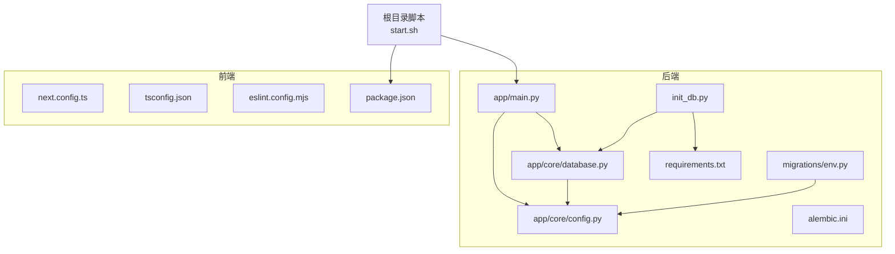
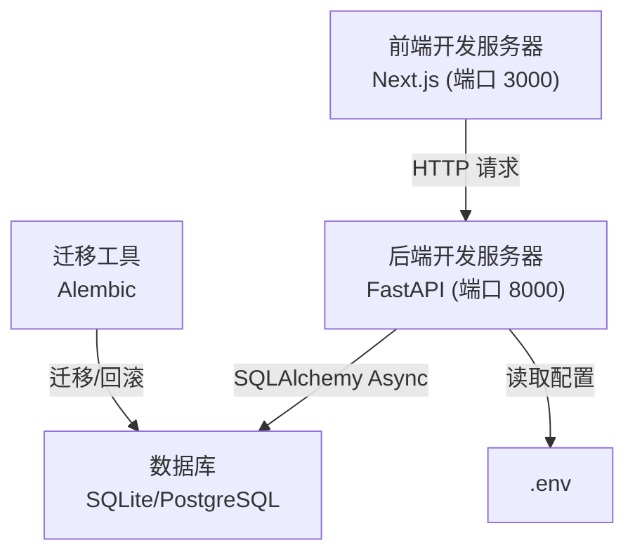
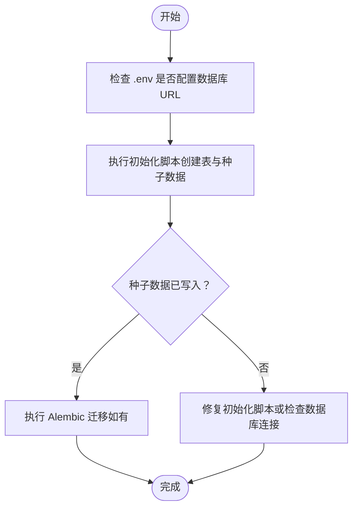
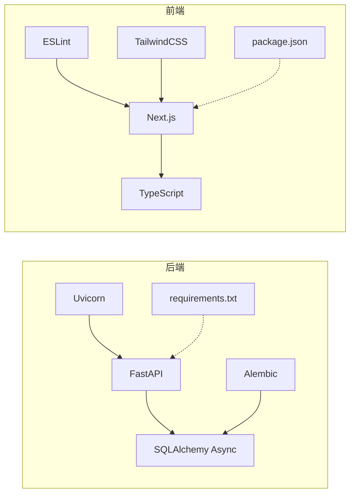

# 开发环境配置

<cite>
**本文引用的文件**
- [README.md](file://README.md)
- [start.sh](file://start.sh)
- [.env.example](file://.env.example)
- [backend/requirements.txt](file://backend/requirements.txt)
- [backend/app/core/config.py](file://backend/app/core/config.py)
- [backend/app/main.py](file://backend/app/main.py)
- [backend/app/core/database.py](file://backend/app/core/database.py)
- [backend/migrations/env.py](file://backend/migrations/env.py)
- [backend/alembic.ini](file://backend/alembic.ini)
- [backend/init_db.py](file://backend/init_db.py)
- [frontend/package.json](file://frontend/package.json)
- [frontend/tsconfig.json](file://frontend/tsconfig.json)
- [frontend/eslint.config.mjs](file://frontend/eslint.config.mjs)
- [frontend/next.config.ts](file://frontend/next.config.ts)
- [doc/tech_stack.md](file://doc/tech_stack.md)
- [doc/PRD.md](file://doc/PRD.md)
</cite>

## 目录
1. [简介](#简介)
2. [项目结构](#项目结构)
3. [核心组件](#核心组件)
4. [架构总览](#架构总览)
5. [详细组件分析](#详细组件分析)
6. [依赖分析](#依赖分析)
7. [性能考量](#性能考量)
8. [故障排查指南](#故障排查指南)
9. [结论](#结论)
10. [附录](#附录)

## 简介
本指南面向首次参与开发的工程师，提供从零开始搭建与运行本项目的开发环境配置方案。内容覆盖：
- Python 后端虚拟环境与依赖安装
- 环境变量配置（数据库、API 密钥、应用设置）
- 数据库初始化（表结构创建与种子数据）
- 前端开发工具链与代码质量工具
- Git 工作流与分支管理建议
- 本地开发服务器启动与热重载
- 常见问题排查与调试技巧

## 项目结构
项目采用前后端分离架构，后端使用 FastAPI + SQLAlchemy Async + Alembic 迁移，前端使用 Next.js 16 + TypeScript + ESLint/TailwindCSS。根目录提供一键启动脚本，便于同时启动前后端服务。

图表来源
- [backend/app/main.py](file://backend/app/main.py#L1-L87)
- [backend/app/core/config.py](file://backend/app/core/config.py#L1-L25)
- [backend/app/core/database.py](file://backend/app/core/database.py#L1-L24)
- [backend/migrations/env.py](file://backend/migrations/env.py#L1-L93)
- [backend/alembic.ini](file://backend/alembic.ini#L1-L148)
- [backend/init_db.py](file://backend/init_db.py#L1-L85)
- [backend/requirements.txt](file://backend/requirements.txt#L1-L75)
- [frontend/next.config.ts](file://frontend/next.config.ts#L1-L8)
- [frontend/tsconfig.json](file://frontend/tsconfig.json#L1-L43)
- [frontend/eslint.config.mjs](file://frontend/eslint.config.mjs#L1-L19)
- [frontend/package.json](file://frontend/package.json#L1-L43)
- [start.sh](file://start.sh#L1-L44)

章节来源
- [README.md](file://README.md#L1-L50)
- [doc/tech_stack.md](file://doc/tech_stack.md#L1-L51)

## 核心组件
- 后端配置与路由
  - 应用入口与中间件、CORS、路由挂载与健康检查等逻辑集中在应用入口文件中。
  - 配置读取通过 Pydantic Settings 从 .env 文件加载，支持数据库、密钥、代理等参数。
- 数据库与迁移
  - 使用 SQLAlchemy Async 引擎与异步会话；Alembic 通过 env.py 读取配置并执行在线/离线迁移。
  - 提供初始化脚本创建表并填充基础股票清单。
- 前端开发工具链
  - Next.js 16 + TypeScript 严格模式；ESLint 配置遵循 Next.js 推荐；TailwindCSS 作为样式基础。
  - 构建、开发、启动脚本与依赖在 package.json 中定义。

章节来源
- [backend/app/main.py](file://backend/app/main.py#L1-L87)
- [backend/app/core/config.py](file://backend/app/core/config.py#L1-L25)
- [backend/app/core/database.py](file://backend/app/core/database.py#L1-L24)
- [backend/migrations/env.py](file://backend/migrations/env.py#L1-L93)
- [backend/init_db.py](file://backend/init_db.py#L1-L85)
- [frontend/package.json](file://frontend/package.json#L1-L43)
- [frontend/tsconfig.json](file://frontend/tsconfig.json#L1-L43)
- [frontend/eslint.config.mjs](file://frontend/eslint.config.mjs#L1-L19)

## 架构总览
下图展示了开发环境中的关键交互：前端通过 Next.js 开发服务器访问后端 FastAPI，后端通过 SQLAlchemy Async 访问数据库，Alembic 负责数据库迁移。

图表来源
- [backend/app/main.py](file://backend/app/main.py#L55-L71)
- [backend/app/core/database.py](file://backend/app/core/database.py#L1-L24)
- [backend/migrations/env.py](file://backend/migrations/env.py#L1-L93)
- [backend/alembic.ini](file://backend/alembic.ini#L1-L148)
- [.env.example](file://.env.example#L1-L10)

## 详细组件分析

### Python 环境搭建与依赖安装
- 创建虚拟环境（推荐）
  - 在后端目录创建并激活虚拟环境，确保隔离依赖。
- 安装依赖
  - 使用 requirements.txt 安装后端所需包，包括 FastAPI、SQLAlchemy Async、Alembic、Uvicorn 等。
- 启动后端
  - 使用 Uvicorn 启动应用，启用热重载以提升开发效率。

章节来源
- [README.md](file://README.md#L14-L31)
- [backend/requirements.txt](file://backend/requirements.txt#L1-L75)

### 环境变量配置
- 配置文件位置
  - 后端通过 Pydantic Settings 从 .env 文件加载配置，配置类中声明了数据库连接、密钥、算法与过期时间等字段。
- 关键变量说明
  - 数据库连接：用于 SQLAlchemy Async 引擎初始化。
  - API 密钥：Gemini、DeepSeek、Alpha Vantage 等，用于外部服务调用。
  - 安全相关：SECRET_KEY、ALGORITHM、ACCESS_TOKEN_EXPIRE_MINUTES、ENCRYPTION_KEY。
  - HTTP 代理：可选，用于网络受限场景。
- 示例模板
  - 参考根目录示例文件，按需填写各变量。

章节来源
- [backend/app/core/config.py](file://backend/app/core/config.py#L1-L25)
- [.env.example](file://.env.example#L1-L10)

### 数据库初始化与迁移
- 初始化脚本
  - 初始化脚本创建所有表并插入基础股票清单，适合本地开发快速起步。
- 迁移配置
  - Alembic 通过 env.py 读取配置中的数据库 URL 并执行在线/离线迁移。
  - alembic.ini 提供迁移脚本路径、日志级别、钩子等配置项。
- 执行步骤建议
  - 先运行初始化脚本创建表与种子数据，再根据需要执行迁移以保持结构演进。

图表来源
- [backend/init_db.py](file://backend/init_db.py#L61-L85)
- [backend/migrations/env.py](file://backend/migrations/env.py#L22-L32)
- [backend/alembic.ini](file://backend/alembic.ini#L84-L87)

章节来源
- [backend/init_db.py](file://backend/init_db.py#L1-L85)
- [backend/migrations/env.py](file://backend/migrations/env.py#L1-L93)
- [backend/alembic.ini](file://backend/alembic.ini#L1-L148)

### 前端开发工具与代码质量
- 依赖与脚本
  - 依赖 Next.js、React、Axios、TailwindCSS、ESLint、TypeScript 等。
  - 脚本包括 dev/build/start/lint，分别对应开发、构建、启动与代码检查。
- TypeScript 严格模式
  - tsconfig.json 启用严格模式与 bundler 解析，确保类型安全。
- ESLint 配置
  - 使用 Next.js 推荐规则并自定义忽略项，保证一致的代码风格。
- TailwindCSS
  - 作为样式基础，结合 shadcn/ui 组件库实现 UI 快速搭建。

章节来源
- [frontend/package.json](file://frontend/package.json#L1-L43)
- [frontend/tsconfig.json](file://frontend/tsconfig.json#L1-L43)
- [frontend/eslint.config.mjs](file://frontend/eslint.config.mjs#L1-L19)
- [frontend/next.config.ts](file://frontend/next.config.ts#L1-L8)

### 本地开发服务器启动与热重载
- 一键启动
  - 根目录脚本会检测 Node.js 与 Python3，自动安装依赖并并行启动前端与后端服务，端口分别为 3000 与 8000。
- 手动启动
  - 后端：进入后端目录，激活虚拟环境，安装依赖后使用 Uvicorn 启动并开启热重载。
  - 前端：进入前端目录，安装依赖后使用 Next.js 开发服务器启动。

章节来源
- [start.sh](file://start.sh#L1-L44)
- [README.md](file://README.md#L7-L43)

### Git 工作流程与分支管理
- 建议流程
  - 从主分支（如 main）拉出特性分支进行开发，完成后提交 Pull Request 并合并。
- 分支命名
  - 使用清晰语义的命名，例如 feature/xxx、fix/xxx、docs/xxx。
- 提交规范
  - 提交信息简洁明确，描述变更目的与影响范围。
- 冲突解决
  - 合并前先同步上游分支，解决冲突后再发起 PR。

（本节为通用实践建议，不直接分析具体文件）

### 代码质量工具设置
- 后端
  - Alembic 配置中提供了迁移脚本的格式化与静态分析钩子（如 Black、Ruff），可在迁移脚本生成后自动执行。
- 前端
  - ESLint 已集成 Next.js 推荐规则，可通过脚本统一执行代码检查与修复。
- 建议
  - 在 CI 中加入 lint 与类型检查步骤，确保代码质量一致性。

章节来源
- [backend/alembic.ini](file://backend/alembic.ini#L95-L111)
- [frontend/eslint.config.mjs](file://frontend/eslint.config.mjs#L1-L19)
- [frontend/package.json](file://frontend/package.json#L5-L10)

## 依赖分析
后端与前端的关键依赖与耦合关系如下：

图表来源
- [backend/requirements.txt](file://backend/requirements.txt#L1-L75)
- [frontend/package.json](file://frontend/package.json#L1-L43)

章节来源
- [backend/requirements.txt](file://backend/requirements.txt#L1-L75)
- [frontend/package.json](file://frontend/package.json#L1-L43)

## 性能考量
- 后端
  - 使用异步数据库引擎与中间件日志，有助于在高并发下保持响应时间稳定。
  - CORS 配置在开发阶段允许本地多个端口访问，生产环境应收紧来源。
- 前端
  - 开发服务器默认启用热重载，提升迭代速度；构建阶段由 Next.js 进行优化。
- 数据库
  - 初始化脚本一次性创建表与种子数据，避免频繁迁移带来的开销；迁移脚本应尽量幂等与轻量。

章节来源
- [backend/app/main.py](file://backend/app/main.py#L55-L71)
- [backend/app/core/database.py](file://backend/app/core/database.py#L1-L24)
- [backend/init_db.py](file://backend/init_db.py#L61-L85)

## 故障排查指南
- 无法启动后端
  - 检查 Python 版本与虚拟环境是否正确激活。
  - 确认依赖安装完成，尤其是异步数据库驱动与 ASGI 服务器。
- 无法连接数据库
  - 检查 .env 中的数据库 URL 是否正确，确认数据库服务可用。
  - 如使用 SQLite，请确认路径存在且具备写权限。
- 前端无法访问后端接口
  - 检查 CORS 配置是否允许前端地址，确认后端端口与前端代理配置一致。
- 迁移失败
  - 查看 Alembic 日志输出，确认数据库 URL 与凭据正确。
  - 若出现版本冲突，先清理或回滚到上一个版本再重试。
- 热重载无效
  - 确认开发服务器以热重载模式启动，检查文件保存是否触发重新编译。

章节来源
- [backend/app/main.py](file://backend/app/main.py#L55-L71)
- [backend/app/core/config.py](file://backend/app/core/config.py#L1-L25)
- [backend/migrations/env.py](file://backend/migrations/env.py#L22-L32)
- [backend/alembic.ini](file://backend/alembic.ini#L113-L148)

## 结论
通过本指南，您可以快速完成开发环境的搭建与运行。建议在本地开发时遵循统一的工具链与代码质量标准，并结合热重载与一键启动脚本提升开发效率。遇到问题时，优先检查环境变量、数据库连接与 CORS 配置，配合日志与迁移日志定位问题。

## 附录

### 环境变量清单与用途
- 后端
  - DATABASE_URL：数据库连接字符串
  - GEMINI_API_KEY / DEEPSEEK_API_KEY / ALPHA_VANTAGE_API_KEY：外部服务密钥
  - SECRET_KEY / ENCRYPTION_KEY：安全与加密相关
  - HTTP_PROXY：可选代理
- 前端
  - NEXT_PUBLIC_API_URL：后端 API 地址（开发环境）

章节来源
- [.env.example](file://.env.example#L1-L10)
- [backend/app/core/config.py](file://backend/app/core/config.py#L1-L25)
- [frontend/package.json](file://frontend/package.json#L1-L43)

### 一键启动脚本说明
- 功能
  - 检测 Node.js 与 Python3，自动安装依赖并并行启动前端与后端服务。
- 注意
  - 脚本会在后台运行两个子进程，退出时会清理子进程。

章节来源
- [start.sh](file://start.sh#L1-L44)