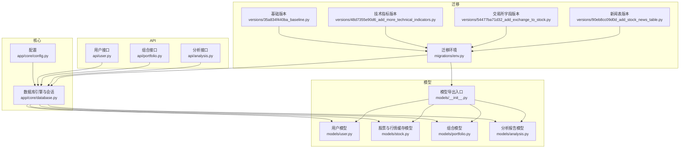
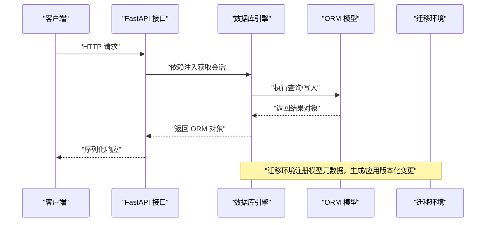
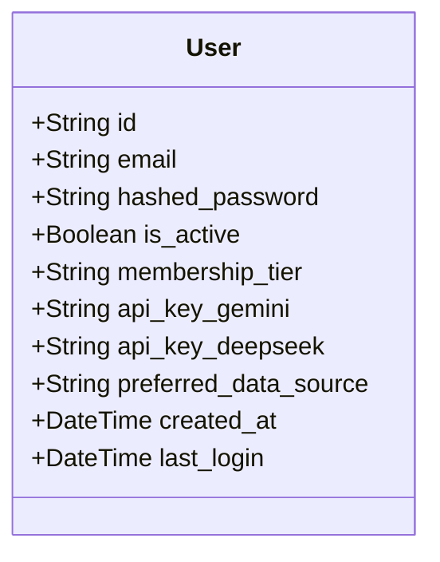
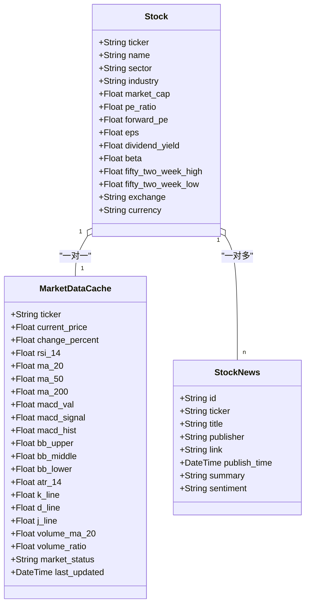
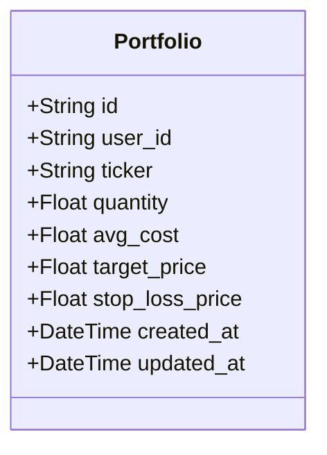
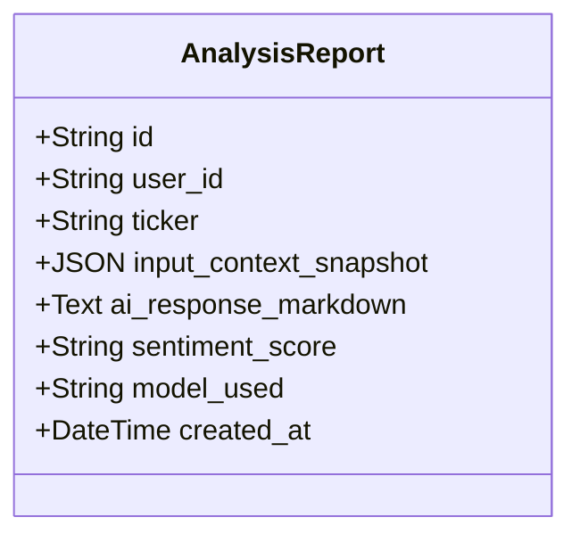
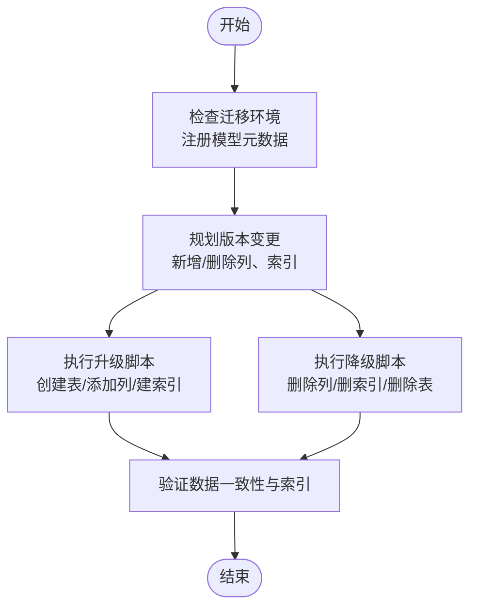
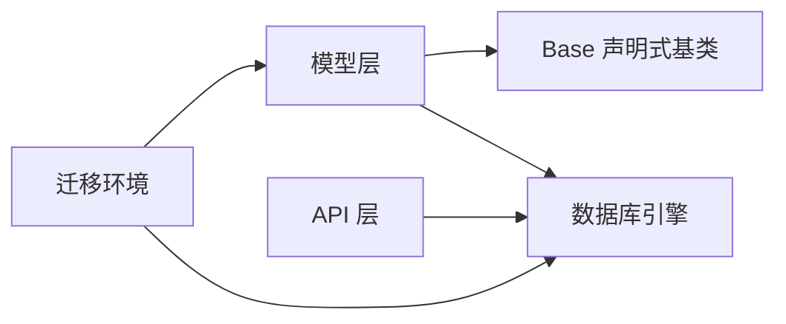

# 数据库模型设计

<cite>
**本文引用的文件**
- [backend/app/models/__init__.py](file://backend/app/models/__init__.py)
- [backend/app/models/user.py](file://backend/app/models/user.py)
- [backend/app/models/stock.py](file://backend/app/models/stock.py)
- [backend/app/models/portfolio.py](file://backend/app/models/portfolio.py)
- [backend/app/models/analysis.py](file://backend/app/models/analysis.py)
- [backend/app/core/database.py](file://backend/app/core/database.py)
- [backend/app/core/config.py](file://backend/app/core/config.py)
- [backend/app/schemas/user_settings.py](file://backend/app/schemas/user_settings.py)
- [backend/migrations/versions/35a834f440ba_baseline.py](file://backend/migrations/versions/35a834f440ba_baseline.py)
- [backend/migrations/versions/48d7355e90d6_add_more_technical_indicators.py](file://backend/migrations/versions/48d7355e90d6_add_more_technical_indicators.py)
- [backend/migrations/versions/54477ba71d32_add_exchange_to_stock.py](file://backend/migrations/versions/54477ba71d32_add_exchange_to_stock.py)
- [backend/migrations/versions/90eb8cc09d0d_add_stock_news_table.py](file://backend/migrations/versions/90eb8cc09d0d_add_stock_news_table.py)
- [backend/migrations/env.py](file://backend/migrations/env.py)
- [doc/Database Schema & Data Flow Specification.md](file://doc/Database Schema & Data Flow Specification.md)
- [backend/app/api/user.py](file://backend/app/api/user.py)
- [backend/app/api/portfolio.py](file://backend/app/api/portfolio.py)
- [backend/app/api/analysis.py](file://backend/app/api/analysis.py)
</cite>

## 更新摘要
**变更内容**
- 更新了数据库枚举类型重构的相关章节，反映AnalysisReport、Stock和User模型的字段存储方式变更
- 新增了Stock模型exchange字段的详细说明
- 更新了数据验证规则实现章节，反映字符串存储替代枚举类型的处理方式
- 更新了模型序列化与反序列化章节，反映Pydantic模型字段类型的变化

## 目录
1. [简介](#简介)
2. [项目结构](#项目结构)
3. [核心组件](#核心组件)
4. [架构总览](#架构总览)
5. [详细组件分析](#详细组件分析)
6. [依赖分析](#依赖分析)
7. [性能考虑](#性能考虑)
8. [故障排查指南](#故障排查指南)
9. [结论](#结论)
10. [附录](#附录)

## 简介
本指南面向数据库模型设计与开发，围绕 SQLAlchemy ORM 的使用方法进行系统化说明，涵盖模型定义、字段类型选择、关系映射、实体关系设计（一对一、一对多、多对多）、继承与抽象、数据库约束与索引、数据验证规则、模型序列化与反序列化、数据库迁移策略与版本管理、以及性能优化建议。内容以项目现有模型与迁移脚本为基础，结合 FastAPI 接口层展示实际使用方式，帮助开发者在保持一致性的同时扩展与维护数据模型。

## 项目结构
后端采用分层组织：核心配置与数据库引擎位于 core，模型定义位于 models，API 层位于 api，迁移脚本位于 migrations。模型通过统一的 Base 声明式基类进行声明，数据库连接为异步引擎，配合依赖注入在 API 中使用。

**图表来源**
- [backend/app/core/config.py](file://backend/app/core/config.py#L1-L24)
- [backend/app/core/database.py](file://backend/app/core/database.py#L1-L24)
- [backend/app/models/__init__.py](file://backend/app/models/__init__.py#L1-L5)
- [backend/migrations/env.py](file://backend/migrations/env.py#L1-L43)

**章节来源**
- [backend/app/core/config.py](file://backend/app/core/config.py#L1-L24)
- [backend/app/core/database.py](file://backend/app/core/database.py#L1-L24)
- [backend/app/models/__init__.py](file://backend/app/models/__init__.py#L1-L5)
- [backend/migrations/env.py](file://backend/migrations/env.py#L1-L43)

## 核心组件
- 用户模型：定义用户标识、认证凭据、会员等级、偏好数据源与加密 API Key 字段，具备邮箱唯一性与索引。**更新**：会员等级与数据源偏好字段已从数据库枚举类型转换为字符串存储，使用默认值而非枚举约束。
- 股票与行情缓存模型：股票表存储基础财务与市场信息，**新增**：exchange字段用于存储交易所信息；行情缓存表存储最新价格与技术指标，支持一对一关系与外键约束。
- 组合模型：记录用户持有的股票数量、平均成本与目标/止损价，具备用户与股票的外键约束及联合唯一约束。
- 分析报告模型：记录用户对某股票的分析请求与响应、情感评分与所用模型，具备时间索引用于配额统计。**更新**：情感评分字段已从数据库枚举类型转换为字符串存储。
- 迁移版本：包含基础表结构、技术指标列扩展、交易所字段添加、新闻表创建等版本化变更。

**章节来源**
- [backend/app/models/user.py](file://backend/app/models/user.py#L1-L31)
- [backend/app/models/stock.py](file://backend/app/models/stock.py#L1-L86)
- [backend/app/models/portfolio.py](file://backend/app/models/portfolio.py#L1-L26)
- [backend/app/models/analysis.py](file://backend/app/models/analysis.py#L1-L25)
- [backend/migrations/versions/35a834f440ba_baseline.py](file://backend/migrations/versions/35a834f440ba_baseline.py#L1-L128)
- [backend/migrations/versions/48d7355e90d6_add_more_technical_indicators.py](file://backend/migrations/versions/48d7355e90d6_add_more_technical_indicators.py#L1-L47)
- [backend/migrations/versions/54477ba71d32_add_exchange_to_stock.py](file://backend/migrations/versions/54477ba71d32_add_exchange_to_stock.py#L1-L31)
- [backend/migrations/versions/90eb8cc09d0d_add_stock_news_table.py](file://backend/migrations/versions/90eb8cc09d0d_add_stock_news_table.py#L1-L32)

## 架构总览
下图展示了模型层、API 层与数据库之间的交互关系，以及迁移环境如何注册模型元数据以支持自动迁移。

**图表来源**
- [backend/app/core/database.py](file://backend/app/core/database.py#L1-L24)
- [backend/migrations/env.py](file://backend/migrations/env.py#L1-L43)

## 详细组件分析

### 用户模型（User）
- 设计要点
  - 主键：字符串类型，UUID 默认值，确保全局唯一且不可预测。
  - 唯一性：邮箱唯一，便于登录与检索。
  - 索引：邮箱建立索引，提升查询效率。
  - **更新**：枚举：会员等级与数据源偏好已转换为字符串字段，使用默认值而非枚举约束，提供更大的灵活性。
  - 加密字段：预留加密存储的 API Key 字段，当前模型示例中为明文占位，建议在生产中使用安全加密方案。
  - 时间戳：创建时间与最后登录时间，便于审计与活跃度统计。
- 关系映射
  - 当前模型未显式定义关系属性，可在需要时通过 relationship 建立到其他模型的一对多或多对多关系。
- 验证与约束
  - 非空字段：密码哈希与邮箱。
  - 唯一性：邮箱唯一。
  - **更新**：字符串存储：会员等级与数据源偏好使用字符串默认值，通过业务逻辑或Pydantic验证确保取值范围。
- 序列化
  - 在 API 层使用 Pydantic 模型进行序列化输出，避免直接暴露 ORM 字段细节。

**图表来源**
- [backend/app/models/user.py](file://backend/app/models/user.py#L1-L31)
- [backend/app/schemas/user_settings.py](file://backend/app/schemas/user_settings.py#L1-L16)

**章节来源**
- [backend/app/models/user.py](file://backend/app/models/user.py#L1-L31)
- [backend/app/schemas/user_settings.py](file://backend/app/schemas/user_settings.py#L1-L16)
- [backend/app/api/user.py](file://backend/app/api/user.py#L1-L48)

### 股票与行情缓存模型（Stock 与 MarketDataCache）
- 设计要点
  - 股票表：主键为股票代码，具备名称、行业、市值、PE 等字段，**新增**：exchange字段用于存储交易所信息，便于区分不同市场的股票。
  - 行情缓存表：与股票表为一对一关系，主键同时作为外键指向股票，存储最新价格与技术指标，包含**更新**：market_status字段已转换为字符串存储，使用默认值而非枚举约束。
  - 新闻表：与股票表为一对多关系，存储新闻标题、链接、发布时间与摘要，新闻表对股票代码建立索引。
- 关系映射
  - Stock 与 MarketDataCache：一对一（uselist=False）。
  - Stock 与 StockNews：一对多（通过 back_populates 与 cascade="all, delete-orphan" 实现孤儿删除）。
- 约束与索引
  - 外键约束：行情缓存与新闻表均引用股票主键。
  - 索引：股票代码与新闻表的股票代码索引，提升查询性能。
- 性能优化
  - 使用 last_updated 索引与缓存策略减少外部 API 调用频率。

**图表来源**
- [backend/app/models/stock.py](file://backend/app/models/stock.py#L1-L86)

**章节来源**
- [backend/app/models/stock.py](file://backend/app/models/stock.py#L1-L86)
- [backend/migrations/versions/90eb8cc09d0d_add_stock_news_table.py](file://backend/migrations/versions/90eb8cc09d0d_add_stock_news_table.py#L1-L32)

### 组合模型（Portfolio）
- 设计要点
  - 记录用户对某只股票的持有情况，包含数量与平均成本，支持目标价与止损价。
  - 外键约束：用户与股票均为非空，确保数据完整性。
  - 联合唯一约束：(user_id, ticker)，保证每个用户对同一股票仅有一条持仓记录。
- 关系映射
  - 可在需要时通过 relationship 建立到 User 与 Stock 的关系，便于在查询时一次性加载关联数据。
- 约束与索引
  - 外键与唯一约束保障业务一致性。
  - 可根据查询模式增加索引（例如 user_id 或 ticker 单独索引）。

**图表来源**
- [backend/app/models/portfolio.py](file://backend/app/models/portfolio.py#L1-L26)

**章节来源**
- [backend/app/models/portfolio.py](file://backend/app/models/portfolio.py#L1-L26)

### 分析报告模型（AnalysisReport）
- 设计要点
  - 存储用户请求与 AI 响应的上下文快照、Markdown 响应文本、情感评分与模型名称。
  - 外键：用户与股票，确保分析记录归属明确。
  - 时间索引：按创建时间索引，便于统计当日使用量与配额控制。
  - **更新**：情感评分字段已从数据库枚举类型转换为字符串存储，使用可空字符串字段。
- 业务规则
  - 免费用户每日使用次数限制，通过统计 AnalysisReport 数量实现。
- 关系映射
  - 可在需要时建立到 User 与 Stock 的关系，便于聚合查询。

**图表来源**
- [backend/app/models/analysis.py](file://backend/app/models/analysis.py#L1-L25)

**章节来源**
- [backend/app/models/analysis.py](file://backend/app/models/analysis.py#L1-L25)
- [backend/app/api/analysis.py](file://backend/app/api/analysis.py#L1-L124)

### 数据模型继承与抽象
- 抽象基类设计
  - 所有模型继承自统一的 Base，确保元数据注册与迁移一致。
  - 可引入抽象基类封装通用字段（如 created_at、updated_at），并在子类中复用，减少重复。
- 字段复用
  - **更新**：枚举类型已转换为字符串存储，通过默认值和业务逻辑统一取值范围，避免魔法字符串。
- 关系复用
  - 在需要时通过 relationship 定义跨模型关系，结合外键与唯一约束保证一致性。

**章节来源**
- [backend/app/core/database.py](file://backend/app/core/database.py#L1-L24)
- [backend/app/models/user.py](file://backend/app/models/user.py#L1-L31)
- [backend/app/models/stock.py](file://backend/app/models/stock.py#L1-L86)
- [backend/app/models/portfolio.py](file://backend/app/models/portfolio.py#L1-L26)
- [backend/app/models/analysis.py](file://backend/app/models/analysis.py#L1-L25)

### 数据库约束与索引设计原则
- 主键
  - 用户与分析报告使用 UUID 字符串主键，组合记录使用联合唯一约束，确保业务唯一性。
- 外键
  - 行情缓存与新闻表均引用股票主键，组合表引用用户与股票主键，保证参照完整性。
- 唯一性
  - 邮箱唯一、(user_id, ticker) 唯一，防止重复与歧义。
- 索引
  - 邮箱与新闻表的 ticker 建立索引，提升查询效率；行情缓存的 last_updated 建立索引，支持缓存命中判断。
- 迁移中的约束
  - 迁移脚本通过 Alembic 自动添加列与索引，确保版本演进可控。

**章节来源**
- [backend/app/models/user.py](file://backend/app/models/user.py#L1-L31)
- [backend/app/models/portfolio.py](file://backend/app/models/portfolio.py#L1-L26)
- [backend/app/models/stock.py](file://backend/app/models/stock.py#L1-L86)
- [backend/migrations/versions/90eb8cc09d0d_add_stock_news_table.py](file://backend/migrations/versions/90eb8cc09d0d_add_stock_news_table.py#L1-L32)

### 数据验证规则实现
- 字段验证
  - 非空字段（如密码哈希、邮箱）在模型层面约束，配合 Pydantic 模型在 API 层进行输入校验。
  - **更新**：枚举字段已转换为字符串存储，通过 Pydantic 模型的字符串类型和默认值处理确保数据格式正确。
- 业务规则
  - 免费用户每日分析次数限制：通过统计 AnalysisReport 数量实现。
  - 组合记录唯一性：通过联合唯一约束与查询逻辑保证。
- 序列化与反序列化
  - 使用 Pydantic 模型进行请求体与响应体的序列化与反序列化，避免 ORM 对象直接暴露。

**章节来源**
- [backend/app/models/user.py](file://backend/app/models/user.py#L1-L31)
- [backend/app/models/analysis.py](file://backend/app/models/analysis.py#L1-L25)
- [backend/app/api/analysis.py](file://backend/app/api/analysis.py#L1-L124)
- [backend/app/schemas/user_settings.py](file://backend/app/schemas/user_settings.py#L1-L16)

### 模型序列化与反序列化（Pydantic）
- 输入验证
  - 在 API 层使用 Pydantic 模型接收请求参数，自动进行类型检查与默认值处理。
  - **更新**：Pydantic 模型字段类型已相应调整，反映字符串存储替代枚举类型的变更。
- 输出序列化
  - 在用户接口中，将 User 对象映射为 Pydantic 模型输出，隐藏敏感字段细节。
- 关系数据
  - 在组合接口中，将 ORM 查询结果映射为复合 Pydantic 模型，包含基础、技术与行情数据。

**章节来源**
- [backend/app/schemas/user_settings.py](file://backend/app/schemas/user_settings.py#L1-L16)
- [backend/app/api/user.py](file://backend/app/api/user.py#L1-L48)
- [backend/app/api/portfolio.py](file://backend/app/api/portfolio.py#L1-L297)

### 数据库迁移策略与版本管理
- 迁移环境
  - Alembic 通过 env.py 注册模型元数据与数据库 URL，确保迁移上下文正确。
- 版本化变更
  - 基础版本：初始化表结构，**更新**：包含exchange字段和字符串存储的枚举字段。
  - 技术指标版本：新增布林带上中下轨、ATR、KDJ、成交量相关指标列。
  - 交易所字段版本：为股票表添加交易所字段。
  - 新闻表版本：创建新闻表并添加索引。
- 最佳实践
  - 新增列时使用可空字段，避免破坏现有数据。
  - 删除列时保留回滚脚本，确保可逆操作。
  - 通过索引与约束提升查询性能与数据一致性。

**图表来源**
- [backend/migrations/env.py](file://backend/migrations/env.py#L1-L43)
- [backend/migrations/versions/35a834f440ba_baseline.py](file://backend/migrations/versions/35a834f440ba_baseline.py#L1-L128)
- [backend/migrations/versions/48d7355e90d6_add_more_technical_indicators.py](file://backend/migrations/versions/48d7355e90d6_add_more_technical_indicators.py#L1-L47)
- [backend/migrations/versions/54477ba71d32_add_exchange_to_stock.py](file://backend/migrations/versions/54477ba71d32_add_exchange_to_stock.py#L1-L31)
- [backend/migrations/versions/90eb8cc09d0d_add_stock_news_table.py](file://backend/migrations/versions/90eb8cc09d0d_add_stock_news_table.py#L1-L32)

**章节来源**
- [backend/migrations/env.py](file://backend/migrations/env.py#L1-L43)
- [backend/migrations/versions/35a834f440ba_baseline.py](file://backend/migrations/versions/35a834f440ba_baseline.py#L1-L128)
- [backend/migrations/versions/48d7355e90d6_add_more_technical_indicators.py](file://backend/migrations/versions/48d7355e90d6_add_more_technical_indicators.py#L1-L47)
- [backend/migrations/versions/54477ba71d32_add_exchange_to_stock.py](file://backend/migrations/versions/54477ba71d32_add_exchange_to_stock.py#L1-L31)
- [backend/migrations/versions/90eb8cc09d0d_add_stock_news_table.py](file://backend/migrations/versions/90eb8cc09d0d_add_stock_news_table.py#L1-L32)

## 依赖分析
- 模块耦合
  - 模型层依赖统一的 Base 与数据库引擎；API 层通过依赖注入获取会话；迁移环境注册模型元数据。
- 外部依赖
  - Alembic 提供迁移能力；Pydantic 用于数据验证与序列化；FastAPI 提供接口层。
- 循环依赖
  - 当前结构清晰，无明显循环导入；若未来扩展关系属性，需谨慎避免循环引用。

**图表来源**
- [backend/app/core/database.py](file://backend/app/core/database.py#L1-L24)
- [backend/migrations/env.py](file://backend/migrations/env.py#L1-L43)

**章节来源**
- [backend/app/core/database.py](file://backend/app/core/database.py#L1-L24)
- [backend/migrations/env.py](file://backend/migrations/env.py#L1-L43)

## 性能考虑
- 查询优化
  - 使用外连接一次性加载组合、行情与股票数据，减少 N+1 查询。
  - 对高频查询字段（邮箱、股票代码、last_updated）建立索引。
- 缓存策略
  - 行情缓存表通过 last_updated 与索引控制缓存命中，降低外部 API 调用频率。
- 写入优化
  - 批量写入与后台任务异步处理，避免阻塞主流程。
- 索引策略
  - 在用户与股票维度上评估是否需要额外单列索引，平衡写入与读取性能。

**章节来源**
- [backend/app/api/portfolio.py](file://backend/app/api/portfolio.py#L143-L224)
- [backend/app/models/stock.py](file://backend/app/models/stock.py#L65-L66)

## 故障排查指南
- 迁移失败
  - 检查 Alembic 环境是否正确注册模型与数据库 URL；确认版本顺序与依赖关系。
- 查询异常
  - 核对关系映射与外键约束；确认索引是否存在；检查查询条件与过滤逻辑。
- 数据不一致
  - 检查唯一约束与业务逻辑（如组合唯一性、免费用户配额）；必要时回滚到已知稳定版本。
- 序列化问题
  - 确认 Pydantic 模型字段与 ORM 对象映射一致；避免敏感字段泄露。
- **更新**：枚举转换问题
  - 检查字符串存储字段的默认值设置；确认业务逻辑能够正确处理字符串值而非枚举对象。

**章节来源**
- [backend/migrations/env.py](file://backend/migrations/env.py#L1-L43)
- [backend/app/api/analysis.py](file://backend/app/api/analysis.py#L27-L50)
- [backend/app/api/portfolio.py](file://backend/app/api/portfolio.py#L236-L271)

## 结论
本项目以 SQLAlchemy ORM 为核心，结合 Alembic 进行版本化迁移，构建了清晰的领域模型与接口层。**更新**：通过将数据库枚举类型转换为字符串存储，提升了数据模型的灵活性和兼容性，同时新增了股票交易所字段。通过字符串默认值与Pydantic验证强化数据质量，借助缓存与批量查询优化性能。建议在扩展新功能时遵循现有模式：统一继承 Base、使用 Pydantic 进行验证、通过迁移脚本演进结构，并持续关注查询路径与索引策略。

## 附录
- 实体关系概览（来自文档规范）
  - 用户与组合：一对多。
  - 用户与分析报告：一对多。
  - 股票与行情缓存：一对一。
  - 股票与新闻：一对多。

**章节来源**
- [doc/Database Schema & Data Flow Specification.md](file://doc/Database Schema & Data Flow Specification.md#L75-L80)