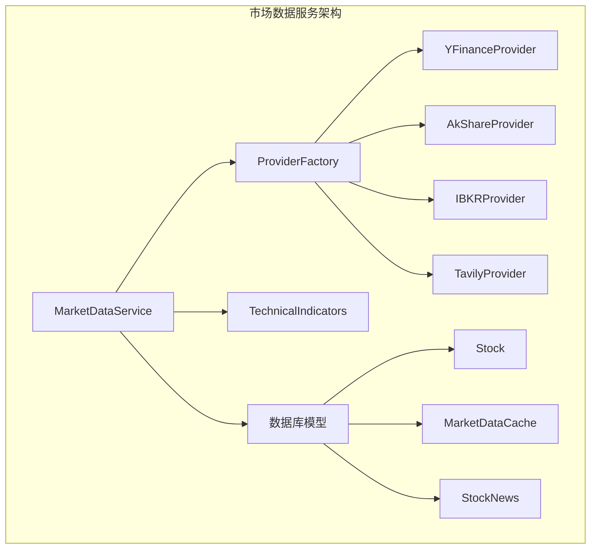
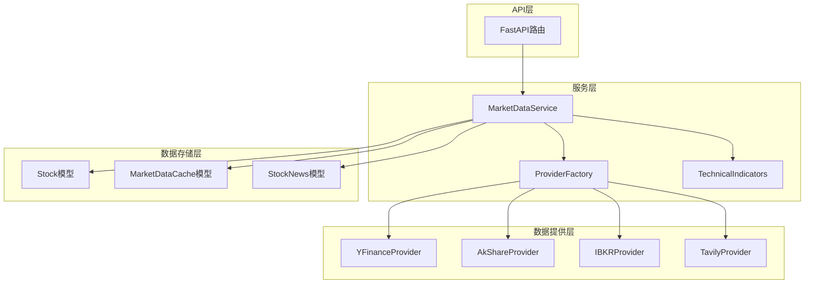
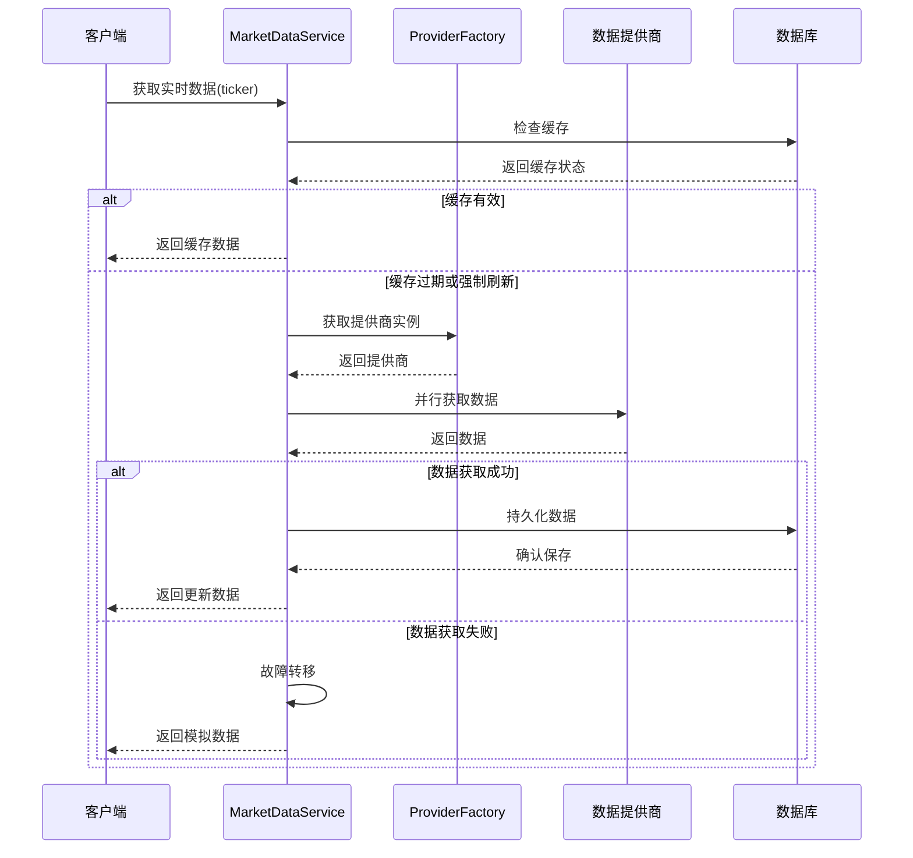
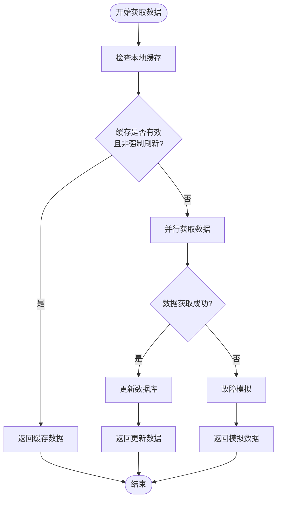
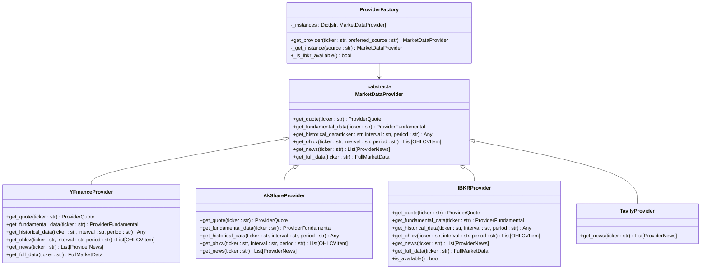
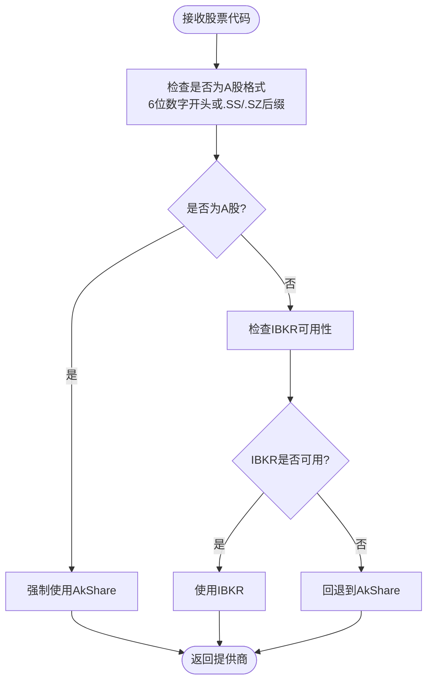
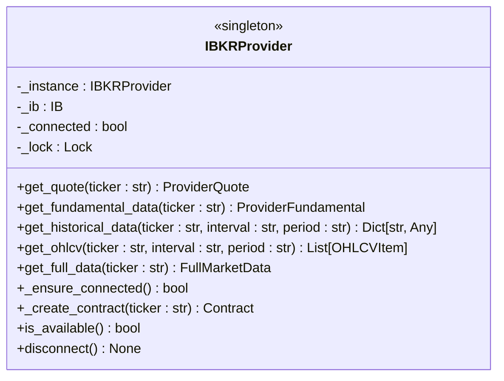
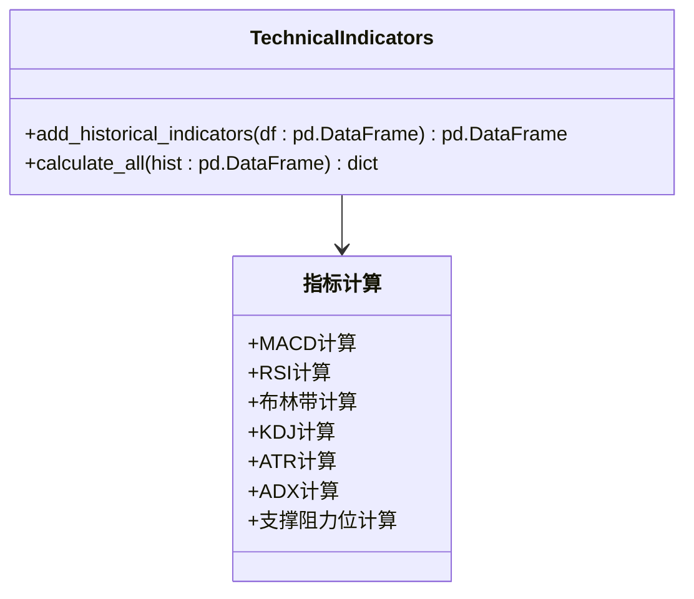
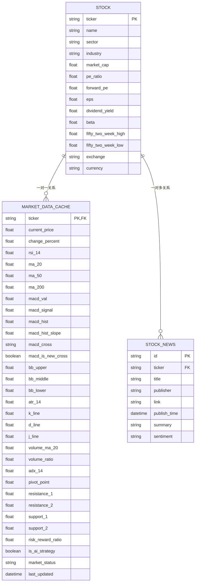
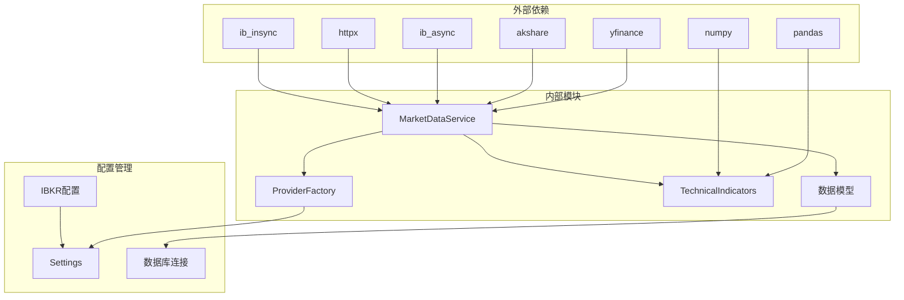

# 市场数据服务

<cite>
**本文档引用的文件**
- [market_data.py](file://backend/app/services/market_data.py)
- [market_data.py](file://backend/app/schemas/market_data.py)
- [stock.py](file://backend/app/models/stock.py)
- [base.py](file://backend/app/services/market_providers/base.py)
- [factory.py](file://backend/app/services/market_providers/factory.py)
- [yfinance.py](file://backend/app/services/market_providers/yfinance.py)
- [akshare.py](file://backend/app/services/market_providers/akshare.py)
- [ibkr.py](file://backend/app/services/market_providers/ibkr.py)
- [tavily.py](file://backend/app/services/market_providers/tavily.py)
- [indicators.py](file://backend/app/services/indicators.py)
- [stock.py](file://backend/app/api/v1/endpoints/stock.py)
- [api.py](file://backend/app/api/v1/api.py)
- [main.py](file://backend/app/main.py)
- [config.py](file://backend/app/core/config.py)
</cite>

## 更新摘要
**变更内容**
- 新增Interactive Brokers(IBKR)市场提供商，支持TWS/IB Gateway直连数据源
- 增强AkShare提供商的代理绕过机制和多数据源回退策略
- 改进市场数据同步能力和错误处理机制
- 新增IBKR连接配置和可用性检测功能
- 优化ProviderFactory的智能路由逻辑

## 目录
1. [简介](#简介)
2. [项目结构](#项目结构)
3. [核心组件](#核心组件)
4. [架构概览](#架构概览)
5. [详细组件分析](#详细组件分析)
6. [依赖关系分析](#依赖关系分析)
7. [性能考虑](#性能考虑)
8. [故障排除指南](#故障排除指南)
9. [结论](#结论)

## 简介

市场数据服务是AI智能投资顾问系统的核心数据基础设施，负责整合多源市场数据、提供实时行情、技术分析指标和公司基本面信息。该服务采用多提供商架构，支持美股（Yahoo Finance）、A股（AkShare）、IBKR Interactive Brokers和AI增强新闻搜索，为前端提供完整的股票市场数据支持。

**更新** 新增Interactive Brokers(IBKR)数据提供商，通过TWS/IB Gateway实现高质量的全球市场数据直连，特别适合中国大陆服务器部署。

## 项目结构

市场数据服务位于后端应用的`backend/app/services/`目录下，主要包含以下层次结构：

**图表来源**
- [market_data.py:17-407](file://backend/app/services/market_data.py#L17-L407)
- [factory.py:11-68](file://backend/app/services/market_providers/factory.py#L11-L68)

**章节来源**
- [market_data.py:1-407](file://backend/app/services/market_data.py#L1-L407)
- [factory.py:1-68](file://backend/app/services/market_providers/factory.py#L1-L68)

## 核心组件

市场数据服务由以下核心组件构成：

### 1. 市场数据服务中枢 (MarketDataService)
- **职责**：协调多数据源、处理缓存逻辑、并行抓取数据、持久化到数据库
- **关键特性**：1分钟缓存策略、故障转移机制、AI增强功能、智能新闻聚合

### 2. 数据提供商工厂 (ProviderFactory)
- **职责**：根据股票代码特征自动选择合适的数据提供商
- **智能分发**：A股强制使用AkShare，美股优先IBKR，回退到AkShare

### 3. 技术指标引擎 (TechnicalIndicators)
- **职责**：提供基于Pandas的高效技术指标计算
- **支持指标**：MACD、RSI、布林带、KDJ、ATR、ADX等

### 4. 数据模型层
- **Stock**：存储股票基本信息
- **MarketDataCache**：存储实时行情和技术指标
- **StockNews**：存储股票相关新闻

### 5. 新增IBKR数据提供商
- **职责**：通过TWS/IB Gateway提供高质量的全球市场数据
- **特点**：数据质量优于yfinance、无需公网API、支持多时区市场

**章节来源**
- [market_data.py:17-407](file://backend/app/services/market_data.py#L17-L407)
- [base.py:9-51](file://backend/app/services/market_providers/base.py#L9-L51)
- [indicators.py:7-192](file://backend/app/services/indicators.py#L7-L192)
- [stock.py:15-124](file://backend/app/models/stock.py#L15-L124)

## 架构概览

市场数据服务采用分层架构设计，实现了高度的模块化和可扩展性：

**图表来源**
- [main.py:27-31](file://backend/app/main.py#L27-L31)
- [market_data.py:17-407](file://backend/app/services/market_data.py#L17-L407)
- [factory.py:11-68](file://backend/app/services/market_providers/factory.py#L11-L68)

## 详细组件分析

### MarketDataService 核心流程

MarketDataService实现了完整的数据获取和缓存策略：

**图表来源**
- [market_data.py:19-66](file://backend/app/services/market_data.py#L19-L66)
- [market_data.py:68-227](file://backend/app/services/market_data.py#L68-L227)

#### 缓存策略实现

系统采用智能缓存机制，确保性能和数据新鲜度的平衡：

**图表来源**
- [market_data.py:32-66](file://backend/app/services/market_data.py#L32-L66)
- [market_data.py:378-407](file://backend/app/services/market_data.py#L378-L407)

**章节来源**
- [market_data.py:19-407](file://backend/app/services/market_data.py#L19-L407)

### ProviderFactory 智能分发机制

ProviderFactory实现了基于股票代码特征的智能提供商选择：

**图表来源**
- [factory.py:11-68](file://backend/app/services/market_providers/factory.py#L11-L68)
- [base.py:9-51](file://backend/app/services/market_providers/base.py#L9-L51)

#### A股识别和处理逻辑

**图表来源**
- [factory.py:18-38](file://backend/app/services/market_providers/factory.py#L18-L38)

**章节来源**
- [factory.py:1-68](file://backend/app/services/market_providers/factory.py#L1-L68)
- [base.py:1-51](file://backend/app/services/market_providers/base.py#L1-L51)

### 新增IBKR数据提供商

IBKRProvider提供了高质量的全球市场数据直连服务：

**图表来源**
- [ibkr.py:34-571](file://backend/app/services/market_providers/ibkr.py#L34-L571)

#### IBKR连接和配置

IBKRProvider支持多种连接模式和配置选项：

| 连接模式 | 端口 | 用途 | 配置参数 |
|---------|------|------|----------|
| TWS Live | 7496 | 实盘交易 | IBKR_PORT=7496 |
| TWS Paper | 7497 | 模拟交易 | IBKR_PORT=7497 |
| IB Gateway Live | 4001 | 实盘网关 | IBKR_PORT=4001 |
| IB Gateway Paper | 4002 | 模拟网关 | IBKR_PORT=4002 |

**章节来源**
- [ibkr.py:1-571](file://backend/app/services/market_providers/ibkr.py#L1-L571)
- [config.py:25-29](file://backend/app/core/config.py#L25-L29)

### 技术指标引擎

TechnicalIndicators提供了全面的技术分析指标计算：

**图表来源**
- [indicators.py:7-192](file://backend/app/services/indicators.py#L7-L192)

#### 关键技术指标实现

| 指标类型 | 计算方法 | 用途 |
|---------|---------|------|
| MACD | 指数移动平均差值 | 趋势判断、买卖信号 |
| RSI | 相对强弱指数 | 超买超卖判断 |
| 布林带 | MA±2σ | 波动性分析、突破确认 |
| KDJ | 随机指标 | 短期超买超卖 |
| ATR | 平均真实波幅 | 波动率衡量 |
| ADX | 平均趋向指数 | 趋势强度 |

**章节来源**
- [indicators.py:1-192](file://backend/app/services/indicators.py#L1-L192)

### 数据模型设计

系统采用ORM模型管理数据持久化：

**图表来源**
- [stock.py:15-124](file://backend/app/models/stock.py#L15-L124)

**章节来源**
- [stock.py:1-124](file://backend/app/models/stock.py#L1-L124)

## 依赖关系分析

市场数据服务的依赖关系呈现清晰的分层结构：

**图表来源**
- [yfinance.py:1-305](file://backend/app/services/market_providers/yfinance.py#L1-L305)
- [akshare.py:1-800](file://backend/app/services/market_providers/akshare.py#L1-L800)
- [ibkr.py:1-571](file://backend/app/services/market_providers/ibkr.py#L1-L571)
- [config.py:4-36](file://backend/app/core/config.py#L4-L36)

### 关键依赖特性

1. **异步并发**：使用asyncio实现高并发数据抓取
2. **故障转移**：多提供商备份机制确保服务可用性
3. **智能缓存**：1分钟缓存策略平衡性能和准确性
4. **类型安全**：Pydantic模型确保数据完整性
5. **IBKR直连**：通过ib_async实现与TWS/IB Gateway的高质量连接

**章节来源**
- [market_data.py:1-407](file://backend/app/services/market_data.py#L1-L407)
- [config.py:1-36](file://backend/app/core/config.py#L1-L36)

## 性能考虑

市场数据服务在性能方面采用了多项优化策略：

### 1. 并发优化
- **并行抓取**：使用`asyncio.gather`并行获取多个数据源
- **超时保护**：15秒超时防止单个数据源阻塞
- **信号量限制**：批量刷新时限制并发数为5
- **IBKR连接池**：单例模式避免重复连接开销

### 2. 缓存策略
- **智能缓存**：1分钟缓存周期，避免频繁API调用
- **内存缓存**：AkShare全市场快照60秒内存缓存
- **增量更新**：新闻数据基于MD5哈希去重
- **IBKR缓存**：连接状态缓存避免重复建立连接

### 3. 数据优化
- **懒加载**：技术指标按需计算
- **数据清洗**：NaN/Inf值自动过滤
- **索引优化**：数据库查询使用索引字段
- **代理绕过**：AkShare通过线程本地变量绕过代理限制

### 4. IBKR优化
- **单例连接**：全局唯一连接实例
- **异步锁**：防止并发连接竞争
- **快速检查**：连接状态快速检测
- **超时控制**：5秒连接超时避免阻塞

## 故障排除指南

### 常见问题及解决方案

#### 1. IBKR连接问题
**症状**：IBKR Provider不可用或连接失败
**原因**：
- TWS/IB Gateway未运行
- 端口配置错误
- 客户端ID冲突
- ib_async库未安装

**解决方案**：
- 检查IBKR服务状态和端口配置
- 确认IBKR_ENABLED=true
- 修改IBKR_CLIENT_ID避免冲突
- 安装ib_async库：`pip install ib_async`

#### 2. 数据获取失败
**症状**：API返回空数据或错误
**原因**：
- 网络连接问题
- API限制或封禁
- 数据源不可用

**解决方案**：
- 检查网络连接和代理设置
- 查看API配额和限制
- 启用备用数据源

#### 3. 性能问题
**症状**：响应时间过长
**原因**：
- 并发请求过多
- 缓存失效频繁
- 数据库查询慢

**解决方案**：
- 调整并发限制
- 优化缓存策略
- 添加数据库索引

#### 4. AkShare代理问题
**症状**：A股数据获取失败
**原因**：
- 代理环境变量影响
- 网络连接受限

**解决方案**：
- 使用内置代理绕过机制
- 检查系统代理设置
- 确保直连访问

**章节来源**
- [market_data.py:86-99](file://backend/app/services/market_data.py#L86-L99)
- [ibkr.py:60-108](file://backend/app/services/market_providers/ibkr.py#L60-L108)
- [akshare.py:129-155](file://backend/app/services/market_providers/akshare.py#L129-L155)

## 结论

市场数据服务通过模块化设计和多提供商架构，为AI智能投资顾问系统提供了稳定可靠的数据基础设施。其核心优势包括：

1. **高可用性**：多数据源备份和故障转移机制
2. **高性能**：智能缓存、并发处理和优化的指标计算
3. **可扩展性**：插件化的数据提供商架构
4. **数据质量**：严格的验证和清洗机制
5. **国际化支持**：通过IBKR提供全球市场数据直连
6. **智能代理绕过**：AkShare的多数据源回退策略

**更新** 新增的IBKR提供商显著提升了系统的数据质量和可靠性，特别是对于需要高质量实时数据的用户。通过TWS/IB Gateway的直连方式，系统能够获得更准确、更及时的市场数据，特别适合中国大陆服务器部署。

该服务为整个系统的AI分析和决策提供了坚实的数据基础，支持复杂的股票分析和投资决策场景，现已具备完整的全球市场数据覆盖能力。