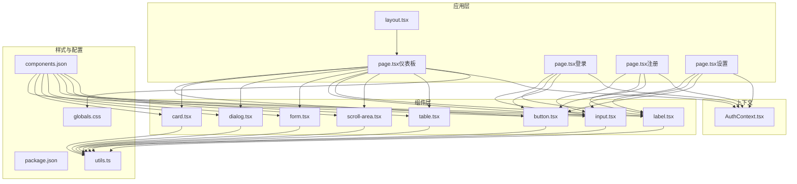
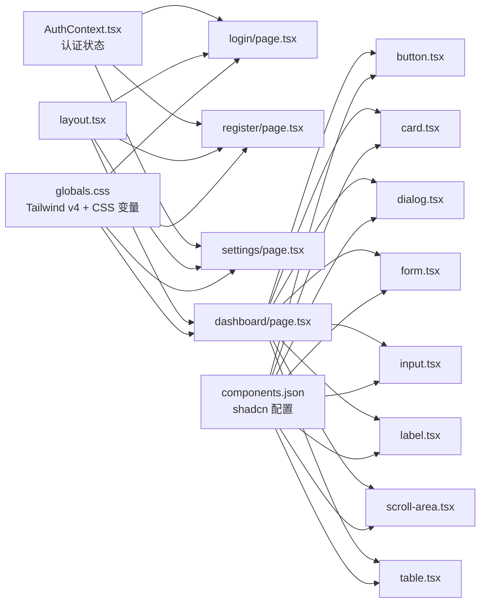
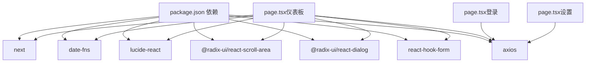

# UI组件扩展

<cite>
**本文引用的文件**
- [package.json](file://frontend/package.json)
- [components.json](file://frontend/components.json)
- [layout.tsx](file://frontend/app/layout.tsx)
- [globals.css](file://frontend/app/globals.css)
- [button.tsx](file://frontend/components/ui/button.tsx)
- [card.tsx](file://frontend/components/ui/card.tsx)
- [dialog.tsx](file://frontend/components/ui/dialog.tsx)
- [form.tsx](file://frontend/components/ui/form.tsx)
- [input.tsx](file://frontend/components/ui/input.tsx)
- [label.tsx](file://frontend/components/ui/label.tsx)
- [scroll-area.tsx](file://frontend/components/ui/scroll-area.tsx)
- [table.tsx](file://frontend/components/ui/table.tsx)
- [utils.ts](file://frontend/lib/utils.ts)
- [AuthContext.tsx](file://frontend/context/AuthContext.tsx)
- [page.tsx（仪表板）](file://frontend/app/page.tsx)
- [page.tsx（登录）](file://frontend/app/login/page.tsx)
- [page.tsx（注册）](file://frontend/app/register/page.tsx)
- [page.tsx（设置）](file://frontend/app/settings/page.tsx)
</cite>

## 目录
1. [简介](#简介)
2. [项目结构](#项目结构)
3. [核心组件](#核心组件)
4. [架构总览](#架构总览)
5. [组件详解与扩展指南](#组件详解与扩展指南)
6. [依赖关系分析](#依赖关系分析)
7. [性能考量](#性能考量)
8. [故障排查指南](#故障排查指南)
9. [结论](#结论)
10. [附录：API设计原则与最佳实践](#附录api设计原则与最佳实践)

## 简介
本指南面向希望在基于 Next.js 的前端工程中扩展 UI 组件的开发者，围绕 Shadcn/UI 设计系统与 Tailwind CSS 变量体系，系统讲解如何新增组件、定制现有组件、设计主题与样式变量、实现响应式布局、构建交互组件（数据表格、表单、模态框）、保障无障碍访问、制定测试策略，并规范组件文档与发布流程。

## 项目结构
前端采用 Next.js 应用程序目录结构，UI 组件集中于 components/ui，通过 shadcn 配置文件进行统一风格与别名管理；全局样式通过 app/globals.css 使用 Tailwind v4 的 @theme 与 CSS 变量，结合暗色模式适配；上下文用于认证状态管理；页面组件演示了组件的实际使用方式。

**图表来源**
- [layout.tsx](file://frontend/app/layout.tsx#L22-L38)
- [page.tsx（仪表板）](file://frontend/app/page.tsx#L11-L22)
- [page.tsx（登录）](file://frontend/app/login/page.tsx#L5-L8)
- [page.tsx（注册）](file://frontend/app/register/page.tsx#L5-L8)
- [page.tsx（设置）](file://frontend/app/settings/page.tsx#L5-L8)
- [button.tsx](file://frontend/components/ui/button.tsx#L1-L63)
- [card.tsx](file://frontend/components/ui/card.tsx#L1-L93)
- [dialog.tsx](file://frontend/components/ui/dialog.tsx#L1-L144)
- [form.tsx](file://frontend/components/ui/form.tsx#L1-L168)
- [input.tsx](file://frontend/components/ui/input.tsx#L1-L22)
- [label.tsx](file://frontend/components/ui/label.tsx#L1-L25)
- [scroll-area.tsx](file://frontend/components/ui/scroll-area.tsx#L1-L59)
- [table.tsx](file://frontend/components/ui/table.tsx#L1-L117)
- [globals.css](file://frontend/app/globals.css#L1-L141)
- [components.json](file://frontend/components.json#L1-L23)
- [utils.ts](file://frontend/lib/utils.ts#L1-L7)
- [AuthContext.tsx](file://frontend/context/AuthContext.tsx#L1-L60)

**章节来源**
- [layout.tsx](file://frontend/app/layout.tsx#L1-L39)
- [components.json](file://frontend/components.json#L1-L23)
- [globals.css](file://frontend/app/globals.css#L1-L141)

## 核心组件
本节聚焦于已实现的核心 UI 组件及其可扩展点，涵盖按钮、卡片、对话框、表单、输入、标签、滚动区域与表格等。

- 按钮 Button
  - 支持变体与尺寸的变体系统，具备 asChild 插槽能力，便于语义化渲染与无障碍属性透传。
  - 关键路径参考：[button.tsx](file://frontend/components/ui/button.tsx#L1-L63)

- 卡片 Card
  - 提供 Card、CardHeader、CardTitle、CardDescription、CardAction、CardContent、CardFooter 多子组件，配合容器与网格布局，适合信息区块组织。
  - 关键路径参考：[card.tsx](file://frontend/components/ui/card.tsx#L1-L93)

- 对话框 Dialog
  - 基于 Radix UI，提供 Root、Trigger、Portal、Overlay、Content、Header、Footer、Title、Description、Close 等，支持动画与可选关闭按钮。
  - 关键路径参考：[dialog.tsx](file://frontend/components/ui/dialog.tsx#L1-L144)

- 表单 Form
  - 基于 react-hook-form，提供 Form、FormField、FormItem、FormLabel、FormControl、FormDescription、FormMessage 与 useFormField，内置错误状态与 ARIA 属性绑定。
  - 关键路径参考：[form.tsx](file://frontend/components/ui/form.tsx#L1-L168)

- 输入 Input
  - 统一的输入样式与焦点环、无效态样式，支持 aria-invalid 与暗色模式。
  - 关键路径参考：[input.tsx](file://frontend/components/ui/input.tsx#L1-L22)

- 标签 Label
  - 基于 Radix UI Label，提供禁用态与分组禁用态支持。
  - 关键路径参考：[label.tsx](file://frontend/components/ui/label.tsx#L1-L25)

- 滚动区域 ScrollArea
  - 提供根容器与滚动条，支持水平/垂直方向，可定制滚动条外观。
  - 关键路径参考：[scroll-area.tsx](file://frontend/components/ui/scroll-area.tsx#L1-L59)

- 表格 Table
  - 容器 + 表头/体/脚 + 行/单元格/标题/说明，支持复选框列与选中态。
  - 关键路径参考：[table.tsx](file://frontend/components/ui/table.tsx#L1-L117)

**章节来源**
- [button.tsx](file://frontend/components/ui/button.tsx#L1-L63)
- [card.tsx](file://frontend/components/ui/card.tsx#L1-L93)
- [dialog.tsx](file://frontend/components/ui/dialog.tsx#L1-L144)
- [form.tsx](file://frontend/components/ui/form.tsx#L1-L168)
- [input.tsx](file://frontend/components/ui/input.tsx#L1-L22)
- [label.tsx](file://frontend/components/ui/label.tsx#L1-L25)
- [scroll-area.tsx](file://frontend/components/ui/scroll-area.tsx#L1-L59)
- [table.tsx](file://frontend/components/ui/table.tsx#L1-L117)

## 架构总览
下图展示页面组件如何组合基础 UI 组件，以及上下文对认证状态的贯穿。

**图表来源**
- [AuthContext.tsx](file://frontend/context/AuthContext.tsx#L15-L51)
- [page.tsx（仪表板）](file://frontend/app/page.tsx#L11-L22)
- [page.tsx（登录）](file://frontend/app/login/page.tsx#L5-L8)
- [page.tsx（注册）](file://frontend/app/register/page.tsx#L5-L8)
- [page.tsx（设置）](file://frontend/app/settings/page.tsx#L5-L8)
- [layout.tsx](file://frontend/app/layout.tsx#L22-L38)
- [globals.css](file://frontend/app/globals.css#L1-L141)
- [components.json](file://frontend/components.json#L1-L23)

## 组件详解与扩展指南

### 设计系统与主题定制
- CSS 变量与 @theme
  - 全局 CSS 定义了大量 CSS 变量（背景、前景、主色、次色、边框、输入、卡片、弹层、图表色阶、侧边栏等），并通过 @theme inline 注入到 Tailwind。
  - 暗色模式通过 .dark 类切换变量值，确保组件在深浅主题下一致呈现。
  - 关键路径参考：[globals.css](file://frontend/app/globals.css#L6-L47)、[globals.css](file://frontend/app/globals.css#L49-L116)

- shadcn 配置
  - components.json 指定样式风格、TSX、Tailwind 配置位置、CSS 变量开关、图标库、别名映射等，保证组件生成与命名一致性。
  - 关键路径参考：[components.json](file://frontend/components.json#L1-L23)

- 样式合并工具
  - utils.ts 中的 cn 函数结合 clsx 与 tailwind-merge，避免重复类名冲突，提升样式合并效率。
  - 关键路径参考：[utils.ts](file://frontend/lib/utils.ts#L1-L7)

- 字体与全局基类
  - layout.tsx 引入 Geist Sans/Mono 并注入字体变量，全局基类层应用边框与轮廓颜色，确保组件默认一致性。
  - 关键路径参考：[layout.tsx](file://frontend/app/layout.tsx#L5-L13)、[globals.css](file://frontend/app/globals.css#L118-L125)

**章节来源**
- [globals.css](file://frontend/app/globals.css#L6-L47)
- [globals.css](file://frontend/app/globals.css#L49-L116)
- [components.json](file://frontend/components.json#L1-L23)
- [utils.ts](file://frontend/lib/utils.ts#L1-L7)
- [layout.tsx](file://frontend/app/layout.tsx#L5-L13)
- [globals.css](file://frontend/app/globals.css#L118-L125)

### 新组件开发流程（以“按钮”为例）
- 变体系统
  - 使用 class-variance-authority 定义变体与尺寸，统一过渡与焦点环样式，支持 asChild 透传原生属性。
  - 关键路径参考：[button.tsx](file://frontend/components/ui/button.tsx#L7-L37)

- 结构与属性
  - 组件接收 className、variant、size、asChild 等参数，内部根据 asChild 决定渲染元素或 Slot。
  - 关键路径参考：[button.tsx](file://frontend/components/ui/button.tsx#L39-L60)

- 扩展建议
  - 新增变体时，优先在 cva 中补充，保持与现有尺寸/状态的一致性。
  - 为可访问性增加 aria-* 属性，必要时暴露 ref 以便外部控制焦点。
  - 在组件文档中明确 variant/size 的视觉差异与语义用途。

**章节来源**
- [button.tsx](file://frontend/components/ui/button.tsx#L1-L63)

### 现有组件定制（以“卡片”为例）
- 子组件职责
  - Card 作为容器；CardHeader/Title/Description/CardAction/Content/Footer 组合形成标准卡片结构。
  - 关键路径参考：[card.tsx](file://frontend/components/ui/card.tsx#L5-L92)

- 响应式与布局
  - CardHeader 使用容器查询与网格布局，支持操作区右对齐与边框分割。
  - 关键路径参考：[card.tsx](file://frontend/components/ui/card.tsx#L18-L29)

- 扩展建议
  - 为 CardHeader 增加多列布局选项，或支持折叠/展开头部内容。
  - 为 Action 区域提供插槽系统，允许自定义操作按钮组。

**章节来源**
- [card.tsx](file://frontend/components/ui/card.tsx#L1-L93)

### 图表组件扩展指南（概念性）
- 技术分析图表
  - 建议基于 SVG 或 Canvas 实现，封装为独立组件，提供数据接入接口与主题变量映射。
  - 参考现有卡片与输入组件的样式与尺寸策略，确保与整体设计一致。

- K 线图与指标图
  - 将 K 线、均线、MACD、布林带等指标拆分为子组件，通过 props 控制显示/隐藏与颜色。
  - 使用 CSS 变量映射图表色阶，确保明暗主题一致。

- 交互与无障碍
  - 提供缩放、平移、悬停提示、键盘导航等交互；为图表容器提供 aria-label 与 role="region"。

[本节为概念性指导，不直接分析具体源码文件]

### 交互组件扩展（数据表格、表单、模态框）

#### 数据表格 Table
- 结构化组件
  - Table 容器 + TableHeader/TableBody/TableFooter + TableRow/TableCell/Head/Caption，支持选中态与复选框列。
  - 关键路径参考：[table.tsx](file://frontend/components/ui/table.tsx#L7-L116)

- 扩展建议
  - 增加分页、排序回调、筛选器集成、行内编辑等能力。
  - 为复杂场景提供虚拟滚动与列宽自适应。

**章节来源**
- [table.tsx](file://frontend/components/ui/table.tsx#L1-L117)

#### 表单 Form
- 错误状态与 ARIA
  - useFormField 自动绑定 aria-describedby、aria-invalid，FormMessage 渲染错误文本，FormLabel 与输入关联。
  - 关键路径参考：[form.tsx](file://frontend/components/ui/form.tsx#L45-L156)

- 扩展建议
  - 为每个字段提供校验器注册与错误文案模板，支持异步校验与去抖。
  - 增加表单级提交状态与重置能力。

**章节来源**
- [form.tsx](file://frontend/components/ui/form.tsx#L1-L168)

#### 模态框 Dialog
- 动画与可访问性
  - Overlay/Portal/Content 组合提供遮罩与居中弹窗，支持可选关闭按钮与 sr-only 文本。
  - 关键路径参考：[dialog.tsx](file://frontend/components/ui/dialog.tsx#L33-L81)

- 扩展建议
  - 增加拖拽调整大小、全屏模式、嵌套弹窗栈管理。
  - 严格遵循焦点陷阱与回退逻辑，确保键盘可达性。

**章节来源**
- [dialog.tsx](file://frontend/components/ui/dialog.tsx#L1-L144)

### 无障碍访问（ARIA、键盘导航、屏幕阅读器）
- ARIA 属性
  - 表单组件通过 useFormField 自动设置 aria-invalid 与 aria-describedby，确保屏幕阅读器读取错误信息。
  - 关键路径参考：[form.tsx](file://frontend/components/ui/form.tsx#L107-L123)

- 键盘导航
  - 按钮与输入组件具备焦点环与键盘激活行为；对话框需实现焦点陷阱与 Escape 关闭。
  - 关键路径参考：[button.tsx](file://frontend/components/ui/button.tsx#L8-L9)、[dialog.tsx](file://frontend/components/ui/dialog.tsx#L60-L67)

- 屏幕阅读器
  - 为不可见但需要语义的信息提供 sr-only 文本（如“关闭”按钮）。
  - 关键路径参考：[dialog.tsx](file://frontend/components/ui/dialog.tsx#L69-L77)

**章节来源**
- [form.tsx](file://frontend/components/ui/form.tsx#L107-L123)
- [button.tsx](file://frontend/components/ui/button.tsx#L8-L9)
- [dialog.tsx](file://frontend/components/ui/dialog.tsx#L69-L77)

### 组件 API 设计原则
- 属性定义
  - 明确必填与可选属性，提供默认值；区分样式属性（className、variant、size）与业务属性（如 showCloseButton）。
  - 参考：[button.tsx](file://frontend/components/ui/button.tsx#L39-L48)、[dialog.tsx](file://frontend/components/ui/dialog.tsx#L49-L56)

- 事件处理
  - 对外暴露受控与非受控两种模式；为表单组件提供 onChange/onBlur 等回调。
  - 参考：[input.tsx](file://frontend/components/ui/input.tsx#L5-L18)、[form.tsx](file://frontend/components/ui/form.tsx#L107-L123)

- 插槽系统
  - 使用 asChild 或 Slot 透传子节点，支持自定义渲染与图标插入。
  - 参考：[button.tsx](file://frontend/components/ui/button.tsx#L49-L59)

**章节来源**
- [button.tsx](file://frontend/components/ui/button.tsx#L39-L48)
- [dialog.tsx](file://frontend/components/ui/dialog.tsx#L49-L56)
- [input.tsx](file://frontend/components/ui/input.tsx#L5-L18)
- [form.tsx](file://frontend/components/ui/form.tsx#L107-L123)

### 响应式设计
- 基础断点与容器查询
  - 使用 Tailwind v4 的容器查询与响应式修饰符，确保组件在不同视口下的布局一致性。
  - 参考：[card.tsx](file://frontend/components/ui/card.tsx#L23-L28)、[table.tsx](file://frontend/components/ui/table.tsx#L10-L18)

- 滚动与自定义滚动条
  - 通过自定义滚动条样式提升移动端体验。
  - 参考：[globals.css](file://frontend/app/globals.css#L126-L140)

**章节来源**
- [card.tsx](file://frontend/components/ui/card.tsx#L23-L28)
- [table.tsx](file://frontend/components/ui/table.tsx#L10-L18)
- [globals.css](file://frontend/app/globals.css#L126-L140)

### 组件测试策略
- 视觉回归测试
  - 使用工具（如 Percy、BackstopJS）对关键组件在明/暗主题下的渲染进行快照对比。
  - 覆盖：按钮变体/尺寸、卡片布局、表格排序、对话框打开状态、表单错误态。

- 交互测试
  - 使用 Playwright/Cypress 验证：键盘导航、焦点顺序、表单提交、模态框关闭、滚动区域滚动。
  - 关键路径参考：[form.tsx](file://frontend/components/ui/form.tsx#L107-L123)、[dialog.tsx](file://frontend/components/ui/dialog.tsx#L60-L67)

- 可访问性测试
  - 使用 axe-core 或 Lighthouse 检查 ARIA 属性、键盘可达性与色彩对比度。
  - 关键路径参考：[button.tsx](file://frontend/components/ui/button.tsx#L8-L9)、[form.tsx](file://frontend/components/ui/form.tsx#L96-L104)

**章节来源**
- [form.tsx](file://frontend/components/ui/form.tsx#L107-L123)
- [dialog.tsx](file://frontend/components/ui/dialog.tsx#L60-L67)
- [button.tsx](file://frontend/components/ui/button.tsx#L8-L9)

### 组件文档与使用示例
- 文档结构
  - 组件名称、用途、安装与导入、API 表（属性/事件/插槽）、主题变量映射、无障碍说明、示例代码片段路径。
  - 示例代码片段路径参考：[page.tsx（仪表板）](file://frontend/app/page.tsx#L595-L681)、[page.tsx（登录）](file://frontend/app/login/page.tsx#L44-L87)、[page.tsx（设置）](file://frontend/app/settings/page.tsx#L73-L172)

- 使用示例
  - 登录页：表单 + 输入 + 标签 + 卡片
  - 设置页：输入 + 按钮 + 卡片 + 按钮组切换
  - 仪表板：卡片 + 表格 + 对话框 + 滚动区域

**章节来源**
- [page.tsx（仪表板）](file://frontend/app/page.tsx#L595-L681)
- [page.tsx（登录）](file://frontend/app/login/page.tsx#L44-L87)
- [page.tsx（设置）](file://frontend/app/settings/page.tsx#L73-L172)

### 组件发布与版本管理
- 版本与依赖
  - package.json 管理依赖与脚本，遵循语义化版本；组件库可作为独立包发布。
  - 关键路径参考：[package.json](file://frontend/package.json#L1-L43)

- 发布流程建议
  - 使用 Changesets 或类似工具记录变更日志；在 CI 中执行类型检查、测试与构建验证；发布前生成文档与示例。

**章节来源**
- [package.json](file://frontend/package.json#L1-L43)

## 依赖关系分析
- 组件间耦合
  - 页面组件依赖基础 UI 组件；表单组件依赖 react-hook-form；对话框依赖 @radix-ui/react-dialog；滚动区域依赖 @radix-ui/react-scroll-area。
  - 关键路径参考：[page.tsx（仪表板）](file://frontend/app/page.tsx#L11-L22)、[form.tsx](file://frontend/components/ui/form.tsx#L1-L14)、[dialog.tsx](file://frontend/components/ui/dialog.tsx#L3-L4)、[scroll-area.tsx](file://frontend/components/ui/scroll-area.tsx#L3-L4)

- 外部依赖与集成点
  - lucide-react 提供图标；axios 用于认证与设置接口；date-fns 用于时间格式化；Next.js 提供路由与 SSR。
  - 关键路径参考：[page.tsx（仪表板）](file://frontend/app/page.tsx#L24-L28)、[page.tsx（登录）](file://frontend/app/login/page.tsx#L10)、[page.tsx（设置）](file://frontend/app/settings/page.tsx#L9)

**图表来源**
- [package.json](file://frontend/package.json#L11-L29)
- [page.tsx（仪表板）](file://frontend/app/page.tsx#L24-L28)
- [page.tsx（登录）](file://frontend/app/login/page.tsx#L10)
- [page.tsx（设置）](file://frontend/app/settings/page.tsx#L9)

**章节来源**
- [package.json](file://frontend/package.json#L11-L29)
- [page.tsx（仪表板）](file://frontend/app/page.tsx#L24-L28)
- [page.tsx（登录）](file://frontend/app/login/page.tsx#L10)
- [page.tsx（设置）](file://frontend/app/settings/page.tsx#L9)

## 性能考量
- 样式合并与类名冲突
  - 使用 utils.ts 的 cn 合并工具，减少不必要的重绘与样式覆盖。
  - 关键路径参考：[utils.ts](file://frontend/lib/utils.ts#L4-L6)

- 动画与过渡
  - 对话框与按钮使用轻量动画，避免在低端设备上造成掉帧。
  - 关键路径参考：[dialog.tsx](file://frontend/components/ui/dialog.tsx#L60-L67)、[button.tsx](file://frontend/components/ui/button.tsx#L8-L9)

- 滚动性能
  - 滚动区域与自定义滚动条仅在需要时渲染，避免大列表滚动卡顿。
  - 关键路径参考：[scroll-area.tsx](file://frontend/components/ui/scroll-area.tsx#L12-L28)、[globals.css](file://frontend/app/globals.css#L126-L140)

**章节来源**
- [utils.ts](file://frontend/lib/utils.ts#L4-L6)
- [dialog.tsx](file://frontend/components/ui/dialog.tsx#L60-L67)
- [button.tsx](file://frontend/components/ui/button.tsx#L8-L9)
- [scroll-area.tsx](file://frontend/components/ui/scroll-area.tsx#L12-L28)
- [globals.css](file://frontend/app/globals.css#L126-L140)

## 故障排查指南
- 认证上下文
  - 若 useAuth 报错，确认在 AuthProvider 内部使用；检查本地存储 token 是否存在。
  - 关键路径参考：[AuthContext.tsx](file://frontend/context/AuthContext.tsx#L53-L59)

- 表单错误态
  - 若错误未显示，检查 useFormField 返回的 id 与 aria-describedby 绑定是否正确。
  - 关键路径参考：[form.tsx](file://frontend/components/ui/form.tsx#L94-L123)

- 对话框焦点问题
  - 确保 Portal 正确挂载且 Overlay 透明度足够；检查关闭按钮的 sr-only 文本是否可见。
  - 关键路径参考：[dialog.tsx](file://frontend/components/ui/dialog.tsx#L57-L81)

**章节来源**
- [AuthContext.tsx](file://frontend/context/AuthContext.tsx#L53-L59)
- [form.tsx](file://frontend/components/ui/form.tsx#L94-L123)
- [dialog.tsx](file://frontend/components/ui/dialog.tsx#L57-L81)

## 结论
本指南基于现有代码库总结了 UI 组件扩展的完整方法论：以 Shadcn/UI 为基础，结合 Tailwind v4 的 CSS 变量与容器查询，构建一致的主题与响应式体验；通过表单、表格、对话框等交互组件的 API 设计与无障碍实践，确保可用性与可维护性；配合测试策略与发布流程，保障组件质量与演进速度。

## 附录：API设计原则与最佳实践
- 属性设计
  - 必填属性明确标注；可选属性提供合理默认值；避免过度耦合业务字段。
- 事件与回调
  - 提供受控与非受控两种模式；回调参数尽量包含上下文信息（如当前值、触发源）。
- 插槽与透传
  - 优先使用 asChild/Slot 透传原生属性与事件，减少二次封装成本。
- 主题与样式
  - 通过 CSS 变量映射颜色与半径；在暗色模式下保持对比度与可读性。
- 可访问性
  - 为所有交互元素提供键盘可达性与 ARIA 属性；为动态内容提供语义化标签。
- 文档与示例
  - 提供最小可运行示例与常见用法；标注依赖与版本要求。

[本节为通用指导，不直接分析具体源码文件]