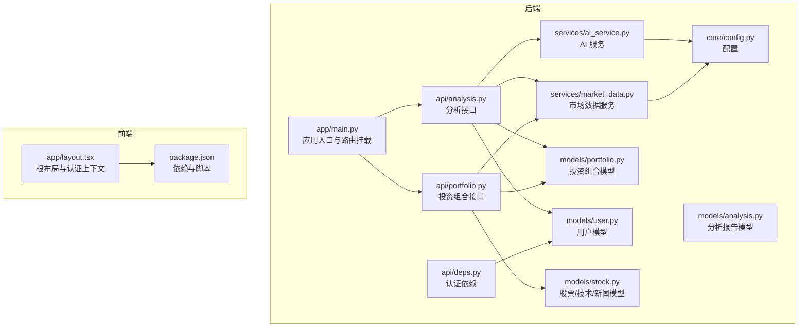
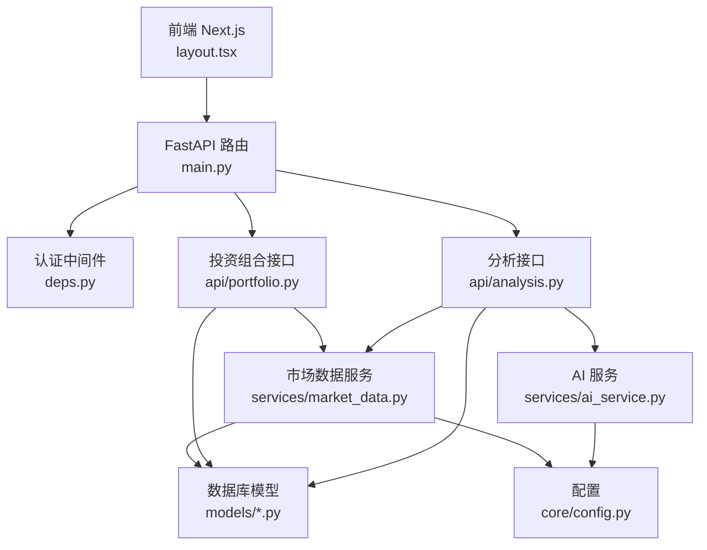
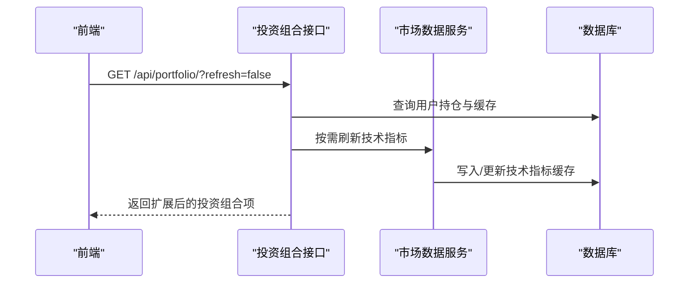
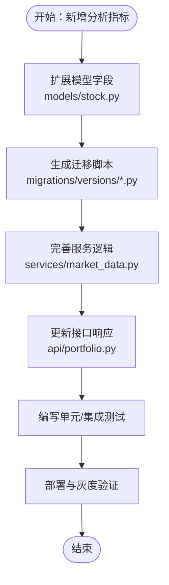
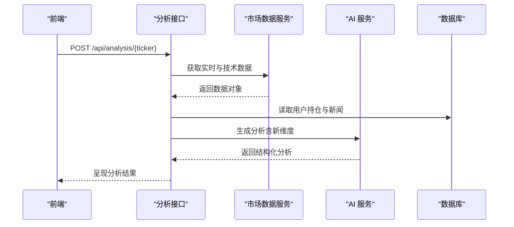
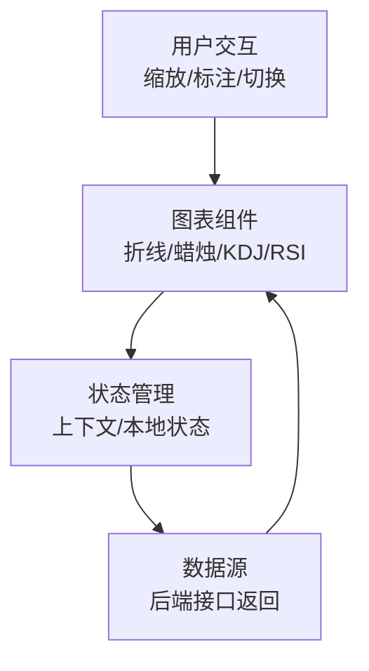
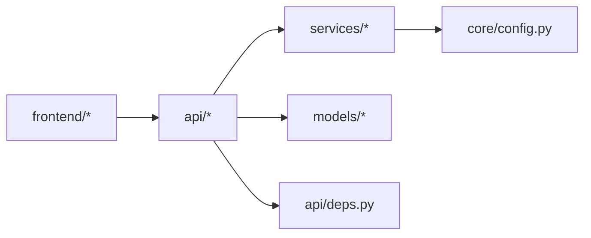

# 功能扩展开发

<cite>
**本文引用的文件**
- [README.md](file://README.md)
- [backend/app/main.py](file://backend/app/main.py)
- [backend/app/api/portfolio.py](file://backend/app/api/portfolio.py)
- [backend/app/models/portfolio.py](file://backend/app/models/portfolio.py)
- [backend/app/models/stock.py](file://backend/app/models/stock.py)
- [backend/app/models/analysis.py](file://backend/app/models/analysis.py)
- [backend/app/models/user.py](file://backend/app/models/user.py)
- [backend/app/api/analysis.py](file://backend/app/api/analysis.py)
- [backend/app/services/ai_service.py](file://backend/app/services/ai_service.py)
- [backend/app/services/market_data.py](file://backend/app/services/market_data.py)
- [backend/app/api/deps.py](file://backend/app/api/deps.py)
- [backend/app/core/config.py](file://backend/app/core/config.py)
- [frontend/app/layout.tsx](file://frontend/app/layout.tsx)
- [frontend/package.json](file://frontend/package.json)
- [doc/PRD.md](file://doc/PRD.md)
</cite>

## 目录
1. [简介](#简介)
2. [项目结构](#项目结构)
3. [核心组件](#核心组件)
4. [架构总览](#架构总览)
5. [详细组件分析](#详细组件分析)
6. [依赖分析](#依赖分析)
7. [性能考量](#性能考量)
8. [故障排查指南](#故障排查指南)
9. [结论](#结论)
10. [附录](#附录)

## 简介
本指南面向需要在现有 AI 股票顾问平台基础上进行功能扩展的开发者，覆盖从需求分析、技术评估、设计评审到实现计划的全流程；详述后端 API 扩展方法（路由、数据模型、业务逻辑）、前端功能扩展（组件、状态管理、交互）、投资组合管理扩展（分析指标、筛选器、报表）、AI 分析扩展（新维度、指标与报告模板）、数据可视化扩展（图表与交互增强），并提供测试策略、质量保障与向后兼容维护方法。

## 项目结构
- 后端采用 FastAPI，按模块组织：API 路由、数据模型、服务层、核心配置与依赖注入。
- 前端采用 Next.js，使用上下文与组件库，布局统一注入认证 Provider。
- 文档包含 PRD、技术栈与数据库规范，指导产品与技术方向。

**图表来源**
- [backend/app/main.py](file://backend/app/main.py#L1-L38)
- [backend/app/api/analysis.py](file://backend/app/api/analysis.py#L1-L124)
- [backend/app/api/portfolio.py](file://backend/app/api/portfolio.py#L1-L297)
- [backend/app/services/ai_service.py](file://backend/app/services/ai_service.py#L1-L112)
- [backend/app/services/market_data.py](file://backend/app/services/market_data.py#L1-L370)
- [backend/app/models/stock.py](file://backend/app/models/stock.py#L1-L85)
- [backend/app/models/portfolio.py](file://backend/app/models/portfolio.py#L1-L26)
- [backend/app/models/analysis.py](file://backend/app/models/analysis.py#L1-L25)
- [backend/app/models/user.py](file://backend/app/models/user.py#L1-L31)
- [backend/app/api/deps.py](file://backend/app/api/deps.py#L1-L44)
- [backend/app/core/config.py](file://backend/app/core/config.py#L1-L24)
- [frontend/app/layout.tsx](file://frontend/app/layout.tsx#L1-L39)
- [frontend/package.json](file://frontend/package.json#L1-L43)

**章节来源**
- [README.md](file://README.md#L45-L50)
- [backend/app/main.py](file://backend/app/main.py#L1-L38)
- [frontend/app/layout.tsx](file://frontend/app/layout.tsx#L1-L39)
- [frontend/package.json](file://frontend/package.json#L1-L43)
- [doc/PRD.md](file://doc/PRD.md#L1-L134)

## 核心组件
- 应用入口与路由挂载：集中注册认证、用户、投资组合、分析模块路由，提供健康检查与根路径响应。
- 投资组合模块：提供搜索、查询、新增、删除等功能，支持刷新与后台拉取技术指标。
- 市场数据服务：封装 Alpha Vantage 与 yfinance 数据源，缓存技术指标与新闻，提供一致性数据。
- AI 服务：封装 Gemini SDK，提供分析生成能力，支持工具函数与错误降级。
- 数据模型：涵盖股票、技术指标缓存、新闻、用户、分析报告与投资组合。
- 认证与配置：OAuth2 Bearer 令牌校验，JWT 解码与用户检索，外部 API Key 与代理配置。

**章节来源**
- [backend/app/main.py](file://backend/app/main.py#L1-L38)
- [backend/app/api/portfolio.py](file://backend/app/api/portfolio.py#L1-L297)
- [backend/app/services/market_data.py](file://backend/app/services/market_data.py#L1-L370)
- [backend/app/services/ai_service.py](file://backend/app/services/ai_service.py#L1-L112)
- [backend/app/models/stock.py](file://backend/app/models/stock.py#L1-L85)
- [backend/app/models/analysis.py](file://backend/app/models/analysis.py#L1-L25)
- [backend/app/models/user.py](file://backend/app/models/user.py#L1-L31)
- [backend/app/api/deps.py](file://backend/app/api/deps.py#L1-L44)
- [backend/app/core/config.py](file://backend/app/core/config.py#L1-L24)

## 架构总览
系统采用前后端分离，后端以 FastAPI 提供 REST 接口，前端 Next.js 提供交互界面。认证通过 JWT 令牌传递，数据流经市场数据服务与 AI 服务，持久化于数据库。

**图表来源**
- [backend/app/main.py](file://backend/app/main.py#L1-L38)
- [backend/app/api/deps.py](file://backend/app/api/deps.py#L1-L44)
- [backend/app/api/portfolio.py](file://backend/app/api/portfolio.py#L1-L297)
- [backend/app/api/analysis.py](file://backend/app/api/analysis.py#L1-L124)
- [backend/app/services/market_data.py](file://backend/app/services/market_data.py#L1-L370)
- [backend/app/services/ai_service.py](file://backend/app/services/ai_service.py#L1-L112)
- [backend/app/core/config.py](file://backend/app/core/config.py#L1-L24)
- [backend/app/models/*.py](file://backend/app/models/stock.py#L1-L85)

## 详细组件分析

### 投资组合管理扩展（新增分析指标、筛选器、报表）
- 新增分析指标
  - 在技术指标缓存表中增加字段（如新增波动率、成交量比率等），并在市场数据服务中补充计算与落库逻辑。
  - 在投资组合返回模型中扩展字段，确保前端可读取新指标。
- 自定义筛选器
  - 在搜索与查询接口中增加参数（如按行业、涨跌幅区间、技术指标阈值等），并在查询语句中拼装动态条件。
- 报表功能
  - 新增报表接口，聚合用户投资组合与历史分析记录，输出汇总统计与导出能力（CSV/PDF）。

**图表来源**
- [backend/app/api/portfolio.py](file://backend/app/api/portfolio.py#L143-L224)
- [backend/app/services/market_data.py](file://backend/app/services/market_data.py#L13-L170)
- [backend/app/models/stock.py](file://backend/app/models/stock.py#L33-L67)

**章节来源**
- [backend/app/api/portfolio.py](file://backend/app/api/portfolio.py#L1-L297)
- [backend/app/models/stock.py](file://backend/app/models/stock.py#L1-L85)
- [backend/app/services/market_data.py](file://backend/app/services/market_data.py#L1-L370)

### 后端 API 扩展方法（路由、模型、业务逻辑）
- 新增路由
  - 在 app/main.py 中注册新模块路由，设置前缀与标签，便于统一管理与文档生成。
- 数据模型扩展
  - 在 models 下新增或修改 SQLAlchemy 模型，迁移脚本同步变更，保持向后兼容。
- 业务逻辑实现
  - 在对应 api 模块中编写 Pydantic 模型与依赖注入，调用服务层完成数据获取与处理，返回标准化响应。

**图表来源**
- [backend/app/models/stock.py](file://backend/app/models/stock.py#L33-L67)
- [backend/app/services/market_data.py](file://backend/app/services/market_data.py#L13-L170)
- [backend/app/api/portfolio.py](file://backend/app/api/portfolio.py#L143-L224)

**章节来源**
- [backend/app/main.py](file://backend/app/main.py#L24-L29)
- [backend/app/models/stock.py](file://backend/app/models/stock.py#L1-L85)
- [backend/app/api/portfolio.py](file://backend/app/api/portfolio.py#L1-L297)

### AI 分析功能扩展（新维度、指标与报告模板）
- 新增分析维度
  - 在分析接口中引入新上下文（如宏观数据、板块轮动、资金流等），并在 AI 服务中调整提示词工程。
- 自定义指标
  - 在市场数据服务中计算新指标并写入缓存，前端展示与交互。
- 报告模板
  - 设计可配置的报告模板，支持用户选择风格与内容模块，后端生成结构化 JSON 并渲染。

**图表来源**
- [backend/app/api/analysis.py](file://backend/app/api/analysis.py#L13-L124)
- [backend/app/services/market_data.py](file://backend/app/services/market_data.py#L13-L170)
- [backend/app/services/ai_service.py](file://backend/app/services/ai_service.py#L43-L112)
- [backend/app/models/analysis.py](file://backend/app/models/analysis.py#L12-L25)

**章节来源**
- [backend/app/api/analysis.py](file://backend/app/api/analysis.py#L1-L124)
- [backend/app/services/ai_service.py](file://backend/app/services/ai_service.py#L1-L112)
- [backend/app/models/analysis.py](file://backend/app/models/analysis.py#L1-L25)

### 数据可视化功能扩展（图表组件与交互增强）
- 图表组件开发
  - 基于前端依赖（如 react-markdown、lucide-react、date-fns 等）构建复用图表组件，支持 K 线、指标曲线、分时图等。
- 交互增强
  - 实现缩放、平移、标注、指标切换等交互，结合后端返回的多维时间序列数据。
- 状态管理
  - 使用上下文或轻量状态库管理图表状态（选中指标、时间范围、主题等），避免重复渲染。

**图表来源**
- [frontend/package.json](file://frontend/package.json#L11-L29)
- [frontend/app/layout.tsx](file://frontend/app/layout.tsx#L20-L34)

**章节来源**
- [frontend/package.json](file://frontend/package.json#L1-L43)
- [frontend/app/layout.tsx](file://frontend/app/layout.tsx#L1-L39)

### 前端功能扩展（组件、状态管理、用户交互）
- 新组件开发
  - 在 components/ui 或业务页面下新增组件，遵循现有样式与交互规范。
- 状态管理
  - 使用上下文或轻量状态库管理全局状态（如用户信息、分析结果、图表状态）。
- 用户交互设计
  - 优化加载态、错误态与空态，提供明确的反馈与引导。

**章节来源**
- [frontend/app/layout.tsx](file://frontend/app/layout.tsx#L1-L39)
- [frontend/package.json](file://frontend/package.json#L1-L43)

## 依赖分析
- 组件耦合与内聚
  - API 层依赖服务层与模型层，服务层依赖配置与外部 API，形成清晰的分层。
- 直接与间接依赖
  - 分析接口直接依赖市场数据服务与 AI 服务；投资组合接口依赖市场数据服务与用户模型。
- 外部依赖与集成点
  - yfinance、Alpha Vantage、Gemini SDK；数据库为 SQLite（开发环境）。
- 接口契约与实现细节
  - 路由前缀与标签统一；Pydantic 模型作为输入/输出契约；JWT 令牌校验贯穿认证流程。

**图表来源**
- [backend/app/api/analysis.py](file://backend/app/api/analysis.py#L1-L124)
- [backend/app/api/portfolio.py](file://backend/app/api/portfolio.py#L1-L297)
- [backend/app/services/market_data.py](file://backend/app/services/market_data.py#L1-L370)
- [backend/app/services/ai_service.py](file://backend/app/services/ai_service.py#L1-L112)
- [backend/app/models/*.py](file://backend/app/models/stock.py#L1-L85)
- [backend/app/api/deps.py](file://backend/app/api/deps.py#L1-L44)
- [backend/app/core/config.py](file://backend/app/core/config.py#L1-L24)

**章节来源**
- [backend/app/api/analysis.py](file://backend/app/api/analysis.py#L1-L124)
- [backend/app/api/portfolio.py](file://backend/app/api/portfolio.py#L1-L297)
- [backend/app/services/market_data.py](file://backend/app/services/market_data.py#L1-L370)
- [backend/app/services/ai_service.py](file://backend/app/services/ai_service.py#L1-L112)
- [backend/app/models/*.py](file://backend/app/models/stock.py#L1-L85)
- [backend/app/api/deps.py](file://backend/app/api/deps.py#L1-L44)
- [backend/app/core/config.py](file://backend/app/core/config.py#L1-L24)

## 性能考量
- 缓存与并发
  - 技术指标缓存（1 分钟窗口）减少外部 API 调用；SQLite 并发场景下顺序刷新避免会话冲突。
- 数据源优先级
  - 支持 Alpha Vantage 与 yfinance 双通道回退，提升可用性。
- 异步与超时
  - 外部调用设置超时与重试，避免阻塞主请求。
- 前端渲染
  - 图表组件按需渲染，避免全量重绘；状态最小化更新。

**章节来源**
- [backend/app/services/market_data.py](file://backend/app/services/market_data.py#L13-L170)
- [backend/app/api/portfolio.py](file://backend/app/api/portfolio.py#L162-L174)

## 故障排查指南
- 认证失败
  - 检查 JWT 解码与用户检索流程，确认令牌有效与用户存在。
- 外部 API 限流
  - yfinance 429 错误时启用指数退避；Alpha Vantage 限流时切换数据源或提示用户配置自有 Key。
- AI 分析异常
  - 降级为纯文本输出；检查 Gemini Key 配置与网络代理。
- 数据不一致
  - 检查缓存更新逻辑与数据库提交顺序，确保外键约束满足。

**章节来源**
- [backend/app/api/deps.py](file://backend/app/api/deps.py#L17-L44)
- [backend/app/services/market_data.py](file://backend/app/services/market_data.py#L303-L318)
- [backend/app/services/ai_service.py](file://backend/app/services/ai_service.py#L103-L112)

## 结论
通过明确的分层架构与清晰的扩展路径，可在不破坏现有功能的前提下快速迭代新增分析指标、筛选器、报表与可视化能力；同时强化 AI 分析维度与报告模板，提升用户体验与商业价值。建议在每次扩展前完成需求评审与技术评估，严格遵循测试与兼容性策略。

## 附录
- 快速启动与开发环境
  - 后端：安装依赖后运行 Uvicorn；前端：安装依赖后运行 Next.js 开发服务器。
- 文档与路线图
  - PRD 提供产品目标、用户画像与开发路线，指导功能优先级与演进方向。

**章节来源**
- [README.md](file://README.md#L5-L43)
- [doc/PRD.md](file://doc/PRD.md#L114-L134)