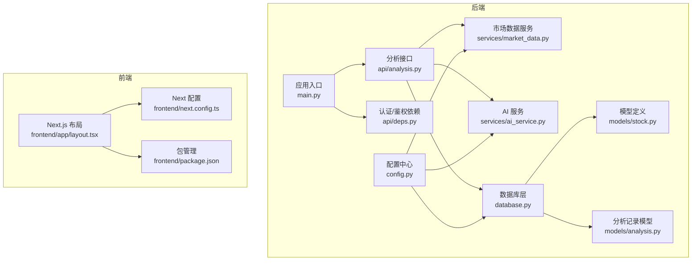
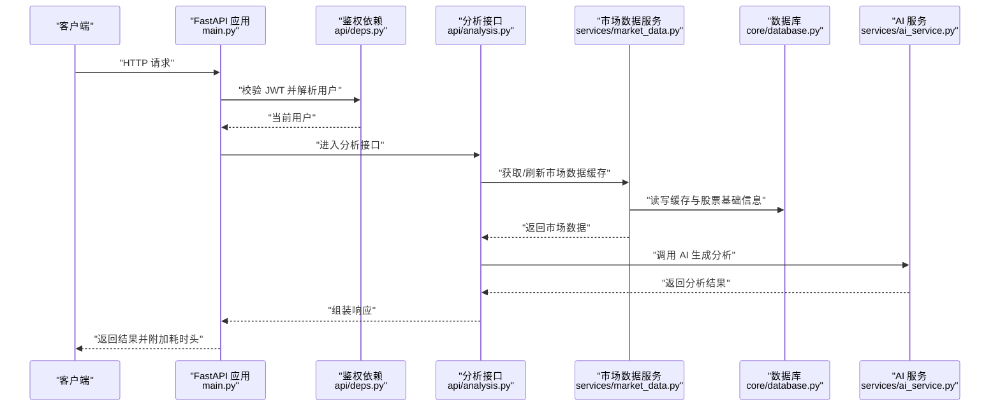
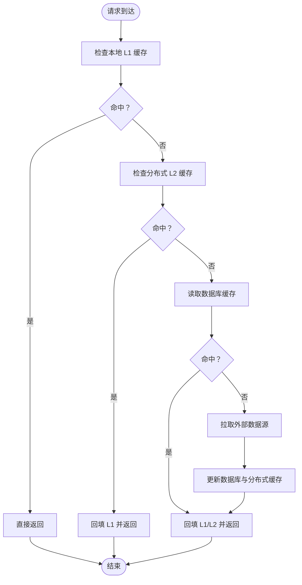
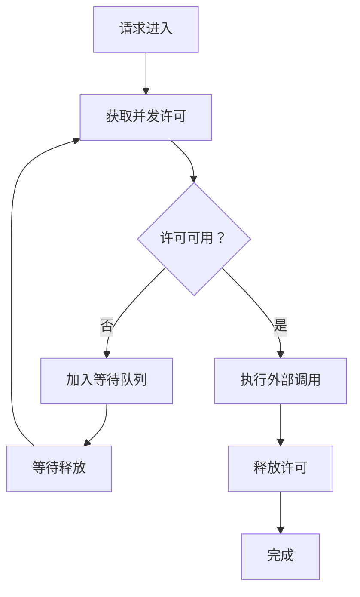
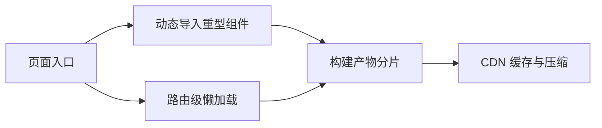
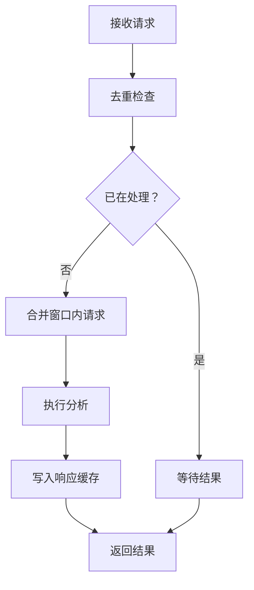
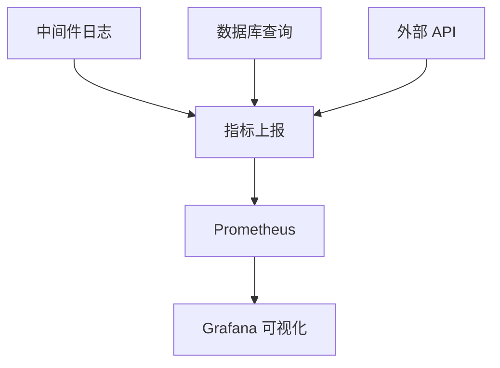
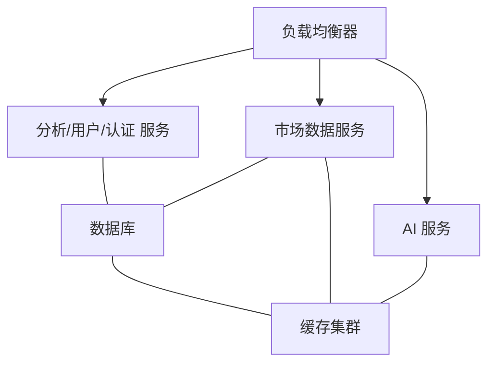
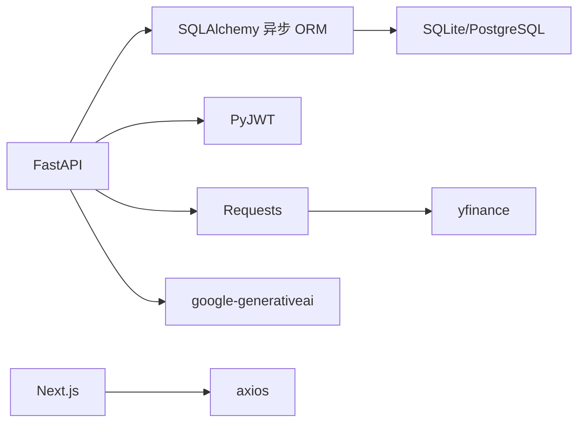

# 性能优化扩展

<cite>
**本文引用的文件**
- [backend/app/main.py](file://backend/app/main.py)
- [backend/app/core/config.py](file://backend/app/core/config.py)
- [backend/app/core/database.py](file://backend/app/core/database.py)
- [backend/app/api/analysis.py](file://backend/app/api/analysis.py)
- [backend/app/api/deps.py](file://backend/app/api/deps.py)
- [backend/app/services/market_data.py](file://backend/app/services/market_data.py)
- [backend/app/services/ai_service.py](file://backend/app/services/ai_service.py)
- [backend/app/models/stock.py](file://backend/app/models/stock.py)
- [backend/app/models/analysis.py](file://backend/app/models/analysis.py)
- [backend/requirements.txt](file://backend/requirements.txt)
- [frontend/app/layout.tsx](file://frontend/app/layout.tsx)
- [frontend/next.config.ts](file://frontend/next.config.ts)
- [frontend/package.json](file://frontend/package.json)
</cite>

## 目录
1. [简介](#简介)
2. [项目结构](#项目结构)
3. [核心组件](#核心组件)
4. [架构总览](#架构总览)
5. [详细组件分析](#详细组件分析)
6. [依赖分析](#依赖分析)
7. [性能考虑](#性能考虑)
8. [故障排查指南](#故障排查指南)
9. [结论](#结论)
10. [附录](#附录)

## 简介
本指南面向“性能优化扩展”，围绕后端缓存策略、异步处理、数据库优化、前端性能、API优化、监控诊断、负载均衡与扩展性、性能测试与瓶颈定位等方面，结合现有代码实现进行系统化梳理与改进建议。目标是在不改变业务语义的前提下，提升系统的吞吐量、降低延迟、增强稳定性与可维护性。

## 项目结构
后端采用 FastAPI + SQLAlchemy 异步 ORM 架构；前端采用 Next.js 16。核心模块包括：
- 应用入口与中间件：日志与耗时统计、CORS 配置、路由注册
- 配置中心：数据库连接串、安全密钥、第三方 API 密钥、代理设置
- 数据层：异步引擎、会话工厂、基础模型与缓存表
- 业务接口：分析接口串联市场数据、AI 服务与用户上下文
- 服务层：市场数据服务（含多源拉取与缓存）、AI 服务（Gemini）
- 前端：Next.js 应用布局与构建配置



**图表来源**
- [backend/app/main.py](file://backend/app/main.py#L20-L87)
- [backend/app/core/config.py](file://backend/app/core/config.py#L4-L25)
- [backend/app/core/database.py](file://backend/app/core/database.py#L1-L24)
- [backend/app/api/analysis.py](file://backend/app/api/analysis.py#L1-L128)
- [backend/app/api/deps.py](file://backend/app/api/deps.py#L17-L44)
- [backend/app/services/market_data.py](file://backend/app/services/market_data.py#L13-L171)
- [backend/app/services/ai_service.py](file://backend/app/services/ai_service.py#L8-L112)
- [backend/app/models/stock.py](file://backend/app/models/stock.py#L13-L85)
- [backend/app/models/analysis.py](file://backend/app/models/analysis.py#L12-L25)
- [frontend/app/layout.tsx](file://frontend/app/layout.tsx#L20-L38)
- [frontend/next.config.ts](file://frontend/next.config.ts#L3-L7)
- [frontend/package.json](file://frontend/package.json#L1-L43)

**章节来源**
- [backend/app/main.py](file://backend/app/main.py#L20-L87)
- [backend/app/core/config.py](file://backend/app/core/config.py#L4-L25)
- [backend/app/core/database.py](file://backend/app/core/database.py#L1-L24)
- [backend/app/api/analysis.py](file://backend/app/api/analysis.py#L1-L128)
- [backend/app/api/deps.py](file://backend/app/api/deps.py#L17-L44)
- [backend/app/services/market_data.py](file://backend/app/services/market_data.py#L13-L171)
- [backend/app/services/ai_service.py](file://backend/app/services/ai_service.py#L8-L112)
- [backend/app/models/stock.py](file://backend/app/models/stock.py#L13-L85)
- [backend/app/models/analysis.py](file://backend/app/models/analysis.py#L12-L25)
- [frontend/app/layout.tsx](file://frontend/app/layout.tsx#L20-L38)
- [frontend/next.config.ts](file://frontend/next.config.ts#L3-L7)
- [frontend/package.json](file://frontend/package.json#L1-L43)

## 核心组件
- 应用入口与中间件：统一日志与耗时统计、CORS、路由注册、健康检查
- 配置中心：数据库 URL、安全算法、API 密钥、代理
- 数据库层：异步引擎、会话工厂、基础模型与缓存表
- 分析接口：权限校验、限流、市场数据获取、新闻与持仓上下文、AI 生成
- 市场数据服务：多源拉取（yfinance、Alpha Vantage）、缓存更新、技术指标计算、新闻入库
- AI 服务：Gemini 配置与内容生成
- 前端：Next.js 布局与构建配置

**章节来源**
- [backend/app/main.py](file://backend/app/main.py#L20-L87)
- [backend/app/core/config.py](file://backend/app/core/config.py#L4-L25)
- [backend/app/core/database.py](file://backend/app/core/database.py#L1-L24)
- [backend/app/api/analysis.py](file://backend/app/api/analysis.py#L14-L128)
- [backend/app/services/market_data.py](file://backend/app/services/market_data.py#L13-L171)
- [backend/app/services/ai_service.py](file://backend/app/services/ai_service.py#L8-L112)
- [frontend/app/layout.tsx](file://frontend/app/layout.tsx#L20-L38)

## 架构总览
下图展示从客户端到后端接口、数据库与外部数据源的整体流程，以及关键性能节点（缓存、限流、异步执行、AI 调用）。



**图表来源**
- [backend/app/main.py](file://backend/app/main.py#L22-L53)
- [backend/app/api/deps.py](file://backend/app/api/deps.py#L17-L44)
- [backend/app/api/analysis.py](file://backend/app/api/analysis.py#L14-L128)
- [backend/app/services/market_data.py](file://backend/app/services/market_data.py#L13-L171)
- [backend/app/services/ai_service.py](file://backend/app/services/ai_service.py#L42-L112)
- [backend/app/core/database.py](file://backend/app/core/database.py#L21-L24)

## 详细组件分析

### 缓存策略扩展（多级缓存、失效与预热）
现状与问题
- 单层缓存：MarketDataCache 表作为缓存表，按分钟级 TTL 刷新
- 缺少跨进程/跨实例共享缓存（Redis/Memcached）
- 缺少热点数据预热与批量刷新策略
- 缺少缓存命中率与延迟指标

优化建议
- 多级缓存
  - 本地 L1：进程内缓存（如 LRU 容器），命中即返回
  - 分布式 L2：Redis/Memcached，用于跨实例共享
  - 持久化 L3：数据库缓存表，作为最终一致性与冷启动来源
- 失效策略
  - 写时失效：更新数据库缓存后，删除分布式缓存键
  - 过期时间：不同指标区分 TTL（如价格 60s，技术指标 300s，新闻 1800s）
  - 主动失效：在数据源异常或限流时，保留旧值并触发后台刷新
- 预热机制
  - 启动时批量加载热门股票缓存
  - 周期性扫描高频股票并刷新缓存
  - 接口层在缓存缺失时触发后台异步刷新



**图表来源**
- [backend/app/services/market_data.py](file://backend/app/services/market_data.py#L14-L171)
- [backend/app/models/stock.py](file://backend/app/models/stock.py#L33-L67)

**章节来源**
- [backend/app/services/market_data.py](file://backend/app/services/market_data.py#L14-L171)
- [backend/app/models/stock.py](file://backend/app/models/stock.py#L33-L67)

### 异步处理优化（并发控制、任务队列、资源池）
现状与问题
- 使用 asyncio 和线程池执行外部 HTTP 请求
- 未见显式的并发上限与队列长度控制
- 外部 API 调用存在超时与重试，但缺乏统一并发调度

优化建议
- 并发控制
  - 限制每秒/每分钟外部请求并发数（如基于令牌桶）
  - 对不同数据源设置独立并发配额
- 任务队列
  - 引入消息队列（RabbitMQ/Redis Streams/Kafka）承载非实时任务（如批量刷新、历史回测）
  - 对热点股票建立优先级队列，保证高 QPS 下的公平性
- 资源池配置
  - 外部 HTTP 客户端连接池大小与超时参数调优
  - 数据库连接池大小与生命周期管理（最大连接数、空闲回收）



**图表来源**
- [backend/app/services/market_data.py](file://backend/app/services/market_data.py#L25-L57)
- [backend/app/core/config.py](file://backend/app/core/config.py#L15-L18)

**章节来源**
- [backend/app/services/market_data.py](file://backend/app/services/market_data.py#L25-L57)
- [backend/app/core/config.py](file://backend/app/core/config.py#L15-L18)

### 数据库性能优化（查询、连接池、索引）
现状与问题
- 使用异步 SQLAlchemy 引擎与 AsyncSession
- 已有部分索引（last_updated、ticker 等）
- 查询路径清晰，但缺少慢查询与执行计划分析

优化建议
- 查询优化
  - 使用 select 执行器减少 ORM 开销
  - 针对高频查询添加复合索引（如 user_id+created_at）
  - 避免 N+1 查询，使用 join 或预先加载
- 连接池配置
  - 根据并发与数据库规格设置最大连接数与空闲回收
  - 开启连接复用与健康检查
- 索引策略
  - 为分析报表表的 user_id、ticker、created_at 建立联合索引
  - 为缓存表 ticker、last_updated 建立联合索引
  - 对新闻表 publish_time 建立索引以支持排序与范围查询

```mermaid
erDiagram
STOCKS {
string ticker PK
string name
string sector
string industry
}
MARKET_DATA_CACHE {
string ticker PK,FK
float current_price
float change_percent
datetime last_updated IDX
}
STOCK_NEWS {
string id PK
string ticker FK
string title
datetime publish_time IDX
}
ANALYSIS_REPORTS {
string id PK
string user_id FK
string ticker FK
datetime created_at IDX
}
STOCKS ||--o{ MARKET_DATA_CACHE : "拥有"
STOCKS ||--o{ STOCK_NEWS : "拥有"
USERS ||--o{ ANALYSIS_REPORTS : "生成"
```

**图表来源**
- [backend/app/models/stock.py](file://backend/app/models/stock.py#L13-L85)
- [backend/app/models/analysis.py](file://backend/app/models/analysis.py#L12-L25)

**章节来源**
- [backend/app/core/database.py](file://backend/app/core/database.py#L1-L24)
- [backend/app/models/stock.py](file://backend/app/models/stock.py#L13-L85)
- [backend/app/models/analysis.py](file://backend/app/models/analysis.py#L12-L25)

### 前端性能优化（懒加载、代码分割、资源压缩）
现状与问题
- Next.js 16 默认具备代码分割能力
- 未见明确的构建优化配置与资源压缩策略

优化建议
- 组件懒加载
  - 使用动态导入（dynamic import）对重型组件（如图表、编辑器）进行懒加载
  - 页面级路由懒加载，减少首屏 JS 体积
- 代码分割
  - 将第三方库拆分为独立 chunk，利用浏览器缓存
  - 提取公共依赖（React、Next、UI 组件库）避免重复打包
- 资源压缩与缓存
  - 启用最小化与 Tree Shaking（Next 默认开启）
  - 使用 CDN 与持久缓存策略，静态资源版本化
  - 图片与字体优化（WebP、SVG、可变字体）



**图表来源**
- [frontend/app/layout.tsx](file://frontend/app/layout.tsx#L20-L38)
- [frontend/next.config.ts](file://frontend/next.config.ts#L3-L7)
- [frontend/package.json](file://frontend/package.json#L11-L29)

**章节来源**
- [frontend/app/layout.tsx](file://frontend/app/layout.tsx#L20-L38)
- [frontend/next.config.ts](file://frontend/next.config.ts#L3-L7)
- [frontend/package.json](file://frontend/package.json#L11-L29)

### API 性能优化（请求合并、响应缓存、限流）
现状与问题
- 分析接口已内置免费层级限流（当日请求次数）
- 未见统一的响应缓存与请求合并策略

优化建议
- 请求合并
  - 对同一用户短时间内对相同股票的分析请求进行合并，返回同一结果
  - 使用内存队列去重，避免重复触发外部数据拉取
- 响应缓存
  - 对热点股票与常用组合结果设置短期缓存（如 60s）
  - 使用 ETag/Last-Modified 实现条件缓存
- 限流策略
  - 基于用户维度与 IP 维度的混合限流
  - 区分不同角色（免费/付费）的配额与宽限期



**图表来源**
- [backend/app/api/analysis.py](file://backend/app/api/analysis.py#L28-L52)

**章节来源**
- [backend/app/api/analysis.py](file://backend/app/api/analysis.py#L28-L52)

### 监控与诊断（指标采集、慢查询追踪、内存泄漏检测）
现状与问题
- 中间件已记录请求耗时与状态码
- 缺少数据库慢查询、AI 调用耗时、缓存命中率等指标

优化建议
- 指标采集
  - 记录：请求耗时、缓存命中率、数据库查询耗时、外部 API 延迟、错误率
  - 使用 Prometheus/Grafana 收集与可视化
- 慢查询追踪
  - 对超过阈值的 SQL 与外部调用打点，输出调用栈
  - 在数据库侧启用慢查询日志
- 内存泄漏检测
  - 定期快照堆内存，定位异常增长
  - 关注长生命周期对象（缓存、定时器、事件监听）



**图表来源**
- [backend/app/main.py](file://backend/app/main.py#L22-L53)

**章节来源**
- [backend/app/main.py](file://backend/app/main.py#L22-L53)

### 负载均衡与扩展性（水平扩展、微服务拆分、容器编排）
现状与问题
- 当前为单体应用，未见服务拆分与容器编排

优化建议
- 水平扩展
  - 无状态接口（分析、用户、认证）可直接横向扩展
  - 有状态模块（数据库、缓存）需考虑副本与一致性
- 微服务拆分
  - 市场数据服务、AI 服务、分析服务可独立部署
  - 引入 API Gateway 与服务发现
- 容器编排
  - 使用 Kubernetes 部署，设置 HPA/PDB
  - 通过 Ingress 控制外部流量，启用灰度发布



**图表来源**
- [backend/app/api/analysis.py](file://backend/app/api/analysis.py#L14-L128)
- [backend/app/services/market_data.py](file://backend/app/services/market_data.py#L13-L171)
- [backend/app/services/ai_service.py](file://backend/app/services/ai_service.py#L8-L112)

**章节来源**
- [backend/app/api/analysis.py](file://backend/app/api/analysis.py#L14-L128)
- [backend/app/services/market_data.py](file://backend/app/services/market_data.py#L13-L171)
- [backend/app/services/ai_service.py](file://backend/app/services/ai_service.py#L8-L112)

### 性能测试与基准测试（瓶颈识别与方案）
- 压力测试
  - 使用 Locust/JMeter 对分析接口施压，观察 P95/P99 延迟与错误率
  - 针对数据库、缓存、外部 API 设置不同并发场景
- 基准测试
  - 对关键函数（技术指标计算、外部拉取）做微基准测试
- 瓶颈识别
  - 通过指标与追踪定位：数据库锁、缓存未命中、外部 API 限流、CPU 密集计算
- 解决方案
  - 优化索引与查询、引入缓存、增加并发配额、异步化与批量化

[本节为通用指导，无需特定文件引用]

## 依赖分析
后端依赖关系概览：FastAPI 作为 Web 框架，依赖 SQLAlchemy 异步 ORM 进行数据库访问；外部数据源通过 requests/yfinance 拉取；AI 服务依赖 Gemini SDK；前端依赖 Next.js 生态。



**图表来源**
- [backend/requirements.txt](file://backend/requirements.txt#L1-L75)
- [frontend/package.json](file://frontend/package.json#L11-L29)

**章节来源**
- [backend/requirements.txt](file://backend/requirements.txt#L1-L75)
- [frontend/package.json](file://frontend/package.json#L11-L29)

## 性能考虑
- I/O 密集优先：外部 API 与数据库访问尽量异步化
- CPU 密集延迟：技术指标计算可异步执行或缓存
- 网络抖动：对外部调用设置指数退避与超时
- 资源复用：连接池与线程池参数与并发策略匹配实际负载
- 缓存优先：热点数据优先走缓存，未命中再回源

[本节为通用指导，无需特定文件引用]

## 故障排查指南
- 日志与耗时
  - 中间件已记录请求耗时与状态码，便于快速定位慢请求
- 鉴权失败
  - 依赖模块对无效 token 返回 403，检查密钥与算法配置
- 外部数据源异常
  - 市场数据服务对 yfinance/Alpha Vantage 设有重试与降级，关注限流与超时
- AI 服务异常
  - 未配置 API Key 时返回提示信息，确保密钥正确

**章节来源**
- [backend/app/main.py](file://backend/app/main.py#L22-L53)
- [backend/app/api/deps.py](file://backend/app/api/deps.py#L21-L43)
- [backend/app/services/market_data.py](file://backend/app/services/market_data.py#L29-L57)
- [backend/app/services/ai_service.py](file://backend/app/services/ai_service.py#L42-L51)

## 结论
通过引入多级缓存、并发控制与任务队列、数据库索引与连接池优化、前端懒加载与代码分割、统一响应缓存与限流策略、完善的监控与诊断体系，以及水平扩展与容器编排，可在保持业务稳定性的前提下显著提升整体性能与可扩展性。建议按优先级逐步落地，并持续通过指标与压测验证效果。

## 附录
- 快速检查清单
  - 是否启用缓存（本地/分布式/数据库）
  - 是否设置并发上限与队列长度
  - 是否为高频字段建立索引
  - 是否启用响应缓存与 ETag
  - 是否接入指标与可视化
  - 是否具备限流与熔断
  - 是否完成前端懒加载与代码分割
  - 是否具备压力测试与瓶颈定位手段

[本节为通用指导，无需特定文件引用]