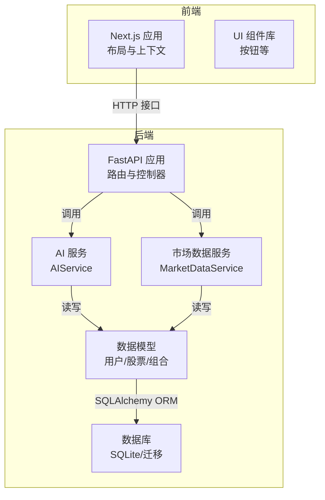
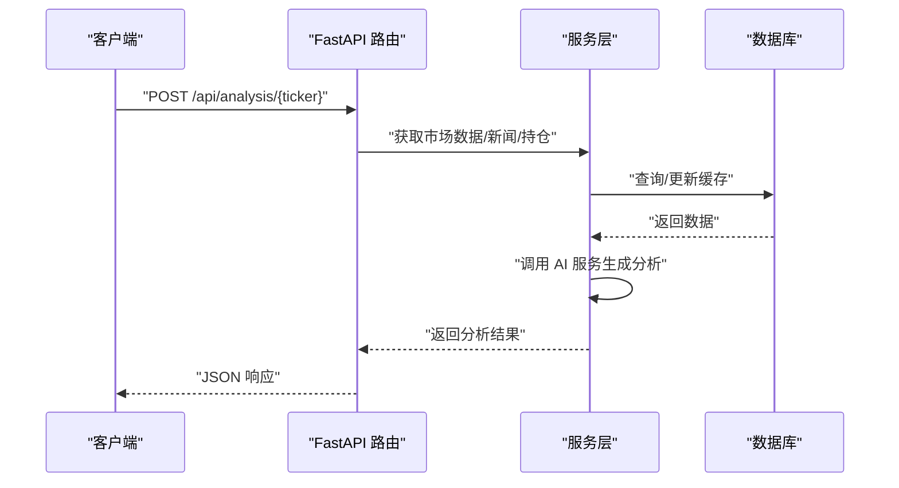
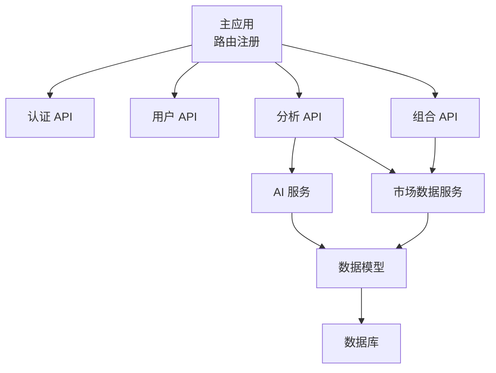

# 扩展开发

<cite>
**本文引用的文件**
- [backend/app/main.py](file://backend/app/main.py)
- [backend/app/core/config.py](file://backend/app/core/config.py)
- [backend/app/api/auth.py](file://backend/app/api/auth.py)
- [backend/app/api/portfolio.py](file://backend/app/api/portfolio.py)
- [backend/app/api/analysis.py](file://backend/app/api/analysis.py)
- [backend/app/services/ai_service.py](file://backend/app/services/ai_service.py)
- [backend/app/services/market_data.py](file://backend/app/services/market_data.py)
- [backend/app/models/user.py](file://backend/app/models/user.py)
- [backend/app/models/stock.py](file://backend/app/models/stock.py)
- [backend/app/models/portfolio.py](file://backend/app/models/portfolio.py)
- [backend/migrations/versions/35a834f440ba_baseline.py](file://backend/migrations/versions/35a834f440ba_baseline.py)
- [frontend/app/layout.tsx](file://frontend/app/layout.tsx)
- [frontend/context/AuthContext.tsx](file://frontend/context/AuthContext.tsx)
- [frontend/components/ui/button.tsx](file://frontend/components/ui/button.tsx)
- [README.md](file://README.md)
</cite>

## 目录
1. [引言](#引言)
2. [项目结构](#项目结构)
3. [核心组件](#核心组件)
4. [架构总览](#架构总览)
5. [详细组件分析](#详细组件分析)
6. [依赖分析](#依赖分析)
7. [性能考虑](#性能考虑)
8. [故障排查指南](#故障排查指南)
9. [结论](#结论)
10. [附录](#附录)

## 引言
本指南面向扩展开发者，系统阐述如何在现有架构上进行功能扩展与集成。内容覆盖插件系统扩展点、接口定义、第三方服务集成、UI 组件扩展、API 扩展策略、数据模型扩展、性能优化、测试扩展与部署扩展配置。目标是帮助你在不破坏现有系统稳定性的前提下，安全、可维护地引入新能力。

## 项目结构
项目采用前后端分离架构：
- 后端基于 FastAPI，提供认证、组合管理、AI 分析、市场数据服务等接口。
- 前端基于 Next.js，提供仪表盘与 UI 组件，使用上下文管理认证状态。
- 数据层通过 SQLAlchemy ORM 定义模型，Alembic 管理数据库迁移。

图表来源
- [backend/app/main.py](file://backend/app/main.py#L1-L38)
- [backend/app/api/portfolio.py](file://backend/app/api/portfolio.py#L1-L297)
- [backend/app/api/analysis.py](file://backend/app/api/analysis.py#L1-L124)
- [backend/app/services/ai_service.py](file://backend/app/services/ai_service.py#L1-L112)
- [backend/app/services/market_data.py](file://backend/app/services/market_data.py#L1-L370)
- [backend/app/models/user.py](file://backend/app/models/user.py#L1-L31)
- [backend/app/models/stock.py](file://backend/app/models/stock.py#L1-L85)
- [backend/app/models/portfolio.py](file://backend/app/models/portfolio.py#L1-L26)

章节来源
- [README.md](file://README.md#L45-L50)
- [backend/app/main.py](file://backend/app/main.py#L1-L38)

## 核心组件
- 应用入口与路由：后端通过主应用注册认证、用户、组合、分析等路由，统一暴露 REST 接口。
- 配置中心：集中管理数据库连接、安全密钥、外部服务密钥与代理设置。
- 认证与授权：基于 JWT 的登录/注册流程，配合用户模型中的会员等级与 API Key 字段。
- 市场数据服务：封装 Alpha Vantage 与 yfinance 的数据获取与技术指标计算，支持缓存与回退。
- AI 服务：封装 Gemini SDK 调用，支持工具函数与提示工程，具备降级与错误处理。
- 数据模型：用户、股票、组合、市场数据缓存与新闻表，支持多指标与关系映射。
- 前端布局与认证上下文：提供全局样式、字体与认证状态管理。

章节来源
- [backend/app/main.py](file://backend/app/main.py#L24-L29)
- [backend/app/core/config.py](file://backend/app/core/config.py#L1-L24)
- [backend/app/api/auth.py](file://backend/app/api/auth.py#L1-L88)
- [backend/app/services/market_data.py](file://backend/app/services/market_data.py#L13-L170)
- [backend/app/services/ai_service.py](file://backend/app/services/ai_service.py#L8-L112)
- [backend/app/models/user.py](file://backend/app/models/user.py#L15-L31)
- [backend/app/models/stock.py](file://backend/app/models/stock.py#L13-L85)
- [frontend/app/layout.tsx](file://frontend/app/layout.tsx#L1-L39)
- [frontend/context/AuthContext.tsx](file://frontend/context/AuthContext.tsx#L1-L60)

## 架构总览
后端以 FastAPI 为核心，API 层负责请求处理与鉴权，服务层封装业务逻辑，模型层负责数据持久化。前端通过 HTTP 与后端交互，使用认证上下文管理登录态。

图表来源
- [backend/app/api/analysis.py](file://backend/app/api/analysis.py#L13-L124)
- [backend/app/services/market_data.py](file://backend/app/services/market_data.py#L14-L170)
- [backend/app/services/ai_service.py](file://backend/app/services/ai_service.py#L43-L112)

## 详细组件分析

### 插件系统与扩展点识别
- 扩展点一：服务层注入
  - 在服务类中预留“适配器”或“工厂”模式，允许替换/扩展具体实现（例如市场数据源、AI 模型）。
  - 参考路径：[服务类定义](file://backend/app/services/market_data.py#L13-L170)，[AI 服务类](file://backend/app/services/ai_service.py#L8-L112)
- 扩展点二：配置中心
  - 通过配置类集中管理外部服务密钥与行为开关，便于动态启用/禁用扩展。
  - 参考路径：[配置类](file://backend/app/core/config.py#L4-L24)
- 扩展点三：API 路由
  - 新增路由模块，按领域划分（如 analysis、portfolio），保持清晰的命名空间与标签。
  - 参考路径：[主应用路由注册](file://backend/app/main.py#L24-L29)

章节来源
- [backend/app/services/market_data.py](file://backend/app/services/market_data.py#L13-L170)
- [backend/app/services/ai_service.py](file://backend/app/services/ai_service.py#L8-L112)
- [backend/app/core/config.py](file://backend/app/core/config.py#L1-L24)
- [backend/app/main.py](file://backend/app/main.py#L24-L29)

### 新功能添加开发流程
- 需求分析
  - 明确领域边界与数据流，评估对模型、服务与 API 的影响。
  - 参考现有模型与服务，避免重复造轮子。
- 设计评审
  - 评审扩展点选择、接口契约、错误处理与性能影响。
- 实现步骤
  - 在服务层实现核心逻辑；在 API 层新增路由与校验；在模型层扩展数据库结构（如有需要）；在前端新增页面或组件。
- 测试与验证
  - 编写单元/集成测试，验证数据一致性与边界条件。
- 发布与回滚
  - 使用迁移脚本管理数据库变更；准备回滚方案。

章节来源
- [backend/app/api/portfolio.py](file://backend/app/api/portfolio.py#L143-L224)
- [backend/app/models/stock.py](file://backend/app/models/stock.py#L13-L85)

### 第三方服务集成（AI 模型/数据源）
- 集成 AI 模型（Gemini）
  - 通过配置类读取密钥，服务层封装调用与降级策略。
  - 参考路径：[配置类](file://backend/app/core/config.py#L14-L16)，[AI 服务](file://backend/app/services/ai_service.py#L43-L112)
- 集成市场数据源（Alpha Vantage/yfinance）
  - 优先使用首选源，失败时回退到备选源；支持缓存与模拟数据。
  - 参考路径：[市场数据服务](file://backend/app/services/market_data.py#L14-L170)
- 新增数据源建议
  - 在服务层新增适配器，遵循统一返回格式；在配置中增加开关与密钥；在模型层扩展存储结构（如新增表或字段）。

章节来源
- [backend/app/services/ai_service.py](file://backend/app/services/ai_service.py#L12-L18)
- [backend/app/services/market_data.py](file://backend/app/services/market_data.py#L29-L57)

### UI 组件扩展（自定义组件与主题）
- 自定义组件
  - 基于现有组件库（如按钮）进行封装，保持一致的变体与尺寸体系。
  - 参考路径：[按钮组件](file://frontend/components/ui/button.tsx#L7-L37)
- 主题定制
  - 通过全局样式与字体变量统一风格；在布局中注入上下文提供认证态。
  - 参考路径：[应用布局](file://frontend/app/layout.tsx#L15-L38)，[认证上下文](file://frontend/context/AuthContext.tsx#L15-L51)

章节来源
- [frontend/components/ui/button.tsx](file://frontend/components/ui/button.tsx#L1-L63)
- [frontend/app/layout.tsx](file://frontend/app/layout.tsx#L1-L39)
- [frontend/context/AuthContext.tsx](file://frontend/context/AuthContext.tsx#L1-L60)

### API 扩展策略（版本管理与兼容）
- 版本管理
  - 采用前缀区分版本（如 /api/v1/...），逐步迁移旧接口。
  - 参考现有路由前缀：[路由注册](file://backend/app/main.py#L26-L29)
- 向后兼容
  - 保持响应字段稳定；新增字段时提供默认值；对废弃字段保留一段时间并标注弃用。
- 错误处理
  - 统一异常类型与状态码；在分析接口中体现限流与降级策略。
  - 参考路径：[分析接口限流](file://backend/app/api/analysis.py#L46-L50)

章节来源
- [backend/app/main.py](file://backend/app/main.py#L26-L29)
- [backend/app/api/analysis.py](file://backend/app/api/analysis.py#L27-L50)

### 数据模型扩展（迁移与字段）
- 迁移管理
  - 使用 Alembic 生成与执行迁移；在迁移脚本中仅做增量变更。
  - 参考路径：[基线迁移](file://backend/migrations/versions/35a834f440ba_baseline.py#L21-L32)
- 字段扩展
  - 在模型中新增列；确保服务层与 API 层同步更新；必要时提供默认值与回填逻辑。
  - 参考路径：[用户模型](file://backend/app/models/user.py#L24-L27)，[股票模型](file://backend/app/models/stock.py#L33-L67)

章节来源
- [backend/migrations/versions/35a834f440ba_baseline.py](file://backend/migrations/versions/35a834f440ba_baseline.py#L1-L33)
- [backend/app/models/user.py](file://backend/app/models/user.py#L24-L27)
- [backend/app/models/stock.py](file://backend/app/models/stock.py#L33-L67)

### 性能优化扩展（缓存与异步）
- 缓存策略
  - 市场数据缓存 1 分钟窗口，减少外部调用；回退时对现有缓存做小幅扰动维持“实时感”。
  - 参考路径：[缓存判定与回退](file://backend/app/services/market_data.py#L22-L86)
- 异步处理
  - 在组合新增时后台拉取数据，避免阻塞响应。
  - 参考路径：[后台拉取](file://backend/app/api/portfolio.py#L268-L278)
- 并发与限流
  - 对外部 API 设置超时与重试；对 yfinance 增加重试与指数退避；对免费用户进行使用次数限制。
  - 参考路径：[yfinance 重试与退避](file://backend/app/services/market_data.py#L303-L318)，[免费用户限流](file://backend/app/api/analysis.py#L46-L50)

章节来源
- [backend/app/services/market_data.py](file://backend/app/services/market_data.py#L22-L86)
- [backend/app/api/portfolio.py](file://backend/app/api/portfolio.py#L268-L278)
- [backend/app/api/analysis.py](file://backend/app/api/analysis.py#L46-L50)

### 测试扩展指南（用例与环境）
- 单元测试
  - 针对服务层方法（如数据获取、AI 调用）编写独立测试，使用内存数据库或模拟外部服务。
- 集成测试
  - 覆盖 API 端到端流程，包括鉴权、限流、缓存命中与降级路径。
- 测试环境
  - 使用 .env 示例配置测试密钥与代理；在 CI 中隔离数据库与外部 API 调用。

章节来源
- [backend/app/core/config.py](file://backend/app/core/config.py#L13-L17)
- [backend/app/services/ai_service.py](file://backend/app/services/ai_service.py#L12-L18)
- [backend/app/services/market_data.py](file://backend/app/services/market_data.py#L303-L318)

### 部署扩展配置（容器化与集群）
- 容器化
  - 后端使用 uvicorn 运行 FastAPI；前端构建静态资源；通过 Dockerfile 与 docker-compose 管理镜像与编排。
- 集群部署
  - 使用反向代理（Nginx）与负载均衡；为后端与前端分别配置健康检查与扩缩容策略；持久化数据库与日志。
- 环境变量
  - 通过 .env 或 Kubernetes Secret 注入密钥与代理；确保生产环境仅允许特定来源访问。

章节来源
- [README.md](file://README.md#L14-L44)
- [backend/app/core/config.py](file://backend/app/core/config.py#L13-L17)
- [backend/app/main.py](file://backend/app/main.py#L9-L22)

## 依赖分析
后端各模块之间的耦合关系如下：

图表来源
- [backend/app/main.py](file://backend/app/main.py#L24-L29)
- [backend/app/api/analysis.py](file://backend/app/api/analysis.py#L1-L124)
- [backend/app/api/portfolio.py](file://backend/app/api/portfolio.py#L1-L297)
- [backend/app/services/ai_service.py](file://backend/app/services/ai_service.py#L1-L112)
- [backend/app/services/market_data.py](file://backend/app/services/market_data.py#L1-L370)
- [backend/app/models/user.py](file://backend/app/models/user.py#L1-L31)
- [backend/app/models/stock.py](file://backend/app/models/stock.py#L1-L85)
- [backend/app/models/portfolio.py](file://backend/app/models/portfolio.py#L1-L26)

章节来源
- [backend/app/main.py](file://backend/app/main.py#L24-L29)
- [backend/app/api/analysis.py](file://backend/app/api/analysis.py#L1-L124)
- [backend/app/api/portfolio.py](file://backend/app/api/portfolio.py#L1-L297)
- [backend/app/services/ai_service.py](file://backend/app/services/ai_service.py#L1-L112)
- [backend/app/services/market_data.py](file://backend/app/services/market_data.py#L1-L370)

## 性能考虑
- 外部服务调用
  - 为不同数据源设置超时与重试；对 yfinance 实施指数退避与并发控制。
- 缓存与回退
  - 本地缓存减少重复请求；无缓存时提供半真实模拟数据维持体验。
- 异步与后台任务
  - 非关键路径使用异步与后台任务，避免阻塞主流程。
- 数据库事务
  - 在批量更新时注意并发与锁；必要时分批处理与延迟。

章节来源
- [backend/app/services/market_data.py](file://backend/app/services/market_data.py#L303-L318)
- [backend/app/services/market_data.py](file://backend/app/services/market_data.py#L62-L86)
- [backend/app/api/portfolio.py](file://backend/app/api/portfolio.py#L268-L278)

## 故障排查指南
- 认证失败
  - 检查用户是否存在与密码是否正确；确认密钥有效期与算法配置。
  - 参考路径：[登录流程](file://backend/app/api/auth.py#L24-L50)
- AI 功能不可用
  - 确认 Gemini 密钥是否配置；查看日志与降级返回。
  - 参考路径：[AI 服务配置与降级](file://backend/app/services/ai_service.py#L12-L18)，[AI 生成分析](file://backend/app/services/ai_service.py#L43-L112)
- 市场数据获取失败
  - 检查 Alpha Vantage 与 yfinance 的可用性与配额；确认代理设置；查看缓存与回退逻辑。
  - 参考路径：[数据源切换与回退](file://backend/app/services/market_data.py#L29-L86)
- 免费用户受限
  - 检查当日使用次数统计与阈值；引导用户在设置中绑定自有密钥。
  - 参考路径：[限流逻辑](file://backend/app/api/analysis.py#L35-L50)

章节来源
- [backend/app/api/auth.py](file://backend/app/api/auth.py#L24-L50)
- [backend/app/services/ai_service.py](file://backend/app/services/ai_service.py#L12-L18)
- [backend/app/services/market_data.py](file://backend/app/services/market_data.py#L29-L86)
- [backend/app/api/analysis.py](file://backend/app/api/analysis.py#L35-L50)

## 结论
通过明确的扩展点、清晰的接口契约与完善的测试与部署策略，可以在不破坏现有系统稳定性的前提下，持续引入新功能与第三方服务。建议在每次扩展前完成需求与设计评审，严格遵循版本管理与兼容性原则，并配套缓存与异步优化以提升用户体验。

## 附录
- 快速启动与运行
  - 参考路径：[快速启动脚本](file://README.md#L7-L12)，[手动安装与运行](file://README.md#L14-L44)