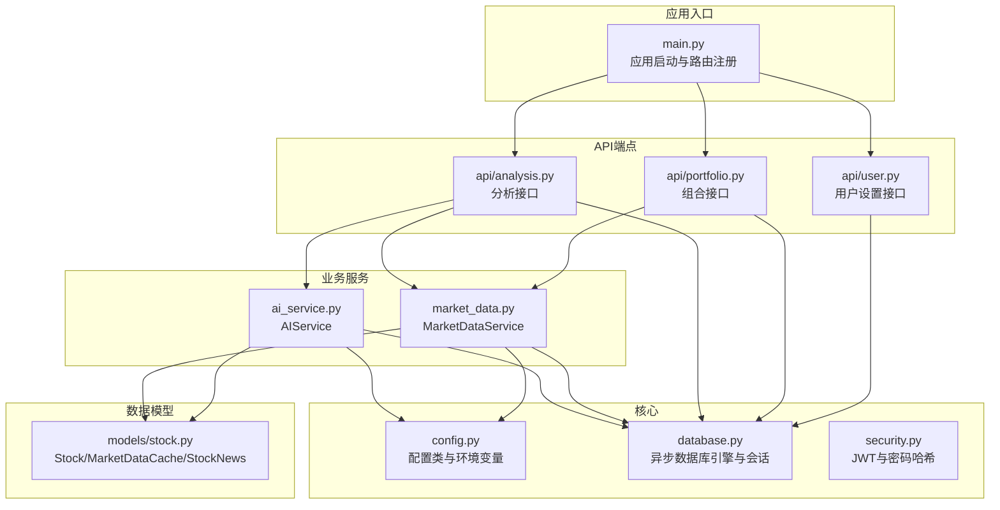
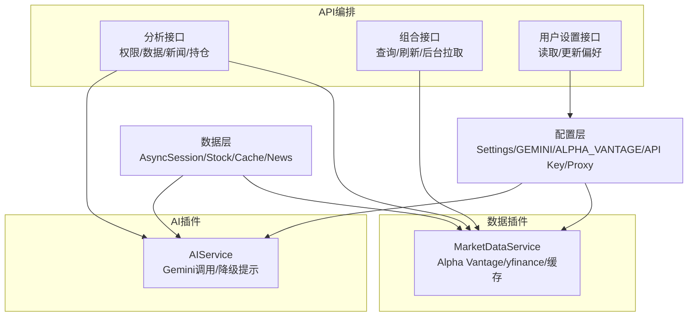
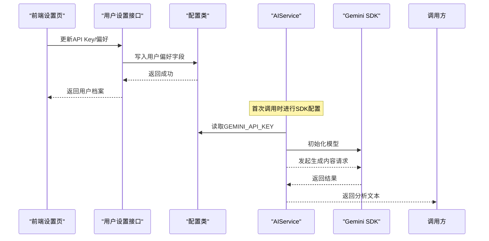
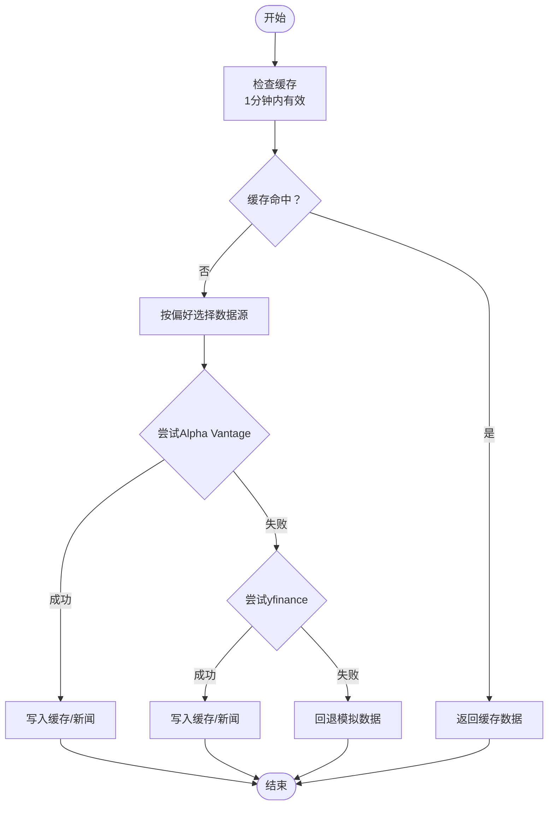
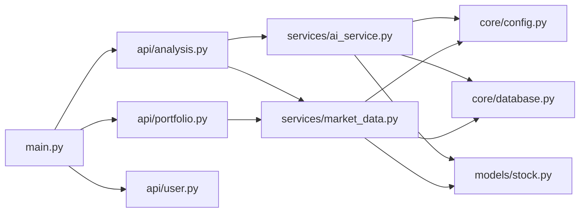

# 插件系统架构

<cite>
**本文引用的文件**
- [backend/app/main.py](file://backend/app/main.py)
- [backend/app/api/analysis.py](file://backend/app/api/analysis.py)
- [backend/app/api/portfolio.py](file://backend/app/api/portfolio.py)
- [backend/app/api/user.py](file://backend/app/api/user.py)
- [backend/app/services/ai_service.py](file://backend/app/services/ai_service.py)
- [backend/app/services/market_data.py](file://backend/app/services/market_data.py)
- [backend/app/core/config.py](file://backend/app/core/config.py)
- [backend/app/core/database.py](file://backend/app/core/database.py)
- [backend/app/core/security.py](file://backend/app/core/security.py)
- [backend/app/models/stock.py](file://backend/app/models/stock.py)
- [backend/app/schemas/user_settings.py](file://backend/app/schemas/user_settings.py)
- [.env.example](file://.env.example)
- [doc/tech_stack.md](file://doc/tech_stack.md)
- [doc/PRD.md](file://doc/PRD.md)
</cite>

## 目录
1. [引言](#引言)
2. [项目结构](#项目结构)
3. [核心组件](#核心组件)
4. [架构总览](#架构总览)
5. [详细组件分析](#详细组件分析)
6. [依赖分析](#依赖分析)
7. [性能考虑](#性能考虑)
8. [故障排查指南](#故障排查指南)
9. [结论](#结论)
10. [附录](#附录)

## 引言
本文件面向“插件系统架构”的技术文档目标，系统化阐述当前代码库中已实现的可插拔能力与扩展点，重点覆盖以下方面：
- 设计理念与架构模式：围绕“配置驱动 + 接口抽象 + 外部服务适配”的思路，形成可替换的AI服务与市场数据服务。
- 扩展点识别机制与接口抽象层：通过配置类集中管理外部API密钥与代理；通过服务类封装具体实现细节，暴露统一方法接口。
- AI服务插件化改造方案：以Gemini为例，展示可替换性与配置管理，支持用户自有密钥优先、系统密钥回退与降级提示。
- 市场数据服务插件化架构：支持多数据源动态切换（Alpha Vantage与yfinance），具备自动回退与缓存策略。
- 配置系统的插件化扩展：环境变量管理与运行时配置更新（用户偏好数据源、API Key）。
- 插件生命周期管理：加载（配置初始化）、初始化（首次外部调用）、卸载（无显式销毁）、热重载（通过重启进程或重新加载配置）。
- 插件间通信与事件系统：通过API路由与服务层进行编排，数据库作为共享状态载体。
- 开发模板与最佳实践：提供可复用的接口与配置约定，确保新插件快速接入。
- 安全性与隔离性：密钥加密存储、最小权限原则、代理与速率限制处理。

## 项目结构
后端采用FastAPI + SQLAlchemy异步ORM的分层架构，核心模块如下：
- 应用入口与路由：主应用、CORS中间件、API路由注册
- 核心配置与数据库：配置类、数据库引擎与会话工厂
- 业务服务：AI服务、市场数据服务
- 数据模型：股票、行情缓存、新闻、市场状态枚举
- API端点：分析、组合、用户设置等
- 前端设置页：用户可配置API Key与数据源偏好

图表来源
- [backend/app/main.py](file://backend/app/main.py#L1-L38)
- [backend/app/api/analysis.py](file://backend/app/api/analysis.py#L1-L124)
- [backend/app/api/portfolio.py](file://backend/app/api/portfolio.py#L1-L297)
- [backend/app/api/user.py](file://backend/app/api/user.py#L1-L32)
- [backend/app/services/ai_service.py](file://backend/app/services/ai_service.py#L1-L112)
- [backend/app/services/market_data.py](file://backend/app/services/market_data.py#L1-L370)
- [backend/app/core/config.py](file://backend/app/core/config.py#L1-L24)
- [backend/app/core/database.py](file://backend/app/core/database.py#L1-L24)
- [backend/app/models/stock.py](file://backend/app/models/stock.py#L1-L85)

章节来源
- [backend/app/main.py](file://backend/app/main.py#L1-L38)
- [backend/app/core/config.py](file://backend/app/core/config.py#L1-L24)
- [backend/app/core/database.py](file://backend/app/core/database.py#L1-L24)
- [doc/tech_stack.md](file://doc/tech_stack.md#L31-L51)

## 核心组件
- 配置系统（Settings）
  - 集中管理项目名称、数据库URL、安全参数、外部API密钥（Gemini、DeepSeek、Alpha Vantage）与HTTP代理。
  - 通过环境文件加载，支持运行时更新（重启进程后生效）。
- 数据库层（AsyncEngine + Session）
  - 异步SQLAlchemy引擎与会话工厂，提供统一的数据库访问接口。
- 业务服务
  - AIService：封装Gemini调用，支持用户密钥优先、系统密钥回退、降级提示与错误处理。
  - MarketDataService：封装多数据源获取与缓存，支持Alpha Vantage与yfinance，具备超时、重试、指数回退与回退模拟。
- API端点
  - 分析接口：整合用户权限、市场数据、新闻与持仓信息，调用AI服务生成分析。
  - 组合接口：查询与刷新用户自选股，支持按偏好数据源刷新。
  - 用户设置接口：读取与更新用户偏好（API Key、数据源偏好）。
- 数据模型
  - Stock、MarketDataCache、StockNews与MarketStatus枚举，支撑缓存与技术指标持久化。

章节来源
- [backend/app/core/config.py](file://backend/app/core/config.py#L1-L24)
- [backend/app/core/database.py](file://backend/app/core/database.py#L1-L24)
- [backend/app/services/ai_service.py](file://backend/app/services/ai_service.py#L1-L112)
- [backend/app/services/market_data.py](file://backend/app/services/market_data.py#L1-L370)
- [backend/app/api/analysis.py](file://backend/app/api/analysis.py#L1-L124)
- [backend/app/api/portfolio.py](file://backend/app/api/portfolio.py#L1-L297)
- [backend/app/api/user.py](file://backend/app/api/user.py#L1-L32)
- [backend/app/models/stock.py](file://backend/app/models/stock.py#L1-L85)

## 架构总览
系统采用“配置驱动 + 服务抽象 + API编排”的插件化思路：
- 配置层：集中管理外部服务密钥与网络代理，作为所有插件的输入。
- 服务层：以类为单位封装具体实现，暴露统一方法接口，便于替换与扩展。
- API层：通过路由编排服务调用，串联用户、数据与AI分析流程。
- 数据层：以数据库为共享状态，缓存技术指标与新闻，支撑分析与组合视图。

图表来源
- [backend/app/core/config.py](file://backend/app/core/config.py#L1-L24)
- [backend/app/services/ai_service.py](file://backend/app/services/ai_service.py#L1-L112)
- [backend/app/services/market_data.py](file://backend/app/services/market_data.py#L1-L370)
- [backend/app/api/analysis.py](file://backend/app/api/analysis.py#L1-L124)
- [backend/app/api/portfolio.py](file://backend/app/api/portfolio.py#L1-L297)
- [backend/app/api/user.py](file://backend/app/api/user.py#L1-L32)
- [backend/app/models/stock.py](file://backend/app/models/stock.py#L1-L85)

## 详细组件分析

### AI服务插件化（以Gemini为例）
- 可替换性
  - 用户可通过设置接口上传自有Gemini密钥，服务层优先使用用户密钥；若未配置，则回退到系统密钥或返回降级提示。
  - 支持不同模型名称与响应格式（JSON模式与文本模式）的兼容处理。
- 配置管理
  - 通过配置类集中管理密钥与代理，前端设置页支持保存与状态展示。
- 生命周期
  - 初始化：首次调用时进行SDK配置；后续复用已配置实例。
  - 卸载：无显式销毁，进程退出即释放。
  - 热重载：通过重启进程使新配置生效。
- 错误处理
  - API异常时记录日志并尝试备用模式；最终失败返回错误提示。

图表来源
- [backend/app/api/user.py](file://backend/app/api/user.py#L1-L32)
- [backend/app/schemas/user_settings.py](file://backend/app/schemas/user_settings.py#L1-L15)
- [backend/app/core/config.py](file://backend/app/core/config.py#L1-L24)
- [backend/app/services/ai_service.py](file://backend/app/services/ai_service.py#L1-L112)

章节来源
- [backend/app/services/ai_service.py](file://backend/app/services/ai_service.py#L1-L112)
- [backend/app/api/user.py](file://backend/app/api/user.py#L1-L32)
- [backend/app/schemas/user_settings.py](file://backend/app/schemas/user_settings.py#L1-L15)
- [backend/app/core/config.py](file://backend/app/core/config.py#L1-L24)

### 市场数据服务插件化（多数据源动态切换）
- 可替换性
  - 支持Alpha Vantage与yfinance两种数据源，依据用户偏好动态选择，失败时自动回退。
  - 提供缓存机制，减少重复请求与外部限流影响。
- 配置管理
  - 通过配置类管理Alpha Vantage密钥与HTTP代理；用户可在设置页切换首选数据源。
- 生命周期
  - 加载：服务类静态方法封装数据获取与缓存更新。
  - 初始化：首次拉取时构建基础数据与技术指标。
  - 卸载/热重载：通过刷新接口或重启进程更新偏好与缓存。
- 错误处理
  - 超时、429限流采用指数回退与抖动；最终失败返回模拟数据或抛出异常。

图表来源
- [backend/app/services/market_data.py](file://backend/app/services/market_data.py#L1-L370)
- [backend/app/api/portfolio.py](file://backend/app/api/portfolio.py#L162-L174)
- [backend/app/core/config.py](file://backend/app/core/config.py#L1-L24)

章节来源
- [backend/app/services/market_data.py](file://backend/app/services/market_data.py#L1-L370)
- [backend/app/api/portfolio.py](file://backend/app/api/portfolio.py#L143-L174)

### 配置系统的插件化扩展（环境变量与运行时更新）
- 环境变量管理
  - 通过配置类与环境文件集中管理密钥与代理，支持本地开发与生产部署。
- 运行时配置更新
  - 用户设置接口支持更新API Key与数据源偏好；重启后新配置生效。
- 最佳实践
  - 密钥加密存储于后端，仅在调用外部服务时使用；避免硬编码与泄露。

章节来源
- [.env.example](file://.env.example#L1-L9)
- [backend/app/core/config.py](file://backend/app/core/config.py#L1-L24)
- [backend/app/api/user.py](file://backend/app/api/user.py#L1-L32)
- [backend/app/schemas/user_settings.py](file://backend/app/schemas/user_settings.py#L1-L15)

### 插件间通信与事件系统
- 通信方式
  - API路由编排：分析接口统一调度市场数据与AI服务；组合接口负责刷新与后台拉取。
  - 数据共享：数据库作为共享状态，缓存技术指标与新闻，供分析与视图使用。
- 事件系统
  - 当前未实现显式的事件总线或发布订阅机制；可通过数据库变更与定时任务实现松耦合协作。

章节来源
- [backend/app/api/analysis.py](file://backend/app/api/analysis.py#L1-L124)
- [backend/app/api/portfolio.py](file://backend/app/api/portfolio.py#L273-L279)
- [backend/app/models/stock.py](file://backend/app/models/stock.py#L1-L85)

### 插件生命周期管理指南
- 加载
  - 配置类在应用启动时加载环境变量；服务类在首次调用时完成SDK初始化。
- 初始化
  - AIService：首次调用时配置Gemini SDK；MarketDataService：首次拉取时计算技术指标并写入缓存。
- 卸载
  - 无显式销毁流程；进程退出即释放资源。
- 热重载
  - 通过重启进程使新配置（如API Key、数据源偏好）生效；数据库缓存可按策略失效。

章节来源
- [backend/app/core/config.py](file://backend/app/core/config.py#L1-L24)
- [backend/app/services/ai_service.py](file://backend/app/services/ai_service.py#L1-L112)
- [backend/app/services/market_data.py](file://backend/app/services/market_data.py#L1-L370)

### 插件开发模板与最佳实践
- 接口抽象模板
  - 定义统一的配置读取接口与服务方法签名，确保新插件可无缝替换。
- 配置约定
  - 在配置类中新增字段，遵循“可选密钥 + 代理 + 超时/重试”等通用参数。
- 错误与回退
  - 实现超时、限流与失败回退策略；提供降级输出或模拟数据。
- 安全与隔离
  - 密钥加密存储；最小权限原则；代理与速率限制处理；日志脱敏。

章节来源
- [backend/app/core/config.py](file://backend/app/core/config.py#L1-L24)
- [backend/app/services/market_data.py](file://backend/app/services/market_data.py#L1-L370)
- [backend/app/services/ai_service.py](file://backend/app/services/ai_service.py#L1-L112)

## 依赖分析
- 组件耦合
  - API层依赖服务层；服务层依赖配置层与数据库层；模型层被服务层与API层共同使用。
- 外部依赖
  - Gemini SDK、requests、yfinance、pandas/pandas_ta、SQLAlchemy异步ORM。
- 循环依赖
  - 未发现循环导入；模块职责清晰，分层明确。

图表来源
- [backend/app/main.py](file://backend/app/main.py#L1-L38)
- [backend/app/api/analysis.py](file://backend/app/api/analysis.py#L1-L124)
- [backend/app/api/portfolio.py](file://backend/app/api/portfolio.py#L1-L297)
- [backend/app/api/user.py](file://backend/app/api/user.py#L1-L32)
- [backend/app/services/ai_service.py](file://backend/app/services/ai_service.py#L1-L112)
- [backend/app/services/market_data.py](file://backend/app/services/market_data.py#L1-L370)
- [backend/app/core/config.py](file://backend/app/core/config.py#L1-L24)
- [backend/app/core/database.py](file://backend/app/core/database.py#L1-L24)
- [backend/app/models/stock.py](file://backend/app/models/stock.py#L1-L85)

章节来源
- [doc/tech_stack.md](file://doc/tech_stack.md#L31-L51)

## 性能考虑
- 缓存策略
  - 行情缓存1分钟有效期，减少重复请求与外部限流压力。
- 并发与超时
  - 异步执行与超时控制（如yfinance 15秒超时），配合指数回退降低失败率。
- 技术指标计算
  - 仅在需要时计算（如首次拉取或刷新），避免重复计算。
- 数据源选择
  - 根据网络状况与可用性自动回退，提升稳定性与可用性。

章节来源
- [backend/app/services/market_data.py](file://backend/app/services/market_data.py#L15-L86)
- [backend/app/api/portfolio.py](file://backend/app/api/portfolio.py#L162-L174)

## 故障排查指南
- Gemini调用失败
  - 检查用户密钥是否配置；查看日志中的错误信息；确认系统密钥与代理设置。
- Alpha Vantage限流
  - 关注429错误与API配额；适当降低请求频率或切换至yfinance。
- yfinance不稳定
  - 检查代理设置与网络连通性；关注指数回退日志；必要时切换数据源。
- 缓存不更新
  - 确认缓存有效期与刷新逻辑；检查数据库连接与事务提交。

章节来源
- [backend/app/services/ai_service.py](file://backend/app/services/ai_service.py#L103-L111)
- [backend/app/services/market_data.py](file://backend/app/services/market_data.py#L305-L318)
- [backend/app/api/portfolio.py](file://backend/app/api/portfolio.py#L162-L174)

## 结论
当前系统已具备良好的插件化基础：通过配置类统一管理外部服务密钥与网络参数，通过服务类封装具体实现并暴露统一接口，通过API层编排业务流程。AI服务与市场数据服务均支持可替换与回退策略，满足多场景部署需求。建议后续引入事件总线与插件注册机制，进一步增强扩展性与可维护性。

## 附录
- 技术栈与开发规范
  - 前后端技术栈、认证与数据验证、金融数据引擎与AI集成等详见技术栈文档。
- 产品需求与SaaS能力
  - 用户分级与配额控制、API Key管理与偏好设置等详见PRD文档。

章节来源
- [doc/tech_stack.md](file://doc/tech_stack.md#L1-L51)
- [doc/PRD.md](file://doc/PRD.md#L1-L37)