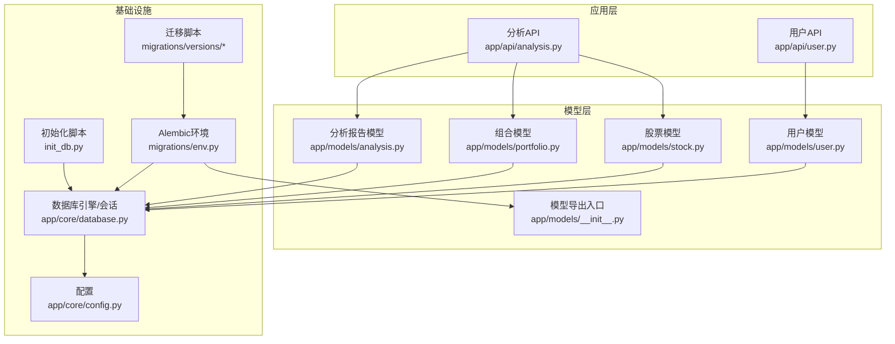
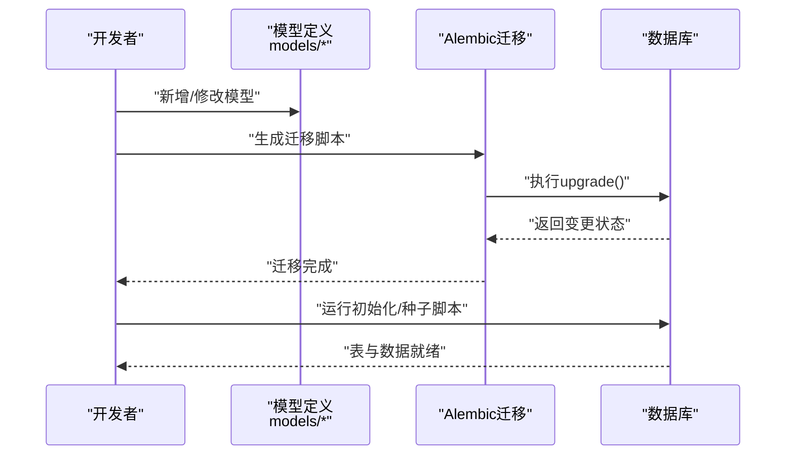
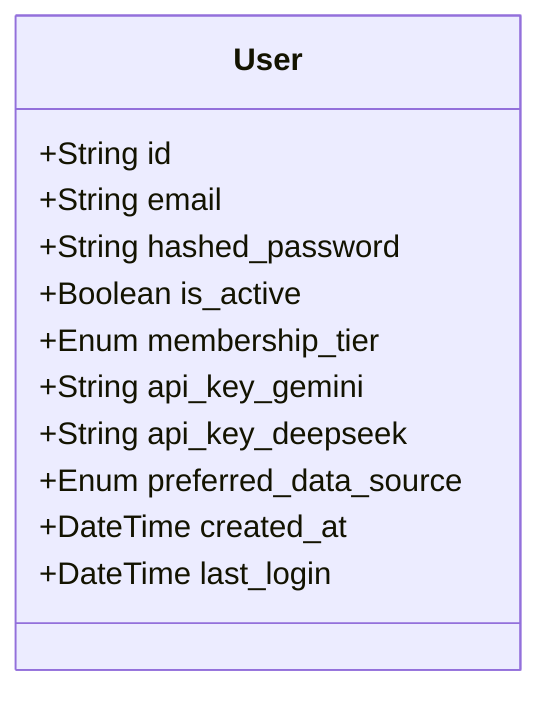
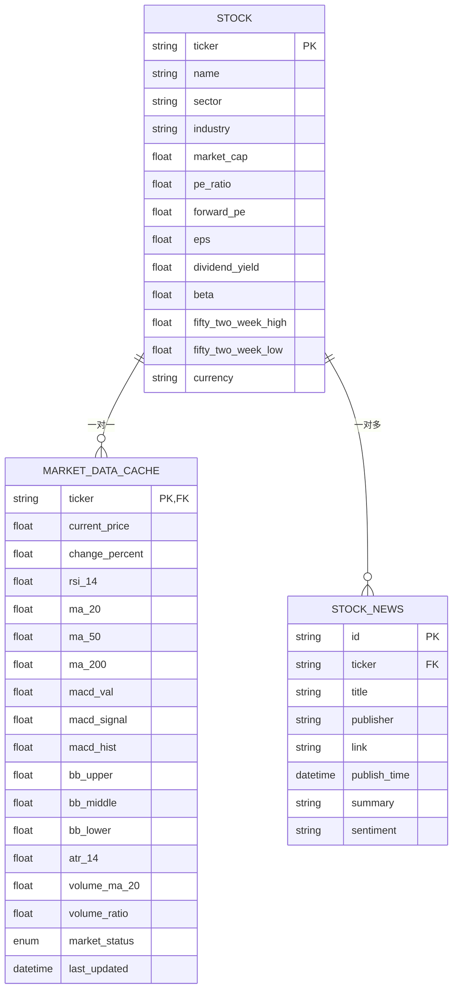
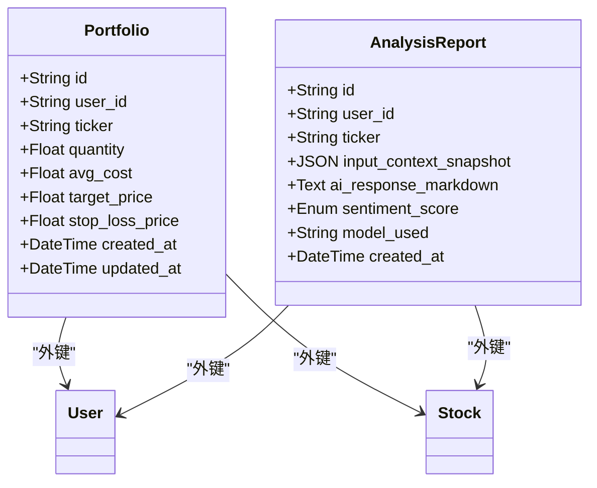
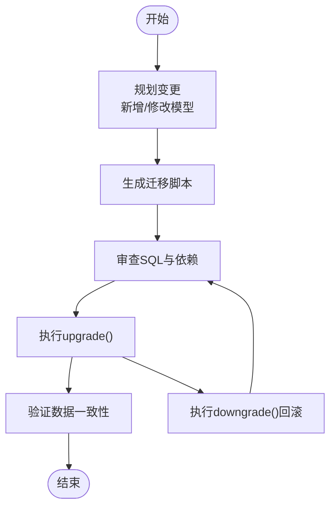
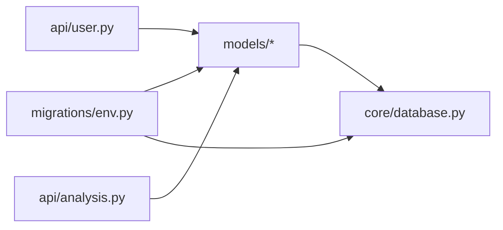

# 数据模型扩展

<cite>
**本文引用的文件**
- [backend/app/models/__init__.py](file://backend/app/models/__init__.py)
- [backend/app/models/user.py](file://backend/app/models/user.py)
- [backend/app/models/analysis.py](file://backend/app/models/analysis.py)
- [backend/app/models/portfolio.py](file://backend/app/models/portfolio.py)
- [backend/app/models/stock.py](file://backend/app/models/stock.py)
- [backend/app/core/database.py](file://backend/app/core/database.py)
- [backend/app/core/config.py](file://backend/app/core/config.py)
- [backend/migrations/env.py](file://backend/migrations/env.py)
- [backend/migrations/versions/35a834f440ba_baseline.py](file://backend/migrations/versions/35a834f440ba_baseline.py)
- [backend/init_db.py](file://backend/init_db.py)
- [backend/check_db_v3.py](file://backend/check_db_v3.py)
- [backend/app/api/user.py](file://backend/app/api/user.py)
- [backend/app/api/analysis.py](file://backend/app/api/analysis.py)
- [backend/app/schemas/user_settings.py](file://backend/app/schemas/user_settings.py)
</cite>

## 目录
1. [简介](#简介)
2. [项目结构](#项目结构)
3. [核心组件](#核心组件)
4. [架构总览](#架构总览)
5. [详细组件分析](#详细组件分析)
6. [依赖分析](#依赖分析)
7. [性能考虑](#性能考虑)
8. [故障排查指南](#故障排查指南)
9. [结论](#结论)
10. [附录](#附录)

## 简介
本指南面向需要在现有系统上进行数据模型扩展的开发者与架构师，围绕以下目标展开：
- 数据库模型扩展方法：新实体定义、字段添加、关系建立
- Alembic 迁移管理：迁移脚本编写、版本控制与回滚策略
- 数据模型设计原则：ER 建模、索引优化、约束定义
- 业务模型扩展指南：分析结果、用户偏好、配置类模型
- 数据验证与清理：输入校验、数据清洗、格式标准化
- 数据迁移策略：历史数据转换、增量迁移、一致性检查
- 性能优化：查询优化、索引设计、缓存策略
- 备份与恢复、安全与隐私保护

## 项目结构
后端采用 SQLAlchemy ORM + Alembic 迁移 + FastAPI 接口的分层架构。数据模型集中在 models 子包，数据库连接与会话由 core/database.py 提供，Alembic 配置位于 migrations 目录。

图表来源
- [backend/app/models/__init__.py](file://backend/app/models/__init__.py#L1-L5)
- [backend/app/models/user.py](file://backend/app/models/user.py#L1-L31)
- [backend/app/models/stock.py](file://backend/app/models/stock.py#L1-L85)
- [backend/app/models/portfolio.py](file://backend/app/models/portfolio.py#L1-L26)
- [backend/app/models/analysis.py](file://backend/app/models/analysis.py#L1-L25)
- [backend/app/core/database.py](file://backend/app/core/database.py#L1-L24)
- [backend/app/core/config.py](file://backend/app/core/config.py#L1-L25)
- [backend/migrations/env.py](file://backend/migrations/env.py#L1-L93)
- [backend/migrations/versions/35a834f440ba_baseline.py](file://backend/migrations/versions/35a834f440ba_baseline.py#L1-L33)
- [backend/init_db.py](file://backend/init_db.py#L1-L85)

章节来源
- [backend/app/models/__init__.py](file://backend/app/models/__init__.py#L1-L5)
- [backend/app/core/database.py](file://backend/app/core/database.py#L1-L24)
- [backend/migrations/env.py](file://backend/migrations/env.py#L1-L93)

## 核心组件
- 数据库引擎与会话：通过异步引擎与 AsyncSession 提供连接池与事务支持，便于并发访问与性能优化。
- 模型定义：基于 SQLAlchemy declarative base，统一继承自 Base；各模型包含主键、索引、外键、枚举、JSON/Text 字段等。
- Alembic 环境：在线/离线模式均支持，自动发现模型元数据，确保迁移与模型同步。
- 初始化脚本：批量创建表与种子数据，简化本地开发与测试环境搭建。

章节来源
- [backend/app/core/database.py](file://backend/app/core/database.py#L1-L24)
- [backend/app/models/user.py](file://backend/app/models/user.py#L1-L31)
- [backend/app/models/stock.py](file://backend/app/models/stock.py#L1-L85)
- [backend/app/models/portfolio.py](file://backend/app/models/portfolio.py#L1-L26)
- [backend/app/models/analysis.py](file://backend/app/models/analysis.py#L1-L25)
- [backend/migrations/env.py](file://backend/migrations/env.py#L1-L93)
- [backend/init_db.py](file://backend/init_db.py#L1-L85)

## 架构总览
下图展示数据模型扩展的典型流程：从模型定义到 Alembic 迁移，再到运行时使用与一致性检查。

图表来源
- [backend/migrations/env.py](file://backend/migrations/env.py#L30-L33)
- [backend/migrations/versions/35a834f440ba_baseline.py](file://backend/migrations/versions/35a834f440ba_baseline.py#L21-L33)
- [backend/init_db.py](file://backend/init_db.py#L61-L85)

## 详细组件分析

### 用户模型（User）
- 设计要点
  - 主键为字符串类型并使用 UUID 默认值
  - 邮箱唯一且建立索引，提升查询效率
  - 枚举类型用于会员等级与数据源偏好
  - 加密存储第三方 API 密钥占位字段
  - 时间戳字段记录创建与登录时间
- 关系与扩展建议
  - 可增加一对多关系至 AnalysisReport、Portfolio 等
  - 可引入用户偏好/设置表以解耦敏感配置
- 安全与验证
  - 使用加密工具对 API Key 进行加解密
  - 在接口层对更新字段进行 Pydantic 校验

图表来源
- [backend/app/models/user.py](file://backend/app/models/user.py#L15-L31)
- [backend/app/api/user.py](file://backend/app/api/user.py#L24-L48)
- [backend/app/schemas/user_settings.py](file://backend/app/schemas/user_settings.py#L4-L16)

章节来源
- [backend/app/models/user.py](file://backend/app/models/user.py#L1-L31)
- [backend/app/api/user.py](file://backend/app/api/user.py#L1-L49)
- [backend/app/schemas/user_settings.py](file://backend/app/schemas/user_settings.py#L1-L16)

### 股票与市场数据模型（Stock、MarketDataCache、StockNews）
- 设计要点
  - 股票主键为 ticker，建立索引
  - MarketDataCache 与 Stock 建立一对一关系，包含丰富技术指标字段
  - StockNews 与 Stock 建立一对多关系，并按发布日期倒序查询
- 扩展建议
  - 新增“用户偏好配置”模型，存储个性化指标阈值或偏好
  - 引入“分析结果”模型，持久化 AI 分析摘要与情感评分
- 关系图

图表来源
- [backend/app/models/stock.py](file://backend/app/models/stock.py#L13-L85)

章节来源
- [backend/app/models/stock.py](file://backend/app/models/stock.py#L1-L85)

### 组合与分析报告模型（Portfolio、AnalysisReport）
- 设计要点
  - Portfolio 使用复合唯一约束保证用户-股票唯一性
  - AnalysisReport 包含 JSON 上下文快照、Markdown 结果、情感评分与模型标识
  - 两者均建立外键关联至 User 与 Stock
- 扩展建议
  - AnalysisReport 可拆分为“分析任务”和“分析结果明细”，支持多轮分析与版本化
  - Portfolio 可扩展目标价/止损价字段并增加触发器或定时任务进行提醒

图表来源
- [backend/app/models/portfolio.py](file://backend/app/models/portfolio.py#L7-L26)
- [backend/app/models/analysis.py](file://backend/app/models/analysis.py#L12-L25)

章节来源
- [backend/app/models/portfolio.py](file://backend/app/models/portfolio.py#L1-L26)
- [backend/app/models/analysis.py](file://backend/app/models/analysis.py#L1-L25)

### Alembic 迁移管理
- 环境配置
  - 通过 env.py 设置数据库 URL、注册模型元数据、支持在线/离线迁移
  - 自动导入 models 包以确保所有模型被纳入迁移范围
- 版本控制与回滚
  - 迁移脚本位于 versions 目录，每个脚本包含 upgrade()/downgrade() 方法
  - baseline 脚本作为初始版本，可扩展为更复杂的基线场景
- 最佳实践
  - 始终先在测试环境验证迁移后再上线
  - 对于生产环境，优先使用“在线迁移”模式，避免锁表
  - down 阶段需谨慎，必要时保留数据备份

图表来源
- [backend/migrations/env.py](file://backend/migrations/env.py#L30-L33)
- [backend/migrations/versions/35a834f440ba_baseline.py](file://backend/migrations/versions/35a834f440ba_baseline.py#L21-L33)

章节来源
- [backend/migrations/env.py](file://backend/migrations/env.py#L1-L93)
- [backend/migrations/versions/35a834f440ba_baseline.py](file://backend/migrations/versions/35a834f440ba_baseline.py#L1-L33)

### 数据模型设计原则
- 实体关系建模
  - 明确主键与外键，保持参照完整性
  - 使用唯一约束避免重复数据（如用户-股票组合）
- 索引优化
  - 对高频查询列建立索引（如邮箱、ticker、创建时间）
  - 避免过度索引导致写入性能下降
- 约束定义
  - 使用非空、默认值、枚举等约束保证数据质量
  - 对 JSON/Text 字段进行长度与格式约束
- 字段扩展
  - 采用可选字段与默认值，确保向后兼容
  - 对敏感字段采用加密存储

章节来源
- [backend/app/models/user.py](file://backend/app/models/user.py#L18-L29)
- [backend/app/models/stock.py](file://backend/app/models/stock.py#L16-L65)
- [backend/app/models/portfolio.py](file://backend/app/models/portfolio.py#L21-L23)

### 业务模型扩展指南
- 新增分析结果模型
  - 建议字段：用户ID、股票代码、输入上下文快照、AI响应、情感评分、模型名称、创建时间
  - 关系：与 User、Stock 外键关联
  - 索引：按用户与创建时间建立索引
- 用户偏好模型
  - 建议字段：用户ID、偏好键（如指标阈值）、偏好值、更新时间
  - 关系：与 User 外键关联
  - 索引：用户ID唯一或复合唯一
- 配置模型
  - 建议字段：配置键、配置值、生效范围（全局/用户）、更新时间
  - 索引：配置键唯一
  - 安全：敏感配置采用加密存储

章节来源
- [backend/app/models/analysis.py](file://backend/app/models/analysis.py#L12-L25)
- [backend/app/models/user.py](file://backend/app/models/user.py#L24-L27)

### 数据验证与清理机制
- 输入验证
  - 使用 Pydantic 模型对用户设置进行校验（如 API Key、数据源）
  - 在接口层对必填字段与格式进行前置校验
- 数据清洗
  - 对外部数据（如新闻标题、摘要）进行长度与字符集清洗
  - 对数值型字段进行边界检查与异常值处理
- 格式标准化
  - 统一时间格式（ISO 8601），货币单位与精度
  - 对枚举字段进行白名单校验

章节来源
- [backend/app/schemas/user_settings.py](file://backend/app/schemas/user_settings.py#L4-L16)
- [backend/app/api/user.py](file://backend/app/api/user.py#L24-L48)

### 数据迁移策略
- 历史数据转换
  - 对存量数据进行格式标准化与补全默认值
  - 使用分批处理避免长事务阻塞
- 增量迁移
  - 仅迁移新增或变更的数据，降低对线上服务的影响
  - 通过版本号与时间窗口控制迁移范围
- 一致性检查
  - 迁移前后对比关键指标（记录数、索引状态）
  - 运行初始化脚本重建缺失的种子数据

章节来源
- [backend/init_db.py](file://backend/init_db.py#L61-L85)
- [backend/check_db_v3.py](file://backend/check_db_v3.py#L10-L25)

### 性能优化方法
- 查询优化
  - 使用 selectinload/joinload 减少 N+1 查询
  - 对热点查询建立复合索引
- 索引设计
  - 针对过滤、排序、连接列建立合适索引
  - 定期分析慢查询日志并调整索引策略
- 缓存策略
  - 对静态数据与热点指标使用缓存（如市场状态、技术指标）
  - 结合失效策略与缓存穿透防护

## 依赖分析
- 模块耦合
  - models 依赖 core/database 的 Base 与 engine
  - Alembic env 依赖 models 包以注册元数据
  - API 层依赖 models 与 services，形成清晰的分层
- 外部依赖
  - SQLAlchemy 异步引擎与 ORM
  - Alembic 版本化迁移
  - Pydantic 数据校验

图表来源
- [backend/app/models/__init__.py](file://backend/app/models/__init__.py#L1-L5)
- [backend/app/core/database.py](file://backend/app/core/database.py#L1-L24)
- [backend/migrations/env.py](file://backend/migrations/env.py#L14-L16)
- [backend/app/api/user.py](file://backend/app/api/user.py#L1-L49)
- [backend/app/api/analysis.py](file://backend/app/api/analysis.py#L1-L128)

章节来源
- [backend/app/models/__init__.py](file://backend/app/models/__init__.py#L1-L5)
- [backend/migrations/env.py](file://backend/migrations/env.py#L1-L93)

## 性能考虑
- 连接与会话
  - 使用异步引擎与连接池，合理设置超时与回收策略
- 查询与索引
  - 避免 SELECT *，只取必要字段
  - 对高频过滤条件建立索引，定期维护统计信息
- 缓存与预计算
  - 对热点技术指标与市场状态进行缓存
  - 在数据入库前进行必要的聚合与预计算

## 故障排查指南
- 连接与初始化
  - 使用检查脚本验证数据库连接与表结构
  - 若连接失败，确认 DATABASE_URL 与驱动可用
- 迁移问题
  - 在线迁移失败时，检查 Alembic 环境变量与模型注册
  - 回滚失败时，先备份数据库再尝试手动修复
- 数据一致性
  - 运行初始化脚本补齐缺失的种子数据
  - 对比迁移前后关键指标，确保无遗漏

章节来源
- [backend/check_db_v3.py](file://backend/check_db_v3.py#L10-L25)
- [backend/init_db.py](file://backend/init_db.py#L61-L85)
- [backend/migrations/env.py](file://backend/migrations/env.py#L65-L92)

## 结论
通过规范的模型设计、完善的 Alembic 迁移流程与严格的验证清理机制，可以安全高效地扩展数据模型。建议在每次变更前制定迁移计划与回滚预案，并在测试环境充分验证后再上线。

## 附录
- 配置项参考
  - 数据库 URL、加密密钥、算法与令牌有效期
- 常用命令
  - 生成迁移脚本、执行在线/离线迁移、初始化数据库

章节来源
- [backend/app/core/config.py](file://backend/app/core/config.py#L4-L24)
- [backend/migrations/env.py](file://backend/migrations/env.py#L83-L92)
- [backend/init_db.py](file://backend/init_db.py#L61-L85)