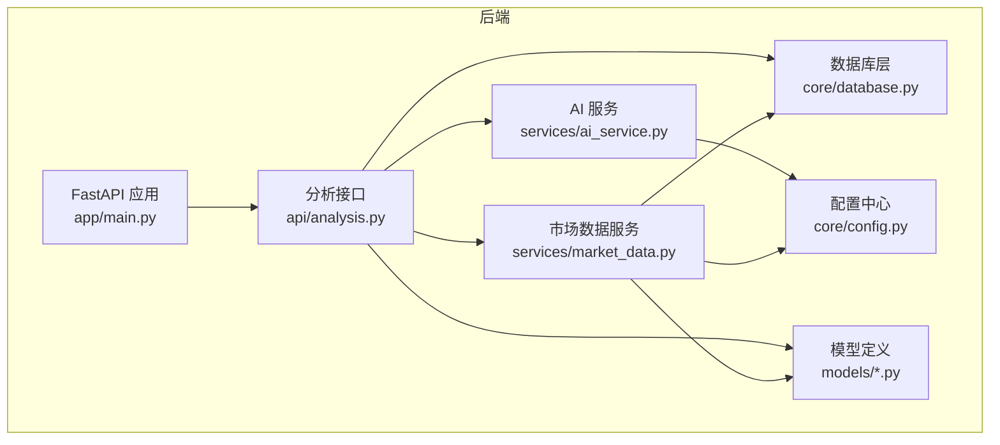
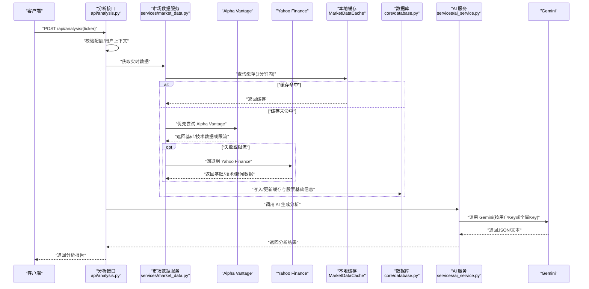
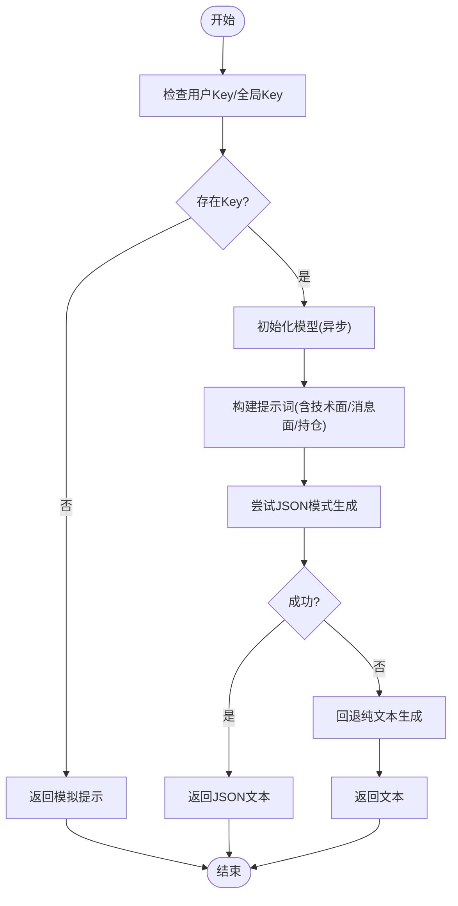
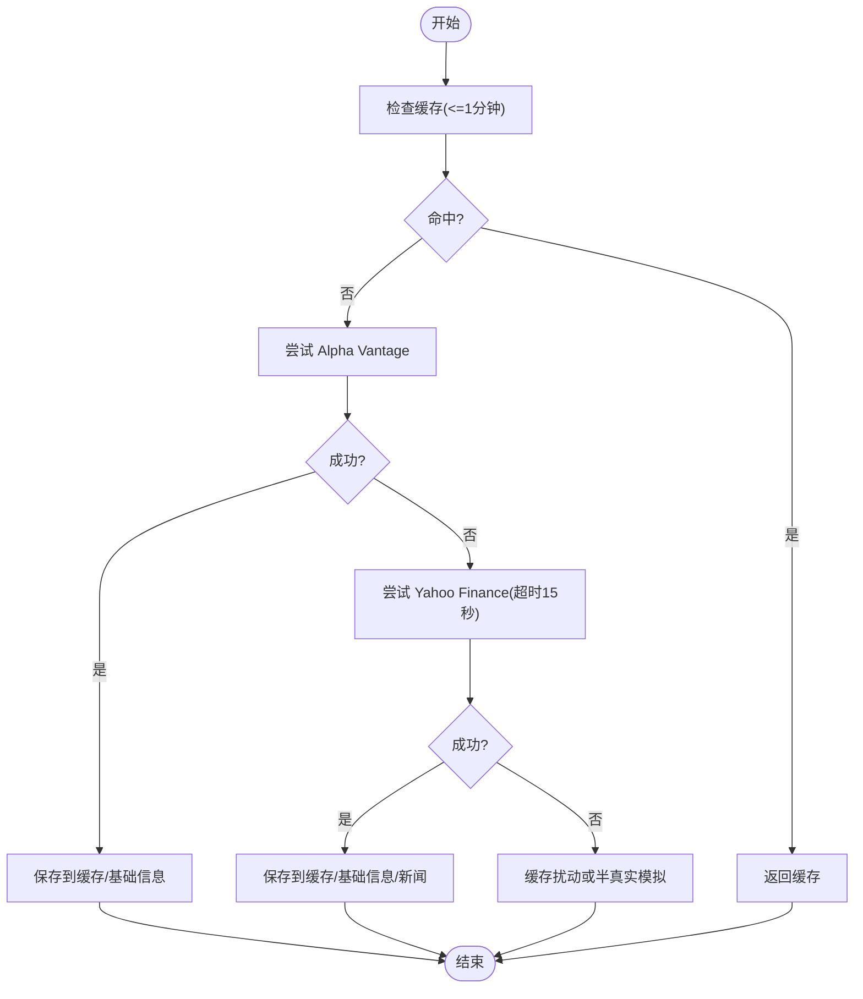
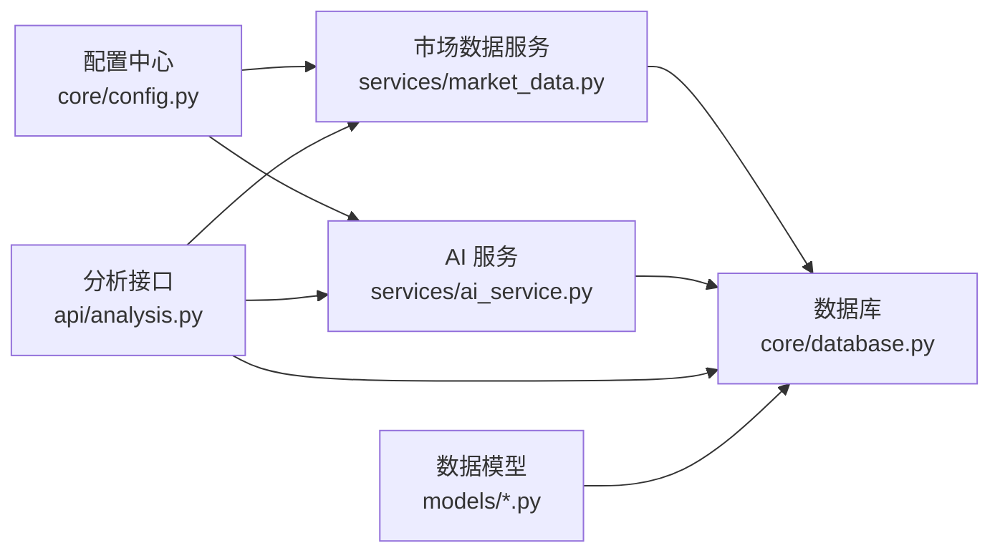

# 第三方服务集成

<cite>
**本文档引用的文件**
- [backend/app/services/ai_service.py](file://backend/app/services/ai_service.py)
- [backend/app/services/market_data.py](file://backend/app/services/market_data.py)
- [backend/app/core/config.py](file://backend/app/core/config.py)
- [backend/app/core/security.py](file://backend/app/core/security.py)
- [backend/app/core/database.py](file://backend/app/core/database.py)
- [backend/app/models/stock.py](file://backend/app/models/stock.py)
- [backend/app/models/analysis.py](file://backend/app/models/analysis.py)
- [backend/app/api/analysis.py](file://backend/app/api/analysis.py)
- [backend/app/main.py](file://backend/app/main.py)
- [.env.example](file://.env.example)
- [backend/requirements.txt](file://backend/requirements.txt)
- [README.md](file://README.md)
- [doc/Database Schema & Data Flow Specification.md](file://doc/Database Schema & Data Flow Specification.md)
</cite>

## 目录
1. [简介](#简介)
2. [项目结构](#项目结构)
3. [核心组件](#核心组件)
4. [架构总览](#架构总览)
5. [详细组件分析](#详细组件分析)
6. [依赖关系分析](#依赖关系分析)
7. [性能考虑](#性能考虑)
8. [故障排查指南](#故障排查指南)
9. [结论](#结论)
10. [附录](#附录)

## 简介
本指南面向需要在系统中集成第三方服务的工程师与运维人员，重点覆盖以下方面：
- AI 模型服务集成：以 Gemini 为例的接入与配置，同时说明如何扩展至 DeepSeek 等其他模型。
- 金融数据源集成：Alpha Vantage 与 Yahoo Finance 的数据获取、处理与降级策略。
- API 密钥管理与安全配置：环境变量设置、密钥轮换策略与最小暴露原则。
- 服务降级与容错：网络异常处理、指数回退、缓存与模拟数据策略。
- 监控与日志：性能指标采集与错误追踪建议。
- 版本管理与兼容性：API 版本升级与向后兼容保障。
- 集成测试与模拟环境：本地开发与测试验证方法。
- 生产部署注意事项：健康检查、CORS、代理与数据库连接。

## 项目结构
后端采用 FastAPI + SQLAlchemy Async 架构，核心模块围绕“分析接口 → 市场数据服务 → AI 服务”的链路组织；金融数据通过 Alpha Vantage 与 Yahoo Finance 双通道获取，并以本地缓存提升性能与抗抖动能力。

图表来源
- [backend/app/main.py](file://backend/app/main.py#L1-L38)
- [backend/app/api/analysis.py](file://backend/app/api/analysis.py#L1-L124)
- [backend/app/services/market_data.py](file://backend/app/services/market_data.py#L1-L370)
- [backend/app/services/ai_service.py](file://backend/app/services/ai_service.py#L1-L112)
- [backend/app/core/config.py](file://backend/app/core/config.py#L1-L24)
- [backend/app/core/database.py](file://backend/app/core/database.py#L1-L24)
- [backend/app/models/stock.py](file://backend/app/models/stock.py#L1-L85)
- [backend/app/models/analysis.py](file://backend/app/models/analysis.py#L1-L25)

章节来源
- [backend/app/main.py](file://backend/app/main.py#L1-L38)
- [README.md](file://README.md#L1-L50)

## 核心组件
- 配置中心：集中管理外部服务密钥与代理设置，支持从 .env 文件加载。
- 市场数据服务：统一从 Alpha Vantage 与 Yahoo Finance 获取实时与技术指标，具备缓存与降级策略。
- AI 服务：封装 Gemini 接入，支持 JSON 输出模式与降级回退。
- 分析接口：聚合用户、持仓、市场与新闻上下文，调用 AI 服务生成分析结果。
- 数据模型：定义股票、行情缓存、新闻与分析报告等实体及其关系。
- 安全与认证：基于 JWT 的访问令牌生成与密码哈希/校验工具。

章节来源
- [backend/app/core/config.py](file://backend/app/core/config.py#L1-L24)
- [backend/app/services/market_data.py](file://backend/app/services/market_data.py#L1-L370)
- [backend/app/services/ai_service.py](file://backend/app/services/ai_service.py#L1-L112)
- [backend/app/api/analysis.py](file://backend/app/api/analysis.py#L1-L124)
- [backend/app/models/stock.py](file://backend/app/models/stock.py#L1-L85)
- [backend/app/models/analysis.py](file://backend/app/models/analysis.py#L1-L25)
- [backend/app/core/security.py](file://backend/app/core/security.py#L1-L26)

## 架构总览
下图展示从客户端到外部服务与数据库的整体流程，包括双数据源与 AI 分析路径。

图表来源
- [backend/app/api/analysis.py](file://backend/app/api/analysis.py#L13-L124)
- [backend/app/services/market_data.py](file://backend/app/services/market_data.py#L15-L170)
- [backend/app/services/ai_service.py](file://backend/app/services/ai_service.py#L43-L112)
- [backend/app/core/database.py](file://backend/app/core/database.py#L1-L24)

## 详细组件分析

### AI 模型服务集成（Gemini）
- 接入方式
  - 通过配置中心读取 GEMINI_API_KEY，若缺失则提示禁用/模拟。
  - 支持两种调用路径：用户自有 Key 或全局 Key；若均不可用，返回模拟提示。
  - 使用异步内容生成接口，优先 JSON 模式，失败时回退为纯文本。
- 提示工程
  - 中文提示词，包含用户持仓背景、技术面数据、消息面与任务指令。
  - 明确输出结构，便于后续解析与持久化。
- 错误处理
  - 记录 Gemini API 异常，回退到非 JSON 模式；最终失败返回错误信息。

图表来源
- [backend/app/services/ai_service.py](file://backend/app/services/ai_service.py#L43-L112)

章节来源
- [backend/app/services/ai_service.py](file://backend/app/services/ai_service.py#L1-L112)
- [backend/app/core/config.py](file://backend/app/core/config.py#L14-L16)

### AI 模型服务集成（DeepSeek 扩展）
- 接入要点
  - 在配置中心新增 DEEPSEEK_API_KEY 字段。
  - 在 AI 服务中增加模型选择逻辑：根据用户偏好或全局配置切换模型。
  - 保持一致的输入输出格式与错误回退策略，确保与现有提示工程兼容。
- 安全与密钥轮换
  - 通过环境变量注入，支持动态切换与灰度发布。
  - 建议在网关或代理层实现多模型路由与配额控制。

章节来源
- [backend/app/core/config.py](file://backend/app/core/config.py#L14-L17)
- [backend/app/services/ai_service.py](file://backend/app/services/ai_service.py#L43-L112)

### 金融数据源集成（Alpha Vantage 与 Yahoo Finance）
- 数据源优先级与回退
  - 默认优先 Alpha Vantage；失败或限流时回退 Yahoo Finance。
  - 若两者均不可用，使用本地缓存微幅扰动或半真实模拟数据。
- 技术指标计算
  - 基于历史数据计算 RSI、MACD、布林带、KDJ、ATR、成交量比率等。
- 缓存策略
  - 1 分钟内直接读取缓存，避免外部 API 限流与抖动。
  - 写入缓存时同步更新股票基础信息与新闻。
- 代理与限流
  - 支持 HTTP_PROXY；对 429/Too Many Requests 实施指数回退与抖动。
- 新闻处理
  - 仅保留最近若干条，使用唯一键去重插入。

图表来源
- [backend/app/services/market_data.py](file://backend/app/services/market_data.py#L15-L170)

章节来源
- [backend/app/services/market_data.py](file://backend/app/services/market_data.py#L1-L370)
- [doc/Database Schema & Data Flow Specification.md](file://doc/Database Schema & Data Flow Specification.md#L48-L80)

### API 密钥管理与安全配置
- 环境变量
  - GEMINI_API_KEY、DEEPSEEK_API_KEY、ALPHA_VANTAGE_API_KEY、HTTP_PROXY、SECRET_KEY 等。
  - 示例模板见 .env.example。
- 密钥轮换策略
  - 通过配置中心动态加载新密钥；在网关层实现多密钥并行与灰度切换。
  - 对外暴露最小化，避免硬编码与明文存储。
- 认证与授权
  - 使用 JWT 生成访问令牌，支持自定义过期时间。
  - 密码采用 bcrypt 哈希与校验。

章节来源
- [.env.example](file://.env.example#L1-L9)
- [backend/app/core/config.py](file://backend/app/core/config.py#L1-L24)
- [backend/app/core/security.py](file://backend/app/core/security.py#L1-L26)

### 服务降级与容错机制
- 网络异常处理
  - Alpha Vantage：检测响应中的限流标记，抛出明确异常。
  - Yahoo Finance：捕获 429/Too Many Requests，实施指数回退与抖动；超时控制。
- 数据缓存策略
  - 1 分钟内复用缓存；缓存未命中时进行双源回退。
  - 无缓存时生成半真实模拟数据，保证前端体验。
- 失败回退
  - AI 服务：JSON 模式失败回退纯文本；最终失败返回错误信息。
  - 分析接口：对免费用户进行日频用量限制，避免资源滥用。

章节来源
- [backend/app/services/market_data.py](file://backend/app/services/market_data.py#L305-L332)
- [backend/app/services/ai_service.py](file://backend/app/services/ai_service.py#L103-L111)
- [backend/app/api/analysis.py](file://backend/app/api/analysis.py#L27-L50)

### 服务监控与日志记录
- 日志级别与输出
  - Alembic、SQLAlchemy、根日志器在 alembic.ini 中有基础配置，建议在生产中细化级别。
- 性能指标采集
  - 建议埋点：外部 API 调用耗时、成功率、重试次数、缓存命中率、AI 调用耗时与错误率。
- 错误追踪
  - 对 Gemini 与外部数据源异常进行结构化日志记录，便于定位与告警。

章节来源
- [backend/alembic.ini](file://backend/alembic.ini#L124-L147)
- [backend/app/services/ai_service.py](file://backend/app/services/ai_service.py#L103-L111)
- [backend/app/services/market_data.py](file://backend/app/services/market_data.py#L305-L318)

### 服务版本管理与兼容性
- API 版本升级
  - 通过路由前缀区分版本（如 /api/v1/analysis），逐步迁移旧端点。
  - 保持输入输出字段的向后兼容，新增字段默认可选。
- 模型与数据结构演进
  - 技术指标字段扩展时，读取侧做空值保护与默认值回退。
  - AI 输出结构变更需同步提示词与解析逻辑。

章节来源
- [backend/app/api/analysis.py](file://backend/app/api/analysis.py#L1-L124)
- [backend/app/models/stock.py](file://backend/app/models/stock.py#L33-L67)

### 集成测试方法与模拟环境
- 测试策略
  - 单元测试：针对 MarketDataService 的缓存命中、回退逻辑与异常分支。
  - 集成测试：通过模拟外部 API 返回，验证提示工程与 AI 回退路径。
- 模拟环境
  - 使用半真实模拟数据与本地缓存，减少对外部依赖的耦合。
  - 在 CI 中固定随机种子，确保可重复性。

章节来源
- [backend/app/services/market_data.py](file://backend/app/services/market_data.py#L67-L85)
- [backend/app/services/ai_service.py](file://backend/app/services/ai_service.py#L43-L112)

### 生产部署注意事项
- 健康检查
  - 提供 /health 接口用于容器编排与负载均衡探测。
- CORS 配置
  - 开发阶段允许多来源，生产环境应限定具体域名与端口。
- 数据库连接
  - 使用异步引擎，SQLite 仅适用于开发；生产建议 PostgreSQL/MySQL。
- 代理与网络
  - 如需通过代理访问外部服务，正确配置 HTTP_PROXY。
- 依赖与运行
  - 后端使用 uvicorn 运行，前端使用 npm run dev；也可通过 start.sh 一键启动。

章节来源
- [backend/app/main.py](file://backend/app/main.py#L31-L37)
- [backend/app/core/database.py](file://backend/app/core/database.py#L5-L17)
- [README.md](file://README.md#L14-L44)

## 依赖关系分析

图表来源
- [backend/app/core/config.py](file://backend/app/core/config.py#L1-L24)
- [backend/app/services/ai_service.py](file://backend/app/services/ai_service.py#L1-L112)
- [backend/app/services/market_data.py](file://backend/app/services/market_data.py#L1-L370)
- [backend/app/api/analysis.py](file://backend/app/api/analysis.py#L1-L124)
- [backend/app/core/database.py](file://backend/app/core/database.py#L1-L24)
- [backend/app/models/stock.py](file://backend/app/models/stock.py#L1-L85)
- [backend/app/models/analysis.py](file://backend/app/models/analysis.py#L1-L25)

章节来源
- [backend/requirements.txt](file://backend/requirements.txt#L1-L75)
- [backend/app/main.py](file://backend/app/main.py#L24-L29)

## 性能考虑
- 缓存命中率：1 分钟内缓存显著降低外部 API 调用频率与延迟。
- 指数回退：对 429/限流场景实施指数回退与抖动，避免雪崩效应。
- 异步执行：AI 与外部 API 调用采用异步，提升并发吞吐。
- 数据库事务：批量写入与去重插入，减少锁竞争与重复写入。

## 故障排查指南
- Gemini 无法返回 JSON
  - 检查提示词结构与响应 MIME 类型；查看回退路径是否正常。
- Alpha Vantage 限流
  - 观察响应中的限流提示；确认密钥额度与速率限制。
- Yahoo Finance 超时/429
  - 检查代理配置与网络连通性；确认指数回退是否生效。
- 缓存未更新
  - 确认 last_updated 是否超过 1 分钟；检查数据库写入是否成功。
- 免费用户配额耗尽
  - 查看分析接口的配额统计逻辑与返回的 429 错误。

章节来源
- [backend/app/services/ai_service.py](file://backend/app/services/ai_service.py#L103-L111)
- [backend/app/services/market_data.py](file://backend/app/services/market_data.py#L305-L332)
- [backend/app/api/analysis.py](file://backend/app/api/analysis.py#L27-L50)

## 结论
本项目通过“双数据源 + 本地缓存 + AI 服务”形成稳健的第三方服务集成方案。配置中心统一管理密钥与代理，接口层负责上下文聚合与限流控制，服务层提供可扩展的 AI 与数据源接入能力。建议在生产中进一步完善监控指标、日志分级与密钥轮换流程，确保高可用与可维护性。

## 附录
- 快速启动与依赖安装参考 README。
- 数据库与数据流规范详见文档说明。

章节来源
- [README.md](file://README.md#L1-L50)
- [doc/Database Schema & Data Flow Specification.md](file://doc/Database Schema & Data Flow Specification.md#L48-L80)