# 前端集成与展示

<cite>
**本文档引用的文件**
- [frontend/app/page.tsx](file://frontend/app/page.tsx)
- [frontend/context/AuthContext.tsx](file://frontend/context/AuthContext.tsx)
- [frontend/app/layout.tsx](file://frontend/app/layout.tsx)
- [frontend/components/ui/table.tsx](file://frontend/components/ui/table.tsx)
- [frontend/components/ui/card.tsx](file://frontend/components/ui/card.tsx)
- [frontend/components/ui/button.tsx](file://frontend/components/ui/button.tsx)
- [frontend/app/login/page.tsx](file://frontend/app/login/page.tsx)
- [frontend/app/settings/page.tsx](file://frontend/app/settings/page.tsx)
- [frontend/features/dashboard/components/DashboardShell.tsx](file://frontend/features/dashboard/components/DashboardShell.tsx)
- [frontend/features/dashboard/components/AnalysisTabContainer.tsx](file://frontend/features/dashboard/components/AnalysisTabContainer.tsx)
- [frontend/features/dashboard/components/PortfolioTabContainer.tsx](file://frontend/features/dashboard/components/PortfolioTabContainer.tsx)
- [frontend/features/dashboard/components/PaperTradingTabContainer.tsx](file://frontend/features/dashboard/components/PaperTradingTabContainer.tsx)
- [frontend/features/dashboard/components/AlertsTabContainer.tsx](file://frontend/features/dashboard/components/AlertsTabContainer.tsx)
- [frontend/features/dashboard/hooks/useDashboardData.ts](file://frontend/features/dashboard/hooks/useDashboardData.ts)
- [frontend/features/dashboard/hooks/useDashboardAnalysisData.ts](file://frontend/features/dashboard/hooks/useDashboardAnalysisData.ts)
- [frontend/features/dashboard/hooks/useDashboardPortfolioData.ts](file://frontend/features/dashboard/hooks/useDashboardPortfolioData.ts)
- [frontend/features/dashboard/hooks/useDashboardRouteState.ts](file://frontend/features/dashboard/hooks/useDashboardRouteState.ts)
- [frontend/features/dashboard/hooks/dashboardCache.ts](file://frontend/features/dashboard/hooks/dashboardCache.ts)
- [frontend/features/dashboard/hooks/useCachedResource.ts](file://frontend/features/dashboard/hooks/useCachedResource.ts)
- [frontend/lib/api.ts](file://frontend/lib/api.ts)
- [frontend/lib/utils.ts](file://frontend/lib/utils.ts)
- [frontend/package.json](file://frontend/package.json)
</cite>

## 更新摘要
**变更内容**
- 新增仪表板组件架构，包括 DashboardShell、AnalysisTabContainer 等核心组件
- 引入 hooks 驱动的状态管理，包括 useDashboardAnalysisData、useDashboardPortfolioData 等
- 实现基于缓存的资源管理系统，支持 TTL 和自动失效机制
- 增强路由状态管理，支持标签页切换和股票选择的 URL 同步
- 新增 Suspense 加载状态实现，提供更好的用户体验
- 增强客户端错误处理机制，包括轮询恢复模式和重试策略
- 改进分析请求失败时的容错处理和用户提示
- 优化 API 客户端的错误拦截和重试逻辑

## 目录
1. [简介](#简介)
2. [项目结构](#项目结构)
3. [核心组件](#核心组件)
4. [架构总览](#架构总览)
5. [详细组件分析](#详细组件分析)
6. [依赖关系分析](#依赖关系分析)
7. [性能考虑](#性能考虑)
8. [故障排查指南](#故障排查指南)
9. [结论](#结论)
10. [附录](#附录)

## 简介
本文件面向前端集成与展示功能，系统性阐述投资组合数据在前端的获取与展示机制、状态管理、React 组件设计与实现（含表格与交互）、用户界面的数据绑定与实时更新策略（轮询与本地状态驱动）、用户认证与权限控制、以及样式定制与功能扩展建议。文档同时提供用户体验优化最佳实践，包括加载状态、错误提示与空状态处理。

**更新** 本版本重点介绍了全新的仪表板组件架构、hooks 驱动的状态管理和基于缓存的资源管理系统，这些改进显著提升了应用的模块化程度和用户体验。

## 项目结构
前端采用 Next.js 应用程序目录结构，页面组件位于 app 下，UI 组件位于 components/ui，全局上下文与布局位于 app 与 context，工具函数位于 lib。**新增** 仪表板功能位于 features/dashboard 目录，包含组件、hooks 和 API 集成。

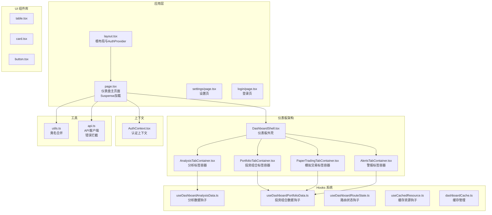

**图表来源**
- [frontend/app/layout.tsx:20-35](file://frontend/app/layout.tsx#L20-L35)
- [frontend/app/page.tsx:1-318](file://frontend/app/page.tsx#L1-L318)
- [frontend/features/dashboard/components/DashboardShell.tsx:1-47](file://frontend/features/dashboard/components/DashboardShell.tsx#L1-L47)
- [frontend/features/dashboard/components/AnalysisTabContainer.tsx:1-83](file://frontend/features/dashboard/components/AnalysisTabContainer.tsx#L1-L83)
- [frontend/features/dashboard/hooks/useDashboardAnalysisData.ts:1-85](file://frontend/features/dashboard/hooks/useDashboardAnalysisData.ts#L1-L85)
- [frontend/features/dashboard/hooks/useDashboardPortfolioData.ts:1-56](file://frontend/features/dashboard/hooks/useDashboardPortfolioData.ts#L1-L56)
- [frontend/features/dashboard/hooks/useDashboardRouteState.ts:1-73](file://frontend/features/dashboard/hooks/useDashboardRouteState.ts#L1-L73)
- [frontend/features/dashboard/hooks/useCachedResource.ts:1-112](file://frontend/features/dashboard/hooks/useCachedResource.ts#L1-L112)
- [frontend/features/dashboard/hooks/dashboardCache.ts:1-91](file://frontend/features/dashboard/hooks/dashboardCache.ts#L1-L91)

**章节来源**
- [frontend/app/layout.tsx:1-42](file://frontend/app/layout.tsx#L1-L42)
- [frontend/package.json:1-43](file://frontend/package.json#L1-L43)

## 核心组件
- **仪表板外壳（DashboardShell）**：**新增** 作为仪表板的根容器，管理头部导航、搜索对话框和标签页内容的布局。
- **分析标签容器（AnalysisTabContainer）**：**新增** 实现分析标签页的核心布局，包含投资组合列表和股票详情的响应式布局。
- **投资组合标签容器（PortfolioTabContainer）**：**新增** 封装投资组合仪表盘的功能，支持投资组合分析和报告展示。
- **模拟交易标签容器（PaperTradingTabContainer）**：**新增** 提供模拟交易功能的展示容器。
- **警报标签容器（AlertsTabContainer）**：**新增** 展示系统警报和通知的容器。
- **hooks 驱动的状态管理**：**新增** 包括 useDashboardAnalysisData、useDashboardPortfolioData 等专门的 hooks。
- **缓存资源管理**：**新增** 基于 TTL 的缓存系统，支持数据的自动失效和更新。
- **路由状态管理**：**新增** useDashboardRouteState 提供标签页和股票选择的 URL 同步功能。
- 仪表盘主页面：负责投资组合数据获取、筛选排序、AI 分析触发、编辑与删除、市场状态显示、搜索对话框等。**新增** Suspense 加载状态提供更好的用户体验。
- 认证上下文：提供 token 存取、登录登出、认证状态判断与路由跳转。
- 设置页：配置 API Key 与数据源偏好，读取用户资料。
- 登录页：表单提交后通过后端接口换取 token 并写入本地存储。
- UI 组件：卡片、按钮、表格容器等基础 UI 组合，统一风格与交互。

**章节来源**
- [frontend/features/dashboard/components/DashboardShell.tsx:1-47](file://frontend/features/dashboard/components/DashboardShell.tsx#L1-L47)
- [frontend/features/dashboard/components/AnalysisTabContainer.tsx:1-83](file://frontend/features/dashboard/components/AnalysisTabContainer.tsx#L1-L83)
- [frontend/features/dashboard/components/PortfolioTabContainer.tsx:1-36](file://frontend/features/dashboard/components/PortfolioTabContainer.tsx#L1-L36)
- [frontend/features/dashboard/hooks/useDashboardAnalysisData.ts:1-85](file://frontend/features/dashboard/hooks/useDashboardAnalysisData.ts#L1-L85)
- [frontend/features/dashboard/hooks/useDashboardPortfolioData.ts:1-56](file://frontend/features/dashboard/hooks/useDashboardPortfolioData.ts#L1-L56)
- [frontend/features/dashboard/hooks/useDashboardRouteState.ts:1-73](file://frontend/features/dashboard/hooks/useDashboardRouteState.ts#L1-L73)
- [frontend/features/dashboard/hooks/dashboardCache.ts:1-91](file://frontend/features/dashboard/hooks/dashboardCache.ts#L1-L91)
- [frontend/app/page.tsx:30-318](file://frontend/app/page.tsx#L30-L318)
- [frontend/context/AuthContext.tsx:1-68](file://frontend/context/AuthContext.tsx#L1-L68)
- [frontend/app/settings/page.tsx:1-177](file://frontend/app/settings/page.tsx#L1-L177)
- [frontend/app/login/page.tsx:1-89](file://frontend/app/login/page.tsx#L1-L89)

## 架构总览
前端通过认证上下文与本地存储维护用户会话；**新增** 仪表板架构采用 hooks 驱动的状态管理，通过缓存系统实现数据的高效管理；页面组件通过 API 客户端获取投资组合与分析数据；UI 组件负责渲染与交互；设置页用于解锁无限分析能力与切换数据源。**新增** Suspense 提供统一的加载状态管理。

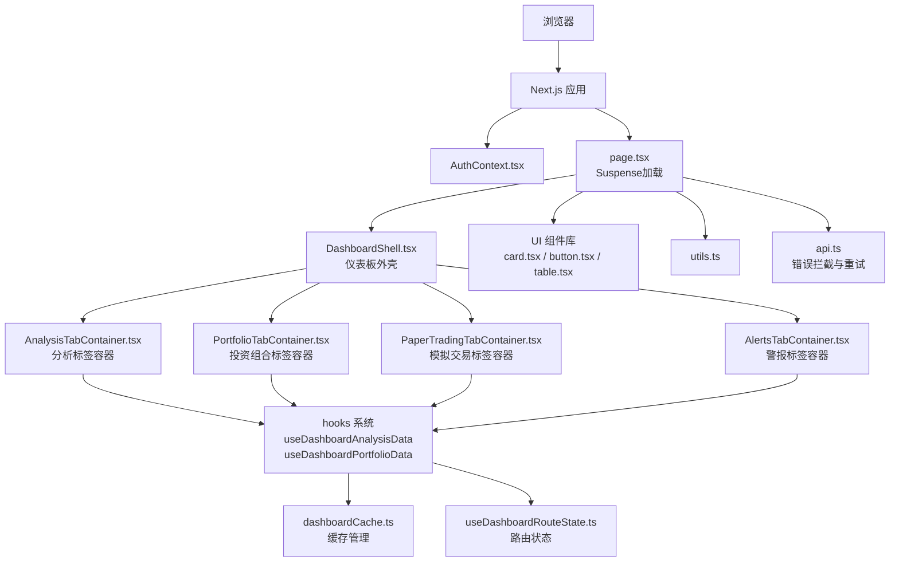

**图表来源**
- [frontend/context/AuthContext.tsx:1-68](file://frontend/context/AuthContext.tsx#L1-L68)
- [frontend/app/page.tsx:1-318](file://frontend/app/page.tsx#L1-L318)
- [frontend/features/dashboard/components/DashboardShell.tsx:1-47](file://frontend/features/dashboard/components/DashboardShell.tsx#L1-L47)
- [frontend/features/dashboard/components/AnalysisTabContainer.tsx:1-83](file://frontend/features/dashboard/components/AnalysisTabContainer.tsx#L1-L83)
- [frontend/features/dashboard/hooks/useDashboardAnalysisData.ts:1-85](file://frontend/features/dashboard/hooks/useDashboardAnalysisData.ts#L1-L85)
- [frontend/features/dashboard/hooks/dashboardCache.ts:1-91](file://frontend/features/dashboard/hooks/dashboardCache.ts#L1-L91)
- [frontend/features/dashboard/hooks/useDashboardRouteState.ts:1-73](file://frontend/features/dashboard/hooks/useDashboardRouteState.ts#L1-L73)

## 详细组件分析

### 仪表板外壳（DashboardShell）- **新增**
职责与流程
- **布局管理**：作为仪表板的根容器，提供统一的布局结构，包含头部导航和主要内容区域。
- **状态传递**：接收并传递标签页状态、搜索对话框状态、股票选择状态等 props。
- **响应式设计**：支持移动端和桌面端的不同布局行为。
- **用户交互**：处理用户在仪表板中的各种交互操作。

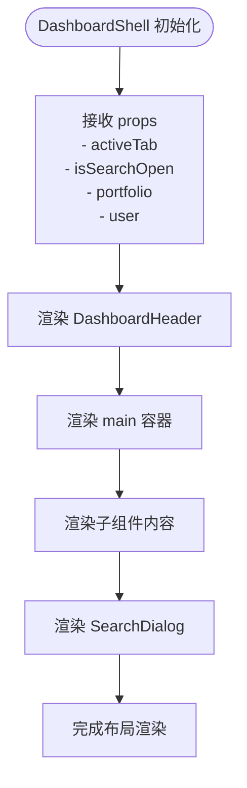

**图表来源**
- [frontend/features/dashboard/components/DashboardShell.tsx:10-46](file://frontend/features/dashboard/components/DashboardShell.tsx#L10-L46)

**章节来源**
- [frontend/features/dashboard/components/DashboardShell.tsx:1-47](file://frontend/features/dashboard/components/DashboardShell.tsx#L1-L47)

### 分析标签容器（AnalysisTabContainer）- **新增**
职责与流程
- **双面板布局**：实现投资组合列表和股票详情的响应式双面板布局。
- **移动端适配**：在移动设备上提供滑动切换的交互体验。
- **数据绑定**：将分析数据、新闻数据、投资组合数据与子组件绑定。
- **功能集成**：集成分析触发、刷新、股票选择等功能。

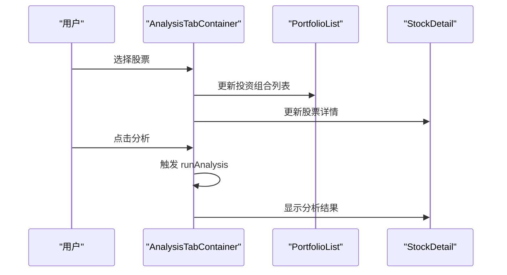

**图表来源**
- [frontend/features/dashboard/components/AnalysisTabContainer.tsx:27-82](file://frontend/features/dashboard/components/AnalysisTabContainer.tsx#L27-L82)

**章节来源**
- [frontend/features/dashboard/components/AnalysisTabContainer.tsx:1-83](file://frontend/features/dashboard/components/AnalysisTabContainer.tsx#L1-L83)

### 投资组合标签容器（PortfolioTabContainer）- **新增**
职责与流程
- **功能封装**：封装投资组合仪表盘的所有功能，包括分析、报告展示等。
- **状态管理**：通过 useDashboardPortfolioTabData 获取所需的状态和方法。
- **组件集成**：将 PortfolioDashboard 与 hooks 系统集成。

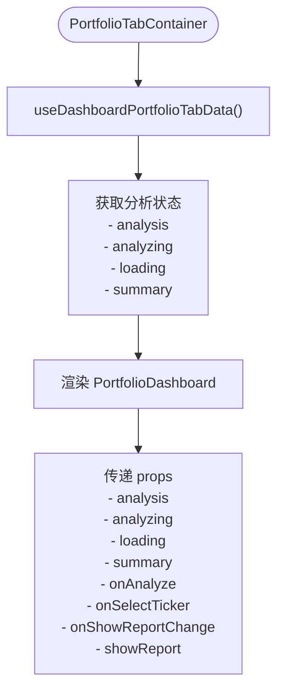

**图表来源**
- [frontend/features/dashboard/components/PortfolioTabContainer.tsx:10-35](file://frontend/features/dashboard/components/PortfolioTabContainer.tsx#L10-L35)

**章节来源**
- [frontend/features/dashboard/components/PortfolioTabContainer.tsx:1-36](file://frontend/features/dashboard/components/PortfolioTabContainer.tsx#L1-L36)

### hooks 驱动的状态管理 - **新增**
职责与流程
- **useDashboardAnalysisData**：管理分析数据的获取、缓存和刷新逻辑。
- **useDashboardPortfolioData**：管理投资组合数据和用户信息的获取。
- **useDashboardRouteState**：管理仪表板的路由状态，包括标签页和股票选择。
- **useCachedResource**：提供通用的缓存资源管理功能。

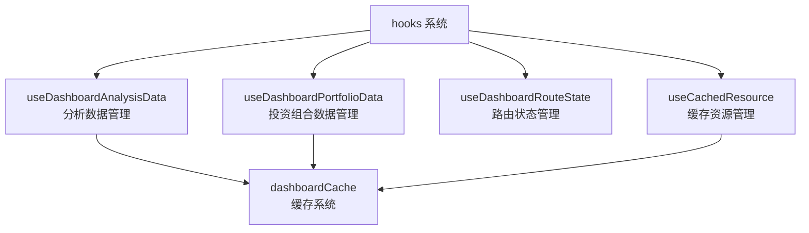

**图表来源**
- [frontend/features/dashboard/hooks/useDashboardAnalysisData.ts:19-84](file://frontend/features/dashboard/hooks/useDashboardAnalysisData.ts#L19-L84)
- [frontend/features/dashboard/hooks/useDashboardPortfolioData.ts:11-55](file://frontend/features/dashboard/hooks/useDashboardPortfolioData.ts#L11-L55)
- [frontend/features/dashboard/hooks/useDashboardRouteState.ts:10-72](file://frontend/features/dashboard/hooks/useDashboardRouteState.ts#L10-L72)
- [frontend/features/dashboard/hooks/useCachedResource.ts:24-111](file://frontend/features/dashboard/hooks/useCachedResource.ts#L24-L111)
- [frontend/features/dashboard/hooks/dashboardCache.ts:64-91](file://frontend/features/dashboard/hooks/dashboardCache.ts#L64-L91)

**章节来源**
- [frontend/features/dashboard/hooks/useDashboardAnalysisData.ts:1-85](file://frontend/features/dashboard/hooks/useDashboardAnalysisData.ts#L1-L85)
- [frontend/features/dashboard/hooks/useDashboardPortfolioData.ts:1-56](file://frontend/features/dashboard/hooks/useDashboardPortfolioData.ts#L1-L56)
- [frontend/features/dashboard/hooks/useDashboardRouteState.ts:1-73](file://frontend/features/dashboard/hooks/useDashboardRouteState.ts#L1-L73)
- [frontend/features/dashboard/hooks/useCachedResource.ts:1-112](file://frontend/features/dashboard/hooks/useCachedResource.ts#L1-L112)
- [frontend/features/dashboard/hooks/dashboardCache.ts:1-91](file://frontend/features/dashboard/hooks/dashboardCache.ts#L1-L91)

### 缓存系统架构 - **新增**
职责与流程
- **dashboardCache**：提供统一的缓存管理，支持不同类型数据的 TTL 设置。
- **createDashboardCacheEntry**：创建缓存条目，包含 TTL、更新时间和值。
- **getOrCreateDashboardCacheEntry**：获取或创建缓存条目，支持按键值存储。
- **缓存策略**：实现缓存的读取、写入、失效检测和自动更新。

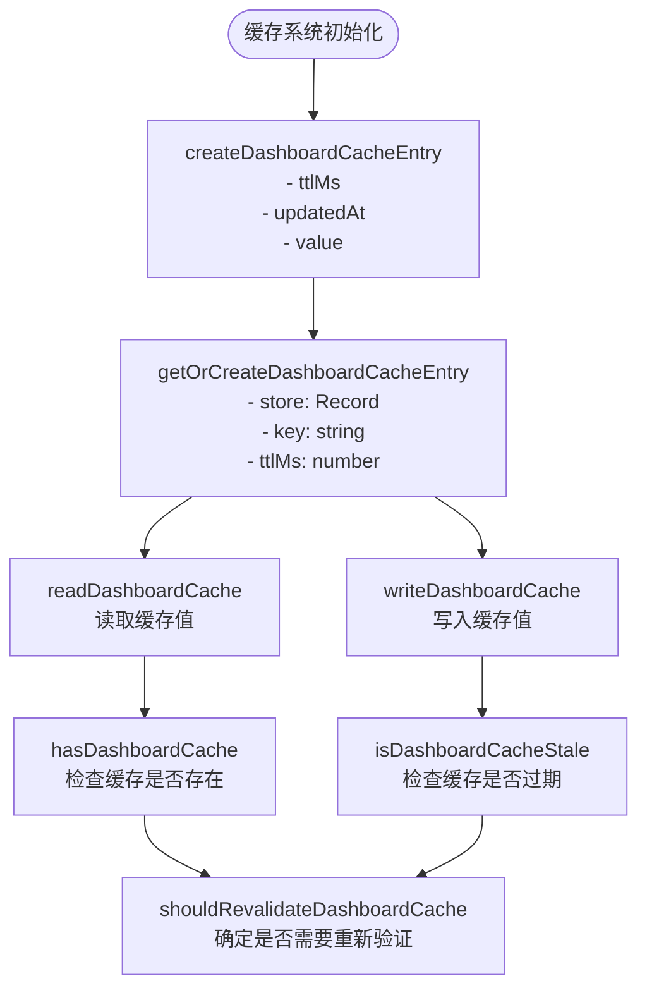

**图表来源**
- [frontend/features/dashboard/hooks/dashboardCache.ts:20-62](file://frontend/features/dashboard/hooks/dashboardCache.ts#L20-L62)

**章节来源**
- [frontend/features/dashboard/hooks/dashboardCache.ts:1-91](file://frontend/features/dashboard/hooks/dashboardCache.ts#L1-L91)

### 仪表板主页面（Dashboard）- **更新**
职责与流程
- 初始化与挂载：设置 mounted 状态，首次拉取投资组合数据。**新增** 使用 Suspense 包装 DashboardContent 提供统一加载状态。
- **新增** 仪表板架构集成：通过 DashboardShell 和各个标签容器实现完整的仪表板功能。
- **新增** hooks 集成：使用 useDashboardAnalysisData、useDashboardPortfolioData 等 hooks 管理状态。
- **新增** 路由状态管理：通过 useDashboardRouteState 管理标签页和股票选择的 URL 同步。
- 认证与重定向：若未认证且无 token，跳转至登录页。
- 投资组合数据：通过 API 获取，支持刷新参数；自动选中首个条目；按代码/价格/涨跌幅排序与升序/降序切换。
- 市场状态：基于纽约时间计算盘前盘后状态与倒计时，每分钟更新一次。
- AI 分析：根据选中标的触发分析，解析返回的 JSON 或回退为纯文本 Markdown 展示。**增强** 分析请求失败时的轮询恢复模式。
- 搜索与添加：本地搜索与远程搜索结合，支持添加到投资组合。
- 编辑与删除：就地编辑持有数量与成本，删除条目后刷新列表并重置选中项。
- 数据绑定与展示：使用卡片与网格布局展示基本面与技术指标，支持 Markdown 渲染。

**新增** Suspense 加载状态实现
```typescript
export default function Dashboard() {
  return (
    <Suspense fallback={<div className="h-screen w-screen flex items-center justify-center bg-slate-50 dark:bg-slate-950">Loading...</div>}>
      <DashboardContent />
    </Suspense>
  );
}
```

**增强** 客户端错误处理机制
```typescript
const handleAnalyze = async (force: boolean = false) => {
  if (!selectedTicker) return;
  setAnalyzing(true);
  const startTime = new Date().toISOString();

  try {
    const result = await analyzeStock(selectedTicker, force);
    handleParseAnalysis(result);
    // ... 刷新逻辑
  } catch (error: any) {
    console.warn("Analysis POST request failed/terminated, entering polling recovery mode...", error);

    // 优化容错：轮询机制
    let recovered = false;
    for (let attempt = 1; attempt <= 5; attempt++) {
      try {
        await new Promise(resolve => setTimeout(resolve, attempt * 2000));
        const retryResult = await getLatestAnalysis(selectedTicker);
        if (retryResult && retryResult.created_at) {
          const reportTime = new Date(retryResult.created_at + (retryResult.created_at.includes('Z') ? '' : 'Z')).toISOString();
          if (reportTime >= startTime) {
            console.log(`Successfully recovered analysis data on attempt ${attempt}`);
            handleParseAnalysis(retryResult);
            recovered = true;
            break;
          }
        }
      } catch (retryError) {
        console.error(`Recovery attempt ${attempt} failed:`, retryError);
      }
    }

    if (!recovered) {
      if (error.response?.status === 429) {
        alert("Limit Reached! 🚨\nPlease add your own API Key in Settings.");
        router.push("/settings");
      } else {
        alert("Analysis request disconnected. Please check if the diagnosis appears after a few seconds or manually refresh.");
      }
    }
  } finally {
    setAnalyzing(false);
  }
};
```

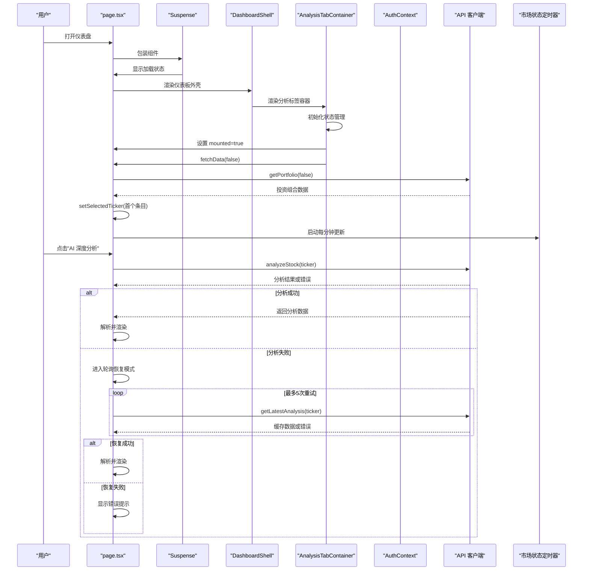

**图表来源**
- [frontend/app/page.tsx:96-194](file://frontend/app/page.tsx#L96-L194)
- [frontend/context/AuthContext.tsx:19-37](file://frontend/context/AuthContext.tsx#L19-L37)
- [frontend/app/page.tsx:208-264](file://frontend/app/page.tsx#L208-L264)
- [frontend/features/dashboard/components/DashboardShell.tsx:33-45](file://frontend/features/dashboard/components/DashboardShell.tsx#L33-L45)
- [frontend/features/dashboard/components/AnalysisTabContainer.tsx:44-81](file://frontend/features/dashboard/components/AnalysisTabContainer.tsx#L44-L81)

**章节来源**
- [frontend/app/page.tsx:24-318](file://frontend/app/page.tsx#L24-L318)

### 认证上下文（AuthContext）
职责与流程
- 提供 token 的读取、登录写入、登出移除与认证状态判断。
- 在登录成功后写入 localStorage 并跳转首页；登出时清理并跳转登录页。
- 页面组件通过 useAuth 获取 isAuthenticated 以决定是否允许访问与跳转。

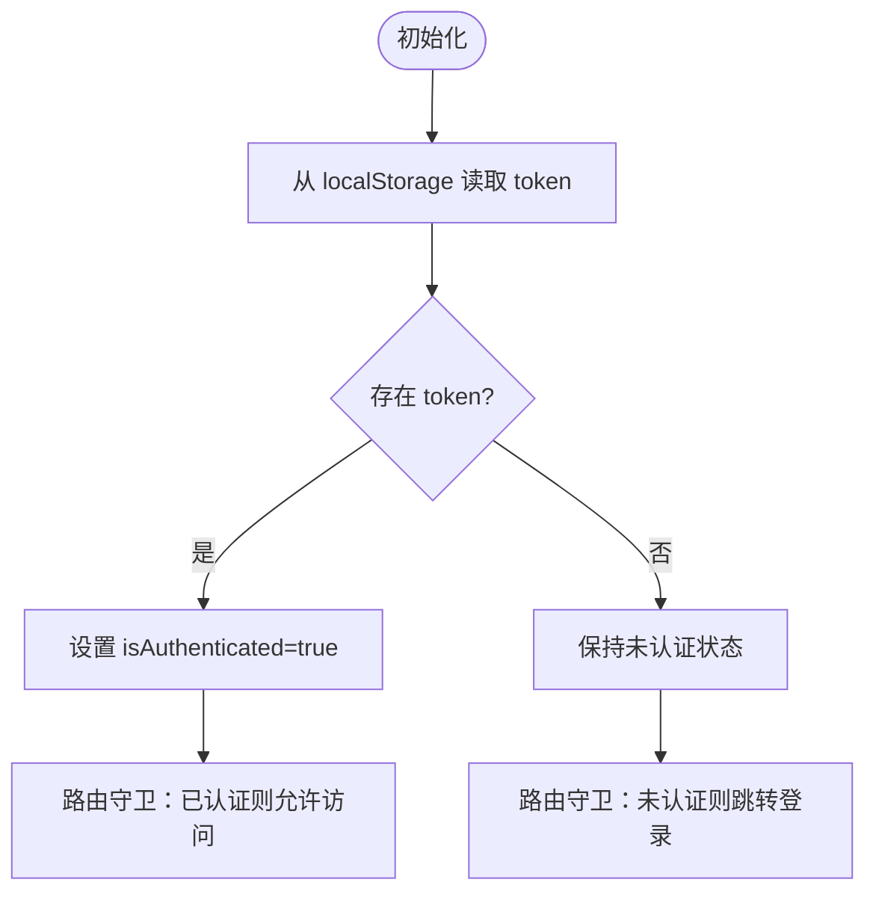

**图表来源**
- [frontend/context/AuthContext.tsx:19-37](file://frontend/context/AuthContext.tsx#L19-L37)

**章节来源**
- [frontend/context/AuthContext.tsx:1-68](file://frontend/context/AuthContext.tsx#L1-L68)

### 设置页（Settings）
职责与流程
- 加载用户资料与当前设置（API Key 配置、数据源偏好）。
- 支持保存新的 Gemini API Key，保存后清空输入并重新加载。
- 支持切换数据源（Alpha Vantage 与 YFinance），并提示回退策略。

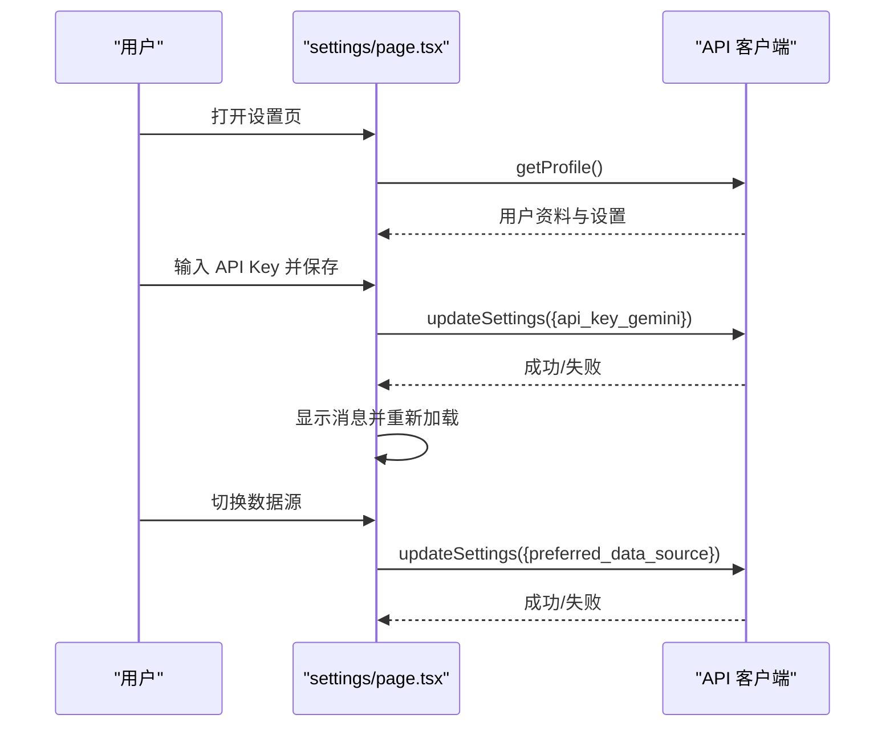

**图表来源**
- [frontend/app/settings/page.tsx:21-69](file://frontend/app/settings/page.tsx#L21-L69)

**章节来源**
- [frontend/app/settings/page.tsx:1-177](file://frontend/app/settings/page.tsx#L1-L177)

### 登录页（Login）
职责与流程
- 表单收集邮箱与密码，POST 至后端认证接口。
- 成功后从响应中提取 token，调用 AuthContext.login 写入 localStorage 并跳转首页。
- 失败时显示错误信息。

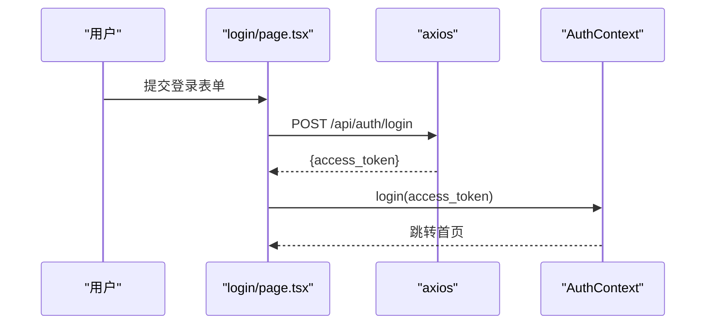

**图表来源**
- [frontend/app/login/page.tsx:19-42](file://frontend/app/login/page.tsx#L19-L42)
- [frontend/context/AuthContext.tsx:27-31](file://frontend/context/AuthContext.tsx#L27-L31)

**章节来源**
- [frontend/app/login/page.tsx:1-89](file://frontend/app/login/page.tsx#L1-L89)

### UI 组件（卡片、按钮、表格）
- 卡片：统一的卡片容器、标题、描述、内容与底部区域，便于分块展示分析结果。
- 按钮：支持多种变体与尺寸，统一交互反馈。
- 表格：提供表格容器、表头、表体、行、单元格与标题，支持滚动与响应式布局。

**章节来源**
- [frontend/components/ui/card.tsx:1-93](file://frontend/components/ui/card.tsx#L1-L93)
- [frontend/components/ui/button.tsx:1-63](file://frontend/components/ui/button.tsx#L1-L63)
- [frontend/components/ui/table.tsx:1-117](file://frontend/components/ui/table.tsx#L1-L117)

### 数据绑定与实时更新机制
- 数据绑定：投资组合列表、AI 分析结果、编辑表单值均通过 useState/useState 与 props 绑定，实现双向数据流。
- **新增** hooks 驱动的数据绑定：通过 useDashboardAnalysisData、useDashboardPortfolioData 等 hooks 实现响应式数据绑定。
- **新增** 缓存驱动的实时更新：通过 dashboardCache 和 useCachedResource 实现智能缓存和自动更新。
- 实时更新策略：
  - 轮询：市场状态定时器每分钟更新一次，保证盘前盘后状态与倒计时准确。
  - 事件驱动：选择标的变化、添加/删除/编辑完成、登录成功后立即拉取最新数据。
  - 本地状态优先：搜索采用本地过滤与远程查询结合，提升交互流畅度。
  - **新增** URL 同步：通过 useDashboardRouteState 实现标签页和股票选择的 URL 同步。

**章节来源**
- [frontend/app/page.tsx:100-153](file://frontend/app/page.tsx#L100-L153)
- [frontend/app/page.tsx:179-194](file://frontend/app/page.tsx#L179-L194)
- [frontend/app/page.tsx:200-204](file://frontend/app/page.tsx#L200-L204)
- [frontend/features/dashboard/hooks/useDashboardAnalysisData.ts:25-46](file://frontend/features/dashboard/hooks/useDashboardAnalysisData.ts#L25-L46)
- [frontend/features/dashboard/hooks/useDashboardRouteState.ts:22-64](file://frontend/features/dashboard/hooks/useDashboardRouteState.ts#L22-L64)

### 用户认证状态与权限控制
- 认证守卫：仪表盘与设置页在挂载时检查认证状态，未认证则跳转登录。
- 会话持久化：token 存储于 localStorage，刷新后仍保持登录态。
- 权限隔离：所有 API 请求依赖有效 token，后端确保用户仅能访问自身数据。
- **新增** hooks 级别的权限控制：通过 useDashboardPortfolioData 的 enabled 属性实现基于认证状态的自动权限控制。

**章节来源**
- [frontend/app/page.tsx:155-163](file://frontend/app/page.tsx#L155-L163)
- [frontend/app/settings/page.tsx:21-25](file://frontend/app/settings/page.tsx#L21-L25)
- [frontend/context/AuthContext.tsx:19-37](file://frontend/context/AuthContext.tsx#L19-L37)
- [frontend/features/dashboard/hooks/useDashboardPortfolioData.ts:13-14](file://frontend/features/dashboard/hooks/useDashboardPortfolioData.ts#L13-L14)

### 使用示例与自定义选项
- 样式定制：
  - 使用 Tailwind 类名进行主题适配（浅色/深色模式）。
  - 通过 cn 工具函数合并条件类名，实现动态样式切换。
- **新增** 仪表板组件定制：
  - 通过 DashboardShell 的 props 自定义头部导航和布局。
  - 通过 AnalysisTabContainer 的 onlyHoldings 属性控制投资组合列表显示。
  - 通过各标签容器的 props 自定义功能和展示方式。
- 功能扩展：
  - 新增列：在排序逻辑与渲染网格中增加字段映射。
  - 自定义分析：在设置页配置 API Key 后，解锁无限分析额度。
  - 数据源切换：在设置页选择 Alpha Vantage 或 YFinance，系统自动回退。
  - **新增** 缓存配置：通过 dashboardCache 的 TTL 设置调整缓存策略。

**章节来源**
- [frontend/app/page.tsx:63-90](file://frontend/app/page.tsx#L63-L90)
- [frontend/app/page.tsx:505-566](file://frontend/app/page.tsx#L505-L566)
- [frontend/app/settings/page.tsx:60-69](file://frontend/app/settings/page.tsx#L60-L69)
- [frontend/lib/utils.ts:1-7](file://frontend/lib/utils.ts#L1-L7)
- [frontend/features/dashboard/components/DashboardShell.tsx:10-20](file://frontend/features/dashboard/components/DashboardShell.tsx#L10-L20)
- [frontend/features/dashboard/components/AnalysisTabContainer.tsx:11-25](file://frontend/features/dashboard/components/AnalysisTabContainer.tsx#L11-L25)
- [frontend/features/dashboard/hooks/dashboardCache.ts:64-91](file://frontend/features/dashboard/hooks/dashboardCache.ts#L64-L91)

### API 客户端错误处理增强 - **新增**
职责与流程
- 基础配置：设置 baseURL、timeout 和默认 headers。
- 请求拦截器：自动注入 JWT Token。
- 响应拦截器：**增强** 处理认证错误、网络错误和 5xx 服务器错误的自动重试。
- 重试策略：指数退避（1s, 2s），最多 2 次重试。

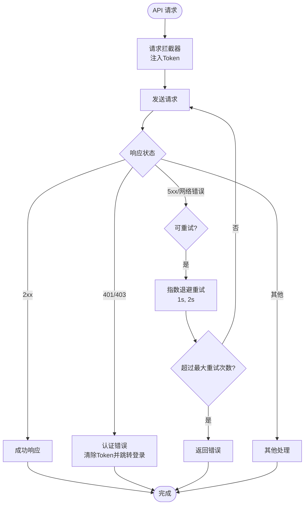

**图表来源**
- [frontend/lib/api.ts:26-87](file://frontend/lib/api.ts#L26-L87)

**章节来源**
- [frontend/lib/api.ts:1-205](file://frontend/lib/api.ts#L1-L205)

## 依赖关系分析
- 运行时依赖：Next.js、React、Axios、date-fns、lucide-react、react-markdown、Tailwind 生态等。
- **新增** 仪表板依赖：clsx 用于条件类名合并，支持响应式布局。
- 组件复用：UI 组件通过统一导出供页面复用，减少重复实现。
- 上下文注入：根布局包裹 AuthProvider，使任意子组件可访问认证状态。
- **新增** hooks 系统：通过独立的 hooks 文件实现功能模块化，提高代码复用性。
- **新增** Suspense 支持：Next.js 13+ 的并发特性，提供更好的加载状态管理。

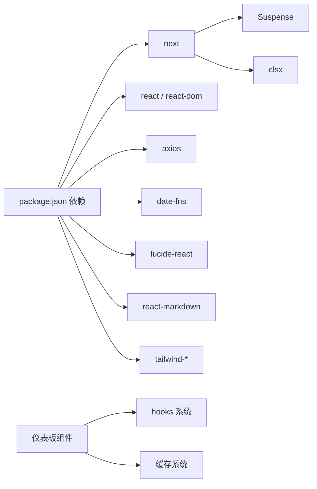

**图表来源**
- [frontend/package.json:11-29](file://frontend/package.json#L11-L29)
- [frontend/features/dashboard/components/AnalysisTabContainer.tsx](file://frontend/features/dashboard/components/AnalysisTabContainer.tsx#L3)

**章节来源**
- [frontend/package.json:1-43](file://frontend/package.json#L1-L43)

## 性能考虑
- **新增** 缓存优化：通过 dashboardCache 实现数据缓存，减少重复请求，提高响应速度。
- **新增** hooks 优化：使用 hooks 驱动的状态管理，避免不必要的组件重渲染。
- **新增** 智能刷新：通过 useCachedResource 实现智能缓存刷新，支持 TTL 和手动刷新。
- 渲染优化：使用 useMemo 与本地排序避免不必要的重渲染；列表采用虚拟滚动容器（ScrollArea）提升长列表性能。
- 网络优化：搜索采用本地过滤与远程查询结合，减少请求频率；AI 分析结果缓存于组件状态，避免重复请求。
- 交互优化：按钮与输入组件统一尺寸与变体，减少样式计算开销；Markdown 渲染按需触发，避免全量更新。
- **新增** Suspense 优化：提供统一的加载状态，避免重复的 loading 状态管理。
- **新增** 错误恢复：轮询机制确保网络波动时的数据完整性，提升用户体验。
- **新增** 响应式优化：AnalysisTabContainer 的响应式布局优化移动端体验。

## 故障排查指南
- **新增** 仪表板组件问题：检查 DashboardShell 的 props 传递是否正确，确认各标签容器的渲染状态。
- **新增** hooks 状态问题：验证 useDashboardAnalysisData 和 useDashboardPortfolioData 的返回值，检查缓存系统是否正常工作。
- **新增** 路由状态问题：确认 useDashboardRouteState 的标签页切换和股票选择功能正常。
- **新增** 缓存系统问题：检查 dashboardCache 的 TTL 设置和缓存失效逻辑。
- 登录失败：检查网络请求与后端认证接口返回；确认表单字段与 Content-Type。
- 未认证跳转：确认 localStorage 中 token 是否存在；检查 AuthContext 初始化逻辑。
- AI 分析失败：**增强** 检查设置页 API Key 是否配置；当返回 429 时提示前往设置页配置自有 Key；**新增** 观察轮询恢复机制是否正常工作。
- 数据不更新：确认 fetchData 是否在登录成功后执行；检查市场状态定时器是否正常运行；**新增** 验证 Suspense 加载状态是否正确显示；**新增** 检查 hooks 状态管理是否正常工作。
- **新增** Suspense 相关问题：检查 Dashboard 组件的 Suspense 包装是否正确；验证 fallback 组件的样式和内容。
- **新增** 响应式布局问题：检查 AnalysisTabContainer 在不同屏幕尺寸下的表现。

**章节来源**
- [frontend/app/login/page.tsx:24-42](file://frontend/app/login/page.tsx#L24-L42)
- [frontend/context/AuthContext.tsx:19-37](file://frontend/context/AuthContext.tsx#L19-L37)
- [frontend/app/page.tsx:230-237](file://frontend/app/page.tsx#L230-L237)
- [frontend/app/page.tsx:196-198](file://frontend/app/page.tsx#L196-L198)
- [frontend/app/page.tsx:208-264](file://frontend/app/page.tsx#L208-L264)
- [frontend/features/dashboard/components/DashboardShell.tsx:33-45](file://frontend/features/dashboard/components/DashboardShell.tsx#L33-L45)
- [frontend/features/dashboard/hooks/useDashboardAnalysisData.ts:48-65](file://frontend/features/dashboard/hooks/useDashboardAnalysisData.ts#L48-L65)
- [frontend/features/dashboard/hooks/useDashboardRouteState.ts:35-64](file://frontend/features/dashboard/hooks/useDashboardRouteState.ts#L35-L64)

## 结论
该前端实现以页面组件为核心，结合认证上下文与 UI 组件库，构建了完整的投资组合展示与交互体系。**更新** 通过引入全新的仪表板组件架构、hooks 驱动的状态管理和基于缓存的资源管理系统，显著提升了应用的模块化程度、性能和用户体验。**新增** 的 DashboardShell、AnalysisTabContainer 等组件提供了更加灵活和可扩展的仪表板解决方案；hooks 系统实现了更好的状态管理和代码复用；缓存系统优化了数据获取效率。通过本地状态管理与定时器策略，实现了稳定的数据绑定与实时更新；通过设置页与 API Key 管理，提升了用户体验与功能可用性。建议持续关注长列表性能与错误边界处理，进一步增强可访问性与国际化支持。

## 附录
- 术语
  - 盘前/盘后：基于纽约时间的市场状态判断。
  - 本地搜索：基于已有结果进行本地过滤。
  - 远程搜索：向后端发起查询请求。
  - **新增** 仪表板外壳：DashboardShell 作为仪表板的根容器，管理整体布局。
  - **新增** 分析标签容器：AnalysisTabContainer 实现分析功能的双面板布局。
  - **新增** hooks 驱动：通过自定义 hooks 实现状态管理和业务逻辑封装。
  - **新增** 缓存系统：dashboardCache 提供统一的数据缓存管理。
  - **新增** 路由状态：useDashboardRouteState 管理标签页和股票选择的 URL 同步。
  - **新增** 轮询恢复：在网络连接中断时定期检查缓存数据的机制。
  - **新增** Suspense：React 18+ 的并发特性，提供统一的加载状态管理。
- 参考路径
  - 投资组合数据获取与分析：[frontend/app/page.tsx:179-240](file://frontend/app/page.tsx#L179-L240)
  - 认证上下文与路由守卫：[frontend/context/AuthContext.tsx:19-37](file://frontend/context/AuthContext.tsx#L19-L37)
  - 设置页 API Key 与数据源：[frontend/app/settings/page.tsx:38-69](file://frontend/app/settings/page.tsx#L38-L69)
  - 登录页表单提交：[frontend/app/login/page.tsx:19-42](file://frontend/app/login/page.tsx#L19-L42)
  - UI 组件复用：[frontend/components/ui/card.tsx:1-93](file://frontend/components/ui/card.tsx#L1-L93)、[frontend/components/ui/button.tsx:1-63](file://frontend/components/ui/button.tsx#L1-L63)、[frontend/components/ui/table.tsx:1-117](file://frontend/components/ui/table.tsx#L1-L117)
  - **新增** 仪表板外壳：[frontend/features/dashboard/components/DashboardShell.tsx:1-47](file://frontend/features/dashboard/components/DashboardShell.tsx#L1-L47)
  - **新增** 分析标签容器：[frontend/features/dashboard/components/AnalysisTabContainer.tsx:1-83](file://frontend/features/dashboard/components/AnalysisTabContainer.tsx#L1-L83)
  - **新增** 投资组合标签容器：[frontend/features/dashboard/components/PortfolioTabContainer.tsx:1-36](file://frontend/features/dashboard/components/PortfolioTabContainer.tsx#L1-L36)
  - **新增** hooks 系统：[frontend/features/dashboard/hooks/useDashboardAnalysisData.ts:1-85](file://frontend/features/dashboard/hooks/useDashboardAnalysisData.ts#L1-L85)
  - **新增** 缓存系统：[frontend/features/dashboard/hooks/dashboardCache.ts:1-91](file://frontend/features/dashboard/hooks/dashboardCache.ts#L1-L91)
  - **新增** 路由状态管理：[frontend/features/dashboard/hooks/useDashboardRouteState.ts:1-73](file://frontend/features/dashboard/hooks/useDashboardRouteState.ts#L1-L73)
  - **新增** Suspense 加载状态：[frontend/app/page.tsx:311-317](file://frontend/app/page.tsx#L311-L317)
  - **新增** 增强错误处理：[frontend/app/page.tsx:208-264](file://frontend/app/page.tsx#L208-L264)
  - **新增** API 客户端错误拦截：[frontend/lib/api.ts:26-87](file://frontend/lib/api.ts#L26-L87)
  - 工具函数：[frontend/lib/utils.ts:1-7](file://frontend/lib/utils.ts#L1-L7)