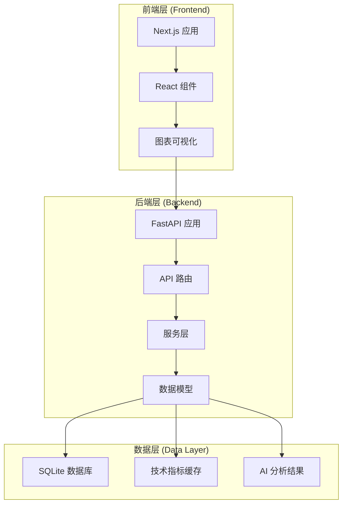
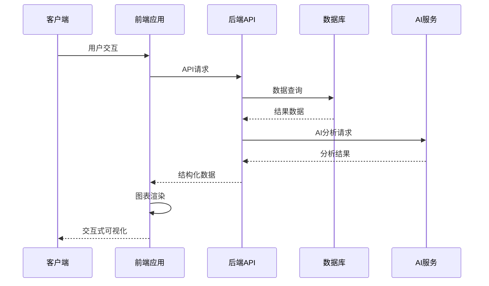
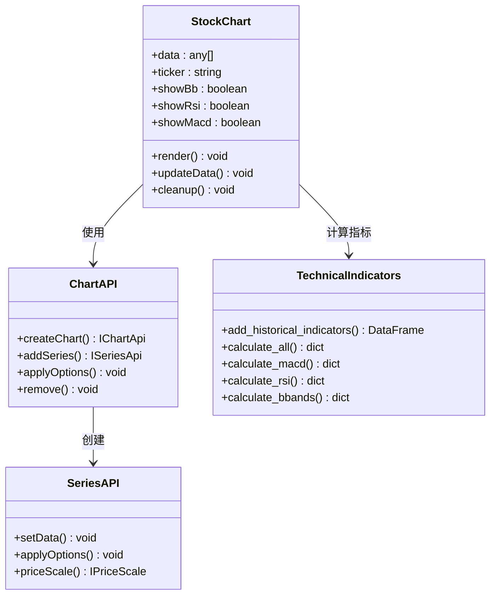
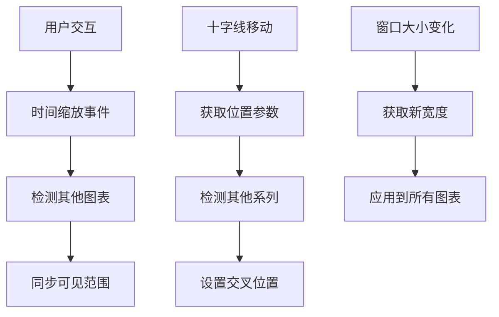
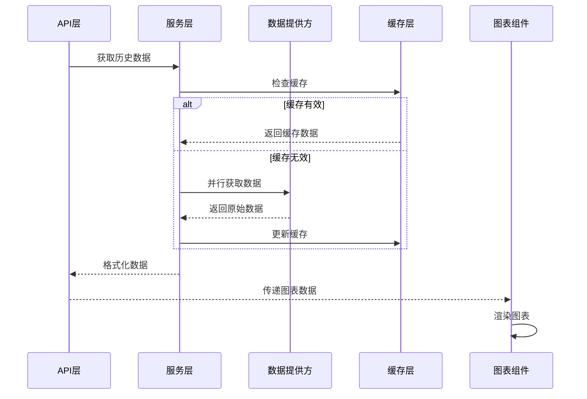
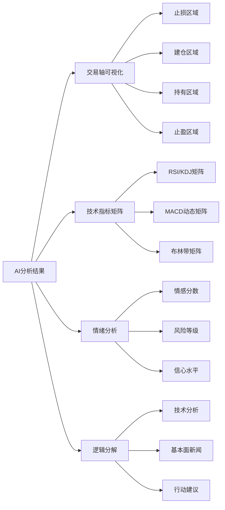
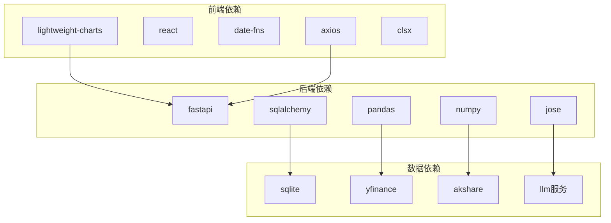
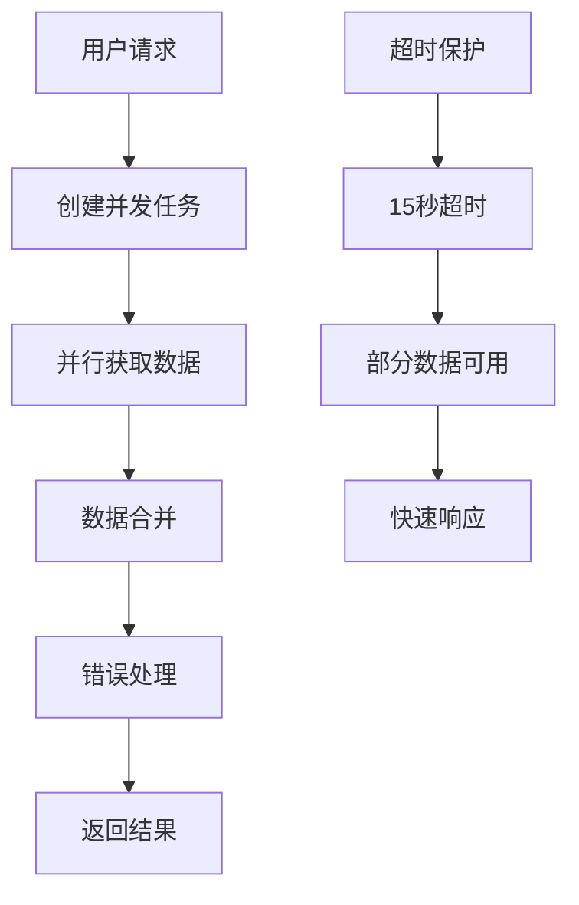

# 高级图表可视化

<cite>
**本文档引用的文件**
- [backend/app/models/analysis.py](file://backend/app/models/analysis.py)
- [backend/app/schemas/analysis.py](file://backend/app/schemas/analysis.py)
- [backend/app/services/market_data.py](file://backend/app/services/market_data.py)
- [frontend/components/features/StockChart.tsx](file://frontend/components/features/StockChart.tsx)
- [backend/app/api/v1/endpoints/analysis.py](file://backend/app/api/v1/endpoints/analysis.py)
- [backend/app/models/stock.py](file://backend/app/models/stock.py)
- [backend/app/schemas/market_data.py](file://backend/app/schemas/market_data.py)
- [backend/app/services/indicators.py](file://backend/app/services/indicators.py)
- [frontend/lib/api.ts](file://frontend/lib/api.ts)
- [backend/app/api/v1/endpoints/stock.py](file://backend/app/api/v1/endpoints/stock.py)
- [frontend/components/features/StockDetail.tsx](file://frontend/components/features/StockDetail.tsx)
- [backend/app/main.py](file://backend/app/main.py)
- [frontend/types/index.ts](file://frontend/types/index.ts)
</cite>

## 目录
1. [简介](#简介)
2. [项目结构](#项目结构)
3. [核心组件](#核心组件)
4. [架构概览](#架构概览)
5. [详细组件分析](#详细组件分析)
6. [依赖关系分析](#依赖关系分析)
7. [性能考虑](#性能考虑)
8. [故障排除指南](#故障排除指南)
9. [结论](#结论)

## 简介

本项目是一个集成了AI智能投资顾问的高级图表可视化系统。该系统通过轻量级图表库实现了复杂的K线图、技术指标图表和AI分析结果的可视化展示。系统采用前后端分离架构，后端使用FastAPI提供RESTful API，前端使用Next.js和React构建交互式图表界面。

## 项目结构

该项目采用清晰的分层架构设计：

**图表来源**
- [backend/app/main.py](file://backend/app/main.py#L27-L31)
- [frontend/components/features/StockChart.tsx](file://frontend/components/features/StockChart.tsx#L1-L6)

**章节来源**
- [backend/app/main.py](file://backend/app/main.py#L1-L129)
- [frontend/components/features/StockChart.tsx](file://frontend/components/features/StockChart.tsx#L1-L358)

## 核心组件

### 图表可视化组件

系统的核心图表组件基于lightweight-charts库构建，提供了高度可定制的交互式图表体验：

#### StockChart 组件
- **职责**: 渲染K线图、成交量、RSI、MACD和布林带
- **特性**: 支持多子图表联动、十字线同步、时间轴联动
- **技术指标**: RSI(14)、MACD(12,26,9)、布林带(BB)、ATR、KDJ等

#### 技术指标引擎
- **职责**: 基于Pandas实现高效技术指标计算
- **支持指标**: MACD、RSI、布林带、ATR、ADX、枢轴点等
- **性能优化**: 批量计算和向量化操作

### AI分析可视化

系统集成了AI分析结果的可视化展示：

#### 交易轴算法
- **功能**: 将止损、建仓、目标价映射到线性坐标轴
- **特性**: 动态缓冲区、区域颜色编码、当前价格指示器
- **用途**: 直观展示投资决策区间

#### 情绪分析可视化
- **指标**: AI情绪偏差分数(0-100)
- **展示**: 进度条、状态标签、风险等级

**章节来源**
- [frontend/components/features/StockChart.tsx](file://frontend/components/features/StockChart.tsx#L1-L358)
- [backend/app/services/indicators.py](file://backend/app/services/indicators.py#L1-L192)
- [frontend/components/features/StockDetail.tsx](file://frontend/components/features/StockDetail.tsx#L340-L640)

## 架构概览

系统采用现代化的全栈架构，实现了前后端的高效协作：

**图表来源**
- [backend/app/api/v1/endpoints/analysis.py](file://backend/app/api/v1/endpoints/analysis.py#L200-L600)
- [frontend/lib/api.ts](file://frontend/lib/api.ts#L142-L157)

**章节来源**
- [backend/app/api/v1/endpoints/analysis.py](file://backend/app/api/v1/endpoints/analysis.py#L1-L665)
- [frontend/lib/api.ts](file://frontend/lib/api.ts#L1-L205)

## 详细组件分析

### 图表组件架构

**图表来源**
- [frontend/components/features/StockChart.tsx](file://frontend/components/features/StockChart.tsx#L11-L42)
- [backend/app/services/indicators.py](file://backend/app/services/indicators.py#L7-L192)

#### 图表联动机制

系统实现了多图表间的智能联动：

**图表来源**
- [frontend/components/features/StockChart.tsx](file://frontend/components/features/StockChart.tsx#L181-L210)

### 数据流处理

**图表来源**
- [backend/app/services/market_data.py](file://backend/app/services/market_data.py#L18-L58)
- [backend/app/api/v1/endpoints/stock.py](file://backend/app/api/v1/endpoints/stock.py#L46-L75)

**章节来源**
- [backend/app/services/market_data.py](file://backend/app/services/market_data.py#L1-L266)
- [frontend/components/features/StockChart.tsx](file://frontend/components/features/StockChart.tsx#L253-L323)

### AI分析可视化

系统提供了完整的AI分析结果可视化：

**图表来源**
- [frontend/components/features/StockDetail.tsx](file://frontend/components/features/StockDetail.tsx#L340-L640)

**章节来源**
- [frontend/components/features/StockDetail.tsx](file://frontend/components/features/StockDetail.tsx#L323-L647)

## 依赖关系分析

系统采用了模块化的依赖管理策略：

**图表来源**
- [backend/app/main.py](file://backend/app/main.py#L1-L129)
- [frontend/lib/api.ts](file://frontend/lib/api.ts#L1-L205)

**章节来源**
- [backend/app/main.py](file://backend/app/main.py#L94-L111)
- [frontend/lib/api.ts](file://frontend/lib/api.ts#L18-L24)

## 性能考虑

### 图表渲染优化

系统在性能方面采用了多项优化策略：

1. **虚拟DOM优化**: React组件使用useRef避免不必要的重渲染
2. **图表实例复用**: 图表实例在组件卸载时正确清理
3. **数据流优化**: 使用useEffect的依赖数组精确控制更新时机

### 并发数据获取

**图表来源**
- [backend/app/services/market_data.py](file://backend/app/services/market_data.py#L73-L115)

### 缓存策略

系统实现了多层次的数据缓存机制：

- **短期缓存**: 1分钟内有效，避免频繁API调用
- **数据库缓存**: 技术指标和市场数据持久化存储
- **AI结果缓存**: 分析报告的结构化数据缓存

**章节来源**
- [backend/app/services/market_data.py](file://backend/app/services/market_data.py#L39-L42)
- [backend/app/api/v1/endpoints/analysis.py](file://backend/app/api/v1/endpoints/analysis.py#L328-L386)

## 故障排除指南

### 常见问题及解决方案

#### 图表渲染问题
- **症状**: 图表空白或渲染异常
- **原因**: 数据格式不正确或图表实例未正确初始化
- **解决**: 检查数据清洗函数和图表初始化逻辑

#### 性能问题
- **症状**: 页面卡顿或响应缓慢
- **原因**: 大量数据渲染或重复计算
- **解决**: 实施数据分页、优化计算逻辑、使用useMemo

#### API调用失败
- **症状**: 数据加载失败或显示错误
- **原因**: 网络问题或API限制
- **解决**: 实现重试机制和错误边界

**章节来源**
- [frontend/components/features/StockChart.tsx](file://frontend/components/features/StockChart.tsx#L317-L322)
- [frontend/lib/api.ts](file://frontend/lib/api.ts#L44-L87)

## 结论

本高级图表可视化系统成功地将复杂的技术分析数据转化为直观的交互式图表。通过精心设计的架构和优化的性能策略，系统能够高效地处理大量市场数据，并为用户提供丰富的可视化分析工具。

系统的亮点包括：
- **高度交互性**: 支持多图表联动和实时数据更新
- **AI集成**: 将AI分析结果直观地展示在图表中
- **性能优化**: 采用多种策略确保流畅的用户体验
- **可扩展性**: 模块化设计便于功能扩展和维护

未来可以考虑的功能增强包括更丰富的技术指标、自定义图表模板、以及移动端优化等。