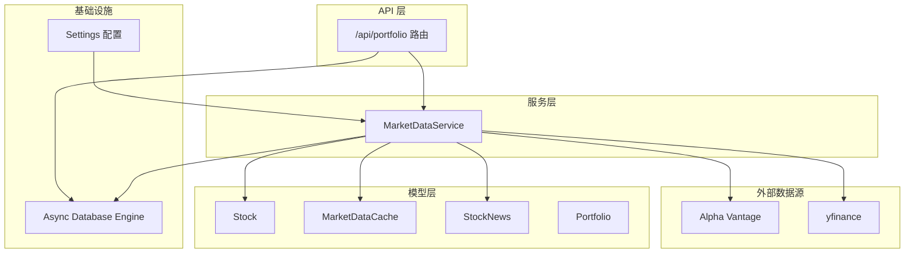
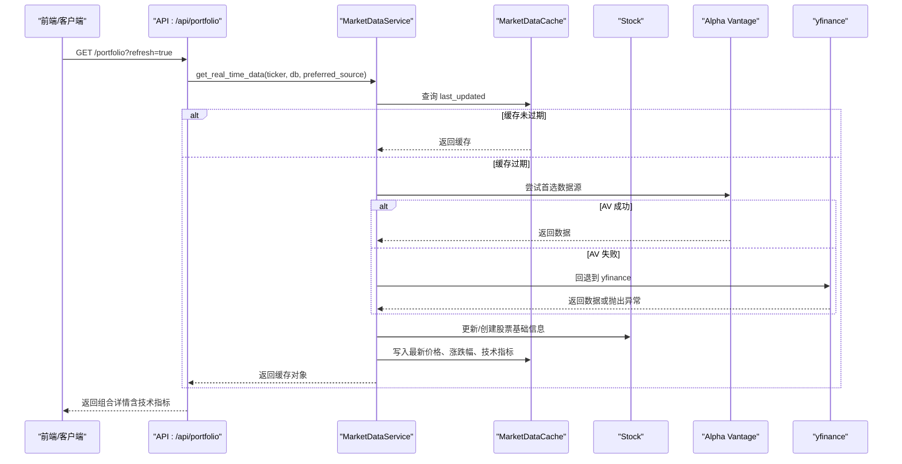
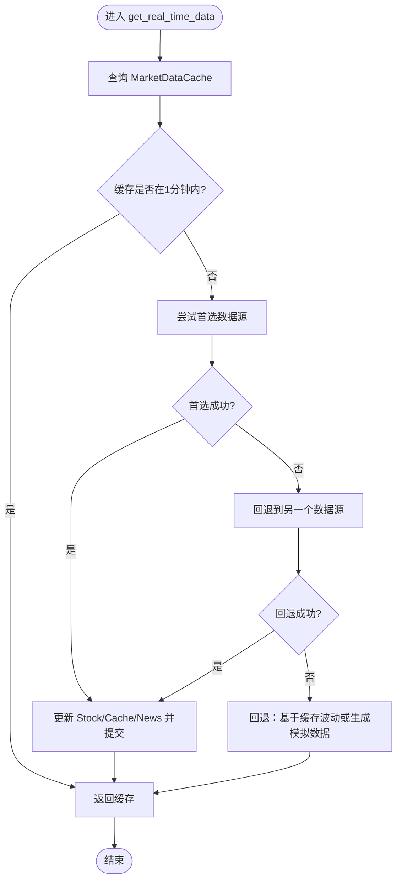
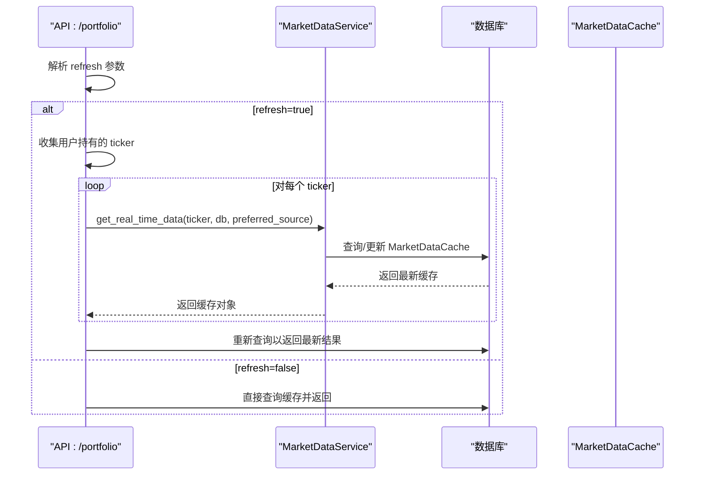
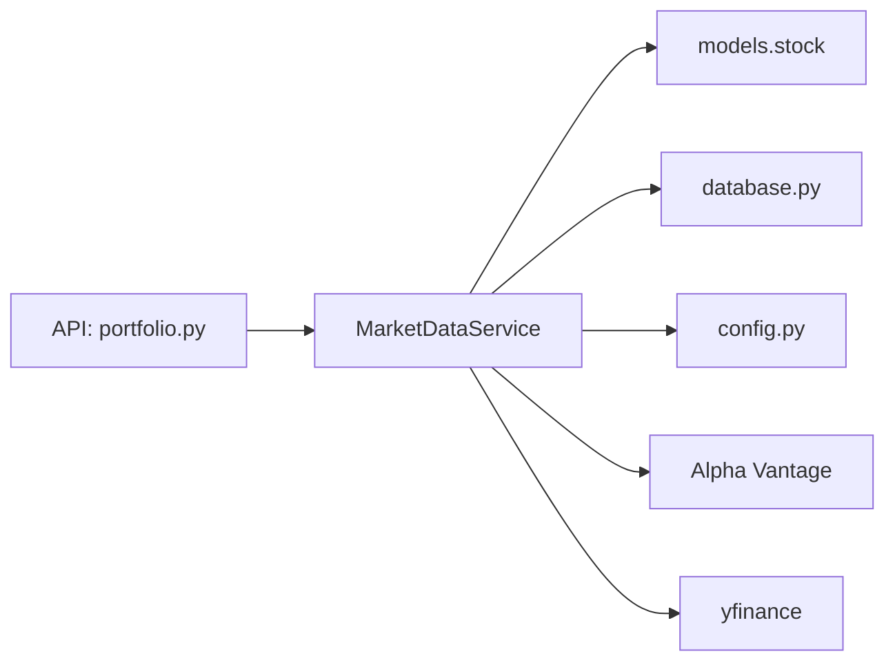
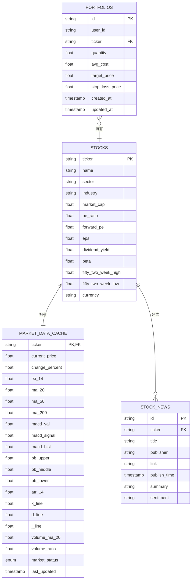

# 实时数据同步

<cite>
**本文引用的文件**
- [backend/app/services/market_data.py](file://backend/app/services/market_data.py)
- [backend/app/models/stock.py](file://backend/app/models/stock.py)
- [backend/app/models/portfolio.py](file://backend/app/models/portfolio.py)
- [backend/app/api/portfolio.py](file://backend/app/api/portfolio.py)
- [backend/app/core/config.py](file://backend/app/core/config.py)
- [backend/app/core/database.py](file://backend/app/core/database.py)
- [backend/scripts/data_collector.py](file://backend/scripts/data_collector.py)
- [backend/scripts/test_batch_collection.py](file://backend/scripts/test_batch_collection.py)
- [doc/Database Schema & Data Flow Specification.md](file://doc/Database Schema & Data Flow Specification.md)
</cite>

## 目录
1. [简介](#简介)
2. [项目结构](#项目结构)
3. [核心组件](#核心组件)
4. [架构总览](#架构总览)
5. [详细组件分析](#详细组件分析)
6. [依赖关系分析](#依赖关系分析)
7. [性能考量](#性能考量)
8. [故障排查指南](#故障排查指南)
9. [结论](#结论)
10. [附录](#附录)

## 简介
本文件围绕实时数据同步功能进行系统化文档化，重点解释 MarketDataService 的实现机制与数据获取策略（多数据源与负载均衡）、缓存机制（更新策略与过期时间）、批量数据获取与并发处理（异步与错误重试）、刷新触发条件与手动刷新、性能优化（查询合并与网络请求优化），以及数据一致性与并发控制的实现细节。文档同时结合数据库模型与 API 层，给出端到端的数据流图与关键流程图。

## 项目结构
后端采用 FastAPI + SQLAlchemy Async 架构，实时数据同步主要由以下模块协同完成：
- 服务层：MarketDataService 提供统一的实时数据获取与缓存更新能力
- 模型层：Stock、MarketDataCache、StockNews 等 ORM 模型定义数据结构与关系
- API 层：portfolio 路由提供手动刷新与批量读取接口
- 工具脚本：data_collector 与 test_batch_collection 提供后台批量采集与测试验证
- 配置与数据库：配置外部 API 密钥与代理，数据库连接与会话管理

图表来源
- [backend/app/api/portfolio.py](file://backend/app/api/portfolio.py#L143-L174)
- [backend/app/services/market_data.py](file://backend/app/services/market_data.py#L13-L170)
- [backend/app/models/stock.py](file://backend/app/models/stock.py#L13-L84)
- [backend/app/core/config.py](file://backend/app/core/config.py#L4-L17)
- [backend/app/core/database.py](file://backend/app/core/database.py#L5-L23)

章节来源
- [backend/app/api/portfolio.py](file://backend/app/api/portfolio.py#L143-L174)
- [backend/app/services/market_data.py](file://backend/app/services/market_data.py#L13-L170)
- [backend/app/models/stock.py](file://backend/app/models/stock.py#L13-L84)
- [backend/app/core/config.py](file://backend/app/core/config.py#L4-L17)
- [backend/app/core/database.py](file://backend/app/core/database.py#L5-L23)

## 核心组件
- MarketDataService：负责缓存检查、多数据源获取、技术指标计算、缓存更新与新闻入库；支持 Alpha Vantage 与 yfinance，并内置回退与模拟数据生成。
- Stock/MarketDataCache/StockNews：定义股票基础信息、行情缓存与新闻实体及其关系。
- portfolio API：提供组合查询与手动刷新接口，支持按用户偏好数据源顺序尝试。
- data_collector/test_batch_collection：后台批量采集与测试脚本，演示批量数据获取与延迟控制。

章节来源
- [backend/app/services/market_data.py](file://backend/app/services/market_data.py#L13-L170)
- [backend/app/models/stock.py](file://backend/app/models/stock.py#L13-L84)
- [backend/app/api/portfolio.py](file://backend/app/api/portfolio.py#L143-L174)
- [backend/scripts/data_collector.py](file://backend/scripts/data_collector.py#L16-L56)
- [backend/scripts/test_batch_collection.py](file://backend/scripts/test_batch_collection.py#L16-L83)

## 架构总览
实时数据同步的关键路径如下：
- 前端或 API 请求触发 portfolio 查询
- API 层根据是否需要刷新，调用 MarketDataService 获取/更新缓存
- MarketDataService 先查缓存，若过期则按优先级尝试数据源，计算技术指标并写入缓存
- 缓存更新后，API 层返回组合详情（含价格、涨跌幅、技术指标）

图表来源
- [backend/app/api/portfolio.py](file://backend/app/api/portfolio.py#L143-L174)
- [backend/app/services/market_data.py](file://backend/app/services/market_data.py#L13-L170)

## 详细组件分析

### MarketDataService 实现机制与数据获取策略
- 缓存检查与过期判定
  - 通过查询 MarketDataCache.last_updated 判断是否在 1 分钟有效期内
  - 若未过期，直接返回缓存对象
- 多数据源与负载均衡
  - 支持 Alpha Vantage 与 yfinance，可通过 preferred_source 控制首选源
  - 优先尝试首选源，失败则回退到另一个源
  - 当首选源可用但数据不完整时，仍可回退获取补充数据
- 技术指标计算
  - 基于 yfinance 历史数据计算 RSI、MACD、布林带、ATR、KDJ、成交量相关指标
  - 计算窗口满足算法需求（如 ATR 至少 14 日、MACD 至少 26 日）
- 缓存更新与回退策略
  - 更新 MarketDataCache 字段（当前价、涨跌幅、技术指标、市场状态、更新时间）
  - 若外部数据源均失败，使用已有缓存进行小幅波动回填，或生成半真实模拟数据作为降级
- 新闻入库
  - 仅在 yfinance 数据源下更新 StockNews，使用 SQLite upsert 避免重复

图表来源
- [backend/app/services/market_data.py](file://backend/app/services/market_data.py#L13-L170)

章节来源
- [backend/app/services/market_data.py](file://backend/app/services/market_data.py#L13-L170)

### 数据缓存机制（更新策略与过期时间）
- 过期时间：缓存有效期为 1 分钟（若缓存存在且未超过 1 分钟，则直接返回）
- 更新策略：
  - 首次获取：若缓存不存在，确保 Stock 存在并创建 MarketDataCache
  - 基础信息更新：当数据包含“基本面”字段时，更新 Stock 的行业、市值、PE 等字段
  - 技术指标更新：按数据源返回字段写入对应缓存列
  - 市场状态：默认 CLOSED，若获取到数据则标记为 OPEN
  - 最终提交：commit 并 refresh 返回最新缓存对象
- 新闻更新：仅在 yfinance 数据源下写入 StockNews，使用 upsert 避免重复

章节来源
- [backend/app/services/market_data.py](file://backend/app/services/market_data.py#L16-L170)
- [doc/Database Schema & Data Flow Specification.md](file://doc/Database Schema & Data Flow Specification.md#L48-L60)

### 批量数据获取与并发处理（异步与错误重试）
- 批量采集
  - data_collector：按用户组合中的股票逐个采集，强制每只股票采集后等待 60±5 秒，避免触发 yfinance 限流
  - test_batch_collection：按缓存 last_updated 最早的若干条记录进行批量采集，用于测试与验证
- 并发与异步
  - API 层在 refresh 场景下按 ticker 顺序串行更新，避免 SQLite 会话并发问题
  - MarketDataService 使用线程池执行阻塞式 yfinance 调用，并配合超时控制
- 错误重试与限流
  - yfinance 对 429/Too Many Requests 采用指数退避 + 随机抖动
  - 非 429 错误在最大重试次数内进行短暂等待后重试
  - Alpha Vantage 在达到配额时抛出明确异常

章节来源
- [backend/scripts/data_collector.py](file://backend/scripts/data_collector.py#L16-L56)
- [backend/scripts/test_batch_collection.py](file://backend/scripts/test_batch_collection.py#L16-L83)
- [backend/app/api/portfolio.py](file://backend/app/api/portfolio.py#L162-L170)
- [backend/app/services/market_data.py](file://backend/app/services/market_data.py#L39-L47)
- [backend/app/services/market_data.py](file://backend/app/services/market_data.py#L173-L318)
- [backend/app/services/market_data.py](file://backend/app/services/market_data.py#L321-L369)

### 数据刷新触发条件与手动刷新
- 触发条件
  - API 层在 GET /portfolio?refresh=true 时触发刷新
  - 新增组合项时，若缓存缺失或技术指标不完整，后台异步触发一次获取
- 手动刷新流程
  - API 层收集用户持有的所有 ticker
  - 依次调用 MarketDataService.get_real_time_data，按用户偏好的数据源顺序尝试
  - 如使用 yfinance，附加 1 秒延时以降低 429 风险
  - 刷新完成后重新查询并返回最新数据

图表来源
- [backend/app/api/portfolio.py](file://backend/app/api/portfolio.py#L143-L174)
- [backend/app/services/market_data.py](file://backend/app/services/market_data.py#L13-L170)

章节来源
- [backend/app/api/portfolio.py](file://backend/app/api/portfolio.py#L143-L174)
- [backend/app/services/market_data.py](file://backend/app/services/market_data.py#L13-L170)

### 数据一致性保证与并发控制
- 会话与事务
  - 使用 SQLAlchemy AsyncSession，按需开启/关闭，确保单请求内的一致性
  - 在更新 Stock 与 Cache 前后进行 commit 与 refresh，保证可见性
- 关系与约束
  - MarketDataCache.ticker 与 Stock.ticker 为外键关系，确保数据完整性
  - Portfolio 与 Stock 为外键关联，避免悬挂引用
- 并发控制
  - 批量刷新时按 ticker 顺序串行更新，避免 SQLite 会话并发冲突
  - 线程池执行外部 API 调用，避免阻塞事件循环

章节来源
- [backend/app/core/database.py](file://backend/app/core/database.py#L21-L23)
- [backend/app/models/stock.py](file://backend/app/models/stock.py#L33-L67)
- [backend/app/models/portfolio.py](file://backend/app/models/portfolio.py#L7-L23)
- [backend/app/api/portfolio.py](file://backend/app/api/portfolio.py#L162-L170)

## 依赖关系分析
- 组件耦合
  - MarketDataService 依赖配置（API Key、代理）与数据库会话
  - API 层依赖 MarketDataService 与数据库会话
  - 模型层定义数据结构与关系，被服务层与 API 层共同使用
- 外部依赖
  - Alpha Vantage 与 yfinance 作为数据源，受网络与配额限制
  - SQLite 作为本地存储，注意并发与事务特性

图表来源
- [backend/app/api/portfolio.py](file://backend/app/api/portfolio.py#L1-L297)
- [backend/app/services/market_data.py](file://backend/app/services/market_data.py#L1-L370)
- [backend/app/models/stock.py](file://backend/app/models/stock.py#L1-L84)
- [backend/app/core/database.py](file://backend/app/core/database.py#L1-L24)
- [backend/app/core/config.py](file://backend/app/core/config.py#L1-L24)

章节来源
- [backend/app/api/portfolio.py](file://backend/app/api/portfolio.py#L1-L297)
- [backend/app/services/market_data.py](file://backend/app/services/market_data.py#L1-L370)
- [backend/app/models/stock.py](file://backend/app/models/stock.py#L1-L84)
- [backend/app/core/database.py](file://backend/app/core/database.py#L1-L24)
- [backend/app/core/config.py](file://backend/app/core/config.py#L1-L24)

## 性能考量
- 查询合并与缓存命中
  - 1 分钟缓存窗口减少外部 API 调用频率，显著降低网络与计算开销
  - API 层一次性 JOIN 查询组合、缓存与基础信息，避免 N+1 查询
- 网络请求优化
  - 优先使用首选数据源，失败快速回退
  - yfinance 采用超时控制与指数退避重试，降低 429 风险
  - 批量采集脚本强制每只股票间隔 60±5 秒，避免触发限流
- 计算优化
  - 技术指标计算基于历史数据滚动窗口，尽量复用中间变量
  - 仅在必要时计算复杂指标（如 ATR、RSI、MACD、KDJ），并在数据不足时不写入空值

章节来源
- [doc/Database Schema & Data Flow Specification.md](file://doc/Database Schema & Data Flow Specification.md#L48-L60)
- [backend/app/api/portfolio.py](file://backend/app/api/portfolio.py#L151-L174)
- [backend/app/services/market_data.py](file://backend/app/services/market_data.py#L39-L47)
- [backend/app/services/market_data.py](file://backend/app/services/market_data.py#L173-L318)
- [backend/scripts/data_collector.py](file://backend/scripts/data_collector.py#L18-L50)

## 故障排查指南
- 常见问题与定位
  - Alpha Vantage 配额耗尽：抛出明确异常，检查配置中的 API Key 与代理设置
  - yfinance 429/限流：启用指数退避与随机抖动，适当延长采集间隔
  - 数据源均失败：系统自动回退到缓存波动或模拟数据，确认缓存是否过期
  - SQLite 并发冲突：批量刷新时按顺序串行更新，避免并发写入
- 排查步骤
  - 检查配置：DATABASE_URL、ALPHA_VANTAGE_API_KEY、HTTP_PROXY
  - 查看日志：关注 MarketDataService 的打印输出与异常堆栈
  - 验证缓存：确认 MarketDataCache.last_updated 是否符合预期
  - 测试脚本：使用 test_batch_collection 验证指标计算与入库流程

章节来源
- [backend/app/services/market_data.py](file://backend/app/services/market_data.py#L321-L369)
- [backend/app/services/market_data.py](file://backend/app/services/market_data.py#L305-L318)
- [backend/app/api/portfolio.py](file://backend/app/api/portfolio.py#L162-L170)
- [backend/app/core/config.py](file://backend/app/core/config.py#L13-L17)
- [backend/scripts/test_batch_collection.py](file://backend/scripts/test_batch_collection.py#L16-L83)

## 结论
本系统通过“缓存优先 + 多数据源回退 + 指数退避重试”的策略，在保证数据新鲜度的同时，有效规避外部 API 的限流与错误影响。API 层与服务层职责清晰，模型层关系明确，配合批量采集脚本与测试工具，形成从数据采集到展示的完整闭环。建议在生产环境中进一步引入队列与分布式锁以增强高并发下的稳定性，并考虑对热点 ticker 建立更细粒度的缓存与预热策略。

## 附录
- 数据模型关系图

图表来源
- [backend/app/models/stock.py](file://backend/app/models/stock.py#L13-L84)
- [backend/app/models/portfolio.py](file://backend/app/models/portfolio.py#L7-L23)