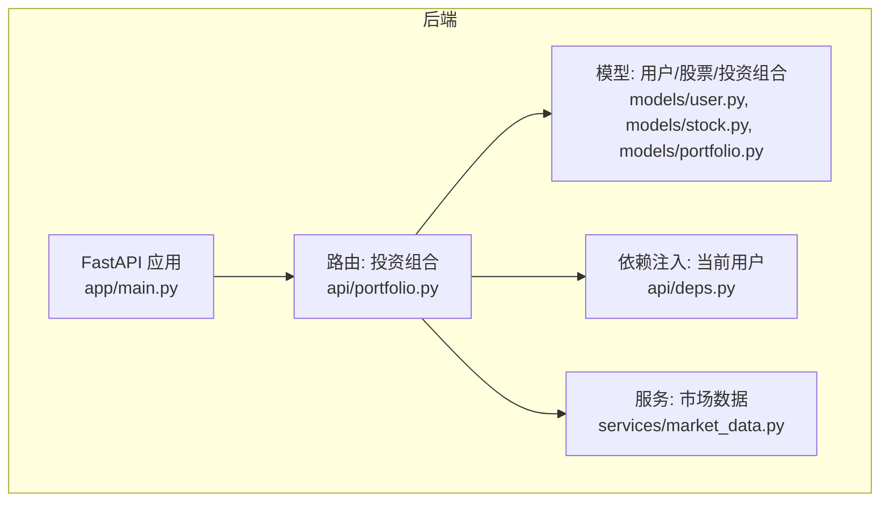
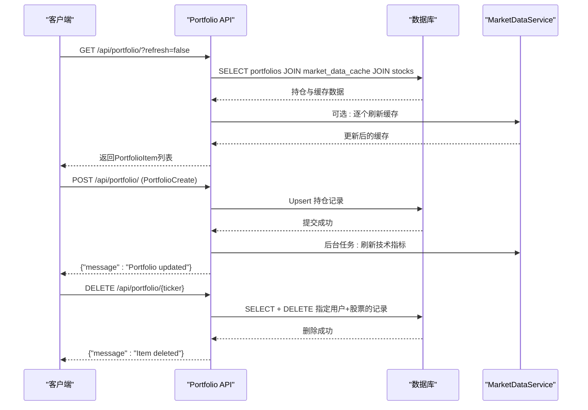
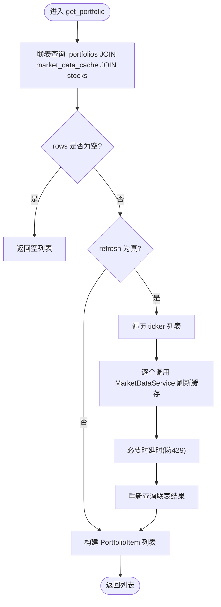
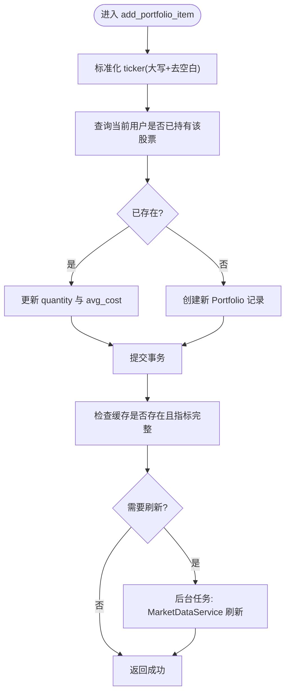
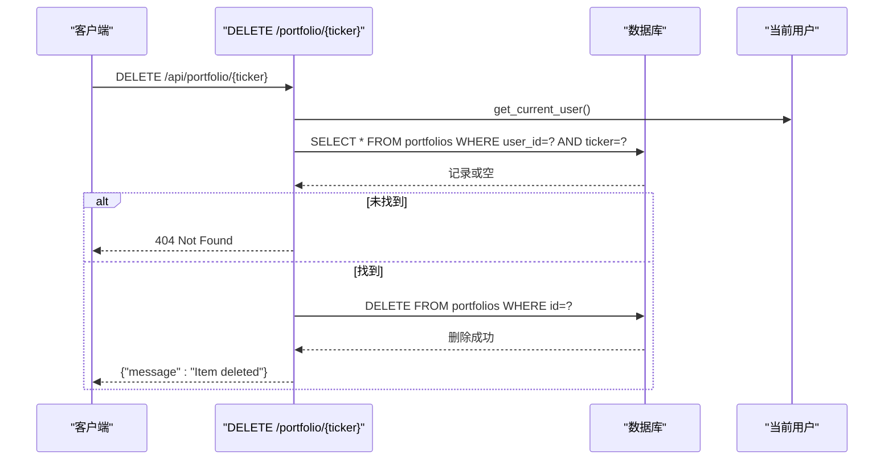
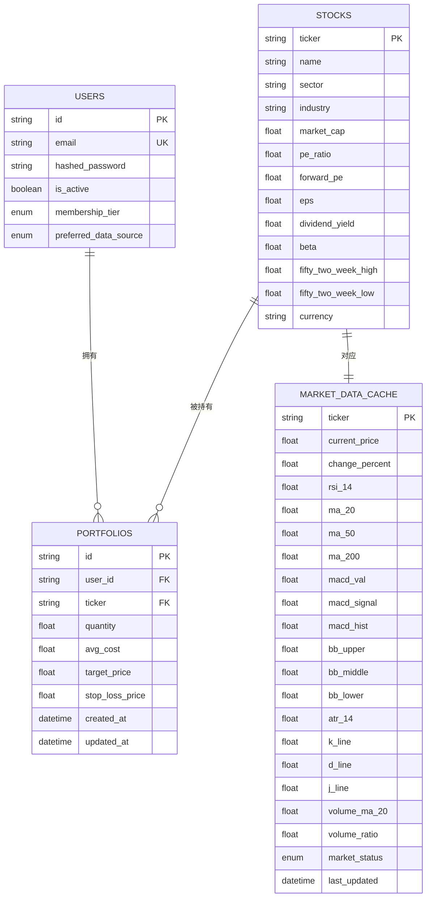
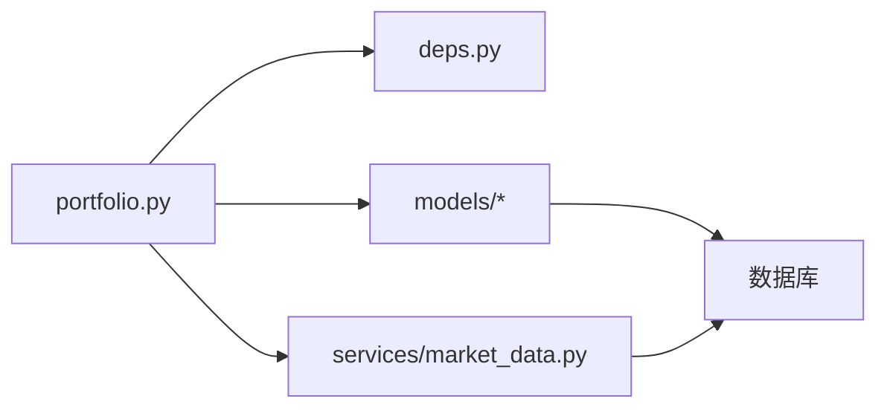

# 投资组合CRUD操作

<cite>
**本文引用的文件**
- [backend/app/api/portfolio.py](file://backend/app/api/portfolio.py)
- [backend/app/models/portfolio.py](file://backend/app/models/portfolio.py)
- [backend/app/models/stock.py](file://backend/app/models/stock.py)
- [backend/app/models/user.py](file://backend/app/models/user.py)
- [backend/app/api/deps.py](file://backend/app/api/deps.py)
- [backend/app/services/market_data.py](file://backend/app/services/market_data.py)
- [backend/app/main.py](file://backend/app/main.py)
- [doc/Database Schema & Data Flow Specification.md](file://doc/Database Schema & Data Flow Specification.md)
- [doc/PRD.md](file://doc/PRD.md)
</cite>

## 目录
1. [简介](#简介)
2. [项目结构](#项目结构)
3. [核心组件](#核心组件)
4. [架构总览](#架构总览)
5. [详细组件分析](#详细组件分析)
6. [依赖关系分析](#依赖关系分析)
7. [性能考量](#性能考量)
8. [故障排查指南](#故障排查指南)
9. [结论](#结论)
10. [附录](#附录)

## 简介
本文件面向投资组合CRUD操作，系统性说明创建、读取、更新与删除的API设计与实现，涵盖PortfolioCreate模型的数据校验与业务约束、添加股票时的去重与更新策略（数量与成本价）、删除操作的权限验证与数据完整性保障、批量查询优化与数据库事务处理，并提供完整的端点说明、请求参数、响应格式与错误码，以及实际使用场景与代码示例路径。

## 项目结构
后端采用FastAPI + SQLAlchemy异步ORM，路由集中在/api/portfolio.py，模型位于/app/models，服务层封装市场数据获取逻辑。主应用入口在/app/main.py中注册路由。

图表来源
- [backend/app/main.py](file://backend/app/main.py#L24-L29)
- [backend/app/api/portfolio.py](file://backend/app/api/portfolio.py#L1-L297)
- [backend/app/models/user.py](file://backend/app/models/user.py#L15-L31)
- [backend/app/models/stock.py](file://backend/app/models/stock.py#L13-L85)
- [backend/app/models/portfolio.py](file://backend/app/models/portfolio.py#L7-L26)
- [backend/app/api/deps.py](file://backend/app/api/deps.py#L17-L44)
- [backend/app/services/market_data.py](file://backend/app/services/market_data.py#L13-L170)

章节来源
- [backend/app/main.py](file://backend/app/main.py#L24-L29)

## 核心组件
- 投资组合API路由：提供搜索、读取、新增、删除等端点，统一前缀/api/portfolio。
- Portfolio模型：用户与股票的一对多持仓记录，唯一约束(user_id, ticker)确保每用户每股票仅一条记录。
- Stock与MarketDataCache模型：标准化股票基础信息与缓存的技术指标，支持快速读取与计算。
- MarketDataService：负责实时数据获取、缓存更新与技术指标计算，具备智能回退与限流策略。
- 依赖注入与认证：通过OAuth2 Bearer Token获取当前用户，确保CRUD操作的权限控制。

章节来源
- [backend/app/api/portfolio.py](file://backend/app/api/portfolio.py#L13-L297)
- [backend/app/models/portfolio.py](file://backend/app/models/portfolio.py#L7-L26)
- [backend/app/models/stock.py](file://backend/app/models/stock.py#L13-L85)
- [backend/app/services/market_data.py](file://backend/app/services/market_data.py#L13-L170)
- [backend/app/api/deps.py](file://backend/app/api/deps.py#L17-L44)

## 架构总览
投资组合CRUD围绕“用户-投资组合-股票-缓存”的关系展开，读取端点通过一次联表查询批量返回所有持仓项及其缓存数据；写入端点在存在时更新数量与成本价，在不存在时创建新记录；删除端点基于用户与股票维度进行精确匹配并删除。

图表来源
- [backend/app/api/portfolio.py](file://backend/app/api/portfolio.py#L143-L296)
- [backend/app/services/market_data.py](file://backend/app/services/market_data.py#L13-L170)

## 详细组件分析

### 1) 读取：GET /api/portfolio/
- 功能：返回当前用户的全部投资组合项，支持可选刷新。
- 批量查询优化：一次性联表查询，避免N+1问题；若refresh=true，则按ticker顺序刷新缓存后再返回。
- 数据完整性：通过外连接获取缓存与股票基础信息，缺失字段以空值或默认值呈现。
- 计算逻辑：根据缓存现价与持仓数量计算市值、浮动盈亏与收益百分比；技术指标与基本面字段来自缓存与股票表。

图表来源
- [backend/app/api/portfolio.py](file://backend/app/api/portfolio.py#L143-L224)
- [backend/app/services/market_data.py](file://backend/app/services/market_data.py#L13-L170)

章节来源
- [backend/app/api/portfolio.py](file://backend/app/api/portfolio.py#L143-L224)

### 2) 创建：POST /api/portfolio/
- 请求体：PortfolioCreate(ticker, quantity, avg_cost)
- 去重与更新策略：
  - 若同一用户已持有该股票，则更新数量与平均成本价；
  - 若不存在，则创建新的持仓记录。
- 数据一致性：
  - 使用数据库事务提交，确保写入原子性；
  - 新增股票时，若缓存缺失或技术指标不完整，启动后台任务刷新缓存，不阻塞响应。
- 业务约束：
  - Portfolio模型对(user_id, ticker)有唯一约束，避免重复持仓；
  - 字段类型为非负浮点数，具体数值范围由上层校验与数据库约束共同保证。

图表来源
- [backend/app/api/portfolio.py](file://backend/app/api/portfolio.py#L231-L271)
- [backend/app/models/portfolio.py](file://backend/app/models/portfolio.py#L21-L23)
- [backend/app/services/market_data.py](file://backend/app/services/market_data.py#L13-L170)

章节来源
- [backend/app/api/portfolio.py](file://backend/app/api/portfolio.py#L226-L271)
- [backend/app/models/portfolio.py](file://backend/app/models/portfolio.py#L21-L23)

### 3) 删除：DELETE /api/portfolio/{ticker}
- 权限验证：通过依赖注入获取当前用户，限定只能删除属于自己的持仓。
- 数据完整性：先查询再删除，若不存在则返回404；删除成功后立即提交事务。
- 并发安全：删除操作在单条记录上执行，避免跨用户误删。

图表来源
- [backend/app/api/portfolio.py](file://backend/app/api/portfolio.py#L281-L296)
- [backend/app/api/deps.py](file://backend/app/api/deps.py#L17-L44)

章节来源
- [backend/app/api/portfolio.py](file://backend/app/api/portfolio.py#L281-L296)
- [backend/app/api/deps.py](file://backend/app/api/deps.py#L17-L44)

### 4) 搜索：GET /api/portfolio/search
- 支持本地与远程（可选）搜索，优先本地匹配，无精确匹配时可调用外部数据源快速校验并写入本地缓存。
- 返回格式：SearchResult(ticker, name)列表。

章节来源
- [backend/app/api/portfolio.py](file://backend/app/api/portfolio.py#L68-L140)

### 5) PortfolioCreate 模型与数据验证
- 字段定义：ticker、quantity、avg_cost。
- 校验规则：
  - ticker需为字符串，统一转为大写并去除空白；
  - quantity与avg_cost为浮点数，应为正数（由上层Pydantic与数据库约束共同保证）；
  - Portfolio模型唯一约束(user_id, ticker)，避免重复。
- 业务约束：
  - 一个用户对同一股票仅能有一条持仓记录；
  - 若更新已有记录，数量与成本价会被替换为请求体中的值。

章节来源
- [backend/app/api/portfolio.py](file://backend/app/api/portfolio.py#L226-L230)
- [backend/app/models/portfolio.py](file://backend/app/models/portfolio.py#L21-L23)

### 6) 数据模型与关系

图表来源
- [backend/app/models/user.py](file://backend/app/models/user.py#L15-L31)
- [backend/app/models/stock.py](file://backend/app/models/stock.py#L13-L85)
- [backend/app/models/portfolio.py](file://backend/app/models/portfolio.py#L7-L26)

章节来源
- [backend/app/models/user.py](file://backend/app/models/user.py#L15-L31)
- [backend/app/models/stock.py](file://backend/app/models/stock.py#L13-L85)
- [backend/app/models/portfolio.py](file://backend/app/models/portfolio.py#L7-L26)

### 7) 事务与并发控制
- 写入操作（新增/更新）在单次请求内完成数据库提交，保证原子性。
- 读取端点通过一次联表查询返回，避免多次往返数据库。
- 刷新缓存时对SQLite采用顺序刷新并添加延时，降低会话并发冲突概率。

章节来源
- [backend/app/api/portfolio.py](file://backend/app/api/portfolio.py#L162-L174)
- [backend/app/services/market_data.py](file://backend/app/services/market_data.py#L22-L23)

### 8) 权限验证与鉴权
- 所有受保护端点均依赖OAuth2 Bearer Token，通过依赖函数解析并校验JWT，获取当前用户ID。
- CRUD操作均以user_id作为过滤条件，防止越权访问。

章节来源
- [backend/app/api/deps.py](file://backend/app/api/deps.py#L17-L44)
- [backend/app/api/portfolio.py](file://backend/app/api/portfolio.py#L144-L147)
- [backend/app/api/portfolio.py](file://backend/app/api/portfolio.py#L286-L289)

### 9) 实际使用场景与示例路径
- 场景一：首次添加某股票
  - 请求：POST /api/portfolio/，Body包含ticker、quantity、avg_cost
  - 行为：创建新记录；若缓存缺失或指标不完整，后台刷新缓存
  - 示例路径：[add_portfolio_item](file://backend/app/api/portfolio.py#L231-L271)
- 场景二：更新现有持仓的数量与成本价
  - 请求：POST /api/portfolio/，Body中ticker已存在
  - 行为：更新quantity与avg_cost
  - 示例路径：[add_portfolio_item 更新分支](file://backend/app/api/portfolio.py#L245-L247)
- 场景三：批量刷新并展示
  - 请求：GET /api/portfolio/?refresh=true
  - 行为：逐个刷新缓存后返回最新数据
  - 示例路径：[get_portfolio 刷新流程](file://backend/app/api/portfolio.py#L162-L174)
- 场景四：删除某只股票
  - 请求：DELETE /api/portfolio/{ticker}
  - 行为：校验用户权限并删除
  - 示例路径：[delete_portfolio_item](file://backend/app/api/portfolio.py#L281-L296)

## 依赖关系分析
- API层依赖：
  - 依赖注入：get_current_user从JWT中提取用户ID，用于权限控制。
  - 数据库：AsyncSession用于异步查询与事务提交。
  - 市场数据服务：MarketDataService负责缓存与技术指标的获取与更新。
- 模型层依赖：
  - Portfolio与Stock/MarketDataCache通过外键关联，形成清晰的读取与写入路径。
- 服务层依赖：
  - MarketDataService内部封装了Alpha Vantage与yfinance两种数据源，具备回退与限流机制。

图表来源
- [backend/app/api/portfolio.py](file://backend/app/api/portfolio.py#L1-L297)
- [backend/app/api/deps.py](file://backend/app/api/deps.py#L17-L44)
- [backend/app/services/market_data.py](file://backend/app/services/market_data.py#L13-L170)
- [backend/app/models/portfolio.py](file://backend/app/models/portfolio.py#L7-L26)
- [backend/app/models/stock.py](file://backend/app/models/stock.py#L13-L85)

章节来源
- [backend/app/api/portfolio.py](file://backend/app/api/portfolio.py#L1-L297)
- [backend/app/api/deps.py](file://backend/app/api/deps.py#L17-L44)
- [backend/app/services/market_data.py](file://backend/app/services/market_data.py#L13-L170)
- [backend/app/models/portfolio.py](file://backend/app/models/portfolio.py#L7-L26)
- [backend/app/models/stock.py](file://backend/app/models/stock.py#L13-L85)

## 性能考量
- 批量查询：读取端点通过一次联表查询返回所有持仓，避免N+1查询。
- 缓存命中：MarketDataCache设置1分钟内不重复拉取，减少外部API压力。
- 刷新策略：refresh=true时顺序刷新并延时，降低yfinance限流风险。
- 后台刷新：新增/更新后若缓存不完整，启动后台任务刷新，不阻塞响应。
- 事务：写入操作在单次请求内提交，保证一致性与原子性。

章节来源
- [backend/app/api/portfolio.py](file://backend/app/api/portfolio.py#L151-L174)
- [backend/app/services/market_data.py](file://backend/app/services/market_data.py#L14-L23)
- [backend/app/api/portfolio.py](file://backend/app/api/portfolio.py#L266-L269)

## 故障排查指南
- 404 Not Found：删除端点在找不到记录时返回。
- 403 Forbidden：令牌无效或用户不存在时返回。
- 429 Too Many Requests：深度分析等场景可能因配额限制触发（与投资组合端点不同，但同属API层错误处理策略）。
- 缓存未命中：若新增股票后技术指标缺失，可在下一次刷新或手动触发刷新。
- 速率限制：yfinance可能返回429，服务层已内置指数退避与延时策略。

章节来源
- [backend/app/api/portfolio.py](file://backend/app/api/portfolio.py#L291-L292)
- [backend/app/api/deps.py](file://backend/app/api/deps.py#L28-L43)
- [backend/app/services/market_data.py](file://backend/app/services/market_data.py#L305-L318)

## 结论
本系统通过明确的模型约束、严格的权限控制与高效的批量查询，实现了投资组合的可靠CRUD操作。PortfolioCreate模型与唯一约束确保数据一致性；MarketDataService提供稳健的缓存与刷新能力；API端点设计简洁清晰，便于前端集成与扩展。

## 附录

### API端点一览
- GET /api/portfolio/
  - 查询参数：refresh: bool（可选，默认false）
  - 响应：List[PortfolioItem]
  - 权限：需要JWT
- POST /api/portfolio/
  - 请求体：PortfolioCreate
  - 响应：{"message": "Portfolio updated"}
  - 权限：需要JWT
- DELETE /api/portfolio/{ticker}
  - 路径参数：ticker
  - 响应：{"message": "Item deleted"}
  - 权限：需要JWT
- GET /api/portfolio/search
  - 查询参数：query: str（可选），remote: bool（可选）
  - 响应：List[SearchResult]
  - 权限：需要JWT

章节来源
- [backend/app/api/portfolio.py](file://backend/app/api/portfolio.py#L68-L140)
- [backend/app/api/portfolio.py](file://backend/app/api/portfolio.py#L143-L224)
- [backend/app/api/portfolio.py](file://backend/app/api/portfolio.py#L231-L271)
- [backend/app/api/portfolio.py](file://backend/app/api/portfolio.py#L281-L296)