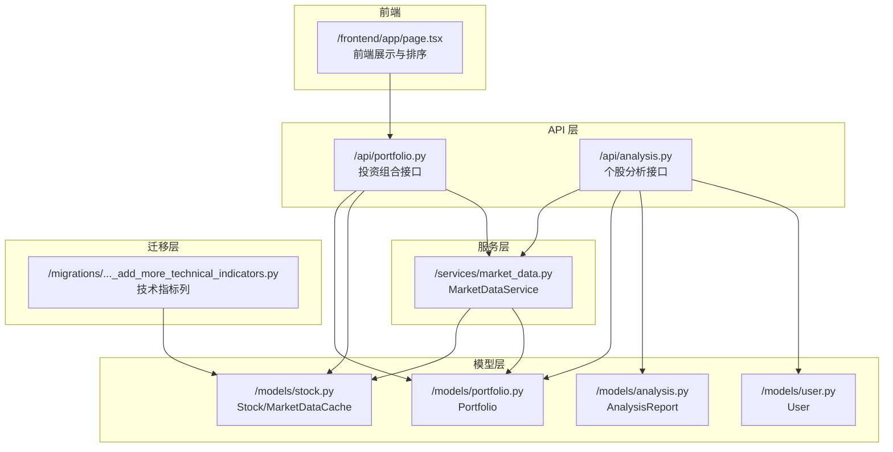
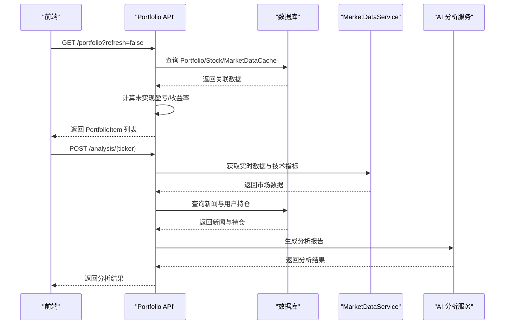
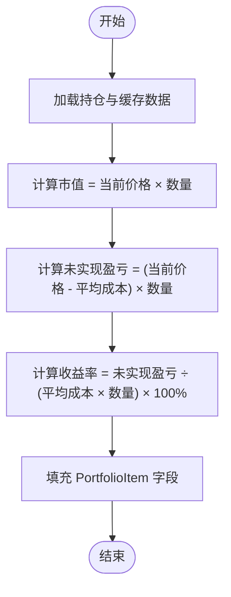
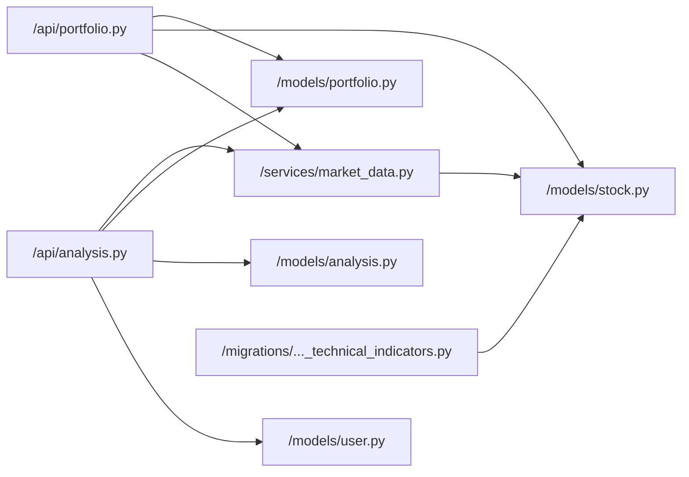

# 投资组合分析

<cite>
**本文引用的文件**
- [backend/app/api/portfolio.py](file://backend/app/api/portfolio.py)
- [backend/app/models/portfolio.py](file://backend/app/models/portfolio.py)
- [backend/app/models/stock.py](file://backend/app/models/stock.py)
- [backend/app/services/market_data.py](file://backend/app/services/market_data.py)
- [backend/migrations/versions/48d7355e90d6_add_more_technical_indicators.py](file://backend/migrations/versions/48d7355e90d6_add_more_technical_indicators.py)
- [backend/app/api/analysis.py](file://backend/app/api/analysis.py)
- [backend/app/models/analysis.py](file://backend/app/models/analysis.py)
- [backend/app/models/user.py](file://backend/app/models/user.py)
- [doc/PRD.md](file://doc/PRD.md)
- [frontend/app/page.tsx](file://frontend/app/page.tsx)
</cite>

## 目录
1. [简介](#简介)
2. [项目结构](#项目结构)
3. [核心组件](#核心组件)
4. [架构总览](#架构总览)
5. [详细组件分析](#详细组件分析)
6. [依赖关系分析](#依赖关系分析)
7. [性能考量](#性能考量)
8. [故障排查指南](#故障排查指南)
9. [结论](#结论)
10. [附录](#附录)

## 简介
本文件围绕投资组合分析功能进行系统化文档化，重点覆盖以下方面：
- 投资组合收益计算：未实现盈亏与收益率的计算公式与边界处理
- PortfolioItem 模型中的财务指标字段定义与计算逻辑
- 技术指标在投资组合层面的应用：移动平均线与相对强弱指数的聚合思路
- 基本面数据的整合与统计分析：市盈率、股息收益率等
- 投资组合风险评估的初步方法与指标
- 分析结果的展示格式与数据结构说明
- 实际计算示例与边界情况处理

## 项目结构
后端采用 FastAPI + SQLAlchemy 架构，前端使用 Next.js。投资组合分析涉及以下关键模块：
- API 层：提供投资组合查询、新增、删除等接口，并返回 PortfolioItem 结果集
- 模型层：定义 Portfolio、Stock、MarketDataCache 等实体及其关系
- 服务层：封装市场数据获取与技术指标计算逻辑
- 迁移层：扩展技术指标字段以支持更丰富的分析维度
- 文档与前端：PRD 描述产品需求，前端负责展示与交互

图表来源
- [backend/app/api/portfolio.py](file://backend/app/api/portfolio.py#L143-L224)
- [backend/app/models/portfolio.py](file://backend/app/models/portfolio.py#L7-L26)
- [backend/app/models/stock.py](file://backend/app/models/stock.py#L13-L67)
- [backend/app/services/market_data.py](file://backend/app/services/market_data.py#L13-L170)
- [backend/migrations/versions/48d7355e90d6_add_more_technical_indicators.py](file://backend/migrations/versions/48d7355e90d6_add_more_technical_indicators.py#L21-L32)
- [backend/app/api/analysis.py](file://backend/app/api/analysis.py#L13-L124)
- [backend/app/models/analysis.py](file://backend/app/models/analysis.py#L12-L25)
- [backend/app/models/user.py](file://backend/app/models/user.py#L15-L31)
- [frontend/app/page.tsx](file://frontend/app/page.tsx#L63-L90)

章节来源
- [backend/app/api/portfolio.py](file://backend/app/api/portfolio.py#L143-L224)
- [backend/app/models/portfolio.py](file://backend/app/models/portfolio.py#L7-L26)
- [backend/app/models/stock.py](file://backend/app/models/stock.py#L13-L67)
- [backend/app/services/market_data.py](file://backend/app/services/market_data.py#L13-L170)
- [backend/migrations/versions/48d7355e90d6_add_more_technical_indicators.py](file://backend/migrations/versions/48d7355e90d6_add_more_technical_indicators.py#L21-L32)
- [backend/app/api/analysis.py](file://backend/app/api/analysis.py#L13-L124)
- [backend/app/models/analysis.py](file://backend/app/models/analysis.py#L12-L25)
- [backend/app/models/user.py](file://backend/app/models/user.py#L15-L31)
- [frontend/app/page.tsx](file://frontend/app/page.tsx#L63-L90)

## 核心组件
- 投资组合项模型 PortfolioItem：包含基础财务指标、技术指标以及未实现盈亏与收益率等字段
- 投资组合实体 Portfolio：记录用户的持仓数量与平均成本
- 股票与市场数据缓存 Stock/MarketDataCache：提供基本面与技术指标数据源
- 市场数据服务 MarketDataService：负责实时数据获取与技术指标计算
- 分析报告模型 AnalysisReport：记录 AI 分析结果与情感倾向

章节来源
- [backend/app/api/portfolio.py](file://backend/app/api/portfolio.py#L15-L55)
- [backend/app/models/portfolio.py](file://backend/app/models/portfolio.py#L7-L26)
- [backend/app/models/stock.py](file://backend/app/models/stock.py#L13-L67)
- [backend/app/services/market_data.py](file://backend/app/services/market_data.py#L13-L170)
- [backend/app/models/analysis.py](file://backend/app/models/analysis.py#L12-L25)

## 架构总览
投资组合分析的端到端流程如下：
- 前端发起查询，后端通过 ORM 关联查询 Portfolio、MarketDataCache、Stock
- 若需要刷新，后端调用 MarketDataService 获取最新数据并写入缓存
- 后端根据持仓与缓存数据计算未实现盈亏与收益率，组装 PortfolioItem 返回
- 个股分析接口在获取实时数据、新闻与用户持仓后，调用 AI 生成分析报告

图表来源
- [backend/app/api/portfolio.py](file://backend/app/api/portfolio.py#L143-L224)
- [backend/app/services/market_data.py](file://backend/app/services/market_data.py#L13-L170)
- [backend/app/api/analysis.py](file://backend/app/api/analysis.py#L13-L124)

## 详细组件分析

### 投资组合收益计算与 PortfolioItem 字段
- 未实现盈亏（Unrealized P&L）：基于当前价格与平均成本差额乘以数量
- 收益率（P&L%）：基于未实现盈亏与总成本的百分比
- 市值（Market Value）：当前价格乘以数量
- 时间戳：最后更新时间

图表来源
- [backend/app/api/portfolio.py](file://backend/app/api/portfolio.py#L176-L193)

章节来源
- [backend/app/api/portfolio.py](file://backend/app/api/portfolio.py#L176-L193)

### PortfolioItem 字段定义与计算逻辑
PortfolioItem 字段分为三类：
- 基础财务指标：行业、板块、市值、市盈率、前瞻市盈率、每股收益、股息收益率、贝塔、52 周最高/最低
- 技术指标：RSI、MA20/50/200、MACD、布林带、ATR、KDJ、成交量均值与量比、涨跌幅
- 收益与时间戳：未实现盈亏、收益率、最后更新时间

这些字段由 MarketDataCache 与 Stock 提供，Portfolio API 在查询时拼装到 PortfolioItem 中。

章节来源
- [backend/app/api/portfolio.py](file://backend/app/api/portfolio.py#L15-L55)
- [backend/app/models/stock.py](file://backend/app/models/stock.py#L33-L67)
- [backend/app/models/stock.py](file://backend/app/models/stock.py#L13-L29)

### 技术指标在投资组合层面的聚合应用
- 移动平均线（MA20/50/200）：用于判断趋势方向与支撑阻力
- 相对强弱指数（RSI）：用于衡量超买/超卖状态
- MACD：用于识别动量变化与交叉信号
- 布林带（BB）：用于衡量波动与突破
- ATR：用于衡量波动幅度
- KDJ：用于短期超买超卖判断
- 成交量均值与量比：用于衡量交易热度

聚合思路（概念性说明）：
- 投资组合层面的指标聚合可按权重（市值占比）对个股的技术指标进行加权平均，或统计满足条件的个股数量（例如 RSI 超卖/超买的个数）
- 由于当前代码未实现聚合函数，可在 API 层二次加工返回聚合结果，或在服务层新增聚合工具函数

章节来源
- [backend/app/services/market_data.py](file://backend/app/services/market_data.py#L237-L291)
- [backend/app/models/stock.py](file://backend/app/models/stock.py#L40-L62)
- [doc/PRD.md](file://doc/PRD.md#L58-L63)

### 基本面数据的整合与统计分析
- 基本面数据来源于 MarketDataCache（部分字段来自 yfinance/Alpha Vantage 的 fundamental 字段）
- 支持的指标：市盈率（PE）、前瞻市盈率（Forward PE）、每股收益（EPS）、股息收益率（Dividend Yield）、贝塔（Beta）、52 周最高/最低、市值（Market Cap）、行业/板块（Sector/Industry）

统计分析思路（概念性说明）：
- 可按行业/板块分组统计 PE、股息收益率、Beta 的均值与标准差
- 可计算各指标的分位数（如 25/50/75 分位）用于筛选
- 可结合未实现盈亏与基本面指标进行相关性分析

章节来源
- [backend/app/services/market_data.py](file://backend/app/services/market_data.py#L102-L119)
- [backend/app/models/stock.py](file://backend/app/models/stock.py#L13-L29)

### 投资组合风险评估的基本方法与指标
- 未实现盈亏与收益率：反映当前持仓的浮动损益
- 波动率（ATR）：衡量价格波动幅度
- 趋势指标（MA）：判断趋势方向
- 动量指标（RSI/MACD/KDJ）：判断超买/超卖与动量变化
- 交易热度（量比）：反映短期活跃度

风险评估思路（概念性说明）：
- 使用 ATR 作为波动率代理，结合 Beta 与行业均值对比
- 通过技术指标组合（如 RSI 超卖+MACD底背离）识别潜在回调风险
- 通过量比异常放大与重大事件（新闻）叠加评估短期冲击风险

章节来源
- [backend/app/services/market_data.py](file://backend/app/services/market_data.py#L263-L291)
- [backend/app/models/stock.py](file://backend/app/models/stock.py#L40-L62)
- [backend/app/api/analysis.py](file://backend/app/api/analysis.py#L90-L107)

### 分析结果的展示格式与数据结构
- 投资组合列表返回 PortfolioItem 列表，字段包含价格、涨跌幅、技术指标、基本面指标、未实现盈亏与收益率
- 个股分析返回 AI 生成的 Markdown 文本与情感倾向（预留字段）
- 前端支持按不同字段排序与过滤

章节来源
- [backend/app/api/portfolio.py](file://backend/app/api/portfolio.py#L143-L224)
- [backend/app/api/analysis.py](file://backend/app/api/analysis.py#L119-L123)
- [frontend/app/page.tsx](file://frontend/app/page.tsx#L63-L90)

### 实际计算示例与边界情况处理
- 示例场景：某只股票持仓 100 股，平均成本 100 元，当前价格 110 元
  - 市值 = 110 × 100 = 11000 元
  - 未实现盈亏 = (110 - 100) × 100 = 1000 元
  - 收益率 = 1000 ÷ (100 × 100) × 100% = 10%
- 边界情况：
  - 平均成本为 0：收益率按 0 处理，避免除零
  - 缓存缺失：当前价格为 0，未实现盈亏与市值也为 0
  - 技术指标缺失：前端显示“-”，后端返回 None

章节来源
- [backend/app/api/portfolio.py](file://backend/app/api/portfolio.py#L176-L193)
- [backend/app/api/portfolio.py](file://backend/app/api/portfolio.py#L194-L223)

## 依赖关系分析
- Portfolio API 依赖 Portfolio、Stock、MarketDataCache 三张表的关联查询
- MarketDataService 负责数据获取与技术指标计算，写入 MarketDataCache
- 分析接口依赖 MarketDataService、StockNews、Portfolio、AnalysisReport
- 前端依赖 Portfolio API 返回的数据结构进行展示与排序

图表来源
- [backend/app/api/portfolio.py](file://backend/app/api/portfolio.py#L143-L224)
- [backend/app/models/portfolio.py](file://backend/app/models/portfolio.py#L7-L26)
- [backend/app/models/stock.py](file://backend/app/models/stock.py#L13-L67)
- [backend/app/services/market_data.py](file://backend/app/services/market_data.py#L13-L170)
- [backend/app/api/analysis.py](file://backend/app/api/analysis.py#L13-L124)
- [backend/app/models/analysis.py](file://backend/app/models/analysis.py#L12-L25)
- [backend/app/models/user.py](file://backend/app/models/user.py#L15-L31)
- [backend/migrations/versions/48d7355e90d6_add_more_technical_indicators.py](file://backend/migrations/versions/48d7355e90d6_add_more_technical_indicators.py#L21-L32)

章节来源
- [backend/app/api/portfolio.py](file://backend/app/api/portfolio.py#L143-L224)
- [backend/app/models/portfolio.py](file://backend/app/models/portfolio.py#L7-L26)
- [backend/app/models/stock.py](file://backend/app/models/stock.py#L13-L67)
- [backend/app/services/market_data.py](file://backend/app/services/market_data.py#L13-L170)
- [backend/app/api/analysis.py](file://backend/app/api/analysis.py#L13-L124)
- [backend/app/models/analysis.py](file://backend/app/models/analysis.py#L12-L25)
- [backend/app/models/user.py](file://backend/app/models/user.py#L15-L31)
- [backend/migrations/versions/48d7355e90d6_add_more_technical_indicators.py](file://backend/migrations/versions/48d7355e90d6_add_more_technical_indicators.py#L21-L32)

## 性能考量
- 缓存与刷新策略：MarketDataCache 设置 1 分钟内不重复拉取，减少外部 API 压力
- 批量刷新：Portfolio 刷新时按 ticker 顺序更新，避免并发问题
- 异常回退：当外部数据源不可用时，使用模拟数据维持体验
- 前端轮询：根据页面激活状态动态控制轮询频率，降低网络压力

章节来源
- [backend/app/services/market_data.py](file://backend/app/services/market_data.py#L14-L24)
- [backend/app/api/portfolio.py](file://backend/app/api/portfolio.py#L162-L174)

## 故障排查指南
- 429 限流：yfinance 429 错误时采用指数退避重试
- 数据源切换：优先使用首选数据源，失败后回退到备用源
- 缓存一致性：刷新后重新查询以确保返回最新数据
- 无数据回退：当缓存缺失时，使用模拟数据保证接口可用性

章节来源
- [backend/app/services/market_data.py](file://backend/app/services/market_data.py#L300-L318)
- [backend/app/services/market_data.py](file://backend/app/services/market_data.py#L58-L86)
- [backend/app/api/portfolio.py](file://backend/app/api/portfolio.py#L162-L174)

## 结论
本项目已实现投资组合收益计算与丰富技术/基本面指标的整合，具备良好的扩展性。建议后续在服务层增加投资组合层面的指标聚合能力，并完善风险评估与统计分析模块，以支撑更深入的投资决策支持。

## 附录
- 技术指标字段清单与含义参见 PortfolioItem 与 MarketDataCache 定义
- 基本面字段清单参见 Stock 定义
- 产品需求与展示规范参见 PRD

章节来源
- [backend/app/api/portfolio.py](file://backend/app/api/portfolio.py#L15-L55)
- [backend/app/models/stock.py](file://backend/app/models/stock.py#L13-L67)
- [doc/PRD.md](file://doc/PRD.md#L58-L88)