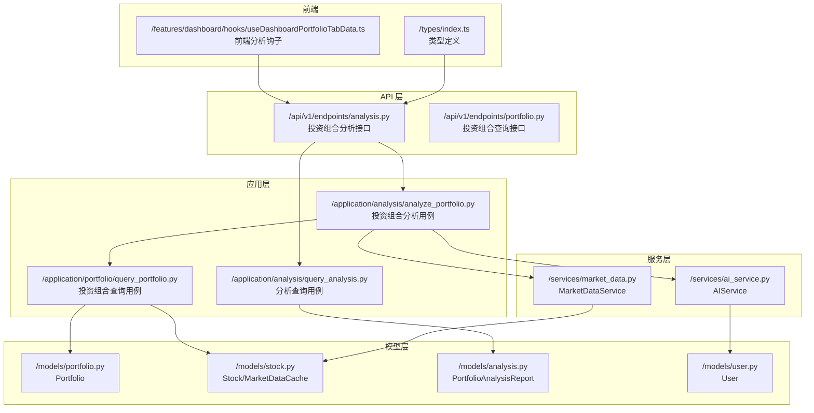
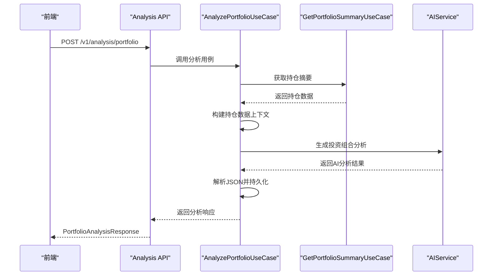
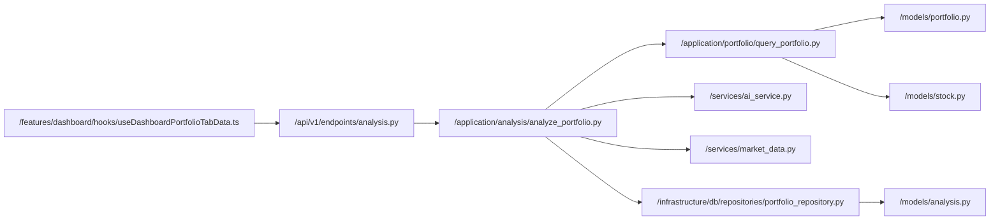

# 投资组合分析

<cite>
**本文引用的文件**
- [backend/app/api/v1/endpoints/analysis.py](file://backend/app/api/v1/endpoints/analysis.py)
- [backend/app/application/analysis/analyze_portfolio.py](file://backend/app/application/analysis/analyze_portfolio.py)
- [backend/app/application/analysis/query_analysis.py](file://backend/app/application/analysis/query_analysis.py)
- [backend/app/application/portfolio/query_portfolio.py](file://backend/app/application/portfolio/query_portfolio.py)
- [backend/app/application/portfolio/mappers.py](file://backend/app/application/portfolio/mappers.py)
- [backend/app/infrastructure/db/repositories/portfolio_repository.py](file://backend/app/infrastructure/db/repositories/portfolio_repository.py)
- [backend/app/schemas/analysis.py](file://backend/app/schemas/analysis.py)
- [backend/app/schemas/portfolio.py](file://backend/app/schemas/portfolio.py)
- [backend/app/models/analysis.py](file://backend/app/models/analysis.py)
- [backend/app/services/ai_service.py](file://backend/app/services/ai_service.py)
- [backend/app/core/prompts.py](file://backend/app/core/prompts.py)
- [frontend/features/dashboard/hooks/useDashboardPortfolioTabData.ts](file://frontend/features/dashboard/hooks/useDashboardPortfolioTabData.ts)
- [frontend/types/index.ts](file://frontend/types/index.ts)
</cite>

## 目录
1. [简介](#简介)
2. [项目结构](#项目结构)
3. [核心组件](#核心组件)
4. [架构总览](#架构总览)
5. [详细组件分析](#详细组件分析)
6. [依赖关系分析](#依赖关系分析)
7. [性能考量](#性能考量)
8. [故障排查指南](#故障排查指南)
9. [结论](#结论)
10. [附录](#附录)

## 简介
本文件围绕投资组合分析功能进行系统化文档化，重点覆盖以下方面：
- 投资组合收益计算：未实现盈亏与收益率的计算公式与边界处理
- PortfolioItem 模型中的财务指标字段定义与计算逻辑
- 技术指标在投资组合层面的应用：移动平均线与相对强弱指数的聚合思路
- 基本面数据的整合与统计分析：市盈率、股息收益率等
- 投资组合风险评估的初步方法与指标
- 分析结果的展示格式与数据结构说明
- 实际计算示例与边界情况处理

## 项目结构
后端采用 FastAPI + SQLAlchemy 架构，前端使用 Next.js。投资组合分析涉及以下关键模块：
- API 层：提供投资组合查询、新增、删除等接口，并返回 PortfolioItem 结果集
- 模型层：定义 Portfolio、Stock、MarketDataCache 等实体及其关系
- 服务层：封装市场数据获取与技术指标计算逻辑
- 应用层：封装投资组合分析用例，处理 AI 分析流程
- 前端：负责展示与交互

**图表来源**
- [backend/app/api/v1/endpoints/analysis.py:30-42](file://backend/app/api/v1/endpoints/analysis.py#L30-L42)
- [backend/app/application/analysis/analyze_portfolio.py:23-63](file://backend/app/application/analysis/analyze_portfolio.py#L23-L63)
- [backend/app/application/portfolio/query_portfolio.py:16-61](file://backend/app/application/portfolio/query_portfolio.py#L16-L61)
- [backend/app/services/ai_service.py:563-590](file://backend/app/services/ai_service.py#L563-L590)
- [frontend/features/dashboard/hooks/useDashboardPortfolioTabData.ts:11-56](file://frontend/features/dashboard/hooks/useDashboardPortfolioTabData.ts#L11-L56)

**章节来源**
- [backend/app/api/v1/endpoints/analysis.py:30-42](file://backend/app/api/v1/endpoints/analysis.py#L30-L42)
- [backend/app/application/analysis/analyze_portfolio.py:23-63](file://backend/app/application/analysis/analyze_portfolio.py#L23-L63)
- [backend/app/application/portfolio/query_portfolio.py:16-61](file://backend/app/application/portfolio/query_portfolio.py#L16-L61)
- [backend/app/services/ai_service.py:563-590](file://backend/app/services/ai_service.py#L563-L590)
- [frontend/features/dashboard/hooks/useDashboardPortfolioTabData.ts:11-56](file://frontend/features/dashboard/hooks/useDashboardPortfolioTabData.ts#L11-L56)

## 核心组件
- 投资组合项模型 PortfolioItem：包含基础财务指标、技术指标以及未实现盈亏与收益率等字段
- 投资组合实体 Portfolio：记录用户的持仓数量与平均成本
- 股票与市场数据缓存 Stock/MarketDataCache：提供基本面与技术指标数据源
- 市场数据服务 MarketDataService：负责实时数据获取与技术指标计算
- 投资组合分析用例 AnalyzePortfolioUseCase：封装完整的投资组合分析流程
- 投资组合分析响应模型 PortfolioAnalysisResponse：定义分析结果的数据结构

**章节来源**
- [backend/app/schemas/portfolio.py:10-69](file://backend/app/schemas/portfolio.py#L10-L69)
- [backend/app/application/portfolio/mappers.py:4-36](file://backend/app/application/portfolio/mappers.py#L4-L36)
- [backend/app/application/analysis/analyze_portfolio.py:23-63](file://backend/app/application/analysis/analyze_portfolio.py#L23-L63)
- [backend/app/schemas/analysis.py:51-62](file://backend/app/schemas/analysis.py#L51-L62)

## 架构总览
投资组合分析的端到端流程如下：
- 前端发起分析请求，后端通过 AnalyzePortfolioUseCase 获取用户持仓摘要
- 用例构建持仓数据、市场新闻上下文和宏观背景
- 调用 AIService 生成投资组合分析报告
- 解析 AI 响应并持久化到 PortfolioAnalysisReport
- 返回 PortfolioAnalysisResponse 给前端展示

**图表来源**
- [backend/app/api/v1/endpoints/analysis.py:30-42](file://backend/app/api/v1/endpoints/analysis.py#L30-L42)
- [backend/app/application/analysis/analyze_portfolio.py:29-63](file://backend/app/application/analysis/analyze_portfolio.py#L29-L63)
- [backend/app/services/ai_service.py:563-590](file://backend/app/services/ai_service.py#L563-L590)

## 详细组件分析

### 投资组合收益计算与 PortfolioItem 字段
- 未实现盈亏（Unrealized P&L）：基于当前价格与平均成本差额乘以数量
- 收益率（P&L%）：基于未实现盈亏与总成本的百分比
- 市值（Market Value）：当前价格乘以数量
- 时间戳：最后更新时间

**图表来源**
- [backend/app/application/portfolio/mappers.py:4-13](file://backend/app/application/portfolio/mappers.py#L4-L13)

**章节来源**
- [backend/app/application/portfolio/mappers.py:4-13](file://backend/app/application/portfolio/mappers.py#L4-L13)

### PortfolioItem 字段定义与计算逻辑
PortfolioItem 字段分为四类：
- 基础财务指标：行业、板块、市值、市盈率、前瞻市盈率、每股收益、股息收益率、贝塔、52 周最高/最低
- 专业量化扩展：市盈率分位数、市净率分位数、净流入
- 技术指标：RSI、MA20/50/200、MACD、布林带、ATR、KDJ、成交量均值与量比、涨跌幅
- 风险收益指标：风险收益比、支撑阻力位、ADX 指标

这些字段由 MarketDataCache 与 Stock 提供，Portfolio API 在查询时拼装到 PortfolioItem 中。

**章节来源**
- [backend/app/schemas/portfolio.py:10-69](file://backend/app/schemas/portfolio.py#L10-L69)
- [backend/app/application/portfolio/mappers.py:25-36](file://backend/app/application/portfolio/mappers.py#L25-L36)

### 技术指标在投资组合层面的聚合应用
- 移动平均线（MA20/50/200）：用于判断趋势方向与支撑阻力
- 相对强弱指数（RSI）：用于衡量超买/超卖状态
- MACD：用于识别动量变化与交叉信号
- 布林带（BB）：用于衡量波动与突破
- ATR：用于衡量波动幅度
- KDJ：用于短期超买超卖判断
- 成交量均值与量比：用于衡量交易热度

聚合思路（概念性说明）：
- 投资组合层面的指标聚合可按权重（市值占比）对个股的技术指标进行加权平均，或统计满足条件的个股数量（例如 RSI 超卖/超买的个数）
- 由于当前代码未实现聚合函数，可在 API 层二次加工返回聚合结果，或在服务层新增聚合工具函数

**章节来源**
- [backend/app/schemas/portfolio.py:38-65](file://backend/app/schemas/portfolio.py#L38-L65)
- [backend/app/application/analysis/analyze_portfolio.py:65-79](file://backend/app/application/analysis/analyze_portfolio.py#L65-L79)

### 基本面数据的整合与统计分析
- 基本面数据来源于 MarketDataCache（部分字段来自 yfinance/Alpha Vantage 的 fundamental 字段）
- 支持的指标：市盈率（PE）、前瞻市盈率（Forward PE）、每股收益（EPS）、股息收益率（Dividend Yield）、贝塔（Beta）、52 周最高/最低、市值（Market Cap）、行业/板块（Sector/Industry）

统计分析思路（概念性说明）：
- 可按行业/板块分组统计 PE、股息收益率、Beta 的均值与标准差
- 可计算各指标的分位数（如 25/50/75 分位）用于筛选
- 可结合未实现盈亏与基本面指标进行相关性分析

**章节来源**
- [backend/app/schemas/portfolio.py:21-31](file://backend/app/schemas/portfolio.py#L21-L31)
- [backend/app/application/portfolio/mappers.py:25-36](file://backend/app/application/portfolio/mappers.py#L25-L36)

### 投资组合风险评估的基本方法与指标
- 未实现盈亏与收益率：反映当前持仓的浮动损益
- 波动率（ATR）：衡量价格波动幅度
- 趋势指标（MA）：判断趋势方向
- 动量指标（RSI/MACD/KDJ）：判断超买/超卖与动量变化
- 交易热度（量比）：反映短期活跃度

风险评估思路（概念性说明）：
- 使用 ATR 作为波动率代理，结合 Beta 与行业均值对比
- 通过技术指标组合（如 RSI 超卖+MACD底背离）识别潜在回调风险
- 通过量比异常放大与重大事件（新闻）叠加评估短期冲击风险

**章节来源**
- [backend/app/schemas/portfolio.py:58-65](file://backend/app/schemas/portfolio.py#L58-L65)
- [backend/app/application/analysis/analyze_portfolio.py:104-124](file://backend/app/application/analysis/analyze_portfolio.py#L104-L124)

### 分析结果的展示格式与数据结构
- 投资组合分析返回 PortfolioAnalysisResponse，包含健康评分、风险等级、概要、分散度分析、战略建议、风险机会列表、详细报告等字段
- 前端支持触发分析生成和获取最新分析结果
- 类型定义在前端 types/index.ts 中扩展了 PortfolioItem 的技术指标字段

**章节来源**
- [backend/app/schemas/analysis.py:51-62](file://backend/app/schemas/analysis.py#L51-L62)
- [frontend/features/dashboard/hooks/useDashboardPortfolioTabData.ts:11-56](file://frontend/features/dashboard/hooks/useDashboardPortfolioTabData.ts#L11-L56)
- [frontend/types/index.ts:3-21](file://frontend/types/index.ts#L3-L21)

### 实际计算示例与边界情况处理
- 示例场景：某只股票持仓 100 股，平均成本 100 元，当前价格 110 元
  - 市值 = 110 × 100 = 11000 元
  - 未实现盈亏 = (110 - 100) × 100 = 1000 元
  - 收益率 = 1000 ÷ (100 × 100) × 100% = 10%
- 边界情况：
  - 平均成本为 0：收益率按 0 处理，避免除零
  - 缓存缺失：当前价格为 0，未实现盈亏与市值也为 0
  - 技术指标缺失：前端显示"-"，后端返回 None

**章节来源**
- [backend/app/application/portfolio/mappers.py:8-12](file://backend/app/application/portfolio/mappers.py#L8-L12)

## 依赖关系分析
- AnalyzePortfolioUseCase 依赖 GetPortfolioSummaryUseCase 获取持仓摘要
- 用例依赖 AIService 进行 AI 分析生成
- 用例依赖 MarketDataService 获取实时数据和新闻
- 用例依赖 PortfolioRepository 持久化分析结果
- 前端依赖分析 API 返回的数据结构进行展示与交互

**图表来源**
- [backend/app/api/v1/endpoints/analysis.py:30-42](file://backend/app/api/v1/endpoints/analysis.py#L30-L42)
- [backend/app/application/analysis/analyze_portfolio.py:23-63](file://backend/app/application/analysis/analyze_portfolio.py#L23-L63)
- [backend/app/application/portfolio/query_portfolio.py:16-61](file://backend/app/application/portfolio/query_portfolio.py#L16-L61)
- [backend/app/services/ai_service.py:563-590](file://backend/app/services/ai_service.py#L563-L590)

**章节来源**
- [backend/app/api/v1/endpoints/analysis.py:30-42](file://backend/app/api/v1/endpoints/analysis.py#L30-L42)
- [backend/app/application/analysis/analyze_portfolio.py:23-63](file://backend/app/application/analysis/analyze_portfolio.py#L23-L63)
- [backend/app/application/portfolio/query_portfolio.py:16-61](file://backend/app/application/portfolio/query_portfolio.py#L16-L61)
- [backend/app/services/ai_service.py:563-590](file://backend/app/services/ai_service.py#L563-L590)

## 性能考量
- 缓存与刷新策略：MarketDataCache 设置 1 分钟内不重复拉取，减少外部 API 压力
- 批量刷新：Portfolio 刷新时按 ticker 顺序更新，避免并发问题
- 异常回退：当外部数据源不可用时，使用模拟数据维持体验
- 前端轮询：根据页面激活状态动态控制轮询频率，降低网络压力

**章节来源**
- [backend/app/application/portfolio/query_portfolio.py:36-58](file://backend/app/application/portfolio/query_portfolio.py#L36-L58)

## 故障排查指南
- 429 限流：yfinance 429 错误时采用指数退避重试
- 数据源切换：优先使用首选数据源，失败后回退到备用源
- 缓存一致性：刷新后重新查询以确保返回最新数据
- 无数据回退：当缓存缺失时，使用模拟数据保证接口可用性

**章节来源**
- [backend/app/application/portfolio/query_portfolio.py:41-58](file://backend/app/application/portfolio/query_portfolio.py#L41-L58)

## 结论
本项目已实现投资组合收益计算与丰富技术/基本面指标的整合，具备良好的扩展性。建议后续在服务层增加投资组合层面的指标聚合能力，并完善风险评估与统计分析模块，以支撑更深入的投资决策支持。

## 附录
- 技术指标字段清单与含义参见 PortfolioItem 与 MarketDataCache 定义
- 基本面字段清单参见 Stock 定义
- 产品需求与展示规范参见 PRD

**章节来源**
- [backend/app/schemas/portfolio.py:10-69](file://backend/app/schemas/portfolio.py#L10-L69)
- [backend/app/schemas/analysis.py:51-62](file://backend/app/schemas/analysis.py#L51-L62)