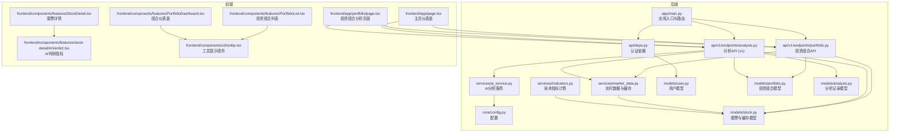
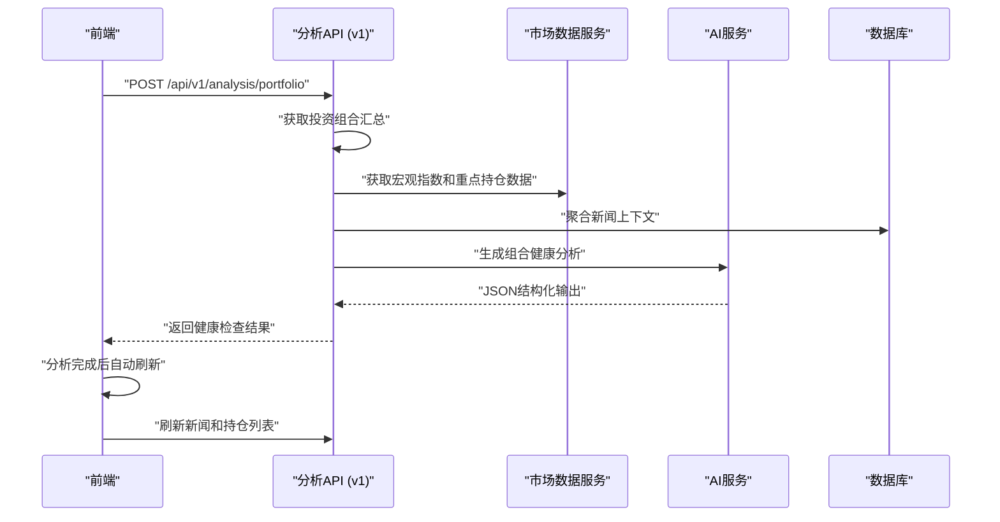
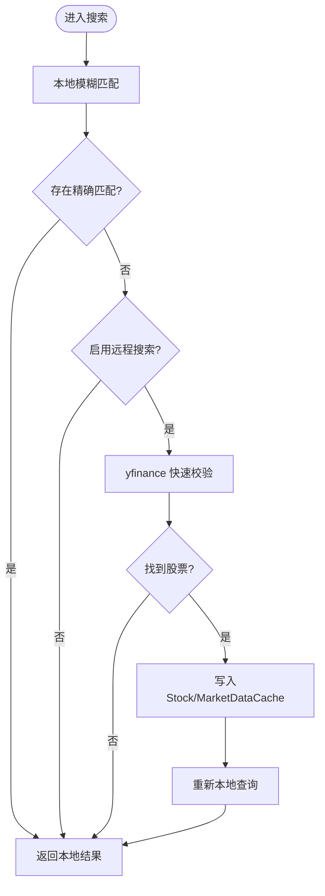
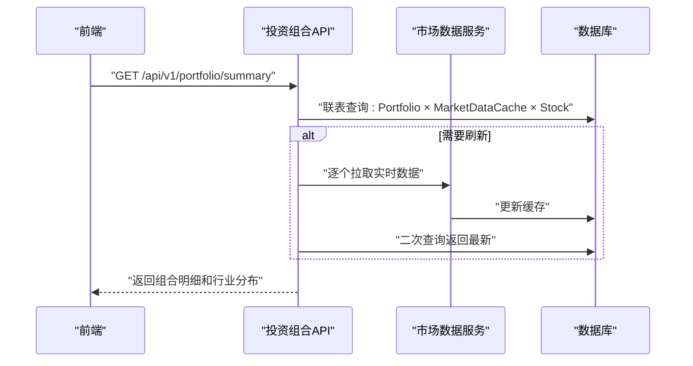
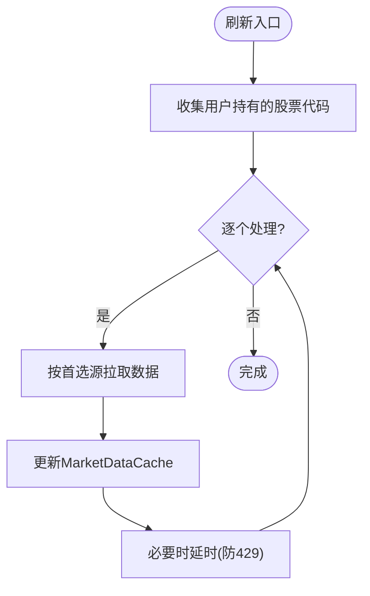
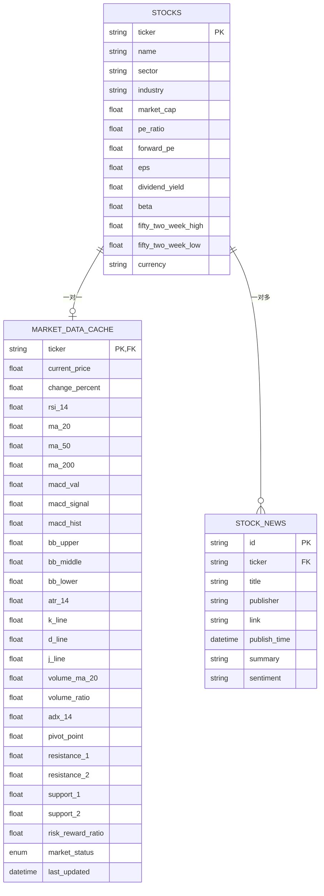
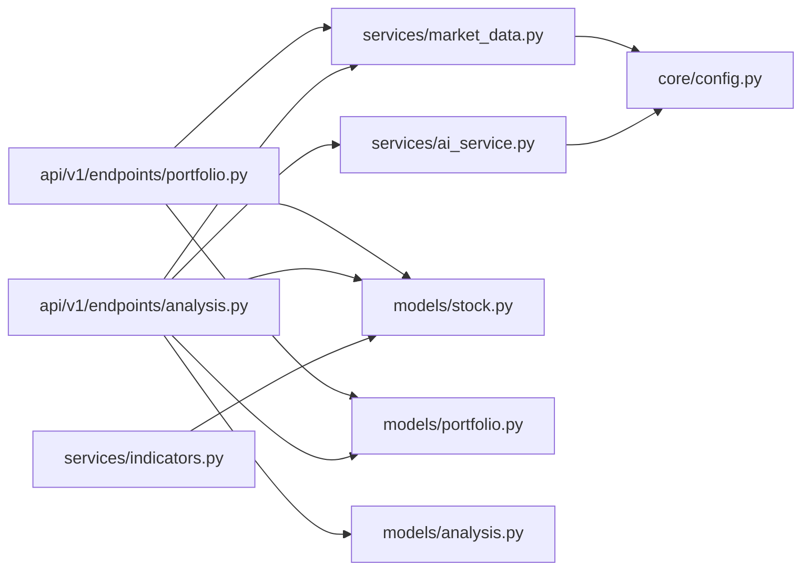

# 投资组合管理

<cite>
**本文引用的文件**
- [backend/app/main.py](file://backend/app/main.py)
- [backend/app/api/v1/endpoints/analysis.py](file://backend/app/api/v1/endpoints/analysis.py)
- [backend/app/api/v1/endpoints/portfolio.py](file://backend/app/api/v1/endpoints/portfolio.py)
- [backend/app/api/deps.py](file://backend/app/api/deps.py)
- [backend/app/models/portfolio.py](file://backend/app/models/portfolio.py)
- [backend/app/models/stock.py](file://backend/app/models/stock.py)
- [backend/app/models/analysis.py](file://backend/app/models/analysis.py)
- [backend/app/models/user.py](file://backend/app/models/user.py)
- [backend/app/services/market_data.py](file://backend/app/services/market_data.py)
- [backend/app/services/ai_service.py](file://backend/app/services/ai_service.py)
- [backend/app/services/indicators.py](file://backend/app/services/indicators.py)
- [backend/app/core/config.py](file://backend/app/core/config.py)
- [frontend/app/page.tsx](file://frontend/app/page.tsx)
- [frontend/app/portfolio/page.tsx](file://frontend/app/portfolio/page.tsx)
- [frontend/components/features/PortfolioList.tsx](file://frontend/components/features/PortfolioList.tsx)
- [frontend/components/features/StockDetail.tsx](file://frontend/components/features/StockDetail.tsx)
- [frontend/components/features/PortfolioDashboard.tsx](file://frontend/components/features/PortfolioDashboard.tsx)
- [frontend/components/features/stock-detail/AIVerdict.tsx](file://frontend/components/features/stock-detail/AIVerdict.tsx)
- [frontend/components/ui/tooltip.tsx](file://frontend/components/ui/tooltip.tsx)
- [frontend/types/index.ts](file://frontend/types/index.ts)
- [backend/app/schemas/analysis.py](file://backend/app/schemas/analysis.py)
- [backend/app/schemas/portfolio.py](file://backend/app/schemas/portfolio.py)
- [backend/migrations/versions/48d7355e90d6_add_more_technical_indicators.py](file://backend/migrations/versions/48d7355e90d6_add_more_technical_indicators.py)
- [backend/migrations/versions/a234193f1ade_add_risk_reward_ratio_to_marketdatacache.py](file://backend/migrations/versions/a234193f1ade_add_risk_reward_ratio_to_marketdatacache.py)
- [backend/migrations/versions/d24f18d20e95_add_adx_and_pivot_indicators.py](file://backend/migrations/versions/d24f18d20e95_add_adx_and_pivot_indicators.py)
- [backend/app/core/prompts.py](file://backend/app/core/prompts.py)
- [doc/PRD.md](file://doc/PRD.md)
- [README.md](file://README.md)
</cite>

## 目录
1. [简介](#简介)
2. [项目结构](#项目结构)
3. [核心组件](#核心组件)
4. [架构总览](#架构总览)
5. [详细组件分析](#详细组件分析)
6. [依赖关系分析](#依赖关系分析)
7. [性能考量](#性能考量)
8. [故障排查指南](#故障排查指南)
9. [结论](#结论)
10. [附录](#附录)

## 简介
本项目为"AI 智能投顾助手"的后端与前端实现，围绕投资组合管理与实时数据分析展开。后端采用 FastAPI + SQLAlchemy（异步）+ SQLite，提供股票搜索、投资组合 CRUD、实时数据获取与缓存、AI 深度分析等能力；前端使用 Next.js 构建仪表盘，支持自选股列表、详情视图、AI 分析卡片与交互操作。系统通过缓存与增量更新策略保障实时性与性能，并通过用户认证与配额限制实现商业可持续性。

**更新** 新增高级投资组合分析功能，包括健康检查、多样化分析、战略建议、宏观环境监控等，提供更全面的投资组合洞察。**重大界面改进** 包括风险回报比率的动态颜色编码系统、增强的工具提示显示关键阻力和支撑水平，以及分析完成后的自动刷新机制。

## 项目结构
- 后端
  - 应用入口与路由：app/main.py
  - API 层：auth、user、portfolio、analysis（v1版本）
  - 模型层：user、stock、portfolio、analysis
  - 服务层：market_data（实时数据与缓存）、ai_service（AI 分析）、indicators（技术指标计算）
  - 核心配置：core/config.py
  - 依赖注入：api/deps.py
- 前端
  - 主页仪表盘：app/page.tsx
  - 投资组合页面：app/portfolio/page.tsx
  - 组件：PortfolioList.tsx、StockDetail.tsx、PortfolioDashboard.tsx、AIVerdict.tsx、UserMenu.tsx、SearchDialog.tsx
  - UI组件：button.tsx、card.tsx、dialog.tsx、form.tsx、input.tsx、label.tsx、scroll-area.tsx、table.tsx、tooltip.tsx
- 文档
  - PRD：doc/PRD.md
  - 项目说明：README.md
- 迁移
  - 技术指标列迁移：backend/migrations/versions/48d7355e90d6_add_more_technical_indicators.py
  - 盈亏比字段迁移：backend/migrations/versions/a234193f1ade_add_risk_reward_ratio_to_marketdatacache.py
  - 支撑阻力位迁移：backend/migrations/versions/d24f18d20e95_add_adx_and_pivot_indicators.py

**图表来源**
- [backend/app/main.py:1-38](file://backend/app/main.py#L1-L38)
- [backend/app/api/v1/endpoints/analysis.py:1-745](file://backend/app/api/v1/endpoints/analysis.py#L1-L745)
- [backend/app/api/v1/endpoints/portfolio.py:1-513](file://backend/app/api/v1/endpoints/portfolio.py#L1-L513)
- [backend/app/api/deps.py:1-44](file://backend/app/api/deps.py#L1-L44)
- [backend/app/services/market_data.py:1-370](file://backend/app/services/market_data.py#L1-L370)
- [backend/app/services/ai_service.py:1-254](file://backend/app/services/ai_service.py#L1-L254)
- [backend/app/services/indicators.py:1-146](file://backend/app/services/indicators.py#L1-L146)
- [backend/app/models/user.py:1-31](file://backend/app/models/user.py#L1-L31)
- [backend/app/models/stock.py:1-105](file://backend/app/models/stock.py#L1-L105)
- [backend/app/models/portfolio.py:1-32](file://backend/app/models/portfolio.py#L1-L32)
- [backend/app/models/analysis.py:1-92](file://backend/app/models/analysis.py#L1-L92)
- [frontend/app/page.tsx:1-308](file://frontend/app/page.tsx#L1-L308)
- [frontend/app/portfolio/page.tsx:1-466](file://frontend/app/portfolio/page.tsx#L1-L466)
- [frontend/components/features/PortfolioList.tsx:1-477](file://frontend/components/features/PortfolioList.tsx#L1-L477)
- [frontend/components/features/StockDetail.tsx:1-227](file://frontend/components/features/StockDetail.tsx#L1-L227)
- [frontend/components/features/PortfolioDashboard.tsx:1-461](file://frontend/components/features/PortfolioDashboard.tsx#L1-L461)
- [frontend/components/features/stock-detail/AIVerdict.tsx:1-559](file://frontend/components/features/stock-detail/AIVerdict.tsx#L1-L559)
- [frontend/components/ui/tooltip.tsx:1-58](file://frontend/components/ui/tooltip.tsx#L1-L58)

**章节来源**
- [backend/app/main.py:1-38](file://backend/app/main.py#L1-L38)
- [README.md:1-50](file://README.md#L1-L50)

## 核心组件
- 股票搜索与本地/远程联动：支持本地数据库模糊匹配与远端 yfinance 快速校验，必要时自动写入基础 Stock 与 MarketDataCache 记录。
- 投资组合 CRUD：支持新增/更新/删除，自动触发后台数据拉取以补齐技术指标。
- 实时数据与缓存：1 分钟内命中缓存，优先使用首选数据源（Alpha Vantage 或 yfinance），失败时回退模拟数据并更新缓存。
- AI 深度分析：按用户配额与偏好调用 Gemini，整合技术面、消息面与持仓上下文生成结构化建议。
- **新增** 投资组合健康检查：提供整体组合健康评分、风险等级、多样化分析和战略建议。
- **新增** 宏观环境监控：集成大盘指数和重点持仓新闻，提供实时市场背景分析。
- **重大界面改进** 风险回报比率动态颜色编码系统：根据 RR 比率自动调整颜色（≥3.0 绿色、≥1.5 蓝色、<1.5 红色）。
- **重大界面改进** 增强工具提示：显示关键阻力和支撑水平，提供交易机会评估。
- **重大界面改进** 自动刷新机制：分析完成后自动刷新新闻和持仓列表。
- 前端仪表盘：主从布局，支持排序、筛选、编辑、分析触发与市场状态提示。

**章节来源**
- [backend/app/api/v1/endpoints/portfolio.py:79-157](file://backend/app/api/v1/endpoints/portfolio.py#L79-L157)
- [backend/app/api/v1/endpoints/analysis.py:64-184](file://backend/app/api/v1/endpoints/analysis.py#L64-L184)
- [backend/app/services/market_data.py:14-170](file://backend/app/services/market_data.py#L14-L170)
- [backend/app/services/ai_service.py:238-254](file://backend/app/services/ai_service.py#L238-L254)
- [frontend/app/page.tsx:206-262](file://frontend/app/page.tsx#L206-L262)
- [frontend/app/portfolio/page.tsx:272-423](file://frontend/app/portfolio/page.tsx#L272-L423)
- [frontend/components/features/PortfolioList.tsx:214-264](file://frontend/components/features/PortfolioList.tsx#L214-L264)

## 架构总览
系统采用"API 层 → 服务层 → 模型层 → 数据库/外部数据源"的分层设计。认证通过 OAuth2 Bearer Token 解析用户，分析流程串联市场数据服务与 AI 服务，前端负责交互与展示。

**图表来源**
- [backend/app/api/v1/endpoints/analysis.py:72-208](file://backend/app/api/v1/endpoints/analysis.py#L72-L208)
- [backend/app/services/market_data.py:14-170](file://backend/app/services/market_data.py#L14-L170)
- [backend/app/services/ai_service.py:238-254](file://backend/app/services/ai_service.py#L238-L254)
- [frontend/app/page.tsx:215-223](file://frontend/app/page.tsx#L215-L223)

## 详细组件分析

### 股票搜索与实时数据获取
- 搜索策略
  - 本地优先：按代码或名称模糊匹配，限制返回数量。
  - 远程兜底：当本地无精确匹配且启用远程搜索时，使用 yfinance 快速校验并写入 Stock 与 MarketDataCache。
- 实时数据获取与缓存
  - 缓存命中：1 分钟内直接返回缓存。
  - 数据源优先级：按用户首选数据源尝试 Alpha Vantage → yfinance，失败则回退模拟数据并微幅扰动现有缓存。
  - 技术指标：基于历史数据计算 RSI、MACD、布林带、KDJ、ATR、量比等，落库到 MarketDataCache。
  - 新闻同步：仅 yfinance 路径抓取新闻，SQLite upsert 去重入库。

**图表来源**
- [backend/app/api/v1/endpoints/portfolio.py:22-75](file://backend/app/api/v1/endpoints/portfolio.py#L22-L75)

**章节来源**
- [backend/app/api/v1/endpoints/portfolio.py:22-75](file://backend/app/api/v1/endpoints/portfolio.py#L22-L75)
- [backend/app/services/market_data.py:14-170](file://backend/app/services/market_data.py#L14-L170)

### 投资组合 CRUD 与收益计算
- API 设计
  - GET /api/v1/portfolio/summary：返回用户投资组合明细，合并缓存与基础数据，支持强制刷新。
  - POST /api/v1/portfolio/：新增或更新持仓，自动触发后台数据拉取以补齐技术指标。
  - DELETE /api/v1/portfolio/{ticker}：删除持仓项。
- 收益计算
  - 市值 = 持有数量 × 现价
  - 未实现盈亏 = (现价 − 平均成本) × 持有数量
  - 未实现盈亏百分比 = 未实现盈亏 ÷ (平均成本 × 持有数量) × 100%
  - 行业暴露分析：按行业计算权重和价值分布

**图表来源**
- [backend/app/api/v1/endpoints/portfolio.py:79-157](file://backend/app/api/v1/endpoints/portfolio.py#L79-L157)
- [backend/app/api/v1/endpoints/portfolio.py:159-200](file://backend/app/api/v1/endpoints/portfolio.py#L159-L200)

**章节来源**
- [backend/app/api/v1/endpoints/portfolio.py:79-157](file://backend/app/api/v1/endpoints/portfolio.py#L79-L157)
- [backend/app/api/v1/endpoints/portfolio.py:159-200](file://backend/app/api/v1/endpoints/portfolio.py#L159-L200)

### 实时价格更新机制与增量策略
- 缓存策略
  - 1 分钟内命中缓存，避免频繁外部请求。
  - 无缓存时按首选数据源拉取，缺失则回退模拟数据并更新缓存。
- 增量更新
  - 刷新时顺序遍历用户持有的股票，逐个更新缓存，SQLite 场景下避免并发问题。
  - 后台任务在新增/更新时自动触发，避免阻塞响应。
- 外部数据源
  - Alpha Vantage：报价与基本面。
  - yfinance：行情、技术指标、新闻。

**图表来源**
- [backend/app/api/v1/endpoints/portfolio.py:186-200](file://backend/app/api/v1/endpoints/portfolio.py#L186-L200)
- [backend/app/services/market_data.py:14-170](file://backend/app/services/market_data.py#L14-L170)

**章节来源**
- [backend/app/api/v1/endpoints/portfolio.py:186-200](file://backend/app/api/v1/endpoints/portfolio.py#L186-L200)
- [backend/app/services/market_data.py:14-170](file://backend/app/services/market_data.py#L14-L170)

### 股票数据模型设计
- 股票基础数据：代码、名称、行业/板块、市值、PE、EPS、股息率、Beta、52 周高低等。
- 市场数据缓存：当前价、涨跌幅、技术指标（RSI、MA、MACD、布林带、KDJ、ATR、量比等）、市场状态、最后更新时间。
- 关系设计：Stock 与 MarketDataCache 一对一，Stock 与 StockNews 一对多。

**图表来源**
- [backend/app/models/stock.py:13-105](file://backend/app/models/stock.py#L13-L105)

**章节来源**
- [backend/app/models/stock.py:13-105](file://backend/app/models/stock.py#L13-L105)
- [backend/migrations/versions/48d7355e90d6_add_more_technical_indicators.py:21-32](file://backend/migrations/versions/48d7355e90d6_add_more_technical_indicators.py#L21-L32)
- [backend/migrations/versions/a234193f1ade_add_risk_reward_ratio_to_marketdatacache.py:21-25](file://backend/migrations/versions/a234193f1ade_add_risk_reward_ratio_to_marketdatacache.py#L21-L25)
- [backend/migrations/versions/d24f18d20e95_add_adx_and_pivot_indicators.py:21-30](file://backend/migrations/versions/d24f18d20e95_add_adx_and_pivot_indicators.py#L21-L30)

### 投资组合分析功能（收益与风险）
- 收益计算
  - 市值、未实现盈亏、未实现盈亏百分比由后端在返回时即时计算，前端直接展示。
- 风险评估
  - 技术指标：RSI 超买/超卖、MACD 金叉死叉、布林带收口/开口、ATR 波动、KDJ 趋势。
  - 消息面：新闻标题、发布时间、摘要，辅助判断短期情绪与事件驱动。
  - 持仓视角：结合平均成本、数量、当前浮动盈亏，给出止盈/止损/持有建议。

**更新** 新增高级组合分析功能
- 健康检查：提供 0-100 的综合健康评分，包含风险等级、摘要、多样化分析、战略建议。
- 宏观监控：自动抓取 S&P 500 指数和前三大持仓新闻，提供实时市场背景。
- 专家建议：基于 AI 的深度诊断报告，包含风险透视、调仓建议和战术指南。

**章节来源**
- [backend/app/api/v1/endpoints/portfolio.py:118-148](file://backend/app/api/v1/endpoints/portfolio.py#L118-L148)
- [backend/app/api/v1/endpoints/analysis.py:72-208](file://backend/app/api/v1/endpoints/analysis.py#L72-L208)
- [backend/app/services/ai_service.py:238-254](file://backend/app/services/ai_service.py#L238-L254)

### 用户界面设计与交互
- 布局：左右主从布局，左侧为自选股列表，右侧为详情与分析卡片。
- 列表交互：支持只看持仓、排序（代码/价格/涨跌幅）、编辑数量与成本、删除、远程搜索。
- 详情视图：展示基本面、技术指标与 AI 建议，含数据更新时间提示。
- 市场状态：根据纽约时间计算美股开市/休市与倒计时。
- 分析触发：点击"AI 深度分析"，按配额限制进行提示与跳转。
- **新增** 健康检查卡片：圆形健康评分显示，风险等级标签，战略建议和机会风险列表。
- **新增** 深度报告对话框：完整的 Markdown 格式诊断报告，支持滚动查看。
- **重大界面改进** 风险回报比率动态颜色编码：根据 RR 比率自动调整颜色（≥3.0 绿色、≥1.5 蓝色、<1.5 红色）。
- **重大界面改进** 增强工具提示：显示关键阻力和支撑水平，提供交易机会评估。
- **重大界面改进** 自动刷新机制：分析完成后自动刷新新闻和持仓列表。

**章节来源**
- [frontend/app/page.tsx:206-262](file://frontend/app/page.tsx#L206-L262)
- [frontend/app/portfolio/page.tsx:272-423](file://frontend/app/portfolio/page.tsx#L272-L423)
- [frontend/components/features/PortfolioList.tsx:214-264](file://frontend/components/features/PortfolioList.tsx#L214-L264)
- [frontend/components/features/PortfolioDashboard.tsx:288-419](file://frontend/components/features/PortfolioDashboard.tsx#L288-L419)
- [frontend/components/features/stock-detail/AIVerdict.tsx:166-362](file://frontend/components/features/stock-detail/AIVerdict.tsx#L166-L362)

### 数据验证与业务约束
- 投资组合唯一性：同一用户对同一股票只能有一条持仓记录（联合唯一约束）。
- 用户偏好：用户可配置首选数据源（Alpha Vantage 或 yfinance），并设置 API Key。
- 分析配额：免费用户每日最多 3 次 AI 分析，Pro 用户无限制。
- 搜索约束：远程搜索仅在本地无精确匹配且查询长度不超过一定阈值时触发。

**章节来源**
- [backend/app/models/portfolio.py:25-28](file://backend/app/models/portfolio.py#L25-L28)
- [backend/app/models/user.py:11-27](file://backend/app/models/user.py#L11-L27)
- [backend/app/api/v1/endpoints/analysis.py:256-276](file://backend/app/api/v1/endpoints/analysis.py#L256-L276)
- [backend/app/api/v1/endpoints/portfolio.py:48-75](file://backend/app/api/v1/endpoints/portfolio.py#L48-L75)

### 扩展开发指南
- 添加新的技术指标
  - 在 MarketDataCache 中新增字段。
  - 在市场数据服务中补充计算逻辑并写入缓存。
  - 在前端展示区域增加对应指标卡片。
- 新增分析维度
  - 在分析 API 中扩展上下文（如财务报表、估值模型）。
  - 在 AI 服务中完善提示词工程与 JSON 输出结构。
- **新增** 组合分析扩展
  - 在 AIService 中扩展 generate_portfolio_analysis 方法。
  - 在前端添加新的分析卡片和可视化组件。
  - 考虑添加缓存机制存储组合分析结果。
- **重大界面改进** 风险回报比率系统
  - 在 indicators 服务中计算 RR 比率，支持枢轴位、布林带、MA50/ATR 三种计算方式。
  - 在前端 PortfolioList 和 StockDetail 组件中实现动态颜色编码。
  - 在工具提示中显示关键阻力和支撑水平。
- 性能优化
  - 批量查询：在刷新时尽量减少数据库往返，合并查询与更新。
  - 缓存策略：根据业务热点调整缓存时间窗口与失效策略。
  - 并发控制：在外部数据源调用时加入限流与指数退避。

**章节来源**
- [backend/app/services/market_data.py:120-170](file://backend/app/services/market_data.py#L120-L170)
- [backend/app/api/v1/endpoints/analysis.py:238-254](file://backend/app/api/v1/endpoints/analysis.py#L238-L254)
- [frontend/app/page.tsx:180-194](file://frontend/app/page.tsx#L180-L194)
- [backend/app/services/indicators.py:137-146](file://backend/app/services/indicators.py#L137-L146)

## 依赖关系分析
- 组件耦合
  - API 层依赖服务层与模型层，服务层依赖配置与数据库。
  - 分析 API 依赖市场数据服务与 AI 服务，体现清晰的职责分离。
  - 投资组合 API 与分析 API 通过共享的市场数据服务进行协作。
- 外部依赖
  - yfinance、requests、google.generativeai、SQLAlchemy、FastAPI、Alembic。

**图表来源**
- [backend/app/api/v1/endpoints/analysis.py:1-745](file://backend/app/api/v1/endpoints/analysis.py#L1-L745)
- [backend/app/api/v1/endpoints/portfolio.py:1-513](file://backend/app/api/v1/endpoints/portfolio.py#L1-L513)
- [backend/app/services/market_data.py:1-370](file://backend/app/services/market_data.py#L1-L370)
- [backend/app/services/ai_service.py:1-254](file://backend/app/services/ai_service.py#L1-L254)
- [backend/app/services/indicators.py:1-146](file://backend/app/services/indicators.py#L1-L146)
- [backend/app/models/stock.py:1-105](file://backend/app/models/stock.py#L1-L105)
- [backend/app/models/portfolio.py:1-32](file://backend/app/models/portfolio.py#L1-L32)
- [backend/app/models/analysis.py:1-92](file://backend/app/models/analysis.py#L1-L92)
- [backend/app/core/config.py:1-24](file://backend/app/core/config.py#L1-L24)

**章节来源**
- [backend/app/api/v1/endpoints/analysis.py:1-745](file://backend/app/api/v1/endpoints/analysis.py#L1-L745)
- [backend/app/api/v1/endpoints/portfolio.py:1-513](file://backend/app/api/v1/endpoints/portfolio.py#L1-L513)
- [backend/app/services/market_data.py:1-370](file://backend/app/services/market_data.py#L1-L370)
- [backend/app/services/ai_service.py:1-254](file://backend/app/services/ai_service.py#L1-L254)
- [backend/app/services/indicators.py:1-146](file://backend/app/services/indicators.py#L1-L146)
- [backend/app/models/stock.py:1-105](file://backend/app/models/stock.py#L1-L105)
- [backend/app/models/portfolio.py:1-32](file://backend/app/models/portfolio.py#L1-L32)
- [backend/app/models/analysis.py:1-92](file://backend/app/models/analysis.py#L1-L92)
- [backend/app/core/config.py:1-24](file://backend/app/core/config.py#L1-L24)

## 性能考量
- 缓存命中：1 分钟内直接返回缓存，显著降低外部请求与计算压力。
- 顺序刷新：SQLite 场景下顺序处理避免会话并发问题，必要时延时规避 429。
- 批量查询：一次联表查询返回组合明细，减少多次往返。
- 外部限流：yfinance 429 时采用指数退避与随机抖动，提升成功率。
- 前端轮询：根据 Tab 激活状态动态启停轮询，减少无效请求。
- **新增** 并行数据获取：组合分析时并行抓取宏观指数和重点持仓新闻，提升响应速度。
- **重大界面改进** 自动刷新优化：分析完成后自动刷新新闻和持仓列表，提升用户体验。

**章节来源**
- [backend/app/services/market_data.py:22-57](file://backend/app/services/market_data.py#L22-L57)
- [backend/app/api/v1/endpoints/portfolio.py:186-200](file://backend/app/api/v1/endpoints/portfolio.py#L186-L200)
- [frontend/app/page.tsx:100-153](file://frontend/app/page.tsx#L100-L153)
- [backend/app/api/v1/endpoints/analysis.py:103-131](file://backend/app/api/v1/endpoints/analysis.py#L103-L131)
- [frontend/app/page.tsx:215-223](file://frontend/app/page.tsx#L215-L223)

## 故障排查指南
- 认证失败
  - 检查前端是否携带有效 Bearer Token，后端日志中查看解码与用户查询过程。
- 外部数据源异常
  - Alpha Vantage：检查 API Key 与配额；关注返回 Note 提示。
  - yfinance：关注 429 错误与重试逻辑，必要时配置代理。
- AI 分析受限
  - 免费用户达到每日上限，引导用户在设置中添加自有 API Key。
- 数据不更新
  - 检查缓存 last_updated 是否超过 1 分钟；确认刷新参数与后台任务执行情况。
- **新增** 组合分析失败
  - 检查 Gemini 或 SiliconFlow API Key 配置。
  - 确认用户是否有持仓，空组合无法生成分析。
  - 查看 AI 服务日志中的错误信息。
- **重大界面改进** 风险回报比率显示异常
  - 检查后端 indicators 服务是否正确计算 RR 比率。
  - 确认前端颜色编码逻辑与 RR 比率值匹配。
  - 验证工具提示中阻力和支撑水平数据是否正确。
- **重大界面改进** 自动刷新机制失效
  - 检查前端 handleAnalyze 函数中的自动刷新逻辑。
  - 确认刷新 API 调用是否成功执行。

**章节来源**
- [backend/app/api/deps.py:17-44](file://backend/app/api/deps.py#L17-L44)
- [backend/app/services/market_data.py:320-370](file://backend/app/services/market_data.py#L320-L370)
- [backend/app/api/v1/endpoints/analysis.py:256-276](file://backend/app/api/v1/endpoints/analysis.py#L256-L276)
- [backend/app/api/v1/endpoints/analysis.py:121-132](file://backend/app/api/v1/endpoints/analysis.py#L121-L132)
- [backend/app/services/indicators.py:137-146](file://backend/app/services/indicators.py#L137-L146)
- [frontend/app/page.tsx:215-223](file://frontend/app/page.tsx#L215-L223)

## 结论
本系统通过清晰的分层设计与缓存策略，在保证实时性的同时兼顾性能与可维护性。投资组合 CRUD 与收益计算直观易用，AI 深度分析结合技术面与消息面为用户提供决策依据。**新增的高级分析功能**包括健康检查、多样化分析、战略建议和宏观环境监控，为用户提供更全面的投资组合洞察。**重大界面改进** 包括风险回报比率的动态颜色编码系统、增强的工具提示显示关键阻力和支撑水平，以及分析完成后的自动刷新机制，显著提升了用户体验和交易决策效率。建议后续引入 Redis 缓存、批量刷新与更细粒度的并发控制，进一步提升系统性能与弹性。

## 附录
- 快速启动与开发环境见项目说明与 PRD。
- 技术指标扩展可通过迁移脚本新增列并完善计算逻辑。
- **新增** 组合分析功能可通过 AIService 的 generate_portfolio_analysis 方法扩展，支持更多分析维度和可视化组件。
- **重大界面改进** 风险回报比率系统可通过扩展 indicators 服务的 RR 比率计算逻辑，支持更多交易策略和风险评估方法。

**章节来源**
- [README.md:1-50](file://README.md#L1-L50)
- [doc/PRD.md:1-134](file://doc/PRD.md#L1-L134)
- [backend/app/services/indicators.py:137-146](file://backend/app/services/indicators.py#L137-L146)
- [frontend/components/features/PortfolioList.tsx:276-296](file://frontend/components/features/PortfolioList.tsx#L276-L296)
- [frontend/app/page.tsx:215-223](file://frontend/app/page.tsx#L215-L223)