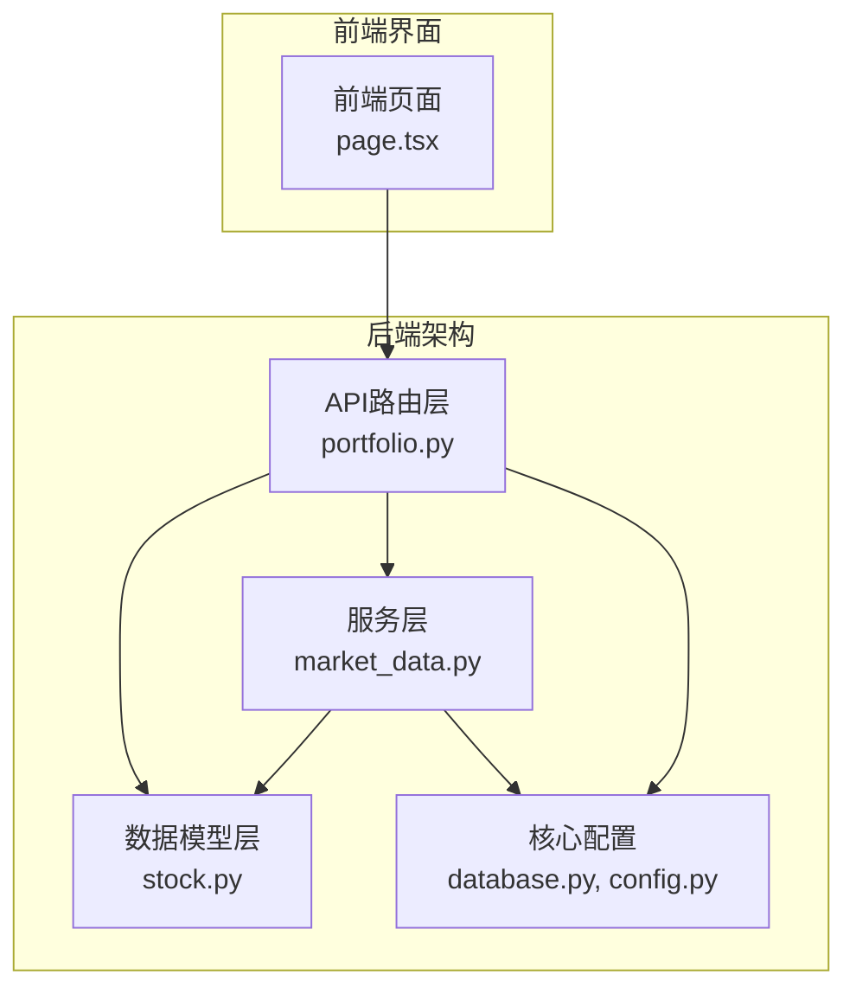
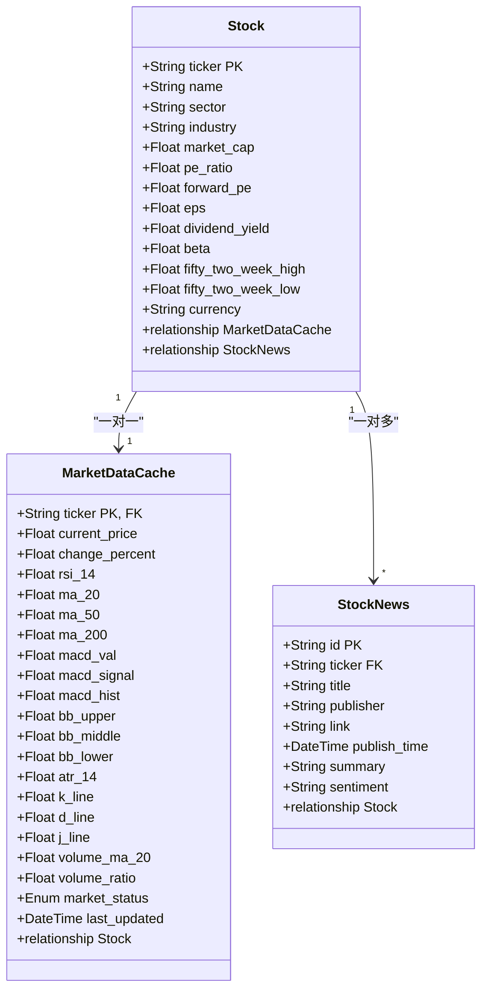
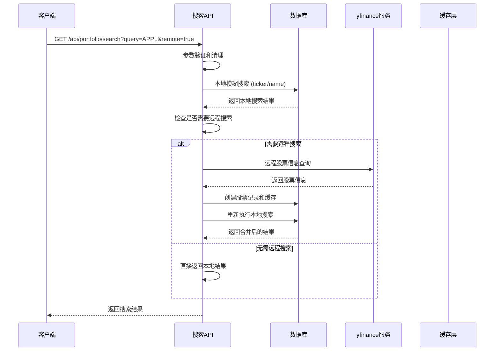
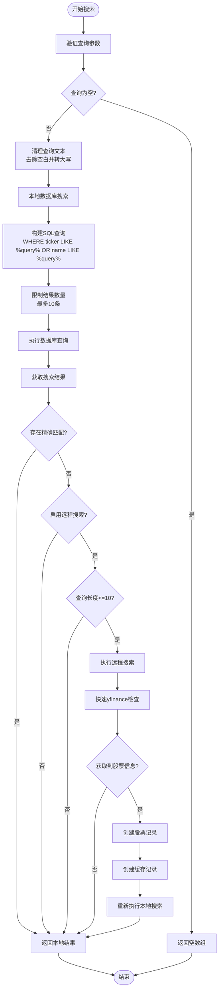
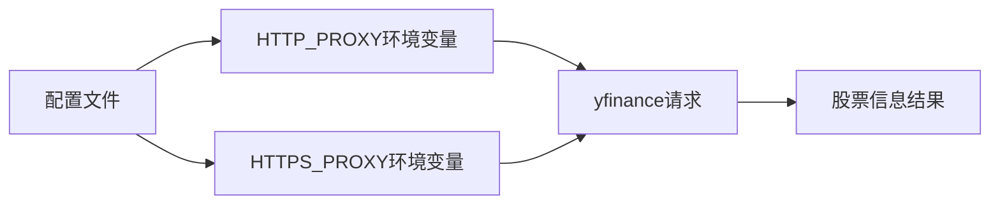
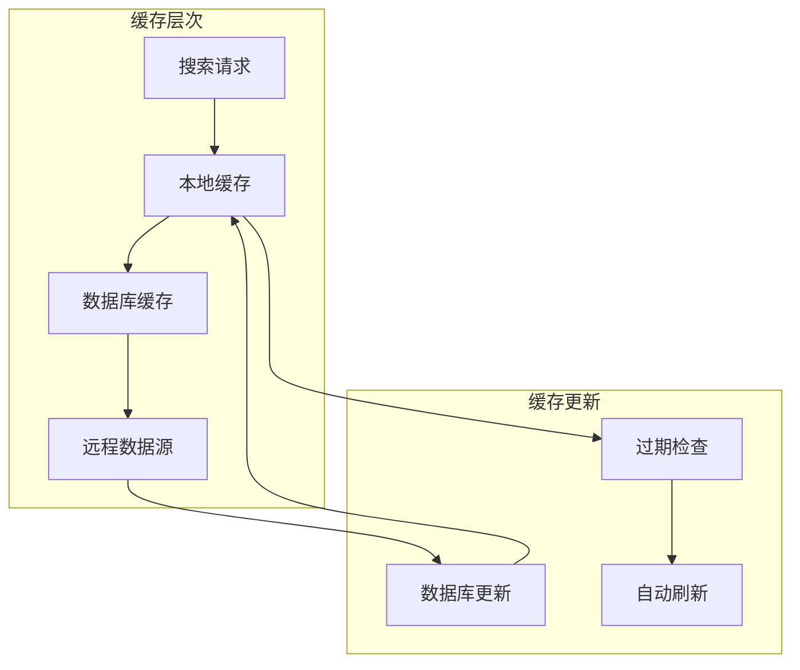
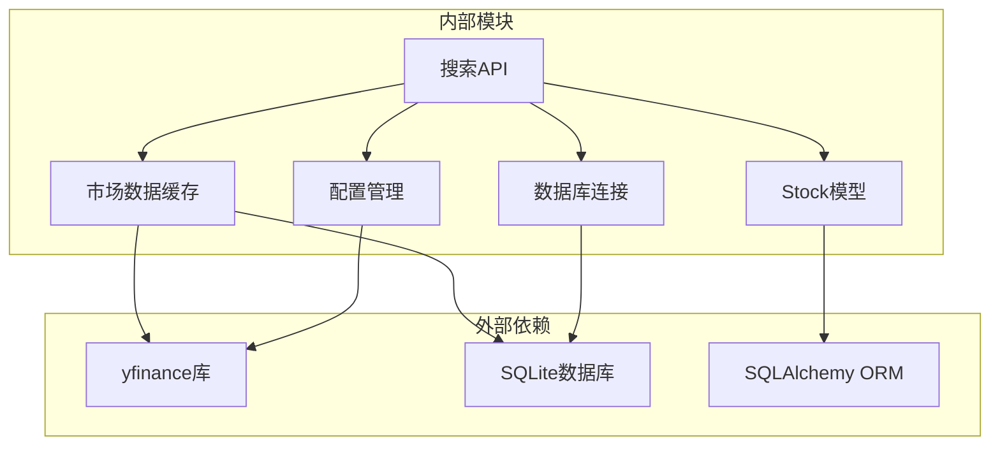

# 股票搜索功能

<cite>
**本文档引用的文件**
- [backend/app/api/portfolio.py](file://backend/app/api/portfolio.py)
- [backend/app/models/stock.py](file://backend/app/models/stock.py)
- [backend/app/services/market_data.py](file://backend/app/services/market_data.py)
- [backend/app/core/database.py](file://backend/app/core/database.py)
- [backend/app/core/config.py](file://backend/app/core/config.py)
- [backend/app/main.py](file://backend/app/main.py)
- [frontend/app/page.tsx](file://frontend/app/page.tsx)
- [.env.example](file://.env.example)
</cite>

## 目录
1. [简介](#简介)
2. [项目结构](#项目结构)
3. [核心组件](#核心组件)
4. [架构概览](#架构概览)
5. [详细组件分析](#详细组件分析)
6. [依赖关系分析](#依赖关系分析)
7. [性能考虑](#性能考虑)
8. [故障排除指南](#故障排除指南)
9. [结论](#结论)
10. [附录](#附录)

## 简介

股票搜索功能是AI股票顾问系统的核心特性之一，提供了本地搜索和远程搜索相结合的智能搜索体验。该功能支持通过股票代码和公司名称进行模糊匹配，同时集成了yfinance远程搜索服务来扩展搜索范围。

本功能的主要特点包括：
- **双模式搜索**：本地数据库搜索和远程yfinance搜索
- **智能缓存**：基于时间的缓存策略和自动更新机制
- **模糊匹配**：支持部分匹配和大小写不敏感搜索
- **代理支持**：完整的HTTP代理配置支持
- **性能优化**：查询限制、索引使用和异步处理

## 项目结构

股票搜索功能主要分布在以下模块中：



**图表来源**
- [backend/app/api/portfolio.py](file://backend/app/api/portfolio.py#L68-L140)
- [backend/app/models/stock.py](file://backend/app/models/stock.py#L13-L85)
- [backend/app/services/market_data.py](file://backend/app/services/market_data.py#L13-L370)

**章节来源**
- [backend/app/api/portfolio.py](file://backend/app/api/portfolio.py#L1-L297)
- [backend/app/models/stock.py](file://backend/app/models/stock.py#L1-L85)

## 核心组件

### 数据模型设计

股票搜索功能涉及三个核心数据模型：



**图表来源**
- [backend/app/models/stock.py](file://backend/app/models/stock.py#L13-L85)

### 搜索结果数据结构

搜索功能返回统一的搜索结果格式：

| 字段名 | 类型 | 描述 | 必填 |
|--------|------|------|------|
| ticker | string | 股票代码 | 是 |
| name | string | 公司名称 | 是 |

**章节来源**
- [backend/app/api/portfolio.py](file://backend/app/api/portfolio.py#L64-L67)

## 架构概览

股票搜索功能采用分层架构设计，实现了本地搜索和远程搜索的无缝集成：



**图表来源**
- [backend/app/api/portfolio.py](file://backend/app/api/portfolio.py#L68-L140)
- [backend/app/services/market_data.py](file://backend/app/services/market_data.py#L173-L318)

## 详细组件分析

### 搜索API实现

搜索功能的核心实现在 `/api/portfolio/search` 路由中：

#### 本地搜索机制

本地搜索采用模糊匹配算法，支持部分匹配和大小写不敏感搜索：



**图表来源**
- [backend/app/api/portfolio.py](file://backend/app/api/portfolio.py#L68-L140)

#### 远程搜索机制

远程搜索通过yfinance服务实现，支持代理配置和超时处理：

**章节来源**
- [backend/app/api/portfolio.py](file://backend/app/api/portfolio.py#L68-L140)

### SQL查询优化

搜索功能在数据库层面采用了多项优化措施：

#### 索引使用

- **股票代码索引**：`Stock.ticker` 设置为主键并建立索引
- **名称模糊查询**：使用 `ilike` 进行大小写不敏感匹配
- **时间戳索引**：`MarketDataCache.last_updated` 建立索引用于缓存失效判断

#### 查询限制

- **结果数量限制**：最多返回10条结果，避免过度查询
- **查询长度限制**：远程搜索仅支持长度不超过10的查询
- **精确匹配优先**：如果本地搜索已包含精确匹配，跳过远程搜索

**章节来源**
- [backend/app/api/portfolio.py](file://backend/app/api/portfolio.py#L74-L81)
- [backend/app/models/stock.py](file://backend/app/models/stock.py#L16-L65)

### 模糊匹配算法

搜索功能实现了智能的模糊匹配算法：

#### 匹配策略

1. **精确匹配**：首先检查股票代码的完全匹配
2. **前缀匹配**：支持以查询开头的匹配
3. **包含匹配**：支持包含查询词的匹配
4. **大小写不敏感**：所有匹配均不区分大小写

#### 性能优化

- 使用SQL的 `ilike` 操作符进行高效匹配
- 限制查询长度防止过度匹配
- 优先返回本地结果减少网络请求

**章节来源**
- [backend/app/api/portfolio.py](file://backend/app/api/portfolio.py#L76-L81)

### yfinance远程搜索集成

#### 代理配置

远程搜索支持完整的代理配置：



**图表来源**
- [backend/app/services/market_data.py](file://backend/app/services/market_data.py#L189-L191)
- [backend/app/api/portfolio.py](file://backend/app/api/portfolio.py#L98-L100)

#### 超时处理

- **连接超时**：5秒连接超时
- **读取超时**：5秒读取超时
- **总超时**：异步等待最多5秒

#### 错误处理

- **429状态码**：指数退避重试（最大等待时间）
- **网络错误**：最多3次重试
- **解析错误**：优雅降级到本地搜索

**章节来源**
- [backend/app/api/portfolio.py](file://backend/app/api/portfolio.py#L113-L116)
- [backend/app/services/market_data.py](file://backend/app/services/market_data.py#L305-L318)

### 缓存策略

#### 缓存层次



#### 缓存机制

- **时间缓存**：缓存有效期1分钟
- **自动刷新**：过期后自动从远程数据源更新
- **回退机制**：远程数据获取失败时使用模拟数据

**章节来源**
- [backend/app/services/market_data.py](file://backend/app/services/market_data.py#L21-L24)

## 依赖关系分析

股票搜索功能的依赖关系如下：



**图表来源**
- [backend/app/api/portfolio.py](file://backend/app/api/portfolio.py#L1-L297)
- [backend/app/models/stock.py](file://backend/app/models/stock.py#L1-L85)
- [backend/app/services/market_data.py](file://backend/app/services/market_data.py#L1-L370)

**章节来源**
- [backend/app/main.py](file://backend/app/main.py#L24-L29)
- [backend/app/core/database.py](file://backend/app/core/database.py#L1-L24)
- [backend/app/core/config.py](file://backend/app/core/config.py#L1-L24)

## 性能考虑

### 查询性能优化

#### 数据库查询优化

- **索引利用**：充分利用 `ticker` 和 `name` 字段的索引
- **查询限制**：限制结果数量和查询长度
- **批量操作**：使用 `LIMIT` 子句控制查询范围

#### 缓存优化

- **内存缓存**：短期缓存减少数据库访问
- **智能过期**：1分钟缓存周期平衡新鲜度和性能
- **回退机制**：缓存失效时提供模拟数据保证可用性

### 网络性能优化

#### 连接池管理

- **异步处理**：使用 `asyncio` 处理远程请求
- **超时控制**：严格的超时设置避免阻塞
- **重试机制**：智能重试避免临时网络问题

#### 资源管理

- **代理复用**：配置一次代理全局使用
- **连接复用**：合理管理HTTP连接
- **内存控制**：及时释放不需要的对象

## 故障排除指南

### 常见问题及解决方案

#### 搜索结果为空

**可能原因**：
- 查询条件过于严格
- 数据库中无相关记录
- 远程搜索被禁用

**解决方法**：
- 尝试更宽松的查询条件
- 检查数据库中是否存在相关股票
- 确认启用了远程搜索选项

#### 远程搜索失败

**可能原因**：
- 网络连接问题
- yfinance服务不可用
- 代理配置错误

**解决方法**：
- 检查网络连接状态
- 验证yfinance服务可用性
- 检查代理服务器配置

#### 性能问题

**可能原因**：
- 数据库查询过于频繁
- 缓存配置不当
- 网络延迟过高

**解决方法**：
- 优化查询条件
- 调整缓存时间设置
- 使用更快的网络连接

### 错误处理机制

#### 异常类型

| 异常类型 | 触发条件 | 处理方式 |
|----------|----------|----------|
| 查询为空 | 用户输入为空 | 返回空数组 |
| 远程搜索失败 | yfinance请求超时 | 回退到本地搜索 |
| 缓存过期 | 缓存时间超过1分钟 | 自动刷新缓存 |
| 数据库错误 | 数据库连接失败 | 重试连接或返回错误 |

#### 日志记录

系统会在关键节点记录详细的日志信息，便于问题诊断和性能监控。

**章节来源**
- [backend/app/api/portfolio.py](file://backend/app/api/portfolio.py#L137-L138)
- [backend/app/services/market_data.py](file://backend/app/services/market_data.py#L305-L318)

## 结论

股票搜索功能通过本地搜索和远程搜索的有机结合，为用户提供了高效、准确的股票发现体验。该功能具有以下优势：

1. **多层次搜索**：本地搜索提供即时响应，远程搜索扩展搜索范围
2. **智能缓存**：合理的缓存策略平衡了性能和数据新鲜度
3. **容错机制**：完善的错误处理确保系统的稳定性
4. **性能优化**：多种优化措施保证了良好的用户体验

未来可以考虑的改进方向包括：
- 增加搜索历史记录功能
- 实现搜索结果排序和过滤
- 扩展支持更多数据源
- 增强搜索算法的智能化程度

## 附录

### API使用示例

#### 基本搜索

```bash
# 本地搜索
GET /api/portfolio/search?query=AAPL

# 启用远程搜索
GET /api/portfolio/search?query=AAPL&remote=true
```

#### 响应格式

```json
[
  {
    "ticker": "AAPL",
    "name": "Apple Inc."
  },
  {
    "ticker": "MSFT",
    "name": "Microsoft Corporation"
  }
]
```

### 配置选项

#### 环境变量

| 变量名 | 描述 | 默认值 |
|--------|------|--------|
| HTTP_PROXY | HTTP代理地址 | 无 |
| DATABASE_URL | 数据库连接字符串 | sqlite:///./ai_advisor.db |

#### 最佳实践

1. **查询优化**：使用简短明确的查询词
2. **缓存利用**：合理利用缓存减少请求频率
3. **错误处理**：妥善处理网络异常和数据缺失
4. **性能监控**：定期检查搜索性能和响应时间

**章节来源**
- [.env.example](file://.env.example#L1-L9)
- [frontend/app/page.tsx](file://frontend/app/page.tsx#L604-L625)