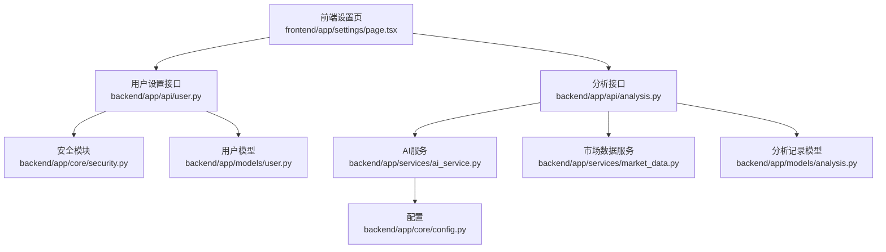
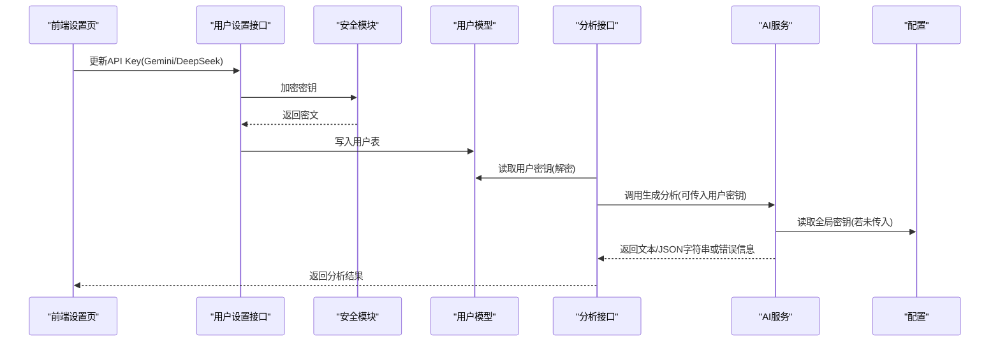
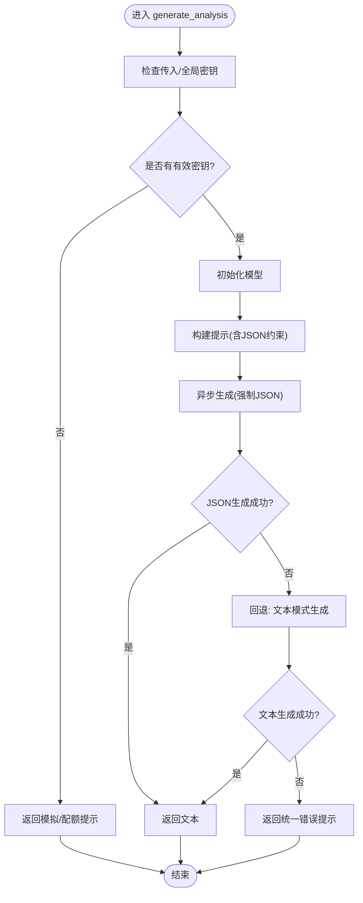
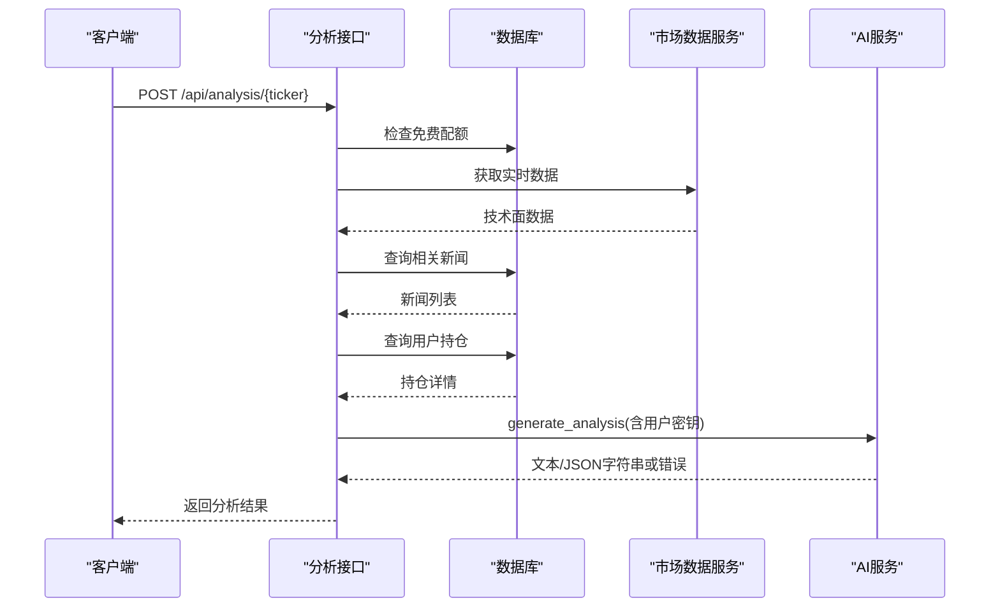
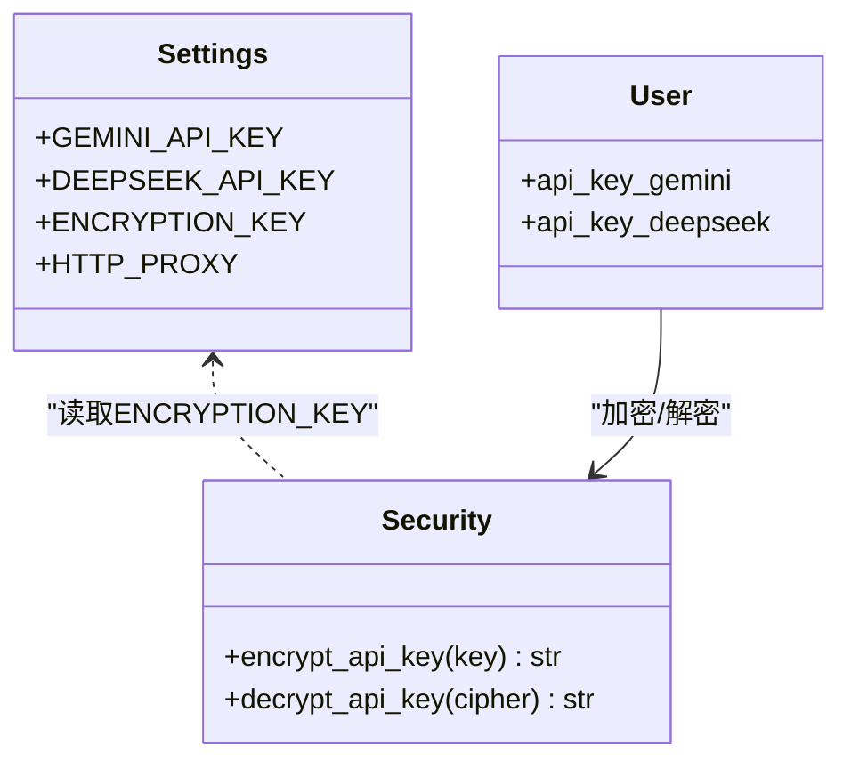
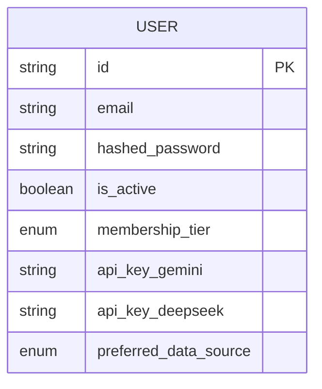
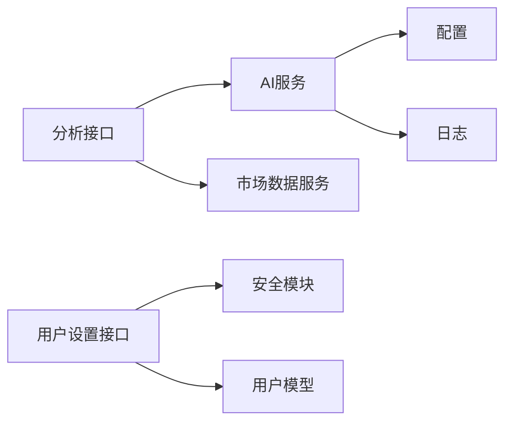

# AI服务集成问题

<cite>
**本文引用的文件**
- [backend/app/services/ai_service.py](file://backend/app/services/ai_service.py)
- [backend/app/api/analysis.py](file://backend/app/api/analysis.py)
- [backend/app/core/config.py](file://backend/app/core/config.py)
- [backend/app/core/security.py](file://backend/app/core/security.py)
- [backend/app/api/user.py](file://backend/app/api/user.py)
- [backend/app/models/user.py](file://backend/app/models/user.py)
- [backend/app/models/analysis.py](file://backend/app/models/analysis.py)
- [backend/app/schemas/user_settings.py](file://backend/app/schemas/user_settings.py)
- [.env.example](file://.env.example)
- [frontend/app/settings/page.tsx](file://frontend/app/settings/page.tsx)
- [README.md](file://README.md)
</cite>

## 目录
1. [简介](#简介)
2. [项目结构](#项目结构)
3. [核心组件](#核心组件)
4. [架构总览](#架构总览)
5. [详细组件分析](#详细组件分析)
6. [依赖分析](#依赖分析)
7. [性能考虑](#性能考虑)
8. [故障排除指南](#故障排除指南)
9. [结论](#结论)
10. [附录](#附录)

## 简介
本指南聚焦于AI服务集成中的常见问题与排障方法，围绕以下主题展开：
- Gemini API密钥配置错误的诊断与修复
- AI模型调用失败的原因分析（输入格式与参数）
- API响应异常处理（超时与重试策略）
- JSON格式化输出问题的调试
- AI分析结果质量差的排查（提示词与参数优化）
- 备用AI服务（DeepSeek）的切换与配置
- API配额管理与费用控制的监控方案

## 项目结构
后端采用FastAPI，AI服务封装在独立的服务类中；前端提供API Key配置界面；系统支持用户级API Key加密存储与备用AI服务字段预留。

图表来源
- [frontend/app/settings/page.tsx](file://frontend/app/settings/page.tsx#L104-L126)
- [backend/app/api/user.py](file://backend/app/api/user.py#L23-L48)
- [backend/app/core/security.py](file://backend/app/core/security.py#L12-L29)
- [backend/app/models/user.py](file://backend/app/models/user.py#L15-L27)
- [backend/app/api/analysis.py](file://backend/app/api/analysis.py#L14-L127)
- [backend/app/services/ai_service.py](file://backend/app/services/ai_service.py#L42-L111)
- [backend/app/core/config.py](file://backend/app/core/config.py#L14-L18)
- [backend/app/models/analysis.py](file://backend/app/models/analysis.py#L12-L24)

章节来源
- [README.md](file://README.md#L45-L50)

## 核心组件
- AI服务（AIService）
  - 负责Gemini模型初始化、提示工程、内容生成与降级处理
  - 支持通过参数覆盖全局密钥，便于用户级密钥直传
- 分析接口（/api/analysis/{ticker}）
  - 负责配额校验、市场数据获取、新闻上下文拼装、用户持仓注入、调用AI服务并返回结果
- 配置与安全
  - 配置项包含GEMINI_API_KEY、DEEPSEEK_API_KEY、ENCRYPTION_KEY等
  - 用户API Key采用Fernet对称加密存储
- 用户设置与模型
  - 提供获取/更新用户设置的接口，支持保存Gemini与DeepSeek密钥
  - 用户模型包含api_key_gemini、api_key_deepseek等字段

章节来源
- [backend/app/services/ai_service.py](file://backend/app/services/ai_service.py#L8-L111)
- [backend/app/api/analysis.py](file://backend/app/api/analysis.py#L14-L127)
- [backend/app/core/config.py](file://backend/app/core/config.py#L14-L18)
- [backend/app/core/security.py](file://backend/app/core/security.py#L12-L29)
- [backend/app/api/user.py](file://backend/app/api/user.py#L23-L48)
- [backend/app/models/user.py](file://backend/app/models/user.py#L15-L27)

## 架构总览
下图展示从前端到后端AI服务的关键交互路径与错误处理策略。

图表来源
- [frontend/app/settings/page.tsx](file://frontend/app/settings/page.tsx#L38-L58)
- [backend/app/api/user.py](file://backend/app/api/user.py#L23-L48)
- [backend/app/core/security.py](file://backend/app/core/security.py#L12-L29)
- [backend/app/models/user.py](file://backend/app/models/user.py#L15-L27)
- [backend/app/api/analysis.py](file://backend/app/api/analysis.py#L110-L121)
- [backend/app/services/ai_service.py](file://backend/app/services/ai_service.py#L42-L111)
- [backend/app/core/config.py](file://backend/app/core/config.py#L14-L18)

## 详细组件分析

### AI服务（AIService）
- 初始化与密钥选择
  - 若未传入api_key，优先使用传入值；否则回退至全局settings.GEMINI_API_KEY
  - 若仍为空，返回“模拟/配额”提示文本
- 模型与提示工程
  - 使用指定模型名称进行异步内容生成
  - 提示工程已内嵌中文指令与JSON结构约束
- 错误处理与降级
  - JSON模式失败时自动回退到普通文本生成
  - 最终失败返回统一错误提示

图表来源
- [backend/app/services/ai_service.py](file://backend/app/services/ai_service.py#L42-L111)

章节来源
- [backend/app/services/ai_service.py](file://backend/app/services/ai_service.py#L8-L111)

### 分析接口（/api/analysis/{ticker}）
- 业务流程
  - 免费用户配额检查：当日超过上限返回429
  - 获取市场数据、新闻上下文、用户持仓
  - 解密用户Gemini密钥并调用AI服务
  - 返回分析文本与占位情感
- 输入数据组装
  - 将市场数据对象转为字典，确保键名与提示工程一致
  - 新闻列表转为包含标题、发布方、时间的结构
  - 持仓数据计算未实现盈亏与百分比

图表来源
- [backend/app/api/analysis.py](file://backend/app/api/analysis.py#L14-L127)

章节来源
- [backend/app/api/analysis.py](file://backend/app/api/analysis.py#L14-L127)

### 配置与安全
- 配置项
  - GEMINI_API_KEY：主密钥
  - DEEPSEEK_API_KEY：备用密钥（预留）
  - ENCRYPTION_KEY：用于用户API Key加密
  - HTTP_PROXY：代理（预留）
- 安全模块
  - encrypt_api_key：使用Fernet对称加密
  - decrypt_api_key：解密失败时回退原值

图表来源
- [backend/app/core/config.py](file://backend/app/core/config.py#L14-L18)
- [backend/app/core/security.py](file://backend/app/core/security.py#L12-L29)
- [backend/app/models/user.py](file://backend/app/models/user.py#L15-L27)

章节来源
- [backend/app/core/config.py](file://backend/app/core/config.py#L14-L18)
- [backend/app/core/security.py](file://backend/app/core/security.py#L12-L29)
- [backend/app/models/user.py](file://backend/app/models/user.py#L15-L27)

### 用户设置与模型
- 接口能力
  - 获取用户资料：包含是否配置Gemini/DeepSeek密钥
  - 更新设置：支持更新Gemini/DeepSeek密钥与首选数据源
- 数据模型
  - 用户表包含api_key_gemini、api_key_deepseek字段
  - 首选数据源枚举支持ALPHA_VANTAGE与YFINANCE

图表来源
- [backend/app/models/user.py](file://backend/app/models/user.py#L15-L27)
- [backend/app/api/user.py](file://backend/app/api/user.py#L12-L48)
- [backend/app/schemas/user_settings.py](file://backend/app/schemas/user_settings.py#L4-L16)

章节来源
- [backend/app/api/user.py](file://backend/app/api/user.py#L12-L48)
- [backend/app/models/user.py](file://backend/app/models/user.py#L15-L27)
- [backend/app/schemas/user_settings.py](file://backend/app/schemas/user_settings.py#L4-L16)

## 依赖分析
- 组件耦合
  - 分析接口依赖AI服务与市场数据服务
  - AI服务依赖配置与日志
  - 用户设置接口依赖安全模块与数据库
- 外部依赖
  - Gemini SDK（google.generativeai）
  - yfinance（实时价格工具）
  - Fernet（对称加密）

图表来源
- [backend/app/api/analysis.py](file://backend/app/api/analysis.py#L1-L127)
- [backend/app/services/ai_service.py](file://backend/app/services/ai_service.py#L1-L111)
- [backend/app/core/config.py](file://backend/app/core/config.py#L1-L25)
- [backend/app/api/user.py](file://backend/app/api/user.py#L1-L49)
- [backend/app/core/security.py](file://backend/app/core/security.py#L1-L46)
- [backend/app/models/user.py](file://backend/app/models/user.py#L1-L31)

章节来源
- [backend/app/api/analysis.py](file://backend/app/api/analysis.py#L1-L127)
- [backend/app/services/ai_service.py](file://backend/app/services/ai_service.py#L1-L111)
- [backend/app/core/config.py](file://backend/app/core/config.py#L1-L25)
- [backend/app/api/user.py](file://backend/app/api/user.py#L1-L49)
- [backend/app/core/security.py](file://backend/app/core/security.py#L1-L46)
- [backend/app/models/user.py](file://backend/app/models/user.py#L1-L31)

## 性能考虑
- 异步生成：AI服务使用异步接口以提升并发
- 回退策略：JSON模式失败自动回退文本模式，避免长时间等待
- 配额控制：免费用户按日限制，防止资源滥用
- 数据缓存：市场数据与新闻查询可结合缓存策略减少重复请求

## 故障排除指南

### 一、Gemini API密钥配置错误
- 症状
  - 返回“模拟/配额”提示文本
  - 日志出现“GEMINI_API_KEY未找到”的警告
- 诊断步骤
  - 检查环境变量与配置文件中的GEMINI_API_KEY是否正确
  - 在前端设置页确认密钥已保存并显示“已配置”
  - 查看用户设置接口返回的has_gemini_key状态
- 修复方法
  - 在后端配置文件或环境变量中设置正确的GEMINI_API_KEY
  - 在前端设置页重新输入并保存密钥
  - 确保ENCRYPTION_KEY已设置以启用加密存储

章节来源
- [backend/app/services/ai_service.py](file://backend/app/services/ai_service.py#L12-L18)
- [backend/app/services/ai_service.py](file://backend/app/services/ai_service.py#L47-L48)
- [frontend/app/settings/page.tsx](file://frontend/app/settings/page.tsx#L104-L122)
- [backend/app/api/user.py](file://backend/app/api/user.py#L12-L21)
- [.env.example](file://.env.example#L3-L6)

### 二、AI模型调用失败（输入格式与参数）
- 可能原因
  - 市场数据字段缺失或类型不匹配
  - 提示工程中的JSON结构约束导致模型无法返回期望格式
- 诊断步骤
  - 检查分析接口组装的market_data字典是否包含必要键
  - 观察AI服务日志中的异常信息
  - 确认generation_config中的response_mime_type设置
- 修复方法
  - 补齐缺失字段或提供默认值
  - 简化提示工程中的JSON约束，先保证文本可生成
  - 调整模型参数（如温度、最大输出长度）以提高稳定性

章节来源
- [backend/app/api/analysis.py](file://backend/app/api/analysis.py#L53-L82)
- [backend/app/services/ai_service.py](file://backend/app/services/ai_service.py#L96-L101)

### 三、API响应异常（超时与重试）
- 现象
  - 请求耗时过长或直接失败
- 处理策略
  - 在调用层增加超时与指数退避重试
  - 对网络错误与服务不可用场景进行区分处理
  - 记录每次重试的错误码以便定位

章节来源
- [backend/app/services/ai_service.py](file://backend/app/services/ai_service.py#L103-L111)

### 四、JSON格式化输出问题
- 症状
  - 返回非JSON字符串或结构不完整
- 调试方法
  - 先关闭JSON模式，验证模型能否稳定生成文本
  - 逐步简化提示工程，确保模型能遵循指令
  - 在前端解析层增加容错与格式校验

章节来源
- [backend/app/services/ai_service.py](file://backend/app/services/ai_service.py#L84-L94)
- [backend/app/services/ai_service.py](file://backend/app/services/ai_service.py#L103-L111)

### 五、AI分析结果质量差
- 排查要点
  - 提示词清晰度与上下文完整性
  - 输入数据质量（价格、技术指标、新闻时效性）
  - 参数设置（模型、温度、上下文长度）
- 优化建议
  - 明确任务拆分与输出结构
  - 增加领域约束与示例
  - 结合用户持仓与风险偏好定制建议

章节来源
- [backend/app/services/ai_service.py](file://backend/app/services/ai_service.py#L57-L94)
- [backend/app/api/analysis.py](file://backend/app/api/analysis.py#L91-L108)

### 六、备用AI服务（DeepSeek）切换与配置
- 现状
  - 配置项与用户模型中已预留DEEPSEEK_API_KEY字段
  - 用户设置接口支持更新api_key_deepseek
- 切换步骤
  - 在前端设置页保存DEEPSEEK_API_KEY
  - 在后端实现AI服务的多模型路由（当前仅实现Gemini）
  - 根据用户偏好或配额情况动态选择模型

章节来源
- [backend/app/core/config.py](file://backend/app/core/config.py#L16-L16)
- [backend/app/models/user.py](file://backend/app/models/user.py#L26-L26)
- [backend/app/api/user.py](file://backend/app/api/user.py#L29-L33)
- [backend/app/schemas/user_settings.py](file://backend/app/schemas/user_settings.py#L5-L7)

### 七、API配额管理与费用控制
- 免费配额
  - 未配置个人Gemini密钥的用户，每日最多3次分析请求
- 监控方案
  - 记录每日调用次数与用户ID，达到阈值返回429
  - 在用户资料中暴露has_gemini_key状态，引导用户配置
  - 建议引入数据库表记录分析请求明细，便于统计与审计

章节来源
- [backend/app/api/analysis.py](file://backend/app/api/analysis.py#L28-L51)
- [backend/app/models/analysis.py](file://backend/app/models/analysis.py#L12-L24)
- [backend/app/api/user.py](file://backend/app/api/user.py#L12-L21)

## 结论
本指南提供了从配置、调用、错误处理到质量优化与备用服务的全链路排障思路。建议优先完成密钥配置与输入数据校验，再逐步优化提示词与参数，并建立配额与监控体系以保障服务稳定与成本可控。

## 附录
- 快速开始与运行方式请参考项目自述文件中的说明。

章节来源
- [README.md](file://README.md#L14-L31)