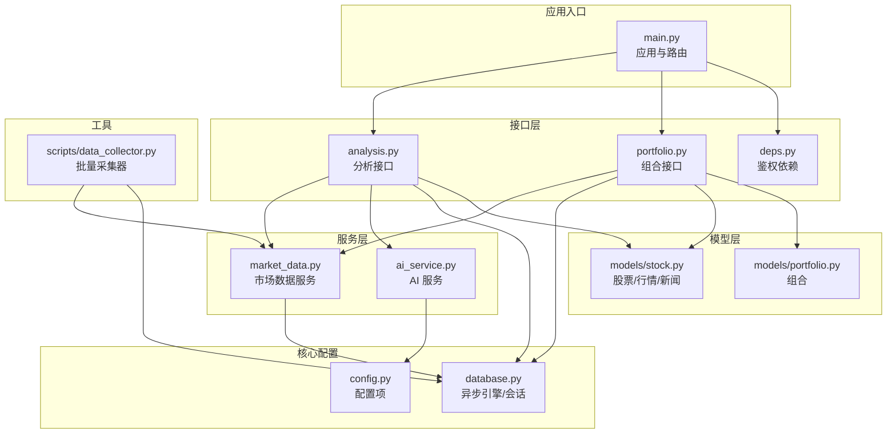
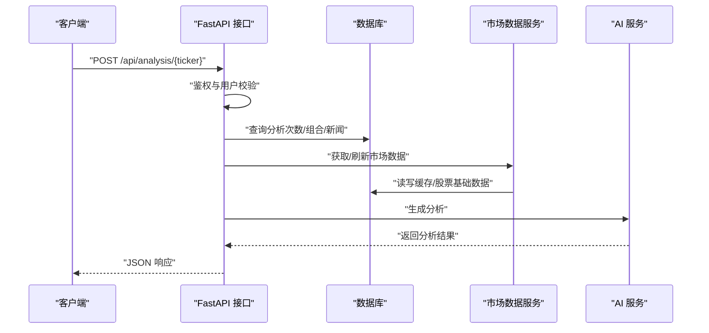
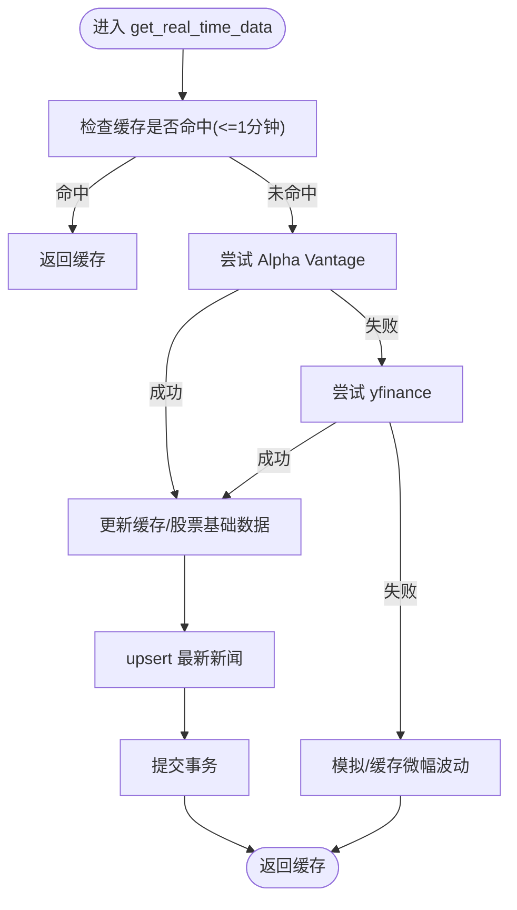
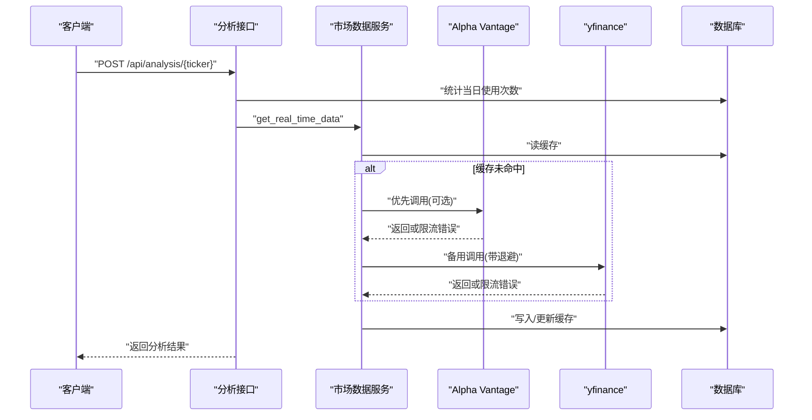
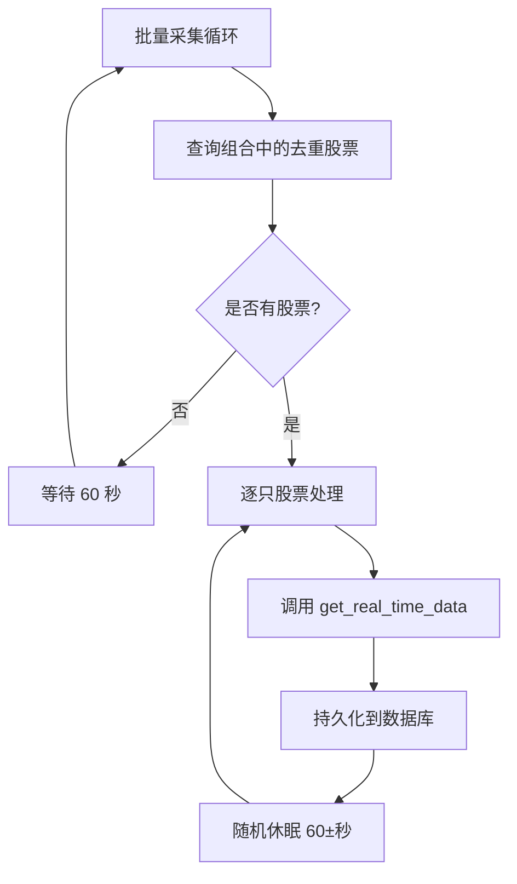
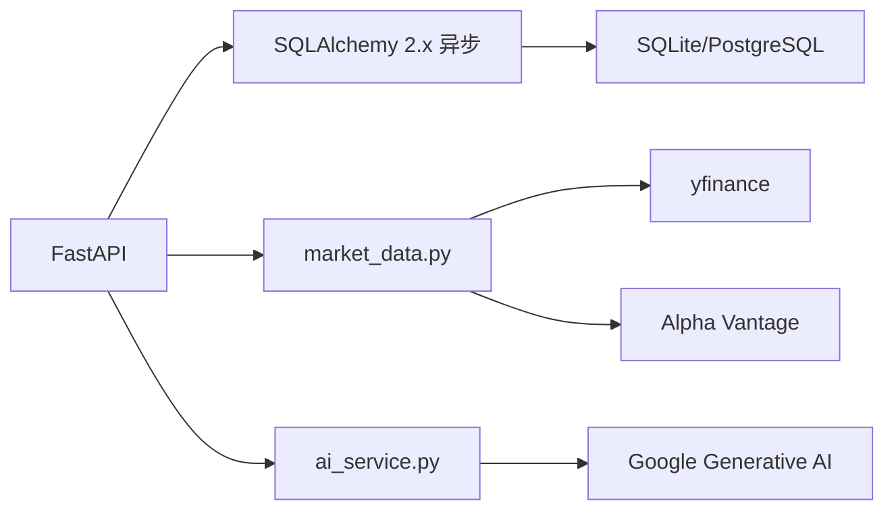

# 性能问题诊断

<cite>
**本文引用的文件**
- [backend/app/main.py](file://backend/app/main.py)
- [backend/app/core/database.py](file://backend/app/core/database.py)
- [backend/app/core/config.py](file://backend/app/core/config.py)
- [backend/app/api/analysis.py](file://backend/app/api/analysis.py)
- [backend/app/api/portfolio.py](file://backend/app/api/portfolio.py)
- [backend/app/api/deps.py](file://backend/app/api/deps.py)
- [backend/app/services/market_data.py](file://backend/app/services/market_data.py)
- [backend/app/services/ai_service.py](file://backend/app/services/ai_service.py)
- [backend/app/models/stock.py](file://backend/app/models/stock.py)
- [backend/app/models/portfolio.py](file://backend/app/models/portfolio.py)
- [backend/scripts/data_collector.py](file://backend/scripts/data_collector.py)
- [backend/requirements.txt](file://backend/requirements.txt)
</cite>

## 目录
1. [简介](#简介)
2. [项目结构](#项目结构)
3. [核心组件](#核心组件)
4. [架构总览](#架构总览)
5. [详细组件分析](#详细组件分析)
6. [依赖分析](#依赖分析)
7. [性能考量](#性能考量)
8. [故障排查指南](#故障排查指南)
9. [结论](#结论)
10. [附录](#附录)

## 简介
本指南聚焦于本项目的性能问题诊断与优化，围绕以下关键领域展开：
- 数据库查询缓慢：索引优化、查询计划分析、连接与事务管理
- API 响应延迟：请求耗时分析、瓶颈定位、外部依赖调用
- 内存使用：缓存策略、资源释放、对象生命周期
- 并发处理：线程池与异步模型、异步批处理、外部 API 限流
- 性能监控：数据库查询日志、API 响应时间统计
- 批量数据处理：分页查询、异步批处理、数据采集器策略

## 项目结构
后端采用 FastAPI + SQLAlchemy 2.x 异步 ORM 架构，核心模块职责清晰：
- 应用入口与路由：FastAPI 应用、CORS、路由挂载
- 数据访问层：异步引擎、会话工厂、基础模型定义
- 业务接口：分析、组合、认证、用户等 API
- 服务层：市场数据服务、AI 服务
- 模型层：股票、行情缓存、新闻、组合等
- 工具脚本：批量数据采集器

图表来源
- [backend/app/main.py](file://backend/app/main.py#L1-L38)
- [backend/app/core/database.py](file://backend/app/core/database.py#L1-L24)
- [backend/app/core/config.py](file://backend/app/core/config.py#L1-L24)
- [backend/app/api/analysis.py](file://backend/app/api/analysis.py#L1-L124)
- [backend/app/api/portfolio.py](file://backend/app/api/portfolio.py#L1-L297)
- [backend/app/api/deps.py](file://backend/app/api/deps.py#L1-L44)
- [backend/app/services/market_data.py](file://backend/app/services/market_data.py#L1-L370)
- [backend/app/services/ai_service.py](file://backend/app/services/ai_service.py#L1-L112)
- [backend/app/models/stock.py](file://backend/app/models/stock.py#L1-L85)
- [backend/app/models/portfolio.py](file://backend/app/models/portfolio.py#L1-L26)
- [backend/scripts/data_collector.py](file://backend/scripts/data_collector.py#L1-L62)

章节来源
- [backend/app/main.py](file://backend/app/main.py#L1-L38)
- [backend/app/core/database.py](file://backend/app/core/database.py#L1-L24)
- [backend/app/core/config.py](file://backend/app/core/config.py#L1-L24)

## 核心组件
- 应用入口与路由：定义 CORS、挂载各模块路由、健康检查端点
- 数据库层：异步 SQLite/PostgreSQL 引擎、AsyncSession、Base
- 接口层：分析接口（多步骤聚合）、组合接口（联表查询、刷新策略）
- 服务层：市场数据服务（多源、缓存、限流）、AI 服务（Gemini）
- 模型层：股票、行情缓存、新闻、组合；部分字段具备索引
- 工具脚本：批量采集器（定时、限速、持久化）

章节来源
- [backend/app/api/analysis.py](file://backend/app/api/analysis.py#L1-L124)
- [backend/app/api/portfolio.py](file://backend/app/api/portfolio.py#L1-L297)
- [backend/app/services/market_data.py](file://backend/app/services/market_data.py#L1-L370)
- [backend/app/services/ai_service.py](file://backend/app/services/ai_service.py#L1-L112)
- [backend/app/models/stock.py](file://backend/app/models/stock.py#L1-L85)
- [backend/app/models/portfolio.py](file://backend/app/models/portfolio.py#L1-L26)
- [backend/scripts/data_collector.py](file://backend/scripts/data_collector.py#L1-L62)

## 架构总览
系统通过 FastAPI 提供 REST 接口，业务流程通常包含：
- 鉴权与用户上下文获取
- 数据访问层查询/更新
- 外部数据源拉取与缓存
- AI 生成分析结果
- 返回响应

图表来源
- [backend/app/api/analysis.py](file://backend/app/api/analysis.py#L13-L124)
- [backend/app/services/market_data.py](file://backend/app/services/market_data.py#L14-L170)
- [backend/app/services/ai_service.py](file://backend/app/services/ai_service.py#L43-L112)
- [backend/app/core/database.py](file://backend/app/core/database.py#L21-L24)

## 详细组件分析

### 数据库查询与缓存优化
- 查询路径
  - 分析接口：统计当日使用次数、查询新闻、查询组合
  - 组合接口：联表查询组合、缓存与股票基础数据
  - 市场数据服务：缓存命中/失效、多源拉取、批量写入
- 关键优化点
  - 缓存命中窗口：1 分钟内直接返回缓存，避免重复外部调用
  - 联表查询：组合接口一次性联表获取，减少往返
  - 批量写入：新闻入库使用 SQLite upsert，避免重复
  - 事务边界：按需提交，避免长事务占用
- 索引建议
  - 表“stock_news”：按“ticker”建立索引，加速新闻查询
  - 表“market_data_cache”：按“ticker”主键，按“last_updated”建立索引，加速刷新与过期扫描
  - 表“portfolios”：按“user_id”与“ticker”复合索引，加速组合查询与唯一约束
  - 表“analysis”：按“user_id + created_at”建立索引，加速当日使用次数统计

图表来源
- [backend/app/services/market_data.py](file://backend/app/services/market_data.py#L14-L170)
- [backend/app/models/stock.py](file://backend/app/models/stock.py#L69-L85)

章节来源
- [backend/app/api/analysis.py](file://backend/app/api/analysis.py#L38-L50)
- [backend/app/api/analysis.py](file://backend/app/api/analysis.py#L84-L88)
- [backend/app/api/analysis.py](file://backend/app/api/analysis.py#L92-L94)
- [backend/app/api/portfolio.py](file://backend/app/api/portfolio.py#L152-L174)
- [backend/app/models/stock.py](file://backend/app/models/stock.py#L69-L85)

### API 响应延迟排查
- 请求耗时分析
  - 接口：分析接口、组合接口
  - 关键链路：鉴权、数据库查询、外部数据源调用、AI 生成
- 瓶颈定位
  - 外部 API 限流：yfinance 对 429 有指数退避与随机抖动
  - 事务与锁：批量刷新时顺序执行，避免并发冲突
  - 缓存命中：提升缓存命中率可显著降低外部调用
- 优化建议
  - 在网关或中间件层增加请求耗时埋点
  - 对外部调用设置合理超时与重试
  - 对热点数据进行预热与缓存

图表来源
- [backend/app/api/analysis.py](file://backend/app/api/analysis.py#L13-L124)
- [backend/app/services/market_data.py](file://backend/app/services/market_data.py#L29-L57)
- [backend/app/services/market_data.py](file://backend/app/services/market_data.py#L173-L318)

章节来源
- [backend/app/api/analysis.py](file://backend/app/api/analysis.py#L13-L124)
- [backend/app/api/portfolio.py](file://backend/app/api/portfolio.py#L162-L174)
- [backend/app/services/market_data.py](file://backend/app/services/market_data.py#L173-L318)

### 内存使用优化
- 缓存策略
  - 行情缓存：1 分钟内复用，避免重复计算与网络请求
  - 新闻缓存：upsert 去重，避免重复写入
- 资源释放
  - 异步会话按需创建与销毁，避免长生命周期持有
  - 批量写入后及时提交，释放 ORM 状态
- 对象生命周期
  - 仅在必要时构造大对象（如历史行情 DataFrame），计算完成后尽快丢弃
  - 控制返回数据大小，避免一次性返回过多字段

章节来源
- [backend/app/services/market_data.py](file://backend/app/services/market_data.py#L21-L24)
- [backend/app/services/market_data.py](file://backend/app/services/market_data.py#L150-L168)
- [backend/app/core/database.py](file://backend/app/core/database.py#L21-L24)

### 并发处理与异步优化
- 异步模型
  - FastAPI + SQLAlchemy 2.x 异步引擎，适合高并发 I/O 密集场景
- 线程池与外部调用
  - 使用事件循环与线程池执行阻塞调用（如 yfinance），避免阻塞事件循环
- 批量处理
  - 组合刷新：顺序执行，避免并发写入导致的会话冲突
  - 数据采集器：强制间隔 60±秒，保护外部 API 与 IP 安全

图表来源
- [backend/scripts/data_collector.py](file://backend/scripts/data_collector.py#L16-L56)
- [backend/app/services/market_data.py](file://backend/app/services/market_data.py#L14-L170)

章节来源
- [backend/app/api/portfolio.py](file://backend/app/api/portfolio.py#L162-L174)
- [backend/scripts/data_collector.py](file://backend/scripts/data_collector.py#L16-L56)

### 性能监控与观测性
- 数据库查询日志
  - 引擎初始化时开启 echo，便于开发阶段观察 SQL 与执行计划
- API 响应时间统计
  - 在中间件或路由装饰器中记录请求开始/结束时间，统计 P50/P95/P99
- 外部依赖观测
  - 记录外部 API 调用耗时、成功率、错误类型（如 429）
- 建议指标
  - 数据库：慢查询阈值、连接池利用率、事务平均时长
  - 接口：P50/P95/P99 响应时间、错误率、外部依赖耗时分布
  - 缓存：命中率、淘汰率、平均 TTL

章节来源
- [backend/app/core/database.py](file://backend/app/core/database.py#L5-L9)
- [backend/app/services/market_data.py](file://backend/app/services/market_data.py#L305-L310)

### 批量数据处理优化
- 分页查询
  - 搜索接口使用 limit 控制返回数量，避免一次性返回大量数据
- 异步批处理
  - 组合刷新：顺序执行，确保一致性
  - 数据采集器：固定间隔与随机抖动，避免被限流
- 数据持久化
  - upsert 去重，减少重复写入
  - 批量写入后及时提交，缩短锁持有时间

章节来源
- [backend/app/api/portfolio.py](file://backend/app/api/portfolio.py#L68-L140)
- [backend/app/api/portfolio.py](file://backend/app/api/portfolio.py#L162-L174)
- [backend/scripts/data_collector.py](file://backend/scripts/data_collector.py#L16-L56)

## 依赖分析
- 外部依赖
  - FastAPI、SQLAlchemy 2.x 异步、google-generativeai、yfinance、requests
- 运行时注意
  - SQLite 作为默认数据库，适合开发与小规模生产；生产建议 PostgreSQL + 连接池
  - Gemini API Key 为空时，AI 功能降级为模拟输出

图表来源
- [backend/requirements.txt](file://backend/requirements.txt#L1-L75)
- [backend/app/services/market_data.py](file://backend/app/services/market_data.py#L1-L10)
- [backend/app/services/ai_service.py](file://backend/app/services/ai_service.py#L1-L6)

章节来源
- [backend/requirements.txt](file://backend/requirements.txt#L1-L75)

## 性能考量
- 数据库层
  - 使用异步引擎与连接池，避免阻塞
  - 为高频查询字段建立索引，减少全表扫描
  - 控制事务范围，避免长时间持有锁
- 接口层
  - 合理拆分查询，减少 N+1 查询
  - 对热点数据进行缓存与预热
- 服务层
  - 外部调用设置超时与重试，实现指数退避
  - 优先使用更快的数据源，失败时切换备用源
- 并发与批处理
  - 使用事件循环与线程池隔离阻塞调用
  - 批量任务加节流，避免触发外部限流

## 故障排查指南
- 数据库查询缓慢
  - 开启 SQL 日志，确认是否命中索引
  - 分析慢查询：是否存在全表扫描、缺少合适的索引
  - 检查事务与锁：是否存在长事务、死锁或竞争
- API 响应延迟
  - 统计端点耗时，定位具体环节（鉴权、DB、外部调用、AI）
  - 观察外部 API 错误码（如 429），调整退避策略
- 内存使用过高
  - 检查缓存大小与 TTL，避免无限增长
  - 确认对象生命周期，避免泄漏
- 并发问题
  - 检查线程池配置与任务调度
  - 批量任务是否正确加锁与节流

章节来源
- [backend/app/core/database.py](file://backend/app/core/database.py#L5-L9)
- [backend/app/services/market_data.py](file://backend/app/services/market_data.py#L305-L310)
- [backend/app/api/analysis.py](file://backend/app/api/analysis.py#L27-L50)

## 结论
本项目在异步与缓存方面已有良好基础，建议重点围绕“索引优化、外部限流退避、连接池与事务管理、观测性指标”四个方面持续改进，以获得更稳健的性能表现。

## 附录
- 快速检查清单
  - 是否为高频查询字段添加索引？
  - 外部调用是否设置了合理的超时与退避？
  - 是否开启了数据库 SQL 日志以便分析？
  - 是否对热点数据进行了缓存与预热？
  - 是否对批量任务施加了节流与幂等处理？