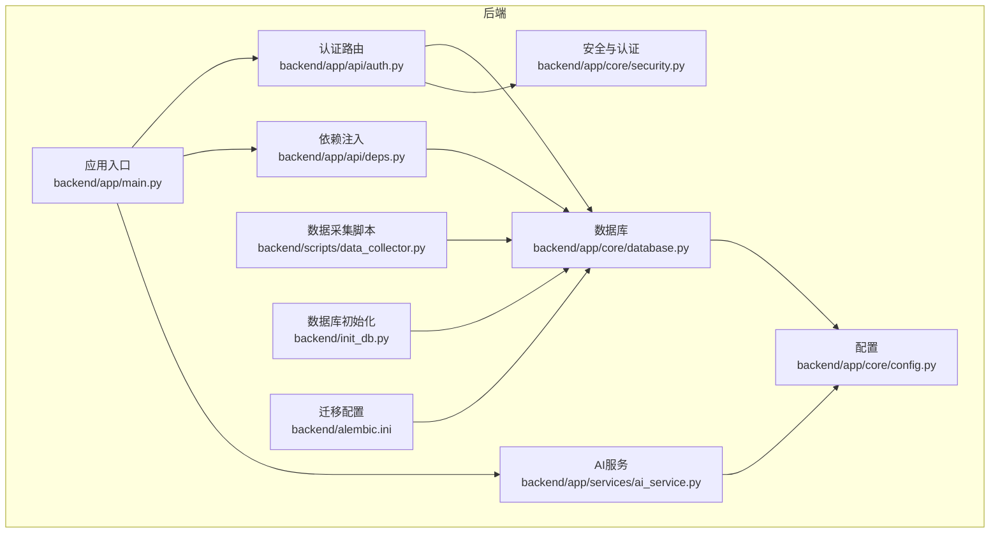
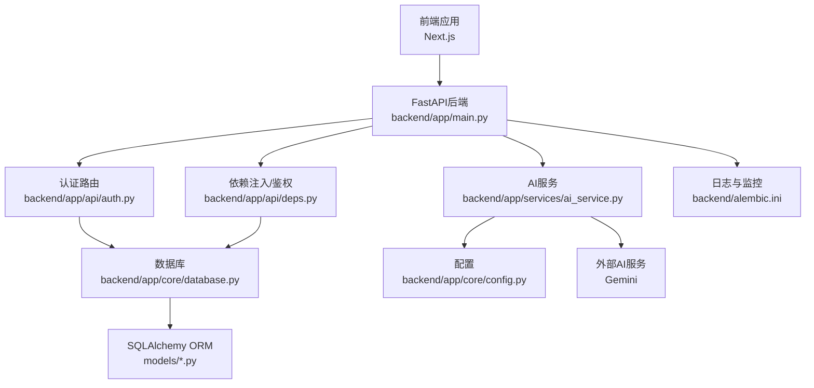
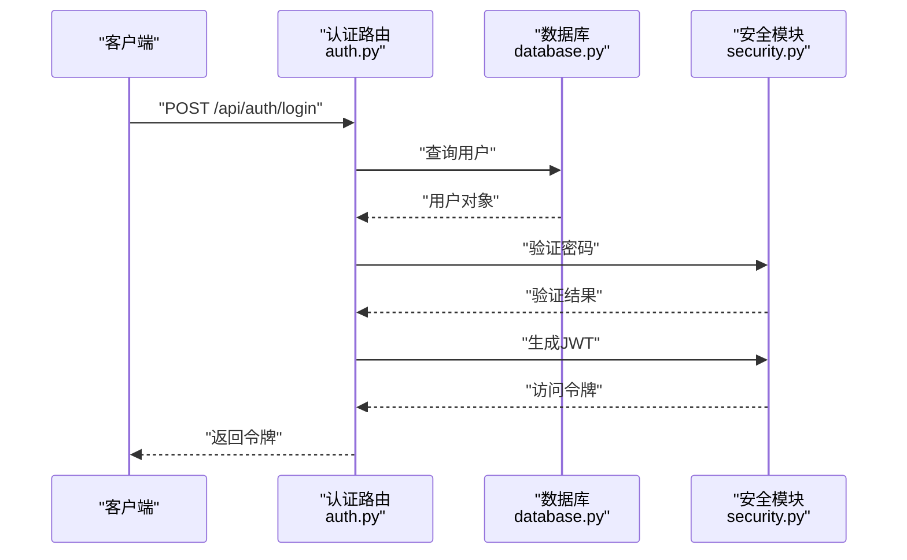
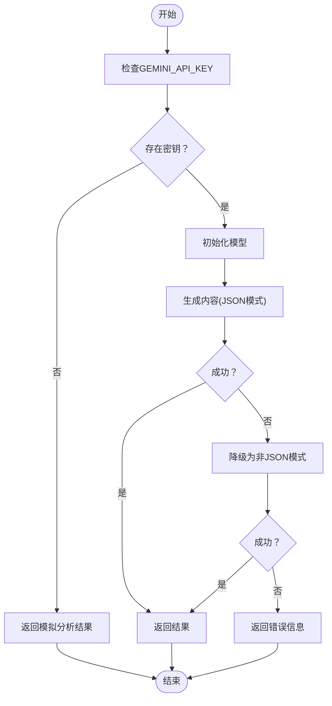
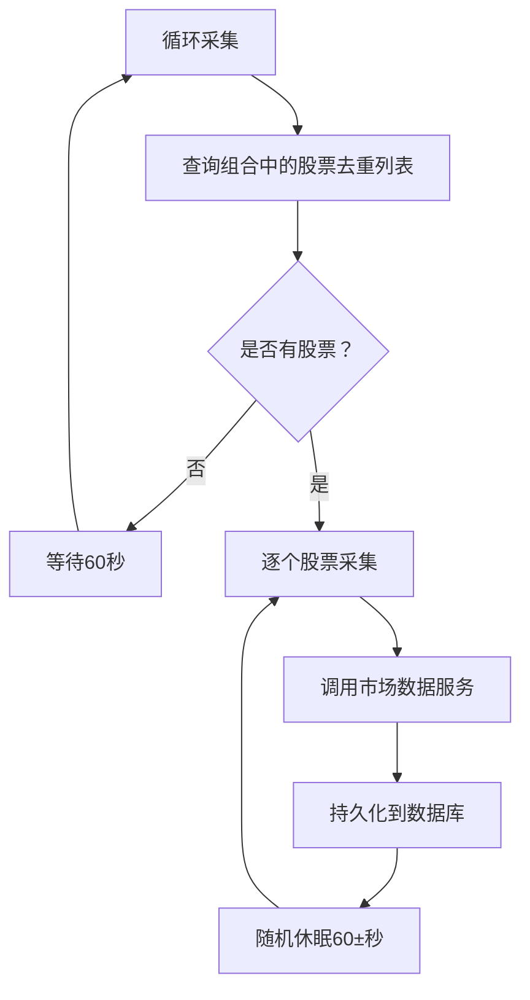
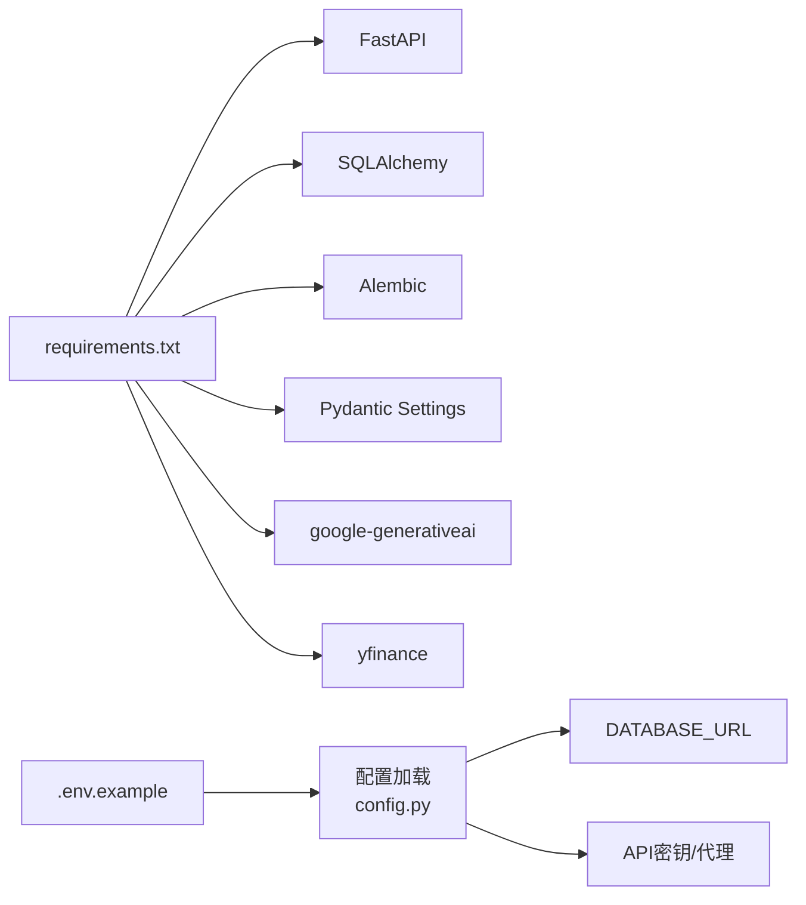

# 故障排除指南

<cite>
**本文引用的文件**
- [backend/app/main.py](file://backend/app/main.py)
- [backend/app/core/config.py](file://backend/app/core/config.py)
- [backend/app/core/database.py](file://backend/app/core/database.py)
- [backend/app/core/security.py](file://backend/app/core/security.py)
- [backend/app/api/auth.py](file://backend/app/api/auth.py)
- [backend/app/api/deps.py](file://backend/app/api/deps.py)
- [backend/app/models/user.py](file://backend/app/models/user.py)
- [backend/app/models/stock.py](file://backend/app/models/stock.py)
- [backend/app/services/ai_service.py](file://backend/app/services/ai_service.py)
- [backend/requirements.txt](file://backend/requirements.txt)
- [.env.example](file://.env.example)
- [backend/migrations/versions/35a834f440ba_baseline.py](file://backend/migrations/versions/35a834f440ba_baseline.py)
- [backend/scripts/data_collector.py](file://backend/scripts/data_collector.py)
- [backend/init_db.py](file://backend/init_db.py)
- [backend/alembic.ini](file://backend/alembic.ini)
- [doc/Database Schema & Data Flow Specification.md](file://doc/Database Schema & Data Flow Specification.md)
</cite>

## 目录
1. [简介](#简介)
2. [项目结构](#项目结构)
3. [核心组件](#核心组件)
4. [架构总览](#架构总览)
5. [详细组件分析](#详细组件分析)
6. [依赖关系分析](#依赖关系分析)
7. [性能考虑](#性能考虑)
8. [故障排除指南](#故障排除指南)
9. [结论](#结论)
10. [附录](#附录)

## 简介
本指南面向运维与开发人员，围绕环境配置、依赖冲突、权限与认证、数据库与缓存、网络与外部API、AI服务集成、性能瓶颈、网络连接限制、数据同步一致性、系统监控与告警以及回滚与恢复策略，提供系统化的诊断与修复流程。文档基于实际代码与配置进行分析，确保可操作性与可追溯性。

## 项目结构
后端采用FastAPI + SQLAlchemy异步ORM + Alembic迁移的分层架构，前端为Next.js应用。核心模块包括：
- 应用入口与路由：FastAPI应用、CORS中间件、健康检查端点
- 配置管理：从环境变量读取数据库URL、安全密钥、外部API密钥与代理设置
- 数据库与会话：异步引擎、会话工厂、基础模型定义
- 安全与认证：密码哈希、JWT令牌生成与校验、OAuth2 Bearer令牌验证
- 路由与依赖：认证、用户、投资组合、分析接口；通用依赖注入与当前用户解析
- AI服务：Gemini模型调用、降级与错误处理
- 数据采集：定时拉取市场数据、防限流策略
- 迁移与初始化：Alembic迁移、种子数据初始化

图表来源
- [backend/app/main.py](file://backend/app/main.py#L1-L38)
- [backend/app/core/config.py](file://backend/app/core/config.py#L1-L24)
- [backend/app/core/database.py](file://backend/app/core/database.py#L1-L24)
- [backend/app/core/security.py](file://backend/app/core/security.py#L1-L26)
- [backend/app/api/auth.py](file://backend/app/api/auth.py#L1-L88)
- [backend/app/api/deps.py](file://backend/app/api/deps.py#L1-L44)
- [backend/app/services/ai_service.py](file://backend/app/services/ai_service.py#L1-L112)
- [backend/scripts/data_collector.py](file://backend/scripts/data_collector.py#L1-L62)
- [backend/init_db.py](file://backend/init_db.py#L1-L85)
- [backend/alembic.ini](file://backend/alembic.ini#L124-L147)

章节来源
- [backend/app/main.py](file://backend/app/main.py#L1-L38)
- [backend/app/core/config.py](file://backend/app/core/config.py#L1-L24)
- [backend/app/core/database.py](file://backend/app/core/database.py#L1-L24)
- [backend/app/core/security.py](file://backend/app/core/security.py#L1-L26)
- [backend/app/api/auth.py](file://backend/app/api/auth.py#L1-L88)
- [backend/app/api/deps.py](file://backend/app/api/deps.py#L1-L44)
- [backend/app/services/ai_service.py](file://backend/app/services/ai_service.py#L1-L112)
- [backend/scripts/data_collector.py](file://backend/scripts/data_collector.py#L1-L62)
- [backend/init_db.py](file://backend/init_db.py#L1-L85)
- [backend/alembic.ini](file://backend/alembic.ini#L124-L147)

## 核心组件
- 应用入口与路由
  - 定义FastAPI实例、CORS白名单、路由挂载与健康检查端点
  - 关键路径参考：[backend/app/main.py](file://backend/app/main.py#L1-L38)
- 配置管理
  - 从.env加载数据库URL、密钥、算法、外部API密钥与代理
  - 关键路径参考：[backend/app/core/config.py](file://backend/app/core/config.py#L1-L24)、[.env.example](file://.env.example#L1-L9)
- 数据库与会话
  - 异步引擎、AsyncSession工厂、Base基类、依赖注入get_db
  - 关键路径参考：[backend/app/core/database.py](file://backend/app/core/database.py#L1-L24)
- 安全与认证
  - 密码哈希/校验、JWT生成、OAuth2 Bearer令牌解析
  - 关键路径参考：[backend/app/core/security.py](file://backend/app/core/security.py#L1-L26)、[backend/app/api/deps.py](file://backend/app/api/deps.py#L1-L44)
- 路由与模型
  - 认证注册/登录、用户模型与枚举字段
  - 关键路径参考：[backend/app/api/auth.py](file://backend/app/api/auth.py#L1-L88)、[backend/app/models/user.py](file://backend/app/models/user.py#L1-L31)
- AI服务
  - Gemini模型调用、降级与错误处理、日志记录
  - 关键路径参考：[backend/app/services/ai_service.py](file://backend/app/services/ai_service.py#L1-L112)
- 数据采集与迁移
  - 采集器定时任务、防限流策略、数据库初始化与迁移
  - 关键路径参考：[backend/scripts/data_collector.py](file://backend/scripts/data_collector.py#L1-L62)、[backend/init_db.py](file://backend/init_db.py#L1-L85)、[backend/migrations/versions/35a834f440ba_baseline.py](file://backend/migrations/versions/35a834f440ba_baseline.py#L1-L33)

章节来源
- [backend/app/main.py](file://backend/app/main.py#L1-L38)
- [backend/app/core/config.py](file://backend/app/core/config.py#L1-L24)
- [backend/app/core/database.py](file://backend/app/core/database.py#L1-L24)
- [backend/app/core/security.py](file://backend/app/core/security.py#L1-L26)
- [backend/app/api/auth.py](file://backend/app/api/auth.py#L1-L88)
- [backend/app/api/deps.py](file://backend/app/api/deps.py#L1-L44)
- [backend/app/models/user.py](file://backend/app/models/user.py#L1-L31)
- [backend/app/services/ai_service.py](file://backend/app/services/ai_service.py#L1-L112)
- [backend/scripts/data_collector.py](file://backend/scripts/data_collector.py#L1-L62)
- [backend/init_db.py](file://backend/init_db.py#L1-L85)
- [backend/migrations/versions/35a834f440ba_baseline.py](file://backend/migrations/versions/35a834f440ba_baseline.py#L1-L33)

## 架构总览
下图展示从客户端到后端服务、数据库与外部AI服务的整体交互路径，以及关键的错误处理与降级策略。

图表来源
- [backend/app/main.py](file://backend/app/main.py#L1-L38)
- [backend/app/api/auth.py](file://backend/app/api/auth.py#L1-L88)
- [backend/app/api/deps.py](file://backend/app/api/deps.py#L1-L44)
- [backend/app/core/database.py](file://backend/app/core/database.py#L1-L24)
- [backend/app/core/config.py](file://backend/app/core/config.py#L1-L24)
- [backend/app/services/ai_service.py](file://backend/app/services/ai_service.py#L1-L112)
- [backend/alembic.ini](file://backend/alembic.ini#L124-L147)

## 详细组件分析

### 认证与安全组件
- 登录/注册流程
  - 登录：校验用户与密码，生成JWT访问令牌
  - 注册：检查邮箱唯一性，哈希密码并签发令牌
- 令牌验证
  - 通过OAuth2 Bearer解析JWT，解码并查询用户
- 密钥与算法
  - SECRET_KEY与ALGORITHM用于JWT签名与校验
- 错误处理
  - 认证失败、用户不存在、令牌无效均返回明确HTTP状态码

图表来源
- [backend/app/api/auth.py](file://backend/app/api/auth.py#L24-L50)
- [backend/app/core/security.py](file://backend/app/core/security.py#L11-L19)
- [backend/app/core/database.py](file://backend/app/core/database.py#L21-L23)

章节来源
- [backend/app/api/auth.py](file://backend/app/api/auth.py#L1-L88)
- [backend/app/core/security.py](file://backend/app/core/security.py#L1-L26)
- [backend/app/api/deps.py](file://backend/app/api/deps.py#L1-L44)
- [backend/app/models/user.py](file://backend/app/models/user.py#L1-L31)

### AI服务组件
- 配置与降级
  - 若未配置GEMINI_API_KEY，记录警告并返回模拟分析结果
  - 失败时尝试非JSON模式生成内容作为降级
- 日志记录
  - 对Gemini API错误进行记录，便于定位问题
- 错误处理
  - 返回可读的错误信息，避免前端崩溃

图表来源
- [backend/app/services/ai_service.py](file://backend/app/services/ai_service.py#L43-L112)

章节来源
- [backend/app/services/ai_service.py](file://backend/app/services/ai_service.py#L1-L112)

### 数据采集与缓存组件
- 采集策略
  - 每只股票采集后随机休眠60秒，避免触发外部API限流
- 缓存机制
  - MarketDataCache按ticker主键存储最新行情，超过一定时间间隔再刷新
- 数据一致性
  - 采集完成后写入数据库，供后续分析与展示使用

图表来源
- [backend/scripts/data_collector.py](file://backend/scripts/data_collector.py#L16-L56)
- [doc/Database Schema & Data Flow Specification.md](file://doc/Database Schema & Data Flow Specification.md#L48-L61)

章节来源
- [backend/scripts/data_collector.py](file://backend/scripts/data_collector.py#L1-L62)
- [doc/Database Schema & Data Flow Specification.md](file://doc/Database Schema & Data Flow Specification.md#L48-L61)

## 依赖关系分析
- Python依赖
  - FastAPI、SQLAlchemy、Alembic、Pydantic Settings、google-generativeai、yfinance等
- 配置与运行
  - 通过.env文件注入数据库URL、API密钥、代理与前端地址
- 日志与监控
  - Alembic配置控制SQLAlchemy与Alembic日志级别

图表来源
- [backend/requirements.txt](file://backend/requirements.txt#L1-L75)
- [.env.example](file://.env.example#L1-L9)
- [backend/app/core/config.py](file://backend/app/core/config.py#L1-L24)

章节来源
- [backend/requirements.txt](file://backend/requirements.txt#L1-L75)
- [.env.example](file://.env.example#L1-L9)
- [backend/alembic.ini](file://backend/alembic.ini#L124-L147)

## 性能考虑
- 数据库性能
  - 使用异步引擎与会话，减少阻塞
  - 建议为高频查询列建立索引（如MarketDataCache.last_updated）
- 缓存策略
  - MarketDataCache作为热点数据缓存，降低外部API调用频率
- AI调用
  - 在密钥缺失或失败时启用降级，保证服务可用性
- 数据采集
  - 采集器内置防限流休眠，避免触发外部服务限流

章节来源
- [backend/app/core/database.py](file://backend/app/core/database.py#L1-L24)
- [doc/Database Schema & Data Flow Specification.md](file://doc/Database Schema & Data Flow Specification.md#L48-L61)
- [backend/app/services/ai_service.py](file://backend/app/services/ai_service.py#L1-L112)
- [backend/scripts/data_collector.py](file://backend/scripts/data_collector.py#L1-L62)

## 故障排除指南

### 环境配置问题
- 症状
  - 应用启动报错、无法连接数据库、认证失败
- 排查步骤
  - 检查.env文件是否完整，确认DATABASE_URL、GEMINI_API_KEY、DEEPSEEK_API_KEY、SECRET_KEY、NEXT_PUBLIC_API_URL
  - 确认FastAPI CORS白名单包含前端地址
  - 验证数据库URL格式与可达性
- 解决方案
  - 补充缺失的环境变量
  - 如使用SQLite，请确认文件路径与权限
  - 更新CORS允许的源列表

章节来源
- [.env.example](file://.env.example#L1-L9)
- [backend/app/main.py](file://backend/app/main.py#L9-L22)
- [backend/app/core/config.py](file://backend/app/core/config.py#L6-L17)

### 依赖冲突与安装问题
- 症状
  - 启动时报错找不到模块、版本不兼容
- 排查步骤
  - 对照requirements.txt核对已安装包版本
  - 清理虚拟环境后重新安装
- 解决方案
  - 固定版本并使用隔离环境
  - 避免系统Python与项目依赖冲突

章节来源
- [backend/requirements.txt](file://backend/requirements.txt#L1-L75)

### 权限错误
- 症状
  - 文件写入失败、数据库文件不可写、迁移执行失败
- 排查步骤
  - 检查数据库文件所在目录权限
  - 确认运行用户对工作目录有读写权限
- 解决方案
  - 修改目录权限或切换到有权限的用户
  - 使用相对路径或明确的绝对路径

章节来源
- [backend/app/core/config.py](file://backend/app/core/config.py#L6-L7)
- [backend/init_db.py](file://backend/init_db.py#L61-L81)

### 认证与授权问题
- 症状
  - 登录失败、令牌无效、接口返回403/404
- 排查步骤
  - 检查用户是否存在、密码是否正确
  - 校验JWT密钥与算法配置
  - 查看依赖注入中令牌解析日志
- 解决方案
  - 重新注册用户或修正密码
  - 确保SECRET_KEY一致且未泄露
  - 检查OAuth2 tokenUrl与令牌格式

章节来源
- [backend/app/api/auth.py](file://backend/app/api/auth.py#L24-L50)
- [backend/app/api/deps.py](file://backend/app/api/deps.py#L17-L43)
- [backend/app/core/security.py](file://backend/app/core/security.py#L11-L19)

### 数据库与迁移问题
- 症状
  - 表不存在、迁移失败、模型不匹配
- 排查步骤
  - 使用Alembic查看当前版本与目标版本
  - 检查迁移脚本是否被修改或冲突
  - 确认数据库引擎与驱动支持
- 解决方案
  - 执行升级/降级到目标版本
  - 如需回滚，先备份数据库再执行降级
  - 初始化数据库后重新迁移

章节来源
- [backend/migrations/versions/35a834f440ba_baseline.py](file://backend/migrations/versions/35a834f440ba_baseline.py#L21-L32)
- [backend/init_db.py](file://backend/init_db.py#L61-L81)
- [backend/alembic.ini](file://backend/alembic.ini#L124-L147)

### 性能问题（慢查询与高延迟）
- 症状
  - 接口响应缓慢、数据库查询耗时长
- 排查步骤
  - 开启SQLAlchemy echo或日志，定位慢查询
  - 检查MarketDataCache命中率与last_updated策略
  - 分析AI服务调用耗时与降级路径
- 解决方案
  - 优化查询条件与索引
  - 提升缓存命中率，缩短刷新周期
  - 限制并发与批量处理，必要时引入队列

章节来源
- [backend/app/core/database.py](file://backend/app/core/database.py#L5-L9)
- [doc/Database Schema & Data Flow Specification.md](file://doc/Database Schema & Data Flow Specification.md#L48-L61)
- [backend/app/services/ai_service.py](file://backend/app/services/ai_service.py#L96-L112)
- [backend/alembic.ini](file://backend/alembic.ini#L124-L147)

### 网络连接与API限流
- 症状
  - 外部API调用失败、频繁超时、被限流
- 排查步骤
  - 检查HTTP_PROXY配置（如需）
  - 观察采集器休眠策略是否生效
  - 分析外部服务状态与配额
- 解决方案
  - 合理设置请求间隔与重试退避
  - 使用代理或更换数据源
  - 升级外部服务配额或订阅计划

章节来源
- [backend/app/core/config.py](file://backend/app/core/config.py#L17-L17)
- [backend/scripts/data_collector.py](file://backend/scripts/data_collector.py#L47-L51)

### 数据同步与缓存一致性
- 症状
  - 展示数据陈旧、缓存未更新、分析结果不一致
- 排查步骤
  - 检查MarketDataCache的last_updated是否过期
  - 确认采集器是否正常运行
  - 核对Portfolio与Stock关联是否正确
- 解决方案
  - 缩短缓存有效期或主动刷新
  - 重启采集器或手动触发一次全量更新
  - 清理脏数据后重建缓存

章节来源
- [doc/Database Schema & Data Flow Specification.md](file://doc/Database Schema & Data Flow Specification.md#L48-L61)
- [backend/scripts/data_collector.py](file://backend/scripts/data_collector.py#L16-L56)

### AI服务集成问题
- 症状
  - API密钥错误、模型调用失败、返回非预期格式
- 排查步骤
  - 检查GEMINI_API_KEY是否配置
  - 查看AI服务日志中的错误信息
  - 尝试禁用JSON模式回退
- 解决方案
  - 补充或轮换有效密钥
  - 降级为非JSON模式继续使用
  - 更换模型或调整提示词

章节来源
- [backend/app/services/ai_service.py](file://backend/app/services/ai_service.py#L14-L18)
- [backend/app/services/ai_service.py](file://backend/app/services/ai_service.py#L103-L112)

### 系统监控与告警配置
- 建议
  - 使用日志级别与输出配置（Alembic控制SQLAlchemy与Alembic日志）
  - 在生产环境开启结构化日志与错误追踪
  - 设置关键指标（响应时间、错误率、缓存命中率、外部API成功率）
- 参考
  - Alembic日志配置位置

章节来源
- [backend/alembic.ini](file://backend/alembic.ini#L124-L147)

### 回滚与恢复策略
- 数据库迁移失败
  - 备份数据库后执行降级到上一个稳定版本
  - 检查迁移脚本差异，修复后再升级
- 应用回滚
  - 使用版本控制回退到上一个稳定提交
  - 保持配置与环境变量一致
- 数据恢复
  - 基于备份恢复数据库
  - 重新初始化种子数据与缓存

章节来源
- [backend/migrations/versions/35a834f440ba_baseline.py](file://backend/migrations/versions/35a834f440ba_baseline.py#L21-L32)
- [backend/init_db.py](file://backend/init_db.py#L61-L81)

## 结论
本指南提供了从环境配置、依赖管理、认证授权、数据库与缓存、网络与外部API、AI服务集成到性能优化、监控告警与回滚恢复的全流程故障排除方法。建议在生产环境中结合日志与监控体系，持续观察关键指标，提前发现并解决问题，保障系统的稳定性与可用性。

## 附录
- 健康检查端点：/health
- 认证端点：/api/auth/login、/api/auth/register
- 常用配置项：DATABASE_URL、GEMINI_API_KEY、DEEPSEEK_API_KEY、SECRET_KEY、NEXT_PUBLIC_API_URL

章节来源
- [backend/app/main.py](file://backend/app/main.py#L31-L37)
- [backend/app/api/auth.py](file://backend/app/api/auth.py#L24-L87)
- [.env.example](file://.env.example#L1-L9)