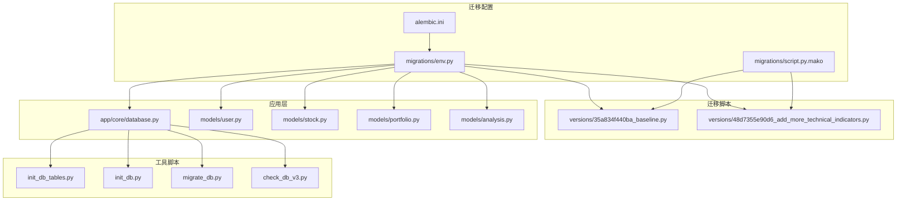
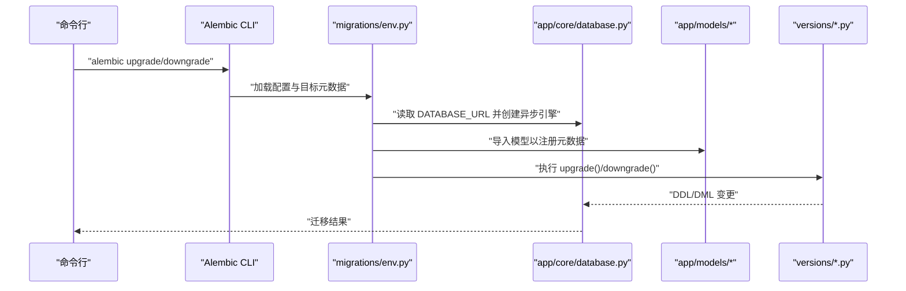
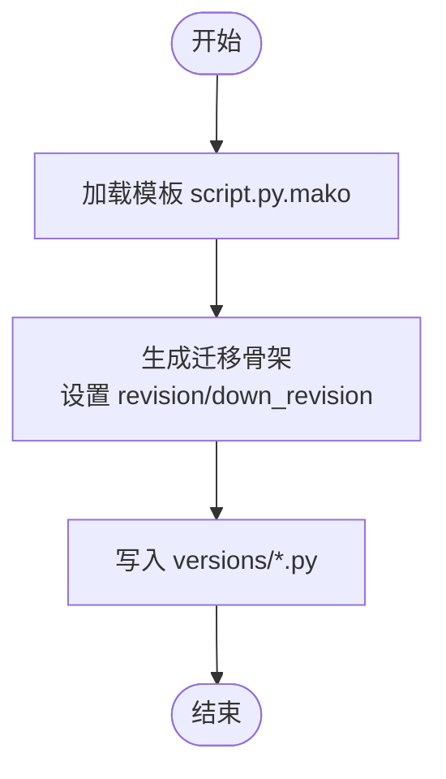
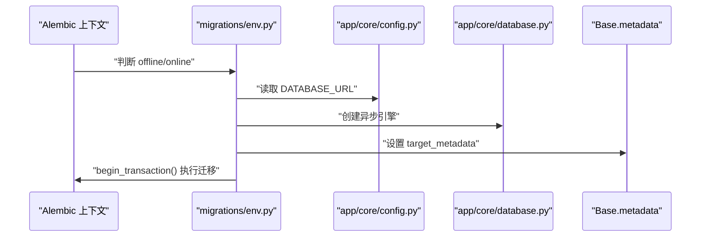
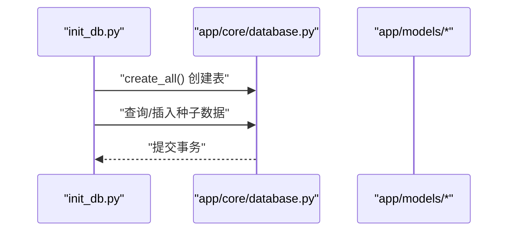
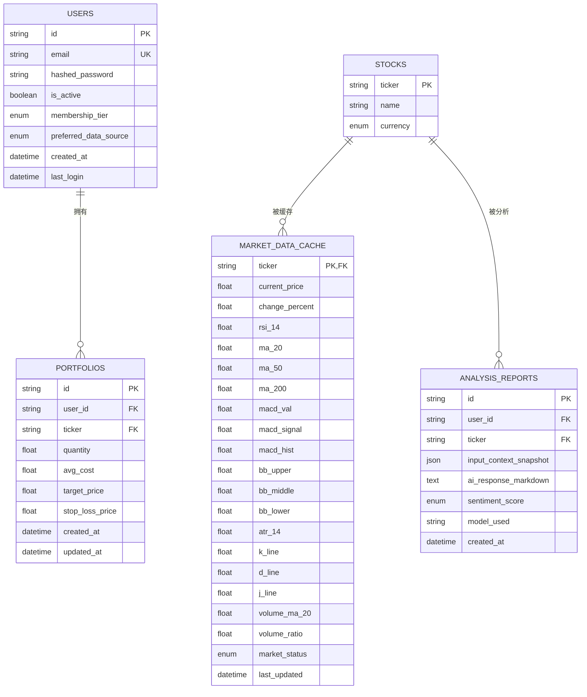
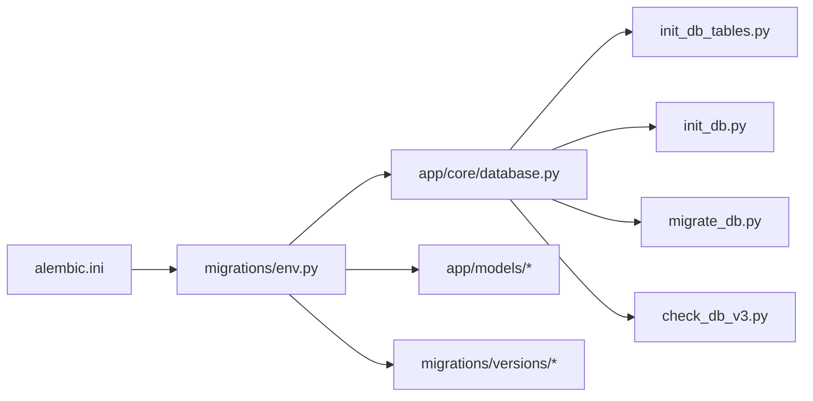

# 数据库迁移问题

<cite>
**本文引用的文件**
- [backend/migrations/versions/35a834f440ba_baseline.py](file://backend/migrations/versions/35a834f440ba_baseline.py)
- [backend/migrations/versions/48d7355e90d6_add_more_technical_indicators.py](file://backend/migrations/versions/48d7355e90d6_add_more_technical_indicators.py)
- [backend/migrations/env.py](file://backend/migrations/env.py)
- [backend/alembic.ini](file://backend/alembic.ini)
- [backend/migrations/script.py.mako](file://backend/migrations/script.py.mako)
- [backend/init_db.py](file://backend/init_db.py)
- [backend/init_db_tables.py](file://backend/init_db_tables.py)
- [backend/migrate_db.py](file://backend/migrate_db.py)
- [backend/check_db_v3.py](file://backend/check_db_v3.py)
- [backend/app/core/database.py](file://backend/app/core/database.py)
- [backend/app/models/user.py](file://backend/app/models/user.py)
- [backend/app/models/stock.py](file://backend/app/models/stock.py)
- [backend/app/models/portfolio.py](file://backend/app/models/portfolio.py)
- [backend/app/models/analysis.py](file://backend/app/models/analysis.py)
</cite>

## 目录
1. [简介](#简介)
2. [项目结构](#项目结构)
3. [核心组件](#核心组件)
4. [架构总览](#架构总览)
5. [详细组件分析](#详细组件分析)
6. [依赖关系分析](#依赖关系分析)
7. [性能考量](#性能考量)
8. [故障排除指南](#故障排除指南)
9. [结论](#结论)
10. [附录](#附录)

## 简介
本指南聚焦于数据库迁移问题的系统化排查与修复，覆盖以下主题：
- Alembic 迁移失败的常见原因与解决方法（版本冲突、迁移脚本错误）
- 数据库初始化问题的诊断（表结构创建失败、约束冲突）
- 数据迁移回滚与恢复策略（备份与还原）
- 数据库锁等待与事务冲突的处理
- 版本升级过程中的兼容性问题排查
- 数据完整性检查与修复
- 迁移脚本调试与测试最佳实践

本指南结合项目中现有的 Alembic 配置、迁移脚本模板、数据库引擎与模型定义，提供可操作的排障步骤与图示。

## 项目结构
后端使用 SQLAlchemy 异步引擎与 Alembic 进行迁移管理；迁移脚本位于 migrations/versions，环境配置在 migrations/env.py，模板由 migrations/script.py.mako 提供；应用通过 app/core/database.py 暴露 engine 与 Base，模型定义在 app/models 下。

图表来源
- [backend/alembic.ini](file://backend/alembic.ini#L1-L148)
- [backend/migrations/env.py](file://backend/migrations/env.py#L1-L93)
- [backend/migrations/script.py.mako](file://backend/migrations/script.py.mako#L1-L29)
- [backend/migrations/versions/35a834f440ba_baseline.py](file://backend/migrations/versions/35a834f440ba_baseline.py#L1-L33)
- [backend/migrations/versions/48d7355e90d6_add_more_technical_indicators.py](file://backend/migrations/versions/48d7355e90d6_add_more_technical_indicators.py#L1-L47)
- [backend/app/core/database.py](file://backend/app/core/database.py#L1-L24)
- [backend/app/models/user.py](file://backend/app/models/user.py#L1-L31)
- [backend/app/models/stock.py](file://backend/app/models/stock.py#L1-L85)
- [backend/app/models/portfolio.py](file://backend/app/models/portfolio.py#L1-L26)
- [backend/app/models/analysis.py](file://backend/app/models/analysis.py#L1-L25)
- [backend/init_db_tables.py](file://backend/init_db_tables.py#L1-L16)
- [backend/init_db.py](file://backend/init_db.py#L1-L85)
- [backend/migrate_db.py](file://backend/migrate_db.py#L1-L30)
- [backend/check_db_v3.py](file://backend/check_db_v3.py#L1-L26)

章节来源
- [backend/alembic.ini](file://backend/alembic.ini#L1-L148)
- [backend/migrations/env.py](file://backend/migrations/env.py#L1-L93)
- [backend/app/core/database.py](file://backend/app/core/database.py#L1-L24)

## 核心组件
- 异步数据库引擎与会话：通过 app/core/database.py 创建异步引擎与 AsyncSession，用于迁移与业务访问。
- 模型定义：用户、股票、市场数据缓存、组合与分析报告等模型，定义了表结构与关系。
- Alembic 环境：migrations/env.py 将 Alembic 的上下文与应用的 Base、settings 绑定，支持在线/离线迁移。
- 迁移脚本模板：migrations/script.py.mako 生成标准迁移骨架，确保 revision、down_revision 等元信息正确。
- 初始化与工具脚本：init_db_tables.py、init_db.py、migrate_db.py、check_db_v3.py 提供快速建表、种子数据、列迁移与连接检查能力。

章节来源
- [backend/app/core/database.py](file://backend/app/core/database.py#L1-L24)
- [backend/app/models/user.py](file://backend/app/models/user.py#L1-L31)
- [backend/app/models/stock.py](file://backend/app/models/stock.py#L1-L85)
- [backend/app/models/portfolio.py](file://backend/app/models/portfolio.py#L1-L26)
- [backend/app/models/analysis.py](file://backend/app/models/analysis.py#L1-L25)
- [backend/migrations/env.py](file://backend/migrations/env.py#L1-L93)
- [backend/migrations/script.py.mako](file://backend/migrations/script.py.mako#L1-L29)
- [backend/init_db_tables.py](file://backend/init_db_tables.py#L1-L16)
- [backend/init_db.py](file://backend/init_db.py#L1-L85)
- [backend/migrate_db.py](file://backend/migrate_db.py#L1-L30)
- [backend/check_db_v3.py](file://backend/check_db_v3.py#L1-L26)

## 架构总览
下图展示从 Alembic 到数据库引擎与模型的调用链，以及迁移脚本与模板的关系。

图表来源
- [backend/migrations/env.py](file://backend/migrations/env.py#L1-L93)
- [backend/app/core/database.py](file://backend/app/core/database.py#L1-L24)
- [backend/migrations/versions/35a834f440ba_baseline.py](file://backend/migrations/versions/35a834f440ba_baseline.py#L1-L33)
- [backend/migrations/versions/48d7355e90d6_add_more_technical_indicators.py](file://backend/migrations/versions/48d7355e90d6_add_more_technical_indicators.py#L1-L47)

## 详细组件分析

### 迁移脚本模板与版本控制
- 模板 script.py.mako 生成标准迁移骨架，包含 revision、down_revision、branch_labels、depends_on 等元信息，确保版本链路清晰。
- baseline 脚本为空实现，作为初始版本；后续脚本通过 down_revision 指向前一版本，形成有序链路。

图表来源
- [backend/migrations/script.py.mako](file://backend/migrations/script.py.mako#L1-L29)
- [backend/migrations/versions/35a834f440ba_baseline.py](file://backend/migrations/versions/35a834f440ba_baseline.py#L1-L33)
- [backend/migrations/versions/48d7355e90d6_add_more_technical_indicators.py](file://backend/migrations/versions/48d7355e90d6_add_more_technical_indicators.py#L1-L47)

章节来源
- [backend/migrations/script.py.mako](file://backend/migrations/script.py.mako#L1-L29)
- [backend/migrations/versions/35a834f440ba_baseline.py](file://backend/migrations/versions/35a834f440ba_baseline.py#L1-L33)
- [backend/migrations/versions/48d7355e90d6_add_more_technical_indicators.py](file://backend/migrations/versions/48d7355e90d6_add_more_technical_indicators.py#L1-L47)

### Alembic 环境与数据库引擎集成
- env.py 从应用配置读取 DATABASE_URL，将 Alembic 上下文与 SQLAlchemy 异步引擎绑定，支持在线/离线迁移。
- 目标元数据来自 Base.metadata，确保模型变更同步到迁移脚本。

图表来源
- [backend/migrations/env.py](file://backend/migrations/env.py#L1-L93)
- [backend/app/core/database.py](file://backend/app/core/database.py#L1-L24)

章节来源
- [backend/migrations/env.py](file://backend/migrations/env.py#L1-L93)
- [backend/app/core/database.py](file://backend/app/core/database.py#L1-L24)

### 数据库初始化与种子数据
- init_db_tables.py 使用异步引擎一次性创建所有表。
- init_db.py 在创建表后插入种子数据（如股票列表），并避免重复插入。

图表来源
- [backend/init_db_tables.py](file://backend/init_db_tables.py#L1-L16)
- [backend/init_db.py](file://backend/init_db.py#L1-L85)
- [backend/app/core/database.py](file://backend/app/core/database.py#L1-L24)

章节来源
- [backend/init_db_tables.py](file://backend/init_db_tables.py#L1-L16)
- [backend/init_db.py](file://backend/init_db.py#L1-L85)
- [backend/app/core/database.py](file://backend/app/core/database.py#L1-L24)

### 表结构与约束冲突
- 用户表包含枚举字段与唯一索引；组合表包含复合唯一约束，避免重复持仓。
- 市场数据缓存表包含外键与多种技术指标列，升级时需注意列存在性与默认值。

图表来源
- [backend/app/models/user.py](file://backend/app/models/user.py#L1-L31)
- [backend/app/models/stock.py](file://backend/app/models/stock.py#L1-L85)
- [backend/app/models/portfolio.py](file://backend/app/models/portfolio.py#L1-L26)
- [backend/app/models/analysis.py](file://backend/app/models/analysis.py#L1-L25)

章节来源
- [backend/app/models/user.py](file://backend/app/models/user.py#L1-L31)
- [backend/app/models/stock.py](file://backend/app/models/stock.py#L1-L85)
- [backend/app/models/portfolio.py](file://backend/app/models/portfolio.py#L1-L26)
- [backend/app/models/analysis.py](file://backend/app/models/analysis.py#L1-L25)

## 依赖关系分析
- Alembic 依赖 env.py 中的 DATABASE_URL 与 Base.metadata，确保迁移作用于正确的数据库与模型集合。
- 迁移脚本通过 revision 链路串联，down_revision 指向前一版本，防止版本冲突。
- 工具脚本（init_db、migrate_db、check_db）直接使用 SQLAlchemy 引擎或 Alembic 环境进行验证与修复。

图表来源
- [backend/alembic.ini](file://backend/alembic.ini#L1-L148)
- [backend/migrations/env.py](file://backend/migrations/env.py#L1-L93)
- [backend/app/core/database.py](file://backend/app/core/database.py#L1-L24)
- [backend/migrations/versions/35a834f440ba_baseline.py](file://backend/migrations/versions/35a834f440ba_baseline.py#L1-L33)
- [backend/migrations/versions/48d7355e90d6_add_more_technical_indicators.py](file://backend/migrations/versions/48d7355e90d6_add_more_technical_indicators.py#L1-L47)
- [backend/init_db_tables.py](file://backend/init_db_tables.py#L1-L16)
- [backend/init_db.py](file://backend/init_db.py#L1-L85)
- [backend/migrate_db.py](file://backend/migrate_db.py#L1-L30)
- [backend/check_db_v3.py](file://backend/check_db_v3.py#L1-L26)

章节来源
- [backend/alembic.ini](file://backend/alembic.ini#L1-L148)
- [backend/migrations/env.py](file://backend/migrations/env.py#L1-L93)
- [backend/app/core/database.py](file://backend/app/core/database.py#L1-L24)

## 性能考量
- 异步引擎减少阻塞，适合高并发场景；但在迁移过程中仍需避免长时间持有锁。
- 大表变更建议分批执行，避免长事务导致锁竞争。
- 日志级别建议在迁移期间适度提高，便于定位性能瓶颈。

## 故障排除指南

### 1. Alembic 迁移失败
- 常见原因
  - 版本链断裂：down_revision 未指向正确前序版本
  - 迁移脚本错误：列名拼写、类型不匹配、缺失默认值
  - 环境配置错误：DATABASE_URL 未从 settings 注入
- 排查步骤
  - 检查 alembic.ini 的 script_location 与 prepend_sys_path 是否正确
  - 确认 migrations/env.py 已从 settings 读取 DATABASE_URL
  - 对比版本文件的 revision 与 down_revision 关系
  - 使用 check_db_v3.py 验证连接与表清单
- 解决方案
  - 修正 down_revision 指向，必要时重写迁移脚本
  - 通过 init_db_tables.py 快速重建表结构，再执行增量迁移
  - 使用 Alembic 的“合并迁移”功能整理版本链

章节来源
- [backend/alembic.ini](file://backend/alembic.ini#L1-L148)
- [backend/migrations/env.py](file://backend/migrations/env.py#L1-L93)
- [backend/check_db_v3.py](file://backend/check_db_v3.py#L1-L26)
- [backend/init_db_tables.py](file://backend/init_db_tables.py#L1-L16)

### 2. 数据库初始化问题
- 表结构创建失败
  - 症状：create_all 抛出异常或部分表未创建
  - 排查：确认 app/core/database.py 的 DATABASE_URL 与驱动可用
  - 修复：先运行 init_db_tables.py，再执行业务迁移
- 约束冲突
  - 症状：唯一约束、外键约束报错
  - 排查：检查 models 中 UniqueConstraint、ForeignKey 定义
  - 修复：先清理冲突数据，再重建约束或调整迁移脚本

章节来源
- [backend/app/core/database.py](file://backend/app/core/database.py#L1-L24)
- [backend/init_db_tables.py](file://backend/init_db_tables.py#L1-L16)
- [backend/app/models/portfolio.py](file://backend/app/models/portfolio.py#L1-L26)
- [backend/app/models/stock.py](file://backend/app/models/stock.py#L1-L85)

### 3. 数据迁移回滚与恢复
- 回滚策略
  - 使用 Alembic downgrade 到上一稳定版本
  - 若脚本不可用，通过 init_db_tables.py 清空并重建，再按顺序执行迁移
- 恢复策略
  - 备份 SQLite 文件（ai_advisor.db）
  - 使用 migrate_db.py 手动修复缺失列，再执行迁移
  - 通过 check_db_v3.py 校验恢复后的表结构

章节来源
- [backend/migrations/versions/35a834f440ba_baseline.py](file://backend/migrations/versions/35a834f440ba_baseline.py#L1-L33)
- [backend/migrations/versions/48d7355e90d6_add_more_technical_indicators.py](file://backend/migrations/versions/48d7355e90d6_add_more_technical_indicators.py#L1-L47)
- [backend/migrate_db.py](file://backend/migrate_db.py#L1-L30)
- [backend/check_db_v3.py](file://backend/check_db_v3.py#L1-L26)

### 4. 数据库锁等待与事务冲突
- 症状：迁移卡住、超时或死锁
- 处理方法
  - 缩短事务时间，拆分大变更
  - 避免在迁移中执行耗时查询或批量更新
  - 使用 init_db_tables.py 先行创建表结构，再做数据迁移

章节来源
- [backend/init_db_tables.py](file://backend/init_db_tables.py#L1-L16)

### 5. 版本升级兼容性问题
- 症状：新增列/枚举导致旧客户端异常
- 排查与修复
  - 检查 models 中新增字段是否提供默认值
  - 使用 Alembic 生成迁移脚本，确保 down_revision 正确
  - 通过 check_db_v3.py 验证新旧版本共存下的表结构一致性

章节来源
- [backend/app/models/user.py](file://backend/app/models/user.py#L1-L31)
- [backend/migrations/versions/48d7355e90d6_add_more_technical_indicators.py](file://backend/migrations/versions/48d7355e90d6_add_more_technical_indicators.py#L1-L47)
- [backend/check_db_v3.py](file://backend/check_db_v3.py#L1-L26)

### 6. 数据完整性检查与修复
- 检查步骤
  - 使用 check_db_v3.py 获取当前表清单，确认缺失表/列
  - 对照 models 定义逐项核对
- 修复方法
  - 通过 init_db.py 插入缺失种子数据
  - 使用 migrate_db.py 为旧表添加缺失列
  - 重新运行 Alembic 迁移以补齐结构

章节来源
- [backend/check_db_v3.py](file://backend/check_db_v3.py#L1-L26)
- [backend/init_db.py](file://backend/init_db.py#L1-L85)
- [backend/migrate_db.py](file://backend/migrate_db.py#L1-L30)

### 7. 迁移脚本调试与测试最佳实践
- 最佳实践
  - 在本地 SQLite 环境先行测试迁移
  - 使用 Alembic 的“模拟迁移”模式预演变更
  - 为每个迁移脚本编写单元测试，验证 upgrade()/downgrade() 的幂等性
  - 保持 down_revision 与版本链一致，避免分支混乱
- 调试技巧
  - 提升日志级别，关注 SQL 输出
  - 使用 check_db_v3.py 验证每一步的表结构变化
  - 对复杂迁移采用“先结构后数据”的顺序

章节来源
- [backend/alembic.ini](file://backend/alembic.ini#L1-L148)
- [backend/migrations/env.py](file://backend/migrations/env.py#L1-L93)
- [backend/check_db_v3.py](file://backend/check_db_v3.py#L1-L26)

## 结论
本指南基于项目现有配置与脚本，提供了从迁移失败到初始化、回滚与恢复、锁与事务冲突、版本兼容性、完整性检查与调试测试的完整排障路径。建议在生产环境中遵循“小步快跑、有备无患”的原则，配合自动化测试与备份策略，确保迁移安全可控。

## 附录
- 常用命令参考
  - 在线迁移：alembic upgrade head
  - 离线迁移：alembic -c backend/alembic.ini upgrade head
  - 回滚至上一版本：alembic downgrade -1
  - 生成迁移脚本：alembic revision --autogenerate -m "描述"
- 建议流程
  - 开发机：先 init_db_tables.py 建表，再执行 Alembic 迁移
  - 预发布：check_db_v3.py 校验，migrate_db.py 修复
  - 生产：先备份，再执行迁移，最后校验