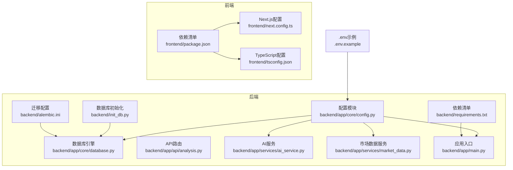
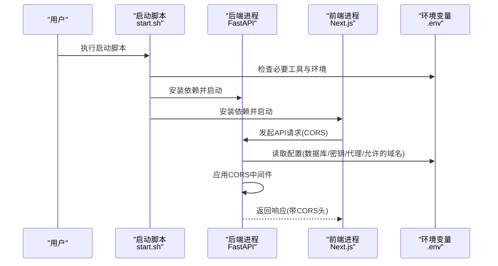
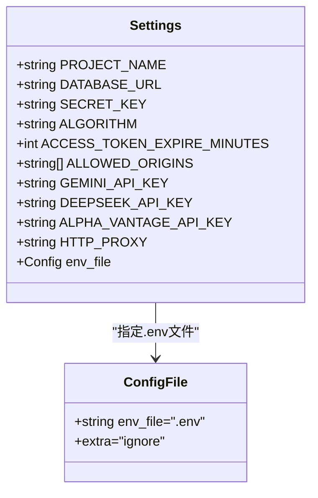
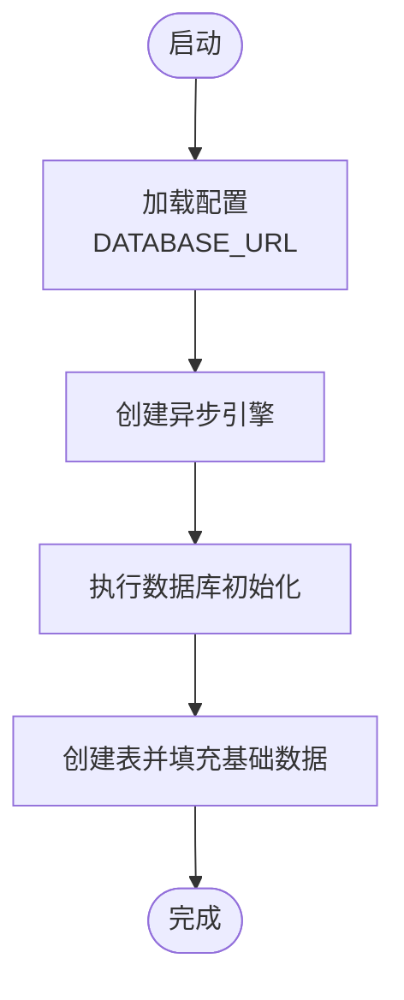
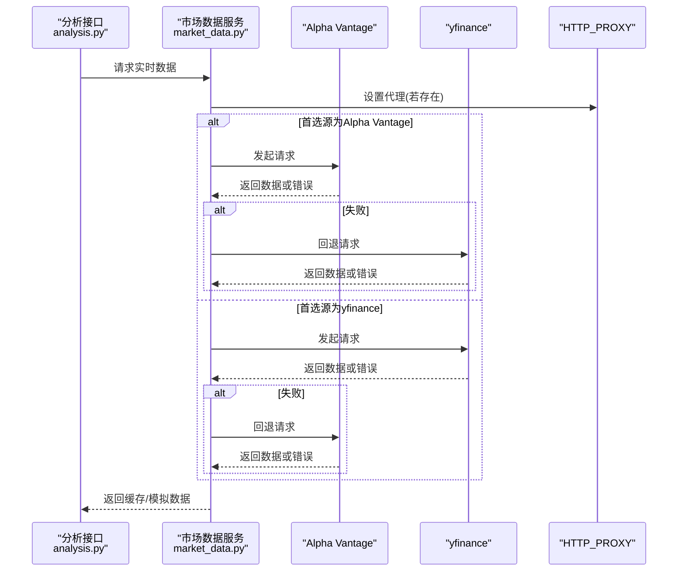
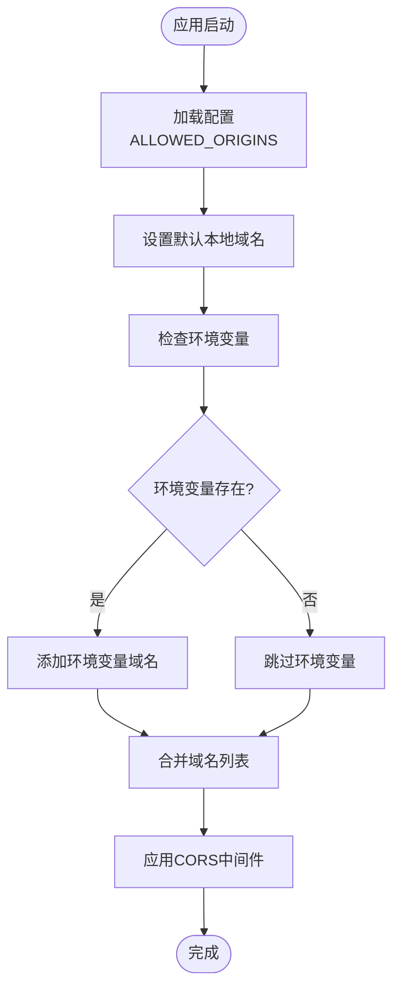
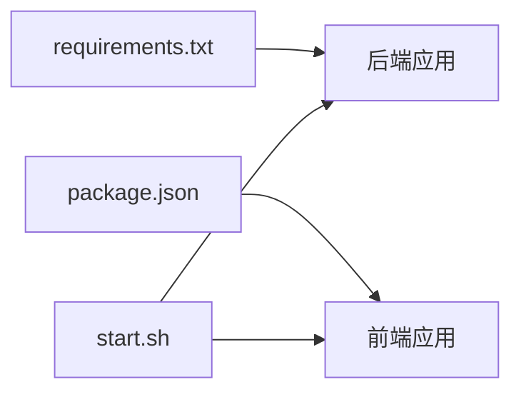

# 环境配置问题

<cite>
**本文档引用的文件**
- [.env.example](file://.env.example)
- [backend/app/core/config.py](file://backend/app/core/config.py)
- [backend/app/core/database.py](file://backend/app/core/database.py)
- [backend/app/services/ai_service.py](file://backend/app/services/ai_service.py)
- [backend/app/services/market_data.py](file://backend/app/services/market_data.py)
- [backend/app/api/analysis.py](file://backend/app/api/analysis.py)
- [backend/app/main.py](file://backend/app/main.py)
- [backend/requirements.txt](file://backend/requirements.txt)
- [backend/init_db.py](file://backend/init_db.py)
- [backend/alembic.ini](file://backend/alembic.ini)
- [frontend/package.json](file://frontend/package.json)
- [frontend/tsconfig.json](file://frontend/tsconfig.json)
- [frontend/next.config.ts](file://frontend/next.config.ts)
- [start.sh](file://start.sh)
- [README.md](file://README.md)
</cite>

## 目录
1. [简介](#简介)
2. [项目结构](#项目结构)
3. [核心组件](#核心组件)
4. [架构总览](#架构总览)
5. [详细组件分析](#详细组件分析)
6. [依赖关系分析](#依赖关系分析)
7. [性能考虑](#性能考虑)
8. [故障排除指南](#故障排除指南)
9. [结论](#结论)
10. [附录](#附录)

## 简介
本指南聚焦于本项目的环境配置与常见问题排查，涵盖以下方面：
- 环境变量配置错误：API密钥缺失、数据库URL配置错误、代理设置问题
- Python虚拟环境问题：依赖版本冲突、包安装失败
- Node.js环境检查：npm/yarn安装问题、前端依赖冲突
- 跨平台兼容性：Windows/Linux/macOS的特殊配置要求
- 环境变量文件(.env)的正确格式与必需参数
- 环境初始化脚本的使用方法与常见错误处理
- **新增** CORS跨域配置问题：多域名配置与ALLOWED_ORIGINS环境变量故障排除

## 项目结构
项目采用前后端分离架构，后端基于FastAPI，前端基于Next.js。环境配置主要通过.env文件与各模块的配置类进行管理。



**图表来源**
- [backend/app/core/config.py](file://backend/app/core/config.py#L1-L26)
- [backend/app/core/database.py](file://backend/app/core/database.py#L1-L24)
- [backend/app/api/analysis.py](file://backend/app/api/analysis.py#L1-L124)
- [backend/app/services/ai_service.py](file://backend/app/services/ai_service.py#L1-L112)
- [backend/app/services/market_data.py](file://backend/app/services/market_data.py#L1-L370)
- [backend/app/main.py](file://backend/app/main.py#L1-L91)
- [backend/requirements.txt](file://backend/requirements.txt#L1-L75)
- [backend/init_db.py](file://backend/init_db.py#L1-L85)
- [backend/alembic.ini](file://backend/alembic.ini#L1-L148)
- [.env.example](file://.env.example#L1-L10)
- [frontend/package.json](file://frontend/package.json#L1-L43)
- [frontend/tsconfig.json](file://frontend/tsconfig.json#L1-L43)
- [frontend/next.config.ts](file://frontend/next.config.ts#L1-L8)

**章节来源**
- [README.md](file://README.md#L1-L50)
- [start.sh](file://start.sh#L1-L44)

## 核心组件
- 配置系统：通过Pydantic Settings加载.env中的键值，统一管理数据库URL、API密钥、代理等。
- 数据库引擎：基于SQLAlchemy异步引擎，支持SQLite与PostgreSQL等。
- 外部API集成：Gemini与Alpha Vantage，均依赖配置中的API密钥。
- 前端Next.js：通过NEXT_PUBLIC_API_URL访问后端API。
- **新增** CORS跨域中间件：支持多域名配置与动态环境变量注入。

**章节来源**
- [backend/app/core/config.py](file://backend/app/core/config.py#L1-L26)
- [backend/app/core/database.py](file://backend/app/core/database.py#L1-L24)
- [backend/app/services/ai_service.py](file://backend/app/services/ai_service.py#L1-L112)
- [backend/app/services/market_data.py](file://backend/app/services/market_data.py#L1-L370)
- [frontend/package.json](file://frontend/package.json#L1-L43)
- [backend/app/main.py](file://backend/app/main.py#L55-L75)

## 架构总览
后端启动时加载.env配置，初始化数据库连接与中间件，注册API路由；前端通过环境变量访问后端地址。外部数据源通过代理配置支持网络受限场景。**新增** CORS中间件支持多域名跨域访问。



**图表来源**
- [start.sh](file://start.sh#L1-L44)
- [backend/app/main.py](file://backend/app/main.py#L55-L75)
- [frontend/package.json](file://frontend/package.json#L1-L43)
- [.env.example](file://.env.example#L1-L10)

## 详细组件分析

### 配置系统与环境变量
- 配置类定义了项目名称、数据库URL、安全密钥、外部API密钥、HTTP代理等字段，并指定.env文件路径。
- **新增** ALLOWED_ORIGINS字段用于CORS配置，默认为空列表。
- 默认数据库URL指向SQLite，便于本地开发；生产环境需替换为PostgreSQL等。
- HTTP_PROXY用于yfinance与Alpha Vantage请求的代理转发。



**图表来源**
- [backend/app/core/config.py](file://backend/app/core/config.py#L1-L26)

**章节来源**
- [backend/app/core/config.py](file://backend/app/core/config.py#L1-L26)
- [.env.example](file://.env.example#L1-L10)

### 数据库引擎与初始化
- 引擎根据DATABASE_URL创建异步连接，SQLite场景下启用线程检查参数。
- 初始化脚本可直接运行数据库种子脚本，创建表并填充基础股票数据。



**图表来源**
- [backend/app/core/database.py](file://backend/app/core/database.py#L1-L24)
- [backend/init_db.py](file://backend/init_db.py#L1-L85)

**章节来源**
- [backend/app/core/database.py](file://backend/app/core/database.py#L1-L24)
- [backend/init_db.py](file://backend/init_db.py#L1-L85)

### 外部API集成与代理
- Gemini分析服务在缺少API密钥时会降级为模拟输出。
- Alpha Vantage与yfinance作为备用数据源，优先使用首选源，失败时自动切换。
- HTTP_PROXY通过环境变量注入到请求会话，支持企业网络代理。



**图表来源**
- [backend/app/api/analysis.py](file://backend/app/api/analysis.py#L1-L124)
- [backend/app/services/market_data.py](file://backend/app/services/market_data.py#L1-L370)
- [backend/app/core/config.py](file://backend/app/core/config.py#L1-L26)

**章节来源**
- [backend/app/services/ai_service.py](file://backend/app/services/ai_service.py#L1-L112)
- [backend/app/services/market_data.py](file://backend/app/services/market_data.py#L1-L370)
- [backend/app/api/analysis.py](file://backend/app/api/analysis.py#L1-L124)

### 前端环境与API访问
- 前端通过NEXT_PUBLIC_API_URL访问后端API，确保开发与生产环境的API地址可配置。
- TypeScript与Next.js配置文件定义了构建与运行参数。

**章节来源**
- [frontend/package.json](file://frontend/package.json#L1-L43)
- [frontend/tsconfig.json](file://frontend/tsconfig.json#L1-L43)
- [frontend/next.config.ts](file://frontend/next.config.ts#L1-L8)

### CORS跨域配置系统
- **新增** CORS中间件在应用启动时自动配置，支持多域名访问控制。
- 默认允许本地开发域名（localhost:3000、localhost:3001等）。
- 支持通过ALLOWED_ORIGINS环境变量动态添加生产域名。
- 配置包括凭据支持、所有HTTP方法和头部的允许。



**图表来源**
- [backend/app/main.py](file://backend/app/main.py#L55-L75)
- [backend/app/core/config.py](file://backend/app/core/config.py#L12)

**章节来源**
- [backend/app/main.py](file://backend/app/main.py#L55-L75)
- [backend/app/core/config.py](file://backend/app/core/config.py#L12)

## 依赖关系分析
- 后端依赖通过requirements.txt集中管理，包含FastAPI、SQLAlchemy、Pydantic Settings、Uvicorn等。
- 前端依赖通过package.json管理，包含Next.js、React、Axios等。
- 启动脚本负责安装依赖并启动前后端服务。



**图表来源**
- [backend/requirements.txt](file://backend/requirements.txt#L1-L75)
- [frontend/package.json](file://frontend/package.json#L1-L43)
- [start.sh](file://start.sh#L1-L44)

**章节来源**
- [backend/requirements.txt](file://backend/requirements.txt#L1-L75)
- [frontend/package.json](file://frontend/package.json#L1-L43)
- [start.sh](file://start.sh#L1-L44)

## 性能考虑
- 数据缓存：市场数据服务对1分钟内的数据进行缓存，减少重复请求。
- 回退策略：当首选数据源失败时自动切换至备用源，保证可用性。
- 代理重试：yfinance遇到429限流时采用指数退避与抖动等待，降低并发压力。
- 数据库连接：异步引擎与连接池配置提升并发查询效率。
- **新增** CORS性能：中间件开销极小，对请求性能影响可忽略不计。

**章节来源**
- [backend/app/services/market_data.py](file://backend/app/services/market_data.py#L1-L370)

## 故障排除指南

### 环境变量配置错误
- API密钥缺失
  - 症状：AI分析接口返回模拟结果或错误提示；Alpha Vantage请求被限流。
  - 排查：确认.env中GEMINI_API_KEY、ALPHA_VANTAGE_API_KEY已设置；检查AI服务与市场数据服务的日志。
  - 修复：在.env中填入有效密钥；重启后端服务使配置生效。
- 数据库URL配置错误
  - 症状：数据库连接失败、迁移报错、初始化异常。
  - 排查：核对DATABASE_URL格式；确认驱动与主机可达；检查权限。
  - 修复：将DATABASE_URL改为正确的PostgreSQL或SQLite连接串；确保数据库服务运行。
- 代理设置问题
  - 症状：外网请求超时或被拦截；yfinance/Alpha Vantage请求失败。
  - 排查：确认HTTP_PROXY格式；验证代理连通性。
  - 修复：在.env中设置HTTP_PROXY；重启后端服务。

**章节来源**
- [backend/app/core/config.py](file://backend/app/core/config.py#L1-L26)
- [backend/app/services/ai_service.py](file://backend/app/services/ai_service.py#L1-L112)
- [backend/app/services/market_data.py](file://backend/app/services/market_data.py#L1-L370)
- [.env.example](file://.env.example#L1-L10)

### CORS跨域配置问题
**新增** 本节专门针对CORS跨域配置问题提供详细故障排除指南。

- **症状表现**
  - 前端请求后端API时出现CORS错误
  - 浏览器控制台显示"Access to fetch at ... from origin ... has been blocked by CORS policy"
  - 预检请求(Options)失败或被拒绝
  - 开发环境正常但生产环境跨域失败

- **常见原因**
  - ALLOWED_ORIGINS环境变量未设置或格式错误
  - 域名不匹配（协议、端口、路径差异）
  - 生产环境域名未添加到允许列表
  - 开发环境与生产环境域名配置不一致

- **排查步骤**
  1. 检查.env文件中是否包含ALLOWED_ORIGINS配置
  2. 验证域名格式是否正确（必须是完整的URL，包含协议）
  3. 确认前端实际访问的域名与后端允许的域名完全匹配
  4. 检查生产环境域名是否已添加到ALLOWED_ORIGINS
  5. 验证CORS中间件是否正确加载

- **修复方案**
  1. **开发环境**：确保.env中包含正确的本地域名
     ```
     ALLOWED_ORIGINS=["http://localhost:3000","http://127.0.0.1:3000","http://localhost:3001","http://127.0.0.1:3001"]
     ```
  2. **生产环境**：添加所有生产域名到ALLOWED_ORIGINS
     ```
     ALLOWED_ORIGINS=["https://yourdomain.com","https://www.yourdomain.com","https://api.yourdomain.com"]
     ```
  3. **动态配置**：通过环境变量注入多个域名
     ```
     ALLOWED_ORIGINS=["http://localhost:3000","https://production-domain.com"]
     ```

- **验证方法**
  1. 重启后端服务使配置生效
  2. 使用浏览器开发者工具查看Network标签页的CORS响应头
  3. 检查响应头中是否包含`Access-Control-Allow-Origin`
  4. 确认预检请求(Options)返回200状态码

**章节来源**
- [backend/app/main.py](file://backend/app/main.py#L55-L75)
- [backend/app/core/config.py](file://backend/app/core/config.py#L12)
- [.env.example](file://.env.example#L1-L10)

### Python虚拟环境问题
- 依赖版本冲突
  - 症状：pip安装时报错、模块导入失败、运行时异常。
  - 排查：使用requirements.txt锁定版本；检查现有环境中是否存在冲突包。
  - 修复：清理旧环境，重新创建虚拟环境并安装依赖；避免全局安装导致的冲突。
- 包安装失败
  - 症状：某些包编译失败（如cryptography、lxml）。
  - 排查：检查系统编译工具链、Python版本与架构匹配性。
  - 修复：安装系统依赖（如编译器、头文件），升级pip/setuptools/wheel；必要时更换预编译wheel镜像源。

**章节来源**
- [backend/requirements.txt](file://backend/requirements.txt#L1-L75)
- [start.sh](file://start.sh#L22-L26)

### Node.js环境检查
- npm/yarn安装问题
  - 症状：npm install失败、依赖下载缓慢或中断。
  - 排查：确认npm/yarn可用；检查网络与代理；查看package.json语法。
  - 修复：更换镜像源；清理缓存；使用yarn替代npm以减少冲突。
- 前端依赖冲突
  - 症状：TypeScript编译错误、运行时崩溃。
  - 排查：核对TypeScript与Next.js版本兼容性；检查路径映射与模块解析配置。
  - 修复：统一版本；更新tsconfig与next.config；清理node_modules与lockfile后重装。

**章节来源**
- [frontend/package.json](file://frontend/package.json#L1-L43)
- [frontend/tsconfig.json](file://frontend/tsconfig.json#L1-L43)
- [frontend/next.config.ts](file://frontend/next.config.ts#L1-L8)
- [start.sh](file://start.sh#L33-L35)

### 跨平台兼容性问题
- Windows
  - 特殊要求：确保Git Bash或WSL中可执行sh脚本；安装Python与Node.js时选择添加到PATH。
  - 代理：HTTP_PROXY需使用系统代理格式；注意反斜杠转义。
- Linux
  - 特殊要求：安装编译依赖（如build-essential、libpq-dev）；确保pip与npm可用。
  - 代理：通过系统环境或Docker网络配置代理。
- macOS
  - 特殊要求：Xcode命令行工具用于编译部分原生扩展；Homebrew管理Python与Node.js。
  - 代理：可通过系统代理或终端环境变量设置。

**章节来源**
- [start.sh](file://start.sh#L1-L44)
- [backend/requirements.txt](file://backend/requirements.txt#L1-L75)

### 环境变量文件(.env)格式与必需参数
- 文件位置：根目录下的.env文件，由配置类加载。
- 必需参数
  - 后端
    - DATABASE_URL：数据库连接串（默认SQLite）
    - GEMINI_API_KEY：Gemini API密钥（可选，缺失时AI功能降级）
    - DEEPSEEK_API_KEY：DeepSeek API密钥（可选）
    - SECRET_KEY：JWT签名密钥
    - **新增** ALLOWED_ORIGINS：CORS允许的域名列表（JSON数组格式）
  - 前端
    - NEXT_PUBLIC_API_URL：后端API地址（默认本地）

**章节来源**
- [.env.example](file://.env.example#L1-L10)
- [backend/app/core/config.py](file://backend/app/core/config.py#L1-L26)

### 环境初始化脚本使用与错误处理
- 使用方法
  - 给予执行权限并运行：chmod +x start.sh && ./start.sh
  - 自动检测npm与python3；按顺序启动后端与前端。
- 常见错误
  - 工具缺失：npm或python3未安装，脚本会直接退出。
  - 依赖安装失败：pip或npm安装过程中的网络或权限问题。
  - 端口占用：8000/3000端口被占用，需释放或修改端口。
- 修复建议
  - 安装缺失工具；检查网络与代理；释放端口；使用独立终端查看详细日志。

**章节来源**
- [start.sh](file://start.sh#L1-L44)
- [README.md](file://README.md#L1-L50)

## 结论
本指南提供了从环境变量、Python与Node.js环境到跨平台兼容性的完整故障排除流程。**新增的CORS跨域配置章节**特别关注了现代Web应用中常见的跨域访问问题，包括多域名配置、环境变量注入和生产环境部署的最佳实践。遵循本文档的步骤，可快速定位并解决大多数环境配置问题，确保项目在不同平台上稳定运行。

## 附录
- 快速对照表
  - 环境变量：DATABASE_URL、GEMINI_API_KEY、DEEPSEEK_API_KEY、ALPHA_VANTAGE_API_KEY、HTTP_PROXY、NEXT_PUBLIC_API_URL、**ALLOWED_ORIGINS**
  - 关键文件：.env、backend/app/core/config.py、backend/app/core/database.py、backend/app/services/market_data.py、frontend/package.json、**backend/app/main.py**
  - 启动脚本：start.sh
- **新增** CORS配置要点
  - ALLOWED_ORIGINS必须是JSON数组格式
  - 必须包含完整的协议（http://或https://）
  - 开发环境至少包含localhost和127.0.0.1的多个端口
  - 生产环境必须包含所有实际使用的域名
  - 域名区分大小写，路径会被忽略