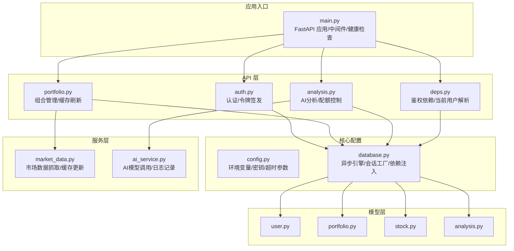
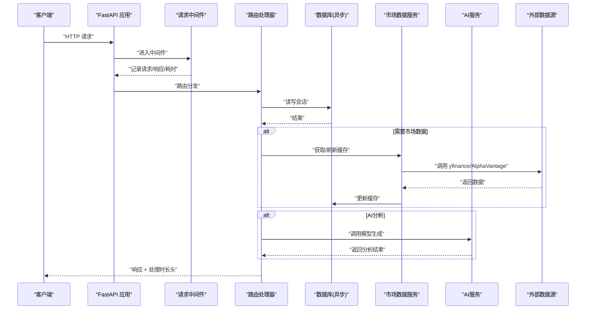
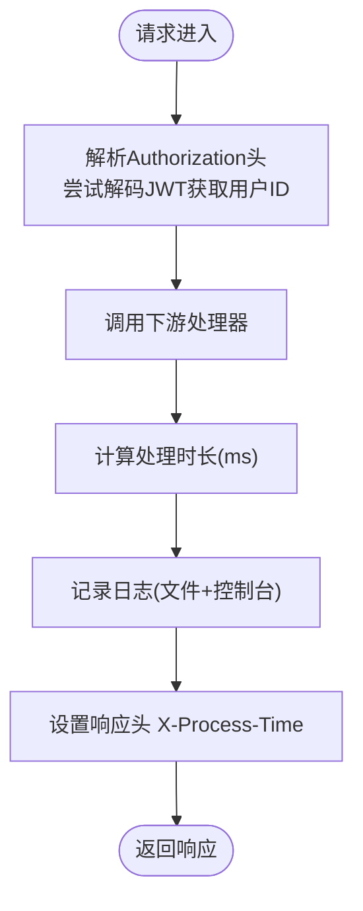
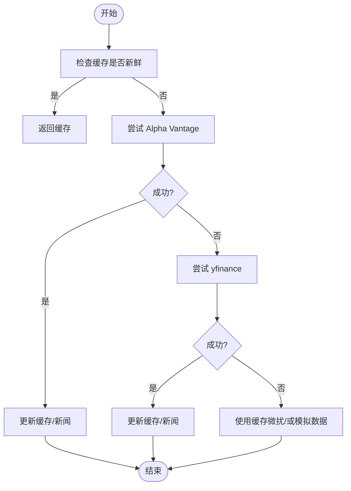
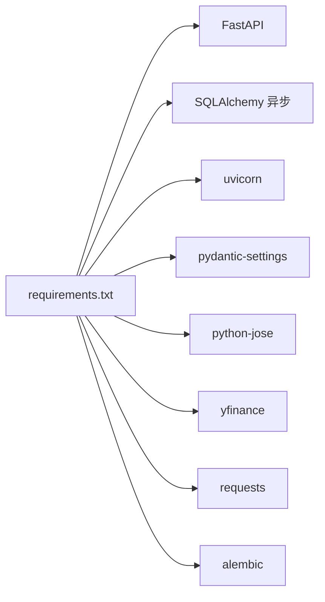

# 系统监控与告警

<cite>
**本文引用的文件**
- [backend/app/main.py](file://backend/app/main.py)
- [backend/app/core/config.py](file://backend/app/core/config.py)
- [backend/app/core/database.py](file://backend/app/core/database.py)
- [backend/app/api/deps.py](file://backend/app/api/deps.py)
- [backend/app/api/auth.py](file://backend/app/api/auth.py)
- [backend/app/api/portfolio.py](file://backend/app/api/portfolio.py)
- [backend/app/api/analysis.py](file://backend/app/api/analysis.py)
- [backend/app/services/ai_service.py](file://backend/app/services/ai_service.py)
- [backend/app/services/market_data.py](file://backend/app/services/market_data.py)
- [backend/app/models/analysis.py](file://backend/app/models/analysis.py)
- [backend/app/models/portfolio.py](file://backend/app/models/portfolio.py)
- [backend/app/models/user.py](file://backend/app/models/user.py)
- [backend/app/models/stock.py](file://backend/app/models/stock.py)
- [backend/requirements.txt](file://backend/requirements.txt)
- [backend/alembic.ini](file://backend/alembic.ini)
- [doc/Database Schema & Data Flow Specification.md](file://doc/Database Schema & Data Flow Specification.md)
</cite>

## 目录
1. [简介](#简介)
2. [项目结构](#项目结构)
3. [核心组件](#核心组件)
4. [架构总览](#架构总览)
5. [详细组件分析](#详细组件分析)
6. [依赖分析](#依赖分析)
7. [性能考虑](#性能考虑)
8. [故障排查指南](#故障排查指南)
9. [结论](#结论)
10. [附录](#附录)

## 简介
本指南面向运维与开发团队，提供在该AI股票顾问系统中落地“系统监控与告警”的完整配置方案。内容覆盖：
- 关键性能指标监控：API响应时间、数据库连接与查询耗时、内存使用率
- 日志级别与日志轮转策略
- 错误率与可用性监控
- 告警规则配置：阈值与通知渠道
- 健康检查端点的实现与使用
- 分布式追踪与性能分析工具集成建议
- 监控数据可视化与报表生成配置思路

## 项目结构
后端采用FastAPI + SQLAlchemy异步ORM + Alembic迁移的典型分层架构，核心入口位于应用主文件，监控能力通过中间件、日志与健康检查端点实现。

图表来源
- [backend/app/main.py](file://backend/app/main.py#L20-L82)
- [backend/app/core/config.py](file://backend/app/core/config.py#L4-L24)
- [backend/app/core/database.py](file://backend/app/core/database.py#L1-L24)
- [backend/app/api/auth.py](file://backend/app/api/auth.py#L14-L87)
- [backend/app/api/portfolio.py](file://backend/app/api/portfolio.py#L13-L296)
- [backend/app/api/analysis.py](file://backend/app/api/analysis.py#L14-L81)
- [backend/app/api/deps.py](file://backend/app/api/deps.py#L17-L43)
- [backend/app/services/market_data.py](file://backend/app/services/market_data.py#L13-L369)
- [backend/app/services/ai_service.py](file://backend/app/services/ai_service.py#L8-L111)
- [backend/app/models/user.py](file://backend/app/models/user.py#L15-L29)
- [backend/app/models/portfolio.py](file://backend/app/models/portfolio.py#L7-L25)
- [backend/app/models/stock.py](file://backend/app/models/stock.py#L13-L33)
- [backend/app/models/analysis.py](file://backend/app/models/analysis.py#L12-L24)

章节来源
- [backend/app/main.py](file://backend/app/main.py#L1-L87)
- [backend/app/core/config.py](file://backend/app/core/config.py#L1-L25)
- [backend/app/core/database.py](file://backend/app/core/database.py#L1-L24)

## 核心组件
- 中间件与日志：统一记录请求路径、方法、状态码、用户标识与处理时长，并在响应头注入处理时间
- 健康检查端点：提供服务可用性快速验证
- 数据库连接：异步引擎与会话工厂，支持SQLite/PostgreSQL
- 认证与鉴权：基于JWT的OAuth2密码流，依赖令牌校验
- 业务监控点：AI分析配额控制、市场数据缓存与重试、外部API限流与降级

章节来源
- [backend/app/main.py](file://backend/app/main.py#L9-L53)
- [backend/app/main.py](file://backend/app/main.py#L80-L82)
- [backend/app/core/database.py](file://backend/app/core/database.py#L1-L24)
- [backend/app/api/deps.py](file://backend/app/api/deps.py#L17-L43)
- [backend/app/api/analysis.py](file://backend/app/api/analysis.py#L28-L52)
- [backend/app/services/market_data.py](file://backend/app/services/market_data.py#L29-L56)

## 架构总览
下图展示从客户端到数据库与外部数据源的数据流，以及关键监控落点。

图表来源
- [backend/app/main.py](file://backend/app/main.py#L22-L53)
- [backend/app/api/portfolio.py](file://backend/app/api/portfolio.py#L144-L174)
- [backend/app/services/market_data.py](file://backend/app/services/market_data.py#L14-L170)
- [backend/app/services/ai_service.py](file://backend/app/services/ai_service.py#L43-L111)

## 详细组件分析

### 中间件与日志（API响应时间与访问审计）
- 记录字段：请求路径、方法、状态码、用户标识（匿名/无效令牌）、处理时长
- 处理时长以毫秒为单位写入响应头，便于前端或网关侧采集
- 日志输出：同时写入文件与标准输出，便于容器化部署收集

图表来源
- [backend/app/main.py](file://backend/app/main.py#L22-L53)

章节来源
- [backend/app/main.py](file://backend/app/main.py#L9-L53)

### 健康检查端点
- 提供轻量级可用性探测，返回服务状态
- 建议在负载均衡/编排平台定期探活

章节来源
- [backend/app/main.py](file://backend/app/main.py#L80-L82)

### 数据库连接与会话
- 异步引擎与会话工厂，支持SQLite与PostgreSQL
- 依赖注入模式提供统一的db会话获取

章节来源
- [backend/app/core/database.py](file://backend/app/core/database.py#L1-L24)

### 认证与鉴权依赖
- OAuth2密码流令牌校验，解析JWT载荷获取用户ID
- 未通过校验时抛出HTTP异常，便于上游统一处理

章节来源
- [backend/app/api/deps.py](file://backend/app/api/deps.py#L17-L43)
- [backend/app/api/auth.py](file://backend/app/api/auth.py#L24-L50)

### 市场数据服务（缓存与降级）
- 缓存命中判定：缓存时间窗口内直接返回
- 多源回退：优先Alpha Vantage，失败则回退yfinance
- 外部API限流与降级：429时指数退避；均失败时使用模拟数据
- 新闻与技术指标入库：SQLite Upsert避免重复

图表来源
- [backend/app/services/market_data.py](file://backend/app/services/market_data.py#L14-L170)

章节来源
- [backend/app/services/market_data.py](file://backend/app/services/market_data.py#L14-L170)

### AI分析服务（配额与降级）
- 免费用户配额：按自然日统计分析次数，超过阈值返回限流错误
- AI调用：优先使用用户提供的API Key；缺失时返回提示信息
- 错误降级：JSON模式失败时回退文本模式

章节来源
- [backend/app/api/analysis.py](file://backend/app/api/analysis.py#L28-L52)
- [backend/app/services/ai_service.py](file://backend/app/services/ai_service.py#L43-L111)
- [backend/app/models/analysis.py](file://backend/app/models/analysis.py#L12-L24)

### 组合管理（缓存刷新与并发控制）
- 刷新策略：按需刷新，避免并发会话冲突
- 背景拉取：新增标的后异步补充技术指标

章节来源
- [backend/app/api/portfolio.py](file://backend/app/api/portfolio.py#L144-L174)
- [backend/app/api/portfolio.py](file://backend/app/api/portfolio.py#L273-L279)

## 依赖分析
- 运行时依赖：FastAPI、SQLAlchemy异步、uvicorn、Pydantic Settings、Jose等
- 数据库驱动：aiosqlite/asyncpg
- 外部数据源：yfinance、Alpha Vantage
- 日志与迁移：Python logging、Alembic

图表来源
- [backend/requirements.txt](file://backend/requirements.txt#L1-L75)

章节来源
- [backend/requirements.txt](file://backend/requirements.txt#L1-L75)
- [backend/alembic.ini](file://backend/alembic.ini#L124-L147)

## 性能考虑
- API响应时间
  - 中间件已记录处理时长并注入响应头，建议在网关/边缘层聚合
  - 对于高并发场景，建议启用多进程/多实例并配合反向代理
- 数据库连接
  - 异步引擎可提升IO吞吐；生产环境建议使用PostgreSQL并配置连接池
  - 避免在单事务中执行长时间阻塞操作
- 外部API限流
  - 已内置指数退避与回退策略；建议为不同外部源设置独立超时与重试上限
- 内存使用
  - 建议容器化部署时设置内存限制与OOM保护；关注大历史数据计算（技术指标）的峰值内存

## 故障排查指南
- 认证失败
  - 检查Authorization头格式与JWT签名算法一致性
  - 确认密钥配置正确且未过期
- 数据获取失败
  - 观察外部API返回与重试日志；必要时切换数据源或调整超时
- AI分析不可用
  - 确认用户API Key配置；查看AI服务日志中的错误堆栈
- 健康检查失败
  - 检查应用启动日志与端口监听状态

章节来源
- [backend/app/api/deps.py](file://backend/app/api/deps.py#L21-L33)
- [backend/app/services/market_data.py](file://backend/app/services/market_data.py#L303-L318)
- [backend/app/services/ai_service.py](file://backend/app/services/ai_service.py#L103-L111)
- [backend/app/main.py](file://backend/app/main.py#L80-L82)

## 结论
本项目已具备基础的请求观测与健康检查能力，建议在此基础上扩展：
- 集成APM/Tracing（如OpenTelemetry）以获得端到端链路视图
- 配置Prometheus/Grafana进行指标采集与可视化
- 设定告警规则并接入通知通道（邮件/IM/短信）
- 完善日志轮转与集中化存储（ELK/云日志）

## 附录

### 关键性能指标监控配置清单
- API响应时间
  - 指标来源：中间件注入的处理时长与响应头
  - 建议：按路由、状态码、用户维度聚合P50/P95/P99
- 数据库连接数与查询耗时
  - 指标来源：数据库驱动与连接池统计（建议在生产数据库侧采集）
  - 建议：最大连接数、活跃连接数、排队等待时间、慢查询阈值
- 内存使用率
  - 指标来源：系统/容器监控（RSS/虚拟内存）
  - 建议：容器资源限制与OOM保护

### 日志级别与日志轮转策略
- 日志级别
  - 应用日志：INFO为主，错误使用ERROR/WARNING
  - Alembic迁移：INFO级别，SQLAlchemy引擎可设WARNING
- 日志轮转
  - 建议使用系统自带轮转工具（如logrotate/rsyslog）或应用侧轮转库
  - 轮转条件：按大小或时间；保留周期视合规要求而定

章节来源
- [backend/app/main.py](file://backend/app/main.py#L10-L17)
- [backend/alembic.ini](file://backend/alembic.ini#L124-L147)

### 错误率与可用性监控
- 错误率
  - 指标来源：按状态码分类统计（4xx/5xx占比）
  - 建议：区分认证/鉴权/业务/外部依赖错误
- 可用性
  - 指标来源：健康检查端点成功率与时延
  - 建议：SLA目标与告警阈值明确

章节来源
- [backend/app/main.py](file://backend/app/main.py#L80-L82)

### 告警规则与通知渠道
- 告警规则示例
  - API响应时间P95超阈
  - 错误率突增
  - 健康检查失败持续超时
  - 数据库连接池耗尽
- 通知渠道
  - 邮件/IM/短信/Webhook；建议分级通知（预警/严重/恢复）

### 健康检查端点使用方法
- 调用方式：GET /health
- 返回体包含服务状态与提示信息
- 建议：在编排平台设置探针，间隔与超时根据实例规模调整

章节来源
- [backend/app/main.py](file://backend/app/main.py#L80-L82)

### 分布式追踪与性能分析
- 推荐集成
  - OpenTelemetry SDK（Python）+ Collector
  - 链路：HTTP中间件 -> 路由 -> 数据库/外部API -> AI服务
- 性能分析
  - CPU/内存火焰图（采样器）
  - 数据库慢查询分析与索引优化

### 监控数据可视化与报表
- 可视化
  - Grafana仪表盘：响应时间、错误率、数据库指标、健康检查成功率
- 报表
  - 按日/周/月生成SLA报告与容量趋势分析
  - 告警事件归档与复盘