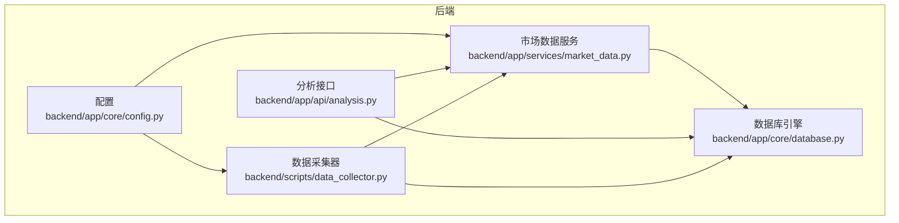
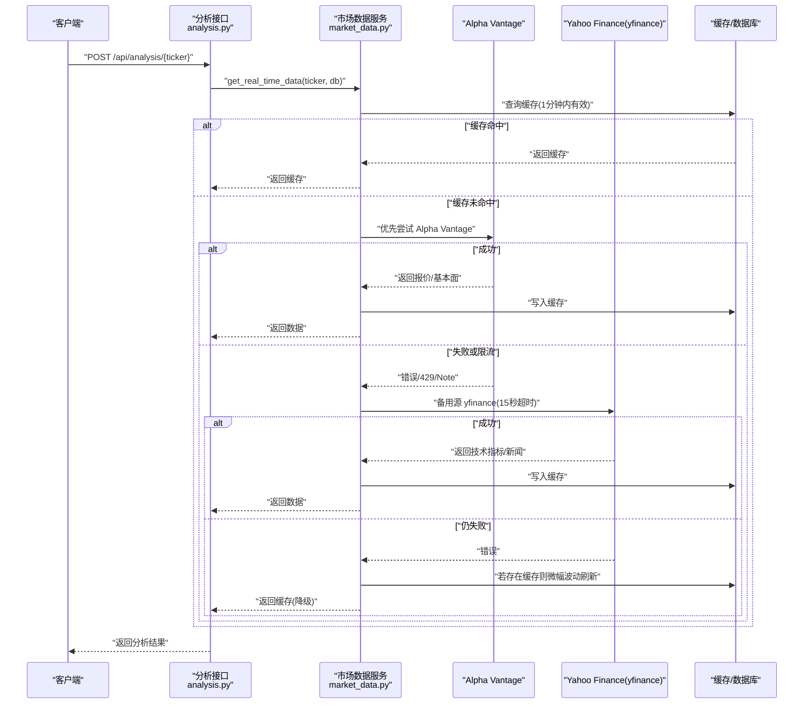
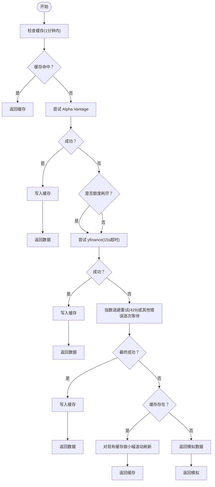
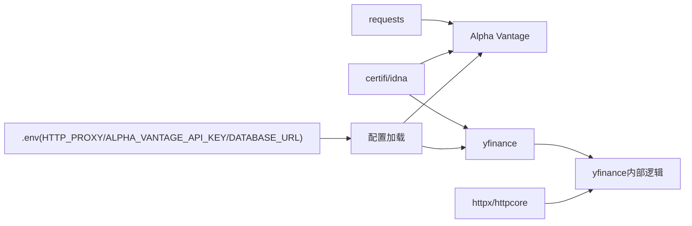
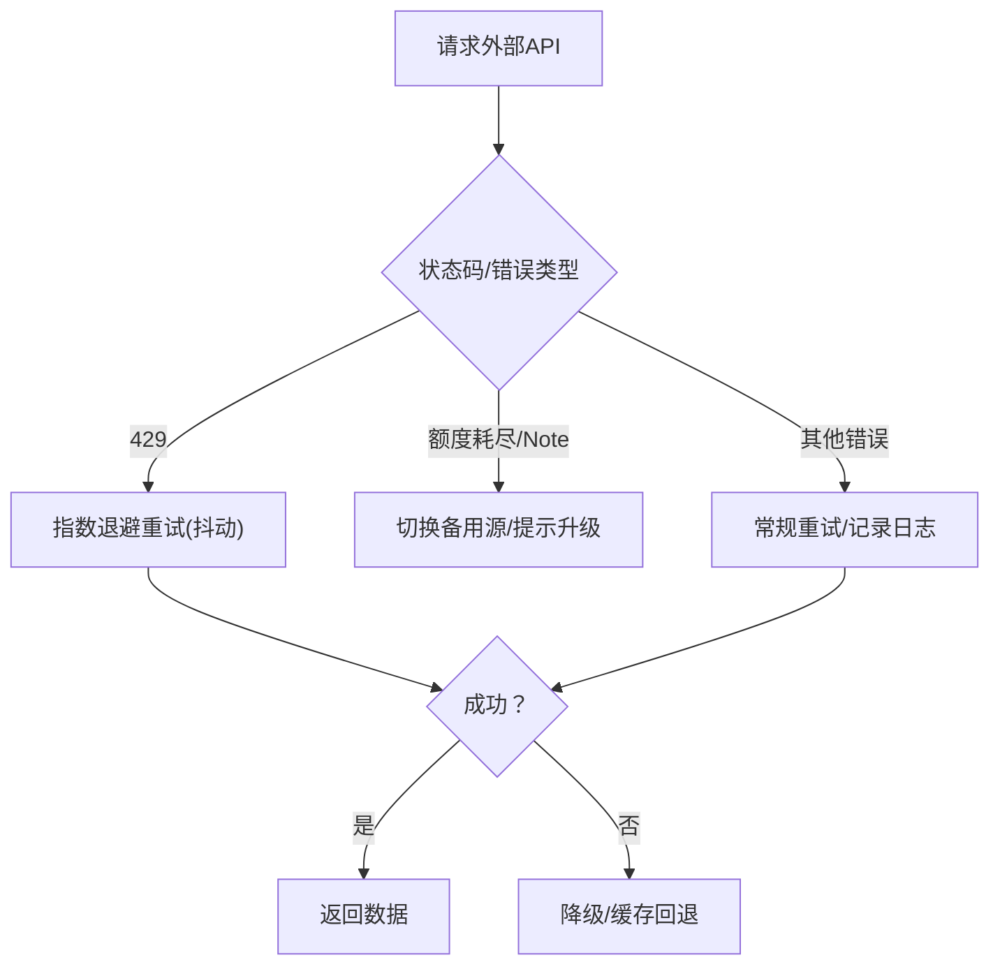

# 网络连接问题

<cite>
**本文引用的文件**
- [backend/app/core/config.py](file://backend/app/core/config.py)
- [backend/app/services/market_data.py](file://backend/app/services/market_data.py)
- [backend/scripts/data_collector.py](file://backend/scripts/data_collector.py)
- [backend/app/api/analysis.py](file://backend/app/api/analysis.py)
- [backend/app/api/deps.py](file://backend/app/api/deps.py)
- [backend/app/core/database.py](file://backend/app/core/database.py)
- [backend/app/models/stock.py](file://backend/app/models/stock.py)
- [backend/app/models/portfolio.py](file://backend/app/models/portfolio.py)
- [.env.example](file://.env.example)
- [backend/requirements.txt](file://backend/requirements.txt)
</cite>

## 目录
1. [简介](#简介)
2. [项目结构](#项目结构)
3. [核心组件](#核心组件)
4. [架构总览](#架构总览)
5. [详细组件分析](#详细组件分析)
6. [依赖关系分析](#依赖关系分析)
7. [性能考量](#性能考量)
8. [故障排除指南](#故障排除指南)
9. [结论](#结论)
10. [附录](#附录)

## 简介
本指南聚焦于网络连接问题的系统性排查与修复，覆盖以下主题：
- API 限流识别与处理（Alpha Vantage 与 Yahoo Finance）
- 连接超时与网络不稳定诊断
- 代理服务器配置与防火墙设置
- SSL 证书与 HTTPS 连接失败处理
- 网络重试机制与错误处理策略
- 离线模式与降级策略
- DNS 解析与域名访问异常排查

本指南基于后端代码库的实际实现进行说明，并提供可操作的定位步骤与修复建议。

## 项目结构
后端采用 FastAPI + SQLAlchemy 异步 ORM 架构，市场数据通过外部 API（Alpha Vantage、Yahoo Finance）获取，并具备缓存与降级能力。关键网络相关点包括：
- 配置加载与代理设置
- 外部 API 访问与重试
- 超时控制与异常处理
- 数据采集脚本的节流与稳定性保障



图表来源
- [backend/app/core/config.py](file://backend/app/core/config.py#L1-L24)
- [backend/app/core/database.py](file://backend/app/core/database.py#L1-L24)
- [backend/app/services/market_data.py](file://backend/app/services/market_data.py#L1-L370)
- [backend/app/api/analysis.py](file://backend/app/api/analysis.py#L1-L124)
- [backend/scripts/data_collector.py](file://backend/scripts/data_collector.py#L1-L62)

章节来源
- [backend/app/core/config.py](file://backend/app/core/config.py#L1-L24)
- [backend/app/core/database.py](file://backend/app/core/database.py#L1-L24)
- [backend/app/services/market_data.py](file://backend/app/services/market_data.py#L1-L370)
- [backend/app/api/analysis.py](file://backend/app/api/analysis.py#L1-L124)
- [backend/scripts/data_collector.py](file://backend/scripts/data_collector.py#L1-L62)

## 核心组件
- 配置与代理
  - 支持通过环境变量注入 HTTP_PROXY，用于 Alpha Vantage 与 yfinance 请求。
  - 提供外部 API 密钥字段（Alpha Vantage），便于启用付费额度。
- 市场数据服务
  - 支持优先源与备选源切换（Alpha Vantage 与 yfinance）。
  - 对 yfinance 实施指数退避重试与超时控制；对 Alpha Vantage 检测“使用次数耗尽”提示。
  - 缓存与降级：缓存命中、无可用数据时的模拟数据回退。
- 数据采集器
  - 以固定间隔（每只股票至少 60 秒）降低外部请求频率，避免触发限流。
- 分析接口
  - 在未配置自有 Gemini API Key 时实施免费用户每日上限（429）。
- 数据模型
  - MarketDataCache 与 Stock 提供缓存与基础数据持久化，支撑降级与离线场景。

章节来源
- [backend/app/core/config.py](file://backend/app/core/config.py#L13-L17)
- [backend/app/services/market_data.py](file://backend/app/services/market_data.py#L13-L170)
- [backend/scripts/data_collector.py](file://backend/scripts/data_collector.py#L16-L56)
- [backend/app/api/analysis.py](file://backend/app/api/analysis.py#L27-L50)
- [backend/app/models/stock.py](file://backend/app/models/stock.py#L33-L67)

## 架构总览
下图展示从接口到外部 API 的典型调用链路，以及重试与降级路径：



图表来源
- [backend/app/api/analysis.py](file://backend/app/api/analysis.py#L13-L124)
- [backend/app/services/market_data.py](file://backend/app/services/market_data.py#L13-L170)
- [backend/app/models/stock.py](file://backend/app/models/stock.py#L33-L67)

## 详细组件分析

### 组件A：市场数据服务（网络与重试）
- 优先源与备选源
  - 默认优先 Alpha Vantage；若不可用则切换至 yfinance。
  - yfinance 侧设置 15 秒超时，避免长时间阻塞。
- 重试与退避
  - yfinance：检测“429/Too Many Requests”时执行指数退避加抖动；其他错误按最大重试次数轮询。
  - Alpha Vantage：当响应包含“Note”提示时判定为额度耗尽。
- 代理与超时
  - 若配置 HTTP_PROXY，则同时设置 HTTP/HTTPS 代理；Alpha Vantage 设置 timeout=5 秒。
- 降级与缓存
  - 若均失败且缓存存在：对当前价格施加小幅随机波动，保持界面“活数据”感。
  - 若无缓存：返回半真实模拟数据，保证前端体验。



图表来源
- [backend/app/services/market_data.py](file://backend/app/services/market_data.py#L13-L170)
- [backend/app/models/stock.py](file://backend/app/models/stock.py#L33-L67)

章节来源
- [backend/app/services/market_data.py](file://backend/app/services/market_data.py#L13-L170)
- [backend/app/models/stock.py](file://backend/app/models/stock.py#L33-L67)

### 组件B：数据采集器（节流与稳定性）
- 采集策略
  - 每抓取一只股票后强制休眠 60±随机秒，确保每小时不超过 60 次请求，规避 yfinance 限流。
- 异常处理
  - 单只股票失败不影响整体循环；异常后短暂休眠继续。

```mermaid
sequenceDiagram
participant Loop as "采集器循环"
participant DB as "数据库"
participant Svc as "市场数据服务"
Loop->>DB : "查询待维护的股票列表"
loop "逐只股票"
Loop->>Svc : "get_real_time_data(ticker, db, YFINANCE)"
alt "成功"
Svc-->>Loop : "返回并持久化"
else "失败"
Svc-->>Loop : "抛出异常"
end
Loop->>Loop : "强制休眠 60±随机秒"
end
```

图表来源
- [backend/scripts/data_collector.py](file://backend/scripts/data_collector.py#L16-L56)
- [backend/app/services/market_data.py](file://backend/app/services/market_data.py#L13-L170)

章节来源
- [backend/scripts/data_collector.py](file://backend/scripts/data_collector.py#L16-L56)

### 组件C：分析接口（限流与降级）
- 免费用户限流
  - 未配置自有 Gemini API Key 时，按日统计使用次数，超过阈值返回 429。
- 数据降级
  - 当无法获取 MarketDataCache 对象时，使用默认/回退数据结构，保证流程不中断。

章节来源
- [backend/app/api/analysis.py](file://backend/app/api/analysis.py#L27-L50)
- [backend/app/api/analysis.py](file://backend/app/api/analysis.py#L54-L80)

## 依赖关系分析
- 外部依赖
  - requests、yfinance、httpx、httpcore、certifi、idna 等，涉及 HTTP/HTTPS、TLS、DNS 解析等。
- 配置与运行
  - HTTP_PROXY 通过环境变量注入；Alpha Vantage 需要 API Key；数据库 URL 由环境变量控制。



图表来源
- [backend/requirements.txt](file://backend/requirements.txt#L59-L75)
- [backend/app/core/config.py](file://backend/app/core/config.py#L13-L17)
- [.env.example](file://.env.example#L1-L9)

章节来源
- [backend/requirements.txt](file://backend/requirements.txt#L59-L75)
- [backend/app/core/config.py](file://backend/app/core/config.py#L13-L17)
- [.env.example](file://.env.example#L1-L9)

## 性能考量
- 超时与并发
  - yfinance 设置 15 秒超时，避免阻塞；外部请求使用异步执行器与事件循环分离。
- 重试策略
  - 指数退避 + 抖动，降低同时重试导致的级联效应。
- 缓存与降级
  - 1 分钟缓存窗口减少重复请求；缓存存在时的微小波动维持界面活性；无缓存时模拟数据保证可用性。
- 采集节流
  - 数据采集器对每只股票强制 60 秒以上间隔，显著降低外部限流风险。

章节来源
- [backend/app/services/market_data.py](file://backend/app/services/market_data.py#L39-L47)
- [backend/app/services/market_data.py](file://backend/app/services/market_data.py#L177-L318)
- [backend/scripts/data_collector.py](file://backend/scripts/data_collector.py#L47-L51)

## 故障排除指南

### 1. API 限流问题识别与处理
- Alpha Vantage
  - 现象：响应包含“Note”提示或返回空数据。
  - 处理：配置付费 API Key；若额度耗尽，需升级套餐或改用备用源。
  - 参考实现位置：
    - [backend/app/services/market_data.py](file://backend/app/services/market_data.py#L364-L369)
- Yahoo Finance（yfinance）
  - 现象：出现“429/Too Many Requests”或“Too many requests”字样。
  - 处理：启用指数退避重试；必要时增加请求间隔或使用代理。
  - 参考实现位置：
    - [backend/app/services/market_data.py](file://backend/app/services/market_data.py#L305-L318)



图表来源
- [backend/app/services/market_data.py](file://backend/app/services/market_data.py#L305-L318)
- [backend/app/services/market_data.py](file://backend/app/services/market_data.py#L364-L369)

章节来源
- [backend/app/services/market_data.py](file://backend/app/services/market_data.py#L305-L318)
- [backend/app/services/market_data.py](file://backend/app/services/market_data.py#L364-L369)

### 2. 连接超时与网络不稳定诊断
- 现象：请求长时间无响应或抛出超时异常。
- 排查步骤：
  - 检查本地网络连通性与 DNS 解析。
  - 使用代理测试（见“代理服务器配置”）。
  - 临时提高超时阈值验证是否为网络延迟问题。
- 参考实现位置：
  - [backend/app/services/market_data.py](file://backend/app/services/market_data.py#L39-L47)（yfinance 15 秒超时）
  - [backend/app/services/market_data.py](file://backend/app/services/market_data.py#L334-L335)（Alpha Vantage 5 秒超时）

章节来源
- [backend/app/services/market_data.py](file://backend/app/services/market_data.py#L39-L47)
- [backend/app/services/market_data.py](file://backend/app/services/market_data.py#L334-L335)

### 3. 代理服务器配置与防火墙设置
- 配置方式
  - 在环境变量中设置 HTTP_PROXY（支持 http/https），服务启动后自动应用于外部请求。
- 验证方法
  - 通过代理站点或工具确认请求经由代理转发。
  - 检查防火墙/安全组放行目标端口（Alpha Vantage 与 yfinance 所需域名与端口）。
- 参考实现位置：
  - [backend/app/core/config.py](file://backend/app/core/config.py#L17)
  - [backend/app/services/market_data.py](file://backend/app/services/market_data.py#L189-L191)（yfinance 注入代理）
  - [backend/app/services/market_data.py](file://backend/app/services/market_data.py#L327-L332)（Alpha Vantage 注入代理）

章节来源
- [backend/app/core/config.py](file://backend/app/core/config.py#L17)
- [backend/app/services/market_data.py](file://backend/app/services/market_data.py#L189-L191)
- [backend/app/services/market_data.py](file://backend/app/services/market_data.py#L327-L332)

### 4. SSL 证书与 HTTPS 连接失败
- 常见原因
  - 本地证书信任链缺失；代理/中间设备修改证书；系统时间不正确。
- 处理建议
  - 确认系统时间同步；安装/更新根证书；使用受信代理；必要时在开发环境临时放宽校验（仅限调试）。
- 参考依赖
  - certifi、idna 等库负责证书与国际化域名处理。
- 参考实现位置：
  - [backend/requirements.txt](file://backend/requirements.txt#L9-L10)
  - [backend/requirements.txt](file://backend/requirements.txt#L35)

章节来源
- [backend/requirements.txt](file://backend/requirements.txt#L9-L10)
- [backend/requirements.txt](file://backend/requirements.txt#L35)

### 5. 网络重试机制与错误处理策略
- 策略要点
  - 指数退避 + 抖动；区分 429 与其他错误；达到最大重试次数后降级。
- 参考实现位置：
  - [backend/app/services/market_data.py](file://backend/app/services/market_data.py#L177-L318)

章节来源
- [backend/app/services/market_data.py](file://backend/app/services/market_data.py#L177-L318)

### 6. 离线模式与降级策略
- 缓存优先：1 分钟内命中缓存直接返回。
- 缓存存在时：对当前价格施加小幅随机波动，保持界面“活数据”感。
- 缓存不存在：返回半真实模拟数据，保证前端可用。
- 参考实现位置：
  - [backend/app/services/market_data.py](file://backend/app/services/market_data.py#L21-L23)
  - [backend/app/services/market_data.py](file://backend/app/services/market_data.py#L67-L85)
  - [backend/app/models/stock.py](file://backend/app/models/stock.py#L33-L67)

章节来源
- [backend/app/services/market_data.py](file://backend/app/services/market_data.py#L21-L23)
- [backend/app/services/market_data.py](file://backend/app/services/market_data.py#L67-L85)
- [backend/app/models/stock.py](file://backend/app/models/stock.py#L33-L67)

### 7. DNS 解析问题与域名访问异常
- 排查步骤
  - 使用 nslookup/dig 或系统网络诊断工具验证域名解析。
  - 更换 DNS（如 8.8.8.8、114.114.114.114）测试连通性。
  - 临时绕过代理验证是否为代理链路问题。
- 参考实现位置：
  - [backend/requirements.txt](file://backend/requirements.txt#L15)

章节来源
- [backend/requirements.txt](file://backend/requirements.txt#L15)

### 8. 其他网络相关建议
- 代理与证书
  - 代理需同时支持 HTTP/HTTPS；证书链完整。
- 防火墙与安全组
  - 放行对外出站 TCP 443/80 至外部 API 域名。
- 环境变量与密钥
  - 确保 .env 中 HTTP_PROXY、ALPHA_VANTAGE_API_KEY、DATABASE_URL 等配置正确。

章节来源
- [backend/app/core/config.py](file://backend/app/core/config.py#L13-L17)
- [.env.example](file://.env.example#L1-L9)

## 结论
本项目在网络层具备完善的降级与重试策略：优先源失败自动切换、指数退避重试、缓存优先与模拟数据回退。结合代理与超时控制，可在复杂网络环境下保持稳定运行。建议在生产环境中：
- 明确外部 API 额度与费用模型，及时升级；
- 合理配置代理与证书，确保 TLS 通信；
- 严格遵守请求节流策略，避免触发限流；
- 健全监控与告警，快速定位 DNS/代理/证书等问题。

## 附录
- 关键实现参考路径
  - [backend/app/services/market_data.py](file://backend/app/services/market_data.py#L13-L170)
  - [backend/app/services/market_data.py](file://backend/app/services/market_data.py#L177-L318)
  - [backend/app/services/market_data.py](file://backend/app/services/market_data.py#L320-L369)
  - [backend/scripts/data_collector.py](file://backend/scripts/data_collector.py#L16-L56)
  - [backend/app/api/analysis.py](file://backend/app/api/analysis.py#L27-L50)
  - [backend/app/core/config.py](file://backend/app/core/config.py#L13-L17)
  - [backend/requirements.txt](file://backend/requirements.txt#L59-L75)
  - [.env.example](file://.env.example#L1-L9)