# ER模型设计

<cite>
**本文档引用的文件**
- [backend/app/models/user.py](file://backend/app/models/user.py)
- [backend/app/models/portfolio.py](file://backend/app/models/portfolio.py)
- [backend/app/models/stock.py](file://backend/app/models/stock.py)
- [backend/app/models/analysis.py](file://backend/app/models/analysis.py)
- [doc/Database Schema & Data Flow Specification.md](file://doc/Database Schema & Data Flow Specification.md)
- [backend/migrations/versions/35a834f440ba_baseline.py](file://backend/migrations/versions/35a834f440ba_baseline.py)
- [backend/migrations/versions/48d7355e90d6_add_more_technical_indicators.py](file://backend/migrations/versions/48d7355e90d6_add_more_technical_indicators.py)
- [backend/migrations/versions/54477ba71d32_add_exchange_to_stock.py](file://backend/migrations/versions/54477ba71d32_add_exchange_to_stock.py)
- [backend/migrations/versions/90eb8cc09d0d_add_stock_news_table.py](file://backend/migrations/versions/90eb8cc09d0d_add_stock_news_table.py)
- [backend/app/core/database.py](file://backend/app/core/database.py)
- [backend/app/api/portfolio.py](file://backend/app/api/portfolio.py)
- [backend/app/api/analysis.py](file://backend/app/api/analysis.py)
</cite>

## 目录
1. [简介](#简介)
2. [项目结构](#项目结构)
3. [核心组件](#核心组件)
4. [架构概览](#架构概览)
5. [详细组件分析](#详细组件分析)
6. [依赖分析](#依赖分析)
7. [性能考虑](#性能考虑)
8. [故障排除指南](#故障排除指南)
9. [结论](#结论)
10. [附录](#附录)

## 简介

本文件为AI股票顾问项目的ER（实体-关系）模型设计文档。该系统旨在提供一个完整的股票分析平台，涵盖用户认证、投资组合跟踪、市场数据缓存以及AI分析日志等功能。本文档将详细说明核心实体User、Portfolio、Stock、Analysis之间的关系，包括属性定义、主键外键设计原则、数据完整性约束以及业务规则在ER模型中的体现。

## 项目结构

该项目采用分层架构，主要由以下模块组成：

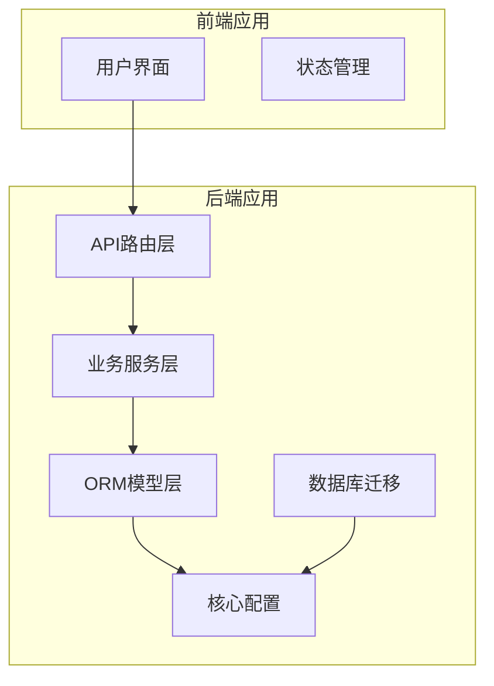

**图表来源**
- [backend/app/main.py](file://backend/app/main.py)
- [backend/app/core/database.py](file://backend/app/core/database.py)

**章节来源**
- [backend/app/main.py](file://backend/app/main.py)
- [backend/app/core/database.py](file://backend/app/core/database.py)

## 核心组件

### 实体关系图

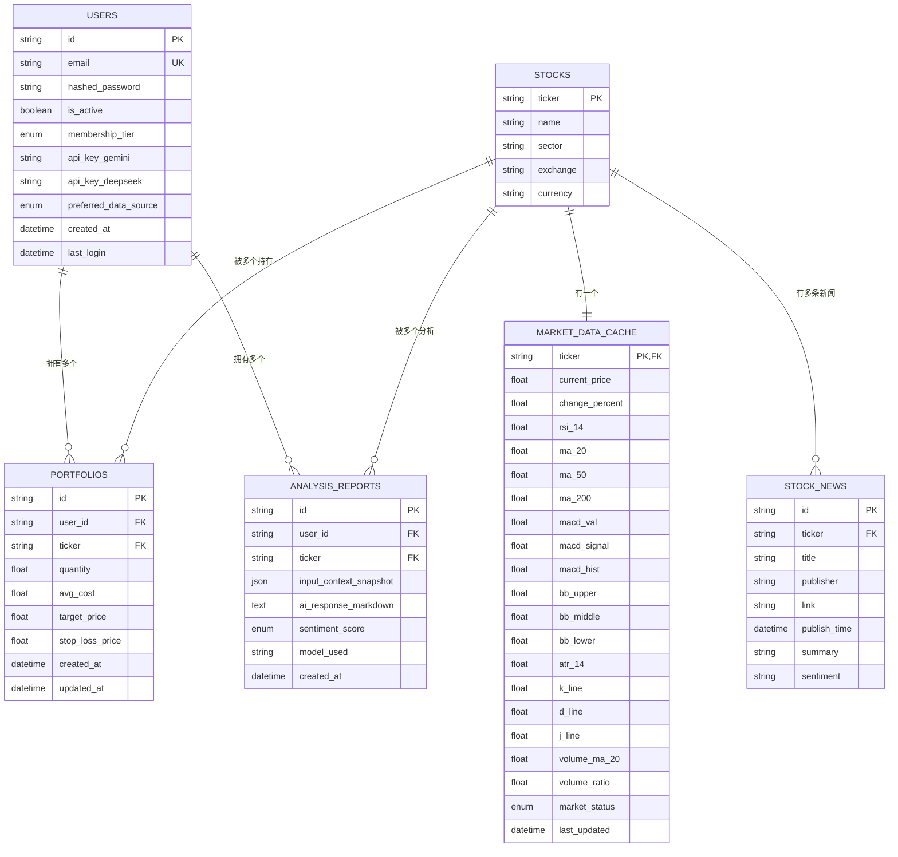

**图表来源**
- [backend/app/models/user.py](file://backend/app/models/user.py#L15-L31)
- [backend/app/models/stock.py](file://backend/app/models/stock.py#L13-L85)
- [backend/app/models/portfolio.py](file://backend/app/models/portfolio.py#L7-L26)
- [backend/app/models/analysis.py](file://backend/app/models/analysis.py#L12-L25)

### 主要实体属性定义

#### 用户实体 (Users)
- `id`: 字符串类型，UUID格式，主键，唯一标识用户
- `email`: 字符串类型，唯一索引，邮箱地址
- `hashed_password`: 字符串类型，存储密码哈希值
- `is_active`: 布尔类型，默认true，账户激活状态
- `membership_tier`: 枚举类型，会员等级(FREE/PRO)
- `api_key_gemini`: 字符串类型，加密存储Gemini API密钥
- `api_key_deepseek`: 字符串类型，加密存储DeepSeek API密钥
- `preferred_data_source`: 枚举类型，首选数据源(ALPHA_VANTAGE/YFINANCE)
- `created_at`: 日期时间类型，默认当前UTC时间
- `last_login`: 日期时间类型，最后登录时间

#### 股票实体 (Stocks)
- `ticker`: 字符串类型，主键，股票代码(如"NVDA")
- `name`: 字符串类型，公司名称
- `sector`: 字符串类型，行业板块(可选)
- `exchange`: 字符串类型，交易所名称(可选)
- `currency`: 字符串类型，默认"USD"，交易货币

#### 投资组合实体 (Portfolios)
- `id`: 字符串类型，UUID格式，主键
- `user_id`: 字符串类型，外键引用Users.id
- `ticker`: 字符串类型，外键引用Stocks.ticker
- `quantity`: 浮点数类型，持有数量
- `avg_cost`: 浮点数类型，平均成本
- `target_price`: 浮点数类型，目标价格(可选)
- `stop_loss_price`: 浮点数类型，止损价格(可选)
- `created_at`: 日期时间类型，默认当前UTC时间
- `updated_at`: 日期时间类型，默认当前UTC时间，自动更新

#### 市场数据缓存实体 (MarketDataCache)
- `ticker`: 字符串类型，主键且外键引用Stocks.ticker
- `current_price`: 浮点数类型，当前价格
- `change_percent`: 浮点数类型，涨跌幅百分比
- `rsi_14`: 浮点数类型，14日RSI指标
- `ma_20`: 浮点数类型，20日移动平均线
- `ma_50`: 浮点数类型，50日移动平均线
- `ma_200`: 浮点数类型，200日移动平均线
- `macd_val`: 浮点数类型，MACD值
- `macd_signal`: 浮点数类型，MACD信号线
- `macd_hist`: 浮点数类型，MACD柱状图
- `bb_upper`: 浮点数类型，布林带上轨
- `bb_middle`: 浮点数类型，布林带中轨
- `bb_lower`: 浮点数类型，布林带下轨
- `atr_14`: 浮点数类型，14日平均真实波幅
- `k_line`: 浮点数类型，KDJ指标K线
- `d_line`: 浮点数类型，KDJ指标D线
- `j_line`: 浮点数类型，KDJ指标J线
- `volume_ma_20`: 浮点数类型，20日成交量均值
- `volume_ratio`: 浮点数类型，成交量比率
- `market_status`: 枚举类型，市场状态(PRE_MARKET/OPEN/AFTER_HOURS/CLOSED)
- `last_updated`: 日期时间类型，索引，最后更新时间

#### AI分析报告实体 (AnalysisReports)
- `id`: 字符串类型，UUID格式，主键
- `user_id`: 字符串类型，外键引用Users.id
- `ticker`: 字符串类型，外键引用Stocks.ticker
- `input_context_snapshot`: JSON类型，分析时的上下文快照
- `ai_response_markdown`: 文本类型，AI生成的完整建议
- `sentiment_score`: 枚举类型，情感评分(BULLISH/BEARISH/NEUTRAL)
- `model_used`: 字符串类型，使用的模型名称
- `created_at`: 日期时间类型，索引，创建时间

#### 股票新闻实体 (StockNews)
- `id`: 字符串类型，主键
- `ticker`: 字符串类型，外键引用Stocks.ticker
- `title`: 字符串类型，新闻标题
- `publisher`: 字符串类型，发布者
- `link`: 字符串类型，新闻链接
- `publish_time`: 日期时间类型，发布时间
- `summary`: 字符串类型，新闻摘要
- `sentiment`: 字符串类型，情感标签

**章节来源**
- [backend/app/models/user.py](file://backend/app/models/user.py#L15-L31)
- [backend/app/models/stock.py](file://backend/app/models/stock.py#L13-L85)
- [backend/app/models/portfolio.py](file://backend/app/models/portfolio.py#L7-L26)
- [backend/app/models/analysis.py](file://backend/app/models/analysis.py#L12-L25)
- [doc/Database Schema & Data Flow Specification.md](file://doc/Database Schema & Data Flow Specification.md#L9-L74)

## 架构概览

### 数据流架构

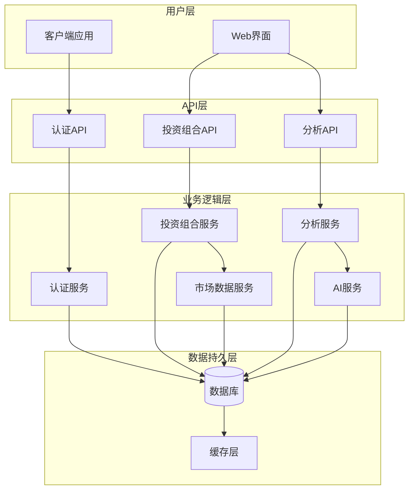

**图表来源**
- [backend/app/api/portfolio.py](file://backend/app/api/portfolio.py#L1-L297)
- [backend/app/api/analysis.py](file://backend/app/api/analysis.py#L1-L124)
- [backend/app/services/market_data.py](file://backend/app/services/market_data.py)
- [backend/app/services/ai_service.py](file://backend/app/services/ai_service.py)

### 关系映射说明

基于代码实现的关系映射：

1. **一对一关系**
   - Stock ↔ MarketDataCache: 通过Stocks.ticker与MarketDataCache.ticker建立一对一关系
   - Stock ↔ StockNews: 通过Stocks.ticker与StockNews.ticker建立一对多关系

2. **一对多关系**
   - Users → Portfolios: 一个用户可以拥有多个投资组合项
   - Users → AnalysisReports: 一个用户可以产生多个分析报告
   - Stocks → Portfolios: 一个股票可以被多个用户的投资组合持有
   - Stocks → AnalysisReports: 一个股票可以有多个分析报告

3. **多对多关系**
   - 通过中间表Portfolio实现User与Stock的多对多关系
   - 通过中间表AnalysisReport实现User与Stock的多对多关系

**章节来源**
- [backend/app/models/stock.py](file://backend/app/models/stock.py#L29-L31)
- [backend/app/models/portfolio.py](file://backend/app/models/portfolio.py#L10-L12)
- [backend/app/models/analysis.py](file://backend/app/models/analysis.py#L16-L17)

## 详细组件分析

### 用户管理模块

#### 用户实体设计

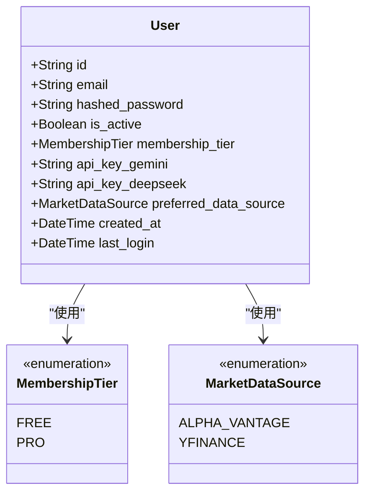

**图表来源**
- [backend/app/models/user.py](file://backend/app/models/user.py#L7-L27)

#### 用户认证流程

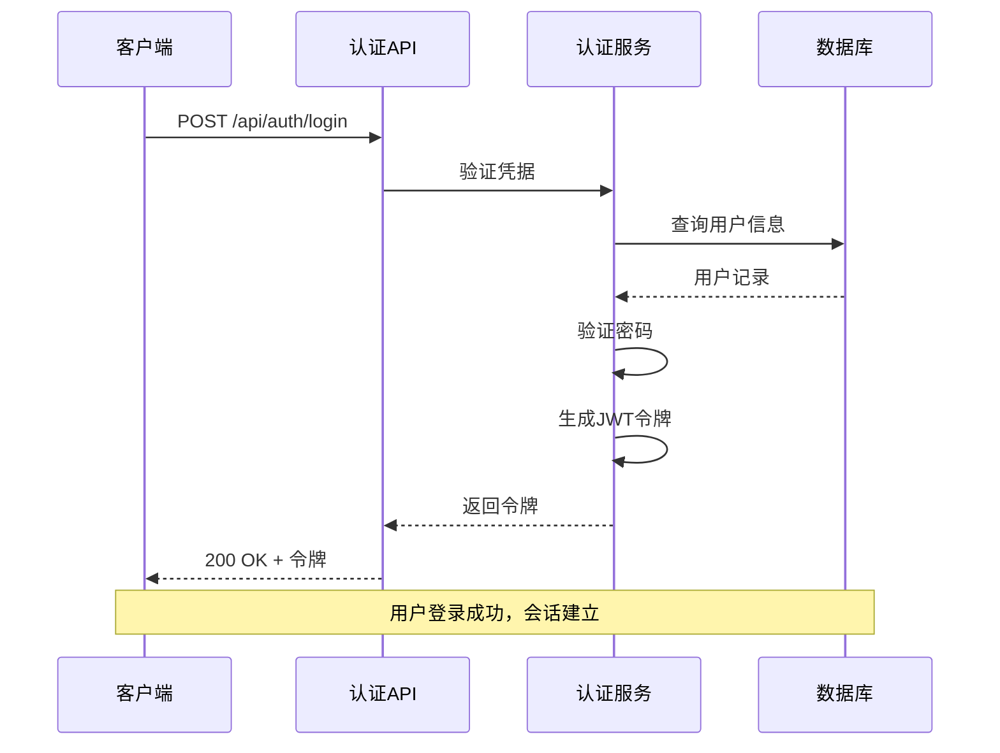

**图表来源**
- [backend/app/api/auth.py](file://backend/app/api/auth.py)
- [backend/app/models/user.py](file://backend/app/models/user.py#L15-L31)

**章节来源**
- [backend/app/models/user.py](file://backend/app/models/user.py#L15-L31)

### 投资组合管理模块

#### 投资组合实体设计

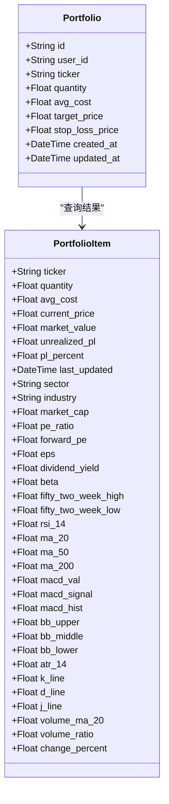

**图表来源**
- [backend/app/models/portfolio.py](file://backend/app/models/portfolio.py#L7-L26)
- [backend/app/api/portfolio.py](file://backend/app/api/portfolio.py#L15-L55)

#### 投资组合查询流程

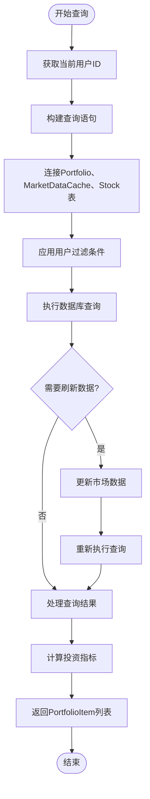

**图表来源**
- [backend/app/api/portfolio.py](file://backend/app/api/portfolio.py#L143-L224)

**章节来源**
- [backend/app/models/portfolio.py](file://backend/app/models/portfolio.py#L7-L26)
- [backend/app/api/portfolio.py](file://backend/app/api/portfolio.py#L143-L224)

### 市场数据缓存模块

#### 市场数据实体设计

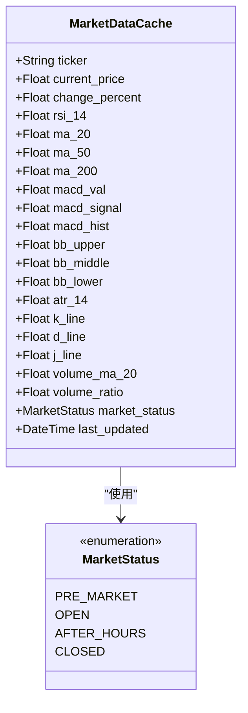

**图表来源**
- [backend/app/models/stock.py](file://backend/app/models/stock.py#L33-L67)

#### 缓存策略流程

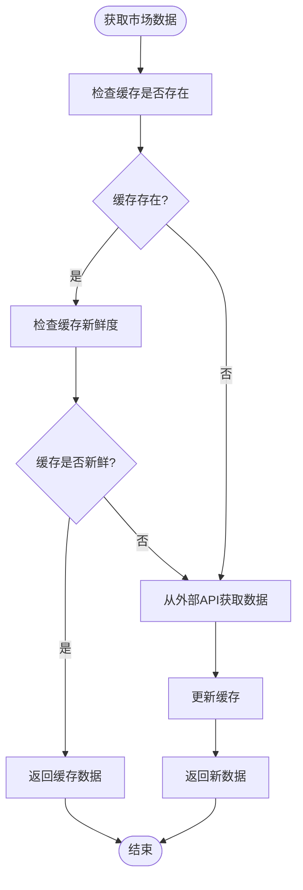

**图表来源**
- [doc/Database Schema & Data Flow Specification.md](file://doc/Database Schema & Data Flow Specification.md#L92-L100)

**章节来源**
- [backend/app/models/stock.py](file://backend/app/models/stock.py#L33-L67)
- [doc/Database Schema & Data Flow Specification.md](file://doc/Database Schema & Data Flow Specification.md#L92-L100)

### AI分析模块

#### 分析报告实体设计

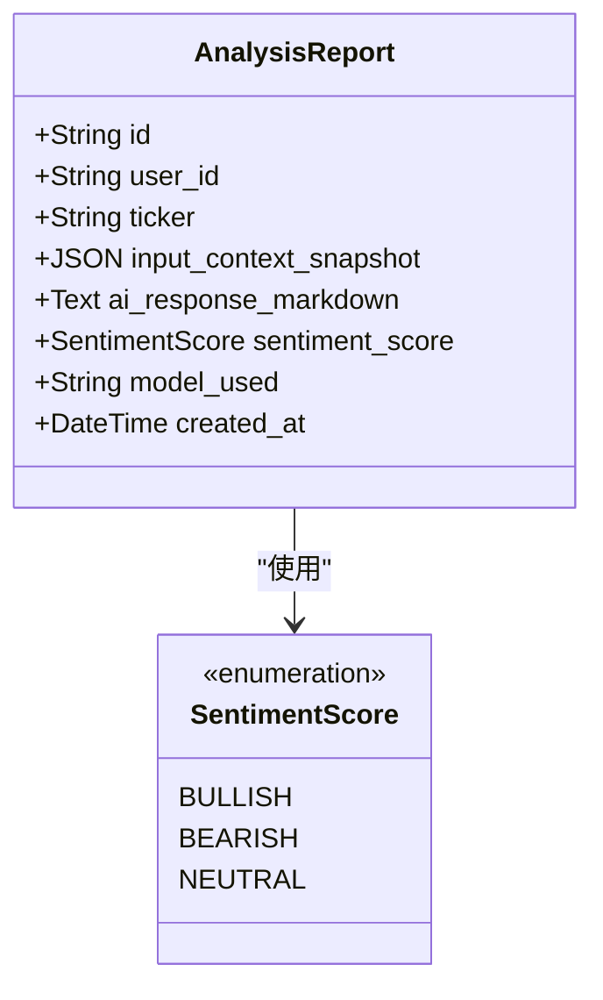

**图表来源**
- [backend/app/models/analysis.py](file://backend/app/models/analysis.py#L12-L25)

#### AI分析流程

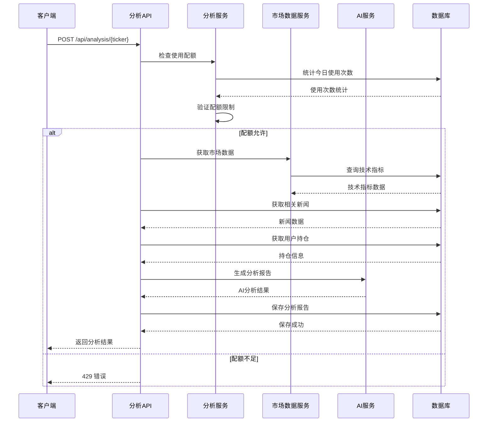

**图表来源**
- [backend/app/api/analysis.py](file://backend/app/api/analysis.py#L13-L124)

**章节来源**
- [backend/app/models/analysis.py](file://backend/app/models/analysis.py#L12-L25)
- [backend/app/api/analysis.py](file://backend/app/api/analysis.py#L13-L124)

## 依赖分析

### 数据库依赖关系

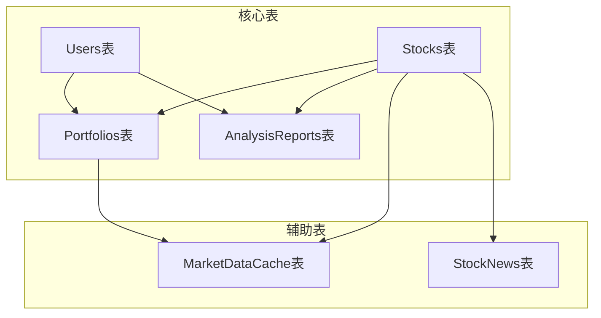

**图表来源**
- [backend/app/models/user.py](file://backend/app/models/user.py#L15-L31)
- [backend/app/models/stock.py](file://backend/app/models/stock.py#L13-L85)
- [backend/app/models/portfolio.py](file://backend/app/models/portfolio.py#L7-L26)
- [backend/app/models/analysis.py](file://backend/app/models/analysis.py#L12-L25)

### 外部依赖

项目的主要外部依赖包括：
- SQLAlchemy: ORM框架，用于数据库操作
- FastAPI: Web框架，提供RESTful API
- Alembic: 数据库迁移工具
- AsyncIO: 异步编程支持
- Pydantic: 数据验证和序列化

**章节来源**
- [backend/app/core/database.py](file://backend/app/core/database.py#L1-L24)

## 性能考虑

### 查询优化策略

1. **索引设计**
   - Users.email: 唯一索引，加速用户查找
   - MarketDataCache.ticker: 主键索引，加速缓存查询
   - MarketDataCache.last_updated: 索引，加速缓存新鲜度检查
   - StockNews.ticker: 索引，加速新闻查询
   - Portfolios.user_id + ticker: 唯一约束，防止重复持仓

2. **连接优化**
   - 投资组合查询使用LEFT JOIN减少查询次数
   - 批量操作避免N+1查询问题

3. **缓存策略**
   - 市场数据缓存减少外部API调用
   - 智能缓存失效机制避免过期数据

### 数据完整性保证

1. **主键约束**
   - 所有表都有明确的主键定义
   - UUID作为主键确保全局唯一性

2. **外键约束**
   - 明确的外键关系保证参照完整性
   - 级联删除保护相关数据一致性

3. **业务规则约束**
   - 唯一约束防止重复投资组合
   - 非空约束确保关键字段完整性

## 故障排除指南

### 常见问题及解决方案

1. **数据库连接问题**
   - 检查DATABASE_URL配置
   - 验证数据库服务状态
   - 确认网络连接可用

2. **迁移失败问题**
   - 检查Alembic版本兼容性
   - 验证数据库权限
   - 查看迁移日志错误信息

3. **性能问题**
   - 分析慢查询日志
   - 检查索引使用情况
   - 优化查询语句

4. **数据不一致问题**
   - 检查事务处理
   - 验证外键约束
   - 确认并发访问控制

**章节来源**
- [backend/app/core/database.py](file://backend/app/core/database.py#L1-L24)

## 结论

本ER模型设计充分体现了AI股票顾问系统的业务需求，通过合理的实体关系设计和约束定义，确保了数据的完整性和一致性。系统采用分层架构，清晰分离了业务逻辑、数据持久和用户界面，为未来的功能扩展和性能优化奠定了坚实基础。

关键设计亮点包括：
- 清晰的实体关系映射，支持复杂的业务场景
- 智能的数据缓存机制，提升系统性能
- 完善的业务规则约束，保证数据质量
- 可扩展的架构设计，支持功能演进

## 附录

### 数据库迁移历史

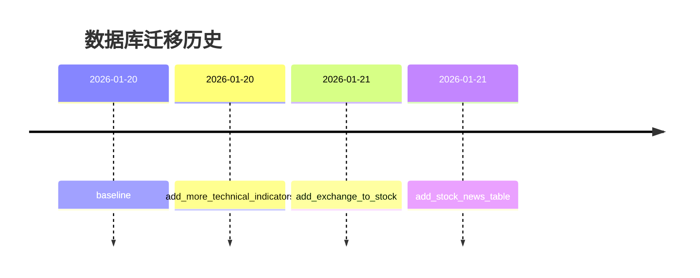

**图表来源**
- [backend/migrations/versions/35a834f440ba_baseline.py](file://backend/migrations/versions/35a834f440ba_baseline.py#L1-L33)
- [backend/migrations/versions/48d7355e90d6_add_more_technical_indicators.py](file://backend/migrations/versions/48d7355e90d6_add_more_technical_indicators.py#L1-L47)
- [backend/migrations/versions/54477ba71d32_add_exchange_to_stock.py](file://backend/migrations/versions/54477ba71d32_add_exchange_to_stock.py#L1-L33)
- [backend/migrations/versions/90eb8cc09d0d_add_stock_news_table.py](file://backend/migrations/versions/90eb8cc09d0d_add_stock_news_table.py#L1-L46)

### 业务规则总结

1. **用户管理规则**
   - 免费用户每日最多3次AI分析
   - 会员用户享有无限分析权限
   - 支持多种数据源选择

2. **投资组合规则**
   - 每个用户对同一只股票只能有一条持仓记录
   - 支持目标价格和止损价格设置
   - 自动计算未实现盈亏

3. **市场数据规则**
   - 缓存有效期为1分钟
   - 支持多种技术指标
   - 实时更新市场状态

4. **分析报告规则**
   - 记录每次AI分析的完整上下文
   - 支持情感分析和模型追踪
   - 提供使用量统计功能

**章节来源**
- [doc/Database Schema & Data Flow Specification.md](file://doc/Database Schema & Data Flow Specification.md#L75-L108)