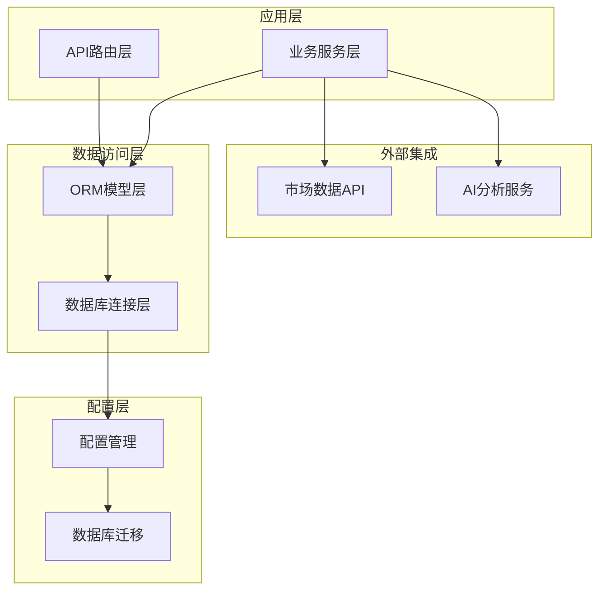
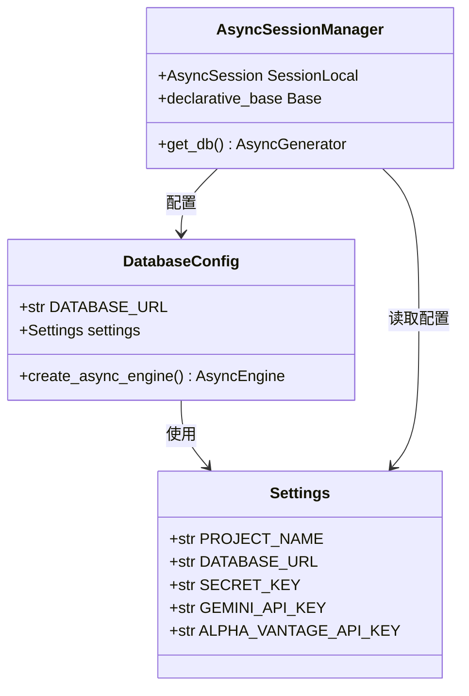
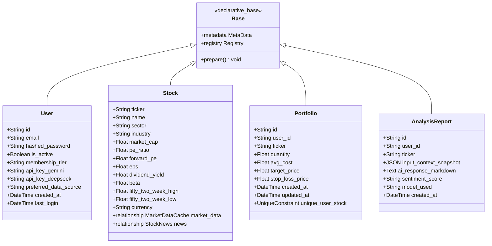
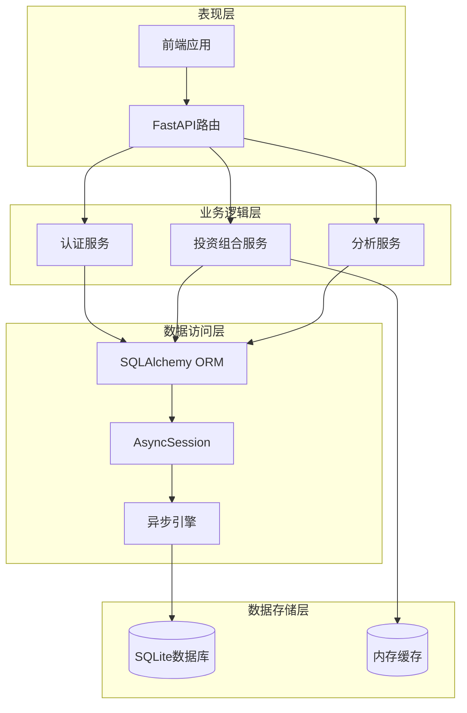
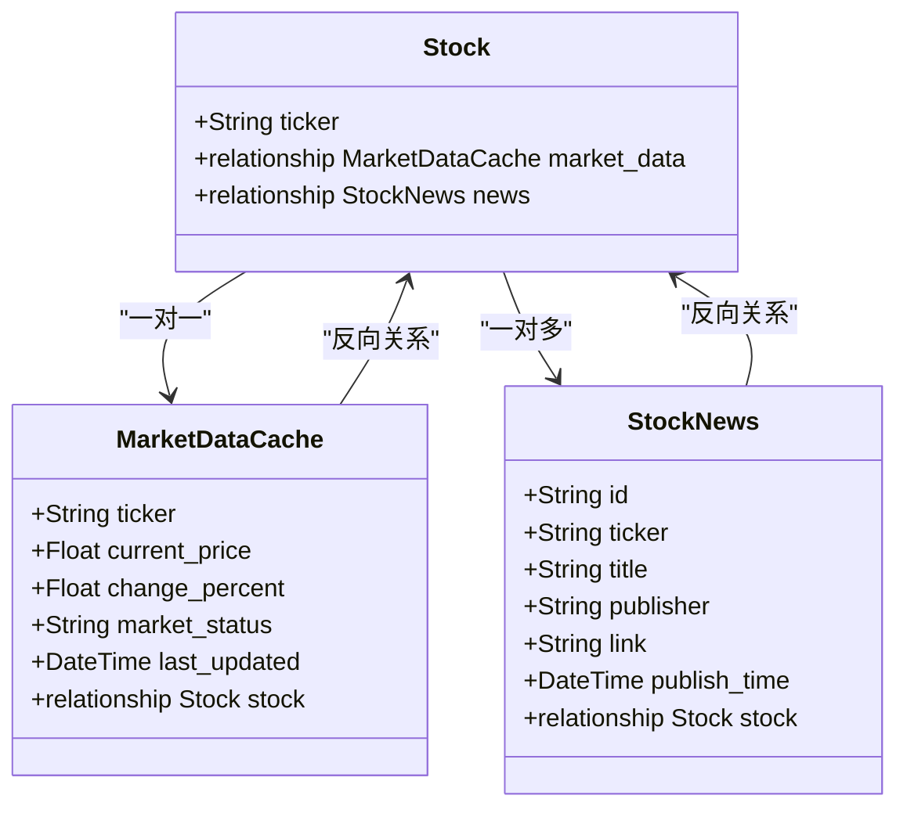
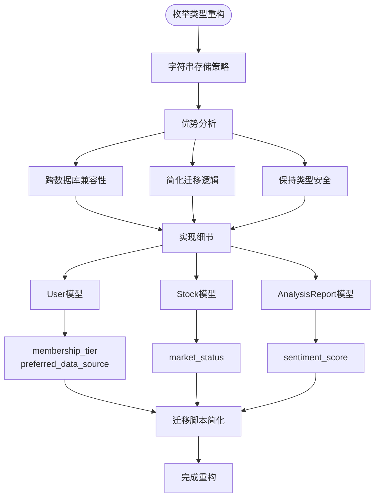
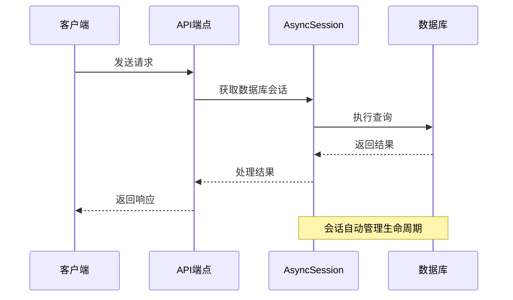
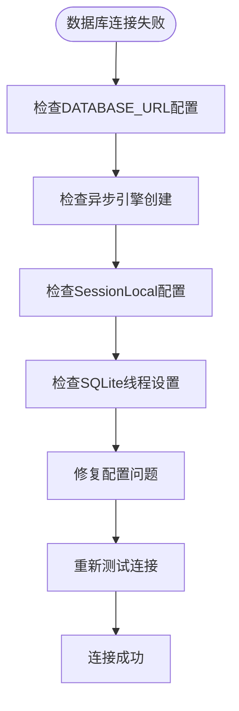
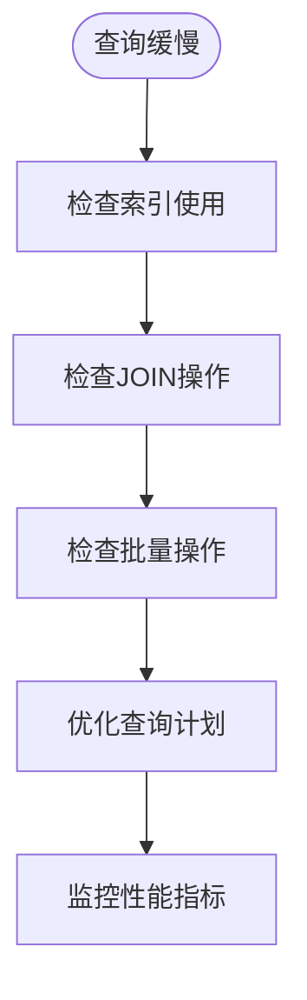

# SQLAlchemy ORM映射

<cite>
**本文档引用的文件**
- [backend/app/core/database.py](file://backend/app/core/database.py)
- [backend/app/core/config.py](file://backend/app/core/config.py)
- [backend/app/models/__init__.py](file://backend/app/models/__init__.py)
- [backend/app/models/user.py](file://backend/app/models/user.py)
- [backend/app/models/stock.py](file://backend/app/models/stock.py)
- [backend/app/models/portfolio.py](file://backend/app/models/portfolio.py)
- [backend/app/models/analysis.py](file://backend/app/models/analysis.py)
- [backend/app/api/deps.py](file://backend/app/api/deps.py)
- [backend/app/api/user.py](file://backend/app/api/user.py)
- [backend/app/api/portfolio.py](file://backend/app/api/portfolio.py)
- [backend/app/schemas/user_settings.py](file://backend/app/schemas/user_settings.py)
- [backend/migrations/env.py](file://backend/migrations/env.py)
- [backend/migrations/versions/35a834f440ba_baseline.py](file://backend/migrations/versions/35a834f440ba_baseline.py)
- [backend/app/main.py](file://backend/app/main.py)
</cite>

## 目录
1. [简介](#简介)
2. [项目结构](#项目结构)
3. [核心组件](#核心组件)
4. [架构概览](#架构概览)
5. [详细组件分析](#详细组件分析)
6. [依赖关系分析](#依赖关系分析)
7. [性能考虑](#性能考虑)
8. [故障排除指南](#故障排除指南)
9. [结论](#结论)

## 简介

本项目是一个基于FastAPI和SQLAlchemy的AI股票顾问系统，实现了完整的异步ORM映射方案。该系统采用现代Python异步编程模式，使用SQLAlchemy 2.0的异步引擎和会话管理，提供了用户管理、股票数据缓存、投资组合管理和AI分析报告等功能模块。

**重要更新**：系统已重构数据库枚举类型管理，采用字符串存储策略替代原有的PostgreSQL原生枚举类型。这一变更简化了数据库迁移逻辑，提高了跨数据库兼容性，并保持了类型安全性和数据完整性。

系统的核心特点包括：
- 完整的异步ORM会话管理
- 多种关系映射（一对一、一对多、外键关联）
- 基于字符串的枚举类型存储策略
- Alembic数据库迁移支持
- Pydantic模型与SQLAlchemy模型的转换

## 项目结构

该项目采用分层架构设计，主要分为以下层次：



**图表来源**
- [backend/app/main.py](file://backend/app/main.py#L24-L29)
- [backend/app/core/database.py](file://backend/app/core/database.py#L1-L24)

**章节来源**
- [backend/app/main.py](file://backend/app/main.py#L1-L38)
- [backend/app/core/database.py](file://backend/app/core/database.py#L1-L24)

## 核心组件

### 数据库连接配置

系统使用SQLAlchemy异步引擎进行数据库连接管理：



**图表来源**
- [backend/app/core/database.py](file://backend/app/core/database.py#L1-L24)
- [backend/app/core/config.py](file://backend/app/core/config.py#L4-L24)

系统的核心配置包括：
- 异步数据库引擎创建
- AsyncSession会话管理器
- declarative_base基类
- 数据库URL配置（支持SQLite和PostgreSQL）

**章节来源**
- [backend/app/core/database.py](file://backend/app/core/database.py#L1-L24)
- [backend/app/core/config.py](file://backend/app/core/config.py#L1-L24)

### 模型继承与Base类

SQLAlchemy的declarative_base()函数创建了一个基类，所有模型类都继承自它：



**图表来源**
- [backend/app/models/user.py](file://backend/app/models/user.py#L15-L31)
- [backend/app/models/stock.py](file://backend/app/models/stock.py#L13-L86)
- [backend/app/models/portfolio.py](file://backend/app/models/portfolio.py#L7-L26)
- [backend/app/models/analysis.py](file://backend/app/models/analysis.py#L12-L25)

**章节来源**
- [backend/app/models/user.py](file://backend/app/models/user.py#L1-L31)
- [backend/app/models/stock.py](file://backend/app/models/stock.py#L1-L86)
- [backend/app/models/portfolio.py](file://backend/app/models/portfolio.py#L1-L26)
- [backend/app/models/analysis.py](file://backend/app/models/analysis.py#L1-L25)

## 架构概览

系统采用分层架构，各层职责明确：



**图表来源**
- [backend/app/main.py](file://backend/app/main.py#L24-L29)
- [backend/app/core/database.py](file://backend/app/core/database.py#L1-L24)

## 详细组件分析

### 用户模型 (User)

用户模型是系统的核心实体，包含了用户的基本信息和配置选项：

#### 字段定义与约束

| 字段名 | 类型 | 约束 | 描述 |
|--------|------|------|------|
| id | String | 主键, 默认UUID | 用户唯一标识符 |
| email | String | 唯一索引, 非空 | 用户邮箱地址 |
| hashed_password | String | 非空 | 加密后的密码 |
| is_active | Boolean | 默认True | 用户账户状态 |
| membership_tier | String | 默认"FREE" | 会员等级（字符串枚举） |
| api_key_gemini | String | 可选 | Gemini API密钥 |
| api_key_deepseek | String | 可选 | DeepSeek API密钥 |
| preferred_data_source | String | 默认"ALPHA_VANTAGE" | 首选数据源（字符串枚举） |
| created_at | DateTime | 默认当前时间 | 创建时间 |
| last_login | DateTime | 可选 | 最后登录时间 |

#### 关系映射

用户模型通过外键关系与其他表建立联系，但当前版本中未显式定义关系属性。

**章节来源**
- [backend/app/models/user.py](file://backend/app/models/user.py#L15-L31)

### 股票模型 (Stock)

股票模型包含了详细的财务数据和技术指标：

#### 股票基本信息

| 字段名 | 类型 | 约束 | 描述 |
|--------|------|------|------|
| ticker | String | 主键, 索引 | 股票代码 |
| name | String | 可选 | 公司名称 |
| sector | String | 可选 | 行业板块 |
| industry | String | 可选 | 具体行业 |
| market_cap | Float | 可选 | 市值 |
| pe_ratio | Float | 可选 | 市盈率 |
| forward_pe | Float | 可选 | 预测市盈率 |
| eps | Float | 可选 | 每股收益 |
| dividend_yield | Float | 可选 | 股息收益率 |
| beta | Float | 可选 | 贝塔系数 |
| fifty_two_week_high | Float | 可选 | 52周最高价 |
| fifty_two_week_low | Float | 可选 | 52周最低价 |
| exchange | String | 可选 | 交易所代码 |
| currency | String | 默认"USD" | 货币单位 |

#### 技术指标数据

系统集成了丰富的技术分析指标，用于AI分析：

| 指标类别 | 字段名 | 类型 | 描述 |
|----------|--------|------|------|
| 移动平均线 | ma_20, ma_50, ma_200 | Float | 不同周期移动平均 |
| RSI指标 | rsi_14 | Float | 相对强弱指数 |
| MACD指标 | macd_val, macd_signal, macd_hist | Float | 平滑异同移动平均线 |
| 布林带 | bb_upper, bb_middle, bb_lower | Float | 布林带通道 |
| ATR指标 | atr_14 | Float | 平均真实波幅 |
| KDJ指标 | k_line, d_line, j_line | Float | 随机指标 |
| 成交量指标 | volume_ma_20, volume_ratio | Float | 成交量相关指标 |

#### 关系映射



**图表来源**
- [backend/app/models/stock.py](file://backend/app/models/stock.py#L13-L86)

**章节来源**
- [backend/app/models/stock.py](file://backend/app/models/stock.py#L1-L86)

### 投资组合模型 (Portfolio)

投资组合模型管理用户的股票持仓情况：

#### 字段定义

| 字段名 | 类型 | 约束 | 描述 |
|--------|------|------|------|
| id | String | 主键, 默认UUID | 组合项唯一标识 |
| user_id | String | 外键(users.id), 非空 | 用户标识 |
| ticker | String | 外键(stocks.ticker), 非空 | 股票代码 |
| quantity | Float | 非空 | 持有数量 |
| avg_cost | Float | 非空 | 平均成本价 |
| target_price | Float | 可选 | 目标价格 |
| stop_loss_price | Float | 可选 | 止损价格 |
| created_at | DateTime | 默认当前时间 | 创建时间 |
| updated_at | DateTime | 默认当前时间, 更新时自动更新 | 更新时间 |

#### 约束声明

系统使用UniqueConstraint确保用户不能重复持有同一股票：

```python
__table_args__ = (
    UniqueConstraint('user_id', 'ticker', name='unique_user_stock'),
)
```

**章节来源**
- [backend/app/models/portfolio.py](file://backend/app/models/portfolio.py#L1-L26)

### 分析报告模型 (AnalysisReport)

分析报告模型存储AI分析结果：

#### 字段定义

| 字段名 | 类型 | 约束 | 描述 |
|--------|------|------|------|
| id | String | 主键, 默认UUID | 报告唯一标识 |
| user_id | String | 外键(users.id), 非空 | 用户标识 |
| ticker | String | 外键(stocks.ticker), 非空 | 股票代码 |
| input_context_snapshot | JSON | 可选 | 输入上下文快照 |
| ai_response_markdown | Text | 可选 | AI响应内容 |
| sentiment_score | String | 可选 | 情感评分（字符串枚举） |
| model_used | String | 可选 | 使用的模型 |
| created_at | DateTime | 默认当前时间, 索引 | 创建时间 |

#### 字符串枚举策略

**重要更新**：系统采用基于字符串的枚举类型存储策略，替代原有的PostgreSQL原生枚举类型。这种设计具有以下优势：



**图表来源**
- [backend/app/models/user.py](file://backend/app/models/user.py#L7-L13)
- [backend/app/models/stock.py](file://backend/app/models/stock.py#L7-L11)
- [backend/app/models/analysis.py](file://backend/app/models/analysis.py#L7-L10)

**章节来源**
- [backend/app/models/analysis.py](file://backend/app/models/analysis.py#L1-L25)

## 查询构建器使用

### 基础查询操作

系统广泛使用SQLAlchemy的select()函数进行查询构建：

#### 简单查询示例

```python
# 基本查询
stmt = select(User).where(User.id == user_id)
result = await db.execute(stmt)
user = result.scalar_one_or_none()

# 条件查询
stmt = select(Stock).where(
    or_(
        Stock.ticker.ilike(search_term),
        Stock.name.ilike(search_term)
    )
).limit(10)
```

#### 连接查询示例

```python
# 多表连接查询
stmt = (
    select(Portfolio, MarketDataCache, Stock)
    .outerjoin(MarketDataCache, Portfolio.ticker == MarketDataCache.ticker)
    .outerjoin(Stock, Portfolio.ticker == Stock.ticker)
    .where(Portfolio.user_id == user_id)
)
```

#### 排序和过滤

```python
# 排序查询
stmt = select(Stock).order_by(Stock.ticker.asc())

# 复杂条件查询
stmt = select(Portfolio).where(
    Portfolio.user_id == user_id,
    Portfolio.ticker.in_(tickers)
)
```

**章节来源**
- [backend/app/api/portfolio.py](file://backend/app/api/portfolio.py#L68-L84)
- [backend/app/api/portfolio.py](file://backend/app/api/portfolio.py#L151-L157)

### 异步会话管理

系统使用AsyncSession进行异步数据库操作：



**图表来源**
- [backend/app/core/database.py](file://backend/app/core/database.py#L21-L23)
- [backend/app/api/deps.py](file://backend/app/api/deps.py#L17-L43)

**章节来源**
- [backend/app/core/database.py](file://backend/app/core/database.py#L1-L24)
- [backend/app/api/deps.py](file://backend/app/api/deps.py#L1-L44)

## 性能优化技巧

### 懒加载与急切加载

系统在查询时采用了适当的加载策略：

#### 急切加载示例

```python
# 在投资组合查询中使用急切加载
stmt = (
    select(Portfolio, MarketDataCache, Stock)
    .outerjoin(MarketDataCache, Portfolio.ticker == MarketDataCache.ticker)
    .outerjoin(Stock, Portfolio.ticker == Stock.ticker)
    .where(Portfolio.user_id == user_id)
)
```

#### 懒加载策略

对于不需要立即访问的关系数据，系统采用懒加载以减少初始查询开销。

### 批量操作

系统实现了批量数据处理机制：

```python
# 批量更新技术指标
if refresh:
    tickers = [p.ticker for p, _, _ in rows]
    if tickers:
        # 顺序更新以避免并发问题
        for ticker in tickers:
            await MarketDataService.get_real_time_data(ticker, db, current_user.preferred_data_source)
```

### 索引优化

系统在关键字段上建立了索引以提高查询性能：

- 用户邮箱：唯一索引
- 股票代码：主键和索引
- 股票搜索：模糊匹配索引
- 分析报告：时间戳索引
- 市场数据缓存：最后更新时间索引

**章节来源**
- [backend/app/models/user.py](file://backend/app/models/user.py#L18-L19)
- [backend/app/models/stock.py](file://backend/app/models/stock.py#L64-L65)
- [backend/app/models/analysis.py](file://backend/app/models/analysis.py#L24-L24)

## 故障排除指南

### 常见问题诊断

#### 数据库连接问题



#### 查询性能问题



### 错误处理机制

系统在多个层面实现了错误处理：

- **API层**：HTTP异常处理和状态码返回
- **数据库层**：事务回滚和连接池管理
- **业务层**：业务逻辑验证和异常捕获

**章节来源**
- [backend/app/api/deps.py](file://backend/app/api/deps.py#L28-L33)
- [backend/app/api/user.py](file://backend/app/api/user.py#L30-L33)

## 结论

本项目展示了现代Python异步ORM应用的最佳实践，具有以下特点：

1. **完整的异步架构**：从数据库连接到API路由的全异步实现
2. **清晰的数据模型设计**：合理的表结构和关系映射
3. **高性能的查询优化**：适当的索引和加载策略
4. **完善的错误处理**：多层次的异常处理机制
5. **可扩展的架构**：模块化的代码组织和清晰的职责分离
6. **简化的枚举类型管理**：基于字符串的存储策略替代复杂数据库枚举类型

**重要更新总结**：通过采用基于字符串的枚举类型存储策略，系统实现了：
- 更好的跨数据库兼容性
- 简化的数据库迁移逻辑
- 保持了类型安全性和数据完整性
- 提高了系统的可维护性

该系统为AI驱动的金融分析应用提供了坚实的数据基础设施，支持复杂的股票分析和投资组合管理功能。通过合理的ORM映射设计和性能优化策略，系统能够高效地处理大量的市场数据和用户请求。