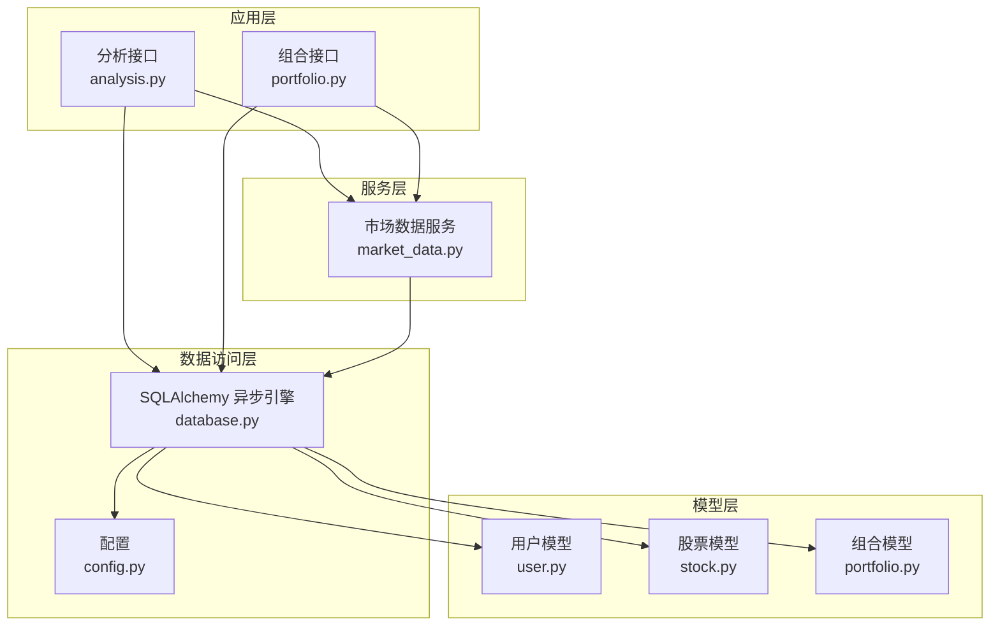
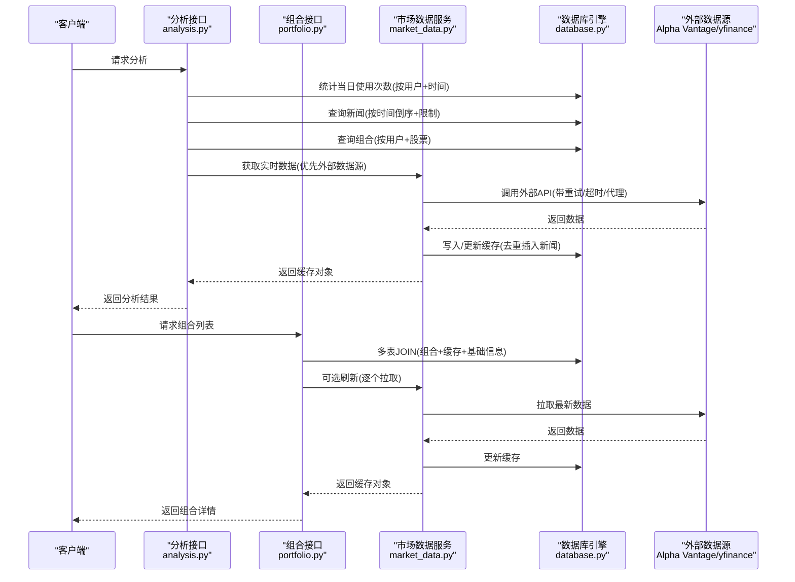
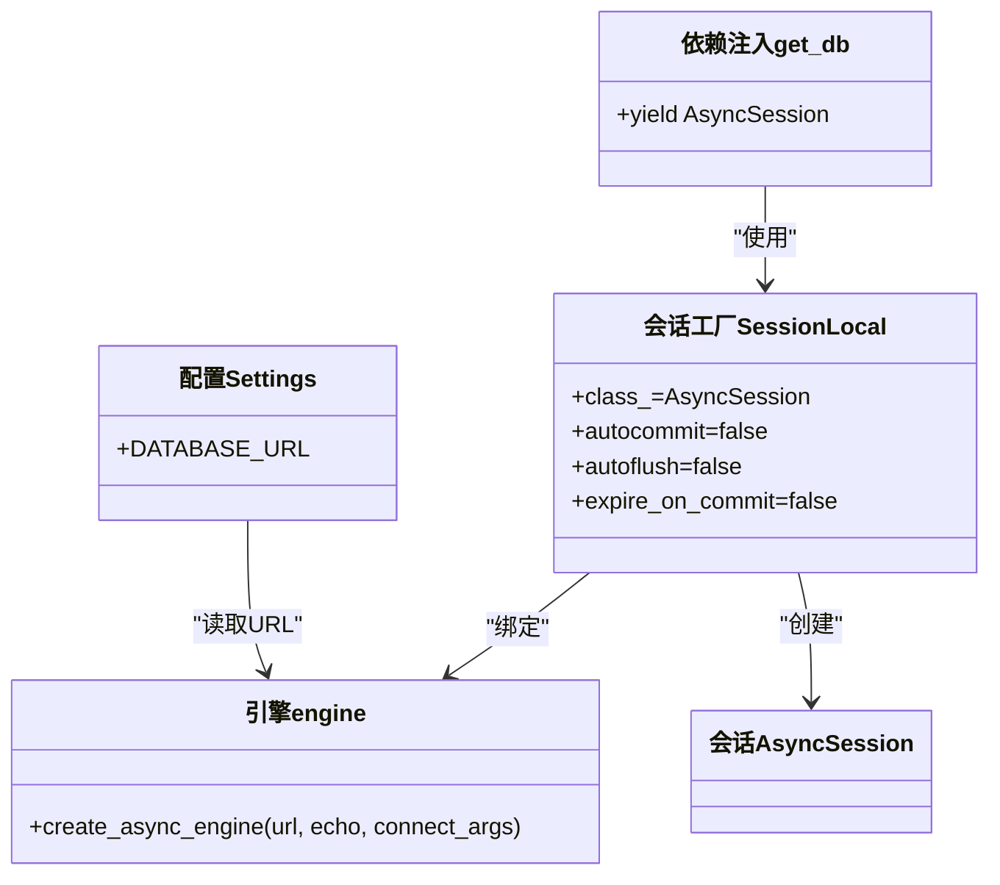
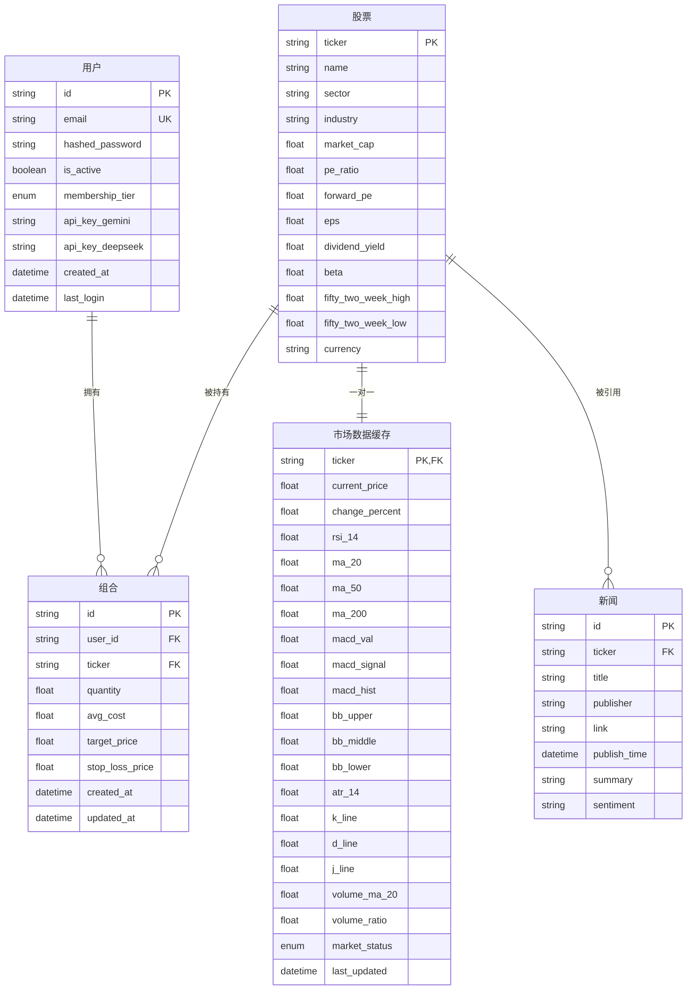
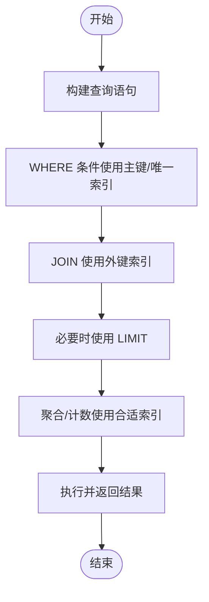
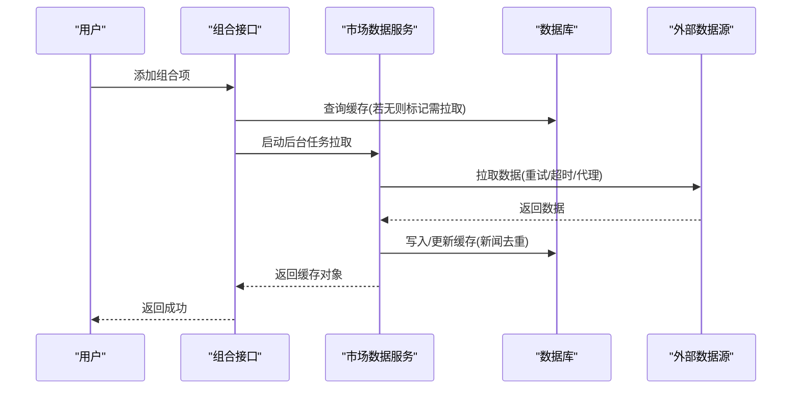
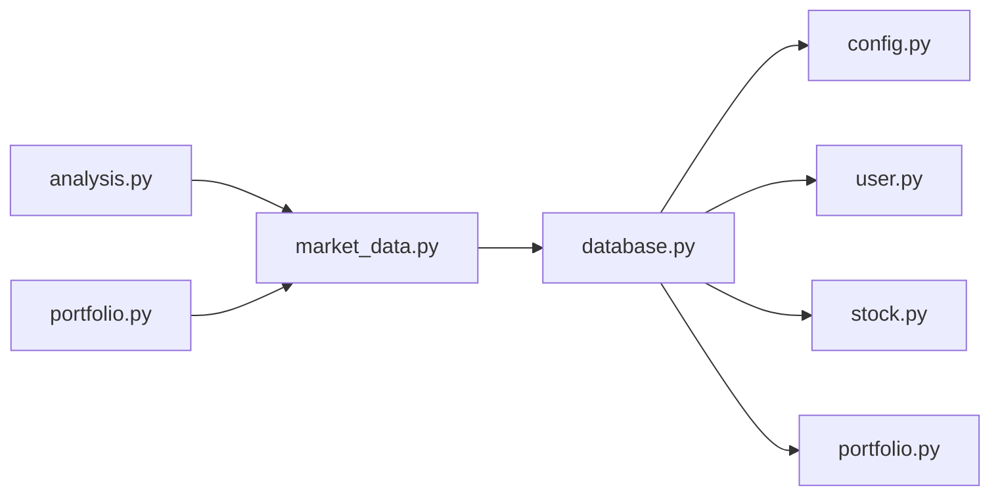

# 性能优化策略

<cite>
**本文引用的文件**
- [backend/app/core/database.py](file://backend/app/core/database.py)
- [backend/app/core/config.py](file://backend/app/core/config.py)
- [backend/app/models/stock.py](file://backend/app/models/stock.py)
- [backend/app/models/user.py](file://backend/app/models/user.py)
- [backend/app/models/portfolio.py](file://backend/app/models/portfolio.py)
- [backend/app/api/analysis.py](file://backend/app/api/analysis.py)
- [backend/app/api/portfolio.py](file://backend/app/api/portfolio.py)
- [backend/app/services/market_data.py](file://backend/app/services/market_data.py)
- [doc/Database Schema & Data Flow Specification.md](file://doc/Database Schema & Data Flow Specification.md)
- [backend/requirements.txt](file://backend/requirements.txt)
- [backend/migrations/versions/90eb8cc09d0d_add_stock_news_table.py](file://backend/migrations/versions/90eb8cc09d0d_add_stock_news_table.py)
</cite>

## 目录
1. [简介](#简介)
2. [项目结构](#项目结构)
3. [核心组件](#核心组件)
4. [架构总览](#架构总览)
5. [详细组件分析](#详细组件分析)
6. [依赖关系分析](#依赖关系分析)
7. [性能考量与优化建议](#性能考量与优化建议)
8. [故障排查指南](#故障排查指南)
9. [结论](#结论)
10. [附录](#附录)

## 简介
本文件面向数据库性能优化，结合现有代码库中的数据库连接、ORM 映射、查询路径与缓存策略，系统性梳理索引设计、查询优化、连接池配置、缓存机制、慢查询分析、分区与分表、内存与磁盘 I/O 优化，并提供性能测试与基准测试方法建议。目标是在不改变业务语义的前提下，提升查询效率、降低外部 API 调用频率、减少数据库压力并增强整体响应能力。

## 项目结构
后端采用 FastAPI + SQLAlchemy 2.x 异步 ORM 架构，数据库连接通过异步引擎创建，模型定义在 models 目录下，API 层负责路由与业务编排，service 层封装市场数据获取与缓存更新逻辑。迁移脚本用于演进表结构（含索引）。

图表来源
- [backend/app/api/analysis.py](file://backend/app/api/analysis.py#L1-L128)
- [backend/app/api/portfolio.py](file://backend/app/api/portfolio.py#L1-L297)
- [backend/app/services/market_data.py](file://backend/app/services/market_data.py#L1-L370)
- [backend/app/core/database.py](file://backend/app/core/database.py#L1-L24)
- [backend/app/core/config.py](file://backend/app/core/config.py#L1-L25)
- [backend/app/models/user.py](file://backend/app/models/user.py#L1-L31)
- [backend/app/models/stock.py](file://backend/app/models/stock.py#L1-L85)
- [backend/app/models/portfolio.py](file://backend/app/models/portfolio.py#L1-L26)

章节来源
- [backend/app/core/database.py](file://backend/app/core/database.py#L1-L24)
- [backend/app/core/config.py](file://backend/app/core/config.py#L1-L25)
- [backend/app/models/stock.py](file://backend/app/models/stock.py#L1-L85)
- [backend/app/models/user.py](file://backend/app/models/user.py#L1-L31)
- [backend/app/models/portfolio.py](file://backend/app/models/portfolio.py#L1-L26)
- [backend/app/api/analysis.py](file://backend/app/api/analysis.py#L1-L128)
- [backend/app/api/portfolio.py](file://backend/app/api/portfolio.py#L1-L297)
- [backend/app/services/market_data.py](file://backend/app/services/market_data.py#L1-L370)
- [doc/Database Schema & Data Flow Specification.md](file://doc/Database Schema & Data Flow Specification.md#L1-L108)

## 核心组件
- 数据库连接与会话
  - 使用异步引擎创建连接，基于配置类读取数据库 URL；会话工厂提供 AsyncSession，支持自动提交、自动刷新关闭控制与过期对象管理。
- 模型与索引
  - 用户表 email 字段建立唯一索引；股票表 ticker 主键且带索引；市场数据缓存 ticker 主键且带 last_updated 索引；新闻表 ticker 建有索引；组合表 user_id/ticker 建有唯一约束。
- 查询路径
  - 分析接口：统计当日使用次数（按用户与时间范围聚合）、查询新闻（按时间倒序限制条数）、查询组合（按用户与股票过滤）、调用 AI 服务。
  - 组合接口：多表 JOIN 获取组合项、缓存数据与基础信息，支持刷新与后台拉取。
- 缓存策略
  - 市场数据缓存表提供 1 分钟内读取缓存、否则拉取外部数据并写回缓存；同时写入新闻去重插入。
- 外部数据源
  - 支持 Alpha Vantage 与 yfinance，具备重试、超时、代理与限流处理。

章节来源
- [backend/app/core/database.py](file://backend/app/core/database.py#L1-L24)
- [backend/app/models/user.py](file://backend/app/models/user.py#L18-L20)
- [backend/app/models/stock.py](file://backend/app/models/stock.py#L16-L17)
- [backend/app/models/stock.py](file://backend/app/models/stock.py#L65-L65)
- [backend/migrations/versions/90eb8cc09d0d_add_stock_news_table.py](file://backend/migrations/versions/90eb8cc09d0d_add_stock_news_table.py#L35-L35)
- [backend/app/models/portfolio.py](file://backend/app/models/portfolio.py#L21-L23)
- [backend/app/api/analysis.py](file://backend/app/api/analysis.py#L38-L42)
- [backend/app/api/analysis.py](file://backend/app/api/analysis.py#L85-L89)
- [backend/app/api/analysis.py](file://backend/app/api/analysis.py#L92-L96)
- [backend/app/api/portfolio.py](file://backend/app/api/portfolio.py#L151-L159)
- [backend/app/services/market_data.py](file://backend/app/services/market_data.py#L16-L24)
- [backend/app/services/market_data.py](file://backend/app/services/market_data.py#L150-L167)

## 架构总览
下图展示从 API 到服务再到数据库与外部数据源的整体流程，以及缓存与索引在查询路径中的作用。

图表来源
- [backend/app/api/analysis.py](file://backend/app/api/analysis.py#L38-L51)
- [backend/app/api/analysis.py](file://backend/app/api/analysis.py#L85-L89)
- [backend/app/api/analysis.py](file://backend/app/api/analysis.py#L92-L96)
- [backend/app/api/portfolio.py](file://backend/app/api/portfolio.py#L151-L159)
- [backend/app/services/market_data.py](file://backend/app/services/market_data.py#L15-L57)
- [backend/app/services/market_data.py](file://backend/app/services/market_data.py#L150-L167)
- [backend/app/core/database.py](file://backend/app/core/database.py#L1-L24)

## 详细组件分析

### 数据库连接与会话
- 连接创建
  - 通过配置类读取 DATABASE_URL，构建异步引擎；SQLite 场景设置线程检查参数。
- 会话工厂
  - 使用 AsyncSession，关闭自动提交与自动刷新，避免频繁提交；expire_on_commit 控制对象过期行为。
- 依赖注入
  - 提供 get_db 依赖，确保每个请求在上下文中获取独立会话并正确释放。

图表来源
- [backend/app/core/config.py](file://backend/app/core/config.py#L4-L7)
- [backend/app/core/database.py](file://backend/app/core/database.py#L5-L17)
- [backend/app/core/database.py](file://backend/app/core/database.py#L21-L24)

章节来源
- [backend/app/core/config.py](file://backend/app/core/config.py#L1-L25)
- [backend/app/core/database.py](file://backend/app/core/database.py#L1-L24)

### 模型与索引设计
- 用户表
  - email 唯一索引，适合按邮箱登录与去重。
- 股票表
  - ticker 主键且带索引，适合作为外键与查询主键。
- 市场数据缓存表
  - ticker 主键；last_updated 建有索引，用于“近实时”读取判断与排序。
- 新闻表
  - ticker 建有索引，便于按股票筛选新闻。
- 组合表
  - user_id/ticker 唯一约束，保证用户对单一股票仅有一条持仓记录。

图表来源
- [backend/app/models/user.py](file://backend/app/models/user.py#L18-L20)
- [backend/app/models/stock.py](file://backend/app/models/stock.py#L16-L17)
- [backend/app/models/stock.py](file://backend/app/models/stock.py#L65-L65)
- [backend/migrations/versions/90eb8cc09d0d_add_stock_news_table.py](file://backend/migrations/versions/90eb8cc09d0d_add_stock_news_table.py#L35-L35)
- [backend/app/models/portfolio.py](file://backend/app/models/portfolio.py#L21-L23)

章节来源
- [backend/app/models/user.py](file://backend/app/models/user.py#L1-L31)
- [backend/app/models/stock.py](file://backend/app/models/stock.py#L1-L85)
- [backend/app/models/portfolio.py](file://backend/app/models/portfolio.py#L1-L26)
- [backend/migrations/versions/90eb8cc09d0d_add_stock_news_table.py](file://backend/migrations/versions/90eb8cc09d0d_add_stock_news_table.py#L1-L47)

### 查询优化实践
- WHERE 条件优化
  - 使用精确主键或唯一索引字段过滤，如按 ticker、user_id/ticker、email 等。
- JOIN 优化
  - 组合接口使用多表 JOIN 并在外键上建立索引，减少子查询与多次往返。
- LIMIT 使用
  - 新闻查询与搜索接口均使用 LIMIT 控制返回量，避免全表扫描与大结果集传输。
- 聚合与计数
  - 分析接口按用户与日期范围进行 COUNT 聚合，建议在 created_at 上建索引以加速日粒度统计。

图表来源
- [backend/app/api/analysis.py](file://backend/app/api/analysis.py#L38-L42)
- [backend/app/api/analysis.py](file://backend/app/api/analysis.py#L85-L89)
- [backend/app/api/analysis.py](file://backend/app/api/analysis.py#L92-L96)
- [backend/app/api/portfolio.py](file://backend/app/api/portfolio.py#L151-L159)

章节来源
- [backend/app/api/analysis.py](file://backend/app/api/analysis.py#L38-L51)
- [backend/app/api/analysis.py](file://backend/app/api/analysis.py#L85-L96)
- [backend/app/api/portfolio.py](file://backend/app/api/portfolio.py#L151-L159)

### 缓存机制设计
- 市场数据缓存
  - 1 分钟内直接读取缓存，避免外部 API 调用；超过阈值则拉取并更新缓存。
- 新闻去重
  - 使用 SQLite upsert 逻辑避免重复插入新闻。
- 后台刷新
  - 添加组合项时若缓存缺失或指标不完整，启动后台任务异步拉取最新数据。

图表来源
- [backend/app/api/portfolio.py](file://backend/app/api/portfolio.py#L259-L271)
- [backend/app/services/market_data.py](file://backend/app/services/market_data.py#L16-L24)
- [backend/app/services/market_data.py](file://backend/app/services/market_data.py#L150-L167)

章节来源
- [backend/app/services/market_data.py](file://backend/app/services/market_data.py#L15-L170)
- [backend/app/api/portfolio.py](file://backend/app/api/portfolio.py#L259-L271)

### 连接池配置与复用策略
- 当前实现
  - 使用 SQLAlchemy 异步引擎与会话工厂，未显式配置连接池参数。
- 建议
  - 在生产环境根据并发与资源设定最大连接数、空闲连接数、连接超时与回收策略；对 SQLite 使用 aiosqlite 时注意线程安全与并发限制；对 PostgreSQL 使用 asyncpg 时启用连接池参数以提升吞吐。

章节来源
- [backend/app/core/database.py](file://backend/app/core/database.py#L5-L17)
- [backend/requirements.txt](file://backend/requirements.txt#L1-L75)

### 慢查询分析与性能监控
- 执行计划分析
  - 对高频查询（如分析接口的计数、新闻查询、组合 JOIN）开启 SQL 日志与执行计划分析，定位索引缺失或回表过多。
- 性能监控
  - 结合数据库自带的慢查询日志与连接数统计；在应用侧记录关键路径耗时（请求进入、数据库查询、外部 API 调用、返回），形成端到端时延画像。
- 工具推荐
  - 数据库：SQLite/PostgreSQL 自带分析工具；Python：sqlalchemy-utils、performance insights；外部 API：限流与重试统计。

章节来源
- [backend/app/api/analysis.py](file://backend/app/api/analysis.py#L38-L51)
- [backend/app/api/analysis.py](file://backend/app/api/analysis.py#L85-L89)
- [backend/app/api/portfolio.py](file://backend/app/api/portfolio.py#L151-L159)
- [backend/app/services/market_data.py](file://backend/app/services/market_data.py#L15-L57)

### 分区与分表策略
- 适用场景
  - 大规模数据（如 AnalysisReports、StockNews）按时间分区（如按月/季度）可显著降低扫描范围。
- 实施建议
  - 选择时间字段（如 created_at）作为分区键；对高频查询字段建立二级索引；滚动清理历史数据，保持热数据高效。

章节来源
- [doc/Database Schema & Data Flow Specification.md](file://doc/Database Schema & Data Flow Specification.md#L62-L74)
- [backend/app/models/stock.py](file://backend/app/models/stock.py#L72-L79)

### 内存与磁盘 I/O 优化
- 内存
  - 减少一次性加载大结果集；使用分页或批量处理；避免在 Python 层做昂贵计算，尽量下沉到数据库（聚合、排序、LIMIT）。
- 磁盘
  - SQLite 场景建议 WAL 模式与合适的同步策略；对写密集场景考虑 SSD；合理设置缓存大小与刷新周期，降低随机写放大。

章节来源
- [backend/app/services/market_data.py](file://backend/app/services/market_data.py#L150-L167)
- [doc/Database Schema & Data Flow Specification.md](file://doc/Database Schema & Data Flow Specification.md#L48-L60)

### 性能测试与基准测试
- 方法
  - 使用数据库压测工具对关键查询（计数、JOIN、LIMIT）进行并发与吞吐测试；模拟真实流量（登录、搜索、组合刷新、分析）。
- 工具推荐
  - 数据库：sysbench、pgbench（PostgreSQL）、SQLitebench；Python：locust、pytest-benchmark；外部 API：自定义限流与延迟注入测试。

章节来源
- [backend/app/api/analysis.py](file://backend/app/api/analysis.py#L38-L51)
- [backend/app/api/portfolio.py](file://backend/app/api/portfolio.py#L151-L159)
- [backend/app/services/market_data.py](file://backend/app/services/market_data.py#L15-L57)

## 依赖关系分析
- 组件耦合
  - API 层依赖服务层与数据库会话；服务层依赖模型与外部数据源；模型依赖数据库基类与关系定义。
- 外部依赖
  - SQLAlchemy 异步 ORM、FastAPI、yfinance、requests；生产环境建议明确连接池参数与超时策略。

图表来源
- [backend/app/api/analysis.py](file://backend/app/api/analysis.py#L1-L128)
- [backend/app/api/portfolio.py](file://backend/app/api/portfolio.py#L1-L297)
- [backend/app/services/market_data.py](file://backend/app/services/market_data.py#L1-L370)
- [backend/app/core/database.py](file://backend/app/core/database.py#L1-L24)
- [backend/app/core/config.py](file://backend/app/core/config.py#L1-L25)
- [backend/app/models/user.py](file://backend/app/models/user.py#L1-L31)
- [backend/app/models/stock.py](file://backend/app/models/stock.py#L1-L85)
- [backend/app/models/portfolio.py](file://backend/app/models/portfolio.py#L1-L26)

章节来源
- [backend/app/api/analysis.py](file://backend/app/api/analysis.py#L1-L128)
- [backend/app/api/portfolio.py](file://backend/app/api/portfolio.py#L1-L297)
- [backend/app/services/market_data.py](file://backend/app/services/market_data.py#L1-L370)
- [backend/app/core/database.py](file://backend/app/core/database.py#L1-L24)
- [backend/app/core/config.py](file://backend/app/core/config.py#L1-L25)
- [backend/app/models/user.py](file://backend/app/models/user.py#L1-L31)
- [backend/app/models/stock.py](file://backend/app/models/stock.py#L1-L85)
- [backend/app/models/portfolio.py](file://backend/app/models/portfolio.py#L1-L26)

## 性能考量与优化建议

### 索引设计策略
- 主键索引
  - 已在核心表（用户、股票、组合、新闻、分析记录）建立主键，确保唯一性与快速定位。
- 复合索引
  - 建议在 AnalysisReports 的 user_id + created_at 上建立复合索引，加速日粒度计数与报表统计。
  - 在 StockNews 的 ticker + publish_time 建立复合索引，优化新闻按股票与时间的检索。
- 唯一索引
  - 组合表的 user_id/ticker 唯一约束已满足业务需求，避免重复持仓。

章节来源
- [backend/app/models/portfolio.py](file://backend/app/models/portfolio.py#L21-L23)
- [backend/app/models/stock.py](file://backend/app/models/stock.py#L72-L79)
- [doc/Database Schema & Data Flow Specification.md](file://doc/Database Schema & Data Flow Specification.md#L62-L74)

### 查询优化技巧
- WHERE 条件
  - 优先使用主键或唯一索引字段过滤；避免在索引列上使用函数或隐式转换。
- JOIN
  - 确保 JOIN 字段均有索引；尽量减少不必要的列选择，使用投影裁剪。
- LIMIT
  - 对分页与热门查询使用 LIMIT；配合 ORDER BY 的索引字段，避免全表排序。

章节来源
- [backend/app/api/analysis.py](file://backend/app/api/analysis.py#L38-L51)
- [backend/app/api/analysis.py](file://backend/app/api/analysis.py#L85-L89)
- [backend/app/api/portfolio.py](file://backend/app/api/portfolio.py#L151-L159)

### 连接池配置
- 建议
  - 设置最大连接数、空闲连接、连接超时与回收策略；对 SQLite 使用 aiosqlite 时注意并发限制；对 PostgreSQL 使用 asyncpg 时启用连接池参数。

章节来源
- [backend/app/core/database.py](file://backend/app/core/database.py#L5-L17)
- [backend/requirements.txt](file://backend/requirements.txt#L1-L75)

### 缓存机制设计
- 查询结果缓存
  - 市场数据缓存表提供 1 分钟窗口内的读缓存，减少外部 API 调用与数据库写压力。
- 热点数据缓存
  - 对高频股票与用户行为（搜索、组合）建立应用层缓存（如 Redis），缩短冷启动与重复计算。

章节来源
- [backend/app/services/market_data.py](file://backend/app/services/market_data.py#L16-L24)
- [doc/Database Schema & Data Flow Specification.md](file://doc/Database Schema & Data Flow Specification.md#L48-L60)

### 慢查询分析与性能监控
- 建议
  - 开启 SQL 日志与执行计划分析；记录端到端时延；对外部 API 调用增加重试与超时统计。

章节来源
- [backend/app/api/analysis.py](file://backend/app/api/analysis.py#L38-L51)
- [backend/app/api/analysis.py](file://backend/app/api/analysis.py#L85-L89)
- [backend/app/api/portfolio.py](file://backend/app/api/portfolio.py#L151-L159)
- [backend/app/services/market_data.py](file://backend/app/services/market_data.py#L15-L57)

### 分区与分表策略
- 建议
  - 对 AnalysisReports、StockNews 按时间分区；对高频查询字段建立二级索引；定期归档历史数据。

章节来源
- [doc/Database Schema & Data Flow Specification.md](file://doc/Database Schema & Data Flow Specification.md#L62-L74)
- [backend/app/models/stock.py](file://backend/app/models/stock.py#L72-L79)

### 内存与磁盘 I/O 优化
- 建议
  - 使用分页与批量处理；减少 Python 层计算；SQLite 使用 WAL 模式与合适同步策略；写密集场景使用 SSD。

章节来源
- [backend/app/services/market_data.py](file://backend/app/services/market_data.py#L150-L167)
- [doc/Database Schema & Data Flow Specification.md](file://doc/Database Schema & Data Flow Specification.md#L48-L60)

### 性能测试与基准测试
- 建议
  - 对关键查询进行并发与吞吐测试；模拟真实流量；对外部 API 增加重试与延迟注入测试。

章节来源
- [backend/app/api/analysis.py](file://backend/app/api/analysis.py#L38-L51)
- [backend/app/api/portfolio.py](file://backend/app/api/portfolio.py#L151-L159)
- [backend/app/services/market_data.py](file://backend/app/services/market_data.py#L15-L57)

## 故障排查指南
- 外部 API 限流
  - yfinance 429 时采用指数退避与抖动；Alpha Vantage 达到配额时抛出异常，需切换备用源或等待配额恢复。
- 缓存一致性
  - 若缓存未及时更新，检查 last_updated 刷新逻辑与后台任务状态。
- 查询缓慢
  - 检查是否存在全表扫描、缺少索引或未使用 LIMIT；确认数据库执行计划与索引使用情况。

章节来源
- [backend/app/services/market_data.py](file://backend/app/services/market_data.py#L30-L57)
- [backend/app/services/market_data.py](file://backend/app/services/market_data.py#L303-L318)
- [backend/app/services/market_data.py](file://backend/app/services/market_data.py#L150-L167)

## 结论
通过合理的索引设计、查询优化、缓存策略与连接池配置，可在不牺牲功能性的前提下显著提升系统性能。建议在生产环境中补充连接池参数、慢查询分析与性能监控，并针对热点数据引入应用层缓存与分区/分表策略，持续迭代优化。

## 附录
- 关键查询路径参考
  - 分析接口：计数、新闻查询、组合查询
  - 组合接口：多表 JOIN、后台刷新
- 外部数据源
  - Alpha Vantage 与 yfinance，具备重试、超时与代理支持

章节来源
- [backend/app/api/analysis.py](file://backend/app/api/analysis.py#L38-L51)
- [backend/app/api/analysis.py](file://backend/app/api/analysis.py#L85-L89)
- [backend/app/api/analysis.py](file://backend/app/api/analysis.py#L92-L96)
- [backend/app/api/portfolio.py](file://backend/app/api/portfolio.py#L151-L159)
- [backend/app/services/market_data.py](file://backend/app/services/market_data.py#L15-L57)