# 数据库模式增强

<cite>
**本文档引用的文件**
- [backend/app/models/user.py](file://backend/app/models/user.py)
- [backend/app/models/stock.py](file://backend/app/models/stock.py)
- [backend/app/models/portfolio.py](file://backend/app/models/portfolio.py)
- [backend/app/models/analysis.py](file://backend/app/models/analysis.py)
- [backend/app/models/ai_config.py](file://backend/app/models/ai_config.py)
- [backend/app/models/user_ai_model.py](file://backend/app/models/user_ai_model.py)
- [backend/app/models/provider_config.py](file://backend/app/models/provider_config.py)
- [backend/app/core/database.py](file://backend/app/core/database.py)
- [backend/app/core/config.py](file://backend/app/core/config.py)
- [backend/migrations/versions/33f174f249a3_add_structured_analysis_fields.py](file://backend/migrations/versions/33f174f249a3_add_structured_analysis_fields.py)
- [backend/migrations/versions/54477ba71d32_add_exchange_to_stock.py](file://backend/migrations/versions/54477ba71d32_add_exchange_to_stock.py)
- [backend/migrations/versions/90eb8cc09d0d_add_stock_news_table.py](file://backend/migrations/versions/90eb8cc09d0d_add_stock_news_table.py)
- [backend/migrations/versions/93320b786a9b_restore_missing_analysis_report_columns.py](file://backend/migrations/versions/93320b786a9b_restore_missing_analysis_report_columns.py)
- [backend/migrations/versions/ea09323a6286_add_unique_constraint_to_stock_news_.py](file://backend/migrations/versions/ea09323a6286_add_unique_constraint_to_stock_news_.py)
- [backend/migrations/versions/f3fe98d72c73_add_horizon_and_confidence.py](file://backend/migrations/versions/f3fe98d72c73_add_horizon_and_confidence.py)
- [backend/migrations/versions/a234193f1ade_add_risk_reward_ratio_to_marketdatacache.py](file://backend/migrations/versions/a234193f1ade_add_risk_reward_ratio_to_marketdatacache.py)
- [backend/migrations/versions/15c8d26963f4_add_structured_action_fields.py](file://backend/migrations/versions/15c8d26963f4_add_structured_action_fields.py)
- [backend/migrations/versions/731ab4ae1248_add_is_ai_strategy_to_marketdatacache.py](file://backend/migrations/versions/731ab4ae1248_add_is_ai_strategy_to_marketdatacache.py)
- [backend/migrations/versions/b78d1acc5044_add_numeric_entry_prices.py](file://backend/migrations/versions/b78d1acc5044_add_numeric_entry_prices.py)
- [backend/migrations/versions/f9886ac0c8b0_add_trade_setup_fields.py](file://backend/migrations/versions/f9886ac0c8b0_add_trade_setup_fields.py)
- [backend/migrations/versions/261c72d24d12_initial_migration.py](file://backend/migrations/versions/261c72d24d12_initial_migration.py)
- [backend/migrations/versions/35a834f440ba_baseline.py](file://backend/migrations/versions/35a834f440ba_baseline.py)
- [backend/migrations/versions/48d7355e90d6_add_more_technical_indicators.py](file://backend/migrations/versions/48d7355e90d6_add_more_technical_indicators.py)
- [backend/migrations/versions/0675c6d039e6_create_ai_model_config_table.py](file://backend/migrations/versions/0675c6d039e6_create_ai_model_config_table.py)
- [backend/migrations/versions/221e2b34d133_add_siliconflow_and_ai_model_to_user.py](file://backend/migrations/versions/221e2b34d133_add_siliconflow_and_ai_model_to_user.py)
- [backend/migrations/versions/ab4e342e4749_create_provider_configs_v4.py](file://backend/migrations/versions/ab4e342e4749_create_provider_configs_v4.py)
- [backend/migrations/versions/ae1b8335eea2_add_user_ai_configs.py](file://backend/migrations/versions/ae1b8335eea2_add_user_ai_configs.py)
- [backend/migrations/versions/2f4d6b8c9a10_split_analysis_report_scope.py](file://backend/migrations/versions/2f4d6b8c9a10_split_analysis_report_scope.py)
- [backend/migrations/env.py](file://backend/migrations/env.py)
- [backend/app/schemas/user_settings.py](file://backend/app/schemas/user_settings.py)
- [backend/app/schemas/analysis.py](file://backend/app/schemas/analysis.py)
- [backend/app/schemas/market_data.py](file://backend/app/schemas/market_data.py)
- [backend/app/api/v1/endpoints/analysis.py](file://backend/app/api/v1/endpoints/analysis.py)
- [backend/app/api/v1/endpoints/user.py](file://backend/app/api/v1/endpoints/user.py)
- [backend/app/infrastructure/db/repositories/user_ai_model_repository.py](file://backend/app/infrastructure/db/repositories/user_ai_model_repository.py)
- [backend/app/infrastructure/db/repositories/ai_model_repository.py](file://backend/app/infrastructure/db/repositories/ai_model_repository.py)
- [backend/app/infrastructure/db/repositories/provider_config_repository.py](file://backend/app/infrastructure/db/repositories/provider_config_repository.py)
- [backend/app/infrastructure/db/repositories/analysis_repository.py](file://backend/app/infrastructure/db/repositories/analysis_repository.py)
- [backend/app/application/analysis/analyze_stock.py](file://backend/app/application/analysis/analyze_stock.py)
- [backend/app/application/analysis/query_analysis.py](file://backend/app/application/analysis/query_analysis.py)
- [backend/app/application/analysis/mappers.py](file://backend/app/application/analysis/mappers.py)
- [backend/app/infrastructure/db/repositories/scheduler_repository.py](file://backend/app/infrastructure/db/repositories/scheduler_repository.py)
- [docs/04_Database_Design.md](file://docs/04_Database_Design.md)
</cite>

## 更新摘要
**所做更改**
- 新增数据库连接优化章节，反映SSL配置逻辑改进
- 更新数据库架构概览，包含智能检测Neon PostgreSQL实例和本地PostgreSQL部署
- 增强性能优化特性，包含连接池优化和SSL配置智能处理
- 新增数据库连接配置管理章节，详细说明连接参数和优化策略
- 更新故障排除指南，包含SSL连接问题和连接池配置问题

## 目录
1. [项目概述](#项目概述)
2. [数据库架构概览](#数据库架构概览)
3. [数据库连接优化](#数据库连接优化)
4. [核心数据模型分析](#核心数据模型分析)
5. [数据库迁移演进](#数据库迁移演进)
6. [技术指标增强](#技术指标增强)
7. [用户配置管理](#用户配置管理)
8. [AI模型配置系统](#ai模型配置系统)
9. [供应商配置管理](#供应商配置管理)
10. [分析报告系统](#分析报告系统)
11. [报告作用域管理](#报告作用域管理)
12. [数据库完整性约束](#数据库完整性约束)
13. [性能优化特性](#性能优化特性)
14. [数据库连接配置管理](#数据库连接配置管理)
15. [故障排除指南](#故障排除指南)
16. [总结](#总结)

## 项目概述

AI股票顾问系统是一个基于Python和FastAPI构建的智能投资分析平台。该项目专注于提供实时市场数据、技术分析、基本面分析以及AI驱动的投资建议。数据库模式经过多次增强，支持复杂的金融数据分析需求，并通过严格的完整性约束确保数据一致性。

**更新** 最新版本引入了report_scope字段，实现了用户交互报告和共享分析报告的分离管理，显著提升了系统的分析能力和数据组织效率。同时，数据库连接层进行了重大优化，改进了SSL配置逻辑，智能检测Neon PostgreSQL实例和本地PostgreSQL部署，防止连接失败。

## 数据库架构概览

系统采用SQLAlchemy ORM框架，基于异步数据库连接实现高性能的数据访问层。整体架构包括以下关键组件：

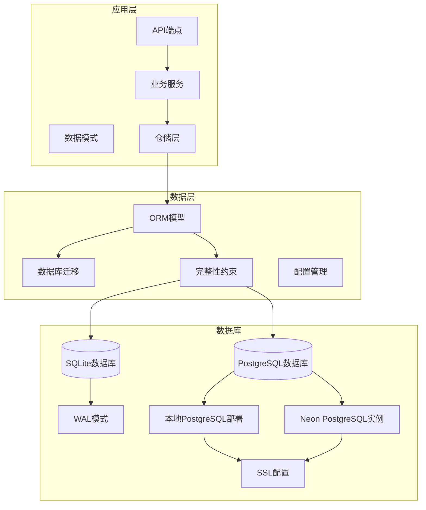

**图表来源**
- [backend/app/core/database.py:1-69](file://backend/app/core/database.py#L1-L69)
- [backend/app/models/user.py:1-80](file://backend/app/models/user.py#L1-L80)

**章节来源**
- [backend/app/core/database.py:1-69](file://backend/app/core/database.py#L1-L69)

## 数据库连接优化

系统实现了智能的数据库连接优化，特别针对PostgreSQL和Neon PostgreSQL进行了专门的配置处理。

### SSL配置智能检测

系统能够智能检测数据库连接类型并相应调整SSL配置：

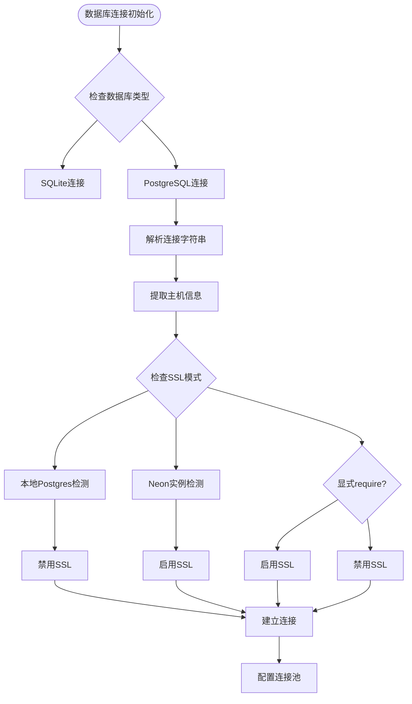

**图表来源**
- [backend/app/core/database.py:19-30](file://backend/app/core/database.py#L19-L30)

### 连接参数智能配置

系统根据数据库类型自动配置连接参数：

**SQLite连接配置**：
- 线程检查禁用：`check_same_thread: False`
- 连接超时：`timeout: 30秒`
- 适用于开发和测试环境

**PostgreSQL连接配置**：
- 命令超时：`command_timeout: 60秒`
- SSL配置：智能检测决定是否启用
- 连接池优化：针对生产环境优化

**SSL配置策略**：
- Neon PostgreSQL实例：始终启用SSL
- 显式声明require的连接：启用SSL
- 本地PostgreSQL：禁用SSL以避免启动失败
- 其他情况：根据sslmode参数决定

**章节来源**
- [backend/app/core/database.py:19-30](file://backend/app/core/database.py#L19-L30)

## 核心数据模型分析

### 用户管理系统

用户模型是整个系统的中心实体，负责管理用户认证、配置偏好和API密钥。

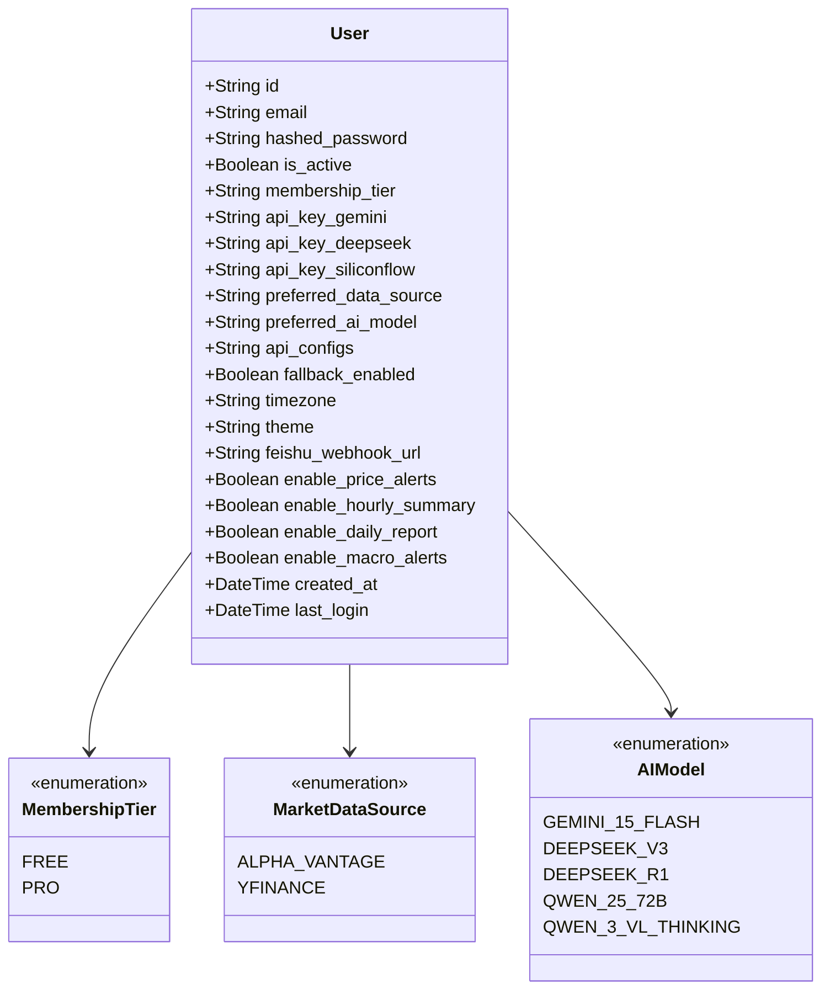

**图表来源**
- [backend/app/models/user.py:9-26](file://backend/app/models/user.py#L9-L26)
- [backend/app/models/user.py:29-80](file://backend/app/models/user.py#L29-L80)

### 股票数据模型

股票数据模型包含静态基本信息和动态市场数据缓存。

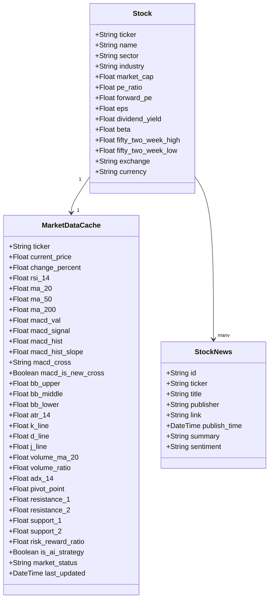

**图表来源**
- [backend/app/models/stock.py:22-48](file://backend/app/models/stock.py#L22-L48)
- [backend/app/models/stock.py:53-100](file://backend/app/models/stock.py#L53-L100)
- [backend/app/models/stock.py:103-115](file://backend/app/models/stock.py#L103-L115)

### 投资组合管理

投资组合模型实现了用户与股票之间的多对多关系管理。

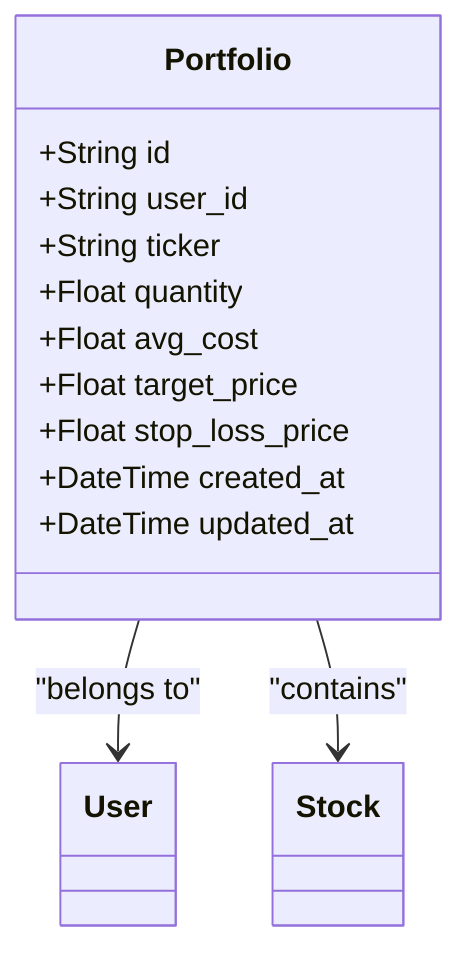

**图表来源**
- [backend/app/models/portfolio.py:9-32](file://backend/app/models/portfolio.py#L9-L32)

### AI分析配置

AI模型配置管理支持多种AI服务提供商和模型选择。

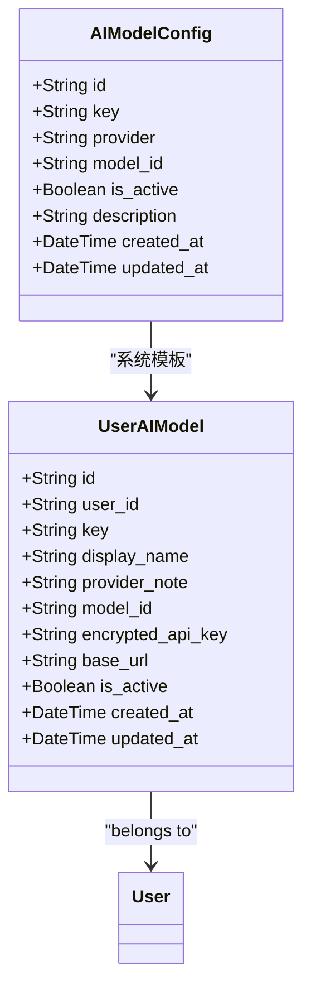

**图表来源**
- [backend/app/models/ai_config.py:6-21](file://backend/app/models/ai_config.py#L6-L21)
- [backend/app/models/user_ai_model.py:9-26](file://backend/app/models/user_ai_model.py#L9-L26)

**章节来源**
- [backend/app/models/user.py:1-80](file://backend/app/models/user.py#L1-L80)
- [backend/app/models/stock.py:1-116](file://backend/app/models/stock.py#L1-L116)
- [backend/app/models/portfolio.py:1-32](file://backend/app/models/portfolio.py#L1-L32)
- [backend/app/models/ai_config.py:1-21](file://backend/app/models/ai_config.py#L1-L21)
- [backend/app/models/user_ai_model.py:1-26](file://backend/app/models/user_ai_model.py#L1-L26)

## 数据库迁移演进

系统通过Alembic迁移工具实现了数据库模式的持续演进，以下是主要的迁移里程碑：

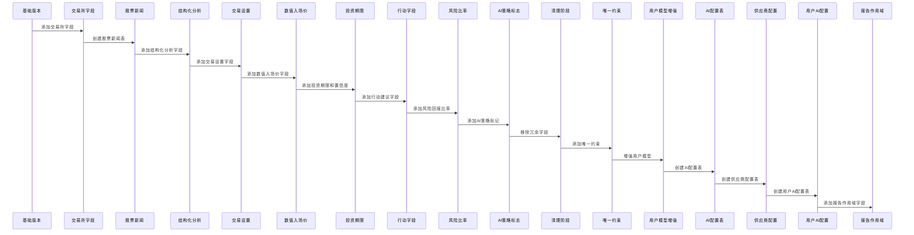

**图表来源**
- [backend/migrations/versions/35a834f440ba_baseline.py:91-104](file://backend/migrations/versions/35a834f440ba_baseline.py#L91-L104)
- [backend/migrations/versions/90eb8cc09d0d_add_stock_news_table.py:21-23](file://backend/migrations/versions/90eb8cc09d0d_add_stock_news_table.py#L21-L23)
- [backend/migrations/versions/93320b786a9b_restore_missing_analysis_report_columns.py:21-28](file://backend/migrations/versions/93320b786a9b_restore_missing_analysis_report_columns.py#L21-L28)
- [backend/migrations/versions/ea09323a6286_add_unique_constraint_to_stock_news_.py:21-28](file://backend/migrations/versions/ea09323a6286_add_unique_constraint_to_stock_news_.py#L21-L28)
- [backend/migrations/versions/0675c6d039e6_create_ai_model_config_table.py:24-35](file://backend/migrations/versions/0675c6d039e6_create_ai_model_config_table.py#L24-L35)
- [backend/migrations/versions/ab4e342e4749_create_provider_configs_v4.py:24-40](file://backend/migrations/versions/ab4e342e4749_create_provider_configs_v4.py#L24-L40)
- [backend/migrations/versions/ae1b8335eea2_add_user_ai_configs.py:21-47](file://backend/migrations/versions/ae1b8335eea2_add_user_ai_configs.py#L21-L47)
- [backend/migrations/versions/2f4d6b8c9a10_split_analysis_report_scope.py:21-56](file://backend/migrations/versions/2f4d6b8c9a10_split_analysis_report_scope.py#L21-L56)

### 迁移功能详解

每个迁移版本都针对特定的功能需求进行了优化：

**基础版本迁移**：创建了完整的数据库模式，包括股票、用户、市场数据缓存、投资组合和分析报告表。

**股票新闻表迁移**：在基础版本中创建了股票新闻表，支持实时新闻数据的存储和管理。

**结构化分析字段迁移**：增强了分析报告的结构化存储能力，支持更精确的投资决策信息。

**唯一约束迁移**：为股票新闻表添加了复合唯一约束，确保每只股票的每条新闻链接的唯一性。

**清理阶段迁移**：移除了冗余的technical_analysis和fundamental_news字段，简化了表结构。

**AI配置表迁移**：创建了AI模型配置表，支持系统级AI模型的标准化管理。

**供应商配置迁移**：创建了供应商配置表，支持AI服务供应商的统一管理和故障转移。

**用户AI配置迁移**：创建了用户AI配置表，支持用户自定义AI模型和API密钥管理。

**报告作用域迁移**：新增report_scope字段，实现用户交互报告和共享分析报告的分离管理。

**章节来源**
- [backend/migrations/versions/35a834f440ba_baseline.py:1-128](file://backend/migrations/versions/35a834f440ba_baseline.py#L1-L128)
- [backend/migrations/versions/90eb8cc09d0d_add_stock_news_table.py:1-32](file://backend/migrations/versions/90eb8cc09d0d_add_stock_news_table.py#L1-L32)
- [backend/migrations/versions/93320b786a9b_restore_missing_analysis_report_columns.py:1-41](file://backend/migrations/versions/93320b786a9b_restore_missing_analysis_report_columns.py#L1-L41)
- [backend/migrations/versions/ea09323a6286_add_unique_constraint_to_stock_news_.py:1-29](file://backend/migrations/versions/ea09323a6286_add_unique_constraint_to_stock_news_.py#L1-L29)
- [backend/migrations/versions/0675c6d039e6_create_ai_model_config_table.py:1-103](file://backend/migrations/versions/0675c6d039e6_create_ai_model_config_table.py#L1-L103)
- [backend/migrations/versions/ab4e342e4749_create_provider_configs_v4.py:1-77](file://backend/migrations/versions/ab4e342e4749_create_provider_configs_v4.py#L1-L77)
- [backend/migrations/versions/ae1b8335eea2_add_user_ai_configs.py:1-95](file://backend/migrations/versions/ae1b8335eea2_add_user_ai_configs.py#L1-L95)
- [backend/migrations/versions/2f4d6b8c9a10_split_analysis_report_scope.py:1-71](file://backend/migrations/versions/2f4d6b8c9a10_split_analysis_report_scope.py#L1-L71)

## 技术指标增强

市场数据缓存表集成了丰富的技术分析指标，支持复杂的金融分析需求：

**图表来源**
- [backend/app/models/stock.py:53-100](file://backend/app/models/stock.py#L53-L100)

### 技术指标分类

系统支持以下类型的技术分析指标：

**趋势分析指标**：移动平均线、ADX趋势强度、MACD交叉信号

**振荡器指标**：RSI相对强弱指数、KDJ随机指标

**波动性指标**：布林带、ATR平均真实波幅

**成交量指标**：成交量均线、量比分析

**章节来源**
- [backend/app/models/stock.py:1-116](file://backend/app/models/stock.py#L1-L116)

## 用户配置管理

用户设置管理支持灵活的配置选项和API密钥管理：

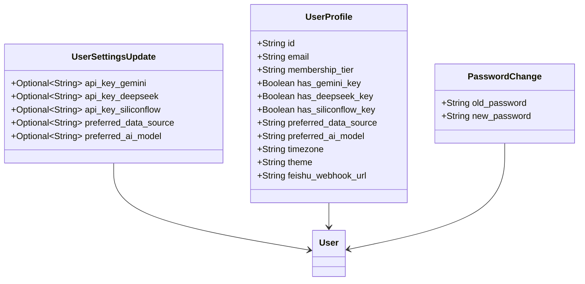

**图表来源**
- [backend/app/schemas/user_settings.py:4-24](file://backend/app/schemas/user_settings.py#L4-L24)

### 配置管理特性

**多AI提供商支持**：支持Gemini、DeepSeek、SiliconFlow等多种AI服务提供商

**数据源选择**：可配置Alpha Vantage或Yahoo Finance作为数据源

**API密钥加密存储**：安全存储第三方API密钥

**增强型AI配置**：支持用户自定义AI模型配置和故障转移

**章节来源**
- [backend/app/schemas/user_settings.py:1-24](file://backend/app/schemas/user_settings.py#L1-L24)
- [backend/app/models/user.py:47-66](file://backend/app/models/user.py#L47-L66)

## AI模型配置系统

系统引入了完整的AI模型配置管理体系，支持用户自定义AI模型和API密钥管理。

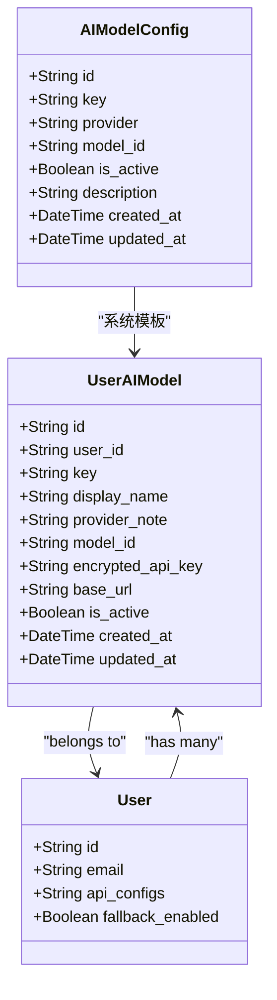

**图表来源**
- [backend/app/models/ai_config.py:6-21](file://backend/app/models/ai_config.py#L6-L21)
- [backend/app/models/user_ai_model.py:9-26](file://backend/app/models/user_ai_model.py#L9-L26)
- [backend/app/models/user.py:62-66](file://backend/app/models/user.py#L62-L66)

### AI模型配置特性

**系统级配置**：AIModelConfig表存储系统内置的AI模型配置

**用户级配置**：UserAIModel表支持用户自定义AI模型和API密钥

**加密存储**：用户API密钥采用加密方式存储

**故障转移**：支持用户配置的故障转移和回退机制

**复合唯一约束**：确保用户AI模型的唯一性

**章节来源**
- [backend/app/models/ai_config.py:1-21](file://backend/app/models/ai_config.py#L1-L21)
- [backend/app/models/user_ai_model.py:1-26](file://backend/app/models/user_ai_model.py#L1-L26)
- [backend/app/infrastructure/db/repositories/ai_model_repository.py:1-38](file://backend/app/infrastructure/db/repositories/ai_model_repository.py#L1-L38)
- [backend/app/infrastructure/db/repositories/user_ai_model_repository.py:1-44](file://backend/app/infrastructure/db/repositories/user_ai_model_repository.py#L1-L44)

## 供应商配置管理

系统实现了供应商配置管理，支持AI服务供应商的统一管理和故障转移。

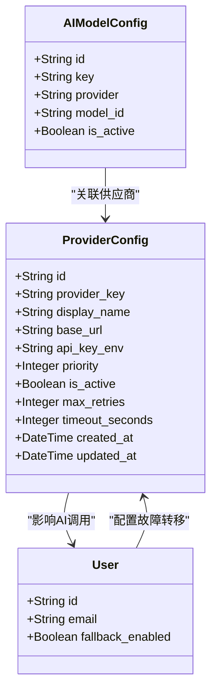

**图表来源**
- [backend/app/models/provider_config.py:12-48](file://backend/app/models/provider_config.py#L12-L48)

### 供应商配置特性

**统一管理**：ProviderConfig表统一管理所有AI服务供应商

**动态URL**：支持动态修改API基础URL，便于代理切换

**优先级排序**：支持供应商故障转移的优先级配置

**超时控制**：可配置请求超时时间和重试次数

**环境变量**：支持通过环境变量管理API密钥

**章节来源**
- [backend/app/models/provider_config.py:1-48](file://backend/app/models/provider_config.py#L1-L48)
- [backend/app/infrastructure/db/repositories/provider_config_repository.py](file://backend/app/infrastructure/db/repositories/provider_config_repository.py)

## 分析报告系统

分析报告系统提供了结构化的投资分析输出。经过重大重构后，系统现在更加简洁高效：

**图表来源**
- [backend/app/models/analysis.py:7-11](file://backend/app/models/analysis.py#L7-L11)
- [backend/app/models/analysis.py:12-42](file://backend/app/models/analysis.py#L12-L42)

### 报告结构化字段

分析报告包含以下结构化字段：

**情感分析**：支持看涨、看跌、中性三种情感状态

**风险评估**：提供低、中、高三个风险等级

**投资建议**：包含立即行动建议、目标价、止损价

**时间框架**：支持短期、中期、长期投资期限

**质量指标**：置信度评分和风险回报比率

**入场价格**：提供精确的入场价格范围

**AI模型标识**：记录使用的具体AI模型

**报告作用域**：区分用户交互报告和共享分析报告

**更新** 分析报告系统经过重大重构，移除了冗余的entry_zone、technical_analysis、fundamental_news等字段，简化了表结构并提高了数据存储效率。

**更新** 集成AI模型配置后，分析报告现在包含model_used字段，记录实际使用的AI模型。

**更新** 新增report_scope字段，实现用户交互报告和共享分析报告的分离管理。

### 数据流处理流程

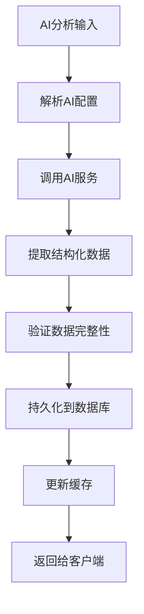

**图表来源**
- [backend/app/api/v1/endpoints/analysis.py:421-539](file://backend/app/api/v1/endpoints/analysis.py#L421-L539)

**章节来源**
- [backend/app/models/analysis.py:1-93](file://backend/app/models/analysis.py#L1-L93)
- [backend/app/schemas/analysis.py:5-26](file://backend/app/schemas/analysis.py#L5-L26)
- [backend/app/api/v1/endpoints/analysis.py:340-539](file://backend/app/api/v1/endpoints/analysis.py#L340-L539)

## 报告作用域管理

系统引入了report_scope字段，实现了用户交互报告和共享分析报告的分离管理。这种设计提升了系统的分析能力和数据组织效率。

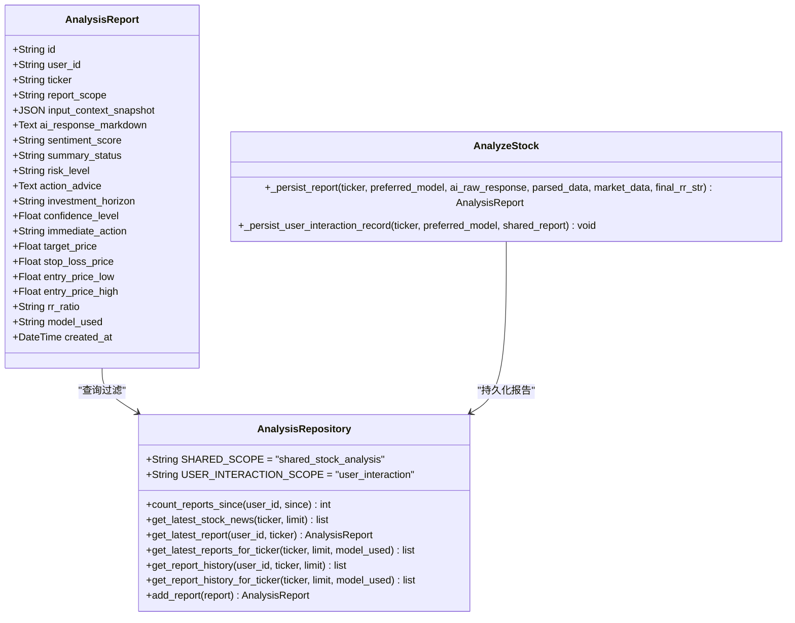

**图表来源**
- [backend/app/models/analysis.py:23](file://backend/app/models/analysis.py#L23)
- [backend/app/infrastructure/db/repositories/analysis_repository.py:12-14](file://backend/app/infrastructure/db/repositories/analysis_repository.py#L12-L14)
- [backend/app/application/analysis/analyze_stock.py:420-501](file://backend/app/application/analysis/analyze_stock.py#L420-L501)

### 报告作用域类型

**用户交互报告**：
- 由用户主动发起的分析请求生成
- 包含用户个人的投资偏好和决策信息
- 存储在analysis_reports表中，user_id字段不为空
- 支持用户个人的历史记录追踪

**共享分析报告**：
- 由系统定期生成的公共分析报告
- 不绑定特定用户，供所有用户参考
- 存储在analysis_reports表中，user_id字段为空
- 支持跨用户的共享分析和比较

### 作用域管理特性

**智能选择机制**：系统根据用户偏好和可用性自动选择合适的报告作用域

**兼容性处理**：支持基于input_context_snapshot中的analysis_scope字段进行向后兼容

**索引优化**：为不同作用域建立了专门的查询索引，提升查询性能

**数据隔离**：确保用户交互报告和共享分析报告的数据隔离和独立管理

**章节来源**
- [backend/app/models/analysis.py:17-74](file://backend/app/models/analysis.py#L17-L74)
- [backend/app/infrastructure/db/repositories/analysis_repository.py:12-114](file://backend/app/infrastructure/db/repositories/analysis_repository.py#L12-L114)
- [backend/app/application/analysis/analyze_stock.py:389-501](file://backend/app/application/analysis/analyze_stock.py#L389-L501)
- [backend/app/application/analysis/query_analysis.py:48-56](file://backend/app/application/analysis/query_analysis.py#L48-L56)
- [backend/app/application/analysis/mappers.py:60-61](file://backend/app/application/analysis/mappers.py#L60-L61)

## 数据库完整性约束

系统通过多种完整性约束确保数据的一致性和准确性：

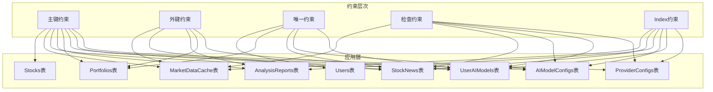

**图表来源**
- [backend/migrations/versions/35a834f440ba_baseline.py:38-104](file://backend/migrations/versions/35a834f440ba_baseline.py#L38-L104)
- [backend/migrations/versions/ea09323a6286_add_unique_constraint_to_stock_news_.py:21-28](file://backend/migrations/versions/ea09323a6286_add_unique_constraint_to_stock_news_.py#L21-L28)
- [backend/migrations/versions/0675c6d039e6_create_ai_model_config_table.py](file://backend/migrations/versions/0675c6d039e6_create_ai_model_config_table.py#L35)
- [backend/migrations/versions/ae1b8335eea2_add_user_ai_configs.py:30-41](file://backend/migrations/versions/ae1b8335eea2_add_user_ai_configs.py#L30-L41)
- [backend/migrations/versions/2f4d6b8c9a10_split_analysis_report_scope.py:26-37](file://backend/migrations/versions/2f4d6b8c9a10_split_analysis_report_scope.py#L26-L37)

### 完整性约束详解

**主键约束**：确保每张表的唯一标识符，如Stocks表的ticker、StockNews表的id。

**外键约束**：维护表间关系的完整性，如MarketDataCache的ticker引用Stocks表，UserAIModel的user_id引用Users表。

**唯一约束**：防止重复数据的插入，如Users表的email、Portfolios表的(user_id, ticker)组合、AIModelConfigs表的key、UserAIModels表的(user_id, key)组合。

**检查约束**：验证数据的有效性，如非空约束确保重要字段的完整性。

**索引约束**：优化查询性能，如StockNews表的ticker索引，AIModelConfigs表的key索引。

**复合唯一约束**：为股票新闻表添加了(ticker, link)的复合唯一约束，为用户AI模型添加了(user_id, key)的复合唯一约束，确保每只股票的每条新闻链接唯一，每个用户只能有一个同名AI模型配置。

**作用域索引**：为report_scope字段建立了专门的查询索引，包括：
- ix_analysis_reports_user_scope_created：用于按用户和作用域查询
- ix_analysis_reports_ticker_scope_model_created：用于按股票、作用域和模型查询

**章节来源**
- [backend/migrations/versions/35a834f440ba_baseline.py:1-128](file://backend/migrations/versions/35a834f440ba_baseline.py#L1-L128)
- [backend/migrations/versions/ea09323a6286_add_unique_constraint_to_stock_news_.py:1-29](file://backend/migrations/versions/ea09323a6286_add_unique_constraint_to_stock_news_.py#L1-L29)
- [backend/migrations/versions/0675c6d039e6_create_ai_model_config_table.py:1-103](file://backend/migrations/versions/0675c6d039e6_create_ai_model_config_table.py#L1-L103)
- [backend/migrations/versions/ae1b8335eea2_add_user_ai_configs.py:1-95](file://backend/migrations/versions/ae1b8335eea2_add_user_ai_configs.py#L1-L95)
- [backend/migrations/versions/2f4d6b8c9a10_split_analysis_report_scope.py:1-71](file://backend/migrations/versions/2f4d6b8c9a10_split_analysis_report_scope.py#L1-L71)

## 性能优化特性

系统采用了多项性能优化措施来确保数据库的高效运行：

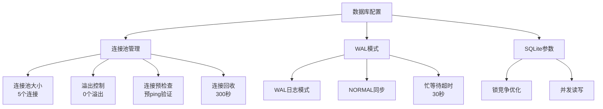

**图表来源**
- [backend/app/core/database.py:25-47](file://backend/app/core/database.py#L25-L47)

### 关键优化特性

**连接池优化**：限制最大连接数，防止文件锁竞争

**WAL模式**：启用预写日志模式，支持读写并发操作

**连接生命周期**：设置合理的连接回收时间，避免过期连接

**SQLite特定优化**：针对SQLite数据库的特殊配置，减少锁定问题

**索引优化**：为高频查询字段建立索引，提升查询性能

**作用域索引优化**：为report_scope字段建立了专门的查询索引，包括：
- ix_analysis_reports_user_scope_created：按用户ID和作用域查询
- ix_analysis_reports_ticker_scope_model_created：按股票、作用域和模型查询

**复合查询优化**：针对分析报告的复合查询条件进行了专门优化

**SSL配置优化**：智能检测数据库类型，避免不必要的SSL开销

**章节来源**
- [backend/app/core/database.py:1-69](file://backend/app/core/database.py#L1-L69)

## 数据库连接配置管理

系统实现了智能的数据库连接配置管理，特别针对PostgreSQL和Neon PostgreSQL进行了专门的配置处理。

### 连接配置策略

系统根据数据库类型和环境自动配置连接参数：

**数据库类型检测**：
- 通过检查DATABASE_URL中的"postgresql"关键字判断PostgreSQL类型
- 支持标准PostgreSQL和Neon PostgreSQL实例
- 自动识别本地PostgreSQL部署

**SSL配置管理**：
- Neon PostgreSQL实例：始终启用SSL，确保云原生连接安全
- 显式声明require的连接：启用SSL，满足用户安全要求
- 本地PostgreSQL：禁用SSL，避免本地PostgreSQL启动失败
- 其他情况：根据sslmode参数智能决定SSL配置

**连接池优化**：
- PostgreSQL连接池：pool_size=10，max_overflow=20
- SQLite连接池：pool_size=5，max_overflow=0
- 统一的pool_pre_ping和pool_recycle配置

**连接参数细节**：
- command_timeout: 60秒，防止长时间阻塞
- check_same_thread: False，支持多线程访问
- timeout: 30秒，SQLite连接超时设置

### 配置文件集成

数据库配置与应用配置紧密集成：

**配置加载**：
- 从Settings类加载DATABASE_URL
- 支持.env文件配置
- 环境变量覆盖默认配置

**迁移配置**：
- Alembic迁移工具使用相同的连接配置
- 迁移时自动应用SSL配置策略
- 支持在线和离线迁移模式

**章节来源**
- [backend/app/core/database.py:19-39](file://backend/app/core/database.py#L19-L39)
- [backend/app/core/config.py:6](file://backend/app/core/config.py#L6)
- [backend/migrations/env.py:56-69](file://backend/migrations/env.py#L56-L69)

## 故障排除指南

### 常见问题及解决方案

**数据库锁定错误**：
- 症状：出现"database is locked"错误
- 解决方案：系统已自动启用WAL模式和适当的busy_timeout设置

**连接超时问题**：
- 症状：数据库操作超时
- 解决方案：检查连接池配置和网络连接稳定性

**迁移失败**：
- 症状：数据库迁移过程中出现错误
- 解决方案：检查迁移脚本的依赖关系和数据库权限

**唯一约束冲突**：
- 症状：插入数据时报唯一约束冲突错误
- 解决方案：检查(ticker, link)和(user_id, key)组合的唯一性，避免重复数据

**AI配置冲突**：
- 症状：用户AI模型配置保存失败
- 解决方案：检查用户是否已存在同名AI模型配置，或确认配置的唯一性

**报告作用域查询异常**：
- 症状：按作用域查询分析报告时结果不准确
- 解决方案：检查report_scope字段的值和索引是否正确

**性能问题**：
- 症状：查询响应缓慢
- 解决方案：检查索引使用情况和查询优化

**SSL连接问题**：
- 症状：PostgreSQL连接失败或SSL握手错误
- 解决方案：检查数据库URL中的sslmode参数，确认数据库类型检测正确

**连接池配置问题**：
- 症状：连接池耗尽或连接回收异常
- 解决方案：检查pool_size和max_overflow配置，确认数据库类型检测正确

**Neon PostgreSQL连接问题**：
- 症状：Neon实例连接失败
- 解决方案：确认连接URL包含.neon.tech域名，检查SSL配置

**本地PostgreSQL连接问题**：
- 症状：本地PostgreSQL连接失败
- 解决方案：确认禁用了SSL配置，检查数据库服务状态

### 调试工具

系统提供了多种调试和监控工具：

**数据库连接监控**：实时监控连接池使用情况

**查询日志**：可选的SQL语句日志记录

**性能指标**：数据库操作的性能统计

**作用域查询测试**：专门用于测试报告作用域查询的工具

**SSL配置验证**：检查SSL配置和数据库类型检测的工具

## 总结

AI股票顾问系统的数据库模式经过精心设计和持续优化，具备以下特点：

**模块化设计**：清晰的实体关系和职责分离

**扩展性强**：支持新的技术指标和分析功能

**性能优化**：针对SQLite数据库的专门优化

**安全性考虑**：API密钥的安全存储和传输

**可维护性**：完整的迁移历史和文档记录

**完整性保证**：通过多种约束确保数据一致性

**简洁高效**：通过移除冗余字段简化了表结构

**约束增强**：最新的唯一约束迁移进一步强化了数据完整性

**AI配置管理**：新增的用户AI配置表和相关模型，实现了灵活的AI模型选择

**供应商管理**：完善的供应商配置管理，支持故障转移和动态URL切换

**故障转移机制**：智能的AI服务故障转移，提升系统可靠性

**加密存储**：用户API密钥的安全加密存储

**报告作用域分离**：最新的report_scope字段实现了用户交互报告和共享分析报告的分离管理，显著提升了系统的分析能力和数据组织效率

**索引优化**：为不同作用域建立了专门的查询索引，提升了查询性能

**兼容性处理**：支持基于input_context_snapshot的向后兼容，确保旧数据的正常访问

**数据库连接优化**：最新的SSL配置逻辑改进，智能检测Neon PostgreSQL实例和本地PostgreSQL部署，防止连接失败

**连接池优化**：针对PostgreSQL的专门连接池配置，提升并发性能

**配置管理**：完整的数据库连接配置管理，支持多种数据库类型和部署环境

**故障排除**：完善的故障排除指南，涵盖SSL连接、连接池配置等常见问题

**迁移工具**：Alembic迁移工具的SSL配置支持，确保迁移过程的稳定性

该数据库模式为AI驱动的股票分析提供了坚实的基础，支持复杂的技术分析需求和实时数据处理要求。通过持续的演进和优化，系统能够适应不断变化的金融分析需求。最新的report_scope增强和数据库连接优化进一步提升了系统的灵活性、可靠性和性能，为用户提供更好的分析体验。