# 数据库模式增强

<cite>
**本文档引用的文件**
- [backend/app/models/user.py](file://backend/app/models/user.py)
- [backend/app/models/stock.py](file://backend/app/models/stock.py)
- [backend/app/models/portfolio.py](file://backend/app/models/portfolio.py)
- [backend/app/models/analysis.py](file://backend/app/models/analysis.py)
- [backend/app/models/ai_config.py](file://backend/app/models/ai_config.py)
- [backend/app/core/database.py](file://backend/app/core/database.py)
- [backend/migrations/versions/33f174f249a3_add_structured_analysis_fields.py](file://backend/migrations/versions/33f174f249a3_add_structured_analysis_fields.py)
- [backend/migrations/versions/54477ba71d32_add_exchange_to_stock.py](file://backend/migrations/versions/54477ba71d32_add_exchange_to_stock.py)
- [backend/migrations/versions/90eb8cc09d0d_add_stock_news_table.py](file://backend/migrations/versions/90eb8cc09d0d_add_stock_news_table.py)
- [backend/migrations/versions/93320b786a9b_restore_missing_analysis_report_columns.py](file://backend/migrations/versions/93320b786a9b_restore_missing_analysis_report_columns.py)
- [backend/migrations/versions/ea09323a6286_add_unique_constraint_to_stock_news_.py](file://backend/migrations/versions/ea09323a6286_add_unique_constraint_to_stock_news_.py)
- [backend/migrations/versions/f3fe98d72c73_add_horizon_and_confidence.py](file://backend/migrations/versions/f3fe98d72c73_add_horizon_and_confidence.py)
- [backend/migrations/versions/a234193f1ade_add_risk_reward_ratio_to_marketdatacache.py](file://backend/migrations/versions/a234193f1ade_add_risk_reward_ratio_to_marketdatacache.py)
- [backend/migrations/versions/15c8d26963f4_add_structured_action_fields.py](file://backend/migrations/versions/15c8d26963f4_add_structured_action_fields.py)
- [backend/migrations/versions/731ab4ae1248_add_is_ai_strategy_to_marketdatacache.py](file://backend/migrations/versions/731ab4ae1248_add_is_ai_strategy_to_marketdatacache.py)
- [backend/migrations/versions/b78d1acc5044_add_numeric_entry_prices.py](file://backend/migrations/versions/b78d1acc5044_add_numeric_entry_prices.py)
- [backend/migrations/versions/f9886ac0c8b0_add_trade_setup_fields.py](file://backend/migrations/versions/f9886ac0c8b0_add_trade_setup_fields.py)
- [backend/migrations/versions/261c72d24d12_initial_migration.py](file://backend/migrations/versions/261c72d24d12_initial_migration.py)
- [backend/migrations/versions/35a834f440ba_baseline.py](file://backend/migrations/versions/35a834f440ba_baseline.py)
- [backend/migrations/versions/48d7355e90d6_add_more_technical_indicators.py](file://backend/migrations/versions/48d7355e90d6_add_more_technical_indicators.py)
- [backend/app/schemas/user_settings.py](file://backend/app/schemas/user_settings.py)
- [backend/app/schemas/analysis.py](file://backend/app/schemas/analysis.py)
- [backend/app/schemas/market_data.py](file://backend/app/schemas/market_data.py)
- [backend/app/api/v1/endpoints/analysis.py](file://backend/app/api/v1/endpoints/analysis.py)
</cite>

## 更新摘要
**所做更改**
- 更新了数据库完整性约束章节，反映股票新闻表新增唯一约束的历史
- 增加了数据库模式完整性约束的详细说明
- 更新了数据库迁移演进部分，包含最新的唯一约束迁移
- 完善了数据库约束关系图和完整性保证机制

## 目录
1. [项目概述](#项目概述)
2. [数据库架构概览](#数据库架构概览)
3. [核心数据模型分析](#核心数据模型分析)
4. [数据库迁移演进](#数据库迁移演进)
5. [技术指标增强](#技术指标增强)
6. [用户配置管理](#用户配置管理)
7. [分析报告系统](#分析报告系统)
8. [数据库完整性约束](#数据库完整性约束)
9. [性能优化特性](#性能优化特性)
10. [故障排除指南](#故障排除指南)
11. [总结](#总结)

## 项目概述

AI股票顾问系统是一个基于Python和FastAPI构建的智能投资分析平台。该项目专注于提供实时市场数据、技术分析、基本面分析以及AI驱动的投资建议。数据库模式经过多次增强，支持复杂的金融数据分析需求，并通过严格的完整性约束确保数据一致性。

## 数据库架构概览

系统采用SQLAlchemy ORM框架，基于异步数据库连接实现高性能的数据访问层。整体架构包括以下关键组件：

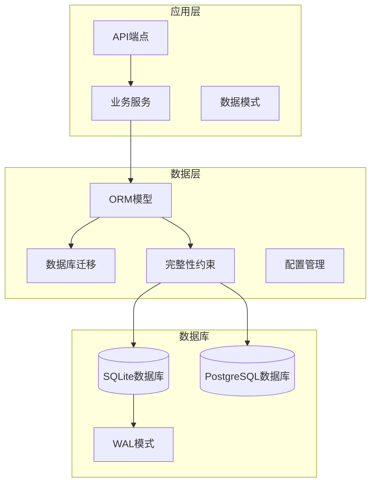

**图表来源**
- [backend/app/core/database.py](file://backend/app/core/database.py#L1-L69)
- [backend/app/models/user.py](file://backend/app/models/user.py#L1-L41)

**章节来源**
- [backend/app/core/database.py](file://backend/app/core/database.py#L1-L69)

## 核心数据模型分析

### 用户管理系统

用户模型是整个系统的中心实体，负责管理用户认证、配置偏好和API密钥。

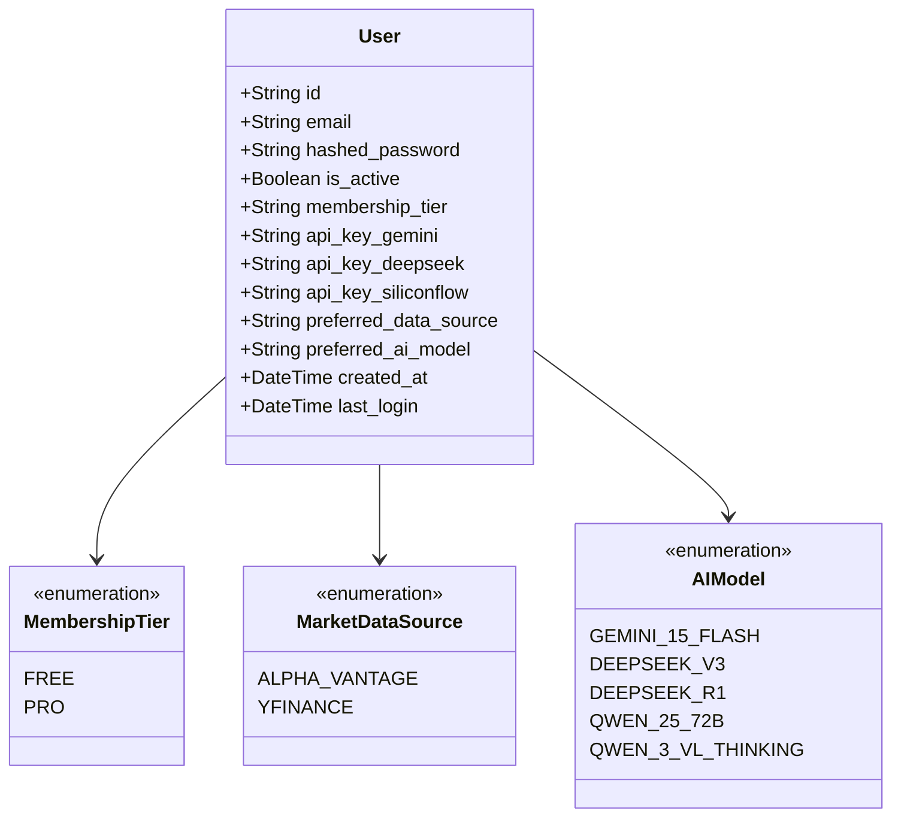

**图表来源**
- [backend/app/models/user.py](file://backend/app/models/user.py#L7-L21)
- [backend/app/models/user.py](file://backend/app/models/user.py#L22-L41)

### 股票数据模型

股票数据模型包含静态基本信息和动态市场数据缓存。

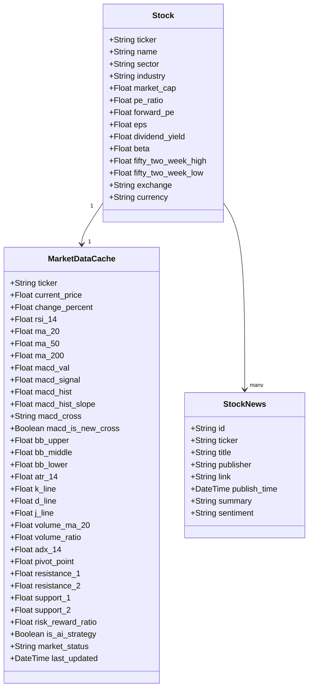

**图表来源**
- [backend/app/models/stock.py](file://backend/app/models/stock.py#L22-L48)
- [backend/app/models/stock.py](file://backend/app/models/stock.py#L53-L100)
- [backend/app/models/stock.py](file://backend/app/models/stock.py#L103-L115)

### 投资组合管理

投资组合模型实现了用户与股票之间的多对多关系管理。

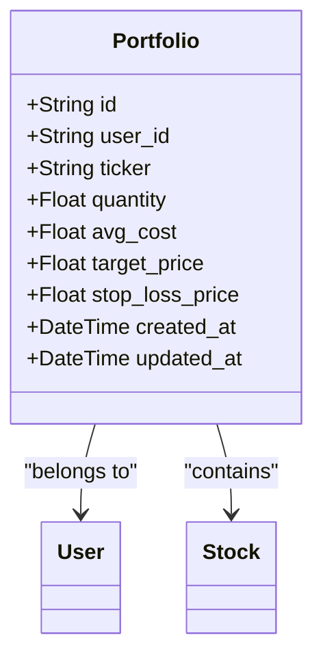

**图表来源**
- [backend/app/models/portfolio.py](file://backend/app/models/portfolio.py#L9-L32)

### AI分析配置

AI模型配置管理支持多种AI服务提供商和模型选择。

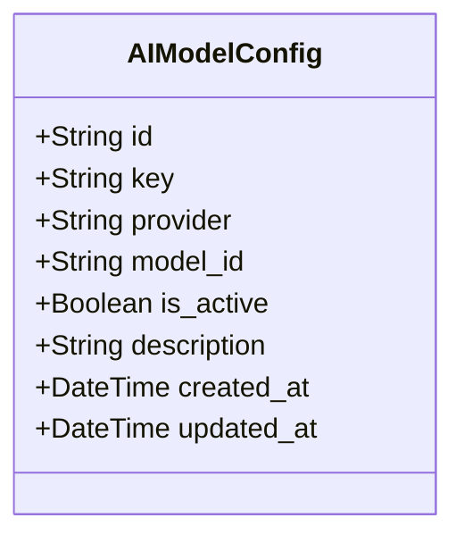

**图表来源**
- [backend/app/models/ai_config.py](file://backend/app/models/ai_config.py#L6-L21)

**章节来源**
- [backend/app/models/user.py](file://backend/app/models/user.py#L1-L41)
- [backend/app/models/stock.py](file://backend/app/models/stock.py#L1-L116)
- [backend/app/models/portfolio.py](file://backend/app/models/portfolio.py#L1-L32)
- [backend/app/models/ai_config.py](file://backend/app/models/ai_config.py#L1-L21)

## 数据库迁移演进

系统通过Alembic迁移工具实现了数据库模式的持续演进，以下是主要的迁移里程碑：

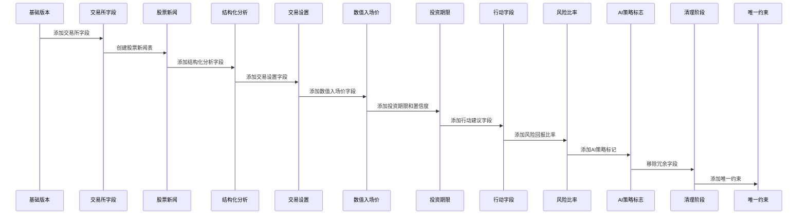

**图表来源**
- [backend/migrations/versions/35a834f440ba_baseline.py](file://backend/migrations/versions/35a834f440ba_baseline.py#L91-L104)
- [backend/migrations/versions/90eb8cc09d0d_add_stock_news_table.py](file://backend/migrations/versions/90eb8cc09d0d_add_stock_news_table.py#L21-L23)
- [backend/migrations/versions/93320b786a9b_restore_missing_analysis_report_columns.py](file://backend/migrations/versions/93320b786a9b_restore_missing_analysis_report_columns.py#L21-L28)
- [backend/migrations/versions/ea09323a6286_add_unique_constraint_to_stock_news_.py](file://backend/migrations/versions/ea09323a6286_add_unique_constraint_to_stock_news_.py#L21-L28)

### 迁移功能详解

每个迁移版本都针对特定的功能需求进行了优化：

**基础版本迁移**：创建了完整的数据库模式，包括股票、用户、市场数据缓存、投资组合和分析报告表。

**股票新闻表迁移**：在基础版本中创建了股票新闻表，支持实时新闻数据的存储和管理。

**结构化分析字段迁移**：增强了分析报告的结构化存储能力，支持更精确的投资决策信息。

**唯一约束迁移**：为股票新闻表添加了复合唯一约束，确保每只股票的每条新闻链接的唯一性。

**清理阶段迁移**：移除了冗余的technical_analysis和fundamental_news字段，简化了表结构。

**章节来源**
- [backend/migrations/versions/35a834f440ba_baseline.py](file://backend/migrations/versions/35a834f440ba_baseline.py#L1-L128)
- [backend/migrations/versions/90eb8cc09d0d_add_stock_news_table.py](file://backend/migrations/versions/90eb8cc09d0d_add_stock_news_table.py#L1-L32)
- [backend/migrations/versions/93320b786a9b_restore_missing_analysis_report_columns.py](file://backend/migrations/versions/93320b786a9b_restore_missing_analysis_report_columns.py#L1-L41)
- [backend/migrations/versions/ea09323a6286_add_unique_constraint_to_stock_news_.py](file://backend/migrations/versions/ea09323a6286_add_unique_constraint_to_stock_news_.py#L1-L29)

## 技术指标增强

市场数据缓存表集成了丰富的技术分析指标，支持复杂的金融分析需求：

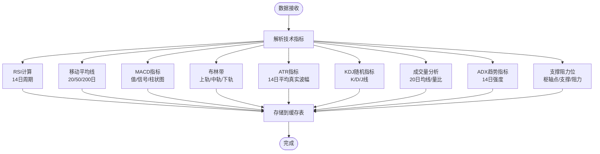

**图表来源**
- [backend/app/models/stock.py](file://backend/app/models/stock.py#L53-L100)

### 技术指标分类

系统支持以下类型的技术分析指标：

**趋势分析指标**：移动平均线、ADX趋势强度、MACD交叉信号

**振荡器指标**：RSI相对强弱指数、KDJ随机指标

**波动性指标**：布林带、ATR平均真实波幅

**成交量指标**：成交量均线、量比分析

**章节来源**
- [backend/app/models/stock.py](file://backend/app/models/stock.py#L1-L116)

## 用户配置管理

用户设置管理支持灵活的配置选项和API密钥管理：

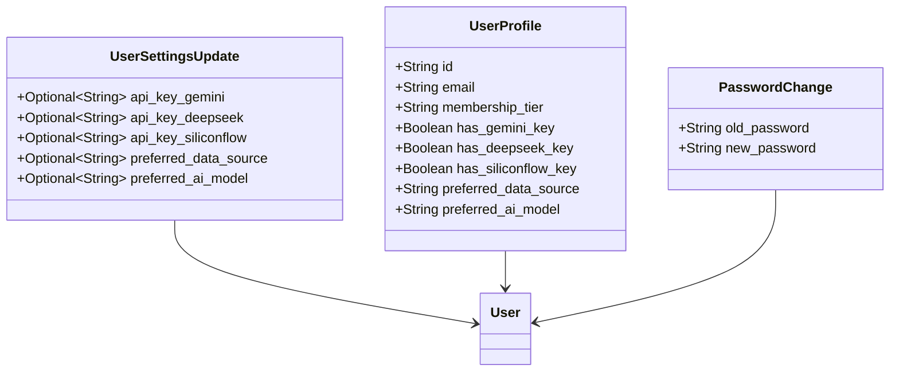

**图表来源**
- [backend/app/schemas/user_settings.py](file://backend/app/schemas/user_settings.py#L4-L24)

### 配置管理特性

**多AI提供商支持**：支持Gemini、DeepSeek、SiliconFlow等多种AI服务提供商

**数据源选择**：可配置Alpha Vantage或Yahoo Finance作为数据源

**API密钥加密存储**：安全存储第三方API密钥

**章节来源**
- [backend/app/schemas/user_settings.py](file://backend/app/schemas/user_settings.py#L1-L24)
- [backend/app/models/user.py](file://backend/app/models/user.py#L15-L37)

## 分析报告系统

分析报告系统提供了结构化的投资分析输出。经过重大重构后，系统现在更加简洁高效：

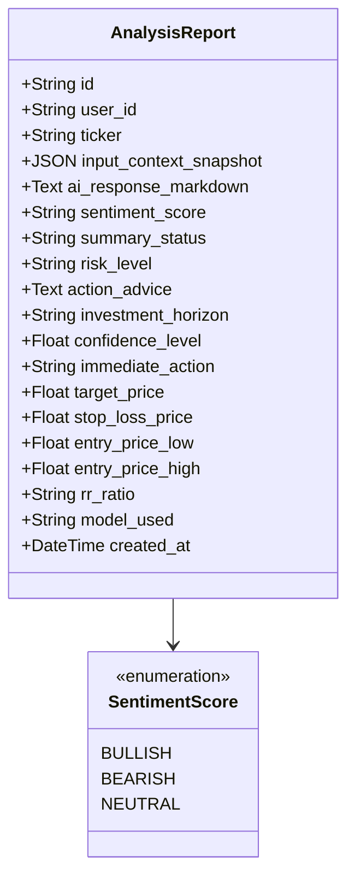

**图表来源**
- [backend/app/models/analysis.py](file://backend/app/models/analysis.py#L7-L11)
- [backend/app/models/analysis.py](file://backend/app/models/analysis.py#L12-L42)

### 报告结构化字段

分析报告包含以下结构化字段：

**情感分析**：支持看涨、看跌、中性三种情感状态

**风险评估**：提供低、中、高三个风险等级

**投资建议**：包含立即行动建议、目标价、止损价

**时间框架**：支持短期、中期、长期投资期限

**质量指标**：置信度评分和风险回报比率

**入场价格**：提供精确的入场价格范围

**更新** 分析报告系统经过重大重构，移除了冗余的entry_zone、technical_analysis、fundamental_news等字段，简化了表结构并提高了数据存储效率。

### 数据流处理流程

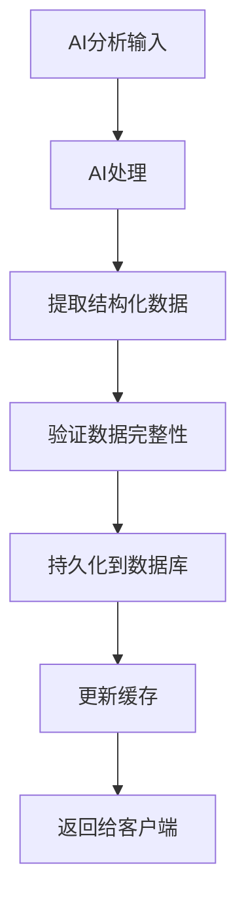

**图表来源**
- [backend/app/api/v1/endpoints/analysis.py](file://backend/app/api/v1/endpoints/analysis.py#L421-L539)

**章节来源**
- [backend/app/models/analysis.py](file://backend/app/models/analysis.py#L1-L63)
- [backend/app/schemas/analysis.py](file://backend/app/schemas/analysis.py#L5-L26)
- [backend/app/api/v1/endpoints/analysis.py](file://backend/app/api/v1/endpoints/analysis.py#L340-L539)

## 数据库完整性约束

系统通过多种完整性约束确保数据的一致性和准确性：

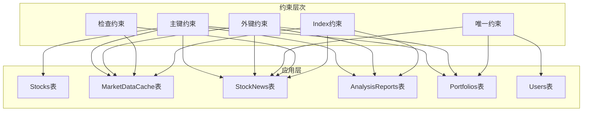

**图表来源**
- [backend/migrations/versions/35a834f440ba_baseline.py](file://backend/migrations/versions/35a834f440ba_baseline.py#L38-L104)
- [backend/migrations/versions/ea09323a6286_add_unique_constraint_to_stock_news_.py](file://backend/migrations/versions/ea09323a6286_add_unique_constraint_to_stock_news_.py#L21-L28)

### 完整性约束详解

**主键约束**：确保每张表的唯一标识符，如Stocks表的ticker、StockNews表的id。

**外键约束**：维护表间关系的完整性，如MarketDataCache的ticker引用Stocks表。

**唯一约束**：防止重复数据的插入，如Users表的email、Portfolios表的(user_id, ticker)组合。

**检查约束**：验证数据的有效性，如非空约束确保重要字段的完整性。

**索引约束**：优化查询性能，如StockNews表的ticker索引。

**复合唯一约束**：为股票新闻表添加了(ticker, link)的复合唯一约束，确保每只股票的每条新闻链接的唯一性。

**章节来源**
- [backend/migrations/versions/35a834f440ba_baseline.py](file://backend/migrations/versions/35a834f440ba_baseline.py#L1-L128)
- [backend/migrations/versions/ea09323a6286_add_unique_constraint_to_stock_news_.py](file://backend/migrations/versions/ea09323a6286_add_unique_constraint_to_stock_news_.py#L1-L29)

## 性能优化特性

系统采用了多项性能优化措施来确保数据库的高效运行：

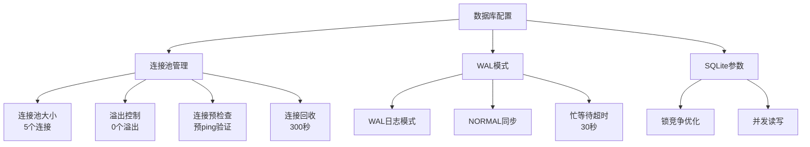

**图表来源**
- [backend/app/core/database.py](file://backend/app/core/database.py#L25-L47)

### 关键优化特性

**连接池优化**：限制最大连接数，防止文件锁竞争

**WAL模式**：启用预写日志模式，支持读写并发操作

**连接生命周期**：设置合理的连接回收时间，避免过期连接

**SQLite特定优化**：针对SQLite数据库的特殊配置，减少锁定问题

**章节来源**
- [backend/app/core/database.py](file://backend/app/core/database.py#L1-L69)

## 故障排除指南

### 常见问题及解决方案

**数据库锁定错误**：
- 症状：出现"database is locked"错误
- 解决方案：系统已自动启用WAL模式和适当的busy_timeout设置

**连接超时问题**：
- 症状：数据库操作超时
- 解决方案：检查连接池配置和网络连接稳定性

**迁移失败**：
- 症状：数据库迁移过程中出现错误
- 解决方案：检查迁移脚本的依赖关系和数据库权限

**唯一约束冲突**：
- 症状：插入数据时报唯一约束冲突错误
- 解决方案：检查(ticker, link)组合的唯一性，避免重复新闻数据

**性能问题**：
- 症状：查询响应缓慢
- 解决方案：检查索引使用情况和查询优化

### 调试工具

系统提供了多种调试和监控工具：

**数据库连接监控**：实时监控连接池使用情况

**查询日志**：可选的SQL语句日志记录

**性能指标**：数据库操作的性能统计

## 总结

AI股票顾问系统的数据库模式经过精心设计和持续优化，具备以下特点：

**模块化设计**：清晰的实体关系和职责分离

**扩展性强**：支持新的技术指标和分析功能

**性能优化**：针对SQLite数据库的专门优化

**安全性考虑**：API密钥的安全存储和传输

**可维护性**：完整的迁移历史和文档记录

**完整性保证**：通过多种约束确保数据一致性

**简洁高效**：通过移除冗余字段简化了表结构

**约束增强**：最新的唯一约束迁移进一步强化了数据完整性

该数据库模式为AI驱动的股票分析提供了坚实的基础，支持复杂的技术分析需求和实时数据处理要求。通过持续的演进和优化，系统能够适应不断变化的金融分析需求。最新的唯一约束增强进一步提升了系统的数据质量和可靠性，为用户提供更好的分析体验。