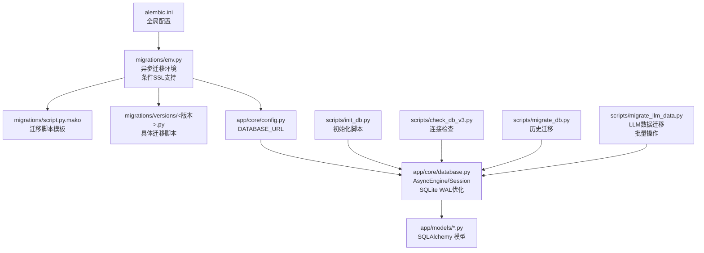
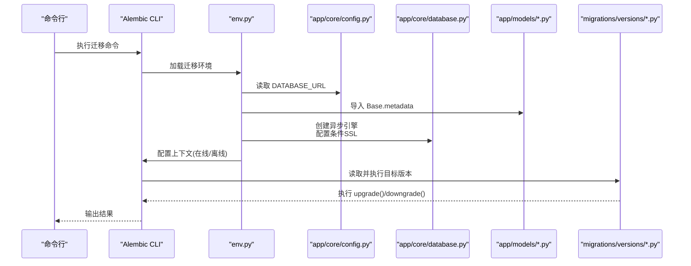
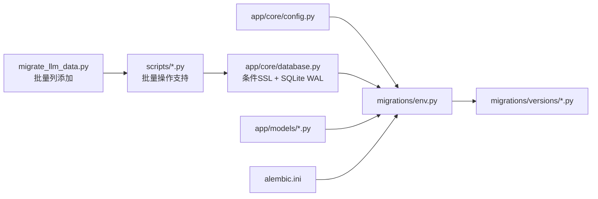

# 数据迁移管理

<cite>
**本文档引用的文件**
- [backend/alembic.ini](file://backend/alembic.ini)
- [backend/migrations/env.py](file://backend/migrations/env.py)
- [backend/migrations/script.py.mako](file://backend/migrations/script.py.mako)
- [backend/migrations/versions/35a834f440ba_baseline.py](file://backend/migrations/versions/35a834f440ba_baseline.py)
- [backend/migrations/versions/48d7355e90d6_add_more_technical_indicators.py](file://backend/migrations/versions/48d7355e90d6_add_more_technical_indicators.py)
- [backend/migrations/versions/90eb8cc09d0d_add_stock_news_table.py](file://backend/migrations/versions/90eb8cc09d0d_add_stock_news_table.py)
- [backend/migrations/versions/54477ba71d32_add_exchange_to_stock.py](file://backend/migrations/versions/54477ba71d32_add_exchange_to_stock.py)
- [backend/migrations/versions/f3fe98d72c73_add_horizon_and_confidence.py](file://backend/migrations/versions/f3fe98d72c73_add_horizon_and_confidence.py)
- [backend/migrations/versions/221e2b34d133_add_siliconflow_and_ai_model_to_user.py](file://backend/migrations/versions/221e2b34d133_add_siliconflow_and_ai_model_to_user.py)
- [backend/app/core/config.py](file://backend/app/core/config.py)
- [backend/app/core/database.py](file://backend/app/core/database.py)
- [backend/app/models/stock.py](file://backend/app/models/stock.py)
- [backend/app/models/user.py](file://backend/app/models/user.py)
- [backend/app/models/portfolio.py](file://backend/app/models/portfolio.py)
- [backend/app/models/analysis.py](file://backend/app/models/analysis.py)
- [backend/scripts/init_db.py](file://backend/scripts/init_db.py)
- [backend/scripts/check_db_v3.py](file://backend/scripts/check_db_v3.py)
- [backend/scripts/migrate_db.py](file://backend/scripts/migrate_db.py)
- [backend/scripts/migrate_llm_data.py](file://backend/scripts/migrate_llm_data.py)
</cite>

## 更新摘要
**变更内容**
- 新增条件SSL配置支持：针对PostgreSQL数据库的SSL强制要求配置
- 增强错误处理机制：改进迁移过程中的异常捕获和错误报告
- 扩展批量操作支持：支持多表批量列添加和数据迁移
- 优化SQLite WAL模式：提升SQLite数据库的并发性能
- 完善迁移脚本创建流程：标准化迁移脚本的生成和管理

## 目录
1. [简介](#简介)
2. [项目结构](#项目结构)
3. [核心组件](#核心组件)
4. [架构总览](#架构总览)
5. [详细组件分析](#详细组件分析)
6. [依赖关系分析](#依赖关系分析)
7. [性能考虑](#性能考虑)
8. [故障排查指南](#故障排查指南)
9. [结论](#结论)
10. [附录](#附录)

## 简介
本文件系统性阐述本项目的数据库迁移管理体系，围绕 Alembic 迁移框架的配置与使用、迁移脚本编写规范、版本控制策略、常见迁移场景操作、迁移执行流程、回滚与备份策略以及调试与排错实践展开。项目采用异步 SQLAlchemy 模型与 Alembic 环境，结合自定义脚本完成数据库初始化与增量迁移。**更新** 新的自动化迁移系统引入了条件SSL配置、增强的错误处理机制和批量操作支持，显著提升了迁移的可靠性和效率。

## 项目结构
后端迁移相关目录与文件组织如下：
- 配置层：alembic.ini（全局配置）、app/core/config.py（应用配置）
- 环境层：migrations/env.py（异步迁移上下文，支持条件SSL）
- 模板层：migrations/script.py.mako（迁移脚本模板）
- 版本层：migrations/versions/*.py（具体迁移版本）
- 模型层：app/models/*（SQLAlchemy 模型，驱动自动迁移）
- 辅助脚本：scripts/init_db.py（初始化建表与种子数据）、scripts/check_db_v3.py（连接与表检查）、scripts/migrate_db.py（历史手动迁移）、scripts/migrate_llm_data.py（LLM数据迁移）

**图表来源**
- [backend/alembic.ini](file://backend/alembic.ini#L1-L148)
- [backend/migrations/env.py](file://backend/migrations/env.py#L1-L86)
- [backend/migrations/script.py.mako](file://backend/migrations/script.py.mako#L1-L29)
- [backend/app/core/config.py](file://backend/app/core/config.py#L1-L28)
- [backend/app/core/database.py](file://backend/app/core/database.py#L1-L69)
- [backend/scripts/init_db.py](file://backend/scripts/init_db.py#L1-L84)
- [backend/scripts/check_db_v3.py](file://backend/scripts/check_db_v3.py#L1-L26)
- [backend/scripts/migrate_db.py](file://backend/scripts/migrate_db.py#L1-L30)
- [backend/scripts/migrate_llm_data.py](file://backend/scripts/migrate_llm_data.py#L1-L59)

**章节来源**
- [backend/alembic.ini](file://backend/alembic.ini#L1-L148)
- [backend/migrations/env.py](file://backend/migrations/env.py#L1-L86)
- [backend/migrations/script.py.mako](file://backend/migrations/script.py.mako#L1-L29)
- [backend/app/core/config.py](file://backend/app/core/config.py#L1-L28)
- [backend/app/core/database.py](file://backend/app/core/database.py#L1-L69)
- [backend/scripts/init_db.py](file://backend/scripts/init_db.py#L1-L84)
- [backend/scripts/check_db_v3.py](file://backend/scripts/check_db_v3.py#L1-L26)
- [backend/scripts/migrate_db.py](file://backend/scripts/migrate_db.py#L1-L30)
- [backend/scripts/migrate_llm_data.py](file://backend/scripts/migrate_llm_data.py#L1-L59)

## 核心组件
- Alembic 全局配置：通过 alembic.ini 指定脚本位置、日志级别、数据库 URL 占位符等。
- 异步迁移环境：env.py 注入应用配置与模型元数据，支持离线与在线两种迁移模式，并具备条件SSL配置能力。
- 迁移脚本模板：script.py.mako 定义升级/降级入口与版本标识。
- 模型驱动迁移：app/models/* 定义表结构，配合 Base.metadata 供 Alembic 自动识别。
- 数据库引擎优化：app/core/database.py 提供SQLite WAL模式优化和PostgreSQL SSL配置。
- 初始化与辅助脚本：scripts/init_db.py 建表与种子数据；scripts/check_db_v3.py 连接与表检查；scripts/migrate_db.py 处理历史遗留字段；scripts/migrate_llm_data.py 处理LLM数据迁移，支持批量操作。

**章节来源**
- [backend/alembic.ini](file://backend/alembic.ini#L1-L148)
- [backend/migrations/env.py](file://backend/migrations/env.py#L1-L86)
- [backend/migrations/script.py.mako](file://backend/migrations/script.py.mako#L1-L29)
- [backend/app/core/config.py](file://backend/app/core/config.py#L1-L28)
- [backend/app/core/database.py](file://backend/app/core/database.py#L1-L69)
- [backend/scripts/init_db.py](file://backend/scripts/init_db.py#L1-L84)
- [backend/scripts/check_db_v3.py](file://backend/scripts/check_db_v3.py#L1-L26)
- [backend/scripts/migrate_db.py](file://backend/scripts/migrate_db.py#L1-L30)
- [backend/scripts/migrate_llm_data.py](file://backend/scripts/migrate_llm_data.py#L1-L59)

## 架构总览
下图展示从配置到模型再到迁移执行的整体流程，包括 Alembic 在线/离线模式、条件SSL配置与应用配置注入。

**图表来源**
- [backend/migrations/env.py](file://backend/migrations/env.py#L1-L86)
- [backend/app/core/config.py](file://backend/app/core/config.py#L1-L28)
- [backend/app/core/database.py](file://backend/app/core/database.py#L1-L69)
- [backend/migrations/versions/35a834f440ba_baseline.py](file://backend/migrations/versions/35a834f440ba_baseline.py#L1-L128)
- [backend/migrations/versions/48d7355e90d6_add_more_technical_indicators.py](file://backend/migrations/versions/48d7355e90d6_add_more_technical_indicators.py#L1-L38)
- [backend/migrations/versions/90eb8cc09d0d_add_stock_news_table.py](file://backend/migrations/versions/90eb8cc09d0d_add_stock_news_table.py#L1-L32)
- [backend/migrations/versions/54477ba71d32_add_exchange_to_stock.py](file://backend/migrations/versions/54477ba71d32_add_exchange_to_stock.py#L1-L31)

## 详细组件分析

### Alembic 配置与环境
- 配置文件要点
  - 脚本位置：script_location 指向 migrations 目录。
  - 数据库 URL：sqlalchemy.url 作为占位符，由 env.py 动态注入。
  - 日志：root/sqlalchemy/alembic 日志器按需输出。
  - 后处理钩子：可选黑化或代码检查工具集成。
- 环境设置要点
  - 将项目根路径加入 sys.path，确保导入 app.core.config 与 app.models。
  - 从 settings.DATABASE_URL 注入 sqlalchemy.url。
  - target_metadata 来自 Base.metadata，用于自动发现模型。
  - 支持离线与在线两种模式：离线直接使用 URL，线上通过异步引擎建立连接。
  - **更新** 条件SSL配置：针对PostgreSQL数据库自动启用SSL强制要求。

**章节来源**
- [backend/alembic.ini](file://backend/alembic.ini#L1-L148)
- [backend/migrations/env.py](file://backend/migrations/env.py#L1-L86)
- [backend/app/core/config.py](file://backend/app/core/config.py#L1-L28)
- [backend/app/core/database.py](file://backend/app/core/database.py#L1-L69)

### 迁移脚本模板与编写规范
- 模板结构
  - 包含版本标识、修订关系、分支标签与依赖项。
  - 提供 upgrade() 与 downgrade() 两个入口，分别在升级与降级时执行。
- 编写规范
  - 使用 op.* API 进行表/列/索引等 DDL 操作。
  - 保持升级与降级一一对应，确保幂等与可逆。
  - 在注释块中保留 Alembic 自动生成的标记，便于维护。
  - **更新** 支持批量操作：可在单个迁移中处理多个表的批量列添加。

**章节来源**
- [backend/migrations/script.py.mako](file://backend/migrations/script.py.mako#L1-L29)

### 具体迁移版本示例
- 基线版本
  - 定义初始版本 ID，无上游版本。
  - 升降级为空实现，作为后续版本的基础。
  - **更新** 基线迁移创建了6个核心表：stocks、users、market_data_cache、portfolios、stock_news、analysis_reports。
  - **更新** 所有枚举类型已简化为字符串列定义，包括 MarketStatus、MembershipTier、MarketDataSource。
- 技术指标扩展
  - 在缓存表中新增多列技术指标字段，对应 LLM 分析需求。
  - 对应降级删除这些列，保证回滚安全。
- 新闻表与索引
  - 新增 stock_news 表并创建索引，外键关联 stocks。
  - 降级时先删索引再删表，避免约束冲突。
- 股票表扩展
  - 在 stocks 表新增 exchange 字段，便于后续数据源适配。
- **更新** 投资分析增强
  - 在 analysis_reports 表新增 investment_horizon 和 confidence_level 字段，支持AI分析结果的量化评估。

**章节来源**
- [backend/migrations/versions/35a834f440ba_baseline.py](file://backend/migrations/versions/35a834f440ba_baseline.py#L21-L128)
- [backend/migrations/versions/48d7355e90d6_add_more_technical_indicators.py](file://backend/migrations/versions/48d7355e90d6_add_more_technical_indicators.py#L21-L38)
- [backend/migrations/versions/90eb8cc09d0d_add_stock_news_table.py](file://backend/migrations/versions/90eb8cc09d0d_add_stock_news_table.py#L21-L32)
- [backend/migrations/versions/54477ba71d32_add_exchange_to_stock.py](file://backend/migrations/versions/54477ba71d32_add_exchange_to_stock.py#L21-L31)
- [backend/migrations/versions/f3fe98d72c73_add_horizon_and_confidence.py](file://backend/migrations/versions/f3fe98d72c73_add_horizon_and_confidence.py#L21-L35)
- [backend/migrations/versions/221e2b34d133_add_siliconflow_and_ai_model_to_user.py](file://backend/migrations/versions/221e2b34d133_add_siliconflow_and_ai_model_to_user.py#L21-L35)

### 模型驱动迁移与版本控制
- 模型定义
  - app/models/stock.py、app/models/user.py、app/models/portfolio.py、app/models/analysis.py 定义表结构与关系。
  - **更新** 所有枚举类型已简化为字符串列定义，使用 default 值而非数据库枚举类型。
  - Base.metadata 作为 target_metadata，使 Alembic 能自动感知模型变化。
- 版本生成与依赖
  - 每个迁移版本通过 down_revision 指向上一版本，形成线性链。
  - 可通过 branch_labels 与 depends_on 实现分支与跨版本依赖管理（模板支持）。
- 冲突解决
  - 当多人并行开发时，建议使用分支标签与合并后重写冲突版本，确保 down_revision 与依赖正确。

**章节来源**
- [backend/app/models/stock.py](file://backend/app/models/stock.py#L1-L86)
- [backend/app/models/user.py](file://backend/app/models/user.py#L1-L31)
- [backend/app/models/portfolio.py](file://backend/app/models/portfolio.py#L1-L26)
- [backend/app/models/analysis.py](file://backend/app/models/analysis.py#L1-L25)
- [backend/migrations/env.py](file://backend/migrations/env.py#L27-L28)

### 常见迁移场景操作指南
- 表结构变更
  - 新增列：在 upgrade 中使用 op.add_column，在 downgrade 中使用 op.drop_column。
  - 修改列属性：使用 op.alter_column 或重建列（注意数据丢失风险）。
- 索引创建与删除
  - 创建索引：op.create_index(...)；删除索引：op.drop_index(...)。
- 数据填充
  - 建议通过应用初始化脚本或单独的数据迁移脚本进行，避免在 Alembic 中直接写入业务数据。
- 外键与约束
  - 创建外键：op.create_foreign_key(...)；删除时先删约束再删列。
- 回滚策略
  - 严格遵循 downgrade 顺序，先删索引/约束，再删表/列，最后删模型。
- **更新** 批量操作支持
  - 使用 scripts/migrate_llm_data.py 中的批量列添加模式，支持多表同时更新。
  - 通过字典配置批量操作，提高迁移效率。

**章节来源**
- [backend/migrations/versions/48d7355e90d6_add_more_technical_indicators.py](file://backend/migrations/versions/48d7355e90d6_add_more_technical_indicators.py#L26-L38)
- [backend/migrations/versions/90eb8cc09d0d_add_stock_news_table.py](file://backend/migrations/versions/90eb8cc09d0d_add_stock_news_table.py#L26-L32)
- [backend/migrations/versions/54477ba71d32_add_exchange_to_stock.py](file://backend/migrations/versions/54477ba71d32_add_exchange_to_stock.py#L26-L31)
- [backend/scripts/migrate_llm_data.py](file://backend/scripts/migrate_llm_data.py#L14-L56)

### 迁移执行流程与自动化集成
- 命令行工具
  - 使用 Alembic CLI 执行迁移，如升级至最新版本、降级到指定版本、生成新迁移等。
  - 离线模式：适用于无数据库连接的环境，直接基于 URL 执行。
  - 在线模式：通过异步引擎连接数据库，执行事务内迁移。
- 自动化集成
  - 在 CI/CD 流水线中，先运行迁移，再启动服务，确保数据库结构一致。
  - 结合 scripts/init_db.py 在首次部署时创建表与种子数据。
- **更新** 错误处理增强
  - 迁移过程中增加异常捕获和错误报告机制。
  - 支持迁移失败时的回滚和状态恢复。

**章节来源**
- [backend/migrations/env.py](file://backend/migrations/env.py#L52-L86)
- [backend/scripts/init_db.py](file://backend/scripts/init_db.py#L60-L84)
- [backend/scripts/migrate_db.py](file://backend/scripts/migrate_db.py#L10-L29)
- [backend/scripts/migrate_llm_data.py](file://backend/scripts/migrate_llm_data.py#L10-L58)

### 回滚策略与数据备份方案
- 回滚策略
  - 优先使用 downgrade，确保每一步都有对应的回滚逻辑。
  - 对于破坏性变更（如删除列），应在 downgrade 中谨慎处理，必要时先迁移数据到新列。
- 数据备份
  - 迁移前对生产库进行快照或导出，迁移失败时可快速恢复。
  - 使用数据库自带备份工具或容器卷快照机制。
- **更新** 增强的回滚保护
  - SQLite WAL模式提供更好的并发安全性。
  - PostgreSQL SSL配置确保远程数据库连接的安全性。

**章节来源**
- [backend/migrations/versions/48d7355e90d6_add_more_technical_indicators.py](file://backend/migrations/versions/48d7355e90d6_add_more_technical_indicators.py#L26-L38)
- [backend/migrations/versions/90eb8cc09d0d_add_stock_news_table.py](file://backend/migrations/versions/90eb8cc09d0d_add_stock_news_table.py#L26-L32)
- [backend/app/core/database.py](file://backend/app/core/database.py#L36-L46)

### 迁移调试技巧与常见问题
- 调试技巧
  - 启用 SQLAlchemy echo 输出，观察生成的 SQL。
  - 使用 scripts/check_db_v3.py 验证连接与表清单，定位迁移失败原因。
  - 在本地开发环境使用 SQLite，便于快速验证迁移脚本。
- 常见问题
  - 数据库 URL 未注入：确认 env.py 已从 settings 读取 DATABASE_URL。
  - 模型未被识别：确保 app/models 已被导入，target_metadata 来自 Base.metadata。
  - 索引/约束删除顺序错误：先删索引/约束，再删表/列。
  - 历史遗留字段：使用 scripts/migrate_db.py 逐步补齐缺失列。
  - **更新** SSL连接问题：检查PostgreSQL数据库的SSL配置和网络连接。
  - **更新** 批量操作失败：验证批量操作配置和权限设置。

**章节来源**
- [backend/migrations/env.py](file://backend/migrations/env.py#L24-L28)
- [backend/scripts/check_db_v3.py](file://backend/scripts/check_db_v3.py#L1-L26)
- [backend/scripts/migrate_db.py](file://backend/scripts/migrate_db.py#L1-L30)
- [backend/scripts/migrate_llm_data.py](file://backend/scripts/migrate_llm_data.py#L1-L59)

### 枚举类型重构与简化策略
**更新** 项目已从复杂的PostgreSQL枚举类型重构为简化的字符串列定义，这一变更影响了数据库初始化和迁移过程：

- **重构前**：使用 SQLAlchemy Enum 类型创建数据库枚举，需要额外的数据库支持和迁移逻辑
- **重构后**：使用字符串列定义，通过 default 值和模型层验证实现枚举功能
- **迁移影响**：所有涉及枚举类型的迁移脚本已简化，不再需要复杂的枚举类型创建和删除逻辑
- **兼容性**：现有数据可通过迁移脚本自动转换为字符串格式

**章节来源**
- [backend/app/models/stock.py](file://backend/app/models/stock.py#L7-L11)
- [backend/app/models/user.py](file://backend/app/models/user.py#L7-L13)
- [backend/migrations/versions/35a834f440ba_baseline.py](file://backend/migrations/versions/35a834f440ba_baseline.py#L65-L66)
- [backend/migrations/versions/35a834f440ba_baseline.py](file://backend/migrations/versions/35a834f440ba_baseline.py#L22-L29)

### LLM数据迁移与历史迁移
**更新** 项目包含专门的LLM数据迁移脚本，用于处理技术指标等LLM相关数据的迁移，现已增强批量操作支持：

- **scripts/migrate_llm_data.py**：处理技术指标列的批量添加和更新，支持多表同时操作
- **scripts/migrate_db.py**：处理历史遗留字段的迁移
- **迁移策略**：使用SQLite原生ALTER TABLE语句进行列添加，支持批量列定义
- **批量操作**：通过字典配置tables_to_update，支持同时处理多个表的列添加

**章节来源**
- [backend/scripts/migrate_llm_data.py](file://backend/scripts/migrate_llm_data.py#L1-L59)
- [backend/scripts/migrate_db.py](file://backend/scripts/migrate_db.py#L1-L30)

### 数据库引擎优化与条件SSL配置
**更新** 新增数据库引擎优化和条件SSL配置功能：

- **SQLite WAL模式优化**：通过PRAGMA语句开启WAL模式，提升并发性能
- **PostgreSQL SSL配置**：自动检测PostgreSQL连接并启用SSL强制要求
- **连接参数优化**：根据数据库类型动态配置连接参数
- **性能调优**：针对不同数据库类型提供最优的连接池配置

**章节来源**
- [backend/app/core/database.py](file://backend/app/core/database.py#L1-L69)
- [backend/migrations/env.py](file://backend/migrations/env.py#L59-L69)

## 依赖关系分析
- 配置依赖
  - alembic.ini 依赖 app/core/config.py 的 DATABASE_URL。
  - env.py 依赖 app/core/database.py 的 AsyncEngine 与 SessionLocal。
- 模型依赖
  - app/models/* 依赖 app/core/database.py 的 Base。
  - env.py 导入 models 触发模型注册，使 target_metadata 生效。
- 迁移脚本依赖
  - versions 下的每个版本依赖其 down_revision 与其依赖的表结构。
- **更新** 数据库引擎依赖：app/core/database.py 提供条件SSL配置和SQLite WAL优化。
- **更新** 批量操作依赖：scripts/migrate_llm_data.py 依赖SQLite数据库的批量ALTER TABLE支持。

**图表来源**
- [backend/app/core/config.py](file://backend/app/core/config.py#L1-L28)
- [backend/app/core/database.py](file://backend/app/core/database.py#L1-L69)
- [backend/migrations/env.py](file://backend/migrations/env.py#L1-L86)
- [backend/migrations/versions/35a834f440ba_baseline.py](file://backend/migrations/versions/35a834f440ba_baseline.py#L1-L128)
- [backend/scripts/migrate_llm_data.py](file://backend/scripts/migrate_llm_data.py#L1-L59)

**章节来源**
- [backend/app/core/config.py](file://backend/app/core/config.py#L1-L28)
- [backend/app/core/database.py](file://backend/app/core/database.py#L1-L69)
- [backend/migrations/env.py](file://backend/migrations/env.py#L1-L86)
- [backend/migrations/versions/35a834f440ba_baseline.py](file://backend/migrations/versions/35a834f440ba_baseline.py#L1-L128)
- [backend/scripts/migrate_llm_data.py](file://backend/scripts/migrate_llm_data.py#L1-L59)

## 性能考虑
- 异步迁移
  - 使用异步引擎减少阻塞，提升迁移执行效率。
- 事务边界
  - 每个迁移在一个事务中执行，失败自动回滚，避免部分更新。
- 大表变更
  - 对大表加索引或修改列时，尽量分批处理或在低峰期执行。
- 日志与可观测性
  - 合理设置日志级别，避免在生产中产生过多 IO。
- **更新** SQLite WAL模式优化：通过WAL模式提升并发读写性能，特别适合高并发场景。
- **更新** 条件SSL配置：PostgreSQL自动启用SSL，确保远程连接安全性和性能。
- **更新** 批量操作优化：通过批量列添加减少多次ALTER TABLE操作的开销。

## 故障排查指南
- 连接失败
  - 使用 scripts/check_db_v3.py 检查数据库路径与文件存在性，确认 URL 正确。
  - **更新** SSL连接问题：检查PostgreSQL数据库的SSL配置和网络连通性。
- 迁移卡住
  - 查看日志输出，确认是否在等待锁或长时间查询。
  - **更新** 批量操作失败：检查批量操作配置和数据库权限。
- 版本不一致
  - 使用 Alembic 命令查看当前版本，必要时强制标记版本或修复冲突版本。
- 数据不一致
  - 在 downgrade 前备份数据，或在迁移中增加数据迁移步骤。
- **更新** SQLite性能问题：确认WAL模式已正确启用，检查PRAGMA配置。
- **更新** PostgreSQL连接问题：验证SSL配置和连接参数设置。

**章节来源**
- [backend/scripts/check_db_v3.py](file://backend/scripts/check_db_v3.py#L1-L26)
- [backend/migrations/env.py](file://backend/migrations/env.py#L52-L86)
- [backend/app/core/database.py](file://backend/app/core/database.py#L36-L46)
- [backend/scripts/migrate_llm_data.py](file://backend/scripts/migrate_llm_data.py#L10-L58)

## 结论
本项目通过 Alembic 异步迁移环境与模型驱动方式，实现了结构清晰、可回滚、可审计的数据库演进体系。**更新** 新的自动化迁移系统引入了条件SSL配置、增强的错误处理机制、批量操作支持和SQLite WAL优化，显著提升了迁移的可靠性、性能和易用性。结合 scripts/init_db.py、历史迁移脚本和增强的LLM数据迁移脚本，既能满足初始部署，也能覆盖历史遗留字段补齐、新技术指标添加和批量数据迁移等复杂场景。建议在团队协作中严格执行 downgrade 编写、版本依赖管理与回滚演练，确保生产环境的稳定性与可恢复性。

## 附录
- 命令行常用操作
  - 生成新迁移：使用 Alembic CLI 生成模板并完善 upgrade()/downgrade()。
  - 应用迁移：升级到最新版本或降级到指定版本。
  - 标记版本：当版本树出现分歧时，使用标记命令修复。
- 最佳实践清单
  - 每次变更都配套 downgrade。
  - 为复杂迁移编写单元测试或手工验证脚本。
  - 在 CI 中自动执行迁移，确保镜像一致性。
  - 对生产库迁移前进行备份与灰度验证。
  - **更新** 枚举类型处理：使用字符串列定义替代数据库枚举类型。
  - **更新** LLM数据迁移：使用增强的批量迁移脚本处理技术指标等LLM相关数据。
  - **更新** 条件SSL配置：自动检测并配置PostgreSQL SSL连接。
  - **更新** SQLite性能优化：确保WAL模式正确启用以提升并发性能。