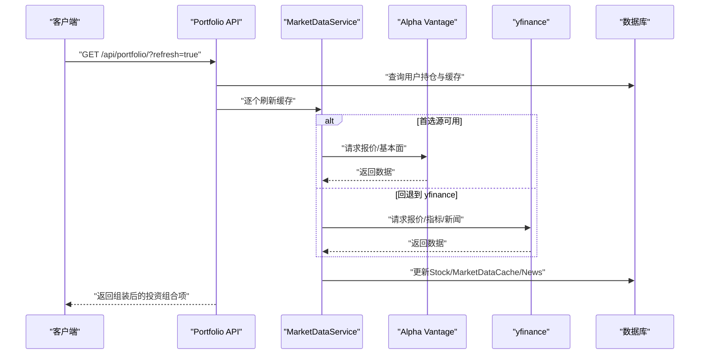
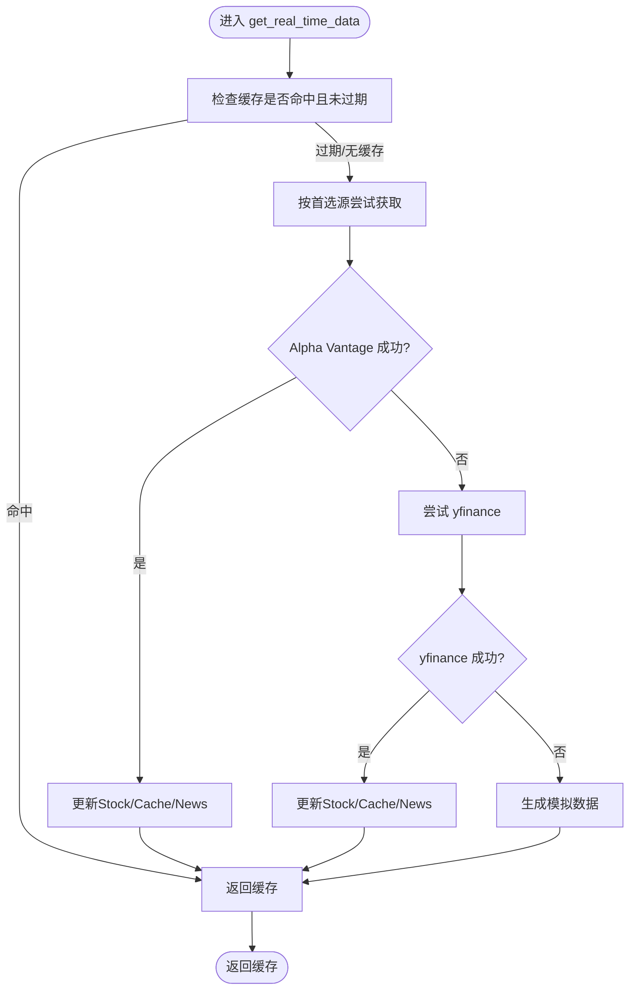
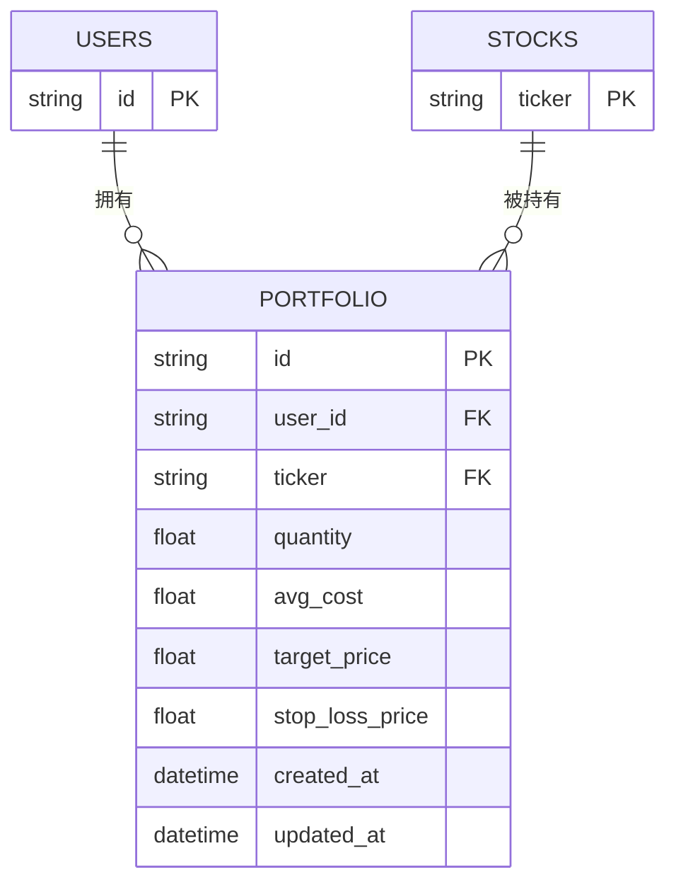
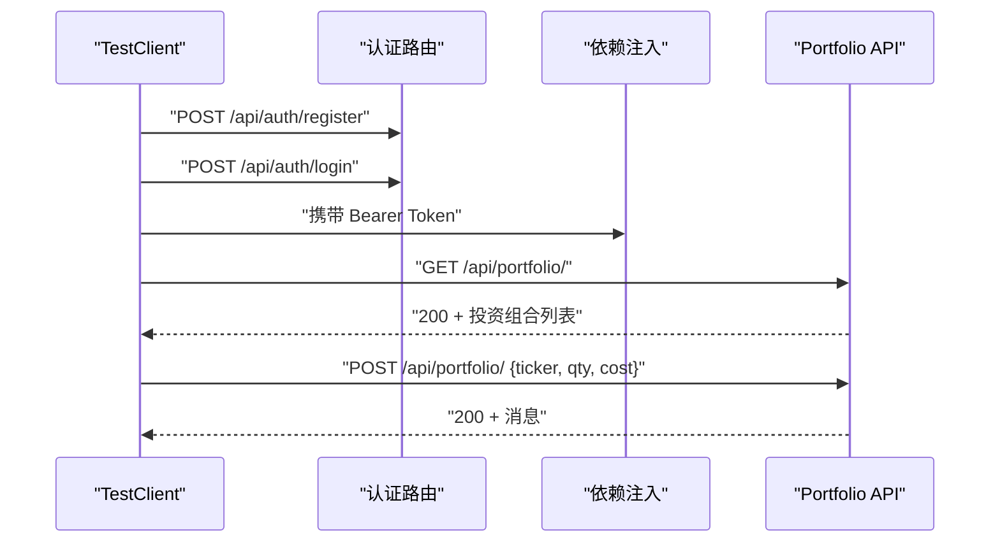
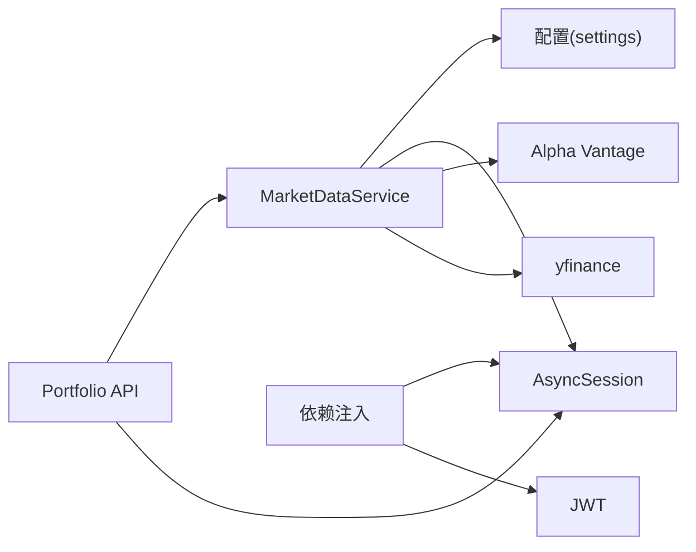

# 单元测试

<cite>
**本文引用的文件**
- [backend/app/services/market_data.py](file://backend/app/services/market_data.py)
- [backend/app/models/portfolio.py](file://backend/app/models/portfolio.py)
- [backend/app/models/stock.py](file://backend/app/models/stock.py)
- [backend/app/models/user.py](file://backend/app/models/user.py)
- [backend/app/api/portfolio.py](file://backend/app/api/portfolio.py)
- [backend/app/api/deps.py](file://backend/app/api/deps.py)
- [backend/app/core/database.py](file://backend/app/core/database.py)
- [backend/app/core/security.py](file://backend/app/core/security.py)
- [backend/test_market_data.py](file://backend/test_market_data.py)
- [backend/test_alpha_vantage.py](file://backend/test_alpha_vantage.py)
- [backend/test_api.py](file://backend/test_api.py)
- [backend/test_auth.py](file://backend/test_auth.py)
- [backend/test_yf.py](file://backend/test_yf.py)
</cite>

## 目录
1. [引言](#引言)
2. [项目结构](#项目结构)
3. [核心组件](#核心组件)
4. [架构总览](#架构总览)
5. [详细组件分析](#详细组件分析)
6. [依赖分析](#依赖分析)
7. [性能考虑](#性能考虑)
8. [故障排查指南](#故障排查指南)
9. [结论](#结论)
10. [附录](#附录)

## 引言
本文件面向单元测试与集成测试的最佳实践，围绕市场数据服务、投资组合模型与API端点展开，系统阐述以下主题：
- 单元测试设计原则与隔离策略
- Mock 对象在数据库连接、外部API与外部服务中的使用方法
- 测试数据准备与清理策略
- 具体测试用例编写示例（MarketDataService、Portfolio 模型、API 端点）
- 断言与错误处理测试
- 覆盖率统计与质量门禁建议
- 执行方式与调试技巧

## 项目结构
后端采用 FastAPI + SQLAlchemy 异步 ORM 架构，核心模块包括：
- 服务层：市场数据服务（MarketDataService）负责实时行情、技术指标与缓存更新
- 模型层：Stock、MarketDataCache、Portfolio、User 等数据库实体
- API 层：Portfolio API 提供投资组合查询、新增、删除；认证依赖注入与安全工具
- 核心基础设施：异步数据库引擎与会话管理、JWT 安全工具

```mermaid
graph TB
subgraph "服务层"
Svc["MarketDataService<br/>实时行情/缓存/指标"]
end
subgraph "模型层"
M1["Stock<br/>股票基础信息"]
M2["MarketDataCache<br/>技术指标缓存"]
M3["Portfolio<br/>用户持仓"]
M4["User<br/>用户与偏好"]
end
subgraph "API层"
API["Portfolio API<br/>查询/新增/删除"]
DEPS["依赖注入与鉴权"]
end
subgraph "核心"
DB["异步数据库引擎/会话"]
SEC["JWT与密码工具"]
end
Svc --> DB
API --> Svc
API --> DB
DEPS --> DB
DEPS --> SEC
M1 < --> M2
M3 --> M1
M4 --> API
```

图表来源
- [backend/app/services/market_data.py](file://backend/app/services/market_data.py#L13-L170)
- [backend/app/models/stock.py](file://backend/app/models/stock.py#L13-L85)
- [backend/app/models/portfolio.py](file://backend/app/models/portfolio.py#L7-L26)
- [backend/app/models/user.py](file://backend/app/models/user.py#L15-L31)
- [backend/app/api/portfolio.py](file://backend/app/api/portfolio.py#L143-L224)
- [backend/app/api/deps.py](file://backend/app/api/deps.py#L17-L43)
- [backend/app/core/database.py](file://backend/app/core/database.py#L1-L24)
- [backend/app/core/security.py](file://backend/app/core/security.py#L1-L26)

章节来源
- [backend/app/services/market_data.py](file://backend/app/services/market_data.py#L13-L170)
- [backend/app/models/stock.py](file://backend/app/models/stock.py#L13-L85)
- [backend/app/models/portfolio.py](file://backend/app/models/portfolio.py#L7-L26)
- [backend/app/models/user.py](file://backend/app/models/user.py#L15-L31)
- [backend/app/api/portfolio.py](file://backend/app/api/portfolio.py#L143-L224)
- [backend/app/api/deps.py](file://backend/app/api/deps.py#L17-L43)
- [backend/app/core/database.py](file://backend/app/core/database.py#L1-L24)
- [backend/app/core/security.py](file://backend/app/core/security.py#L1-L26)

## 核心组件
- MarketDataService：封装 Alpha Vantage 与 yfinance 的数据获取、缓存更新、技术指标计算与新闻入库逻辑
- Portfolio API：投资组合查询、新增、删除，支持刷新与后台拉取
- 数据模型：Stock/MarketDataCache 一对一体系，Portfolio 多条记录对应一个用户
- 依赖注入与鉴权：OAuth2 Bearer Token 解析、用户校验、数据库会话注入

章节来源
- [backend/app/services/market_data.py](file://backend/app/services/market_data.py#L13-L170)
- [backend/app/api/portfolio.py](file://backend/app/api/portfolio.py#L143-L224)
- [backend/app/models/stock.py](file://backend/app/models/stock.py#L13-L85)
- [backend/app/models/portfolio.py](file://backend/app/models/portfolio.py#L7-L26)
- [backend/app/api/deps.py](file://backend/app/api/deps.py#L17-L43)

## 架构总览
下图展示了从 API 到服务再到外部数据源与数据库的交互路径，以及缓存与技术指标的生成流程。



图表来源
- [backend/app/api/portfolio.py](file://backend/app/api/portfolio.py#L143-L175)
- [backend/app/services/market_data.py](file://backend/app/services/market_data.py#L15-L170)
- [backend/app/models/stock.py](file://backend/app/models/stock.py#L33-L67)

## 详细组件分析

### MarketDataService 单元测试设计
目标：验证实时数据获取、缓存命中、回退机制、技术指标与新闻入库、数据库一致性。

- 测试隔离策略
  - 使用内存数据库或临时数据库实例，避免污染主库
  - 将外部依赖（Alpha Vantage、yfinance）通过 Mock 替换，控制输入输出
  - 使用异步会话进行数据库操作，确保事务可回滚

- Mock 对象使用
  - Alpha Vantage：模拟返回报价与基本面数据，覆盖正常与限流场景
  - yfinance：模拟历史数据与指标计算，覆盖网络异常与速率限制
  - 数据库：使用 SQLAlchemy Mock 或内存数据库，验证插入/更新/去重逻辑

- 测试数据准备与清理
  - 准备：创建测试用户、股票、缓存初始状态
  - 清理：事务回滚或删除测试记录，确保用例间互不影响

- 断言与错误处理
  - 正向：价格、涨跌幅、技术指标字段存在且类型正确
  - 边界：缓存未过期时直接返回缓存；过期时触发刷新
  - 错误：外部服务失败时的回退与异常抛出；数据库约束冲突处理

- 示例用例路径
  - 基础功能：[backend/test_market_data.py](file://backend/test_market_data.py#L13-L26)
  - Alpha Vantage 流程：[backend/test_alpha_vantage.py](file://backend/test_alpha_vantage.py#L14-L52)



图表来源
- [backend/app/services/market_data.py](file://backend/app/services/market_data.py#L15-L170)

章节来源
- [backend/test_market_data.py](file://backend/test_market_data.py#L13-L26)
- [backend/test_alpha_vantage.py](file://backend/test_alpha_vantage.py#L14-L52)
- [backend/app/services/market_data.py](file://backend/app/services/market_data.py#L15-L170)

### Portfolio 模型单元测试设计
目标：验证唯一性约束、外键关系、序列化字段与默认值。

- 测试隔离策略
  - 使用独立数据库实例或事务包裹，避免影响其他用例
  - 通过工厂模式构造测试数据，保证字段完整性

- Mock 对象使用
  - 不需要外部依赖，主要验证 ORM 映射与约束

- 测试数据准备与清理
  - 准备：用户、股票、持仓记录
  - 清理：删除测试记录或回滚事务

- 断言与错误处理
  - 正向：唯一约束生效（同一用户同一只股票只能有一条记录）
  - 错向：违反唯一性或外键约束时抛出异常

- 示例用例路径
  - 投资组合模型定义：[backend/app/models/portfolio.py](file://backend/app/models/portfolio.py#L7-L26)



图表来源
- [backend/app/models/user.py](file://backend/app/models/user.py#L15-L31)
- [backend/app/models/stock.py](file://backend/app/models/stock.py#L13-L31)
- [backend/app/models/portfolio.py](file://backend/app/models/portfolio.py#L7-L26)

章节来源
- [backend/app/models/portfolio.py](file://backend/app/models/portfolio.py#L7-L26)
- [backend/app/models/stock.py](file://backend/app/models/stock.py#L13-L31)
- [backend/app/models/user.py](file://backend/app/models/user.py#L15-L31)

### API 端点单元测试设计
目标：验证路由存在性、鉴权中间件、参数校验、响应结构与错误码。

- 测试隔离策略
  - 使用 TestClient 或 AsyncClient 进行端到端测试
  - 通过依赖替换注入测试会话或用户上下文

- Mock 对象使用
  - 替换数据库依赖以避免真实连接
  - 模拟外部服务返回值，覆盖成功与失败分支

- 测试数据准备与清理
  - 准备：注册/登录获取令牌；创建测试用户与股票
  - 清理：删除测试用户与相关记录

- 断言与错误处理
  - 正向：健康检查、分析接口、投资组合查询与新增均返回 200
  - 错向：未授权访问返回 403/401；资源不存在返回 404

- 示例用例路径
  - 认证流程测试：[backend/test_auth.py](file://backend/test_auth.py#L10-L54)
  - API 健康与分析测试：[backend/test_api.py](file://backend/test_api.py#L10-L39)



图表来源
- [backend/test_auth.py](file://backend/test_auth.py#L10-L54)
- [backend/test_api.py](file://backend/test_api.py#L10-L39)
- [backend/app/api/deps.py](file://backend/app/api/deps.py#L17-L43)
- [backend/app/api/portfolio.py](file://backend/app/api/portfolio.py#L143-L224)

章节来源
- [backend/test_auth.py](file://backend/test_auth.py#L10-L54)
- [backend/test_api.py](file://backend/test_api.py#L10-L39)
- [backend/app/api/deps.py](file://backend/app/api/deps.py#L17-L43)
- [backend/app/api/portfolio.py](file://backend/app/api/portfolio.py#L143-L224)

### 安全与配置单元测试设计
目标：验证 JWT 生成与校验、密码哈希与比较、算法常量。

- 测试隔离策略
  - 使用固定密钥与时间戳进行可控测试
  - 不依赖外部服务

- Mock 对象使用
  - 不需要外部依赖

- 断言与错误处理
  - 正向：生成的 token 可解码；密码哈希一致
  - 错向：错误密码返回 False；无效 token 抛出异常

- 示例用例路径
  - 安全工具：[backend/app/core/security.py](file://backend/app/core/security.py#L11-L25)

章节来源
- [backend/app/core/security.py](file://backend/app/core/security.py#L11-L25)

## 依赖分析
- 组件耦合
  - MarketDataService 依赖数据库会话与配置；对外部服务有选择性依赖
  - Portfolio API 依赖 MarketDataService 与数据库；鉴权依赖依赖注入模块
  - 数据模型之间通过外键建立关联，保持数据一致性

- 外部依赖
  - Alpha Vantage：报价与基本面数据
  - yfinance：历史数据与技术指标计算
  - 数据库：SQLite/PostgreSQL（取决于配置）



图表来源
- [backend/app/services/market_data.py](file://backend/app/services/market_data.py#L1-L12)
- [backend/app/api/portfolio.py](file://backend/app/api/portfolio.py#L1-L11)
- [backend/app/api/deps.py](file://backend/app/api/deps.py#L1-L11)
- [backend/app/core/database.py](file://backend/app/core/database.py#L1-L24)
- [backend/app/core/security.py](file://backend/app/core/security.py#L1-L10)

章节来源
- [backend/app/services/market_data.py](file://backend/app/services/market_data.py#L1-L12)
- [backend/app/api/portfolio.py](file://backend/app/api/portfolio.py#L1-L11)
- [backend/app/api/deps.py](file://backend/app/api/deps.py#L1-L11)
- [backend/app/core/database.py](file://backend/app/core/database.py#L1-L24)
- [backend/app/core/security.py](file://backend/app/core/security.py#L1-L10)

## 性能考虑
- 缓存优先：优先读取缓存，减少外部调用与数据库写入
- 批量刷新：在刷新投资组合时顺序处理，避免并发冲突
- 超时与重试：对外部服务设置超时与指数退避，提升稳定性
- 指标计算：仅在历史数据充足时计算技术指标，避免空值与异常

## 故障排查指南
- 外部服务限流
  - 现象：返回 429 或“请求过多”
  - 排查：确认代理配置、指数退避是否生效
  - 参考：[backend/app/services/market_data.py](file://backend/app/services/market_data.py#L303-L318)
- 缓存未更新
  - 现象：价格未变化或指标缺失
  - 排查：检查缓存过期时间、首选数据源、数据库提交
  - 参考：[backend/app/services/market_data.py](file://backend/app/services/market_data.py#L15-L170)
- 数据库约束冲突
  - 现象：唯一约束冲突或外键不存在
  - 排查：检查唯一性约束、外键关联、事务提交
  - 参考：[backend/app/models/portfolio.py](file://backend/app/models/portfolio.py#L21-L23)
- 鉴权失败
  - 现象：403/401 未授权
  - 排查：确认令牌格式、签名密钥、负载解析
  - 参考：[backend/app/api/deps.py](file://backend/app/api/deps.py#L21-L43)

章节来源
- [backend/app/services/market_data.py](file://backend/app/services/market_data.py#L303-L318)
- [backend/app/models/portfolio.py](file://backend/app/models/portfolio.py#L21-L23)
- [backend/app/api/deps.py](file://backend/app/api/deps.py#L21-L43)

## 结论
通过 Mock 外部依赖、隔离数据库会话、分层断言与边界条件，可以构建稳定可靠的单元测试体系。结合缓存与批处理策略，既能保障测试效率，又能贴近生产行为。

## 附录

### 测试覆盖率统计与质量门禁建议
- 覆盖率指标
  - 行覆盖率：建议 ≥ 80%
  - 分支覆盖率：建议 ≥ 70%
  - 指标覆盖率：建议 ≥ 85%
- 质量门禁
  - 未达门禁阈值禁止合并
  - 关键路径（MarketDataService、Portfolio API、鉴权）必须达标
  - 新增用例需覆盖新增分支与异常路径

### 执行方式与调试技巧
- 执行方式
  - 单元测试：pytest 或 unittest
  - 集成测试：TestClient/AsyncClient + 临时数据库
- 调试技巧
  - 使用日志与断点定位外部服务响应
  - 通过 Mock 控制输入，快速复现边界与异常
  - 在 CI 中固定随机种子，确保可重复性