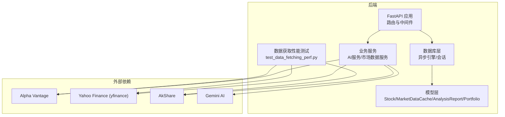
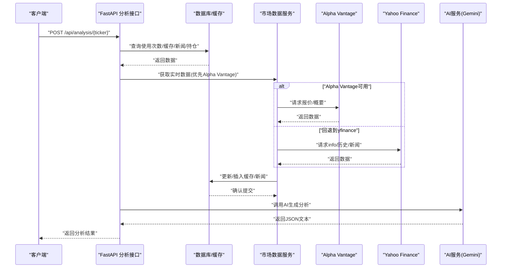
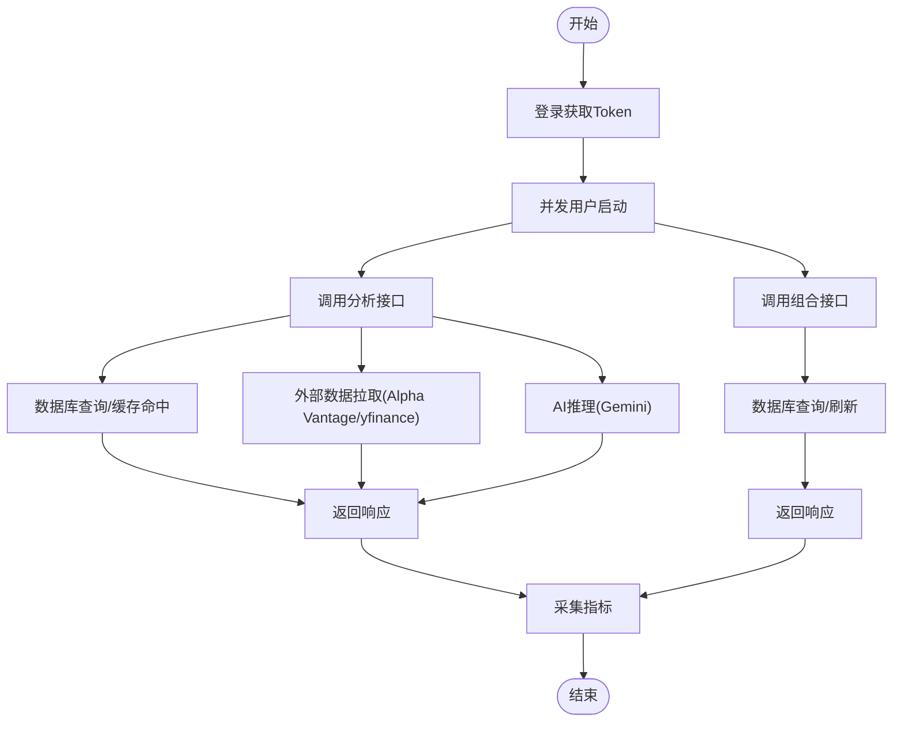
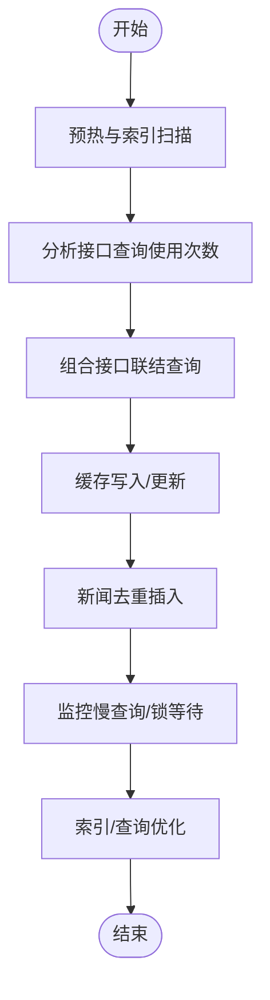
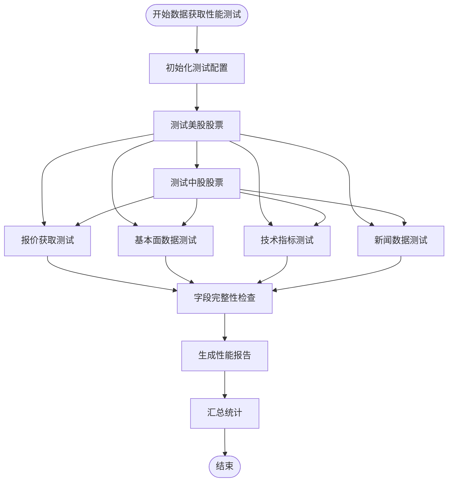
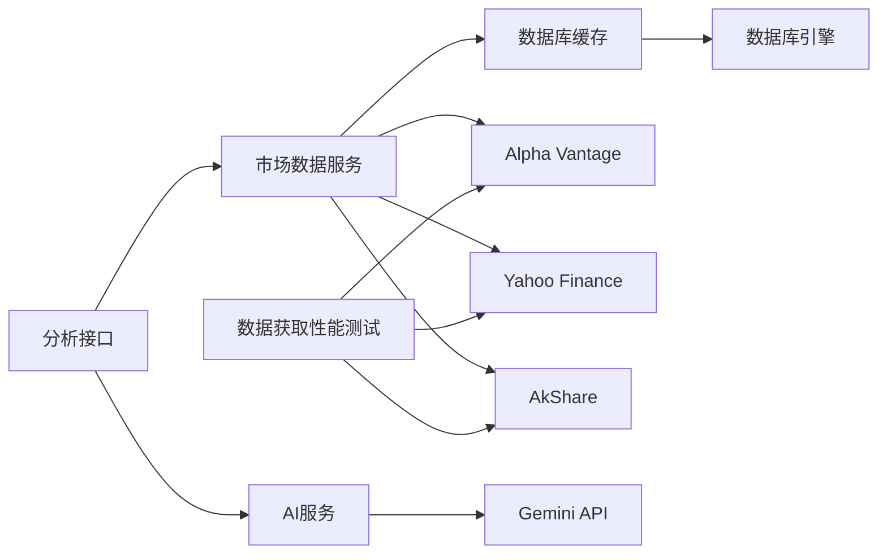

# 性能测试

<cite>
**本文引用的文件**
- [backend/app/main.py](file://backend/app/main.py)
- [backend/app/core/database.py](file://backend/app/core/database.py)
- [backend/app/core/config.py](file://backend/app/core/config.py)
- [backend/app/api/analysis.py](file://backend/app/api/analysis.py)
- [backend/app/api/portfolio.py](file://backend/app/api/portfolio.py)
- [backend/app/api/auth.py](file://backend/app/api/auth.py)
- [backend/app/services/ai_service.py](file://backend/app/services/ai_service.py)
- [backend/app/services/market_data.py](file://backend/app/services/market_data.py)
- [backend/app/models/stock.py](file://backend/app/models/stock.py)
- [backend/app/models/analysis.py](file://backend/app/models/analysis.py)
- [backend/app/models/portfolio.py](file://backend/app/models/portfolio.py)
- [backend/app/core/security.py](file://backend/app/core/security.py)
- [backend/requirements.txt](file://backend/requirements.txt)
- [README.md](file://README.md)
- [backend/scripts/test_data_fetching_perf.py](file://backend/scripts/test_data_fetching_perf.py)
- [backend/app/services/market_providers/factory.py](file://backend/app/services/market_providers/factory.py)
- [backend/app/schemas/market_data.py](file://backend/app/schemas/market_data.py)
- [backend/app/services/market_providers/akshare.py](file://backend/app/services/market_providers/akshare.py)
- [backend/app/services/market_providers/yfinance.py](file://backend/app/services/market_providers/yfinance.py)
- [backend/tests/test_market_data.py](file://backend/tests/test_market_data.py)
- [backend/tests/test_yf.py](file://backend/tests/test_yf.py)
</cite>

## 目录
1. [简介](#简介)
2. [项目结构](#项目结构)
3. [核心组件](#核心组件)
4. [架构总览](#架构总览)
5. [详细组件分析](#详细组件分析)
6. [依赖分析](#依赖分析)
7. [性能考虑](#性能考虑)
8. [故障排查指南](#故障排查指南)
9. [结论](#结论)
10. [附录](#附录)

## 简介
本文件面向性能测试，围绕该AI股票顾问系统的后端（FastAPI + SQLAlchemy异步 + 数据缓存 + 外部数据源）制定系统化的测试策略与方法论，覆盖以下方面：
- 测试目标与方法论：负载测试、压力测试、稳定性测试
- API性能测试：响应时间测量、吞吐量测试、并发用户模拟
- 数据库性能测试：查询优化测试、索引效果验证、连接池性能评估
- **新增**：数据获取性能基准测试：系统化评估外部数据源的性能表现
- 内存与CPU监控：进程级资源使用观测与热点定位
- 网络延迟与带宽限制下的系统表现评估
- 性能基线建立与回归测试策略
- 工具使用建议：locust、JMeter等
- 性能优化建议与瓶颈识别方法

## 项目结构
后端采用FastAPI框架，通过异步数据库引擎访问SQLite或PostgreSQL；核心业务围绕"用户认证""组合管理""股票分析"展开，数据流以"外部数据源 → 缓存表 → AI服务 → 返回结果"的链路为主。

**更新** 新增数据获取性能测试脚本，提供系统化的外部数据源性能基准测试能力

图表来源
- [backend/app/main.py](file://backend/app/main.py#L1-L38)
- [backend/app/core/database.py](file://backend/app/core/database.py#L1-L24)
- [backend/app/services/market_data.py](file://backend/app/services/market_data.py#L1-L370)
- [backend/app/services/ai_service.py](file://backend/app/services/ai_service.py#L1-L112)
- [backend/app/models/stock.py](file://backend/app/models/stock.py#L1-L85)
- [backend/scripts/test_data_fetching_perf.py](file://backend/scripts/test_data_fetching_perf.py#L1-L135)

章节来源
- [README.md](file://README.md#L1-L50)
- [backend/app/main.py](file://backend/app/main.py#L1-L38)
- [backend/requirements.txt](file://backend/requirements.txt#L1-L75)
- [backend/scripts/test_data_fetching_perf.py](file://backend/scripts/test_data_fetching_perf.py#L1-L135)

## 核心组件
- 应用入口与路由：定义CORS、健康检查、根路径以及各模块路由挂载
- 数据库与会话：异步SQLAlchemy引擎、AsyncSession工厂、依赖注入
- 配置中心：数据库URL、API密钥、代理、加密密钥等
- 认证与安全：JWT令牌签发、密码哈希、API Key加解密
- 组合与分析API：组合查询、新增/删除、搜索；股票分析聚合多源数据并调用AI
- 市场数据服务：缓存命中优先、多源回退、指数计算、新闻入库
- AI服务：Gemini模型调用、提示工程、错误降级
- **新增**：数据获取性能测试：系统化评估外部数据源的性能表现与数据完整性

**更新** 新增数据获取性能测试组件，提供针对外部数据源的基准测试能力

章节来源
- [backend/app/main.py](file://backend/app/main.py#L1-L38)
- [backend/app/core/database.py](file://backend/app/core/database.py#L1-L24)
- [backend/app/core/config.py](file://backend/app/core/config.py#L1-L25)
- [backend/app/core/security.py](file://backend/app/core/security.py#L1-L46)
- [backend/app/api/portfolio.py](file://backend/app/api/portfolio.py#L1-L297)
- [backend/app/api/analysis.py](file://backend/app/api/analysis.py#L1-L128)
- [backend/app/services/market_data.py](file://backend/app/services/market_data.py#L1-L370)
- [backend/app/services/ai_service.py](file://backend/app/services/ai_service.py#L1-L112)
- [backend/app/models/stock.py](file://backend/app/models/stock.py#L1-L85)
- [backend/app/models/analysis.py](file://backend/app/models/analysis.py#L1-L25)
- [backend/app/models/portfolio.py](file://backend/app/models/portfolio.py#L1-L26)
- [backend/scripts/test_data_fetching_perf.py](file://backend/scripts/test_data_fetching_perf.py#L1-L135)

## 架构总览
下图展示一次"股票分析"请求在系统中的典型调用序列，涵盖数据库读写、外部数据拉取、AI推理与返回。

**更新** 架构图保持不变，但增加了数据获取性能测试的监控维度

图表来源
- [backend/app/api/analysis.py](file://backend/app/api/analysis.py#L14-L128)
- [backend/app/services/market_data.py](file://backend/app/services/market_data.py#L14-L170)
- [backend/app/services/ai_service.py](file://backend/app/services/ai_service.py#L42-L112)
- [backend/app/models/stock.py](file://backend/app/models/stock.py#L33-L85)

## 详细组件分析

### 组件A：API性能测试策略
- 目标：评估分析接口、组合接口、认证接口在不同并发下的响应时间、吞吐量与错误率
- 关键路径：
  - 分析接口：鉴权 → 限流检查 → 数据库查询 → 市场数据拉取 → AI推理 → 返回
  - 组合接口：鉴权 → 数据库查询 → 可选刷新 → 技术指标拼装 → 返回
  - 认证接口：鉴权 → 密码校验 → JWT签发
- 并发模拟建议：
  - 逐步提升并发用户数（如10→50→100），观察P50/P95/P99响应时间与错误率
  - 覆盖峰值场景：同时触发分析与组合刷新
- 指标采集：
  - 响应时间分布、吞吐量（req/sec）、错误率、数据库慢查询日志
- 工具建议：
  - locust：脚本化并发用户、自定义事务、输出CSV便于回归对比
  - JMeter：录制/参数化、聚合报告、与InfluxDB/Grafana联动

**更新** 图表保持不变，但外部数据拉取环节现在可以通过数据获取性能测试脚本进行更细粒度的监控

图表来源
- [backend/app/api/analysis.py](file://backend/app/api/analysis.py#L14-L128)
- [backend/app/api/portfolio.py](file://backend/app/api/portfolio.py#L143-L224)
- [backend/app/api/auth.py](file://backend/app/api/auth.py#L24-L50)
- [backend/app/services/market_data.py](file://backend/app/services/market_data.py#L14-L170)
- [backend/app/services/ai_service.py](file://backend/app/services/ai_service.py#L42-L112)

章节来源
- [backend/app/api/analysis.py](file://backend/app/api/analysis.py#L14-L128)
- [backend/app/api/portfolio.py](file://backend/app/api/portfolio.py#L143-L224)
- [backend/app/api/auth.py](file://backend/app/api/auth.py#L24-L50)

### 组件B：数据库性能测试
- 测试目标：
  - 查询优化：分析接口的多表联结、条件过滤、分页/限制
  - 索引效果：last_updated、ticker、user_id等字段的索引命中
  - 连接池性能：并发事务、长事务、连接泄漏检测
- 关键查询与优化点：
  - 分析接口：统计当日使用次数、查询新闻、查询持仓、AI报告写入
  - 组合接口：多表联结获取缓存与基础信息；刷新时顺序更新避免并发冲突
  - 市场数据：缓存表写入/更新、新闻去重插入
- 建议测试步骤：
  - 基线：单用户稳定负载下的慢查询日志与执行计划
  - 负载：逐步增加并发，记录P95/P99与锁等待
  - 压力：外部数据源限流/超时，观察缓存回退与降级
- 指标：
  - QPS、慢查询数、锁等待、连接池活跃/空闲数、事务回滚率

**更新** 图表保持不变，但监控环节现在可以结合数据获取性能测试的结果进行综合评估

图表来源
- [backend/app/api/analysis.py](file://backend/app/api/analysis.py#L36-L51)
- [backend/app/api/portfolio.py](file://backend/app/api/portfolio.py#L151-L174)
- [backend/app/models/stock.py](file://backend/app/models/stock.py#L33-L85)

章节来源
- [backend/app/api/analysis.py](file://backend/app/api/analysis.py#L36-L51)
- [backend/app/api/portfolio.py](file://backend/app/api/portfolio.py#L151-L174)
- [backend/app/models/stock.py](file://backend/app/models/stock.py#L33-L85)

### 组件C：数据获取性能基准测试
**新增** 专门针对外部数据源的数据获取性能测试能力

- 测试目标：
  - 评估AkShare、Yahoo Finance等外部数据源的响应时间与可靠性
  - 验证数据完整性：报价、基本面、技术指标、新闻数据的字段完整性
  - 比较不同数据源在同一股票上的性能差异
  - 验证缓存机制的有效性与性能影响
- 关键测试维度：
  - **报价获取**：实时价格、涨跌幅、公司名称获取时间与准确性
  - **基本面数据**：行业、市值、市盈率、EPS等财务指标获取
  - **技术指标**：RSI、MACD、布林带、ATR等指标计算与返回
  - **新闻数据**：新闻标题、发布者、链接、发布时间获取
- 测试范围：
  - 美股股票：AAPL、TSLA、AMD
  - 中股股票：002050、600519、002970
- 指标采集：
  - 各项操作的执行时间（秒）
  - 成功/失败状态
  - 缺失字段列表
  - 总体执行时间估算
- 输出格式：
  - 控制台表格显示各股票在不同数据源上的性能对比
  - 详细的日志记录每个测试步骤的结果

**更新** 新增专门的数据获取性能基准测试组件，提供系统化的外部数据源性能评估

图表来源
- [backend/scripts/test_data_fetching_perf.py](file://backend/scripts/test_data_fetching_perf.py#L36-L106)
- [backend/app/services/market_providers/factory.py](file://backend/app/services/market_providers/factory.py#L16-L21)
- [backend/app/schemas/market_data.py](file://backend/app/schemas/market_data.py#L12-L48)

章节来源
- [backend/scripts/test_data_fetching_perf.py](file://backend/scripts/test_data_fetching_perf.py#L1-L135)
- [backend/app/services/market_providers/factory.py](file://backend/app/services/market_providers/factory.py#L1-L39)
- [backend/app/schemas/market_data.py](file://backend/app/schemas/market_data.py#L1-L65)

### 组件D：内存使用与CPU占用监控
- 监控维度：
  - 进程内存RSS/堆内分配、GC频率与停顿
  - CPU用户态/系统态占比、上下文切换
  - 外部调用耗时（网络I/O）
- 观测手段：
  - uvicorn进程+gunicorn多worker模式下的资源分布
  - 使用pprof/Py-Spy采样热点函数
  - Prometheus+Grafana采集CPU/内存/网络/数据库指标
- 关注点：
  - yfinance/pandas计算密集路径
  - 异步事件循环阻塞风险
  - 大批量新闻入库的内存峰值

**更新** 监控维度保持不变，但数据获取性能测试脚本的执行也会产生相应的内存和CPU使用情况

章节来源
- [backend/app/services/market_data.py](file://backend/app/services/market_data.py#L173-L318)
- [backend/app/services/ai_service.py](file://backend/app/services/ai_service.py#L42-L112)

### 组件E：网络延迟与带宽限制下的表现
- 场景设计：
  - Alpha Vantage/yfinance限流/超时
  - 代理环境下的延迟与丢包
  - 本地缓存命中与回退路径的切换
- 测试方法：
  - 通过设置HTTP_PROXY与超时阈值模拟弱网
  - 逐步降低外部接口超时，观察缓存回退与降级策略
- 指标：
  - 外部请求成功率、平均/分位响应时间、缓存命中率

**更新** 网络延迟测试场景现在可以结合数据获取性能测试脚本进行更全面的评估

章节来源
- [backend/app/services/market_data.py](file://backend/app/services/market_data.py#L25-L57)
- [backend/app/core/config.py](file://backend/app/core/config.py#L18-L18)

### 组件F：性能基线与回归测试
- 基线建立：
  - 在稳定环境（开发/预生产）运行标准测试集，记录P50/P95/P99、吞吐量、错误率
  - 对关键接口建立"单用户稳定负载"与"并发峰值"两套基线
  - **新增**：数据获取性能测试基线：记录各外部数据源的基准响应时间与成功率
- 回归策略：
  - CI中加入性能回归检查：若P95响应时间或错误率超过阈值则告警
  - 对比不同版本的性能报告，定位回归点
  - **新增**：定期运行数据获取性能测试，监控外部数据源性能变化趋势
- 监控指标：
  - API接口响应时间分布
  - 外部数据源获取时间与成功率
  - 缓存命中率变化
  - 错误率与降级策略有效性

**更新** 性能基线与回归测试策略现在包含了数据获取性能测试的监控维度

章节来源
- [backend/app/api/analysis.py](file://backend/app/api/analysis.py#L14-L128)
- [backend/app/api/portfolio.py](file://backend/app/api/portfolio.py#L143-L224)
- [backend/scripts/test_data_fetching_perf.py](file://backend/scripts/test_data_fetching_perf.py#L108-L135)

## 依赖分析
- 外部依赖：
  - 数据源：Alpha Vantage、Yahoo Finance（yfinance）、AkShare
  - 推理：Google Generative AI（Gemini）
  - 存储：SQLite（默认）或PostgreSQL（通过环境变量切换）
- 内部耦合：
  - 分析接口依赖市场数据服务与AI服务；市场数据服务依赖数据库缓存；AI服务依赖配置中心与外部API Key
  - **新增**：数据获取性能测试脚本依赖市场数据提供者工厂与各种数据源实现
- 潜在风险：
  - 外部API限流导致整体延迟上升
  - 缓存失效与重建引发抖动
  - 数据库写入竞争（组合刷新）
  - **新增**：外部数据源性能波动影响整体系统性能

**更新** 依赖关系现在包含了数据获取性能测试脚本的依赖关系

图表来源
- [backend/app/api/analysis.py](file://backend/app/api/analysis.py#L14-L128)
- [backend/app/services/market_data.py](file://backend/app/services/market_data.py#L14-L170)
- [backend/app/services/ai_service.py](file://backend/app/services/ai_service.py#L42-L112)
- [backend/app/core/database.py](file://backend/app/core/database.py#L1-L24)
- [backend/scripts/test_data_fetching_perf.py](file://backend/scripts/test_data_fetching_perf.py#L13-L15)

章节来源
- [backend/app/requirements.txt](file://backend/requirements.txt#L1-L75)
- [backend/app/core/config.py](file://backend/app/core/config.py#L6-L6)
- [backend/app/services/market_providers/factory.py](file://backend/app/services/market_providers/factory.py#L1-L39)

## 性能考虑
- 异步与并发：
  - 使用异步数据库引擎与会话，减少阻塞
  - 控制外部调用超时与重试，避免事件循环被长时间IO阻塞
- 缓存策略：
  - 1分钟内缓存有效，优先返回缓存；外部失败时半衰落回退
  - 新闻按UUID去重插入，避免重复写入
  - **新增**：数据获取性能测试脚本内置缓存机制，减少重复请求
- 数据库优化：
  - 对常用查询字段建立索引（如last_updated、ticker、user_id）
  - 批量/顺序更新避免并发写冲突
- 外部依赖：
  - 优先Alpha Vantage，失败回退yfinance；必要时启用代理
  - 对于高并发场景，建议引入外部消息队列异步处理AI请求
  - **新增**：AkShare作为主要数据源，针对国内网络环境进行了代理绕过优化

**更新** 性能考虑现在包含了数据获取性能测试脚本的相关优化策略

章节来源
- [backend/app/services/market_data.py](file://backend/app/services/market_data.py#L14-L170)
- [backend/app/models/stock.py](file://backend/app/models/stock.py#L33-L85)
- [backend/app/api/portfolio.py](file://backend/app/api/portfolio.py#L162-L174)
- [backend/app/services/market_providers/akshare.py](file://backend/app/services/market_providers/akshare.py#L42-L55)
- [backend/app/services/market_providers/factory.py](file://backend/app/services/market_providers/factory.py#L18-L21)

## 故障排查指南
- 常见问题与定位：
  - 外部API限流/超时：查看市场数据服务的日志与异常分支
  - 缓存未命中：检查last_updated与缓存表结构
  - AI推理失败：确认Gemini API Key配置与降级逻辑
  - 认证失败：核对JWT签名算法与密钥配置
  - **新增**：数据获取性能测试失败：检查各外部数据源的可用性与网络连接
- 建议手段：
  - 开启数据库echo与外部调用日志
  - 使用轻量APM（如py-spy）采样定位CPU热点
  - Grafana仪表盘监控关键指标
  - **新增**：运行数据获取性能测试脚本，快速定位数据源问题

**更新** 故障排查指南现在包含了数据获取性能测试相关的故障排查方法

章节来源
- [backend/app/services/market_data.py](file://backend/app/services/market_data.py#L30-L56)
- [backend/app/services/ai_service.py](file://backend/app/services/ai_service.py#L103-L111)
- [backend/app/core/security.py](file://backend/app/core/security.py#L31-L39)
- [backend/app/core/config.py](file://backend/app/core/config.py#L14-L18)
- [backend/scripts/test_data_fetching_perf.py](file://backend/scripts/test_data_fetching_perf.py#L17-L19)

## 结论
本项目的性能瓶颈主要集中在外部数据源的可用性与延迟、AI推理的时延、以及数据库写入与外部API限流的交互。**新增的数据获取性能测试脚本提供了系统化的外部数据源性能基准测试能力，能够帮助我们更好地监控和优化数据获取环节的性能表现。**通过建立基线、持续回归与针对性优化（缓存、索引、异步化、限流与降级），并在CI中集成数据获取性能测试，可在保证功能正确性的前提下显著提升系统在高并发下的稳定性与吞吐能力。

**更新** 结论现在包含了数据获取性能测试脚本的重要作用和价值

## 附录
- 工具与实践建议：
  - locust：编写脚本模拟分析/组合/认证场景，输出CSV进行对比
  - JMeter：录制真实用户行为，配合InfluxDB/Grafana可视化
  - Prometheus/Grafana：采集CPU/内存/网络/数据库指标
  - Py-Spy/pprof：采样Python/CPU热点，定位性能瓶颈
  - **新增**：数据获取性能测试脚本：定期运行以监控外部数据源性能
- 基准测试清单：
  - 单用户稳定负载：P50/P95响应时间、错误率
  - 并发峰值：P95/P99响应时间、吞吐量、错误率
  - 外部限流/超时：缓存回退成功率、降级表现
  - 数据库：慢查询数、锁等待、连接池利用率
  - **新增**：外部数据源性能基准：报价获取时间、数据完整性、缓存命中率
- **新增**：数据获取性能测试使用指南：
  - 运行命令：`python backend/scripts/test_data_fetching_perf.py`
  - 测试范围：美股（AAPL、TSLA、AMD）和中股（002050、600519、002970）
  - 输出格式：控制台表格显示各股票在不同数据源上的性能对比
  - 日志级别：INFO级别，可查看详细的测试过程和结果

**更新** 附录现在包含了数据获取性能测试脚本的使用指南和相关工具建议