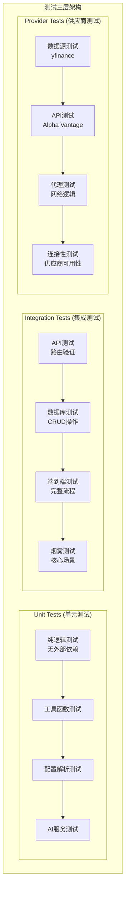
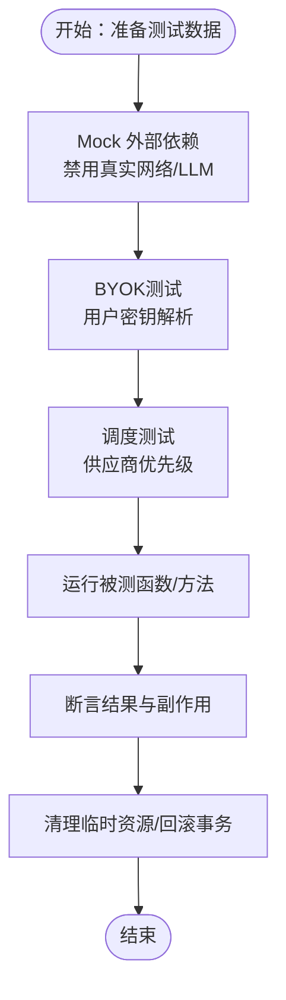
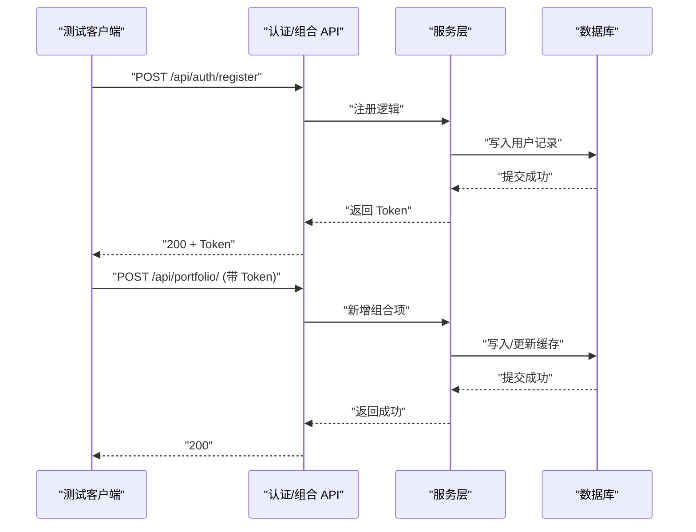
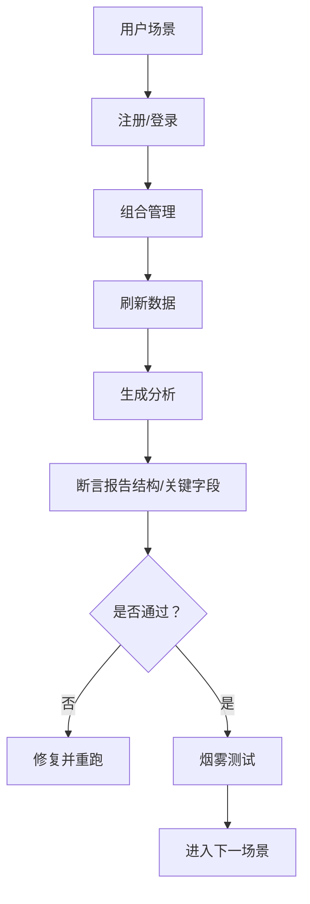
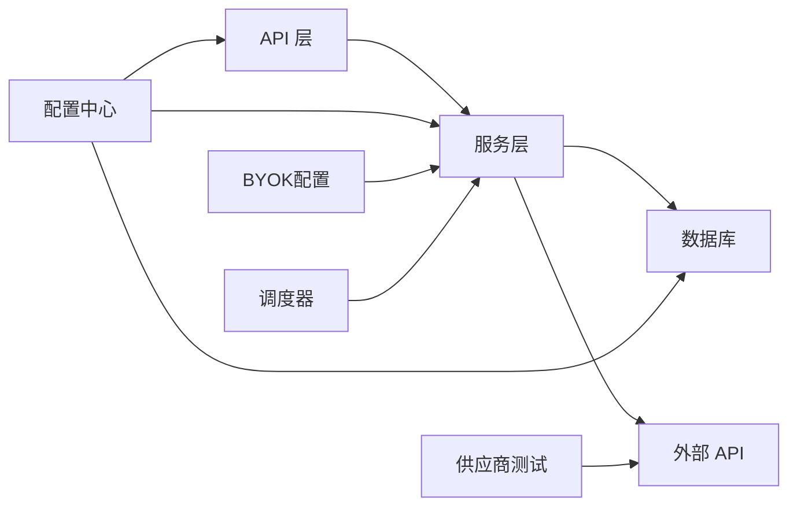

# 测试策略

<cite>
**本文引用的文件**
- [backend/app/main.py](file://backend/app/main.py)
- [backend/app/api/auth.py](file://backend/app/api/auth.py)
- [backend/app/api/portfolio.py](file://backend/app/api/portfolio.py)
- [backend/app/services/ai_service.py](file://backend/app/services/ai_service.py)
- [backend/app/services/market_data.py](file://backend/app/services/market_data.py)
- [backend/app/core/config.py](file://backend/app/core/config.py)
- [backend/app/core/database.py](file://backend/app/core/database.py)
- [backend/app/models/user.py](file://backend/app/models/user.py)
- [backend/app/models/provider_config.py](file://backend/app/models/provider_config.py)
- [backend/app/models/ai_config.py](file://backend/app/models/ai_config.py)
- [backend/tests/unit/test_byok_dispatch.py](file://backend/tests/unit/test_byok_dispatch.py)
- [backend/tests/unit/test_indicators.py](file://backend/tests/unit/test_indicators.py)
- [backend/tests/unit/test_sanitize.py](file://backend/tests/unit/test_sanitize.py)
- [backend/tests/integration/test_api.py](file://backend/tests/integration/test_api.py)
- [backend/tests/integration/test_auth.py](file://backend/tests/integration/test_auth.py)
- [backend/tests/integration/test_market_data.py](file://backend/tests/integration/test_market_data.py)
- [backend/tests/integration/test_phase1_smoke.py](file://backend/tests/integration/test_phase1_smoke.py)
- [backend/tests/integration/test_api_resilience.py](file://backend/tests/integration/test_api_resilience.py)
- [backend/tests/integration/test_feishu_notifications.py](file://backend/tests/integration/test_feishu_notifications.py)
- [backend/tests/integration/test_fix_verification.py](file://backend/tests/integration/test_fix_verification.py)
- [backend/tests/integration/test_jsonable.py](file://backend/tests/integration/test_jsonable.py)
- [backend/tests/integration/test_nan.py](file://backend/tests/integration/test_nan.py)
- [backend/tests/integration/test_snapshot.py](file://backend/tests/integration/test_snapshot.py)
- [backend/tests/integration/test_validation.py](file://backend/tests/integration/test_validation.py)
- [backend/tests/integration/test_validation_all.py](file://backend/tests/integration/test_validation_all.py)
- [backend/tests/provider/test_yfinance_basic.py](file://backend/tests/provider/test_yfinance_basic.py)
- [backend/tests/provider/test_alpha_vantage.py](file://backend/tests/provider/test_alpha_vantage.py)
- [backend/tests/provider/test_yfinance_ashare.py](file://backend/tests/provider/test_yfinance_ashare.py)
- [backend/tests/provider/test_yfinance_proxy.py](file://backend/tests/provider/test_yfinance_proxy.py)
- [backend/tests/provider/test_yfinance_robust.py](file://backend/tests/provider/test_yfinance_robust.py)
- [backend/tests/provider/test_yfinance_simple.py](file://backend/tests/provider/test_yfinance_simple.py)
- [backend/tests/provider/test_yfinance_sndk.py](file://backend/tests/provider/test_yfinance_sndk.py)
- [backend/tests/provider/test_yfinance_fast.py](file://backend/tests/provider/test_yfinance_fast.py)
- [backend/tests/provider/test_alpha_vantage_proxy.py](file://backend/tests/provider/test_alpha_vantage_proxy.py)
- [backend/tests/provider/test_alpha_vantage_v2.py](file://backend/tests/provider/test_alpha_vantage_v2.py)
- [backend/tests/provider/test_ashare_direct.py](file://backend/tests/provider/test_ashare_direct.py)
- [backend/tests/provider/test_us_direct.py](file://backend/tests/provider/test_us_direct.py)
- [backend/tests/provider/test_us_no_proxy.py](file://backend/tests/provider/test_us_no_proxy.py)
- [backend/tests/provider/test_vpn_yfinance.py](file://backend/tests/provider/test_vpn_yfinance.py)
- [backend/tests/provider/test_siliconflow.py](file://backend/tests/provider/test_siliconflow.py)
- [backend/tests/provider/test_ibkr.py](file://backend/tests/provider/test_ibkr.py)
- [backend/tests/provider/test_macro_fundamental.py](file://backend/tests/provider/test_macro_fundamental.py)
- [backend/tests/provider/test_proxy_logic.py](file://backend/tests/provider/test_proxy_logic.py)
- [backend/tests/provider/test_akshare_a.py](file://backend/tests/provider/test_akshare_a.py)
- [backend/tests/README.md](file://backend/tests/README.md)
- [backend/tests/conftest.py](file://backend/tests/conftest.py)
- [backend/pytest.ini](file://backend/pytest.ini)
</cite>

## 更新摘要
**变更内容**
- 新增三层测试分类体系：unit、integration、provider
- 引入智能测试过滤器，自动为测试文件添加标记
- 更新测试组织结构，按功能域重新分类测试文件
- 增强测试环境隔离策略，支持网络依赖的测试
- 完善BYOK和供应商调度测试覆盖

## 目录
1. [引言](#引言)
2. [测试组织架构](#测试组织架构)
3. [核心测试分类](#核心测试分类)
4. [智能测试过滤器](#智能测试过滤器)
5. [测试环境与隔离策略](#测试环境与隔离策略)
6. [单元测试设计与实现](#单元测试设计与实现)
7. [集成测试策略](#集成测试策略)
8. [供应商测试策略](#供应商测试策略)
9. [端到端测试流程](#端到端测试流程)
10. [测试覆盖率与质量标准](#测试覆盖率与质量标准)
11. [测试工具与框架使用指南](#测试工具与框架使用指南)
12. [持续集成中的测试自动化](#持续集成中的测试自动化)
13. [性能测试与压力测试](#性能测试与压力测试)
14. [缺陷跟踪与测试报告](#缺陷跟踪与测试报告)
15. [依赖分析](#依赖分析)
16. [性能考虑](#性能考虑)
17. [故障排查指南](#故障排查指南)
18. [结论](#结论)
19. [附录](#附录)

## 引言
本测试策略文档面向"AI股票顾问"项目，系统化阐述基于三层测试分类体系的测试实施方法。项目现已重构为unit、integration、provider三层测试架构，配合智能测试过滤器实现高效的测试组织和执行。文档涵盖单元测试、集成测试、供应商测试的详细设计原则和实现方法，包括Mock对象使用、测试数据准备、端到端测试流程、测试覆盖率要求、质量标准、测试工具使用指南、持续集成自动化配置、性能测试、压力测试、测试数据管理与环境隔离策略，以及缺陷跟踪和测试报告生成流程。

## 测试组织架构
项目采用三层测试分类体系，每层都有明确的职责和测试范围：

**图表来源**
- [backend/tests/README.md:3-7](file://backend/tests/README.md#L3-L7)
- [backend/tests/conftest.py:27-39](file://backend/tests/conftest.py#L27-L39)

## 核心测试分类

### Unit Tests (单元测试)
专注于纯逻辑测试，无外部依赖，测试范围包括：
- 工具函数和算法逻辑
- 配置解析和验证
- AI服务的核心功能
- 技术指标计算
- 数据清洗和验证

**章节来源**
- [backend/tests/unit/test_byok_dispatch.py:1-99](file://backend/tests/unit/test_byok_dispatch.py#L1-L99)
- [backend/tests/unit/test_indicators.py:1-70](file://backend/tests/unit/test_indicators.py#L1-L70)
- [backend/tests/unit/test_sanitize.py](file://backend/tests/unit/test_sanitize.py)

### Integration Tests (集成测试)
验证API、数据库和业务流程的集成，包括：
- 认证和授权流程
- 组合管理操作
- 分析服务调用
- 端到端业务场景
- 错误处理和异常情况

**章节来源**
- [backend/tests/integration/test_api.py:1-52](file://backend/tests/integration/test_api.py#L1-L52)
- [backend/tests/integration/test_auth.py](file://backend/tests/integration/test_auth.py)
- [backend/tests/integration/test_market_data.py](file://backend/tests/integration/test_market_data.py)
- [backend/tests/integration/test_phase1_smoke.py:1-698](file://backend/tests/integration/test_phase1_smoke.py#L1-L698)

### Provider Tests (供应商测试)
专门测试市场数据供应商的连接性和行为，包括：
- yfinance数据获取
- Alpha Vantage API调用
- 代理和网络逻辑测试
- 供应商连接性验证
- 多地区数据源测试

**章节来源**
- [backend/tests/provider/test_yfinance_basic.py:1-23](file://backend/tests/provider/test_yfinance_basic.py#L1-L23)
- [backend/tests/provider/test_alpha_vantage.py:1-57](file://backend/tests/provider/test_alpha_vantage.py#L1-L57)
- [backend/tests/provider/test_yfinance_ashare.py](file://backend/tests/provider/test_yfinance_ashare.py)
- [backend/tests/provider/test_yfinance_proxy.py](file://backend/tests/provider/test_yfinance_proxy.py)

## 智能测试过滤器
项目通过conftest.py实现了智能测试过滤器，自动为不同目录的测试文件添加相应的标记：

### 自动标记机制
- `tests/unit/**` 自动添加 `@pytest.mark.unit`
- `tests/integration/**` 自动添加 `@pytest.mark.integration`  
- `tests/provider/**` 自动添加 `@pytest.mark.provider`

### 条件过滤机制
- 默认忽略provider测试，避免CI中网络不稳定的影响
- 通过环境变量 `RUN_PROVIDER_NETWORK_TESTS=1` 启用供应商测试

**章节来源**
- [backend/tests/conftest.py:19-39](file://backend/tests/conftest.py#L19-L39)
- [backend/pytest.ini:4-7](file://backend/pytest.ini#L4-L7)

## 测试环境与隔离策略

### 环境变量配置
- `RUN_PROVIDER_NETWORK_TESTS`: 控制供应商测试的启用/禁用
- 支持本地开发和CI环境的不同配置需求

### 测试数据库策略
- 使用独立的测试数据库实例
- 支持内存数据库和文件数据库
- 每个测试进程隔离，避免数据污染

### Mock策略
- 外部API调用全部Mock
- 时间相关的测试使用可控的时间偏移
- 供应商特定的Mock配置

**章节来源**
- [backend/tests/conftest.py:11-16](file://backend/tests/conftest.py#L11-L16)
- [backend/tests/integration/test_phase1_smoke.py:29-46](file://backend/tests/integration/test_phase1_smoke.py#L29-L46)

## 单元测试设计与实现

### 设计原则
- **隔离性**：完全隔离外部依赖，使用Mock替换所有外部服务
- **可重复性**：固定随机种子，使用可控输入数据
- **边界覆盖**：测试空输入、错误码、异常分支、超时和重试场景
- **性能测试**：包含BYOK和供应商调度的性能测试

### 实现要点
- **服务类测试**：对MarketDataService、AIService进行方法级测试
- **工具函数测试**：对数据转换、缓存更新逻辑进行纯函数测试
- **配置测试**：通过环境变量或临时配置对象注入
- **AI服务测试**：测试BYOK解析器、供应商调度器、连接测试器

### 测试数据准备
- 构造最小化模型实例与数据库记录
- 使用内存数据库或临时数据库文件
- Mock用户配置：测试不同类型的用户配置

**章节来源**
- [backend/tests/unit/test_byok_dispatch.py:10-99](file://backend/tests/unit/test_byok_dispatch.py#L10-L99)
- [backend/tests/unit/test_indicators.py:6-70](file://backend/tests/unit/test_indicators.py#L6-L70)

## 集成测试策略

### API测试
- 使用FastAPI TestClient或AsyncClient访问路由
- 关键场景：登录/注册成功与失败、携带Token访问受保护路由
- 断言：状态码、响应结构、错误消息

### 数据库测试
- 在测试环境中使用独立数据库连接
- 执行插入/查询/更新，断言缓存与指标字段
- 验证MarketDataService的缓存命中、过期与回退逻辑

### 端到端场景
- 从注册登录到添加组合、刷新数据、查看分析报告的完整链路
- 使用Mock保证外部服务不可用时仍可验证业务流程
- 烟雾测试提供完整的端到端验证

**图表来源**
- [backend/tests/integration/test_api.py:15-39](file://backend/tests/integration/test_api.py#L15-L39)
- [backend/tests/integration/test_phase1_smoke.py:74-104](file://backend/tests/integration/test_phase1_smoke.py#L74-L104)

**章节来源**
- [backend/tests/integration/test_api.py:1-52](file://backend/tests/integration/test_api.py#L1-L52)
- [backend/tests/integration/test_auth.py](file://backend/tests/integration/test_auth.py)
- [backend/tests/integration/test_market_data.py](file://backend/tests/integration/test_market_data.py)
- [backend/tests/integration/test_phase1_smoke.py:1-698](file://backend/tests/integration/test_phase1_smoke.py#L1-L698)

## 供应商测试策略

### 数据源测试
- **yfinance测试**：测试股票数据获取、历史数据、公司信息
- **Alpha Vantage测试**：测试API调用、数据格式、错误处理
- **多地区支持**：测试A股、美股、代理逻辑

### 连接性测试
- 供应商可用性检测
- 网络代理配置测试
- 连接超时和重试机制验证

### 测试执行策略
- 默认禁用，避免CI中的网络不稳定
- 通过环境变量启用供应商测试
- 支持本地开发环境的完整测试

**章节来源**
- [backend/tests/provider/test_yfinance_basic.py:1-23](file://backend/tests/provider/test_yfinance_basic.py#L1-L23)
- [backend/tests/provider/test_alpha_vantage.py:14-57](file://backend/tests/provider/test_alpha_vantage.py#L14-L57)
- [backend/tests/README.md:17-32](file://backend/tests/README.md#L17-L32)

## 端到端测试流程

### 用户场景测试
- 新用户注册 → 登录 → 查看组合 → 添加/删除股票 → 刷新数据 → 获取分析
- 场景拆分：正常流程、异常输入、网络中断、外部API限流
- 烟雾测试：完整的端到端验证，包含用户配置、连接测试、分析生成、组合管理

### 回归测试
- 每次变更后运行核心场景集，确保关键路径不被破坏
- 使用快照或结构化断言保存期望输出
- 烟雾测试提供完整的业务流程验证

**章节来源**
- [backend/tests/integration/test_phase1_smoke.py:106-132](file://backend/tests/integration/test_phase1_smoke.py#L106-L132)
- [backend/tests/integration/test_phase1_smoke.py:134-226](file://backend/tests/integration/test_phase1_smoke.py#L134-L226)

## 测试覆盖率与质量标准

### 覆盖率目标
- **服务层方法覆盖率**：≥ 80%，关键分支 ≥ 90%
- **API层路由与异常处理路径**：全覆盖
- **BYOK和调度功能覆盖率**：≥ 75%
- **烟雾测试场景覆盖率**：100%
- **供应商测试覆盖率**：根据网络可用性动态调整

### 质量标准
- 所有断言必须明确、可定位；失败日志包含上下文与输入
- 禁止在测试中使用真实外部密钥；必须使用Mock或占位符
- 测试命名清晰表达意图与前置条件
- BYOK测试包含正向和负向场景，确保健壮性

## 测试工具与框架使用指南

### pytest配置
- **优点**：夹具、参数化、插件生态丰富；推荐用于单元与集成测试
- **建议**：使用fixtures提供数据库会话与Mock配置；使用pytest-asyncio运行异步测试
- **标记系统**：支持unit、integration、provider标记的测试筛选

### unittest支持
- **优点**：无需额外依赖；适合简单场景与回归测试
- **建议**：与pytest并行，逐步迁移复杂场景至pytest

### TestClient高级用法
- 支持依赖注入覆盖
- 支持异步数据库会话
- 支持复杂的Mock策略

**章节来源**
- [backend/pytest.ini:1-8](file://backend/pytest.ini#L1-L8)
- [backend/tests/README.md:15-21](file://backend/tests/README.md#L15-L21)

## 持续集成中的测试自动化

### 触发策略
- **Push/PR触发**：全量单元与集成测试；夜间全量回归测试
- **烟雾测试**：每天夜间运行，确保核心功能完整性
- **供应商测试**：仅在特定条件下运行，避免CI中的网络不稳定

### 环境准备
- 安装依赖、初始化数据库、加载Alembic版本
- 配置测试专用的BYOK和调度环境
- 设置RUN_PROVIDER_NETWORK_TESTS环境变量

### 执行步骤
- 运行pytest（启用覆盖率统计），生成XML报告
- 分别运行unit、integration、provider测试套件
- 上传覆盖率与报告至CI平台
- 根据环境变量决定是否运行供应商测试

### 失败策略
- 任一阶段失败即阻断合并；失败详情与日志保留至少30天
- 供应商测试失败不影响核心测试的合并

**章节来源**
- [backend/tests/README.md:28-32](file://backend/tests/README.md#L28-L32)
- [backend/tests/conftest.py:19-24](file://backend/tests/conftest.py#L19-L24)

## 性能测试与压力测试

### 性能测试
- **单接口吞吐**：针对/api/portfolio/刷新与/api/analysis/{ticker}生成基准
- **资源占用**：CPU、内存、数据库连接数上限
- **BYOK性能**：测试多供应商切换的性能影响
- **供应商性能**：测试不同数据源的响应时间和成功率

### 压力测试
- **并发请求**：模拟多用户同时刷新组合与请求分析
- **外部服务降级**：模拟yfinance/Alpha Vantage限流与失败，验证缓存与回退
- **供应商故障**：模拟多个供应商同时失效的场景
- **网络不稳定**：测试代理和VPN场景下的性能表现

### 工具建议
- **Locust**：负载测试
- **pytest-benchmark**：基准测试
- **pytest-asyncio**：异步测试
- **pytest-profiling**：性能分析

## 缺陷跟踪与测试报告

### 缺陷跟踪
- 将失败用例编号与日志链接纳入缺陷系统；标注优先级与复现步骤
- BYOK相关缺陷分类：密钥解析、供应商调度、连接测试
- 供应商测试缺陷分类：网络连接、API调用、数据格式

### 测试报告
- **pytest-html**：生成HTML报告；pytest-cov输出覆盖率报告
- **CI中归档**：报告与覆盖率，便于审计与趋势分析
- **烟雾测试报告**：包含端到端场景的完整验证结果
- **供应商测试报告**：包含网络连接性和数据准确性报告

**章节来源**
- [backend/tests/README.md:15-21](file://backend/tests/README.md#L15-L21)

## 依赖分析

### 组件耦合
- API层依赖服务层；服务层依赖数据库与外部API；配置中心贯穿全局
- BYOK依赖：用户配置、供应商配置、统一凭据表
- 供应商测试依赖：网络连接、API密钥、数据格式

### 外部依赖
- yfinance、Alpha Vantage、Gemini；均需通过Mock或代理配置隔离
- 多供应商支持：SiliconFlow、DeepSeek、DashScope等
- 网络代理：支持VPN和代理服务器的测试

### 循环依赖
- 未见循环导入；若后续扩展需注意模块拆分与延迟导入

**图表来源**
- [backend/app/api/auth.py:1-88](file://backend/app/api/auth.py#L1-L88)
- [backend/app/api/portfolio.py:1-297](file://backend/app/api/portfolio.py#L1-L297)
- [backend/app/services/market_data.py:1-370](file://backend/app/services/market_data.py#L1-L370)
- [backend/app/services/ai_service.py:1-516](file://backend/app/services/ai_service.py#L1-L516)

**章节来源**
- [backend/app/api/auth.py:1-88](file://backend/app/api/auth.py#L1-L88)
- [backend/app/api/portfolio.py:1-297](file://backend/app/api/portfolio.py#L1-L297)
- [backend/app/services/market_data.py:1-370](file://backend/app/services/market_data.py#L1-L370)
- [backend/app/services/ai_service.py:1-516](file://backend/app/services/ai_service.py#L1-L516)

## 性能考虑

### 数据源选择与回退
- 优先使用首选数据源，失败时快速回退；缓存窗口控制在合理范围以减少外部调用
- 供应商测试中验证不同数据源的性能表现

### 异常与重试
- 对yfinance的429/Too Many Requests进行指数退避；Alpha Vantage限流时提前降级
- 供应商测试验证重试机制的有效性

### 并发与会话
- SQLite并发限制下顺序刷新缓存，避免会话冲突
- BYOK性能优化：供应商缓存机制，减少数据库查询开销

### 供应商性能优化
- API Key解析缓存，避免重复解密操作
- 连接测试预热，减少首次调用延迟
- 多供应商负载均衡测试

**章节来源**
- [backend/app/services/market_data.py:14-170](file://backend/app/services/market_data.py#L14-L170)
- [backend/app/services/ai_service.py:24-28](file://backend/app/services/ai_service.py#L24-L28)

## 故障排查指南

### 认证失败
- 检查注册/登录请求体格式与邮箱唯一性；确认Token生成与传递
- 验证集成测试中的认证流程

### 组合操作异常
- 核对用户权限与组合项存在性；关注刷新缓存与数据库提交
- 检查烟雾测试中的组合管理流程

### 外部API问题
- 检查代理配置与密钥；必要时启用Mock返回固定数据
- 供应商测试验证API调用的稳定性

### 数据库连接
- 确认异步引擎与会话工厂配置；避免跨线程共享会话
- 验证单元测试中的数据库隔离策略

### BYOK相关问题
- 检查用户密钥解密是否正确；验证供应商配置URL有效性
- 确认供应商优先级排序；检查用户回退设置
- 验证BYOK测试中的密钥解析和调度逻辑

### 供应商测试问题
- 检查网络连接和代理配置
- 验证API密钥的有效性
- 确认数据格式和响应时间

**章节来源**
- [backend/tests/unit/test_byok_dispatch.py:10-99](file://backend/tests/unit/test_byok_dispatch.py#L10-L99)
- [backend/tests/integration/test_phase1_smoke.py:106-132](file://backend/tests/integration/test_phase1_smoke.py#L106-L132)
- [backend/tests/provider/test_alpha_vantage.py:14-57](file://backend/tests/provider/test_alpha_vantage.py#L14-L57)

## 结论
通过三层测试分类体系与智能测试过滤器的结合，项目实现了高效、可维护的测试架构。unit、integration、provider三层分离确保了测试的针对性和可执行性，智能过滤器简化了测试组织和执行流程。新增的BYOK和供应商测试套件进一步增强了系统的可靠性和可维护性。建议在CI中强制执行单元与集成测试，并根据需要运行供应商测试，持续提升质量与交付效率。

## 附录

### 快速参考清单
- **单元测试**：服务方法、工具函数、配置注入、BYOK功能
- **集成测试**：认证流程、组合CRUD、分析触发、供应商调度
- **供应商测试**：数据源连接、API调用、网络逻辑、代理配置
- **覆盖率**：服务层 ≥ 80%，关键分支 ≥ 90%，BYOK功能 ≥ 75%
- **工具**：pytest + pytest-asyncio + pytest-cov + pytest-html
- **CI**：全量测试 + 覆盖率 + 报告归档 + 烟雾测试
- **测试文件**：按unit、integration、provider分类组织

### 测试执行命令
- **运行所有测试**：`pytest backend/tests -v`
- **运行单元测试**：`pytest backend/tests/unit -v`
- **运行集成测试**：`pytest backend/tests/integration -v`
- **运行供应商测试**：`RUN_PROVIDER_NETWORK_TESTS=1 pytest backend/tests/provider -v`
- **按标记运行**：`pytest -m "unit or integration"`