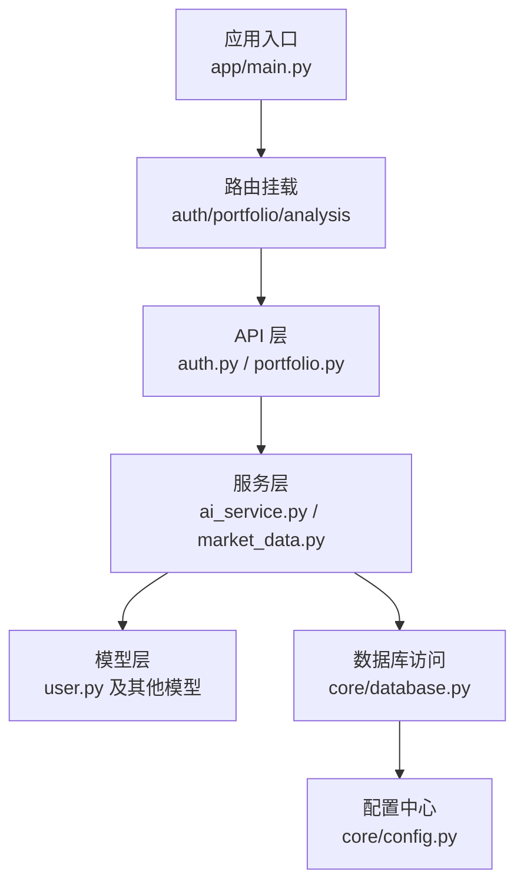
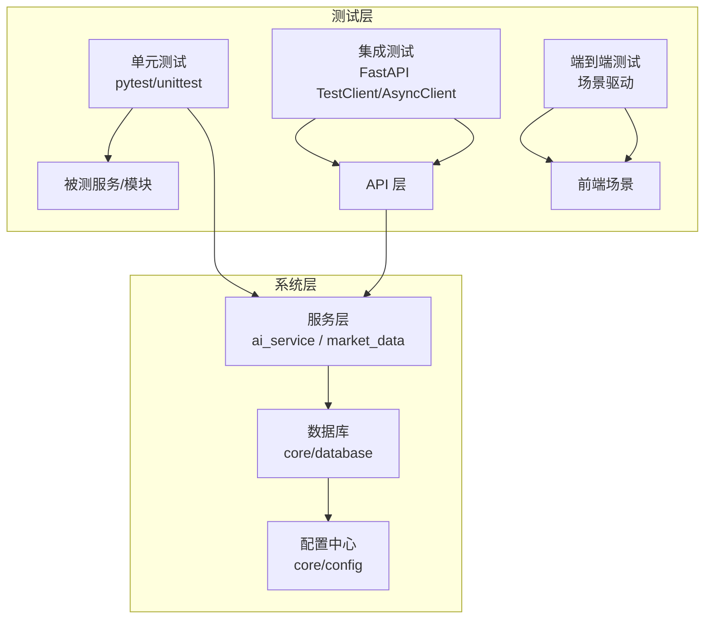
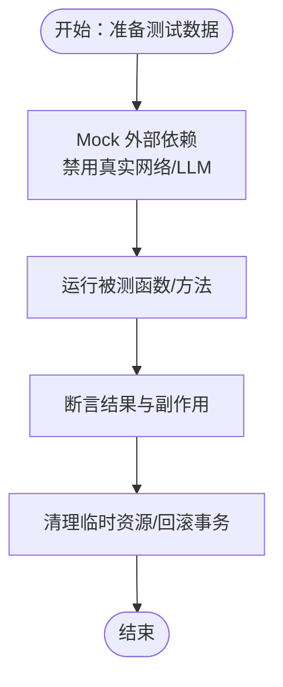
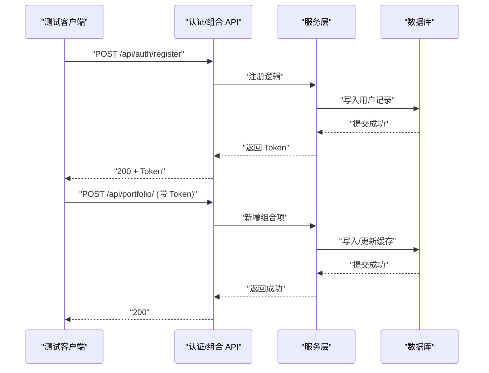
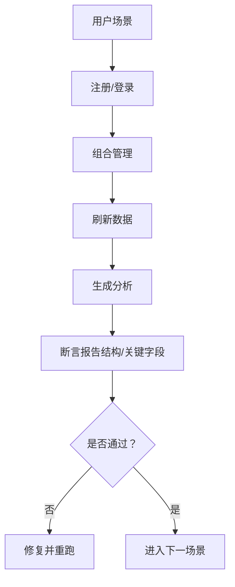
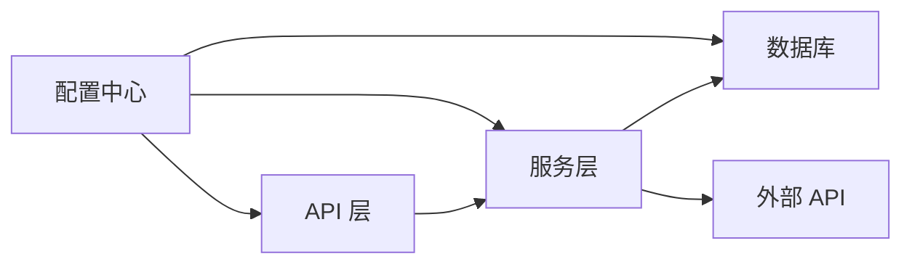

# 测试策略

<cite>
**本文引用的文件**
- [backend/app/main.py](file://backend/app/main.py)
- [backend/app/api/auth.py](file://backend/app/api/auth.py)
- [backend/app/api/portfolio.py](file://backend/app/api/portfolio.py)
- [backend/app/services/ai_service.py](file://backend/app/services/ai_service.py)
- [backend/app/services/market_data.py](file://backend/app/services/market_data.py)
- [backend/app/core/config.py](file://backend/app/core/config.py)
- [backend/app/core/database.py](file://backend/app/core/database.py)
- [backend/app/models/user.py](file://backend/app/models/user.py)
- [backend/test_api.py](file://backend/test_api.py)
- [backend/test_auth.py](file://backend/test_auth.py)
- [backend/test_market_data.py](file://backend/test_market_data.py)
- [backend/test_alpha_vantage.py](file://backend/test_alpha_vantage.py)
- [backend/test_yf.py](file://backend/test_yf.py)
</cite>

## 目录
1. [引言](#引言)
2. [项目结构](#项目结构)
3. [核心组件](#核心组件)
4. [架构总览](#架构总览)
5. [详细组件分析](#详细组件分析)
6. [依赖分析](#依赖分析)
7. [性能考虑](#性能考虑)
8. [故障排查指南](#故障排查指南)
9. [结论](#结论)
10. [附录](#附录)

## 引言
本测试策略文档面向“AI股票顾问”项目，系统化阐述单元测试、集成测试、端到端测试与回归测试的实施方法；明确测试覆盖率与质量标准；提供基于 pytest/unittest 的工具使用指南；说明在持续集成中如何自动化执行测试；并涵盖性能与压力测试、测试数据管理与环境隔离、缺陷跟踪与测试报告生成流程。

## 项目结构
后端采用 FastAPI + SQLAlchemy Async 架构，核心模块包括：
- 应用入口与路由：应用启动、CORS、路由挂载与健康检查
- API 层：认证、用户、组合、分析等接口
- 服务层：AI 分析、市场数据服务（支持多数据源）
- 核心配置与数据库：设置、异步引擎、会话工厂
- 模型层：用户、股票、缓存、新闻等实体
- 测试脚本：基础 API 验证、认证流程验证、市场数据服务验证、Alpha Vantage 流程验证、yfinance 单元验证

图表来源
- [backend/app/main.py](file://backend/app/main.py#L1-L38)
- [backend/app/api/auth.py](file://backend/app/api/auth.py#L1-L88)
- [backend/app/api/portfolio.py](file://backend/app/api/portfolio.py#L1-L297)
- [backend/app/services/ai_service.py](file://backend/app/services/ai_service.py#L1-L112)
- [backend/app/services/market_data.py](file://backend/app/services/market_data.py#L1-L370)
- [backend/app/core/database.py](file://backend/app/core/database.py#L1-L24)
- [backend/app/core/config.py](file://backend/app/core/config.py#L1-L24)
- [backend/app/models/user.py](file://backend/app/models/user.py#L1-L31)

章节来源
- [backend/app/main.py](file://backend/app/main.py#L1-L38)
- [backend/app/api/auth.py](file://backend/app/api/auth.py#L1-L88)
- [backend/app/api/portfolio.py](file://backend/app/api/portfolio.py#L1-L297)
- [backend/app/services/ai_service.py](file://backend/app/services/ai_service.py#L1-L112)
- [backend/app/services/market_data.py](file://backend/app/services/market_data.py#L1-L370)
- [backend/app/core/config.py](file://backend/app/core/config.py#L1-L24)
- [backend/app/core/database.py](file://backend/app/core/database.py#L1-L24)
- [backend/app/models/user.py](file://backend/app/models/user.py#L1-L31)

## 核心组件
- 应用入口与路由
  - 启动 FastAPI 应用，配置 CORS，挂载认证、用户、组合、分析路由，提供健康检查与根路径响应
- 认证与用户
  - 登录/注册接口，密码校验与令牌签发，用户模型含会员等级与首选数据源
- 组合与分析
  - 股票搜索、组合查询/新增/删除，实时数据刷新与缓存，技术指标计算与消息抓取
- 市场数据服务
  - 支持 Alpha Vantage 与 yfinance 多数据源，缓存与回退机制，异常处理与重试
- AI 分析服务
  - Gemini 接入与提示工程，缺失密钥时降级为模拟输出
- 数据库与配置
  - 异步引擎、会话工厂、SQLite/URL 配置、安全与外部 API 密钥

章节来源
- [backend/app/main.py](file://backend/app/main.py#L1-L38)
- [backend/app/api/auth.py](file://backend/app/api/auth.py#L1-L88)
- [backend/app/api/portfolio.py](file://backend/app/api/portfolio.py#L1-L297)
- [backend/app/services/ai_service.py](file://backend/app/services/ai_service.py#L1-L112)
- [backend/app/services/market_data.py](file://backend/app/services/market_data.py#L1-L370)
- [backend/app/core/config.py](file://backend/app/core/config.py#L1-L24)
- [backend/app/core/database.py](file://backend/app/core/database.py#L1-L24)
- [backend/app/models/user.py](file://backend/app/models/user.py#L1-L31)

## 架构总览
下图展示测试策略与系统组件的交互关系：测试通过不同层次覆盖单元、集成与端到端场景，同时利用 Mock 与隔离环境保障稳定性与可重复性。

## 详细组件分析

### 单元测试设计与实现
- 设计原则
  - 隔离性：使用 Mock 替换外部依赖（如 yfinance、Alpha Vantage、Gemini），确保测试稳定
  - 可重复性：固定随机种子或使用可控输入，避免时间相关断言
  - 覆盖边界：空输入、错误码、异常分支、超时与重试
- 实现要点
  - 服务类方法：对 MarketDataService、AIService 进行方法级测试，构造最小输入，断言输出结构与副作用
  - 工具函数：对数据转换、缓存更新逻辑进行纯函数测试
  - 配置与环境：通过环境变量或临时配置对象注入，避免真实密钥
- 测试数据准备
  - 构造最小化模型实例（如 PortfolioItem、Token）与数据库记录（如 Stock、MarketDataCache）
  - 使用内存数据库或临时数据库文件，确保并发安全与快速清理

章节来源
- [backend/app/services/market_data.py](file://backend/app/services/market_data.py#L1-L370)
- [backend/app/services/ai_service.py](file://backend/app/services/ai_service.py#L1-L112)
- [backend/app/core/config.py](file://backend/app/core/config.py#L1-L24)
- [backend/app/core/database.py](file://backend/app/core/database.py#L1-L24)

### 集成测试策略
- API 测试
  - 使用 FastAPI TestClient 或 AsyncClient 访问认证、组合、分析等路由
  - 关键场景：登录/注册成功与失败、携带 Token 访问受保护路由、新增/删除组合项
  - 断言：状态码、响应结构、错误消息
- 数据库测试
  - 在测试环境中使用独立数据库连接，执行插入/查询/更新，断言缓存与指标字段
  - 对 MarketDataService 的缓存命中、过期与回退逻辑进行验证
- 端到端场景
  - 从注册登录到添加组合、刷新数据、查看分析报告的完整链路
  - 使用 Mock 保证外部服务不可用时仍可验证业务流程

图表来源
- [backend/app/api/auth.py](file://backend/app/api/auth.py#L52-L87)
- [backend/app/api/portfolio.py](file://backend/app/api/portfolio.py#L231-L271)
- [backend/app/services/market_data.py](file://backend/app/services/market_data.py#L14-L170)

章节来源
- [backend/test_api.py](file://backend/test_api.py#L1-L52)
- [backend/test_auth.py](file://backend/test_auth.py#L1-L55)
- [backend/test_market_data.py](file://backend/test_market_data.py#L1-L27)
- [backend/test_alpha_vantage.py](file://backend/test_alpha_vantage.py#L1-L57)
- [backend/test_yf.py](file://backend/test_yf.py#L1-L23)

### 端到端测试流程
- 用户场景测试
  - 新用户注册 → 登录 → 查看组合 → 添加/删除股票 → 刷新数据 → 获取分析
  - 场景拆分：正常流程、异常输入、网络中断、外部 API 限流
- 回归测试
  - 每次变更后运行核心场景集，确保关键路径不被破坏
  - 使用快照或结构化断言保存期望输出，便于回归对比

章节来源
- [backend/test_auth.py](file://backend/test_auth.py#L10-L46)
- [backend/test_api.py](file://backend/test_api.py#L15-L39)

### 测试覆盖率与质量标准
- 覆盖率目标
  - 服务层方法覆盖率 ≥ 80%，关键分支 ≥ 90%
  - API 层路由与异常处理路径全覆盖
- 质量标准
  - 所有断言必须明确、可定位；失败日志包含上下文与输入
  - 禁止在测试中使用真实外部密钥；必须使用 Mock 或占位符
  - 测试命名清晰表达意图与前置条件

### 测试工具与框架使用指南
- pytest
  - 优点：夹具、参数化、插件生态丰富；推荐用于单元与集成测试
  - 建议：使用 fixtures 提供数据库会话与 Mock 配置；使用 pytest-asyncio 运行异步测试
- unittest
  - 优点：无需额外依赖；适合简单场景与回归测试
  - 建议：与 pytest 并行，逐步迁移复杂场景至 pytest

章节来源
- [backend/test_api.py](file://backend/test_api.py#L1-L52)
- [backend/test_auth.py](file://backend/test_auth.py#L1-L55)
- [backend/test_market_data.py](file://backend/test_market_data.py#L1-L27)

### 持续集成中的测试自动化
- 触发策略
  - Push/PR 触发：全量单元与集成测试；夜间全量回归测试
- 环境准备
  - 安装依赖、初始化数据库、加载 Alembic 版本
- 执行步骤
  - 运行 pytest（启用覆盖率统计），生成 XML 报告
  - 上传覆盖率与报告至 CI 平台
- 失败策略
  - 任一阶段失败即阻断合并；失败详情与日志保留至少 30 天

### 性能测试与压力测试
- 性能测试
  - 单接口吞吐：针对 /api/portfolio/ 刷新与 /api/analysis/{ticker} 生成基准
  - 资源占用：CPU、内存、数据库连接数上限
- 压力测试
  - 并发请求：模拟多用户同时刷新组合与请求分析
  - 外部服务降级：模拟 yfinance/Alpha Vantage 限流与失败，验证缓存与回退
- 工具建议
  - Locust（负载）、pytest-benchmark（基准）、pytest-asyncio（异步）

### 测试数据管理与环境隔离
- 测试数据库
  - 使用独立 SQLite 文件或内存数据库；每个测试进程隔离
- Mock 策略
  - 外部 API 返回固定响应；时间相关值使用可控偏移
- 配置隔离
  - 通过环境变量或临时配置对象注入测试专用密钥或禁用真实调用

章节来源
- [backend/app/core/database.py](file://backend/app/core/database.py#L1-L24)
- [backend/app/core/config.py](file://backend/app/core/config.py#L1-L24)
- [backend/app/services/market_data.py](file://backend/app/services/market_data.py#L14-L170)
- [backend/app/services/ai_service.py](file://backend/app/services/ai_service.py#L11-L18)

### 缺陷跟踪与测试报告
- 缺陷跟踪
  - 将失败用例编号与日志链接纳入缺陷系统；标注优先级与复现步骤
- 测试报告
  - pytest-html 生成 HTML 报告；pytest-cov 输出覆盖率报告
  - CI 中归档报告与覆盖率，便于审计与趋势分析

## 依赖分析
- 组件耦合
  - API 层依赖服务层；服务层依赖数据库与外部 API；配置中心贯穿全局
- 外部依赖
  - yfinance、Alpha Vantage、Gemini；均需通过 Mock 或代理配置隔离
- 循环依赖
  - 未见循环导入；若后续扩展需注意模块拆分与延迟导入

图表来源
- [backend/app/api/auth.py](file://backend/app/api/auth.py#L1-L88)
- [backend/app/api/portfolio.py](file://backend/app/api/portfolio.py#L1-L297)
- [backend/app/services/market_data.py](file://backend/app/services/market_data.py#L1-L370)
- [backend/app/services/ai_service.py](file://backend/app/services/ai_service.py#L1-L112)
- [backend/app/core/config.py](file://backend/app/core/config.py#L1-L24)
- [backend/app/core/database.py](file://backend/app/core/database.py#L1-L24)

章节来源
- [backend/app/api/auth.py](file://backend/app/api/auth.py#L1-L88)
- [backend/app/api/portfolio.py](file://backend/app/api/portfolio.py#L1-L297)
- [backend/app/services/market_data.py](file://backend/app/services/market_data.py#L1-L370)
- [backend/app/services/ai_service.py](file://backend/app/services/ai_service.py#L1-L112)
- [backend/app/core/config.py](file://backend/app/core/config.py#L1-L24)
- [backend/app/core/database.py](file://backend/app/core/database.py#L1-L24)

## 性能考虑
- 数据源选择与回退
  - 优先使用首选数据源，失败时快速回退；缓存窗口控制在合理范围以减少外部调用
- 异常与重试
  - 对 yfinance 的 429/Too Many Requests 进行指数退避；Alpha Vantage 限流时提前降级
- 并发与会话
  - SQLite 并发限制下顺序刷新缓存，避免会话冲突

章节来源
- [backend/app/services/market_data.py](file://backend/app/services/market_data.py#L14-L170)

## 故障排查指南
- 认证失败
  - 检查注册/登录请求体格式与邮箱唯一性；确认 Token 生成与传递
- 组合操作异常
  - 核对用户权限与组合项存在性；关注刷新缓存与数据库提交
- 外部 API 问题
  - 检查代理配置与密钥；必要时启用 Mock 返回固定数据
- 数据库连接
  - 确认异步引擎与会话工厂配置；避免跨线程共享会话

章节来源
- [backend/test_auth.py](file://backend/test_auth.py#L10-L46)
- [backend/test_api.py](file://backend/test_api.py#L15-L39)
- [backend/test_alpha_vantage.py](file://backend/test_alpha_vantage.py#L14-L52)
- [backend/test_market_data.py](file://backend/test_market_data.py#L13-L26)

## 结论
通过分层测试策略与严格的 Mock/隔离实践，可在不依赖真实外部服务的前提下，稳定地验证核心业务流程与关键算法。建议在 CI 中强制执行单元与集成测试，并逐步完善端到端与性能测试，持续提升质量与交付效率。

## 附录
- 快速参考清单
  - 单元测试：服务方法、工具函数、配置注入
  - 集成测试：认证流程、组合 CRUD、分析触发
  - 端到端：注册→登录→组合→刷新→分析
  - 覆盖率：服务层 ≥ 80%，关键分支 ≥ 90%
  - 工具：pytest + pytest-asyncio + pytest-cov + pytest-html
  - CI：全量测试 + 覆盖率 + 报告归档