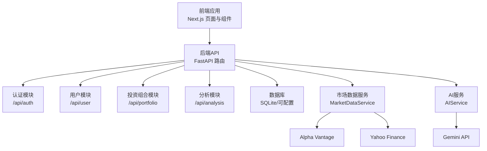
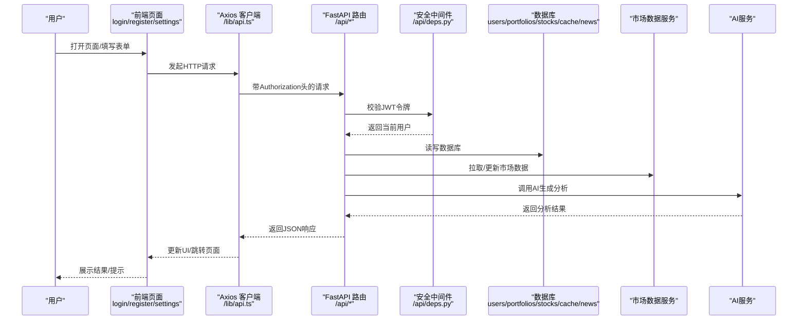
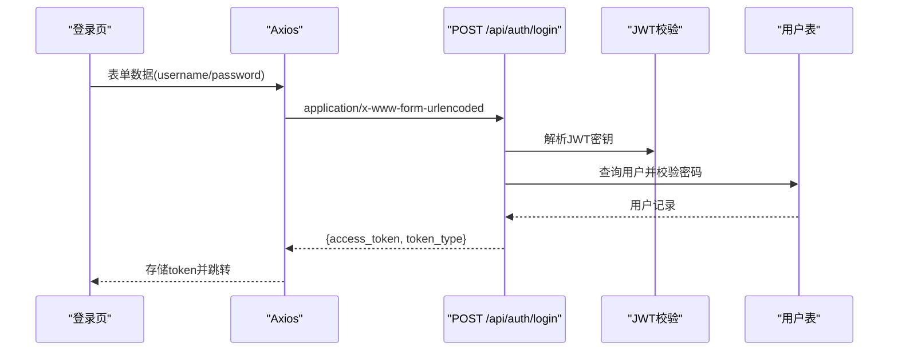
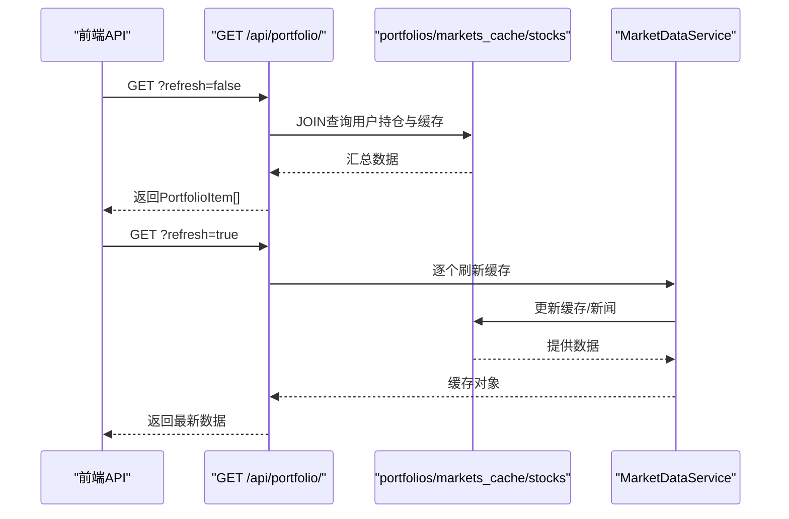
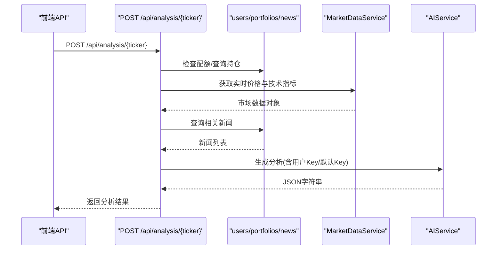
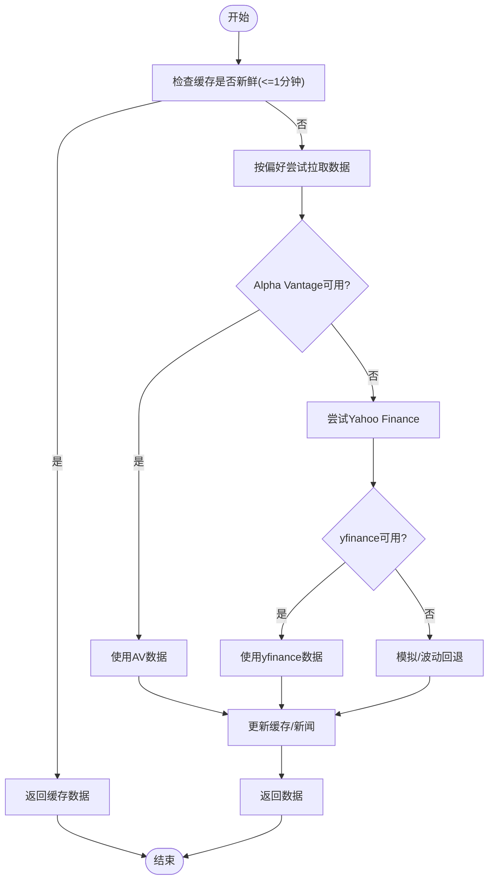
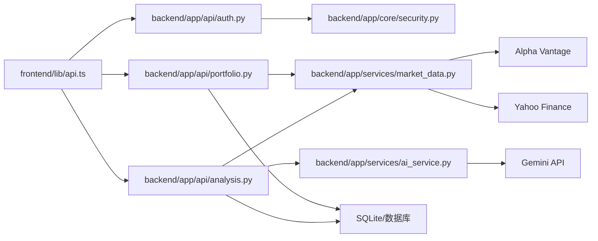

# 端到端测试

<cite>
**本文引用的文件**
- [README.md](file://README.md)
- [frontend/README.md](file://frontend/README.md)
- [backend/app/main.py](file://backend/app/main.py)
- [backend/app/api/auth.py](file://backend/app/api/auth.py)
- [backend/app/api/portfolio.py](file://backend/app/api/portfolio.py)
- [backend/app/api/analysis.py](file://backend/app/api/analysis.py)
- [backend/app/api/deps.py](file://backend/app/api/deps.py)
- [backend/app/core/config.py](file://backend/app/core/config.py)
- [backend/app/core/security.py](file://backend/app/core/security.py)
- [backend/app/models/user.py](file://backend/app/models/user.py)
- [backend/app/models/portfolio.py](file://backend/app/models/portfolio.py)
- [backend/app/services/ai_service.py](file://backend/app/services/ai_service.py)
- [backend/app/services/market_data.py](file://backend/app/services/market_data.py)
- [frontend/context/AuthContext.tsx](file://frontend/context/AuthContext.tsx)
- [frontend/app/login/page.tsx](file://frontend/app/login/page.tsx)
- [frontend/app/register/page.tsx](file://frontend/app/register/page.tsx)
- [frontend/app/settings/page.tsx](file://frontend/app/settings/page.tsx)
- [frontend/lib/api.ts](file://frontend/lib/api.ts)
</cite>

## 目录
1. [引言](#引言)
2. [项目结构](#项目结构)
3. [核心组件](#核心组件)
4. [架构总览](#架构总览)
5. [详细组件分析](#详细组件分析)
6. [依赖分析](#依赖分析)
7. [性能考虑](#性能考虑)
8. [故障排查指南](#故障排查指南)
9. [结论](#结论)
10. [附录](#附录)

## 引言
端到端测试（E2E）旨在验证从用户界面到后端服务再到数据库的完整业务流程，确保真实用户场景下的系统行为符合预期。对于本“AI股票顾问”项目而言，E2E测试覆盖以下关键目标：
- 用户完整工作流：注册/登录 → 设置 → 投资组合管理 → AI分析
- 系统整体行为：页面交互、API调用、数据库更新、外部数据源（Alpha Vantage/Yahoo Finance）与AI模型调用
- 数据一致性：前端展示、后端缓存与数据库记录保持一致
- 可靠性与稳定性：错误处理、限流与降级策略、网络异常恢复
- 可重复性：测试环境隔离、测试数据准备与清理

## 项目结构
项目采用前后端分离架构：
- 后端：FastAPI 应用，提供认证、用户、投资组合、分析等API；使用异步数据库访问与CORS配置
- 前端：Next.js 应用，提供登录、注册、设置、仪表盘等页面；通过Axios封装统一API调用
- 数据层：SQLite（开发）或可配置的数据库；市场数据缓存与新闻表



图表来源
- [backend/app/main.py](file://backend/app/main.py#L1-L38)
- [backend/app/api/auth.py](file://backend/app/api/auth.py#L1-L88)
- [backend/app/api/portfolio.py](file://backend/app/api/portfolio.py#L1-L297)
- [backend/app/api/analysis.py](file://backend/app/api/analysis.py#L1-L124)
- [backend/app/services/market_data.py](file://backend/app/services/market_data.py#L1-L370)
- [backend/app/services/ai_service.py](file://backend/app/services/ai_service.py#L1-L112)
- [frontend/lib/api.ts](file://frontend/lib/api.ts#L1-L130)

章节来源
- [README.md](file://README.md#L1-L50)
- [frontend/README.md](file://frontend/README.md#L1-L37)
- [backend/app/main.py](file://backend/app/main.py#L1-L38)

## 核心组件
- 认证与安全
  - 登录/注册：OAuth2表单认证、JWT生成与校验、密码哈希
  - 令牌管理：前端本地存储、请求拦截器注入Authorization头
- 投资组合管理
  - 搜索股票、查询/新增/删除持仓、刷新实时数据与技术指标
  - 缓存与回退：1分钟内缓存、缺失时模拟数据、自动后台拉取
- AI分析
  - 限流与配额：免费用户每日上限、用户自备API Key解锁无限
  - 多源数据：技术面、消息面、持仓背景、首选数据源偏好
- 外部服务
  - Alpha Vantage：报价与基础财务数据
  - Yahoo Finance：历史行情与技术指标计算、新闻抓取
  - Gemini：AI分析生成

章节来源
- [backend/app/api/auth.py](file://backend/app/api/auth.py#L1-L88)
- [backend/app/core/security.py](file://backend/app/core/security.py#L1-L26)
- [backend/app/api/portfolio.py](file://backend/app/api/portfolio.py#L1-L297)
- [backend/app/api/analysis.py](file://backend/app/api/analysis.py#L1-L124)
- [backend/app/services/market_data.py](file://backend/app/services/market_data.py#L1-L370)
- [backend/app/services/ai_service.py](file://backend/app/services/ai_service.py#L1-L112)
- [frontend/context/AuthContext.tsx](file://frontend/context/AuthContext.tsx#L1-L60)
- [frontend/lib/api.ts](file://frontend/lib/api.ts#L1-L130)

## 架构总览
下图展示了端到端测试的关键路径：从前端页面到后端路由、数据库与外部服务的完整链路。



图表来源
- [frontend/app/login/page.tsx](file://frontend/app/login/page.tsx#L1-L89)
- [frontend/app/register/page.tsx](file://frontend/app/register/page.tsx#L1-L84)
- [frontend/app/settings/page.tsx](file://frontend/app/settings/page.tsx#L1-L173)
- [frontend/lib/api.ts](file://frontend/lib/api.ts#L1-L130)
- [backend/app/api/deps.py](file://backend/app/api/deps.py#L1-L44)
- [backend/app/api/auth.py](file://backend/app/api/auth.py#L1-L88)
- [backend/app/api/portfolio.py](file://backend/app/api/portfolio.py#L1-L297)
- [backend/app/api/analysis.py](file://backend/app/api/analysis.py#L1-L124)
- [backend/app/services/market_data.py](file://backend/app/services/market_data.py#L1-L370)
- [backend/app/services/ai_service.py](file://backend/app/services/ai_service.py#L1-L112)

## 详细组件分析

### 用户场景测试设计
- 场景一：新用户注册与自动登录
  - 步骤：打开注册页 → 输入邮箱/密码 → 提交 → 成功返回token → 写入localStorage → 跳转首页
  - 关键断言：HTTP状态码、响应体字段、本地存储token存在、页面跳转
- 场景二：老用户登录与令牌续期
  - 步骤：打开登录页 → 输入邮箱/密码 → 提交 → 成功返回token → 写入localStorage
  - 关键断言：错误信息为空、token有效、请求拦截器携带Authorization头
- 场景三：设置API Key与数据源偏好
  - 步骤：进入设置页 → 输入Key → 保存 → 重新加载配置
  - 关键断言：状态显示变化、请求成功、下次分析不受限
- 场景四：投资组合管理
  - 步骤：搜索股票 → 新增/编辑/删除 → 刷新 → 查看技术指标与盈亏
  - 关键断言：列表正确、缓存更新、数据库持久化、后台拉取触发
- 场景五：AI分析
  - 步骤：选择股票 → 触发分析 → 查看返回结构
  - 关键断言：限流提示、返回JSON结构、免费/付费差异、错误降级

章节来源
- [frontend/app/register/page.tsx](file://frontend/app/register/page.tsx#L1-L84)
- [frontend/app/login/page.tsx](file://frontend/app/login/page.tsx#L1-L89)
- [frontend/app/settings/page.tsx](file://frontend/app/settings/page.tsx#L1-L173)
- [frontend/context/AuthContext.tsx](file://frontend/context/AuthContext.tsx#L1-L60)
- [frontend/lib/api.ts](file://frontend/lib/api.ts#L1-L130)
- [backend/app/api/auth.py](file://backend/app/api/auth.py#L1-L88)
- [backend/app/api/portfolio.py](file://backend/app/api/portfolio.py#L1-L297)
- [backend/app/api/analysis.py](file://backend/app/api/analysis.py#L1-L124)

### 前端到后端数据流测试
- 登录流程序列


图表来源
- [frontend/app/login/page.tsx](file://frontend/app/login/page.tsx#L19-L42)
- [backend/app/api/auth.py](file://backend/app/api/auth.py#L24-L50)
- [backend/app/core/security.py](file://backend/app/core/security.py#L1-L26)
- [backend/app/api/deps.py](file://backend/app/api/deps.py#L1-L44)

- 投资组合查询与刷新


图表来源
- [frontend/lib/api.ts](file://frontend/lib/api.ts#L74-L77)
- [backend/app/api/portfolio.py](file://backend/app/api/portfolio.py#L143-L224)
- [backend/app/services/market_data.py](file://backend/app/services/market_data.py#L14-L170)

- AI分析调用


图表来源
- [frontend/lib/api.ts](file://frontend/lib/api.ts#L99-L102)
- [backend/app/api/analysis.py](file://backend/app/api/analysis.py#L13-L124)
- [backend/app/services/market_data.py](file://backend/app/services/market_data.py#L14-L170)
- [backend/app/services/ai_service.py](file://backend/app/services/ai_service.py#L43-L112)

### 复杂逻辑流程图（缓存与回退）


图表来源
- [backend/app/services/market_data.py](file://backend/app/services/market_data.py#L14-L170)

### 类关系图（核心模型与依赖）
```mermaid
classDiagram
class User {
+string id
+string email
+string hashed_password
+MembershipTier membership_tier
+string api_key_gemini
+MarketDataSource preferred_data_source
+datetime created_at
+datetime last_login
}
class Portfolio {
+string id
+string user_id
+string ticker
+float quantity
+float avg_cost
+float target_price
+float stop_loss_price
+datetime created_at
+datetime updated_at
}
class MarketDataCache {
+string ticker
+float current_price
+float change_percent
+float rsi_14
+float ma_20
+float ma_50
+float ma_200
+float macd_val
+float macd_signal
+float macd_hist
+float bb_upper
+float bb_middle
+float bb_lower
+float atr_14
+float k_line
+float d_line
+float j_line
+float volume_ma_20
+float volume_ratio
+datetime last_updated
}
class StockNews {
+string id
+string ticker
+string title
+string publisher
+string link
+datetime publish_time
}
User ||--o{ Portfolio : "拥有多个"
Portfolio --> MarketDataCache : "关联缓存"
MarketDataCache --> StockNews : "被新闻引用"
```

图表来源
- [backend/app/models/user.py](file://backend/app/models/user.py#L1-L31)
- [backend/app/models/portfolio.py](file://backend/app/models/portfolio.py#L1-L26)
- [backend/app/services/market_data.py](file://backend/app/services/market_data.py#L10-L170)

## 依赖分析
- 前端依赖后端API，通过Axios统一拦截器注入Authorization头
- 后端路由依赖安全中间件进行JWT校验，再访问数据库与外部服务
- 投资组合模块依赖市场数据服务与数据库缓存
- AI分析模块依赖市场数据与Gemini API，同时受用户配额与Key控制



图表来源
- [frontend/lib/api.ts](file://frontend/lib/api.ts#L1-L130)
- [backend/app/api/auth.py](file://backend/app/api/auth.py#L1-L88)
- [backend/app/api/portfolio.py](file://backend/app/api/portfolio.py#L1-L297)
- [backend/app/api/analysis.py](file://backend/app/api/analysis.py#L1-L124)
- [backend/app/core/security.py](file://backend/app/core/security.py#L1-L26)
- [backend/app/services/market_data.py](file://backend/app/services/market_data.py#L1-L370)
- [backend/app/services/ai_service.py](file://backend/app/services/ai_service.py#L1-L112)

章节来源
- [frontend/lib/api.ts](file://frontend/lib/api.ts#L1-L130)
- [backend/app/api/deps.py](file://backend/app/api/deps.py#L1-L44)

## 性能考虑
- 缓存策略：1分钟内复用缓存，减少外部API调用与数据库压力
- 并发与节流：yfinance并发访问时延时与指数退避，避免429
- 异步与非阻塞：新增持仓后后台任务拉取数据，不阻塞响应
- 降级回退：无缓存时生成半真实模拟数据，保证体验连续性
- 前端懒加载与分页：在大列表场景下优化渲染性能

章节来源
- [backend/app/api/portfolio.py](file://backend/app/api/portfolio.py#L162-L174)
- [backend/app/services/market_data.py](file://backend/app/services/market_data.py#L14-L170)
- [backend/app/services/market_data.py](file://backend/app/services/market_data.py#L303-L318)

## 故障排查指南
- 认证失败
  - 现象：登录/注册返回错误
  - 排查：确认邮箱唯一性、密码哈希、JWT算法与密钥、CORS允许的前端地址
- 令牌无效
  - 现象：403/404凭证错误
  - 排查：检查Authorization头、令牌签名、过期时间、用户存在性
- 投资组合为空或未刷新
  - 现象：列表为空或技术指标缺失
  - 排查：缓存新鲜度、后台任务是否触发、首选数据源可用性
- AI分析报错或限流
  - 现象：返回错误提示或达到免费配额
  - 排查：Gemini Key配置、请求频率、网络代理设置
- 外部API异常
  - 现象：429/超时/解析失败
  - 排查：Alpha Vantage配额、yfinance速率限制、代理配置

章节来源
- [backend/app/api/auth.py](file://backend/app/api/auth.py#L38-L50)
- [backend/app/api/deps.py](file://backend/app/api/deps.py#L28-L43)
- [backend/app/api/analysis.py](file://backend/app/api/analysis.py#L46-L50)
- [backend/app/services/market_data.py](file://backend/app/services/market_data.py#L303-L318)
- [backend/app/services/ai_service.py](file://backend/app/services/ai_service.py#L103-L112)

## 结论
通过围绕用户工作流与系统关键路径构建端到端测试，可以有效保障注册登录、投资组合管理与AI分析三大核心功能的稳定性与一致性。建议在CI中集成E2E脚本，覆盖多浏览器与响应式场景，并结合性能与可靠性测试，持续提升平台质量。

## 附录

### 测试环境搭建与数据准备
- 后端
  - 启动命令参考：[README.md](file://README.md#L14-L31)
  - CORS允许的前端地址：[backend/app/main.py](file://backend/app/main.py#L9-L14)
  - 数据库：SQLite（默认），可在配置中切换：[backend/app/core/config.py](file://backend/app/core/config.py#L6)
- 前端
  - 启动命令参考：[frontend/README.md](file://frontend/README.md#L5-L15)
  - API基地址与拦截器：[frontend/lib/api.ts](file://frontend/lib/api.ts#L3-L18)
- 测试数据
  - 初始化数据库与迁移脚本位于 backend/ 目录，可按需运行
  - 示例用户与股票数据可通过API创建或导入

章节来源
- [README.md](file://README.md#L14-L31)
- [frontend/README.md](file://frontend/README.md#L5-L15)
- [backend/app/core/config.py](file://backend/app/core/config.py#L6)
- [frontend/lib/api.ts](file://frontend/lib/api.ts#L3-L18)

### 跨浏览器与响应式测试方法
- 浏览器矩阵：Chrome/Firefox/Safari/Edge
- 设备与分辨率：桌面、平板、手机（375/768/1024px）
- 关键交互验证：登录/注册表单提交、设置页保存、投资组合增删改查、分析按钮点击
- 可视化回归：截图对比与关键元素定位

### 性能基准与用户体验测试策略
- 基准指标：首屏渲染时间、API响应延迟、分析生成耗时、滚动列表流畅度
- 压力测试：并发登录/分析请求，观察缓存命中率与外部API限流表现
- 用户体验：输入反馈、加载指示、错误提示文案与可访问性

### 自动化脚本与CI集成
- E2E框架：建议使用支持浏览器自动化与API测试的工具（如Playwright/Cypress）
- CI步骤：安装依赖 → 启动后端 → 启动前端 → 运行测试 → 产出报告
- 环境变量：API地址、外部服务Key、代理配置
- 数据清理：测试结束后重置数据库或删除测试用户