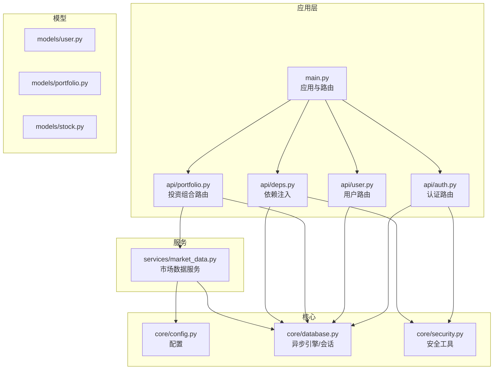
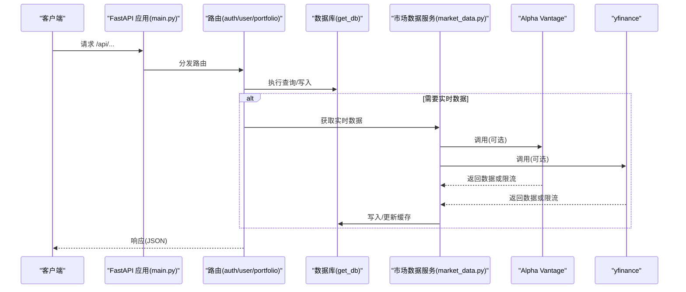
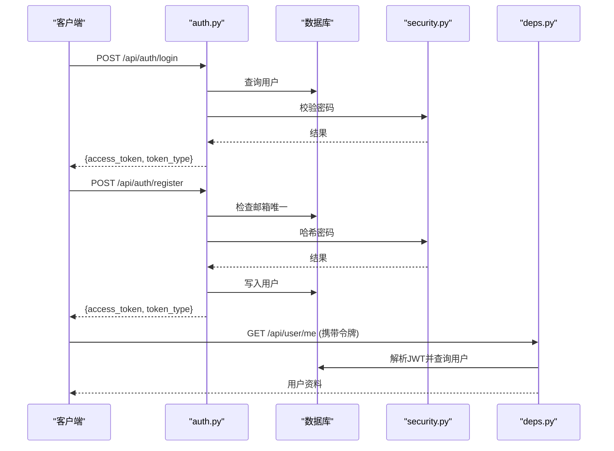
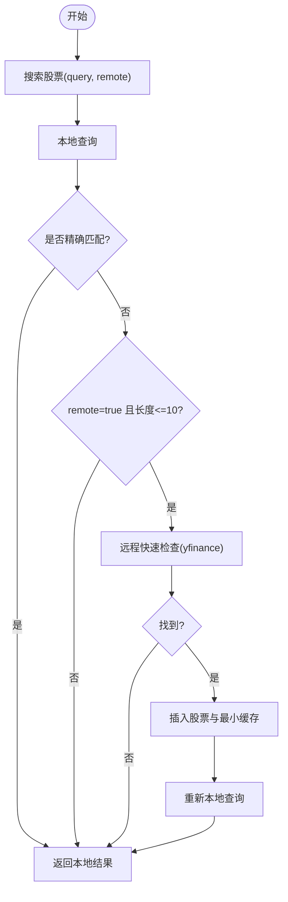
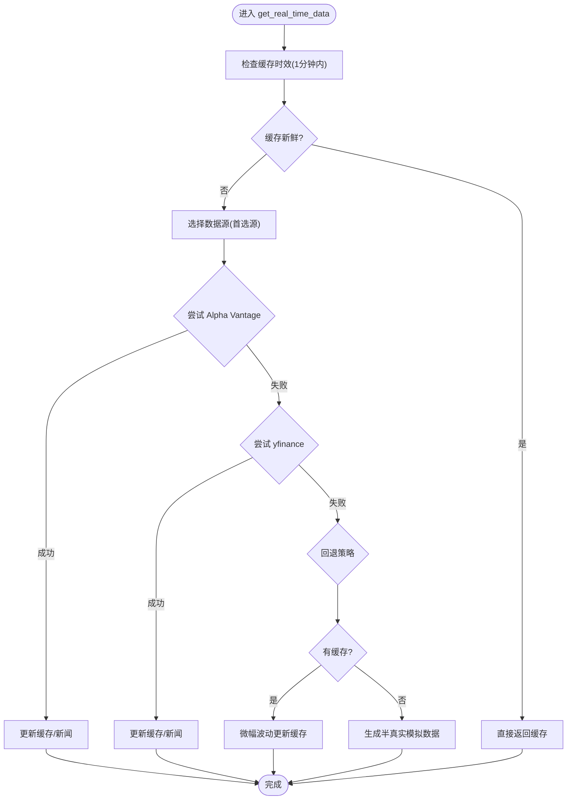
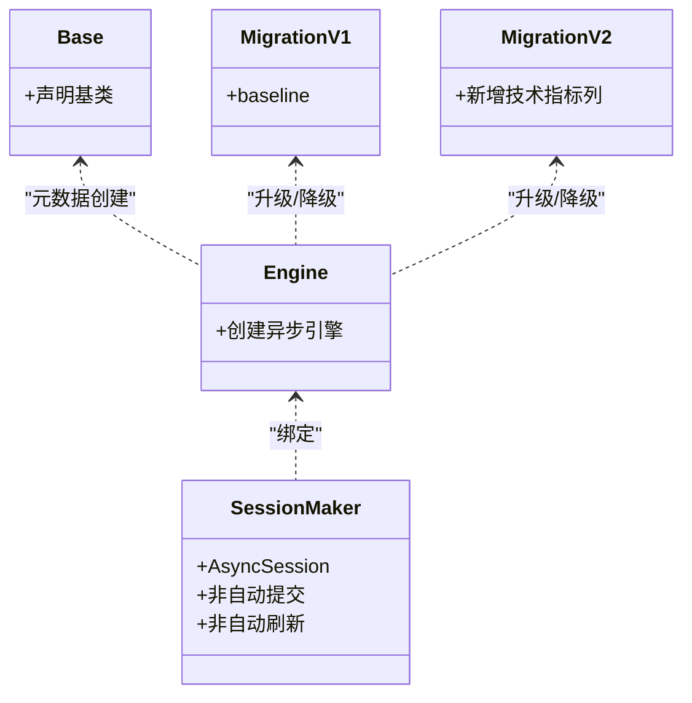
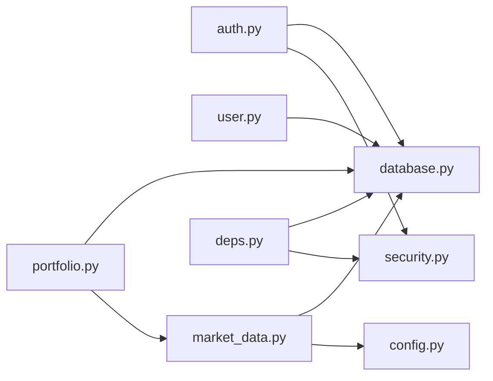

# 集成测试

<cite>
**本文引用的文件**
- [backend/app/main.py](file://backend/app/main.py)
- [backend/app/core/database.py](file://backend/app/core/database.py)
- [backend/app/core/config.py](file://backend/app/core/config.py)
- [backend/app/api/auth.py](file://backend/app/api/auth.py)
- [backend/app/api/user.py](file://backend/app/api/user.py)
- [backend/app/api/portfolio.py](file://backend/app/api/portfolio.py)
- [backend/app/api/deps.py](file://backend/app/api/deps.py)
- [backend/app/core/security.py](file://backend/app/core/security.py)
- [backend/app/models/user.py](file://backend/app/models/user.py)
- [backend/app/models/portfolio.py](file://backend/app/models/portfolio.py)
- [backend/app/models/stock.py](file://backend/app/models/stock.py)
- [backend/app/services/market_data.py](file://backend/app/services/market_data.py)
- [backend/init_db.py](file://backend/init_db.py)
- [backend/check_db_v3.py](file://backend/check_db_v3.py)
- [backend/migrations/versions/35a834f440ba_baseline.py](file://backend/migrations/versions/35a834f440ba_baseline.py)
- [backend/migrations/versions/48d7355e90d6_add_more_technical_indicators.py](file://backend/migrations/versions/48d7355e90d6_add_more_technical_indicators.py)
- [.env.example](file://.env.example)
</cite>

## 目录
1. [简介](#简介)
2. [项目结构](#项目结构)
3. [核心组件](#核心组件)
4. [架构总览](#架构总览)
5. [详细组件分析](#详细组件分析)
6. [依赖关系分析](#依赖关系分析)
7. [性能考量](#性能考量)
8. [故障排查指南](#故障排查指南)
9. [结论](#结论)
10. [附录](#附录)

## 简介
本文件面向“集成测试”的目标与范围，围绕以下方面进行系统化文档化：
- API 接口测试：覆盖认证、用户、投资组合等路由的端点测试、参数校验与响应格式验证。
- 数据库连接与迁移测试：验证异步数据库引擎、会话管理、表结构迁移与数据一致性。
- 外部服务集成测试：涵盖 Alpha Vantage 与 yfinance 的数据获取、限流与错误恢复策略。
- 并发与连接池测试：评估 SQLite 引擎在并发场景下的行为与稳定性。
- 测试环境与数据同步：基于 .env 示例与初始化脚本，建立可重复的测试环境。
- 自动化执行与结果验证：提供可落地的测试流程与断言策略。

## 项目结构
后端采用 FastAPI + SQLAlchemy Async 的异步架构，核心模块如下：
- 应用入口与路由挂载：应用启动、CORS 中间件、路由注册。
- 核心配置与数据库：设置读取、异步引擎与会话工厂、依赖注入。
- 路由层：认证、用户、投资组合、分析等 API。
- 模型层：用户、股票、投资组合、市场数据缓存等 ORM 定义。
- 服务层：市场数据服务（外部 API 调用、技术指标计算、缓存更新）。
- 迁移与初始化：Alembic 迁移版本与种子数据初始化脚本。

图表来源
- [backend/app/main.py](file://backend/app/main.py#L1-L38)
- [backend/app/api/auth.py](file://backend/app/api/auth.py#L1-L88)
- [backend/app/api/user.py](file://backend/app/api/user.py#L1-L48)
- [backend/app/api/portfolio.py](file://backend/app/api/portfolio.py#L1-L297)
- [backend/app/api/deps.py](file://backend/app/api/deps.py#L1-L44)
- [backend/app/core/config.py](file://backend/app/core/config.py#L1-L24)
- [backend/app/core/database.py](file://backend/app/core/database.py#L1-L24)
- [backend/app/core/security.py](file://backend/app/core/security.py#L1-L26)
- [backend/app/models/user.py](file://backend/app/models/user.py#L1-L31)
- [backend/app/models/portfolio.py](file://backend/app/models/portfolio.py#L1-L26)
- [backend/app/models/stock.py](file://backend/app/models/stock.py#L1-L85)
- [backend/app/services/market_data.py](file://backend/app/services/market_data.py#L1-L370)

章节来源
- [backend/app/main.py](file://backend/app/main.py#L1-L38)
- [backend/app/core/database.py](file://backend/app/core/database.py#L1-L24)
- [backend/app/core/config.py](file://backend/app/core/config.py#L1-L24)

## 核心组件
- 应用与路由
  - 启动 FastAPI 应用，配置 CORS，注册认证、用户、投资组合、分析路由。
- 数据库与配置
  - 异步引擎与会话工厂，依赖注入 get_db；配置类读取 DATABASE_URL、密钥与外部 API 密钥。
- 安全与认证
  - JWT 工具、OAuth2 密码流、当前用户解析依赖。
- 模型与服务
  - 用户、股票、投资组合、市场数据缓存模型；市场数据服务负责外部数据拉取与缓存更新。

章节来源
- [backend/app/main.py](file://backend/app/main.py#L1-L38)
- [backend/app/core/database.py](file://backend/app/core/database.py#L1-L24)
- [backend/app/core/config.py](file://backend/app/core/config.py#L1-L24)
- [backend/app/core/security.py](file://backend/app/core/security.py#L1-L26)
- [backend/app/models/user.py](file://backend/app/models/user.py#L1-L31)
- [backend/app/models/portfolio.py](file://backend/app/models/portfolio.py#L1-L26)
- [backend/app/models/stock.py](file://backend/app/models/stock.py#L1-L85)
- [backend/app/services/market_data.py](file://backend/app/services/market_data.py#L1-L370)

## 架构总览
下图展示从客户端到数据库与外部服务的完整调用链路，以及关键依赖注入点。

图表来源
- [backend/app/main.py](file://backend/app/main.py#L1-L38)
- [backend/app/api/auth.py](file://backend/app/api/auth.py#L1-L88)
- [backend/app/api/user.py](file://backend/app/api/user.py#L1-L48)
- [backend/app/api/portfolio.py](file://backend/app/api/portfolio.py#L1-L297)
- [backend/app/core/database.py](file://backend/app/core/database.py#L1-L24)
- [backend/app/services/market_data.py](file://backend/app/services/market_data.py#L1-L370)

## 详细组件分析

### 认证与用户管理测试要点
- 目标
  - 登录/注册端点的参数校验、密码哈希与 JWT 签发、用户信息读取与设置。
- 关键路径
  - 登录端点：OAuth2 表单认证 + 密码校验 + JWT 签发。
  - 注册端点：邮箱唯一性校验 + 密码哈希 + 自动登录。
  - 当前用户解析：OAuth2 Bearer + JWT 解码 + 用户查询。
- 断言建议
  - 参数缺失/非法：状态码 422/400。
  - 凭据无效：状态码 400。
  - 成功：返回 JSON 包含 access_token 与 token_type。
  - 用户信息：字段存在且类型正确。
- 并发注意
  - 注册时的并发重复提交需依赖数据库唯一约束与异常捕获。

图表来源
- [backend/app/api/auth.py](file://backend/app/api/auth.py#L1-L88)
- [backend/app/api/deps.py](file://backend/app/api/deps.py#L1-L44)
- [backend/app/core/security.py](file://backend/app/core/security.py#L1-L26)
- [backend/app/core/database.py](file://backend/app/core/database.py#L1-L24)

章节来源
- [backend/app/api/auth.py](file://backend/app/api/auth.py#L1-L88)
- [backend/app/api/deps.py](file://backend/app/api/deps.py#L1-L44)
- [backend/app/core/security.py](file://backend/app/core/security.py#L1-L26)

### 投资组合与市场数据测试要点
- 目标
  - 搜索股票、获取/新增/删除投资组合条目、刷新数据与缓存一致性。
- 关键路径
  - 搜索：本地查询 + 可选远程快速检查 + 新增不存在的股票与缓存。
  - 获取：联表查询缓存与股票基础数据，支持强制刷新。
  - 新增：去重/更新逻辑 + 缺失指标时后台拉取。
  - 删除：权限校验 + 删除。
- 断言建议
  - 搜索：返回列表项字段齐全；精确匹配优先；远程补充后可再次搜索命中。
  - 获取：字段集合与类型一致；刷新后价格/指标变化；无缓存时后台任务触发。
  - 新增/删除：状态码 200；返回消息；数据库记录存在/不存在。
- 并发注意
  - 刷新时对每个标的顺序更新以避免会话并发问题；后台任务不阻塞响应。

图表来源
- [backend/app/api/portfolio.py](file://backend/app/api/portfolio.py#L68-L140)

章节来源
- [backend/app/api/portfolio.py](file://backend/app/api/portfolio.py#L1-L297)

### 外部服务集成测试要点
- 目标
  - Alpha Vantage 与 yfinance 的数据获取、技术指标计算、新闻入库、缓存更新与限流/错误恢复。
- 关键路径
  - 优先源选择：按用户偏好或可用性切换。
  - 限流处理：yfinance 对 429 使用指数退避；Alpha Vantage 达限抛出异常。
  - 缓存更新：字段映射、SQLite upsert 避免重复新闻。
  - 回退策略：无外部数据时使用模拟价格波动或半真实模拟数据。
- 断言建议
  - 有 API Key：优先走首选源；失败则回退。
  - 无 API Key：仅走 yfinance 或模拟回退。
  - 限流：等待时间递增；最终仍可能失败，需断言降级行为。
  - 缓存：字段存在且类型合理；新闻去重。

图表来源
- [backend/app/services/market_data.py](file://backend/app/services/market_data.py#L14-L170)

章节来源
- [backend/app/services/market_data.py](file://backend/app/services/market_data.py#L1-L370)

### 数据库连接与迁移测试要点
- 目标
  - 异步数据库引擎连接、会话生命周期、表结构迁移与种子数据初始化。
- 关键路径
  - 引擎创建：根据 DATABASE_URL 选择驱动；SQLite 特殊参数。
  - 会话工厂：AsyncSession，非自动提交/刷新，expire_on_commit=False。
  - 迁移：Baseline 与新增技术指标列；升级/降级命令。
  - 初始化：创建所有表并批量插入种子股票。
- 断言建议
  - 连接测试：可执行 SQL 查询列出表名。
  - 迁移：升级后新增列存在；降级后列被移除。
  - 种子：指定股票存在且唯一。

图表来源
- [backend/app/core/database.py](file://backend/app/core/database.py#L1-L24)
- [backend/migrations/versions/35a834f440ba_baseline.py](file://backend/migrations/versions/35a834f440ba_baseline.py#L1-L33)
- [backend/migrations/versions/48d7355e90d6_add_more_technical_indicators.py](file://backend/migrations/versions/48d7355e90d6_add_more_technical_indicators.py#L1-L47)

章节来源
- [backend/app/core/database.py](file://backend/app/core/database.py#L1-L24)
- [backend/migrations/versions/35a834f440ba_baseline.py](file://backend/migrations/versions/35a834f440ba_baseline.py#L1-L33)
- [backend/migrations/versions/48d7355e90d6_add_more_technical_indicators.py](file://backend/migrations/versions/48d7355e90d6_add_more_technical_indicators.py#L1-L47)
- [backend/init_db.py](file://backend/init_db.py#L1-L85)
- [backend/check_db_v3.py](file://backend/check_db_v3.py#L1-L26)

### 并发访问与连接池测试要点
- 目标
  - 在 SQLite 场景下评估并发写入与后台任务的稳定性。
- 关键路径
  - 投资组合刷新：对每个标的顺序更新，避免并发会话冲突。
  - 后台任务：新增条目后异步拉取指标，不阻塞主流程。
- 断言建议
  - 并发刷新：价格/指标应稳定更新；无死锁或会话异常。
  - 后台任务：日志输出成功/失败；最终缓存字段完整。

章节来源
- [backend/app/api/portfolio.py](file://backend/app/api/portfolio.py#L162-L174)
- [backend/app/api/portfolio.py](file://backend/app/api/portfolio.py#L266-L278)

### 测试环境配置与数据同步策略
- 环境变量
  - DATABASE_URL：数据库连接串；GEMINI_API_KEY、DEEPSEEK_API_KEY、ALPHA_VANTAGE_API_KEY：外部服务密钥；SECRET_KEY：JWT 密钥。
- 初始化步骤
  - 创建表：运行初始化脚本。
  - 种子数据：批量插入常用股票。
  - 连接测试：通过独立脚本验证连接与表存在。
- 数据同步
  - 迁移：使用 Alembic 升级/降级确保结构一致。
  - 缓存：通过市场数据服务的缓存更新机制保证数据新鲜度。

章节来源
- [.env.example](file://.env.example#L1-L9)
- [backend/init_db.py](file://backend/init_db.py#L1-L85)
- [backend/check_db_v3.py](file://backend/check_db_v3.py#L1-L26)
- [backend/migrations/versions/35a834f440ba_baseline.py](file://backend/migrations/versions/35a834f440ba_baseline.py#L1-L33)
- [backend/migrations/versions/48d7355e90d6_add_more_technical_indicators.py](file://backend/migrations/versions/48d7355e90d6_add_more_technical_indicators.py#L1-L47)

### API 测试方法与自动化执行
- 端点测试清单
  - 认证：POST /api/auth/login、POST /api/auth/register
  - 用户：GET /api/user/me、PUT /api/user/settings
  - 投资组合：GET /api/portfolio/search、GET /api/portfolio/、POST /api/portfolio/、DELETE /api/portfolio/{ticker}
- 参数验证与响应格式
  - 使用 Pydantic 模型定义请求/响应结构，断言字段存在与类型。
  - OAuth2 Bearer 令牌必须有效，否则 403。
- 自动化执行
  - 使用测试框架（如 pytest + httpx/aiohttp）编写集成测试套件。
  - 先初始化数据库与迁移，再启动应用实例，最后执行各路由测试。
  - 结果验证：状态码、JSON 字段、数据库一致性、缓存更新。

章节来源
- [backend/app/api/auth.py](file://backend/app/api/auth.py#L1-L88)
- [backend/app/api/user.py](file://backend/app/api/user.py#L1-L48)
- [backend/app/api/portfolio.py](file://backend/app/api/portfolio.py#L1-L297)
- [backend/app/api/deps.py](file://backend/app/api/deps.py#L1-L44)

## 依赖关系分析
- 组件耦合
  - 路由依赖数据库会话与安全依赖；服务层依赖配置与数据库。
  - 投资组合路由依赖市场数据服务与模型层。
- 外部依赖
  - Alpha Vantage 与 yfinance；SQLite 引擎。
- 循环依赖
  - 未发现循环导入；模块职责清晰。

图表来源
- [backend/app/api/auth.py](file://backend/app/api/auth.py#L1-L88)
- [backend/app/api/user.py](file://backend/app/api/user.py#L1-L48)
- [backend/app/api/portfolio.py](file://backend/app/api/portfolio.py#L1-L297)
- [backend/app/api/deps.py](file://backend/app/api/deps.py#L1-L44)
- [backend/app/core/database.py](file://backend/app/core/database.py#L1-L24)
- [backend/app/core/security.py](file://backend/app/core/security.py#L1-L26)
- [backend/app/services/market_data.py](file://backend/app/services/market_data.py#L1-L370)
- [backend/app/core/config.py](file://backend/app/core/config.py#L1-L24)

章节来源
- [backend/app/api/auth.py](file://backend/app/api/auth.py#L1-L88)
- [backend/app/api/user.py](file://backend/app/api/user.py#L1-L48)
- [backend/app/api/portfolio.py](file://backend/app/api/portfolio.py#L1-L297)
- [backend/app/api/deps.py](file://backend/app/api/deps.py#L1-L44)
- [backend/app/core/database.py](file://backend/app/core/database.py#L1-L24)
- [backend/app/core/security.py](file://backend/app/core/security.py#L1-L26)
- [backend/app/services/market_data.py](file://backend/app/services/market_data.py#L1-L370)
- [backend/app/core/config.py](file://backend/app/core/config.py#L1-L24)

## 性能考量
- 异步数据库：减少阻塞，提升并发吞吐。
- 缓存策略：1 分钟内复用缓存，降低外部调用频率。
- 限流与退避：yfinance 429 时指数退避，避免触发更高频次限制。
- 后台任务：不影响响应时间，但需监控失败重试与日志。

## 故障排查指南
- 数据库连接失败
  - 检查 DATABASE_URL 是否正确；确认工作目录与文件存在。
- 迁移异常
  - 确认 Alembic 版本与数据库结构一致；必要时执行 downgrade 再 upgrade。
- 外部 API 限流
  - 检查 API Key 配置；观察指数退避日志；适当降低并发。
- 认证失败
  - 确认 SECRET_KEY 一致；令牌未过期；用户存在且激活。

章节来源
- [backend/check_db_v3.py](file://backend/check_db_v3.py#L1-L26)
- [backend/migrations/versions/35a834f440ba_baseline.py](file://backend/migrations/versions/35a834f440ba_baseline.py#L1-L33)
- [backend/migrations/versions/48d7355e90d6_add_more_technical_indicators.py](file://backend/migrations/versions/48d7355e90d6_add_more_technical_indicators.py#L1-L47)
- [backend/app/core/config.py](file://backend/app/core/config.py#L1-L24)
- [backend/app/core/security.py](file://backend/app/core/security.py#L1-L26)

## 结论
本集成测试文档围绕 API、数据库与外部服务三大维度，提供了可执行的测试策略与断言方法。通过迁移与初始化脚本确保环境一致性，结合缓存与限流策略，可在可控成本下获得稳定的集成测试覆盖。

## 附录
- 建议测试顺序
  - 环境准备：加载 .env、执行迁移、初始化种子数据。
  - 数据库测试：连接测试、表结构验证、种子数据校验。
  - API 测试：认证、用户、投资组合端点逐一验证。
  - 外部服务测试：Alpha Vantage 与 yfinance 的可用性与限流处理。
  - 并发测试：多实例并发写入与后台任务稳定性。
- 结果验证
  - 状态码与响应体字段校验；
  - 数据库一致性与缓存更新；
  - 日志与错误码的可追踪性。