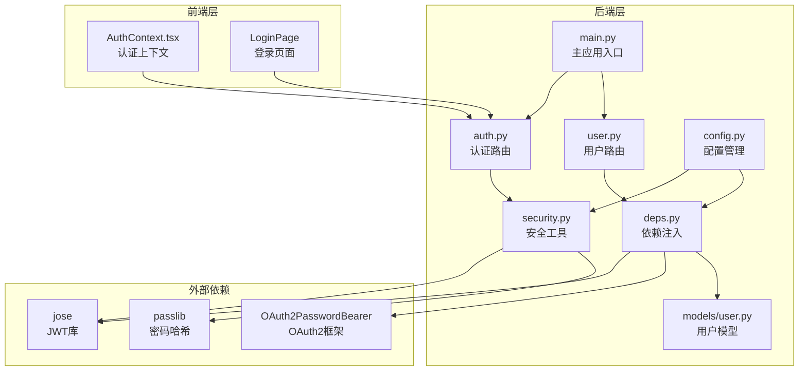
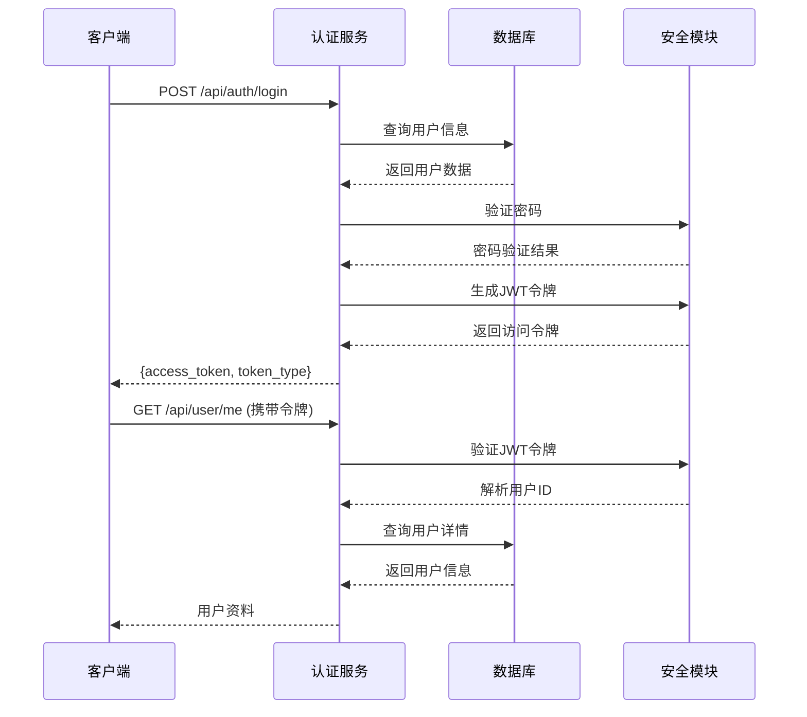
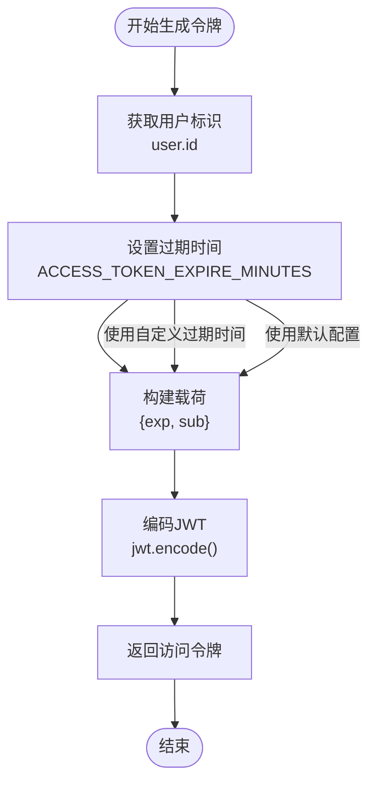
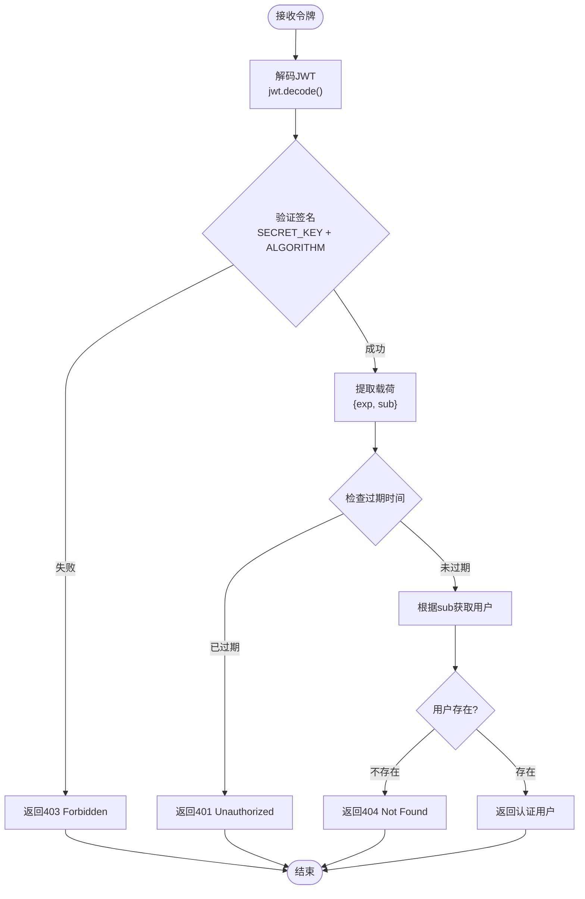
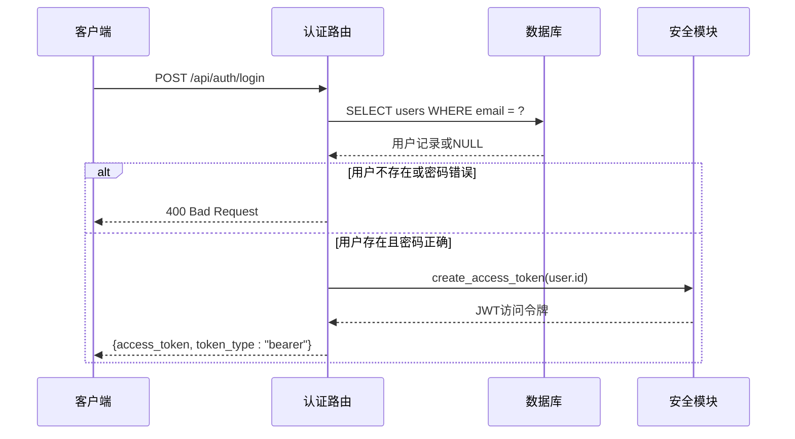
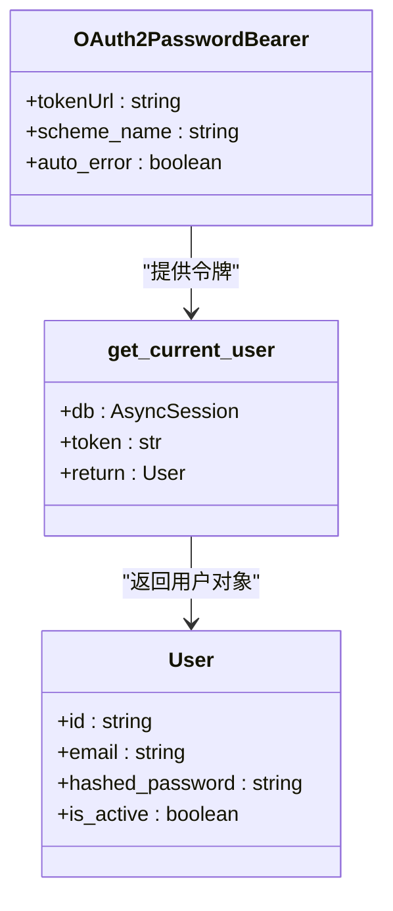
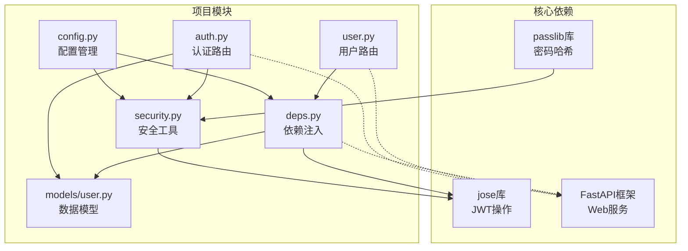
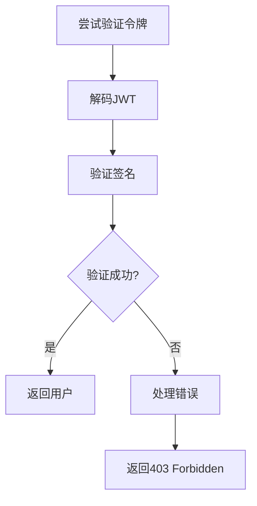

# JWT认证机制

<cite>
**本文档引用的文件**
- [backend/app/core/security.py](file://backend/app/core/security.py)
- [backend/app/api/auth.py](file://backend/app/api/auth.py)
- [backend/app/core/config.py](file://backend/app/core/config.py)
- [backend/app/api/deps.py](file://backend/app/api/deps.py)
- [backend/app/models/user.py](file://backend/app/models/user.py)
- [backend/app/api/user.py](file://backend/app/api/user.py)
- [backend/app/main.py](file://backend/app/main.py)
- [frontend/context/AuthContext.tsx](file://frontend/context/AuthContext.tsx)
- [.env.example](file://.env.example)
</cite>

## 目录
1. [简介](#简介)
2. [项目结构](#项目结构)
3. [核心组件](#核心组件)
4. [架构概览](#架构概览)
5. [详细组件分析](#详细组件分析)
6. [依赖关系分析](#依赖关系分析)
7. [性能考虑](#性能考虑)
8. [故障排除指南](#故障排除指南)
9. [结论](#结论)

## 简介

本项目实现了基于JWT（JSON Web Token）的认证机制，采用OAuth2密码模式进行用户身份验证。JWT认证机制通过生成短期有效的访问令牌来保护API资源，确保只有经过身份验证的用户才能访问受保护的端点。

JWT认证的核心优势包括：
- 无状态认证：服务器不需要存储会话信息
- 跨域支持：便于前后端分离架构
- 移动端友好：支持多种客户端类型
- 性能优化：减少数据库查询次数

## 项目结构

JWT认证机制在项目中的组织结构如下：



**图表来源**
- [backend/app/main.py](file://backend/app/main.py#L24-L29)
- [backend/app/api/auth.py](file://backend/app/api/auth.py#L1-L14)
- [backend/app/api/deps.py](file://backend/app/api/deps.py#L13-L15)

**章节来源**
- [backend/app/main.py](file://backend/app/main.py#L1-L38)
- [backend/app/api/auth.py](file://backend/app/api/auth.py#L1-L14)

## 核心组件

### 安全配置模块

安全配置模块定义了JWT认证所需的所有配置参数：

| 配置参数 | 类型 | 默认值 | 描述 |
|---------|------|--------|------|
| SECRET_KEY | string | "secret" | JWT签名密钥，必须保密 |
| ALGORITHM | string | "HS256" | JWT签名算法 |
| ACCESS_TOKEN_EXPIRE_MINUTES | integer | 1440 (24小时) | 访问令牌过期时间（分钟） |

### JWT工具函数

JWT工具函数提供了令牌生成和密码验证的核心功能：

- `create_access_token()`: 生成JWT访问令牌
- `verify_password()`: 验证用户密码
- `get_password_hash()`: 生成密码哈希

### 认证路由

认证路由处理用户登录和注册请求，返回JWT访问令牌：

- `/api/auth/login`: 用户登录，返回访问令牌
- `/api/auth/register`: 用户注册，返回访问令牌

### 依赖注入系统

依赖注入系统负责令牌验证和用户身份解析：

- `OAuth2PasswordBearer`: OAuth2密码流配置
- `get_current_user()`: 获取当前认证用户

**章节来源**
- [backend/app/core/config.py](file://backend/app/core/config.py#L8-L11)
- [backend/app/core/security.py](file://backend/app/core/security.py#L1-L26)
- [backend/app/api/auth.py](file://backend/app/api/auth.py#L24-L50)
- [backend/app/api/deps.py](file://backend/app/api/deps.py#L13-L43)

## 架构概览

JWT认证机制的整体架构分为三个层次：



**图表来源**
- [backend/app/api/auth.py](file://backend/app/api/auth.py#L24-L50)
- [backend/app/api/deps.py](file://backend/app/api/deps.py#L17-L43)

## 详细组件分析

### JWT令牌生成流程

JWT令牌的生成过程包含以下步骤：



**图表来源**
- [backend/app/core/security.py](file://backend/app/core/security.py#L11-L19)

#### 载荷构建细节

JWT载荷包含以下关键声明：

| 声明 | 类型 | 必需性 | 描述 |
|------|------|--------|------|
| sub | string | 必需 | 用户唯一标识符 |
| exp | integer | 必需 | 令牌过期时间戳 |
| iat | integer | 可选 | 令牌签发时间戳 |
| iss | string | 可选 | 令牌签发者标识 |

#### 签名算法

项目使用HS256（HMAC SHA256）算法进行JWT签名：

- **算法**: HS256
- **密钥**: 来自环境变量的SECRET_KEY
- **签名过程**: 使用对称密钥对载荷进行签名

**章节来源**
- [backend/app/core/security.py](file://backend/app/core/security.py#L11-L19)

### 令牌验证流程

令牌验证过程确保请求的安全性和有效性：



**图表来源**
- [backend/app/api/deps.py](file://backend/app/api/deps.py#L21-L43)

#### 验证步骤详解

1. **签名验证**: 使用相同的密钥和算法验证令牌完整性
2. **过期检查**: 验证exp声明确保令牌未过期
3. **用户查找**: 根据sub声明从数据库获取对应用户
4. **状态检查**: 确认用户账户处于激活状态

**章节来源**
- [backend/app/api/deps.py](file://backend/app/api/deps.py#L17-L43)

### 认证路由实现

认证路由处理用户身份验证请求：



**图表来源**
- [backend/app/api/auth.py](file://backend/app/api/auth.py#L24-L50)

#### 登录流程

1. **用户查询**: 通过邮箱查询用户记录
2. **密码验证**: 使用bcrypt算法验证密码
3. **令牌生成**: 为用户生成JWT访问令牌
4. **响应返回**: 返回令牌和令牌类型

**章节来源**
- [backend/app/api/auth.py](file://backend/app/api/auth.py#L24-L50)

### 依赖注入系统

依赖注入系统提供统一的认证中间件：



**图表来源**
- [backend/app/api/deps.py](file://backend/app/api/deps.py#L13-L43)

#### 中间件工作原理

1. **令牌提取**: 从Authorization头中提取Bearer令牌
2. **令牌验证**: 使用jose库验证JWT令牌
3. **用户解析**: 从载荷中提取用户ID并查询用户信息
4. **异常处理**: 处理各种认证失败情况

**章节来源**
- [backend/app/api/deps.py](file://backend/app/api/deps.py#L13-L43)

## 依赖关系分析

JWT认证机制的依赖关系图：



**图表来源**
- [backend/app/core/security.py](file://backend/app/core/security.py#L1-L5)
- [backend/app/api/deps.py](file://backend/app/api/deps.py#L1-L11)

### 外部依赖

| 依赖库 | 版本 | 用途 |
|-------|------|------|
| jose | 最新版 | JWT令牌生成和验证 |
| passlib | 最新版 | 密码哈希和验证 |
| fastapi | 最新版 | Web框架和OAuth2支持 |
| sqlalchemy | 最新版 | 数据库ORM操作 |

**章节来源**
- [backend/app/core/security.py](file://backend/app/core/security.py#L1-L5)
- [backend/app/api/deps.py](file://backend/app/api/deps.py#L1-L11)

## 性能考虑

### 令牌缓存策略

由于JWT是无状态的，建议实现以下性能优化：

1. **令牌预热**: 在用户登录时预生成常用令牌
2. **缓存用户信息**: 缓存用户的基本信息以减少数据库查询
3. **批量验证**: 对于高并发场景，考虑实现令牌批量验证

### 内存管理

- **令牌大小控制**: 保持载荷最小化，避免存储不必要的用户信息
- **过期时间优化**: 合理设置ACCESS_TOKEN_EXPIRE_MINUTES，平衡安全性与性能
- **内存泄漏防护**: 确保令牌验证过程中正确释放资源

### 数据库优化

- **索引优化**: 为用户邮箱和ID建立适当的数据库索引
- **查询优化**: 使用JOIN查询减少数据库往返次数
- **连接池**: 配置合适的数据库连接池大小

## 故障排除指南

### 常见问题及解决方案

#### 1. 令牌验证失败

**症状**: 返回403 Forbidden错误

**可能原因**:
- 令牌签名不匹配
- 令牌格式错误
- 算法配置不一致

**解决方法**:
- 检查SECRET_KEY配置是否正确
- 确认ALGORITHM设置一致
- 验证令牌格式是否符合Bearer规范

#### 2. 令牌过期问题

**症状**: 返回401 Unauthorized错误

**可能原因**:
- ACCESS_TOKEN_EXPIRE_MINUTES设置过短
- 服务器时间不同步
- 令牌被重复使用

**解决方法**:
- 检查服务器时间同步
- 调整ACCESS_TOKEN_EXPIRE_MINUTES配置
- 实现令牌刷新机制

#### 3. 用户找不到

**症状**: 返回404 Not Found错误

**可能原因**:
- 用户已被删除
- 用户ID不正确
- 数据库连接问题

**解决方法**:
- 验证用户ID的有效性
- 检查数据库连接状态
- 确认用户记录存在

### 调试技巧

#### 日志记录

项目中包含了调试日志输出：

```python
print(f"DEBUG: Validating token: {token[:10]}...")
print(f"DEBUG: Token payload: {payload}")
```

这些日志有助于诊断认证问题。

#### 错误处理

系统实现了完善的错误处理机制：



**图表来源**
- [backend/app/api/deps.py](file://backend/app/api/deps.py#L21-L33)

**章节来源**
- [backend/app/api/deps.py](file://backend/app/api/deps.py#L21-L33)

## 结论

本项目的JWT认证机制实现了以下关键特性：

### 安全性保障

- **强密码保护**: 使用bcrypt算法进行密码哈希
- **令牌签名**: 采用HS256算法确保令牌完整性
- **过期控制**: 短期有效的访问令牌限制风险暴露
- **异常处理**: 完善的错误处理机制防止信息泄露

### 开发效率

- **模块化设计**: 清晰的模块分离便于维护
- **类型安全**: 使用Pydantic模型确保数据完整性
- **异步支持**: 基于FastAPI的异步架构提升性能
- **配置管理**: 环境变量驱动的配置便于部署

### 扩展性考虑

- **插件架构**: 易于添加新的认证方式
- **中间件支持**: 统一的认证中间件便于扩展
- **数据库抽象**: 支持多种数据库后端
- **前端集成**: 提供完整的前端认证上下文

### 最佳实践建议

1. **生产环境配置**: 将SECRET_KEY替换为强随机字符串
2. **令牌刷新**: 实现refresh token机制支持长期会话
3. **安全传输**: 确保所有通信通过HTTPS进行
4. **监控告警**: 添加认证失败的监控和告警机制
5. **定期审计**: 定期审查认证日志和安全事件

该JWT认证机制为AI股票顾问项目提供了坚实的身份验证基础，既保证了安全性，又确保了良好的开发体验和扩展性。