# 密码安全与加密

<cite>
**本文档引用的文件**
- [security.py](file://backend/app/core/security.py)
- [auth.py](file://backend/app/api/auth.py)
- [user.py](file://backend/app/models/user.py)
- [config.py](file://backend/app/core/config.py)
- [deps.py](file://backend/app/api/deps.py)
- [database.py](file://backend/app/core/database.py)
- [requirements.txt](file://backend/requirements.txt)
- [.env.example](file://.env.example)
- [AuthContext.tsx](file://frontend/context/AuthContext.tsx)
- [page.tsx](file://frontend/app/login/page.tsx)
</cite>

## 目录
1. [简介](#简介)
2. [项目结构](#项目结构)
3. [核心组件](#核心组件)
4. [架构概览](#架构概览)
5. [详细组件分析](#详细组件分析)
6. [依赖关系分析](#依赖关系分析)
7. [性能考虑](#性能考虑)
8. [故障排除指南](#故障排除指南)
9. [结论](#结论)

## 简介

本项目实现了现代化的密码安全与加密解决方案，采用业界标准的密码哈希算法和安全令牌机制。系统使用bcrypt作为主要的密码哈希算法，结合JWT（JSON Web Token）进行身份认证，确保用户凭据的安全存储和传输。

密码安全是本项目的核心功能之一，涉及密码哈希、盐值生成、密码验证、令牌管理和数据库安全等多个方面。本文档将详细解释这些组件的设计原理和实现细节。

## 项目结构

密码安全相关的代码分布在以下关键模块中：

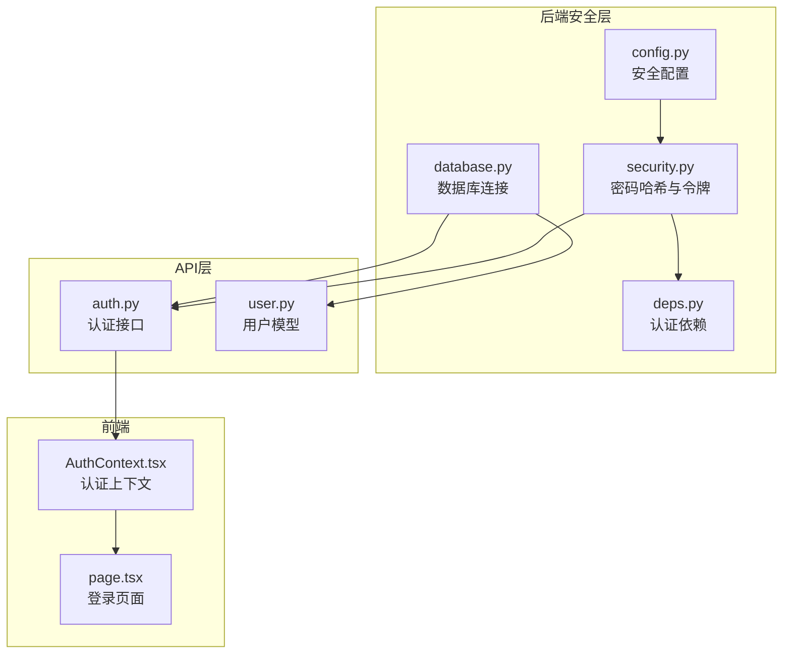

**图表来源**
- [security.py](file://backend/app/core/security.py#L1-L26)
- [auth.py](file://backend/app/api/auth.py#L1-L88)
- [user.py](file://backend/app/models/user.py#L1-L31)

**章节来源**
- [security.py](file://backend/app/core/security.py#L1-L26)
- [auth.py](file://backend/app/api/auth.py#L1-L88)
- [user.py](file://backend/app/models/user.py#L1-L31)

## 核心组件

### 密码哈希系统

系统采用passlib库的CryptContext配置，专门用于处理密码哈希：

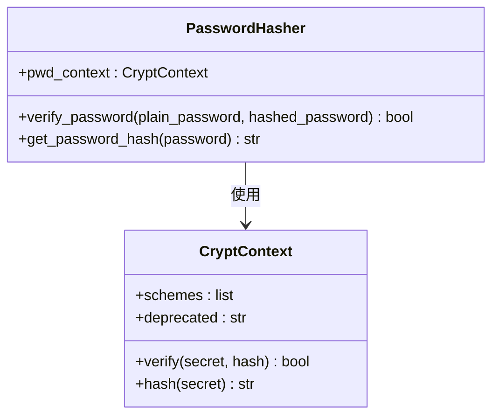

**图表来源**
- [security.py](file://backend/app/core/security.py#L7-L25)

### JWT令牌管理

系统使用python-jose库实现JWT令牌的创建和验证：

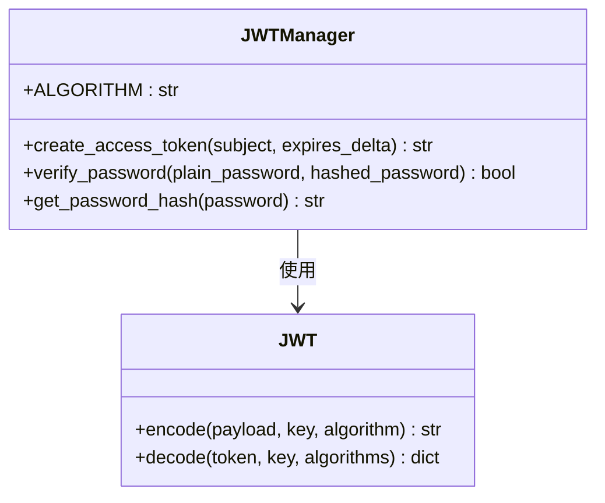

**图表来源**
- [security.py](file://backend/app/core/security.py#L9-L19)

**章节来源**
- [security.py](file://backend/app/core/security.py#L1-L26)

## 架构概览

密码安全系统的整体架构如下：

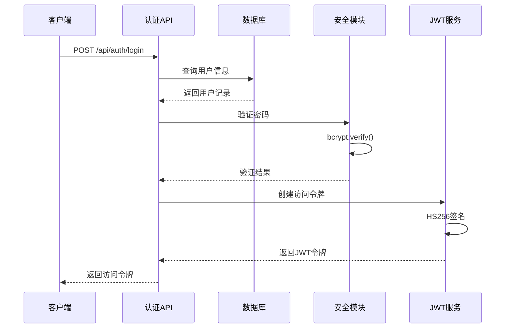

**图表来源**
- [auth.py](file://backend/app/api/auth.py#L24-L50)
- [security.py](file://backend/app/core/security.py#L11-L19)

## 详细组件分析

### 密码哈希实现

系统使用bcrypt作为密码哈希算法，具有以下特点：

#### bcrypt算法特性
- **自适应成本参数**：通过passlib的CryptContext自动管理
- **内置盐值**：每个密码都生成独特的随机盐值
- **渐进式复杂度**：支持调整计算难度以适应硬件升级
- **抗GPU攻击**：设计上抵抗并行计算攻击

#### 盐值生成机制

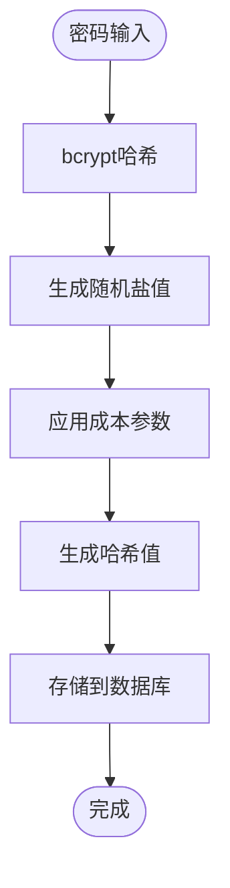

**图表来源**
- [security.py](file://backend/app/core/security.py#L24-L25)

#### 密码验证流程

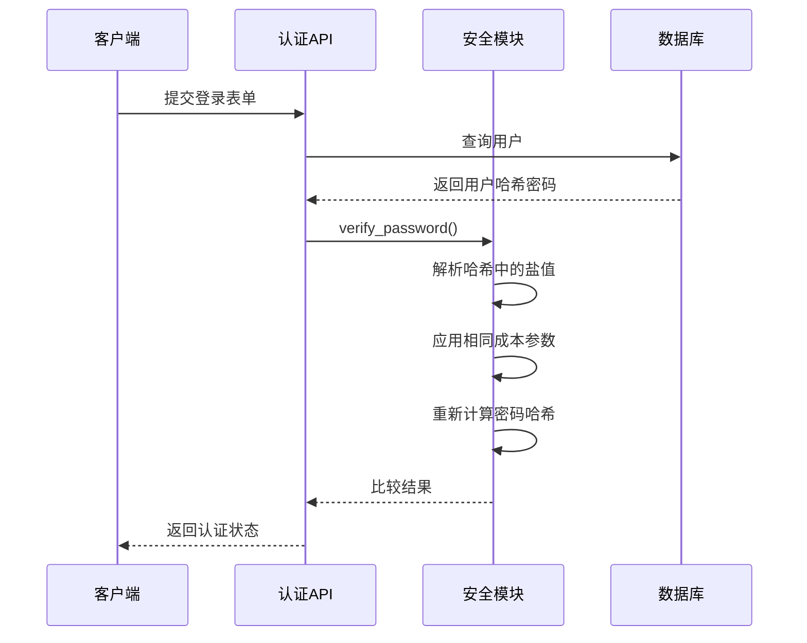

**图表来源**
- [auth.py](file://backend/app/api/auth.py#L38-L43)
- [security.py](file://backend/app/core/security.py#L21-L22)

**章节来源**
- [security.py](file://backend/app/core/security.py#L1-L26)
- [auth.py](file://backend/app/api/auth.py#L24-L50)

### JWT令牌系统

#### 令牌创建过程

系统使用HS256算法创建JWT令牌：

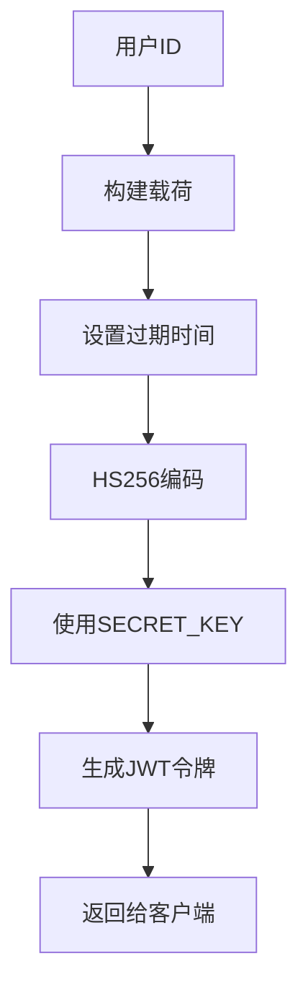

**图表来源**
- [security.py](file://backend/app/core/security.py#L11-L19)

#### 令牌验证机制

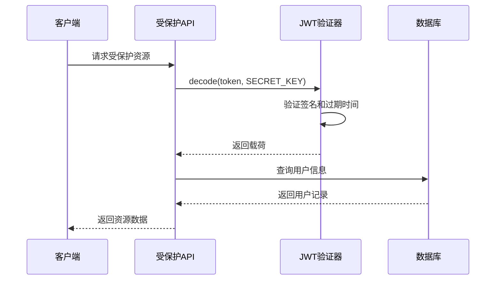

**图表来源**
- [deps.py](file://backend/app/api/deps.py#L17-L43)

**章节来源**
- [security.py](file://backend/app/core/security.py#L11-L19)
- [deps.py](file://backend/app/api/deps.py#L17-L43)

### 数据库安全设计

#### 用户模型安全字段

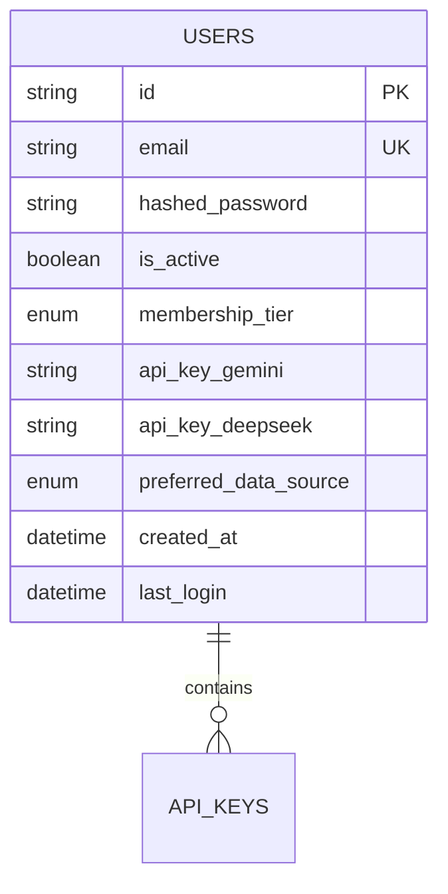

**图表来源**
- [user.py](file://backend/app/models/user.py#L15-L31)

#### 数据库连接安全

系统使用异步数据库连接，具有以下安全特性：
- **连接池管理**：自动管理数据库连接
- **异步操作**：避免阻塞主线程
- **环境变量配置**：敏感信息通过环境变量管理

**章节来源**
- [user.py](file://backend/app/models/user.py#L1-L31)
- [database.py](file://backend/app/core/database.py#L1-L24)

### 前端认证集成

#### 认证上下文管理

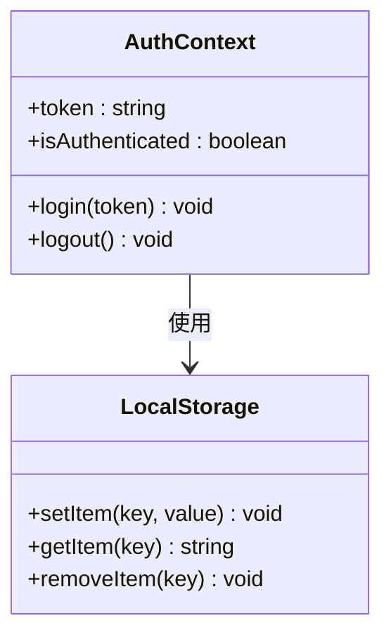

**图表来源**
- [AuthContext.tsx](file://frontend/context/AuthContext.tsx#L15-L51)

**章节来源**
- [AuthContext.tsx](file://frontend/context/AuthContext.tsx#L1-L59)
- [page.tsx](file://frontend/app/login/page.tsx#L1-L42)

## 依赖关系分析

### 外部依赖安全配置

系统依赖以下关键安全库：

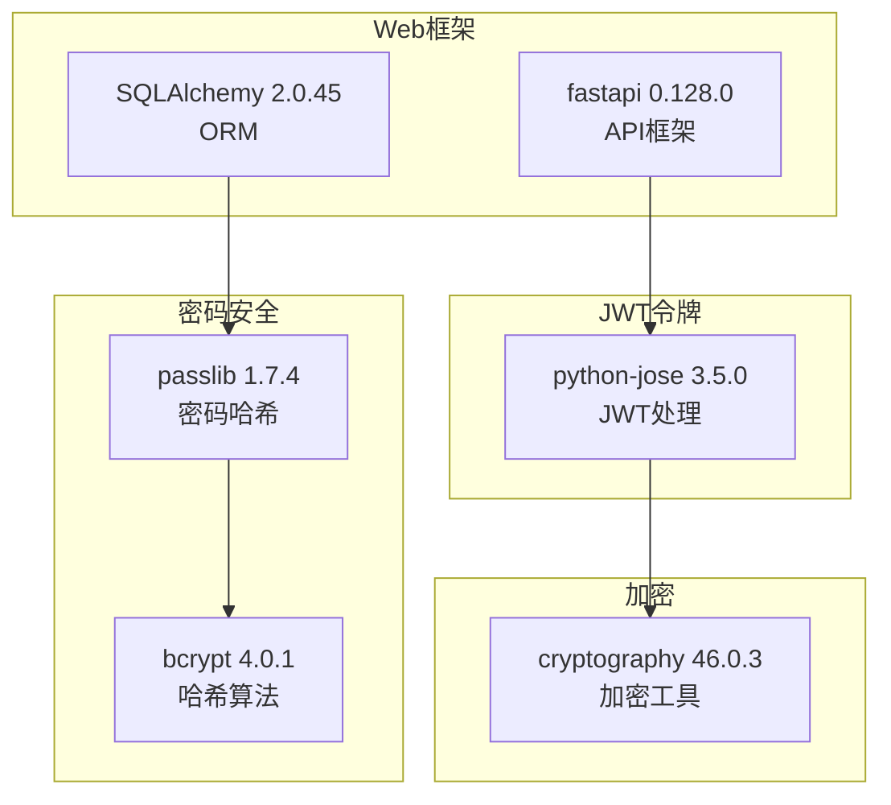

**图表来源**
- [requirements.txt](file://backend/requirements.txt#L42-L13)

### 配置管理

系统通过Pydantic Settings管理安全配置：

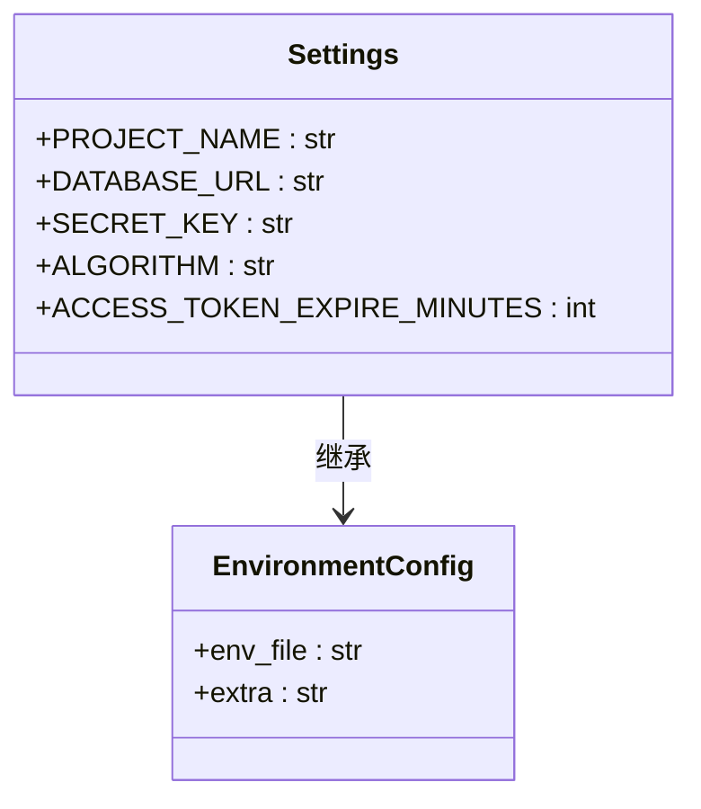

**图表来源**
- [config.py](file://backend/app/core/config.py#L4-L23)

**章节来源**
- [requirements.txt](file://backend/requirements.txt#L1-L75)
- [config.py](file://backend/app/core/config.py#L1-L24)

## 性能考虑

### 密码哈希性能优化

1. **成本参数调优**：bcrypt的成本参数需要根据硬件性能调整
2. **缓存策略**：对频繁访问的用户信息进行合理缓存
3. **异步处理**：使用异步数据库操作避免阻塞

### 令牌性能优化

1. **令牌大小控制**：JWT载荷应保持最小化
2. **过期时间管理**：合理设置令牌过期时间平衡安全性和性能
3. **并发处理**：使用异步请求处理提高吞吐量

## 故障排除指南

### 常见问题诊断

#### 密码验证失败

可能原因：
- 用户名或密码错误
- 数据库连接问题
- 密码哈希格式不匹配

解决步骤：
1. 检查用户名是否存在
2. 验证密码哈希存储格式
3. 查看数据库连接日志

#### 令牌验证错误

可能原因：
- SECRET_KEY配置错误
- 令牌过期
- 算法不匹配

解决步骤：
1. 确认环境变量配置
2. 检查令牌过期时间
3. 验证算法一致性

**章节来源**
- [auth.py](file://backend/app/api/auth.py#L38-L43)
- [deps.py](file://backend/app/api/deps.py#L21-L33)

### 调试方法

#### 后端调试

```python
# 在认证依赖中添加调试输出
print(f"DEBUG: Validating token: {token[:10]}...")
payload = jwt.decode(token, settings.SECRET_KEY, algorithms=[security.ALGORITHM])
print(f"DEBUG: Token payload: {payload}")
```

#### 前端调试

```javascript
// 在AuthContext中添加本地存储调试
localStorage.setItem("token", newToken);
console.log("Token stored:", localStorage.getItem("token"));
```

**章节来源**
- [deps.py](file://backend/app/api/deps.py#L22-L27)
- [AuthContext.tsx](file://frontend/context/AuthContext.tsx#L27-L29)

## 结论

本项目实现了完整的密码安全与加密解决方案，具有以下优势：

1. **安全性**：采用bcrypt密码哈希和JWT令牌机制
2. **可扩展性**：模块化设计便于功能扩展
3. **性能**：异步处理和合理的缓存策略
4. **维护性**：清晰的代码结构和完善的错误处理

建议的改进方向：
- 实现密码重置功能
- 添加多因素认证支持
- 增强安全审计日志
- 实施更严格的密码强度验证

该系统为AI股票顾问平台提供了坚实的安全基础，确保用户数据和交易信息的安全性。