# 用户管理与状态

<cite>
**本文档引用的文件**
- [backend/app/models/user.py](file://backend/app/models/user.py)
- [backend/app/models/ai_config.py](file://backend/app/models/ai_config.py)
- [backend/app/api/v1/endpoints/auth.py](file://backend/app/api/v1/endpoints/auth.py)
- [backend/app/api/v1/endpoints/user.py](file://backend/app/api/v1/endpoints/user.py)
- [backend/app/api/deps.py](file://backend/app/api/deps.py)
- [backend/app/core/security.py](file://backend/app/core/security.py)
- [backend/app/core/config.py](file://backend/app/core/config.py)
- [backend/app/core/database.py](file://backend/app/core/database.py)
- [backend/app/main.py](file://backend/app/main.py)
- [frontend/context/AuthContext.tsx](file://frontend/context/AuthContext.tsx)
- [frontend/app/login/page.tsx](file://frontend/app/login/page.tsx)
- [frontend/app/register/page.tsx](file://frontend/app/register/page.tsx)
- [frontend/app/layout.tsx](file://frontend/app/layout.tsx)
- [frontend/app/settings/page.tsx](file://frontend/app/settings/page.tsx)
- [frontend/app/profile/page.tsx](file://frontend/app/profile/page.tsx)
- [frontend/app/password/page.tsx](file://frontend/app/password/page.tsx)
- [backend/app/schemas/user_settings.py](file://backend/app/schemas/user_settings.py)
- [frontend/types/schema.d.ts](file://frontend/types/schema.d.ts)
</cite>

## 更新摘要
**变更内容**
- 新增多AI提供商API密钥管理功能
- 扩展用户模型以支持会员等级跟踪
- 添加AI模型偏好设置和配置管理
- 实现API密钥的安全加密存储
- 新增AI模型配置表和管理功能

## 目录
1. [简介](#简介)
2. [项目结构](#项目结构)
3. [核心组件](#核心组件)
4. [架构概览](#架构概览)
5. [详细组件分析](#详细组件分析)
6. [依赖关系分析](#依赖关系分析)
7. [性能考虑](#性能考虑)
8. [故障排除指南](#故障排除指南)
9. [结论](#结论)

## 简介

本项目是一个基于FastAPI和Next.js构建的AI股票顾问平台，实现了完整的用户管理系统和状态管理机制。系统采用前后端分离架构，后端提供RESTful API服务，前端通过React Context模式管理用户认证状态。最新版本扩展了用户模型，支持多AI提供商API密钥管理、会员等级跟踪和AI模型偏好设置。

## 项目结构

项目采用模块化组织方式，分为后端API服务和前端应用两大部分：

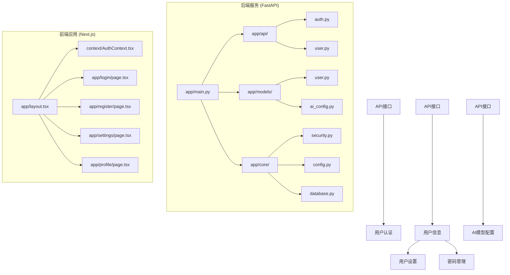

**图表来源**
- [backend/app/main.py](file://backend/app/main.py#L24-L29)
- [frontend/app/layout.tsx](file://frontend/app/layout.tsx#L20-L38)

**章节来源**
- [backend/app/main.py](file://backend/app/main.py#L24-L29)
- [frontend/app/layout.tsx](file://frontend/app/layout.tsx#L20-L38)

## 核心组件

### 数据模型设计

系统的核心数据模型围绕用户实体构建，采用SQLAlchemy ORM进行数据库映射，并扩展了多AI提供商支持：

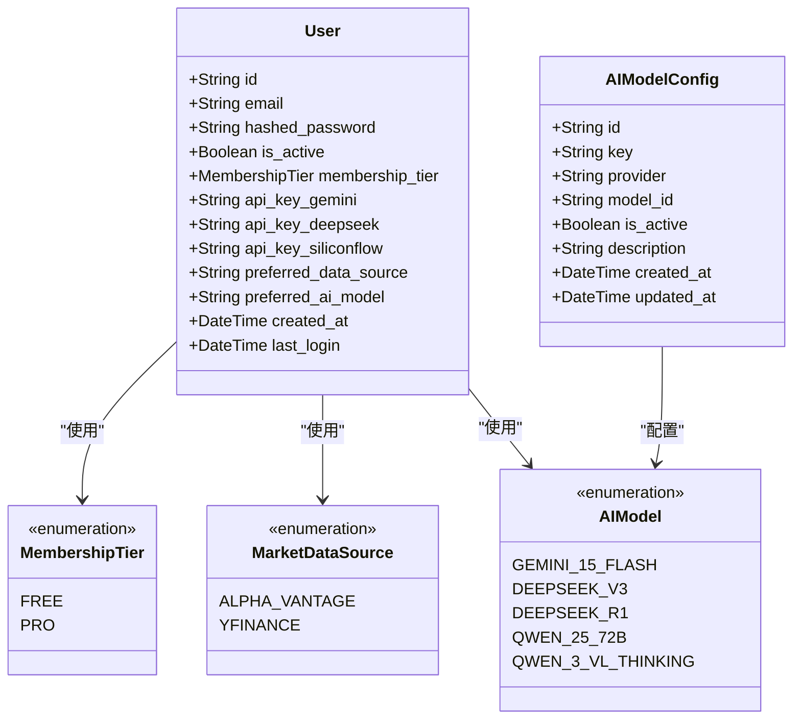

**图表来源**
- [backend/app/models/user.py](file://backend/app/models/user.py#L9-L26)
- [backend/app/models/user.py](file://backend/app/models/user.py#L29-L64)
- [backend/app/models/ai_config.py](file://backend/app/models/ai_config.py#L6-L20)

### 安全机制

系统实现了基于JWT的认证机制，包括密码哈希、令牌生成和验证，以及API密钥的加密存储：

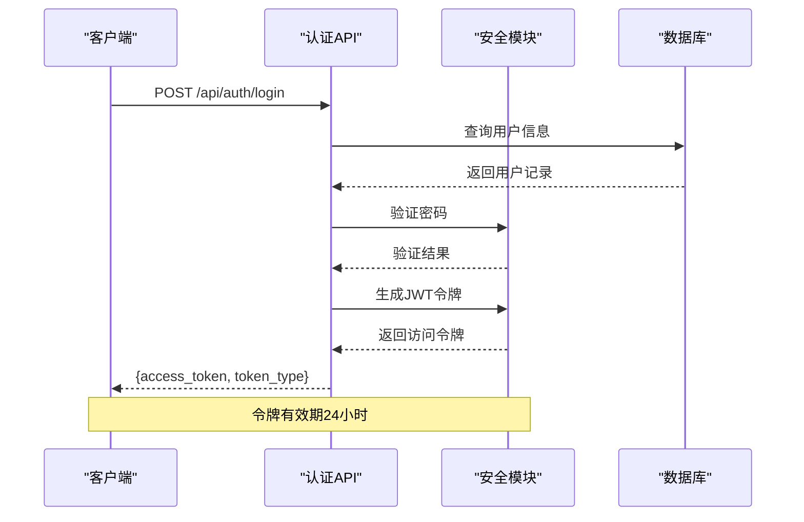

**图表来源**
- [backend/app/api/v1/endpoints/auth.py](file://backend/app/api/v1/endpoints/auth.py#L24-L50)
- [backend/app/core/security.py](file://backend/app/core/security.py#L31-L39)

**章节来源**
- [backend/app/models/user.py](file://backend/app/models/user.py#L9-L26)
- [backend/app/core/security.py](file://backend/app/core/security.py#L12-L29)

## 架构概览

系统采用分层架构设计，清晰分离了表现层、业务逻辑层和数据访问层，并新增了AI模型配置管理：

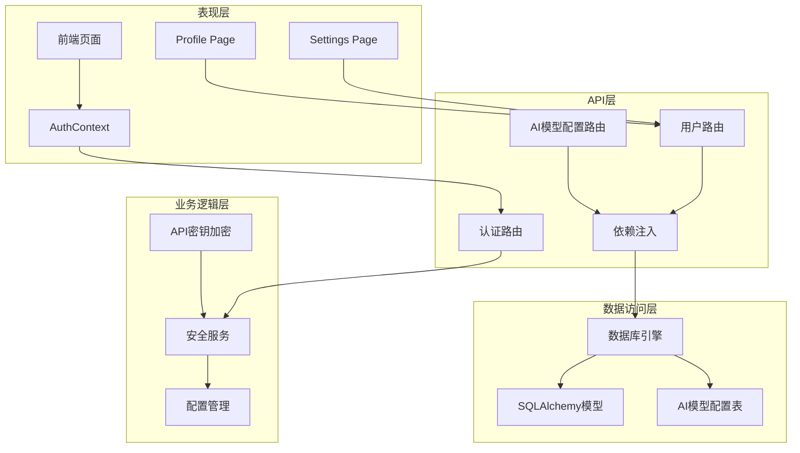

**图表来源**
- [backend/app/main.py](file://backend/app/main.py#L24-L29)
- [frontend/context/AuthContext.tsx](file://frontend/context/AuthContext.tsx#L15-L51)

## 详细组件分析

### 用户实体数据模型

用户实体是整个系统的核心，设计遵循以下原则：

#### 字段定义与约束

| 字段名 | 类型 | 约束 | 描述 |
|--------|------|------|------|
| id | String | 主键, 默认UUID | 用户唯一标识符 |
| email | String | 唯一索引, 非空 | 用户邮箱地址 |
| hashed_password | String | 非空 | 加密后的用户密码 |
| is_active | Boolean | 默认True | 用户账户激活状态 |
| membership_tier | Enum | 默认FREE | 会员等级 (FREE/PRO) |
| api_key_gemini | String | 可选 | Google Gemini API密钥 |
| api_key_deepseek | String | 可选 | DeepSeek API密钥 |
| api_key_siliconflow | String | 可选 | SiliconFlow API密钥 |
| preferred_data_source | Enum | 默认ALPHA_VANTAGE | 首选数据源 |
| preferred_ai_model | Enum | 默认QWEN_3_VL_THINKING | 首选AI模型 |
| created_at | DateTime | 默认当前时间 | 账户创建时间 |
| last_login | DateTime | 可选 | 最后登录时间 |

#### 索引策略

系统为提高查询性能设置了以下索引：
- `users.email`: 唯一索引，确保邮箱唯一性
- `users.id`: 主键索引，保证用户标识唯一性
- `ai_model_configs.key`: 唯一索引，确保AI模型键唯一性

#### 会员等级功能

系统支持两种会员等级：
- **FREE**: 基础用户，有限制的AI分析次数
- **PRO**: 专业用户，无限制的AI分析功能

**章节来源**
- [backend/app/models/user.py](file://backend/app/models/user.py#L9-L26)
- [backend/app/models/user.py](file://backend/app/models/user.py#L29-L64)

### 用户注册流程

注册流程实现了完整的用户创建和验证机制：

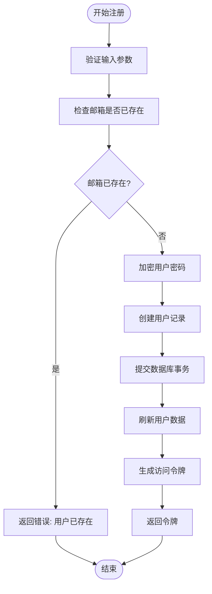

**图表来源**
- [backend/app/api/v1/endpoints/auth.py](file://backend/app/api/v1/endpoints/auth.py#L52-L87)

#### 注册流程特点

1. **邮箱唯一性检查**: 在创建用户前验证邮箱是否已被使用
2. **密码安全处理**: 使用bcrypt算法对密码进行哈希加密
3. **自动登录机制**: 注册成功后立即颁发访问令牌
4. **错误处理**: 提供详细的错误信息反馈

**章节来源**
- [backend/app/api/v1/endpoints/auth.py](file://backend/app/api/v1/endpoints/auth.py#L52-L87)

### 用户登录机制

登录机制提供了安全的用户身份验证：

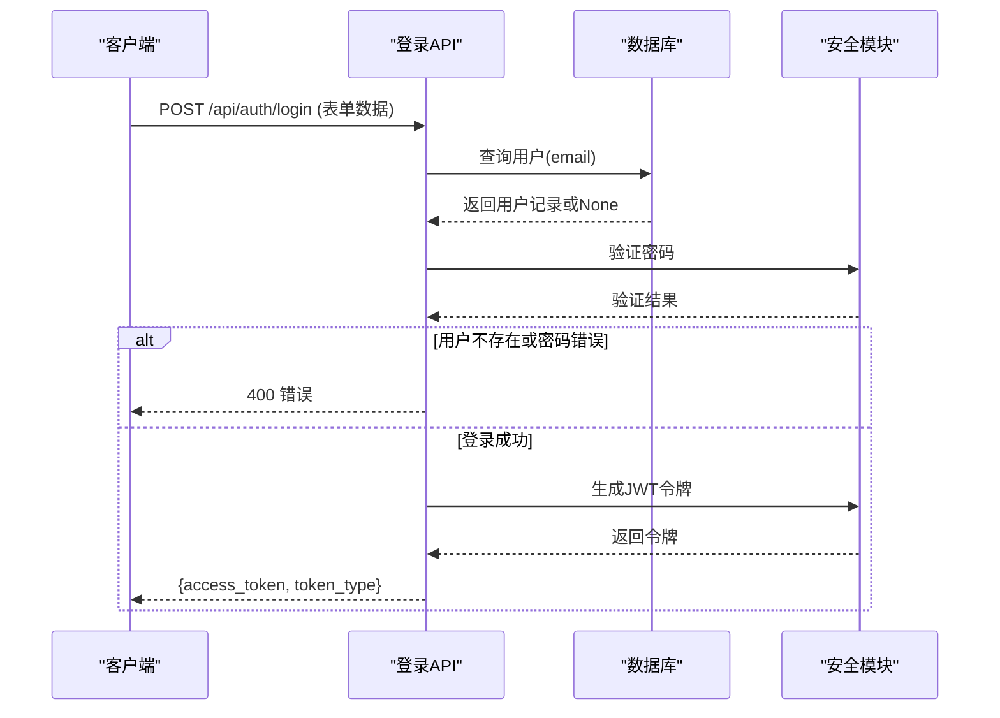

**图表来源**
- [backend/app/api/v1/endpoints/auth.py](file://backend/app/api/v1/endpoints/auth.py#L24-L50)
- [backend/app/api/deps.py](file://backend/app/api/deps.py#L17-L43)

#### 登录特性

1. **OAuth2密码模式**: 使用标准OAuth2协议进行认证
2. **JWT令牌**: 生成24小时有效期的访问令牌
3. **凭据验证**: 后端验证用户名和密码的正确性
4. **错误处理**: 提供明确的认证失败原因

**章节来源**
- [backend/app/api/v1/endpoints/auth.py](file://backend/app/api/v1/endpoints/auth.py#L24-L50)
- [backend/app/api/deps.py](file://backend/app/api/deps.py#L13-L43)

### 用户状态管理

前端采用React Context模式实现全局状态管理：

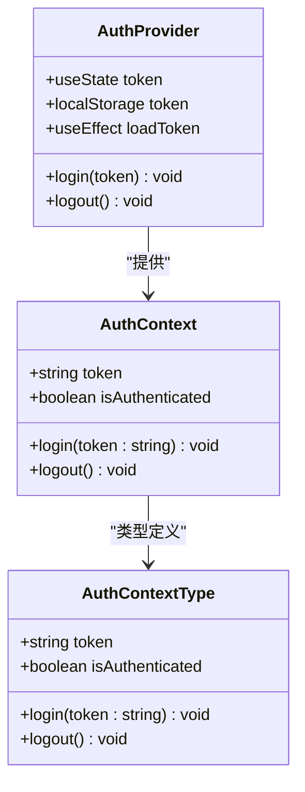

**图表来源**
- [frontend/context/AuthContext.tsx](file://frontend/context/AuthContext.tsx#L6-L11)
- [frontend/context/AuthContext.tsx](file://frontend/context/AuthContext.tsx#L15-L51)

#### 状态管理模式

1. **Provider封装**: 将认证状态提升到应用根组件
2. **Hook使用**: 提供useAuth Hook简化状态访问
3. **本地存储**: 使用localStorage持久化令牌
4. **自动加载**: 应用启动时自动从localStorage加载令牌

**章节来源**
- [frontend/context/AuthContext.tsx](file://frontend/context/AuthContext.tsx#L15-L51)

### 用户信息获取与更新

用户信息管理提供了个人信息查看和设置更新功能：

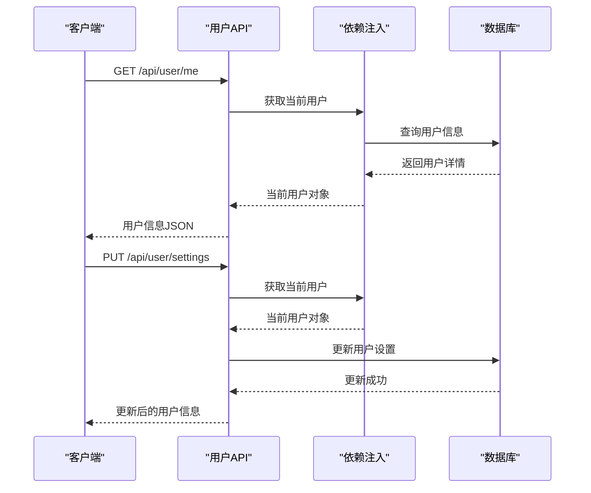

**图表来源**
- [backend/app/api/v1/endpoints/user.py](file://backend/app/api/v1/endpoints/user.py#L12-L23)
- [backend/app/api/v1/endpoints/user.py](file://backend/app/api/v1/endpoints/user.py#L41-L75)

#### 功能特性

1. **个人信息查询**: 支持获取当前用户的完整信息，包括会员等级和API密钥状态
2. **设置更新**: 允许更新API密钥、首选数据源和AI模型偏好
3. **密码管理**: 支持安全的密码修改功能
4. **响应格式**: 统一的用户信息和设置响应格式
5. **权限控制**: 基于JWT令牌的受保护路由

**章节来源**
- [backend/app/api/v1/endpoints/user.py](file://backend/app/api/v1/endpoints/user.py#L12-L75)
- [backend/app/schemas/user_settings.py](file://backend/app/schemas/user_settings.py#L4-L24)

### AI模型配置管理

系统新增了AI模型配置管理功能，支持多提供商模型的统一管理：

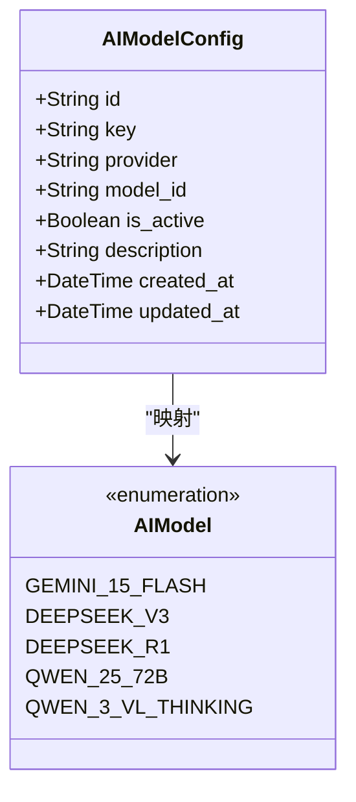

**图表来源**
- [backend/app/models/ai_config.py](file://backend/app/models/ai_config.py#L6-L20)

#### 配置特性

1. **多提供商支持**: 支持Gemini、DeepSeek、Qwen等多家AI提供商
2. **模型标准化**: 通过统一的key标识不同AI模型
3. **状态管理**: 支持启用/禁用AI模型
4. **描述信息**: 提供详细的模型描述和用途说明

**章节来源**
- [backend/app/models/ai_config.py](file://backend/app/models/ai_config.py#L6-L20)

### API密钥加密机制

系统实现了API密钥的安全存储机制：

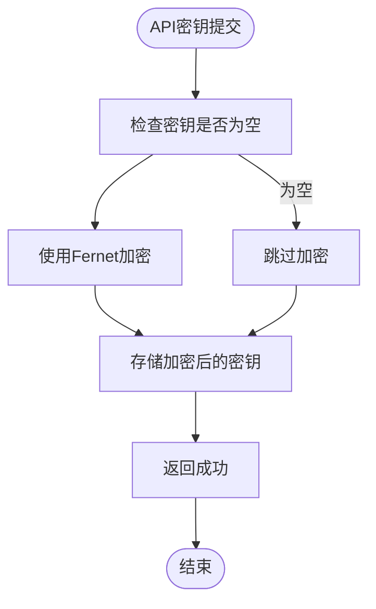

**图表来源**
- [backend/app/core/security.py](file://backend/app/core/security.py#L12-L29)

#### 加密特性

1. **对称加密**: 使用Fernet对称加密算法
2. **密钥管理**: 通过配置文件管理加密密钥
3. **降级处理**: 如果加密密钥未配置，回退到明文存储
4. **解密兼容**: 支持旧版本明文密钥的解密

**章节来源**
- [backend/app/core/security.py](file://backend/app/core/security.py#L12-L29)

### 注销流程与会话清理

系统实现了完整的注销机制：

```mermaid
flowchart TD
Start([用户点击注销]) --> RemoveToken["从localStorage移除令牌"]
RemoveToken --> ClearState["清除内存中的token状态"]
ClearState --> Redirect["重定向到登录页面"]
Redirect --> End([注销完成])
subgraph "前端组件"
A[AuthContext.logout]
B[localStorage.removeItem]
C[setToken(null)]
D[router.push('/login')]
end
A --> B
A --> C
A --> D
```

**图表来源**
- [frontend/context/AuthContext.tsx](file://frontend/context/AuthContext.tsx#L41-L45)

#### 注销特性

1. **本地清理**: 移除localStorage中的令牌
2. **状态重置**: 清除内存中的认证状态
3. **导航重定向**: 自动跳转到登录页面
4. **无后端状态**: 采用无状态JWT令牌设计

**章节来源**
- [frontend/context/AuthContext.tsx](file://frontend/context/AuthContext.tsx#L41-L45)

## 依赖关系分析

系统各组件之间的依赖关系清晰明确：

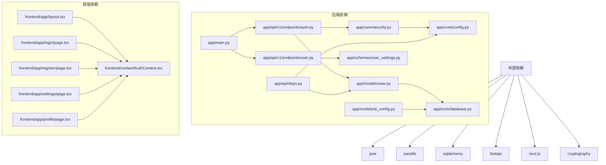

**图表来源**
- [backend/app/main.py](file://backend/app/main.py#L24-L29)
- [frontend/app/layout.tsx](file://frontend/app/layout.tsx#L20-L38)

**章节来源**
- [backend/app/main.py](file://backend/app/main.py#L24-L29)
- [frontend/app/layout.tsx](file://frontend/app/layout.tsx#L20-L38)

## 性能考虑

### 数据库优化

1. **索引策略**: 为常用查询字段建立索引
2. **连接池**: 使用异步数据库连接池提高并发性能
3. **查询优化**: 使用ORM进行高效的数据查询
4. **AI模型配置缓存**: 缓存活跃的AI模型配置减少查询开销

### 缓存策略

1. **令牌缓存**: JWT令牌在内存中验证，避免数据库查询
2. **静态资源**: 前端静态资源通过CDN加速
3. **API响应**: 合理的API响应格式减少数据传输
4. **用户设置缓存**: 缓存用户偏好的设置减少数据库访问

### 安全优化

1. **密码哈希**: 使用bcrypt算法确保密码安全
2. **令牌过期**: 设置合理的令牌过期时间
3. **CORS配置**: 开发环境允许跨域请求，生产环境严格限制
4. **API密钥加密**: 敏感信息使用对称加密存储
5. **访问控制**: 基于会员等级的访问权限控制

## 故障排除指南

### 常见问题及解决方案

#### 认证失败

**问题**: 用户登录时报错"用户名或密码不正确"
**原因**: 
- 用户名或密码输入错误
- 用户账户被禁用
- 数据库连接问题

**解决方案**:
1. 检查用户名和密码输入
2. 验证用户账户状态
3. 确认数据库连接正常

#### 令牌验证失败

**问题**: API调用返回"无法验证凭据"
**原因**:
- 令牌过期
- 令牌格式错误
- 密钥配置错误

**解决方案**:
1. 重新登录获取新令牌
2. 检查令牌格式和内容
3. 验证SECRET_KEY配置

#### API密钥存储问题

**问题**: API密钥保存后无法使用
**原因**:
- ENCRYPTION_KEY配置错误
- 加密密钥格式不正确
- 数据库迁移问题

**解决方案**:
1. 检查ENCRYPTION_KEY配置
2. 确认加密密钥为32字节Base64编码
3. 运行数据库迁移脚本

#### 数据库连接问题

**问题**: 注册或登录时数据库操作失败
**原因**:
- 数据库URL配置错误
- 数据库服务未启动
- 权限不足

**解决方案**:
1. 检查DATABASE_URL配置
2. 确认数据库服务运行状态
3. 验证数据库权限设置

#### AI模型配置问题

**问题**: 选择的AI模型不可用
**原因**:
- AI模型配置表为空
- 模型被禁用
- 配置数据不完整

**解决方案**:
1. 检查AI模型配置表数据
2. 确认模型状态为激活
3. 验证模型配置完整性

**章节来源**
- [backend/app/api/v1/endpoints/auth.py](file://backend/app/api/v1/endpoints/auth.py#L38-L43)
- [backend/app/api/deps.py](file://backend/app/api/deps.py#L28-L33)
- [backend/app/core/security.py](file://backend/app/core/security.py#L15-L18)

## 结论

本项目实现了完整的用户管理和状态管理机制，具有以下特点：

1. **安全性**: 采用JWT令牌认证，密码使用bcrypt哈希加密，API密钥使用对称加密存储
2. **可扩展性**: 模块化设计便于功能扩展和维护，支持多AI提供商集成
3. **用户体验**: 前后端分离架构提供良好的用户体验，支持会员等级差异化功能
4. **性能**: 异步数据库操作和合理的缓存策略，AI模型配置缓存优化
5. **灵活性**: 支持多种AI提供商和模型选择，用户可以根据需求调整偏好设置

建议在生产环境中进一步完善的方面：
- 实现邮箱验证功能
- 添加多因素认证支持
- 增强API限流和防护机制
- 完善日志记录和监控系统
- 实现API密钥轮换和审计功能
- 添加AI模型使用统计和分析功能