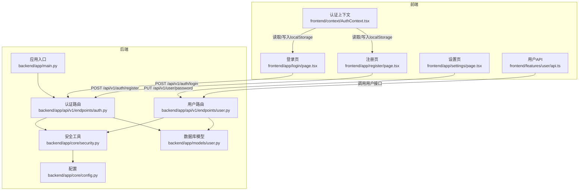
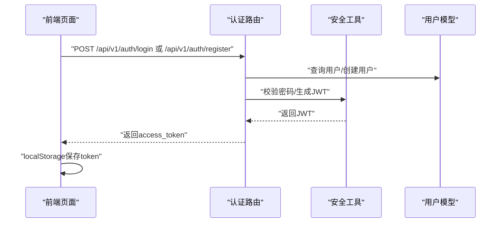
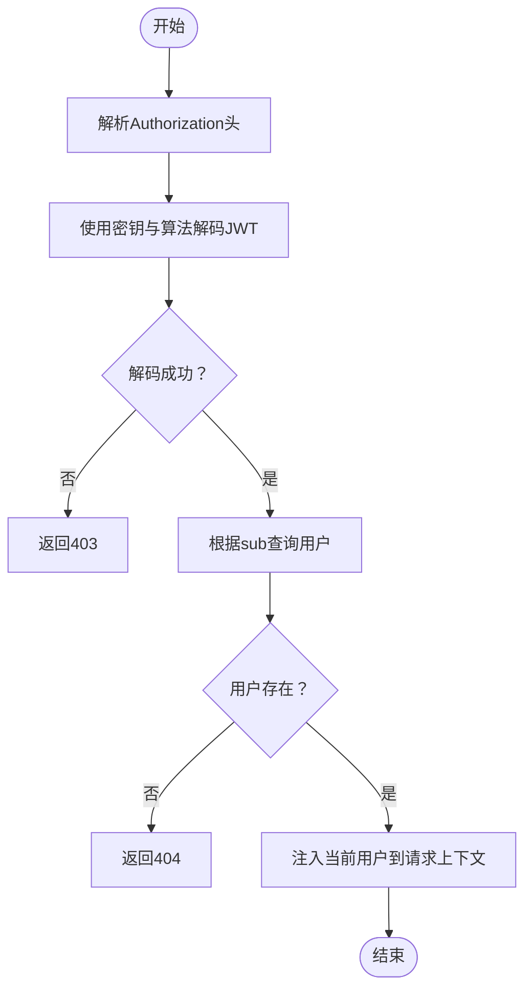
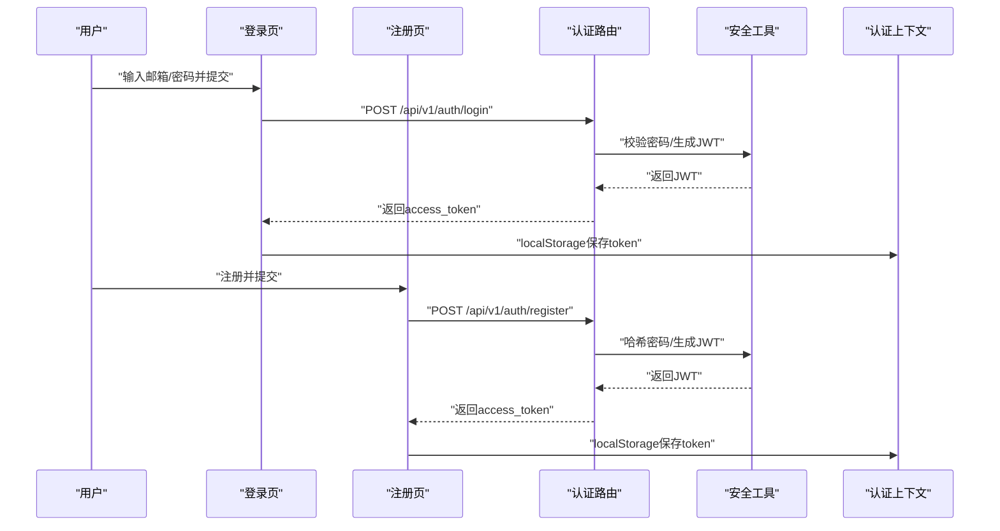
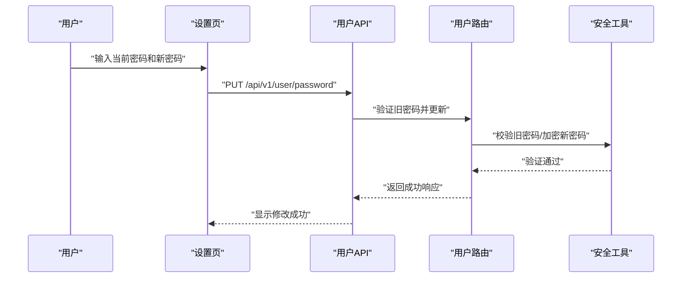
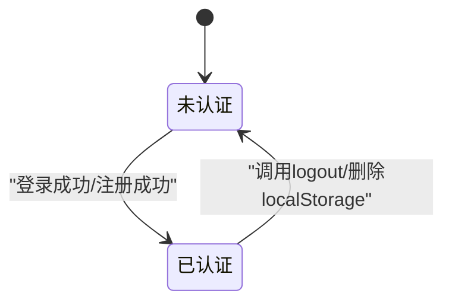
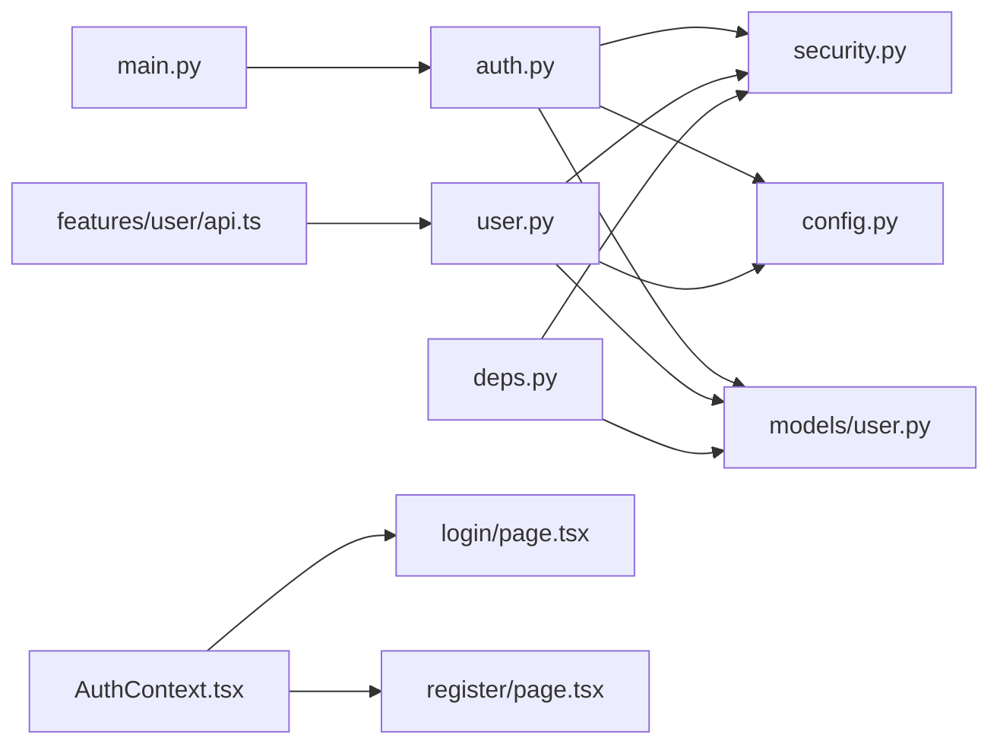

# 用户认证系统

<cite>
**本文档引用的文件**
- [backend/app/api/v1/endpoints/auth.py](file://backend/app/api/v1/endpoints/auth.py)
- [backend/app/api/v1/endpoints/user.py](file://backend/app/api/v1/endpoints/user.py)
- [backend/app/core/security.py](file://backend/app/core/security.py)
- [backend/app/core/config.py](file://backend/app/core/config.py)
- [backend/app/models/user.py](file://backend/app/models/user.py)
- [backend/app/main.py](file://backend/app/main.py)
- [frontend/context/AuthContext.tsx](file://frontend/context/AuthContext.tsx)
- [frontend/app/login/page.tsx](file://frontend/app/login/page.tsx)
- [frontend/app/register/page.tsx](file://frontend/app/register/page.tsx)
- [frontend/app/settings/page.tsx](file://frontend/app/settings/page.tsx)
- [frontend/features/user/api.ts](file://frontend/features/user/api.ts)
- [.env.example](file://.env.example)
</cite>

## 目录
1. [简介](#简介)
2. [项目结构](#项目结构)
3. [核心组件](#核心组件)
4. [架构总览](#架构总览)
5. [详细组件分析](#详细组件分析)
6. [依赖关系分析](#依赖关系分析)
7. [性能考虑](#性能考虑)
8. [故障排除指南](#故障排除指南)
9. [结论](#结论)
10. [附录](#附录)

## 简介
本文件为"AI股票顾问"项目的用户认证系统提供完整技术文档。内容涵盖：
- JWT认证机制：令牌生成、验证与过期策略
- OAuth2密码流集成与当前实现方式
- 密码加密与哈希策略（bcrypt）
- 权限控制与路由保护现状
- 会话管理与安全令牌存储
- 认证流程图与状态转换图
- 常见安全威胁防护与最佳实践
- 前端认证状态管理与路由保护
- 调试工具与故障排除指南

**重要更新**：根据最新的前端架构变更，密码重置功能已被移除，用户认证和设置管理流程得到简化和优化。

## 项目结构
认证系统由后端FastAPI服务与前端Next.js应用组成，采用前后端分离架构：
- 后端负责用户注册、登录、JWT签发与校验、数据库交互
- 前端负责表单提交、本地存储令牌、路由跳转与上下文状态管理

**图表来源**
- [backend/app/main.py:1-38](file://backend/app/main.py#L1-L38)
- [backend/app/api/v1/endpoints/auth.py:1-83](file://backend/app/api/v1/endpoints/auth.py#L1-L83)
- [backend/app/api/v1/endpoints/user.py:1-397](file://backend/app/api/v1/endpoints/user.py#L1-L397)
- [backend/app/core/security.py:1-26](file://backend/app/core/security.py#L1-L26)
- [backend/app/core/config.py:1-24](file://backend/app/core/config.py#L1-L24)
- [backend/app/models/user.py:1-31](file://backend/app/models/user.py#L1-L31)
- [frontend/context/AuthContext.tsx:1-121](file://frontend/context/AuthContext.tsx#L1-L121)
- [frontend/app/login/page.tsx:1-89](file://frontend/app/login/page.tsx#L1-L89)
- [frontend/app/register/page.tsx:1-84](file://frontend/app/register/page.tsx#L1-L84)
- [frontend/app/settings/page.tsx:1-898](file://frontend/app/settings/page.tsx#L1-L898)
- [frontend/features/user/api.ts:1-86](file://frontend/features/user/api.ts#L1-L86)

**章节来源**
- [backend/app/main.py:1-38](file://backend/app/main.py#L1-L38)
- [backend/app/api/v1/endpoints/auth.py:1-83](file://backend/app/api/v1/endpoints/auth.py#L1-L83)
- [backend/app/api/v1/endpoints/user.py:1-397](file://backend/app/api/v1/endpoints/user.py#L1-L397)
- [backend/app/core/security.py:1-26](file://backend/app/core/security.py#L1-L26)
- [backend/app/core/config.py:1-24](file://backend/app/core/config.py#L1-L24)
- [backend/app/models/user.py:1-31](file://backend/app/models/user.py#L1-L31)
- [frontend/context/AuthContext.tsx:1-121](file://frontend/context/AuthContext.tsx#L1-L121)
- [frontend/app/login/page.tsx:1-89](file://frontend/app/login/page.tsx#L1-L89)
- [frontend/app/register/page.tsx:1-84](file://frontend/app/register/page.tsx#L1-L84)
- [frontend/app/settings/page.tsx:1-898](file://frontend/app/settings/page.tsx#L1-L898)
- [frontend/features/user/api.ts:1-86](file://frontend/features/user/api.ts#L1-L86)

## 核心组件
- 认证路由与控制器
  - 登录接口：接收用户名/密码，校验后签发JWT
  - 注册接口：检查邮箱唯一性，加密密码后创建用户并签发JWT
- 用户设置管理
  - 密码修改接口：验证旧密码后更新为新密码
  - 用户资料查询：获取用户完整配置信息
- 安全工具
  - JWT生成：基于HS256算法，使用密钥签名
  - 密码处理：bcrypt哈希与校验
- 依赖注入与路由保护
  - OAuth2密码流适配器，从Authorization头解析令牌
  - 解析JWT载荷，查询用户并注入到请求上下文
- 数据模型
  - 用户实体含邮箱、哈希密码、激活状态、会员等级等字段
- 前端认证上下文
  - 在localStorage中持久化JWT，提供登录/登出与认证状态判断

**章节来源**
- [backend/app/api/v1/endpoints/auth.py:24-82](file://backend/app/api/v1/endpoints/auth.py#L24-L82)
- [backend/app/api/v1/endpoints/user.py:100-115](file://backend/app/api/v1/endpoints/user.py#L100-L115)
- [backend/app/core/security.py:11-25](file://backend/app/core/security.py#L11-L25)
- [backend/app/api/deps.py:13-43](file://backend/app/api/deps.py#L13-L43)
- [backend/app/models/user.py:15-31](file://backend/app/models/user.py#L15-L31)
- [frontend/context/AuthContext.tsx:15-51](file://frontend/context/AuthContext.tsx#L15-L51)

## 架构总览
下图展示认证端到端流程：前端发起登录/注册请求，后端完成身份验证与令牌签发，前端存储令牌并在后续请求中携带。

**图表来源**
- [backend/app/api/v1/endpoints/auth.py:24-82](file://backend/app/api/v1/endpoints/auth.py#L24-L82)
- [backend/app/core/security.py:11-25](file://backend/app/core/security.py#L11-L25)
- [backend/app/models/user.py:15-31](file://backend/app/models/user.py#L15-L31)
- [frontend/app/login/page.tsx:19-42](file://frontend/app/login/page.tsx#L19-L42)
- [frontend/app/register/page.tsx:19-37](file://frontend/app/register/page.tsx#L19-L37)

## 详细组件分析

### JWT认证机制
- 令牌生成
  - 使用HS256算法，载荷包含过期时间与用户标识
  - 过期时间可按配置设置，默认约24小时
- 令牌验证
  - 通过OAuth2PasswordBearer从Authorization头提取令牌
  - 使用相同密钥与算法解码，提取sub作为用户ID
  - 查询数据库确认用户存在且有效
- 刷新策略
  - 当前未实现刷新令牌机制；建议引入短期访问令牌+长期刷新令牌的双令牌模式

**图表来源**
- [backend/app/api/deps.py:17-43](file://backend/app/api/deps.py#L17-L43)
- [backend/app/core/security.py:11-19](file://backend/app/core/security.py#L11-L19)
- [backend/app/core/config.py:9-11](file://backend/app/core/config.py#L9-L11)

**章节来源**
- [backend/app/core/security.py:11-19](file://backend/app/core/security.py#L11-L19)
- [backend/app/api/deps.py:17-43](file://backend/app/api/deps.py#L17-L43)
- [backend/app/core/config.py:9-11](file://backend/app/core/config.py#L9-L11)

### OAuth2集成与第三方提供商
- 当前实现
  - 使用FastAPI内置的OAuth2PasswordBearer适配器
  - 令牌端点为"/api/v1/auth/login"，遵循标准OAuth2密码流
- 第三方提供商
  - 代码库未包含OAuth2授权码流程或第三方登录（如Google、GitHub）集成
  - 如需扩展，可在认证路由中新增授权码端点与回调处理

**章节来源**
- [backend/app/api/deps.py:13-15](file://backend/app/api/deps.py#L13-L15)
- [backend/app/main.py:26-29](file://backend/app/main.py#L26-L29)

### 密码加密与哈希策略
- 算法
  - bcrypt哈希，自动处理盐值生成与比较
- 存储
  - 数据库存储为hashed_password字段，不保存明文
- 安全性
  - 建议定期轮换SECRET_KEY，避免硬编码在代码中

**章节来源**
- [backend/app/core/security.py:7-25](file://backend/app/core/security.py#L7-L25)
- [backend/app/models/user.py](file://backend/app/models/user.py#L20)

### 权限控制系统与访问控制
- 角色管理
  - 当前未定义角色字段；用户模型包含会员等级枚举
- 访问控制
  - 通过依赖注入的get_current_user实现"需要登录"的路由保护
  - 可在现有依赖基础上扩展角色/权限装饰器以实现更细粒度控制

**章节来源**
- [backend/app/api/deps.py:17-43](file://backend/app/api/deps.py#L17-L43)
- [backend/app/models/user.py:7-10](file://backend/app/models/user.py#L7-L10)

### 会话管理与安全令牌存储
- 会话
  - 无服务端会话；基于JWT的无状态认证
- 令牌存储
  - 前端使用localStorage持久化access_token
  - 建议迁移到HttpOnly Cookie以降低XSS风险

**章节来源**
- [frontend/context/AuthContext.tsx:15-51](file://frontend/context/AuthContext.tsx#L15-L51)
- [frontend/app/login/page.tsx:29-36](file://frontend/app/login/page.tsx#L29-L36)
- [frontend/app/register/page.tsx:25-31](file://frontend/app/register/page.tsx#L25-L31)

### 前端认证状态管理与路由保护
- 状态管理
  - AuthContext在内存中维护token状态，并同步localStorage
  - 提供login/logout与isAuthenticated判断
- 路由保护
  - 当前未在前端实现路由守卫；建议在Next.js中间件或布局中基于AuthContext进行保护

**章节来源**
- [frontend/context/AuthContext.tsx:6-11](file://frontend/context/AuthContext.tsx#L6-L11)
- [frontend/context/AuthContext.tsx:15-51](file://frontend/context/AuthContext.tsx#L15-L51)

### 用户认证与设置管理流程

#### 登录/注册流程

**图表来源**
- [frontend/app/login/page.tsx:19-42](file://frontend/app/login/page.tsx#L19-L42)
- [frontend/app/register/page.tsx:19-37](file://frontend/app/register/page.tsx#L19-L37)
- [backend/app/api/v1/endpoints/auth.py:24-82](file://backend/app/api/v1/endpoints/auth.py#L24-L82)
- [backend/app/core/security.py:11-25](file://backend/app/core/security.py#L11-L25)
- [frontend/context/AuthContext.tsx:27-31](file://frontend/context/AuthContext.tsx#L27-L31)

#### 密码修改流程
**重要更新**：密码重置功能已被移除，用户只能通过当前密码修改新密码。

**图表来源**
- [frontend/app/settings/page.tsx:427-448](file://frontend/app/settings/page.tsx#L427-L448)
- [frontend/features/user/api.ts:62-65](file://frontend/features/user/api.ts#L62-L65)
- [backend/app/api/v1/endpoints/user.py:100-115](file://backend/app/api/v1/endpoints/user.py#L100-L115)
- [backend/app/core/security.py:11-25](file://backend/app/core/security.py#L11-L25)

### 认证状态机

**图表来源**
- [frontend/context/AuthContext.tsx:33-37](file://frontend/context/AuthContext.tsx#L33-L37)

## 依赖关系分析
- 组件耦合
  - 认证路由依赖安全工具与数据库模型
  - 路由保护依赖OAuth2适配器与JWT解码
- 外部依赖
  - jose用于JWT编解码
  - passlib用于bcrypt哈希
  - SQLAlchemy异步会话用于数据访问

**图表来源**
- [backend/app/api/v1/endpoints/auth.py:1-14](file://backend/app/api/v1/endpoints/auth.py#L1-L14)
- [backend/app/api/v1/endpoints/user.py:1-27](file://backend/app/api/v1/endpoints/user.py#L1-L27)
- [backend/app/api/deps.py:1-11](file://backend/app/api/deps.py#L1-L11)
- [backend/app/core/security.py:1-5](file://backend/app/core/security.py#L1-L5)
- [backend/app/core/config.py:1-24](file://backend/app/core/config.py#L1-L24)
- [backend/app/models/user.py:1-6](file://backend/app/models/user.py#L1-L6)
- [frontend/context/AuthContext.tsx:1-11](file://frontend/context/AuthContext.tsx#L1-L11)
- [frontend/app/login/page.tsx:1-10](file://frontend/app/login/page.tsx#L1-L10)
- [frontend/app/register/page.tsx:1-10](file://frontend/app/register/page.tsx#L1-L10)
- [frontend/features/user/api.ts:1-7](file://frontend/features/user/api.ts#L1-L7)
- [backend/app/main.py:24-29](file://backend/app/main.py#L24-L29)

**章节来源**
- [backend/app/api/v1/endpoints/auth.py:1-14](file://backend/app/api/v1/endpoints/auth.py#L1-L14)
- [backend/app/api/v1/endpoints/user.py:1-27](file://backend/app/api/v1/endpoints/user.py#L1-L27)
- [backend/app/api/deps.py:1-11](file://backend/app/api/deps.py#L1-L11)
- [backend/app/core/security.py:1-5](file://backend/app/core/security.py#L1-L5)
- [backend/app/core/config.py:1-24](file://backend/app/core/config.py#L1-L24)
- [backend/app/models/user.py:1-6](file://backend/app/models/user.py#L1-L6)
- [frontend/context/AuthContext.tsx:1-11](file://frontend/context/AuthContext.tsx#L1-L11)
- [frontend/app/login/page.tsx:1-10](file://frontend/app/login/page.tsx#L1-L10)
- [frontend/app/register/page.tsx:1-10](file://frontend/app/register/page.tsx#L1-L10)
- [frontend/features/user/api.ts:1-7](file://frontend/features/user/api.ts#L1-L7)
- [backend/app/main.py:24-29](file://backend/app/main.py#L24-L29)

## 性能考虑
- JWT解码开销极小，适合高并发场景
- 建议启用HTTPS与短路径重定向，减少不必要的跨域请求
- 对于高频接口，可考虑缓存用户基础信息以降低数据库查询压力

## 故障排除指南
- 常见错误与定位
  - 400 错误：用户名或密码不正确
    - 检查前端表单提交格式与后端密码校验逻辑
  - 403 错误：无法验证凭据
    - 检查JWT签名密钥、算法与载荷结构
  - 404 错误：用户不存在
    - 检查用户ID是否正确，数据库中是否存在该用户
- 调试技巧
  - 后端在依赖解析函数中打印调试日志，便于追踪令牌与载荷
  - 前端在登录/注册成功后检查localStorage中的token是否正确写入
- 环境变量
  - 确保SECRET_KEY与数据库URL正确配置，避免默认值导致的安全问题

**章节来源**
- [backend/app/api/v1/endpoints/auth.py:38-43](file://backend/app/api/v1/endpoints/auth.py#L38-L43)
- [backend/app/api/deps.py:21-33](file://backend/app/api/deps.py#L21-L33)
- [frontend/context/AuthContext.tsx:19-25](file://frontend/context/AuthContext.tsx#L19-L25)
- [.env.example:1-9](file://.env.example#L1-L9)

## 结论
当前认证系统基于JWT与bcrypt实现了基本的登录/注册能力，具备良好的扩展性。根据最新的前端架构变更，密码重置功能已被移除，用户认证和设置管理流程得到简化。建议下一步完善：
- 引入刷新令牌与安全存储（HttpOnly Cookie）
- 扩展角色/权限体系与路由保护
- 添加OAuth2授权码流程与第三方登录
- 加强安全配置与监控告警

## 附录
- 配置项参考
  - SECRET_KEY：JWT签名密钥
  - ACCESS_TOKEN_EXPIRE_MINUTES：访问令牌过期间隔
  - DATABASE_URL：数据库连接字符串
- 前端API地址
  - NEXT_PUBLIC_API_URL：后端API根地址

**章节来源**
- [backend/app/core/config.py:8-11](file://backend/app/core/config.py#L8-L11)
- [.env.example:2-8](file://.env.example#L2-L8)
- [frontend/app/login/page.tsx:29-33](file://frontend/app/login/page.tsx#L29-L33)
- [frontend/app/register/page.tsx:25-28](file://frontend/app/register/page.tsx#L25-L28)