# 认证API接口

<cite>
**本文档引用的文件**
- [backend/app/api/auth.py](file://backend/app/api/auth.py)
- [backend/app/core/security.py](file://backend/app/core/security.py)
- [backend/app/api/deps.py](file://backend/app/api/deps.py)
- [backend/app/models/user.py](file://backend/app/models/user.py)
- [backend/app/core/config.py](file://backend/app/core/config.py)
- [backend/app/core/database.py](file://backend/app/core/database.py)
- [backend/app/main.py](file://backend/app/main.py)
- [.env.example](file://.env.example)
- [frontend/app/login/page.tsx](file://frontend/app/login/page.tsx)
- [frontend/app/register/page.tsx](file://frontend/app/register/page.tsx)
- [frontend/context/AuthContext.tsx](file://frontend/context/AuthContext.tsx)
</cite>

## 目录
1. [简介](#简介)
2. [项目结构](#项目结构)
3. [核心组件](#核心组件)
4. [架构概览](#架构概览)
5. [详细组件分析](#详细组件分析)
6. [依赖关系分析](#依赖关系分析)
7. [性能考虑](#性能考虑)
8. [故障排除指南](#故障排除指南)
9. [结论](#结论)
10. [附录](#附录)

## 简介

本文件为AI智能投资顾问系统的认证API接口详细文档。该系统基于FastAPI构建，提供了完整的用户认证功能，包括登录和注册两个核心端点。系统采用JWT（JSON Web Token）进行身份验证，使用bcrypt算法进行密码哈希加密，并通过依赖注入机制管理数据库连接和安全配置。

认证系统支持OAuth2密码流，为前端应用提供标准的认证体验。系统设计遵循RESTful API原则，提供清晰的错误响应和状态码，确保开发者的易用性和生产环境的稳定性。

## 项目结构

认证API位于后端应用的API层中，采用模块化设计，主要包含以下关键文件：

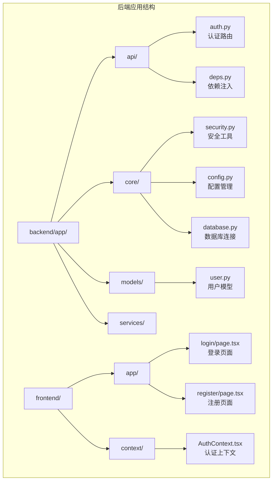

**图表来源**
- [backend/app/api/auth.py](file://backend/app/api/auth.py#L1-L88)
- [backend/app/core/security.py](file://backend/app/core/security.py#L1-L26)
- [backend/app/models/user.py](file://backend/app/models/user.py#L1-L31)

**章节来源**
- [backend/app/main.py](file://backend/app/main.py#L24-L29)
- [backend/app/api/auth.py](file://backend/app/api/auth.py#L1-L14)

## 核心组件

认证系统由多个核心组件构成，每个组件都有明确的职责和交互关系：

### 主要组件概述

1. **认证路由器 (Auth Router)**: 处理所有认证相关的HTTP请求
2. **安全工具 (Security Utilities)**: 提供密码哈希、JWT令牌生成和验证功能
3. **用户模型 (User Model)**: 定义用户数据结构和数据库映射
4. **依赖注入系统 (Dependency Injection)**: 管理数据库连接和认证流程
5. **配置管理 (Configuration)**: 提供系统运行时参数设置

### 组件交互图

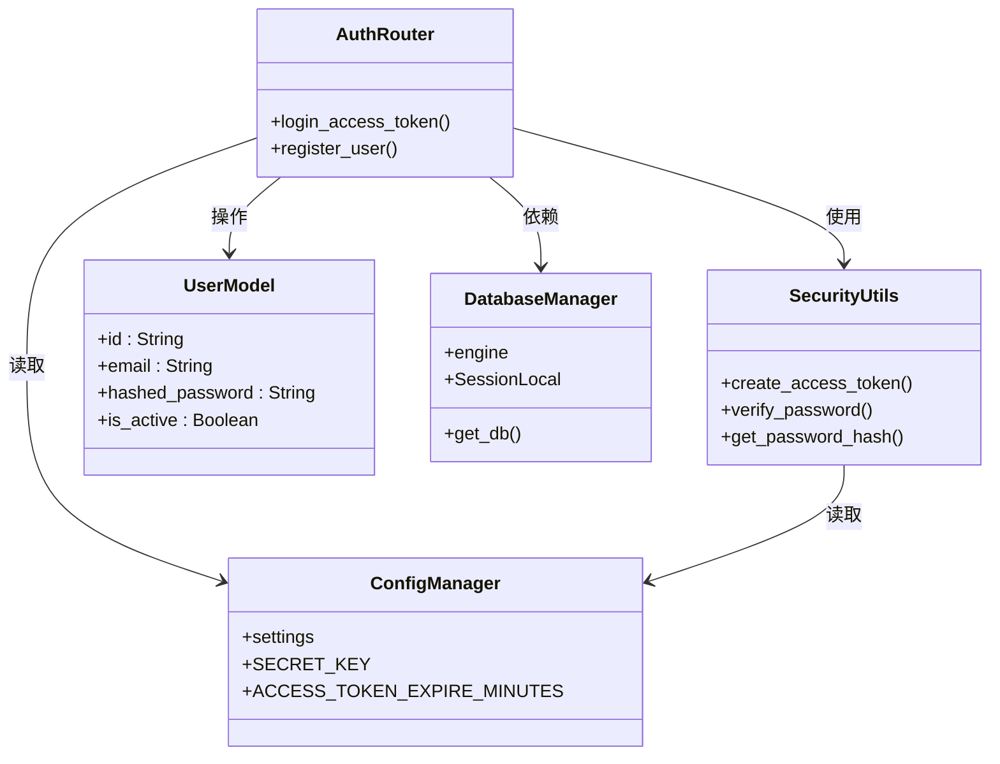

**图表来源**
- [backend/app/api/auth.py](file://backend/app/api/auth.py#L24-L87)
- [backend/app/core/security.py](file://backend/app/core/security.py#L11-L25)
- [backend/app/models/user.py](file://backend/app/models/user.py#L15-L31)
- [backend/app/core/database.py](file://backend/app/core/database.py#L21-L23)
- [backend/app/core/config.py](file://backend/app/core/config.py#L4-L11)

**章节来源**
- [backend/app/api/auth.py](file://backend/app/api/auth.py#L1-L88)
- [backend/app/core/security.py](file://backend/app/core/security.py#L1-L26)
- [backend/app/models/user.py](file://backend/app/models/user.py#L1-L31)

## 架构概览

认证系统的整体架构采用分层设计，确保关注点分离和代码可维护性：

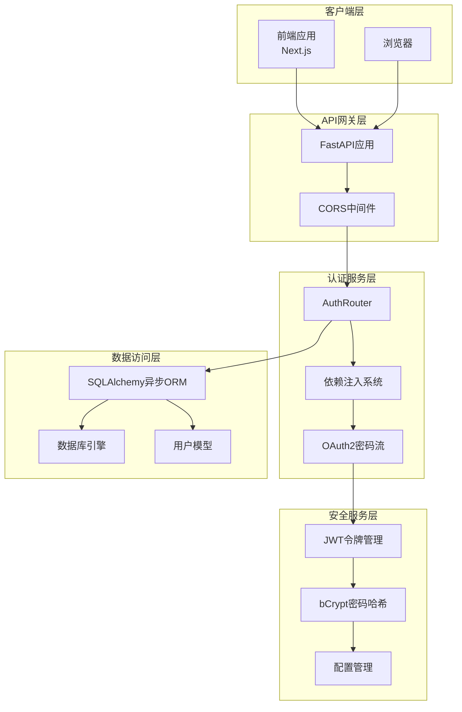

**图表来源**
- [backend/app/main.py](file://backend/app/main.py#L1-L38)
- [backend/app/api/auth.py](file://backend/app/api/auth.py#L1-L88)
- [backend/app/api/deps.py](file://backend/app/api/deps.py#L1-L44)

### 数据流序列图

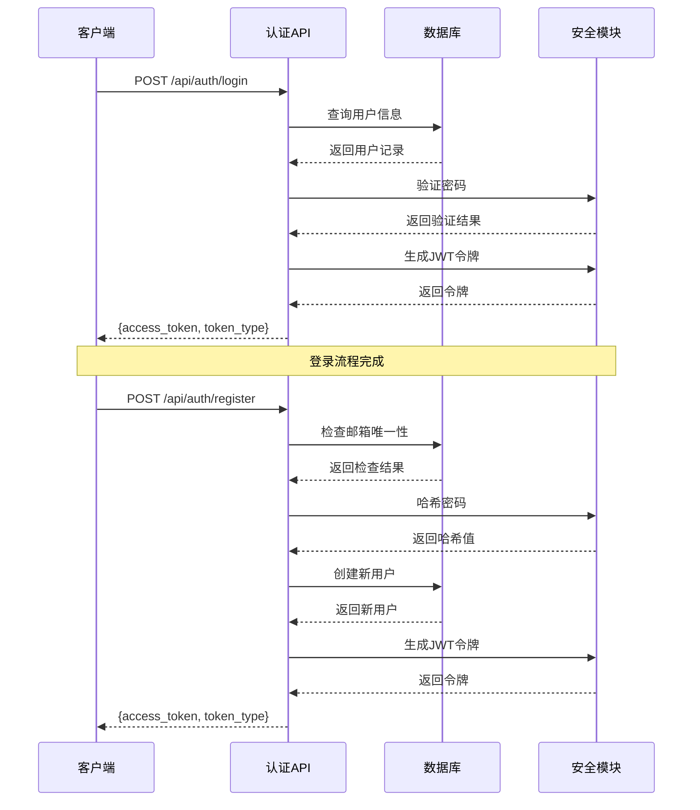

**图表来源**
- [backend/app/api/auth.py](file://backend/app/api/auth.py#L24-L87)
- [backend/app/core/security.py](file://backend/app/core/security.py#L11-L25)

## 详细组件分析

### 认证路由组件

认证路由组件是系统的核心入口点，负责处理所有认证相关的HTTP请求。该组件实现了两个主要端点：登录和注册。

#### 登录端点 (/login)

登录端点使用OAuth2密码流，通过`OAuth2PasswordRequestForm`接收用户名和密码参数：

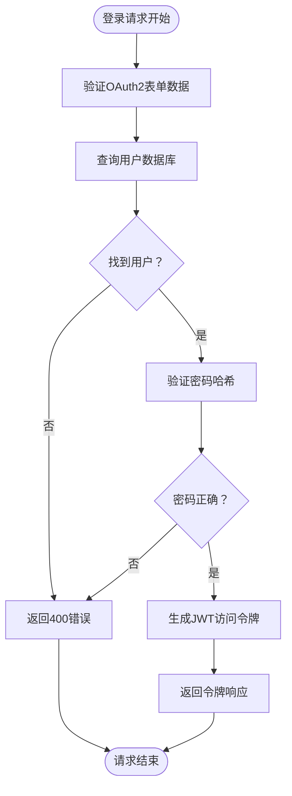

**图表来源**
- [backend/app/api/auth.py](file://backend/app/api/auth.py#L24-L50)

#### 注册端点 (/register)

注册端点提供用户账户创建功能，包含邮箱唯一性检查和密码安全处理：

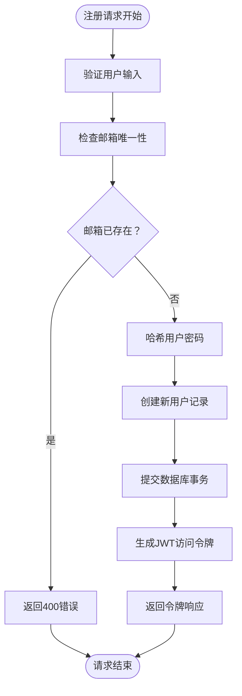

**图表来源**
- [backend/app/api/auth.py](file://backend/app/api/auth.py#L52-L87)

**章节来源**
- [backend/app/api/auth.py](file://backend/app/api/auth.py#L24-L87)

### 安全工具组件

安全工具组件提供了密码处理和JWT令牌管理的核心功能：

#### 密码处理机制

系统使用bcrypt算法进行密码哈希，确保密码存储的安全性：

| 功能 | 实现方式 | 安全特性 |
|------|----------|----------|
| 密码哈希 | bcrypt算法 | 防暴力破解，带盐值 |
| 密码验证 | 哈希比较 | 时间常数比较 |
| 令牌生成 | JWT HS256 | 对称密钥签名 |

#### JWT令牌管理

令牌系统采用标准的JWT格式，包含必要的声明和过期时间控制：

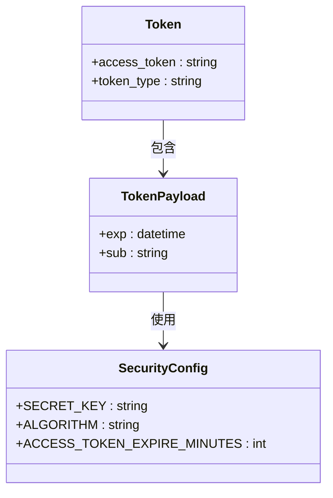

**图表来源**
- [backend/app/api/auth.py](file://backend/app/api/auth.py#L20-L22)
- [backend/app/core/security.py](file://backend/app/core/security.py#L11-L19)
- [backend/app/core/config.py](file://backend/app/core/config.py#L8-L11)

**章节来源**
- [backend/app/core/security.py](file://backend/app/core/security.py#L1-L26)
- [backend/app/core/config.py](file://backend/app/core/config.py#L1-L24)

### 数据模型组件

用户模型定义了认证系统中的核心数据结构，采用SQLAlchemy ORM进行数据库映射：

#### 用户实体结构

| 字段名 | 类型 | 约束 | 描述 |
|--------|------|------|------|
| id | String | 主键，UUID | 用户唯一标识符 |
| email | String | 唯一索引，非空 | 用户邮箱地址 |
| hashed_password | String | 非空 | bcrypt哈希后的密码 |
| is_active | Boolean | 默认true | 用户账户激活状态 |
| membership_tier | Enum | 默认FREE | 用户会员等级 |
| created_at | DateTime | 默认当前时间 | 账户创建时间 |
| last_login | DateTime | 可为空 | 最后登录时间 |

#### 数据模型关系图

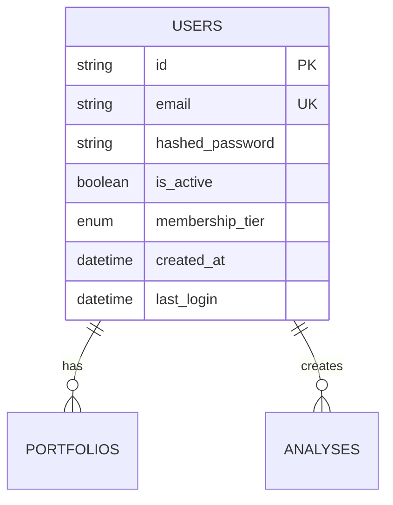

**图表来源**
- [backend/app/models/user.py](file://backend/app/models/user.py#L15-L31)

**章节来源**
- [backend/app/models/user.py](file://backend/app/models/user.py#L1-L31)

### 依赖注入系统

依赖注入系统通过FastAPI的Depends机制实现，提供统一的数据库连接管理和认证流程控制：

#### 依赖注入流程

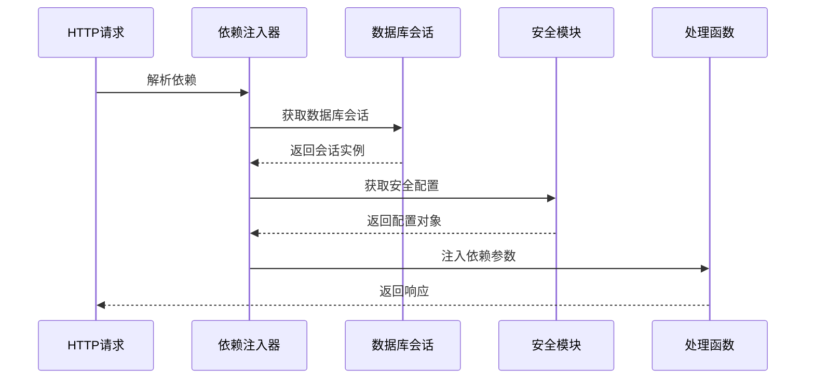

**图表来源**
- [backend/app/api/auth.py](file://backend/app/api/auth.py#L10-L11)
- [backend/app/api/deps.py](file://backend/app/api/deps.py#L17-L43)

#### 当前用户获取机制

系统提供了一个通用的依赖注入函数来获取当前认证用户：

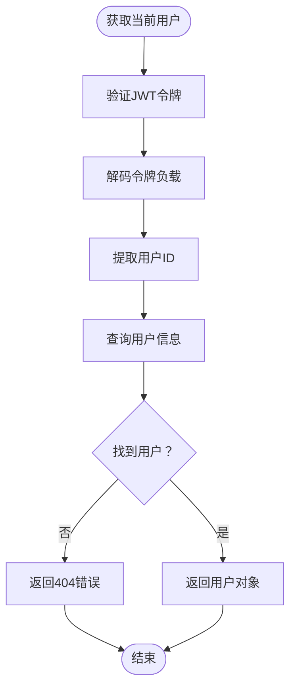

**图表来源**
- [backend/app/api/deps.py](file://backend/app/api/deps.py#L17-L43)

**章节来源**
- [backend/app/api/deps.py](file://backend/app/api/deps.py#L1-L44)

## 依赖关系分析

认证系统的依赖关系体现了清晰的关注点分离和模块化设计：

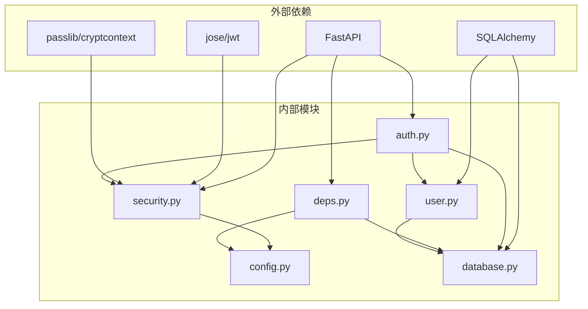

**图表来源**
- [backend/app/api/auth.py](file://backend/app/api/auth.py#L1-L12)
- [backend/app/core/security.py](file://backend/app/core/security.py#L1-L5)
- [backend/app/models/user.py](file://backend/app/models/user.py#L1-L4)

### 循环依赖检测

经过分析，系统没有发现循环依赖问题：
- 认证模块不依赖其他业务模块
- 安全模块独立于业务逻辑
- 数据库模块提供基础设施支持
- 配置模块被所有组件依赖但不反向依赖

**章节来源**
- [backend/app/api/auth.py](file://backend/app/api/auth.py#L1-L12)
- [backend/app/core/security.py](file://backend/app/core/security.py#L1-L5)
- [backend/app/models/user.py](file://backend/app/models/user.py#L1-L4)

## 性能考虑

认证系统的性能优化主要体现在以下几个方面：

### 数据库查询优化

1. **索引策略**: 用户邮箱字段建立唯一索引，确保查询效率
2. **查询优化**: 使用单一查询语句获取用户信息，避免N+1查询问题
3. **连接池管理**: 异步数据库连接池提高并发处理能力

### 缓存策略

虽然当前实现未包含缓存层，但系统设计允许轻松集成：
- JWT令牌可以缓存到Redis等内存数据库
- 用户会话信息可以短期缓存
- 配置信息可以本地缓存

### 并发处理

系统采用异步编程模型：
- SQLAlchemy异步引擎支持高并发
- FastAPI异步路由处理请求
- 无阻塞的密码哈希计算

## 故障排除指南

### 常见错误类型及解决方案

#### 认证错误

| 错误类型 | HTTP状态码 | 错误详情 | 解决方案 |
|----------|------------|----------|----------|
| 凭证无效 | 400 Bad Request | 邮箱或密码错误 | 检查用户输入，确认账户状态 |
| 用户不存在 | 404 Not Found | 用户ID在令牌中找不到 | 检查数据库连接和用户数据 |
| 权限不足 | 403 Forbidden | 无法验证凭据 | 检查JWT密钥和算法配置 |

#### 数据库错误

| 错误类型 | 可能原因 | 解决方案 |
|----------|----------|----------|
| 连接超时 | 数据库服务器不可达 | 检查数据库URL和网络连接 |
| 事务冲突 | 并发写入冲突 | 实施重试机制和乐观锁 |
| 索引失效 | 邮箱唯一约束冲突 | 检查数据库索引状态 |

#### 安全相关错误

| 错误类型 | 触发条件 | 预防措施 |
|----------|----------|----------|
| 密码泄露 | 明文传输 | 启用HTTPS，使用安全连接 |
| 令牌劫持 | 令牌暴露 | 设置合理过期时间，使用HttpOnly Cookie |
| 穷举攻击 | 多次尝试登录 | 实施账户锁定和速率限制 |

### 调试工具和方法

#### 后端调试

1. **日志输出**: 系统包含调试打印语句，可用于跟踪令牌验证过程
2. **数据库查询**: SQLAlchemy的echo功能显示SQL查询语句
3. **配置验证**: 检查环境变量和配置文件设置

#### 前端调试

1. **浏览器开发者工具**: 监控网络请求和响应
2. **状态管理**: 检查AuthContext的状态变化
3. **本地存储**: 验证JWT令牌的存储和传递

**章节来源**
- [backend/app/api/deps.py](file://backend/app/api/deps.py#L21-L33)
- [backend/app/core/database.py](file://backend/app/core/database.py#L7-L8)

## 结论

AI智能投资顾问系统的认证API接口设计完整、安全且易于使用。系统采用了现代Web应用的最佳实践，包括：

1. **安全性**: 使用JWT令牌和bcrypt密码哈希确保数据安全
2. **可扩展性**: 模块化设计支持功能扩展和性能优化
3. **易用性**: 清晰的API设计和错误处理提升开发体验
4. **可靠性**: 完善的错误处理和调试工具确保系统稳定

建议在生产环境中进一步完善的方面：
- 添加速率限制和防暴力破解机制
- 实施更严格的输入验证和清理
- 集成更高级的缓存策略
- 添加审计日志功能

## 附录

### API响应格式

#### 成功响应

所有认证端点都返回标准化的Token模型：

| 字段名 | 类型 | 必需 | 描述 |
|--------|------|------|------|
| access_token | string | 是 | JWT访问令牌 |
| token_type | string | 是 | 令牌类型，固定为"bearer" |

#### 错误响应

错误响应遵循HTTP标准，包含状态码和详细描述：

```json
{
  "detail": "错误描述信息"
}
```

### API调用示例

#### curl命令示例

**登录请求**:
```bash
curl -X POST "http://localhost:8000/api/auth/login" \
  -H "Content-Type: application/x-www-form-urlencoded" \
  -d "username=john@example.com" \
  -d "password=your_password"
```

**注册请求**:
```bash
curl -X POST "http://localhost:8000/api/auth/register" \
  -H "Content-Type: application/json" \
  -d '{"email":"john@example.com","password":"your_password"}'
```

#### JavaScript代码示例

**登录功能**:
```javascript
// 使用FormData进行OAuth2密码流
const formData = new FormData();
formData.append('username', email);
formData.append('password', password);

const response = await fetch('/api/auth/login', {
  method: 'POST',
  body: formData,
  headers: {
    'Content-Type': 'application/x-www-form-urlencoded'
  }
});

const { access_token } = await response.json();
localStorage.setItem('token', access_token);
```

**注册功能**:
```javascript
// 使用JSON进行用户注册
const response = await fetch('/api/auth/register', {
  method: 'POST',
  headers: {
    'Content-Type': 'application/json'
  },
  body: JSON.stringify({
    email: email,
    password: password
  })
});

const { access_token } = await response.json();
localStorage.setItem('token', access_token);
```

### HTTP状态码参考

| 状态码 | 用途 | 典型场景 |
|--------|------|----------|
| 200 OK | 请求成功 | 正常的认证响应 |
| 400 Bad Request | 客户端错误 | 凭证无效或格式错误 |
| 403 Forbidden | 权限不足 | 令牌验证失败 |
| 404 Not Found | 资源不存在 | 用户不存在 |
| 500 Internal Server Error | 服务器错误 | 数据库连接失败 |

### 安全最佳实践

1. **配置管理**: 在生产环境中使用强随机密钥和HTTPS
2. **令牌管理**: 设置合理的过期时间和刷新机制
3. **输入验证**: 实施严格的输入验证和清理
4. **错误处理**: 避免泄露敏感信息的错误细节
5. **监控审计**: 实施日志记录和异常监控

**章节来源**
- [backend/app/api/auth.py](file://backend/app/api/auth.py#L20-L22)
- [backend/app/core/config.py](file://backend/app/core/config.py#L8-L11)
- [frontend/app/login/page.tsx](file://frontend/app/login/page.tsx#L24-L33)
- [frontend/app/register/page.tsx](file://frontend/app/register/page.tsx#L24-L28)