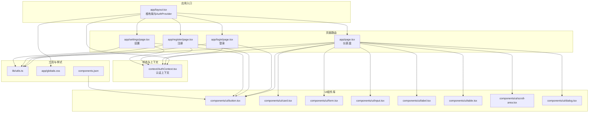
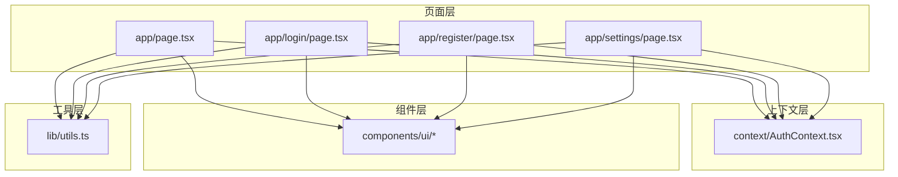
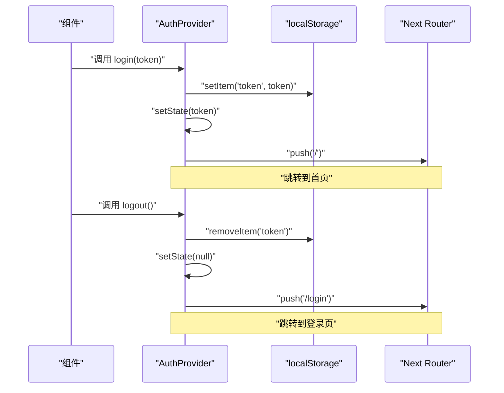
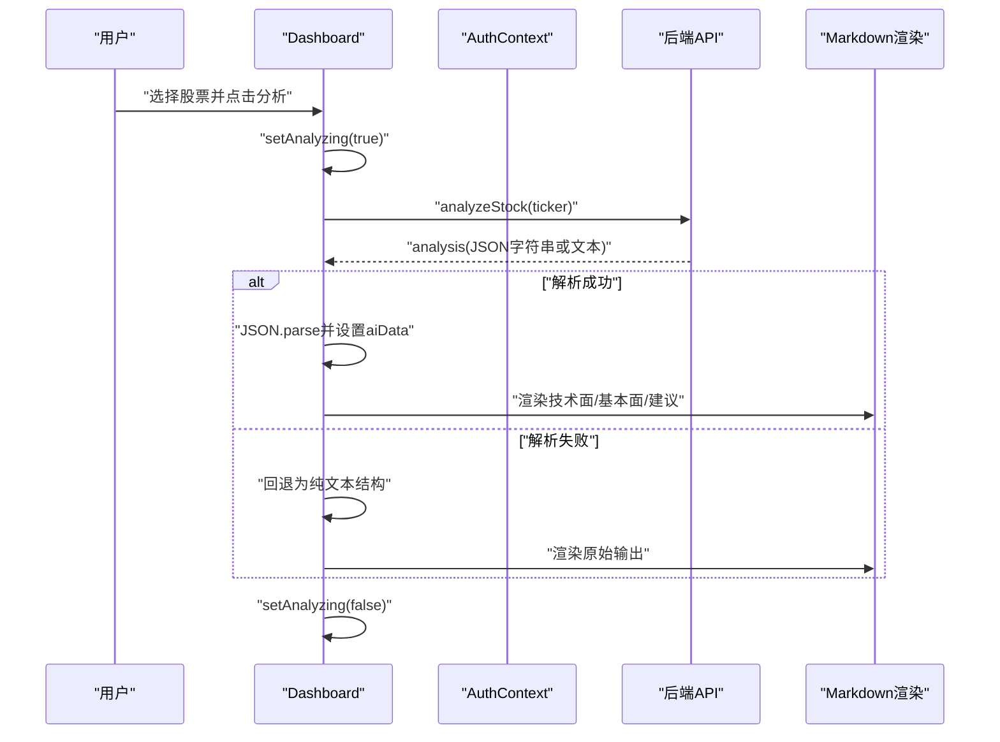
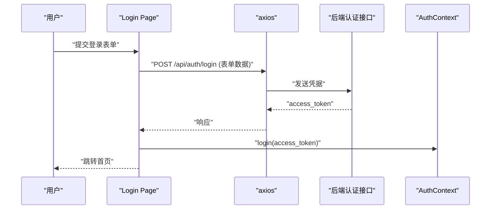
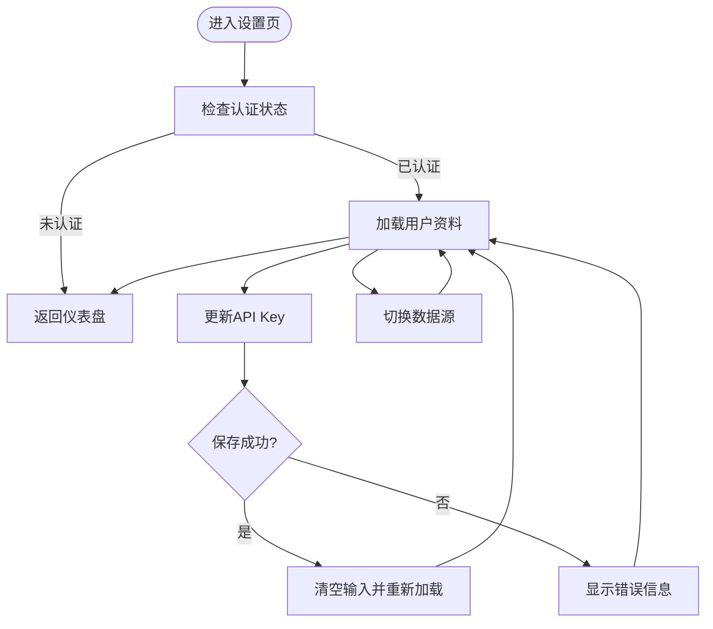
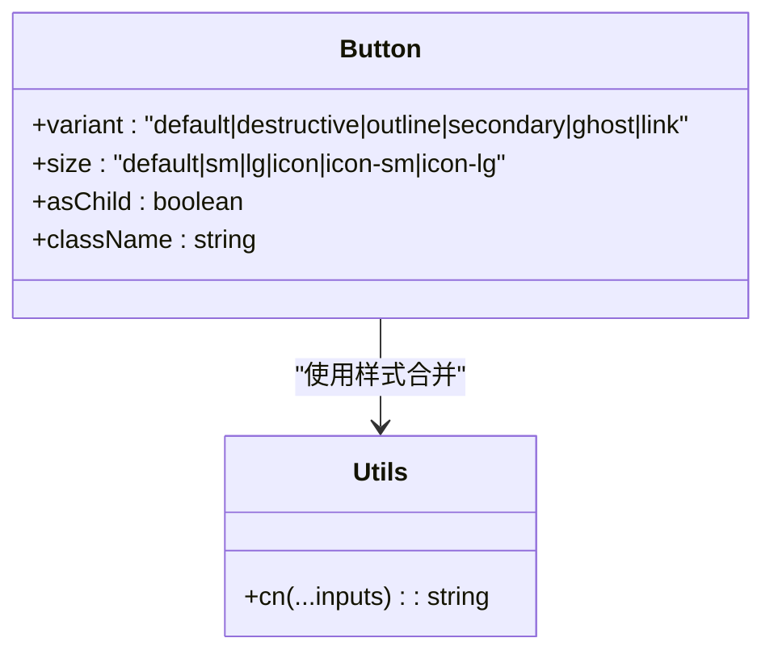
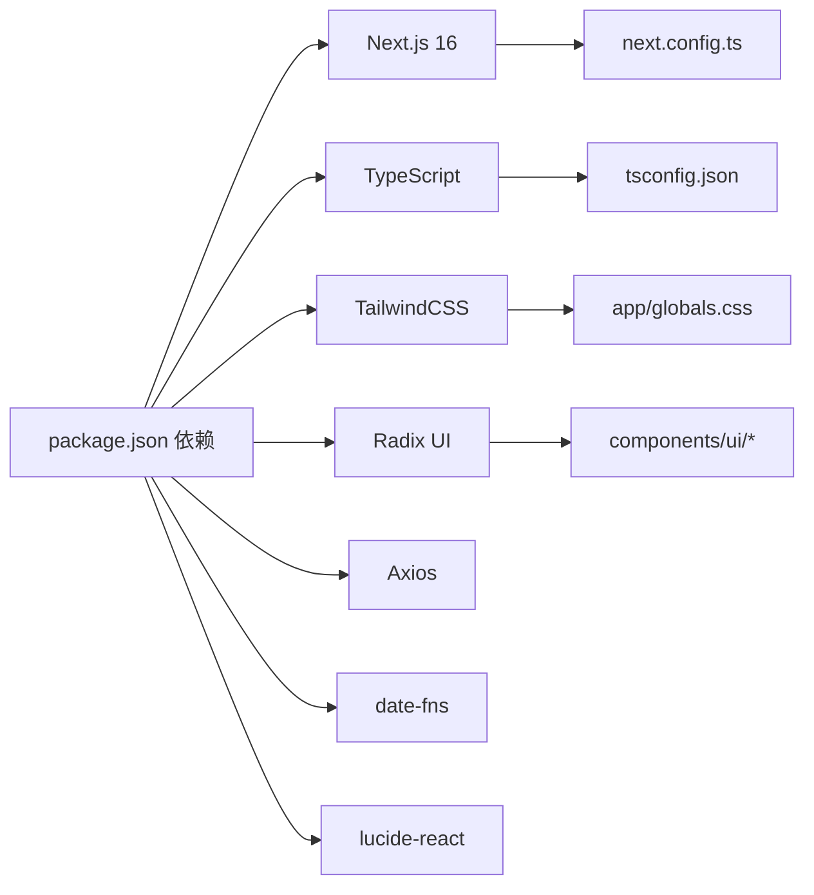

# 前端架构

<cite>
**本文引用的文件**
- [frontend/app/layout.tsx](file://frontend/app/layout.tsx)
- [frontend/context/AuthContext.tsx](file://frontend/context/AuthContext.tsx)
- [frontend/app/page.tsx](file://frontend/app/page.tsx)
- [frontend/app/login/page.tsx](file://frontend/app/login/page.tsx)
- [frontend/app/register/page.tsx](file://frontend/app/register/page.tsx)
- [frontend/app/settings/page.tsx](file://frontend/app/settings/page.tsx)
- [frontend/components/ui/button.tsx](file://frontend/components/ui/button.tsx)
- [frontend/lib/utils.ts](file://frontend/lib/utils.ts)
- [frontend/components.json](file://frontend/components.json)
- [frontend/app/globals.css](file://frontend/app/globals.css)
- [frontend/next.config.ts](file://frontend/next.config.ts)
- [frontend/tsconfig.json](file://frontend/tsconfig.json)
- [frontend/package.json](file://frontend/package.json)
- [frontend/README.md](file://frontend/README.md)
</cite>

## 目录
1. [引言](#引言)
2. [项目结构](#项目结构)
3. [核心组件](#核心组件)
4. [架构总览](#架构总览)
5. [详细组件分析](#详细组件分析)
6. [依赖关系分析](#依赖关系分析)
7. [性能考量](#性能考量)
8. [故障排查指南](#故障排查指南)
9. [结论](#结论)
10. [附录](#附录)

## 引言
本文件面向AI股票顾问前端系统，系统采用Next.js 16应用模式（App Router），以TypeScript开发，使用TailwindCSS与Tailwind Variance Authority进行样式管理，UI组件基于Radix UI与自定义组件库。前端通过AuthContext提供全局认证状态，页面组件负责业务逻辑与用户交互，UI组件提供可复用的视觉与行为抽象，工具函数提供通用能力。

系统围绕“仪表盘-详情”的主从布局展开：左侧为股票列表与筛选编辑，右侧为AI深度分析卡片与实时市场状态提示；登录/注册/设置页分别承担用户认证与偏好配置；API交互通过封装的lib层完成，错误处理与状态管理贯穿各页面与组件。

## 项目结构
前端目录采用Next.js App Router约定式路由，页面位于app目录下，按路径生成路由；UI组件位于components/ui，工具函数位于lib，全局样式与主题变量位于app/globals.css；上下文与全局布局位于context与app/layout.tsx；构建与类型配置位于next.config.ts、tsconfig.json；包管理与脚本位于package.json。

图表来源
- [frontend/app/layout.tsx](file://frontend/app/layout.tsx#L20-L38)
- [frontend/context/AuthContext.tsx](file://frontend/context/AuthContext.tsx#L15-L51)
- [frontend/app/page.tsx](file://frontend/app/page.tsx#L30-L686)
- [frontend/app/login/page.tsx](file://frontend/app/login/page.tsx#L12-L89)
- [frontend/app/register/page.tsx](file://frontend/app/register/page.tsx#L12-L84)
- [frontend/app/settings/page.tsx](file://frontend/app/settings/page.tsx#L13-L173)
- [frontend/components/ui/button.tsx](file://frontend/components/ui/button.tsx#L39-L63)
- [frontend/lib/utils.ts](file://frontend/lib/utils.ts#L4-L6)
- [frontend/app/globals.css](file://frontend/app/globals.css#L1-L141)
- [frontend/components.json](file://frontend/components.json#L1-L23)

章节来源
- [frontend/app/layout.tsx](file://frontend/app/layout.tsx#L1-L39)
- [frontend/next.config.ts](file://frontend/next.config.ts#L1-L8)
- [frontend/tsconfig.json](file://frontend/tsconfig.json#L1-L43)
- [frontend/package.json](file://frontend/package.json#L1-L43)

## 核心组件
- 认证上下文（AuthContext）
  - 提供token存储与读取、登录登出方法、认证状态判断，使用localStorage持久化，结合Next.js的useRouter进行路由跳转。
  - 在根布局中作为Provider包裹所有子组件，确保全站可用。
- 页面组件
  - 仪表盘：主业务页面，包含市场状态计算、列表排序与筛选、编辑与删除、搜索与添加、AI分析触发与结果渲染。
  - 登录/注册：表单提交至后端认证接口，成功后调用AuthContext.login写入token并跳转首页。
  - 设置：加载与更新用户配置（API Key、数据源偏好）。
- UI组件
  - 基于Radix UI与cva变体系统，提供按钮、卡片、对话框、表格、滚动区域等，统一风格与交互。
- 工具函数
  - 样式合并工具，用于简化类名拼接与冲突修复。

章节来源
- [frontend/context/AuthContext.tsx](file://frontend/context/AuthContext.tsx#L1-L60)
- [frontend/app/layout.tsx](file://frontend/app/layout.tsx#L20-L38)
- [frontend/app/page.tsx](file://frontend/app/page.tsx#L30-L686)
- [frontend/app/login/page.tsx](file://frontend/app/login/page.tsx#L19-L42)
- [frontend/app/register/page.tsx](file://frontend/app/register/page.tsx#L19-L37)
- [frontend/app/settings/page.tsx](file://frontend/app/settings/page.tsx#L21-L58)
- [frontend/components/ui/button.tsx](file://frontend/components/ui/button.tsx#L7-L37)
- [frontend/lib/utils.ts](file://frontend/lib/utils.ts#L4-L6)

## 架构总览
系统采用“页面-组件-上下文-工具”分层：
- 页面层：负责路由、数据获取、状态管理与用户交互。
- 组件层：提供可复用UI与交互抽象，遵循变体系统与语义化属性。
- 上下文层：提供认证状态与全局行为，避免跨层级传递。
- 工具层：提供样式、类型与通用逻辑。

图表来源
- [frontend/app/page.tsx](file://frontend/app/page.tsx#L30-L686)
- [frontend/app/login/page.tsx](file://frontend/app/login/page.tsx#L12-L89)
- [frontend/app/register/page.tsx](file://frontend/app/register/page.tsx#L12-L84)
- [frontend/app/settings/page.tsx](file://frontend/app/settings/page.tsx#L13-L173)
- [frontend/context/AuthContext.tsx](file://frontend/context/AuthContext.tsx#L15-L51)
- [frontend/components/ui/button.tsx](file://frontend/components/ui/button.tsx#L39-L63)
- [frontend/lib/utils.ts](file://frontend/lib/utils.ts#L4-L6)

## 详细组件分析

### 认证上下文（AuthContext）设计与实现
- 设计要点
  - 使用React Context提供token、登录、登出与认证状态，避免重复传参。
  - 初始化时从localStorage恢复token，保证刷新后仍保持登录态。
  - 登录成功后写入localStorage并跳转首页；登出则移除并跳转登录页。
  - 提供useAuth Hook，强制在AuthProvider内部使用，避免误用。
- 生命周期与控制流
  - 初始化：组件挂载时读取localStorage，设置初始token。
  - 登录：写入localStorage → 更新状态 → 路由跳转。
  - 登出：移除localStorage → 清空状态 → 路由跳转。
- 错误处理
  - 若useAuth在Provider外部使用，抛出明确错误，便于调试。
- 性能与安全
  - token仅保存在客户端localStorage，注意CSRF与XSS防护；生产环境建议配合HttpOnly Cookie与安全头。

图表来源
- [frontend/context/AuthContext.tsx](file://frontend/context/AuthContext.tsx#L15-L51)

章节来源
- [frontend/context/AuthContext.tsx](file://frontend/context/AuthContext.tsx#L1-L60)
- [frontend/app/layout.tsx](file://frontend/app/layout.tsx#L20-L38)

### 仪表盘页面（Dashboard）流程与状态管理
- 页面职责
  - 加载与展示投资组合，支持筛选、排序、编辑与删除。
  - 实时显示美股市场状态（开盘/休市、倒计时）。
  - 触发AI分析并渲染技术面、基本面与操作建议。
  - 支持搜索与添加自选股。
- 关键状态
  - 投资组合列表、选中股票、分析结果、搜索结果、编辑表单、排序字段与顺序、市场状态。
- 控制流
  - 首次挂载：设置mounted、拉取数据、启动市场状态定时器。
  - 认证检查：若未认证且无token，延迟跳转登录。
  - 分析流程：调用分析接口 → 解析JSON或回退文本 → 展示Markdown内容。
  - 搜索流程：本地搜索（输入即搜）+ 远程搜索（点击搜索）。
- 错误处理
  - 分析接口限流返回429时，提示并跳转设置页。
  - 其他异常弹窗提示，避免崩溃。

图表来源
- [frontend/app/page.tsx](file://frontend/app/page.tsx#L206-L240)

章节来源
- [frontend/app/page.tsx](file://frontend/app/page.tsx#L30-L686)

### 登录与注册页面（认证流程）
- 登录
  - 表单收集用户名/密码，构造表单数据，POST到后端认证接口。
  - 成功后从响应提取access_token，调用AuthContext.login写入并跳转首页。
  - 失败时显示后端返回的错误信息。
- 注册
  - 表单提交邮箱与密码，POST到注册接口。
  - 成功后同样写入token并跳转首页。
- 安全与体验
  - 表单禁用与加载态提示，错误信息显式展示。

图表来源
- [frontend/app/login/page.tsx](file://frontend/app/login/page.tsx#L19-L42)

章节来源
- [frontend/app/login/page.tsx](file://frontend/app/login/page.tsx#L12-L89)
- [frontend/app/register/page.tsx](file://frontend/app/register/page.tsx#L12-L84)

### 设置页面（配置与偏好）
- 功能点
  - 加载用户资料与当前配置。
  - 更新Gemini API Key（加密存储）。
  - 切换数据源（Alpha Vantage / YFinance）。
- 流程
  - 认证有效时加载资料；保存时调用更新接口，成功后清空输入并重新加载。
  - 数据源切换即时生效并刷新状态。

图表来源
- [frontend/app/settings/page.tsx](file://frontend/app/settings/page.tsx#L21-L69)

章节来源
- [frontend/app/settings/page.tsx](file://frontend/app/settings/page.tsx#L13-L173)

### UI组件与样式体系
- 组件设计
  - 按钮组件使用cva变体系统，支持多种尺寸与外观，统一交互反馈。
  - 卡片、表单、输入、标签、滚动区域、对话框等组件提供一致的视觉与行为。
- 样式与主题
  - TailwindCSS与CSS变量驱动主题，支持明暗模式切换。
  - 自定义滚动条样式，提升阅读体验。
- 可访问性
  - 组件具备焦点可见性与语义化属性，符合现代Web标准。

图表来源
- [frontend/components/ui/button.tsx](file://frontend/components/ui/button.tsx#L39-L63)
- [frontend/lib/utils.ts](file://frontend/lib/utils.ts#L4-L6)

章节来源
- [frontend/components/ui/button.tsx](file://frontend/components/ui/button.tsx#L1-L63)
- [frontend/app/globals.css](file://frontend/app/globals.css#L1-L141)
- [frontend/components.json](file://frontend/components.json#L1-L23)

## 依赖关系分析
- 包依赖
  - Next.js 16、React 19、TypeScript、TailwindCSS、Radix UI、Axios、date-fns、lucide-react等。
- 类型与路径别名
  - tsconfig启用严格模式与bundler解析，路径别名为@/*，便于模块化组织。
- 构建配置
  - next.config.ts留空默认配置；tsconfig启用增量编译与插件，提升开发体验。
- 开发与运行
  - package.json提供dev/build/start/lint脚本；README提供快速启动指引。

图表来源
- [frontend/package.json](file://frontend/package.json#L11-L30)
- [frontend/tsconfig.json](file://frontend/tsconfig.json#L20-L30)
- [frontend/next.config.ts](file://frontend/next.config.ts#L3-L5)
- [frontend/app/globals.css](file://frontend/app/globals.css#L1-L141)
- [frontend/components/ui/button.tsx](file://frontend/components/ui/button.tsx#L1-L63)

章节来源
- [frontend/package.json](file://frontend/package.json#L1-L43)
- [frontend/tsconfig.json](file://frontend/tsconfig.json#L1-L43)
- [frontend/next.config.ts](file://frontend/next.config.ts#L1-L8)
- [frontend/README.md](file://frontend/README.md#L1-L37)

## 性能考量
- 组件与状态
  - 使用useMemo与useEffect合理拆分副作用，避免不必要重渲染。
  - 列表渲染采用稳定键值与条件渲染，减少DOM变更。
- 样式与资源
  - TailwindCSS按需引入，CSS变量驱动主题切换，降低运行时开销。
  - 字体与图标按需加载，避免阻塞主线程。
- 请求与缓存
  - 本地搜索优先，远程搜索按需触发；分析接口增加防抖与加载态。
  - 令牌持久化于localStorage，减少重复登录成本。
- 无障碍与可访问性
  - 组件具备焦点可见性与语义化属性，提升可访问性与SEO友好度。

## 故障排查指南
- 认证相关
  - useAuth必须在AuthProvider内部使用，否则会抛出错误；检查根布局是否包裹Provider。
  - 登录/注册失败时查看后端返回的错误信息，确认凭据与网络连通性。
- 页面跳转
  - 未认证时仪表盘会在短暂延迟后跳转登录页，确认localStorage中token是否存在。
- 分析接口
  - 返回429时提示添加个人API Key并跳转设置页；检查设置页保存状态与后端配额。
- 样式问题
  - 明暗主题切换异常时检查CSS变量与根元素类名；确认Tailwind配置正确。
- 构建与运行
  - 开发服务器无法启动时检查端口占用与依赖安装；参考README的启动命令。

章节来源
- [frontend/context/AuthContext.tsx](file://frontend/context/AuthContext.tsx#L53-L59)
- [frontend/app/login/page.tsx](file://frontend/app/login/page.tsx#L37-L42)
- [frontend/app/register/page.tsx](file://frontend/app/register/page.tsx#L32-L37)
- [frontend/app/page.tsx](file://frontend/app/page.tsx#L230-L237)
- [frontend/app/globals.css](file://frontend/app/globals.css#L84-L116)
- [frontend/README.md](file://frontend/README.md#L5-L15)

## 结论
该前端系统以Next.js App Router为基础，采用上下文驱动的状态管理与模块化的UI组件体系，实现了清晰的页面路由、稳定的组件抽象与良好的用户体验。认证上下文贯穿全站，保障了登录态一致性；页面组件聚焦业务逻辑与交互细节；工具与样式体系提供了可维护的扩展基础。后续可在安全加固、国际化、测试覆盖与性能监控方面进一步完善。

## 附录
- 快速启动
  - 使用package.json提供的脚本启动开发服务器，访问本地端口查看效果。
- 部署建议
  - Next.js官方平台提供一键部署；生产环境建议开启静态导出或服务端渲染选项，结合CDN与缓存策略提升性能。

章节来源
- [frontend/README.md](file://frontend/README.md#L5-L15)
- [frontend/package.json](file://frontend/package.json#L5-L10)