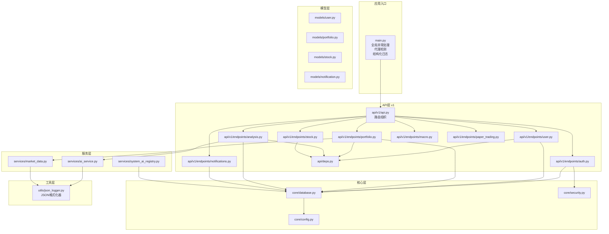
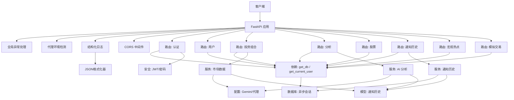
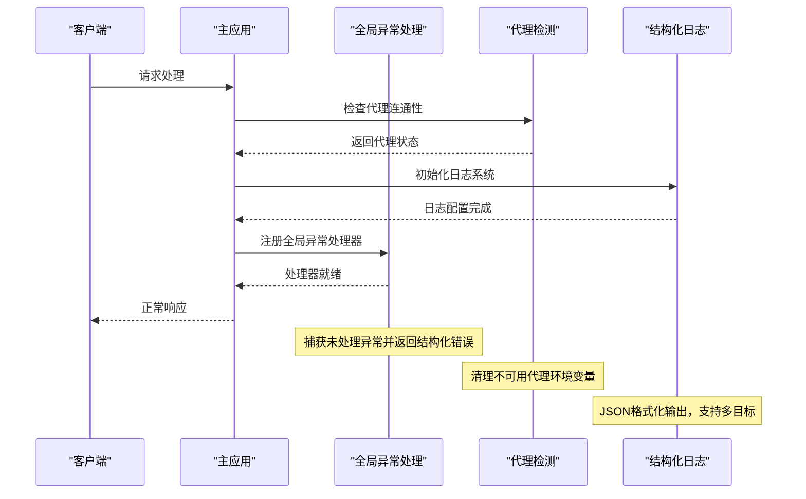
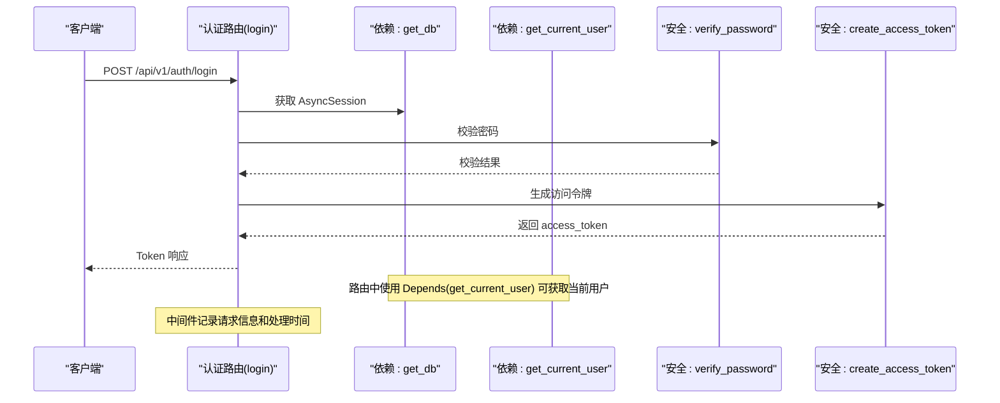
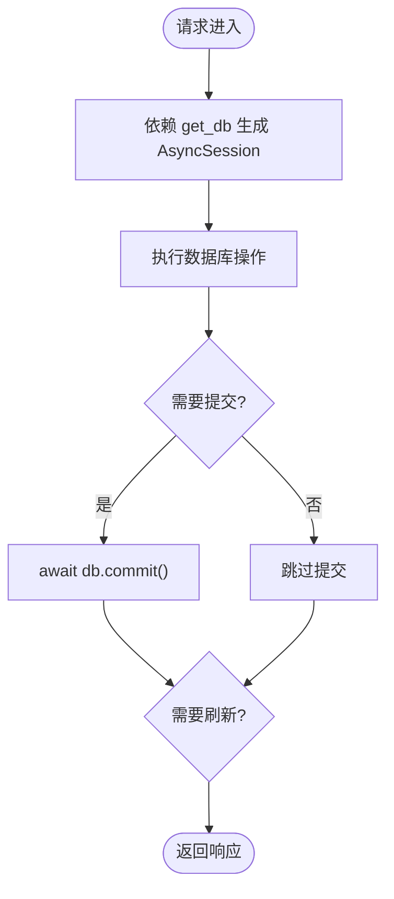
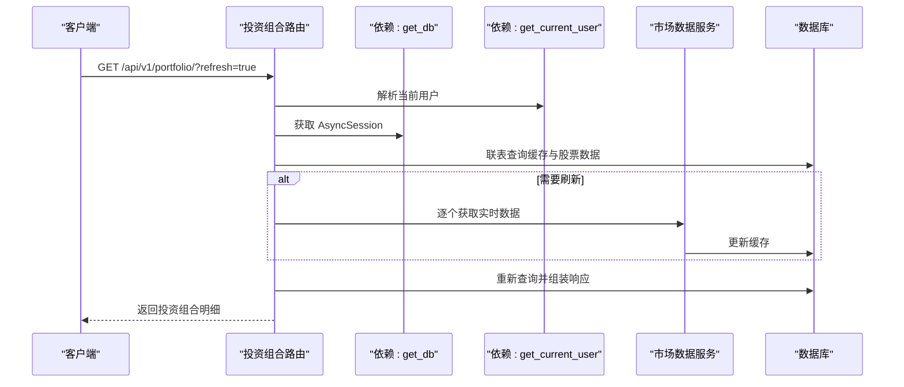
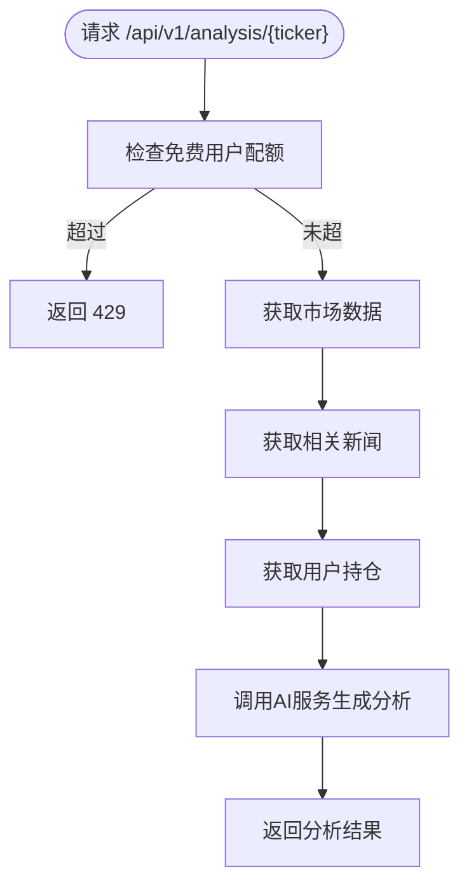
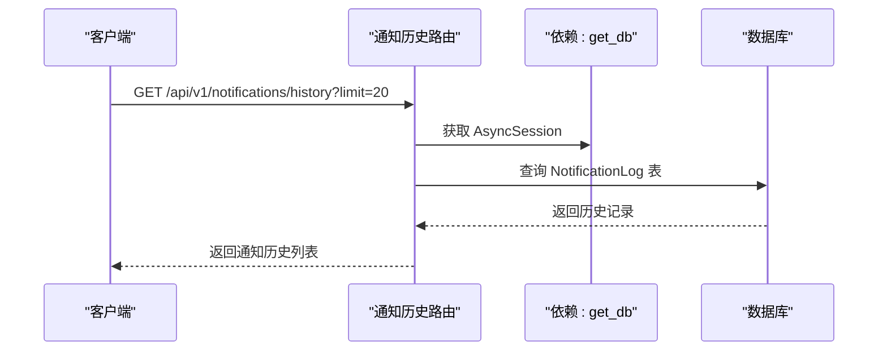
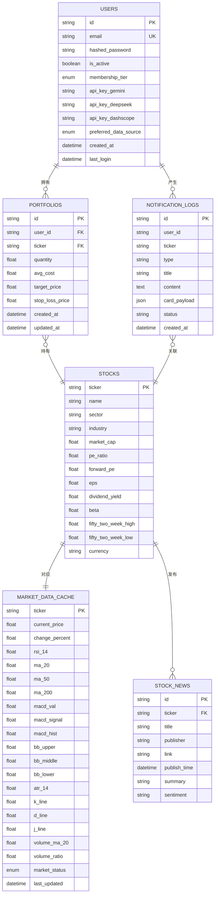
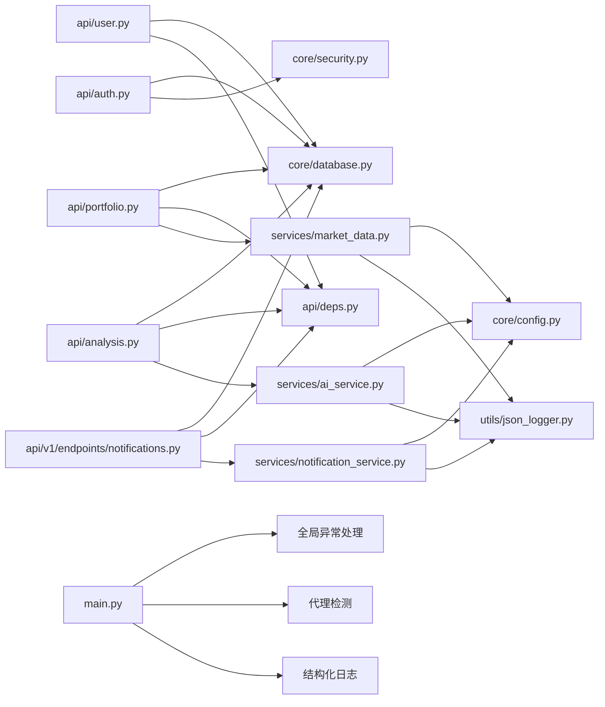

# 后端架构

<cite>
**本文引用的文件**
- [backend/app/main.py](file://backend/app/main.py)
- [backend/app/api/deps.py](file://backend/app/api/deps.py)
- [backend/app/core/config.py](file://backend/app/core/config.py)
- [backend/app/core/database.py](file://backend/app/core/database.py)
- [backend/app/core/security.py](file://backend/app/core/security.py)
- [backend/app/api/auth.py](file://backend/app/api/auth.py)
- [backend/app/api/user.py](file://backend/app/api/user.py)
- [backend/app/api/portfolio.py](file://backend/app/api/portfolio.py)
- [backend/app/api/analysis.py](file://backend/app/api/analysis.py)
- [backend/app/api/v1/api.py](file://backend/app/api/v1/api.py)
- [backend/app/api/v1/endpoints/notifications.py](file://backend/app/api/v1/endpoints/notifications.py)
- [backend/app/models/user.py](file://backend/app/models/user.py)
- [backend/app/models/portfolio.py](file://backend/app/models/portfolio.py)
- [backend/app/models/stock.py](file://backend/app/models/stock.py)
- [backend/app/models/notification.py](file://backend/app/models/notification.py)
- [backend/app/services/ai_service.py](file://backend/app/services/ai_service.py)
- [backend/app/services/market_data.py](file://backend/app/services/market_data.py)
- [backend/app/services/system_ai_registry.py](file://backend/app/services/system_ai_registry.py)
- [backend/app/utils/json_logger.py](file://backend/app/utils/json_logger.py)
- [backend/requirements.txt](file://backend/requirements.txt)
</cite>

## 更新摘要
**变更内容**
- 新增增强的全局异常处理机制，提供结构化错误响应
- 添加代理环境自动检测和清理功能，提升网络连接可靠性
- 实现改进的日志记录系统，支持JSON格式化和多目标输出
- 新增通知历史模块，支持飞书推送历史记录
- 扩展系统AI注册机制，支持多提供商AI模型管理
- 更新中间件体系，增强请求拦截和错误处理能力

## 目录
1. [引言](#引言)
2. [项目结构](#项目结构)
3. [核心组件](#核心组件)
4. [架构总览](#架构总览)
5. [详细组件分析](#详细组件分析)
6. [依赖关系分析](#依赖关系分析)
7. [性能考量](#性能考量)
8. [故障排查指南](#故障排查指南)
9. [结论](#结论)
10. [附录](#附录)

## 引言
本文件面向AI股票顾问后端系统，系统基于FastAPI构建，采用异步数据库访问与模块化路由设计，围绕认证、用户、投资组合、分析、通知和宏观六大模块组织API；通过依赖注入实现安全中间件与数据库会话管理；内置AI与市场数据服务，支持多数据源与缓存策略；具备增强的全局异常处理、代理环境自动检测、结构化日志记录和通知历史管理等高级功能。本文档旨在帮助开发者快速理解系统架构、数据流与扩展点。

## 项目结构
后端采用"按功能域分层"的组织方式：
- 应用入口与中间件：main.py（新增全局异常处理、代理检测、结构化日志）
- API层：v1版本路由组织，包含auth、user、portfolio、analysis、stock、notifications、macro、paper_trading模块
- 核心层：config（配置）、database（数据库引擎与会话）、security（JWT与密码）
- 模型层：user、portfolio、stock、notification（新增通知历史）
- 服务层：ai_service（AI分析）、market_data（市场数据）、system_ai_registry（系统AI注册）
- 工具层：json_logger（结构化日志）
- 第三方依赖：requirements.txt

**图表来源**
- [backend/app/main.py:1-243](file://backend/app/main.py#L1-L243)
- [backend/app/api/v1/api.py:1-33](file://backend/app/api/v1/api.py#L1-L33)
- [backend/app/api/v1/endpoints/notifications.py:1-36](file://backend/app/api/v1/endpoints/notifications.py#L1-L36)
- [backend/app/services/system_ai_registry.py:1-56](file://backend/app/services/system_ai_registry.py#L1-L56)
- [backend/app/utils/json_logger.py:1-202](file://backend/app/utils/json_logger.py#L1-L202)

**章节来源**
- [backend/app/main.py:1-243](file://backend/app/main.py#L1-L243)
- [backend/app/api/v1/api.py:1-33](file://backend/app/api/v1/api.py#L1-L33)
- [backend/requirements.txt:1-75](file://backend/requirements.txt#L1-L75)

## 核心组件
- **应用入口与中间件**
  - FastAPI实例创建、CORS中间件配置、根路径与健康检查端点
  - **新增**：全局异常处理器、代理环境自动检测、结构化日志配置
- **依赖注入与安全**
  - OAuth2密码流令牌校验、JWT解码与用户解析、数据库会话依赖
- **数据库与ORM**
  - 异步引擎、会话工厂、Base基类、会话生成器
- **配置中心**
  - 项目名、数据库URL、密钥算法、访问令牌过期时间、外部API密钥与代理
  - **新增**：AUTO_DISABLE_UNAVAILABLE_PROXY配置项
- **安全工具**
  - 密码哈希与验证、JWT签名与过期控制
- **API模块**
  - 认证（登录/注册）、用户（个人信息/设置）、投资组合（查询/增删/刷新）、分析（AI建议）
  - **新增**：通知历史（飞书推送历史）、股票详情、宏观热点、模拟交易
- **模型**
  - 用户、投资组合、股票、**新增**：通知历史记录
- **服务**
  - AI服务（Gemini调用与降级）、市场数据服务（Alpha Vantage与yfinance双通道、缓存与新闻入库）
  - **新增**：系统AI注册机制
- **工具**
  - **新增**：JSON格式化器、结构化日志记录

**章节来源**
- [backend/app/main.py:1-243](file://backend/app/main.py#L1-L243)
- [backend/app/api/deps.py:1-44](file://backend/app/api/deps.py#L1-L44)
- [backend/app/core/config.py:1-41](file://backend/app/core/config.py#L1-L41)
- [backend/app/core/database.py:1-24](file://backend/app/core/database.py#L1-L24)
- [backend/app/core/security.py:1-26](file://backend/app/core/security.py#L1-L26)
- [backend/app/api/auth.py:1-88](file://backend/app/api/auth.py#L1-L88)
- [backend/app/api/user.py:1-48](file://backend/app/api/user.py#L1-L48)
- [backend/app/api/portfolio.py:1-297](file://backend/app/api/portfolio.py#L1-L297)
- [backend/app/api/analysis.py:1-124](file://backend/app/api/analysis.py#L1-L124)
- [backend/app/api/v1/endpoints/notifications.py:1-36](file://backend/app/api/v1/endpoints/notifications.py#L1-L36)
- [backend/app/models/notification.py:1-23](file://backend/app/models/notification.py#L1-L23)
- [backend/app/services/system_ai_registry.py:1-56](file://backend/app/services/system_ai_registry.py#L1-L56)
- [backend/app/utils/json_logger.py:1-202](file://backend/app/utils/json_logger.py#L1-L202)

## 架构总览
系统采用"路由-服务-模型-数据库"分层，API层通过依赖注入获取数据库会话与当前用户；核心安全模块负责令牌校验；服务层封装AI与市场数据调用；模型层定义数据结构与关系；数据库层提供异步连接与会话生命周期管理。**新增**：全局异常处理、代理环境检测、结构化日志记录贯穿整个系统。

**图表来源**
- [backend/app/main.py:106-183](file://backend/app/main.py#L106-L183)
- [backend/app/main.py:60-99](file://backend/app/main.py#L60-L99)
- [backend/app/main.py:17-29](file://backend/app/main.py#L17-L29)
- [backend/app/api/v1/api.py:1-33](file://backend/app/api/v1/api.py#L1-L33)
- [backend/app/services/system_ai_registry.py:1-56](file://backend/app/services/system_ai_registry.py#L1-L56)
- [backend/app/utils/json_logger.py:10-74](file://backend/app/utils/json_logger.py#L10-L74)

## 详细组件分析

### 应用入口与中间件
- **CORS配置**：允许本地开发环境的多个前端端口跨域访问，生产环境建议限定具体域名与端口。
- **路由注册**：统一挂载v1版本的认证、用户、投资组合、分析、股票、通知历史、宏观热点、模拟交易八个模块，设置前缀与标签便于文档与调试。
- **健康检查**：提供轻量级健康检查端点，便于容器编排与监控。
- **新增**：全局异常处理，捕获所有未处理异常并返回结构化错误信息。
- **新增**：代理环境自动检测，在启动时检查代理连通性并自动清理不可用代理。
- **新增**：结构化日志配置，支持JSON格式输出和多目标日志记录。

**图表来源**
- [backend/app/main.py:106-125](file://backend/app/main.py#L106-L125)
- [backend/app/main.py:60-99](file://backend/app/main.py#L60-L99)
- [backend/app/main.py:17-29](file://backend/app/main.py#L17-L29)

**章节来源**
- [backend/app/main.py:1-243](file://backend/app/main.py#L1-L243)

### 依赖注入与安全中间件
- OAuth2密码流：定义令牌端点，供认证模块使用。
- get_current_user：解析JWT载荷，查询用户并注入到路由处理器。
- get_db：异步会话生成器，确保每个请求拥有独立的数据库会话。
- **新增**：HTTP请求拦截中间件，记录请求耗时、路径、方法和用户ID。

**图表来源**
- [backend/app/api/auth.py:1-88](file://backend/app/api/auth.py#L1-L88)
- [backend/app/api/deps.py:1-44](file://backend/app/api/deps.py#L1-L44)
- [backend/app/core/security.py:1-26](file://backend/app/core/security.py#L1-L26)

**章节来源**
- [backend/app/api/deps.py:1-44](file://backend/app/api/deps.py#L1-L44)
- [backend/app/core/security.py:1-26](file://backend/app/core/security.py#L1-L26)

### 数据库连接与ORM配置
- 引擎：根据配置选择SQLite或PostgreSQL，SQLite下设置线程检查参数。
- 会话：AsyncSession，非自动提交与刷新，避免事务边界问题。
- Base：声明式基类，所有模型继承。
- get_db：异步上下文管理器，保证会话生命周期。
- **新增**：通知历史表支持，用于持久化飞书推送记录。

**图表来源**
- [backend/app/core/database.py:1-24](file://backend/app/core/database.py#L1-L24)

**章节来源**
- [backend/app/core/database.py:1-24](file://backend/app/core/database.py#L1-L24)

### 配置中心
- 关键配置项：数据库URL、JWT密钥与算法、访问令牌过期时间、外部API密钥（Gemini、DeepSeek、Alpha Vantage、DashScope）、HTTP代理。
- **新增**：AUTO_DISABLE_UNAVAILABLE_PROXY配置项，控制是否自动清理不可用代理。
- **新增**：AKSHARE_BYPASS_PROXY配置项，控制akshare绕过代理行为。
- 环境变量：通过Python-dotenv加载，支持不同环境切换。

**章节来源**
- [backend/app/core/config.py:1-41](file://backend/app/core/config.py#L1-L41)

### 认证模块
- 登录：校验邮箱与密码，生成JWT。
- 注册：检查邮箱唯一性，创建用户并返回令牌。
- 依赖：使用OAuth2密码表单与数据库会话。

**章节来源**
- [backend/app/api/auth.py:1-88](file://backend/app/api/auth.py#L1-L88)

### 用户模块
- 个人信息：返回用户标识、会员等级、API密钥存在性与偏好数据源。
- 设置更新：支持更新Gemini/DeepSeek/DashScope密钥与偏好数据源，持久化并返回最新状态。

**章节来源**
- [backend/app/api/user.py:1-48](file://backend/app/api/user.py#L1-L48)
- [backend/app/models/user.py:1-31](file://backend/app/models/user.py#L1-L31)

### 投资组合模块
- 搜索：本地模糊匹配，必要时远程调用yfinance快速校验并写入缓存。
- 查询：一次性联表查询缓存与股票基础数据，支持强制刷新；刷新时顺序拉取避免并发问题。
- 新增/删除：去重合并或删除持仓项，新增时异步后台拉取技术指标。
- 数据模型：Portfolio、Stock、MarketDataCache、StockNews。

**图表来源**
- [backend/app/api/portfolio.py:1-297](file://backend/app/api/portfolio.py#L1-L297)
- [backend/app/services/market_data.py:1-370](file://backend/app/services/market_data.py#L1-L370)
- [backend/app/models/stock.py:1-85](file://backend/app/models/stock.py#L1-L85)

**章节来源**
- [backend/app/api/portfolio.py:1-297](file://backend/app/api/portfolio.py#L1-L297)
- [backend/app/models/portfolio.py:1-26](file://backend/app/models/portfolio.py#L1-L26)
- [backend/app/models/stock.py:1-85](file://backend/app/models/stock.py#L1-L85)

### 分析模块
- 业务流程：免费用户每日上限检查、市场数据获取、新闻上下文、用户持仓个性化、AI生成分析。
- AI服务：优先使用用户自有密钥，否则退回提示；失败时降级为纯文本输出。
- 市场数据：优先Alpha Vantage，失败回退yfinance；缓存缺失时补充技术指标与新闻。

**图表来源**
- [backend/app/api/analysis.py:1-124](file://backend/app/api/analysis.py#L1-L124)
- [backend/app/services/ai_service.py:1-112](file://backend/app/services/ai_service.py#L1-L112)
- [backend/app/services/market_data.py:1-370](file://backend/app/services/market_data.py#L1-L370)

**章节来源**
- [backend/app/api/analysis.py:1-124](file://backend/app/api/analysis.py#L1-L124)
- [backend/app/services/ai_service.py:1-112](file://backend/app/services/ai_service.py#L1-L112)

### 通知历史模块
- **新增**：获取通知历史记录流，支持分页查询和类型过滤。
- 数据模型：NotificationLog，包含用户ID、股票代码、通知类型、标题、内容、卡片载荷和状态。
- 功能：持久化飞书机器人推送信息，用于前端展示提醒流。

**图表来源**
- [backend/app/api/v1/endpoints/notifications.py:1-36](file://backend/app/api/v1/endpoints/notifications.py#L1-L36)
- [backend/app/models/notification.py:1-23](file://backend/app/models/notification.py#L1-L23)

**章节来源**
- [backend/app/api/v1/endpoints/notifications.py:1-36](file://backend/app/api/v1/endpoints/notifications.py#L1-L36)
- [backend/app/models/notification.py:1-23](file://backend/app/models/notification.py#L1-L23)

### 股票详情模块
- **新增**：处理个股历史行情及详情查询。
- 功能：提供股票基本信息、技术指标、市场数据等综合信息服务。

**章节来源**
- [backend/app/api/v1/endpoints/stock.py:1-200](file://backend/app/api/v1/endpoints/stock.py#L1-L200)

### 宏观热点模块
- **新增**：处理全球宏观雷达与热点分析。
- 功能：提供宏观经济指标、市场情绪分析、热点板块追踪等宏观层面的AI分析。

**章节来源**
- [backend/app/api/v1/endpoints/macro.py:1-200](file://backend/app/api/v1/endpoints/macro.py#L1-L200)

### 模拟交易模块
- **新增**：处理从今起航的纸面交易功能。
- 功能：支持用户进行模拟投资交易，提供回测和策略验证能力。

**章节来源**
- [backend/app/api/v1/endpoints/paper_trading.py:1-200](file://backend/app/api/v1/endpoints/paper_trading.py#L1-L200)

### 数据模型与关系
- 用户：邮箱唯一、密码哈希、会员等级、API密钥与偏好数据源。
- 投资组合：用户与股票的一对多关系，唯一约束防止重复持仓。
- 股票与缓存：一对一关系，缓存包含丰富技术指标与状态字段。
- 新闻：与股票一对多，用于消息面分析。
- **新增**：通知历史：持久化飞书推送记录，支持按用户和股票代码索引。

**图表来源**
- [backend/app/models/user.py:1-31](file://backend/app/models/user.py#L1-L31)
- [backend/app/models/portfolio.py:1-26](file://backend/app/models/portfolio.py#L1-L26)
- [backend/app/models/stock.py:1-85](file://backend/app/models/stock.py#L1-L85)
- [backend/app/models/notification.py:1-23](file://backend/app/models/notification.py#L1-L23)

**章节来源**
- [backend/app/models/user.py:1-31](file://backend/app/models/user.py#L1-L31)
- [backend/app/models/portfolio.py:1-26](file://backend/app/models/portfolio.py#L1-L26)
- [backend/app/models/stock.py:1-85](file://backend/app/models/stock.py#L1-L85)
- [backend/app/models/notification.py:1-23](file://backend/app/models/notification.py#L1-L23)

### 服务层：AI与市场数据
- AI服务
  - 配置：优先使用用户自有密钥，否则记录警告并降级。
  - 提示工程：中文提示，要求JSON结构输出，失败时回退纯文本。
  - 日志：捕获异常并记录错误。
- 市场数据服务
  - 缓存：1分钟内命中缓存，避免频繁拉取。
  - 多源：优先Alpha Vantage，失败回退yfinance；若均失败，使用模拟数据。
  - 指标：计算RSI、MACD、布林带、KDJ、ATR、成交量相关指标。
  - 新闻：入库并去重，支持SQLite upsert。
- **新增**：系统AI注册机制，管理内置AI模型和提供商配置。

**章节来源**
- [backend/app/services/ai_service.py:1-112](file://backend/app/services/ai_service.py#L1-L112)
- [backend/app/services/market_data.py:1-370](file://backend/app/services/market_data.py#L1-L370)
- [backend/app/services/system_ai_registry.py:1-56](file://backend/app/services/system_ai_registry.py#L1-L56)

### 工具层：结构化日志系统
- **新增**：JSON格式化器，支持结构化JSON输出，便于Loki聚合分析。
- **新增**：标准文本格式化器，用于开发环境的友好输出。
- **新增**：多目标日志配置，支持控制台和文件输出，分别针对不同级别和用途。
- **新增**：AI调用专用日志，记录完整的prompt和分段计时信息。

**章节来源**
- [backend/app/utils/json_logger.py:1-202](file://backend/app/utils/json_logger.py#L1-L202)

## 依赖关系分析
- 组件耦合
  - API层依赖依赖注入与数据库会话；分析模块同时依赖AI与市场数据服务；投资组合模块依赖市场数据服务与数据库。
  - 安全模块与认证模块强关联，认证成功后生成JWT供后续路由使用。
  - **新增**：全局异常处理与中间件体系贯穿所有模块。
- 外部依赖
  - FastAPI、SQLAlchemy 2.x、Pydantic、google-generativeai、yfinance、requests、jose等。
- 循环依赖
  - 未发现明显循环导入；各模块通过依赖注入解耦。

**图表来源**
- [backend/app/api/auth.py:1-88](file://backend/app/api/auth.py#L1-L88)
- [backend/app/api/user.py:1-48](file://backend/app/api/user.py#L1-L48)
- [backend/app/api/portfolio.py:1-297](file://backend/app/api/portfolio.py#L1-L297)
- [backend/app/api/analysis.py:1-124](file://backend/app/api/analysis.py#L1-L124)
- [backend/app/api/v1/endpoints/notifications.py:1-36](file://backend/app/api/v1/endpoints/notifications.py#L1-L36)
- [backend/app/api/deps.py:1-44](file://backend/app/api/deps.py#L1-L44)
- [backend/app/core/security.py:1-26](file://backend/app/core/security.py#L1-L26)
- [backend/app/services/ai_service.py:1-112](file://backend/app/services/ai_service.py#L1-L112)
- [backend/app/services/market_data.py:1-370](file://backend/app/services/market_data.py#L1-L370)
- [backend/app/utils/json_logger.py:1-202](file://backend/app/utils/json_logger.py#L1-L202)
- [backend/app/main.py:106-183](file://backend/app/main.py#L106-L183)

**章节来源**
- [backend/requirements.txt:1-75](file://backend/requirements.txt#L1-L75)

## 性能考量
- 异步数据库：使用AsyncSession减少阻塞，提升高并发下的吞吐。
- 缓存策略：市场数据缓存1分钟，避免重复拉取；投资组合刷新顺序拉取，降低并发冲突。
- 指标计算：在内存中进行滚动窗口与指数加权计算，避免重复IO。
- 限流与降级：免费用户每日上限；AI与市场数据失败时降级为模拟数据或提示信息。
- 网络优化：yfinance与Alpha Vantage均实现重试与指数退避，代理支持。
- **新增**：全局异常处理避免worker崩溃，提升系统稳定性。
- **新增**：代理环境自动检测减少网络请求超时，提升用户体验。
- **新增**：结构化日志便于性能监控和问题定位。

## 故障排查指南
- 认证失败
  - 检查JWT密钥与算法配置；确认用户存在且密码正确。
- 数据库连接
  - 确认DATABASE_URL与驱动安装；SQLite仅用于开发，生产建议PostgreSQL。
- AI服务不可用
  - 检查GEMINI_API_KEY、DEEPSEEK_API_KEY、DASHSCOPE_API_KEY；查看日志中错误信息；确认网络与代理配置。
- 市场数据拉取失败
  - Alpha Vantage可能触发限流；yfinance可能返回429；检查HTTP_PROXY与重试策略。
- 投资组合刷新异常
  - SQLite并发限制导致会话冲突，确认顺序刷新逻辑；检查缓存完整性。
- **新增**：全局异常处理
  - 查看结构化日志中的错误堆栈信息；确认异常类型和详细描述。
- **新增**：代理环境问题
  - 检查AUTO_DISABLE_UNAVAILABLE_PROXY配置；确认代理连通性；查看代理清理日志。
- **新增**：日志记录问题
  - 检查LOG_FORMAT和LOG_LEVEL环境变量；确认日志文件权限；验证JSON格式化器配置。

**章节来源**
- [backend/app/core/config.py:1-41](file://backend/app/core/config.py#L1-L41)
- [backend/app/services/ai_service.py:1-112](file://backend/app/services/ai_service.py#L1-L112)
- [backend/app/services/market_data.py:1-370](file://backend/app/services/market_data.py#L1-L370)
- [backend/app/api/portfolio.py:1-297](file://backend/app/api/portfolio.py#L1-L297)
- [backend/app/main.py:106-125](file://backend/app/main.py#L106-L125)
- [backend/app/main.py:60-99](file://backend/app/main.py#L60-L99)
- [backend/app/utils/json_logger.py:104-165](file://backend/app/utils/json_logger.py#L104-L165)

## 结论
该后端系统以FastAPI为核心，通过模块化路由与依赖注入实现清晰的职责分离；数据库采用异步ORM，配合缓存与多数据源策略保障性能与稳定性；AI与市场数据服务封装良好，具备降级与限流能力。**新增**：增强的全局异常处理机制提供更好的错误恢复能力；代理环境自动检测提升网络连接可靠性；结构化日志系统便于运维监控和问题诊断；通知历史模块完善了系统功能完整性。建议在生产环境中收紧CORS白名单、完善日志与监控、引入更细粒度的限流与熔断策略，并考虑将敏感配置移至密钥管理服务。

## 附录
- 扩展性设计建议
  - 插件机制：将外部服务抽象为接口，通过配置切换实现插件化扩展。
  - 第三方服务集成点：新增数据源时，遵循MarketDataService接口规范；新增AI模型时，遵循AIService接口规范。
  - 错误处理与日志：统一异常捕获与返回格式；接入结构化日志与链路追踪。
  - **新增**：代理环境适配：支持多种代理配置和自动检测机制。
  - **新增**：日志系统扩展：支持多目标输出和自定义格式化器。
- 运行与部署
  - 使用uvicorn运行ASGI应用；结合容器编排与环境变量管理配置。
  - **新增**：支持LOG_FORMAT、LOG_LEVEL、ENVIRONMENT等日志相关环境变量。
  - **新增**：支持AUTO_DISABLE_UNAVAILABLE_PROXY等网络相关配置。