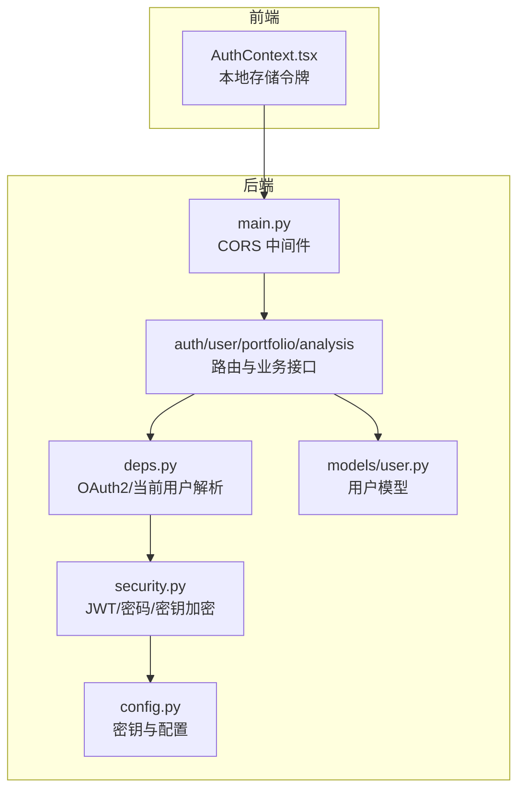
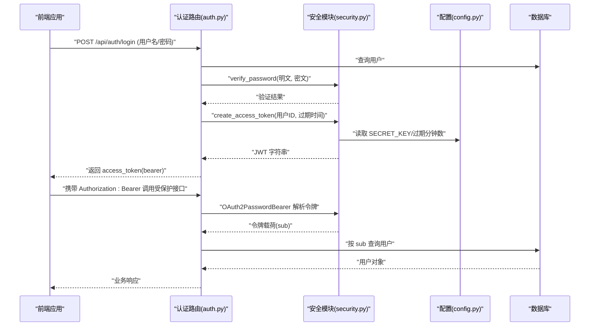
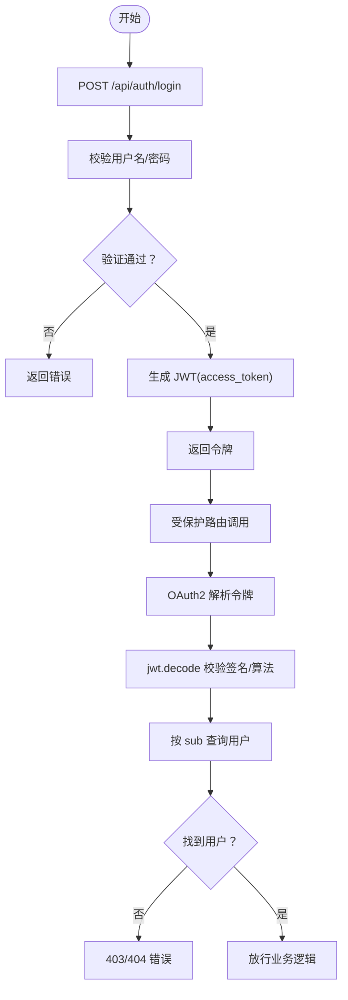
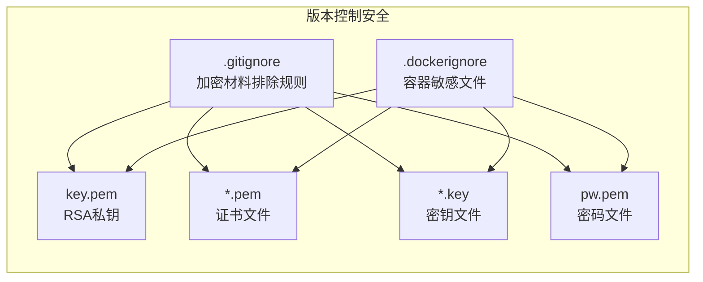
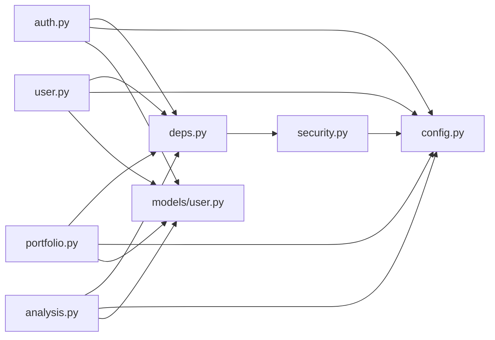

# 安全架构

<cite>
**本文档引用的文件**
- [backend/app/main.py](file://backend/app/main.py)
- [backend/app/core/config.py](file://backend/app/core/config.py)
- [backend/app/core/security.py](file://backend/app/core/security.py)
- [backend/app/api/auth.py](file://backend/app/api/auth.py)
- [backend/app/api/deps.py](file://backend/app/api/deps.py)
- [backend/app/api/user.py](file://backend/app/api/user.py)
- [backend/app/api/analysis.py](file://backend/app/api/analysis.py)
- [backend/app/api/portfolio.py](file://backend/app/api/portfolio.py)
- [backend/app/models/user.py](file://backend/app/models/user.py)
- [frontend/context/AuthContext.tsx](file://frontend/context/AuthContext.tsx)
- [.gitignore](file://.gitignore)
- [backend/.dockerignore](file://backend/.dockerignore)
- [frontend/.dockerignore](file://frontend/.dockerignore)
- [.env.example](file://.env.example)
- [key.pem](file://key.pem)
</cite>

## 更新摘要
**所做更改**
- 新增加密材料安全管理章节，详细说明.pem和.key文件的安全处理
- 更新.gitignore配置说明，强调加密材料的版本控制保护
- 增强密钥管理最佳实践，涵盖生产环境部署安全
- 补充容器环境下的敏感文件排除策略

## 目录
1. 引言
2. 项目结构
3. 核心组件
4. 架构总览
5. 详细组件分析
6. 加密材料安全管理
7. 依赖关系分析
8. 性能与安全权衡
9. 故障排查指南
10. 结论
11. 附录

## 引言
本文件面向"AI股票顾问系统"的安全架构，聚焦认证与授权、JWT令牌生命周期、OAuth2集成、API安全防护、数据传输与存储加密、会话与权限控制、安全审计、常见威胁防护（CSRF、XSS、SQL注入）以及合规与最佳实践。文档基于仓库现有实现进行分析，并提出可落地的改进建议。

**更新** 基于最新的安全实践变更，系统现已加强加密材料的安全管理，通过.gitignore规则防止敏感文件意外提交到版本控制系统。

## 项目结构
系统采用前后端分离架构：
- 后端：FastAPI 应用，提供认证、用户、组合、分析等接口；通过依赖注入与数据库交互；使用 Pydantic 进行请求/响应校验。
- 前端：Next.js 应用，使用客户端上下文管理认证状态，本地持久化令牌。

**图表来源**
- [backend/app/main.py:1-38](file://backend/app/main.py#L1-L38)
- [backend/app/core/config.py:1-25](file://backend/app/core/config.py#L1-L25)
- [backend/app/core/security.py:1-46](file://backend/app/core/security.py#L1-L46)
- [backend/app/api/deps.py:1-44](file://backend/app/api/deps.py#L1-L44)
- [backend/app/models/user.py:1-31](file://backend/app/models/user.py#L1-L31)

**章节来源**
- [backend/app/main.py:1-38](file://backend/app/main.py#L1-L38)
- [backend/app/core/config.py:1-25](file://backend/app/core/config.py#L1-L25)

## 核心组件
- 认证与授权
  - OAuth2 密码流：登录接口使用 OAuth2PasswordRequestForm，返回 bearer 令牌。
  - 令牌解析：全局依赖 OAuth2PasswordBearer，解析并校验 JWT，解析出用户标识后查询用户。
  - 权限控制：各业务路由均依赖 get_current_user，实现基于令牌的访问控制。
- 令牌生命周期
  - 生成：登录时根据配置的过期时间生成 JWT。
  - 验证：依赖中间件与依赖函数对令牌进行解码与校验。
  - 刷新：当前实现未提供刷新接口，需补充刷新令牌流程以降低泄露风险。
- 数据与密钥管理
  - 密码：bcrypt 哈希存储。
  - 第三方 API Key：Fernet 对称加密存储，运行时解密使用。
- CORS 与网络边界
  - 开发环境允许多源跨域，生产需收紧白名单。
- 前端会话
  - 本地存储令牌，路由跳转与状态同步。

**章节来源**
- [backend/app/api/auth.py:1-88](file://backend/app/api/auth.py#L1-L88)
- [backend/app/api/deps.py:1-44](file://backend/app/api/deps.py#L1-L44)
- [backend/app/core/security.py:1-46](file://backend/app/core/security.py#L1-L46)
- [backend/app/api/user.py:1-49](file://backend/app/api/user.py#L1-L49)
- [frontend/context/AuthContext.tsx:1-60](file://frontend/context/AuthContext.tsx#L1-L60)

## 架构总览
下图展示认证与授权的整体流程，从前端发起登录到后端生成与验证令牌，再到业务接口的访问控制。

**图表来源**
- [backend/app/api/auth.py:24-50](file://backend/app/api/auth.py#L24-L50)
- [backend/app/core/security.py:31-39](file://backend/app/core/security.py#L31-L39)
- [backend/app/core/config.py:8-11](file://backend/app/core/config.py#L8-L11)
- [backend/app/api/deps.py:13-43](file://backend/app/api/deps.py#L13-L43)

## 详细组件分析

### 认证与授权（OAuth2 + JWT）
- 登录流程
  - 使用 OAuth2 密码流，后端验证邮箱与密码，成功后签发 JWT。
  - 令牌类型为 bearer，便于前端在后续请求头中携带。
- 令牌解析与鉴权
  - 全局依赖 OAuth2PasswordBearer 指向登录端点，用于后续路由依赖 get_current_user。
  - get_current_user 解析 JWT，校验算法与签名，提取 sub 并查询用户，不存在则报错。
- 会话与状态
  - 前端使用本地存储保存令牌，提供登录/登出方法，路由跳转由 Next.js 控制。

**图表来源**
- [backend/app/api/auth.py:24-50](file://backend/app/api/auth.py#L24-L50)
- [backend/app/api/deps.py:17-43](file://backend/app/api/deps.py#L17-L43)

**章节来源**
- [backend/app/api/auth.py:1-88](file://backend/app/api/auth.py#L1-L88)
- [backend/app/api/deps.py:1-44](file://backend/app/api/deps.py#L1-L44)
- [frontend/context/AuthContext.tsx:15-51](file://frontend/context/AuthContext.tsx#L15-L51)

### 令牌生成、验证与刷新
- 生成
  - 以用户标识为 sub，设置过期时间，使用 SECRET_KEY 和 HS256 签名生成 JWT。
- 验证
  - 通过 OAuth2PasswordBearer 提取 Authorization 头，使用相同密钥与算法解码，校验过期与签名。
- 刷新
  - 当前未实现刷新接口，建议引入短期 access_token 与长期 refresh_token 的双令牌模型，配合安全存储与黑名单机制。

**章节来源**
- [backend/app/core/security.py:31-39](file://backend/app/core/security.py#L31-L39)
- [backend/app/core/config.py:8-11](file://backend/app/core/config.py#L8-L11)
- [backend/app/api/deps.py:13-25](file://backend/app/api/deps.py#L13-L25)

### API 安全防护
- CORS
  - 开发环境允许多源跨域，生产需限定具体域名与端口，避免宽泛允许。
- 请求验证
  - 使用 Pydantic 模型进行输入校验（如登录表单、用户设置更新），减少异常路径。
- 速率限制
  - 分析接口对免费用户施加日请求上限，防止滥用；建议扩展到更细粒度的限流策略（IP/用户维度）。

**章节来源**
- [backend/app/main.py:6-22](file://backend/app/main.py#L6-L22)
- [backend/app/api/analysis.py:28-51](file://backend/app/api/analysis.py#L28-L51)

### 数据传输加密与存储加密
- 传输加密
  - 建议启用 HTTPS（生产环境），避免明文传输令牌与敏感数据。
- 存储加密
  - 第三方 API Key 使用 Fernet 对称加密存储，运行时解密使用；需妥善保管 ENCRYPTION_KEY。
  - 密码使用 bcrypt 哈希存储，不可逆。

**章节来源**
- [backend/app/core/security.py:12-29](file://backend/app/core/security.py#L12-L29)
- [backend/app/models/user.py:24-27](file://backend/app/models/user.py#L24-L27)
- [backend/app/api/user.py:29-33](file://backend/app/api/user.py#L29-L33)
- [.env.example:1-9](file://.env.example#L1-L9)

### 会话管理、权限控制与审计
- 会话管理
  - 前端本地存储令牌，建议仅在内存中缓存并在页面卸载时清理；避免在浏览器历史或日志中暴露。
- 权限控制
  - 所有业务路由依赖 get_current_user，确保只有有效令牌才能访问；可扩展角色/资源级权限。
- 审计
  - 可在登录/令牌生成/业务操作处增加审计日志（如用户ID、时间、IP、操作类型），便于追踪与合规。

**章节来源**
- [frontend/context/AuthContext.tsx:15-51](file://frontend/context/AuthContext.tsx#L15-L51)
- [backend/app/api/deps.py:17-43](file://backend/app/api/deps.py#L17-L43)

### 常见安全威胁与防护
- CSRF
  - 建议：启用 SameSite Cookie、CSRF Token 校验（若使用 Cookie）、限定来源与方法。
- XSS
  - 建议：前端渲染严格转义、内容安全策略（CSP）、避免内联脚本与 eval。
- SQL 注入
  - 已使用 SQLAlchemy ORM 查询，避免原生 SQL 拼接；仍需确保动态拼接参数使用绑定变量。

**章节来源**
- [backend/app/api/auth.py:34-36](file://backend/app/api/auth.py#L34-L36)
- [backend/app/api/analysis.py:39-42](file://backend/app/api/analysis.py#L39-L42)

## 加密材料安全管理

### 版本控制安全策略
系统已通过.gitignore规则强化加密材料的安全管理：

- **RSA私钥文件**：`*.pem`、`key.pem`、`pw.pem`
- **密钥文件**：`*.key`
- **容器环境排除**：`.dockerignore`中包含敏感文件模式

**图表来源**
- [.gitignore:31-34](file://.gitignore#L31-L34)
- [backend/.dockerignore:1-13](file://backend/.dockerignore#L1-L13)

### 加密材料使用场景
- **后端应用**：使用RSA私钥进行JWT签名验证
- **开发环境**：自动生成的本地证书文件
- **生产部署**：通过环境变量管理敏感配置

### 安全配置最佳实践
- **密钥轮换**：定期更换SECRET_KEY和ENCRYPTION_KEY
- **访问控制**：限制key.pem文件的文件系统权限
- **环境隔离**：不同环境使用独立的密钥配置
- **审计日志**：记录密钥使用和访问事件

**章节来源**
- [.gitignore:31-34](file://.gitignore#L31-L34)
- [backend/.dockerignore:1-13](file://backend/.dockerignore#L1-L13)
- [frontend/.dockerignore:1-13](file://frontend/.dockerignore#L1-L13)
- [key.pem:1-28](file://key.pem#L1-L28)

## 依赖关系分析
- 组件耦合
  - 路由层依赖依赖注入模块获取当前用户，再访问数据库与服务层。
  - 安全模块集中提供密码哈希、JWT 生成与第三方密钥加解密。
- 外部依赖
  - JWT 解码依赖 jose，密码哈希依赖 passlib，对称加密依赖 cryptography。
- 配置中心
  - 所有密钥与算法常量集中在配置模块，便于统一管理与切换。

**图表来源**
- [backend/app/api/auth.py:1-88](file://backend/app/api/auth.py#L1-L88)
- [backend/app/api/deps.py:1-44](file://backend/app/api/deps.py#L1-L44)
- [backend/app/api/user.py:1-49](file://backend/app/api/user.py#L1-L49)
- [backend/app/api/portfolio.py:1-297](file://backend/app/api/portfolio.py#L1-L297)
- [backend/app/api/analysis.py:1-128](file://backend/app/api/analysis.py#L1-L128)
- [backend/app/core/security.py:1-46](file://backend/app/core/security.py#L1-L46)
- [backend/app/core/config.py:1-25](file://backend/app/core/config.py#L1-L25)
- [backend/app/models/user.py:1-31](file://backend/app/models/user.py#L1-L31)

**章节来源**
- [backend/app/api/auth.py:1-88](file://backend/app/api/auth.py#L1-L88)
- [backend/app/api/deps.py:1-44](file://backend/app/api/deps.py#L1-L44)
- [backend/app/core/security.py:1-46](file://backend/app/core/security.py#L1-L46)
- [backend/app/core/config.py:1-25](file://backend/app/core/config.py#L1-L25)
- [backend/app/models/user.py:1-31](file://backend/app/models/user.py#L1-L31)

## 性能与安全权衡
- 令牌过期时间
  - 当前默认约 24 小时，建议根据业务场景缩短或引入刷新令牌，降低泄露窗口。
- 速率限制
  - 分析接口对免费用户做日上限，建议结合 IP/用户维度做更细粒度限流。
- 加密性能
  - Fernet 为对称加密，开销较小；JWT 生成/验证为轻量操作，整体影响有限。
- 加密材料管理
  - 通过版本控制排除规则平衡安全性与开发便利性。

## 故障排查指南
- 令牌无效/过期
  - 检查 SECRET_KEY 是否一致、算法是否匹配、过期时间是否正确。
- 用户找不到
  - 确认令牌中的 sub 是否对应真实用户，数据库中是否存在该用户。
- API Key 无法解密
  - 检查 ENCRYPTION_KEY 是否配置，旧版本明文数据会回退返回。
- CORS 报错
  - 生产环境需精确配置允许的源与端口，避免宽泛允许导致风险。
- 加密材料相关问题
  - 检查.gitignore规则是否正确排除敏感文件
  - 验证key.pem等文件的文件权限设置

**章节来源**
- [backend/app/api/deps.py:21-43](file://backend/app/api/deps.py#L21-L43)
- [backend/app/core/security.py:20-29](file://backend/app/core/security.py#L20-L29)
- [backend/app/main.py:6-22](file://backend/app/main.py#L6-L22)
- [.gitignore:31-34](file://.gitignore#L31-L34)

## 结论
系统已具备基础的 OAuth2 + JWT 认证与授权能力，密码与敏感配置采用哈希与对称加密存储，业务接口通过依赖注入实现统一鉴权。通过新增的加密材料安全管理机制，系统进一步强化了敏感文件的版本控制保护。建议在生产环境中补齐 HTTPS、严格的 CORS 白名单、令牌刷新机制、细粒度速率限制与审计日志，并强化前端令牌存储与 XSS/CSRF 防护，以满足更高的安全与合规要求。

## 附录

### 最佳实践清单
- 环境与密钥
  - 生产环境必须设置强随机 SECRET_KEY 与 ENCRYPTION_KEY，定期轮换。
- 传输与存储
  - 强制 HTTPS；敏感字段仅在内存中使用，避免落盘。
- 令牌与会话
  - 使用短期 access_token 与长期 refresh_token；refresh token 放置于安全的 HttpOnly Cookie。
- 输入与输出
  - 严格使用 Pydantic 校验；输出数据进行最小化与脱敏。
- 审计与监控
  - 记录登录、令牌发放、关键操作与异常事件；建立告警与回溯机制。
- 加密材料管理
  - 通过.gitignore规则排除敏感文件；限制文件系统权限；定期轮换密钥材料。

### 合规性考虑
- 数据最小化与保留期限
- 用户知情同意与撤回权
- 数据跨境传输的合规评估
- 定期安全评估与渗透测试
- 版本控制安全与机密信息保护