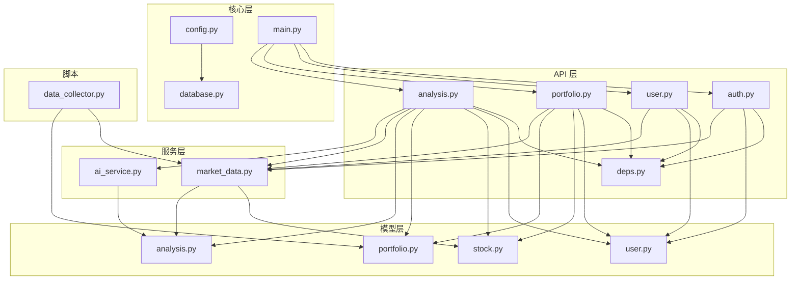
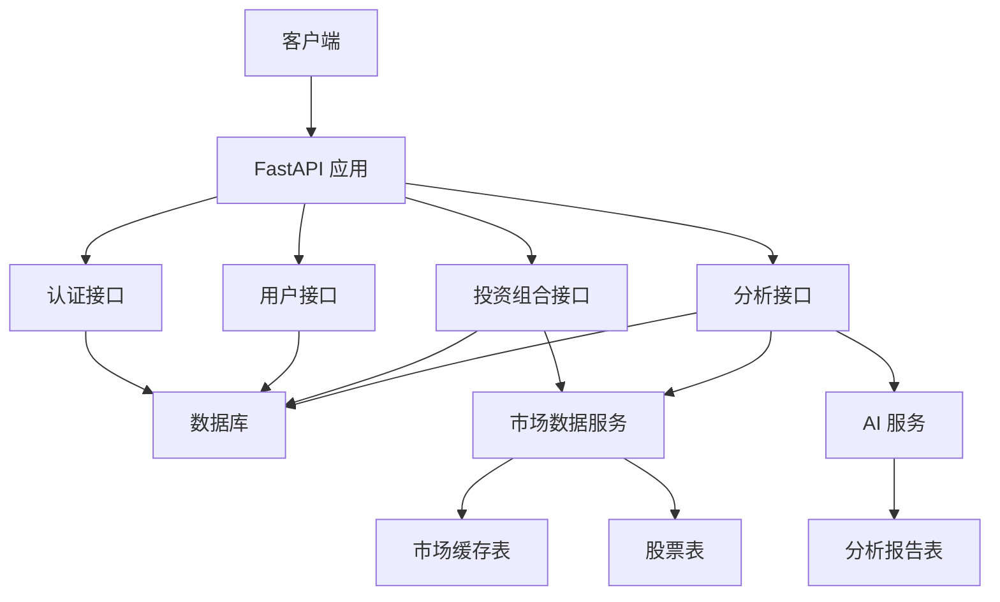
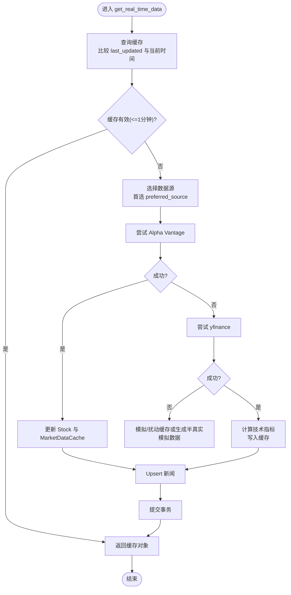
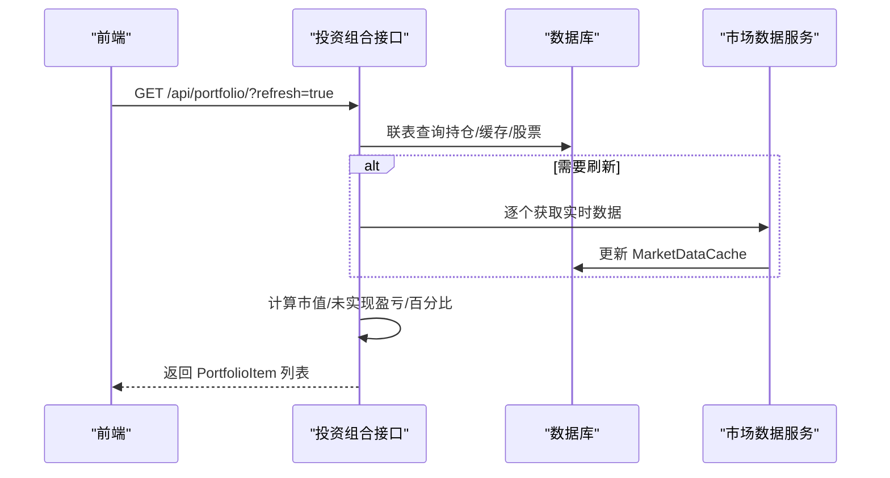
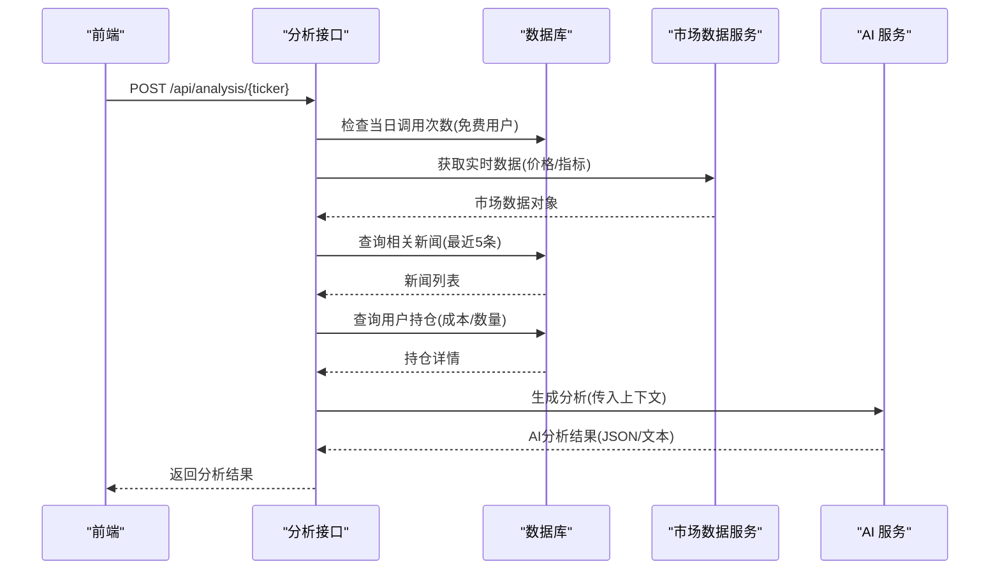
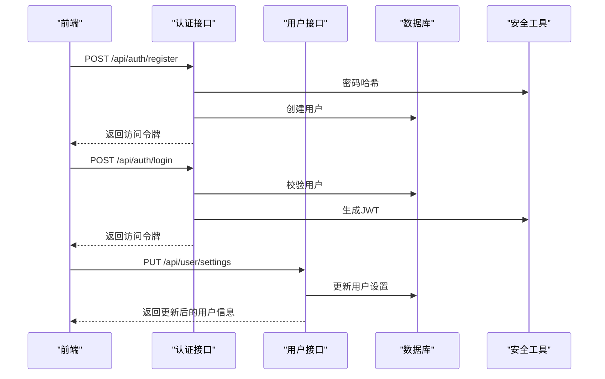
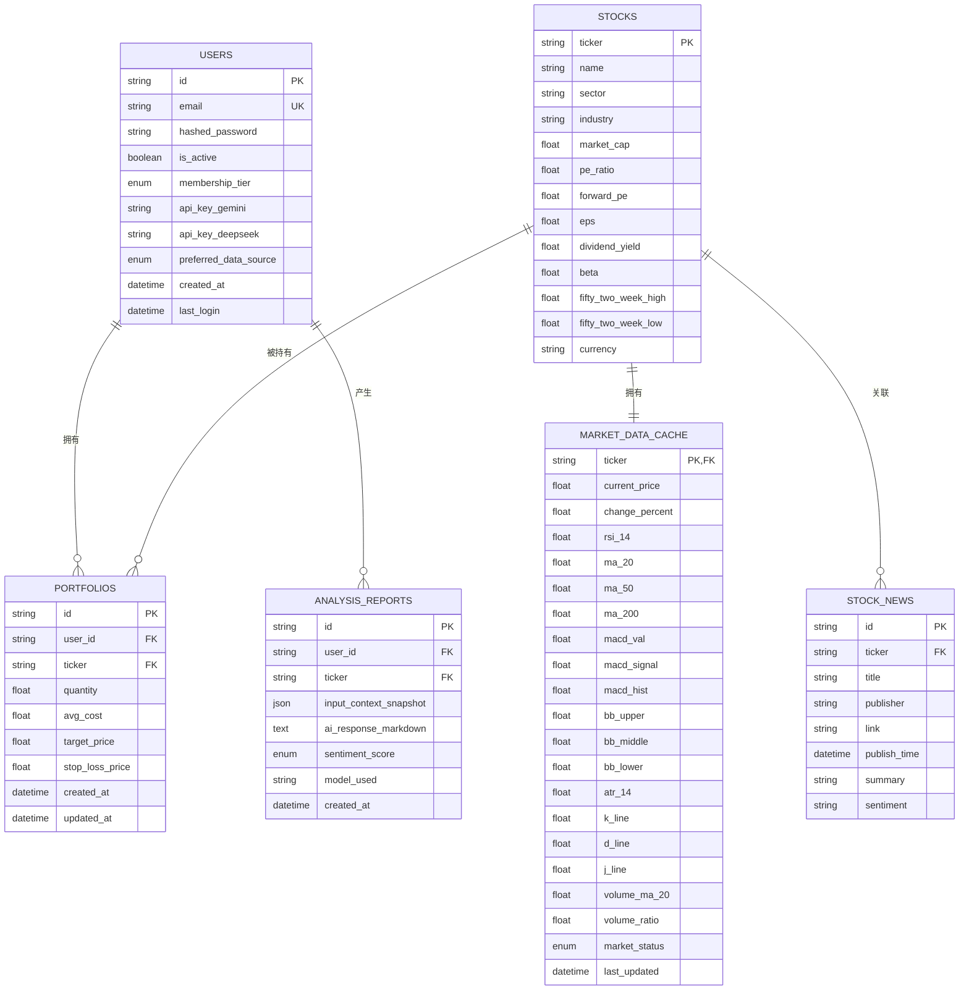
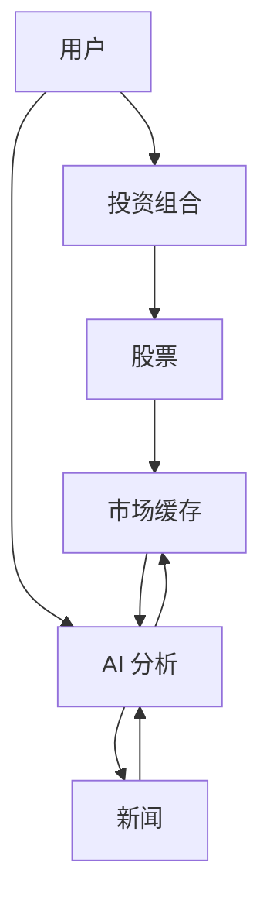
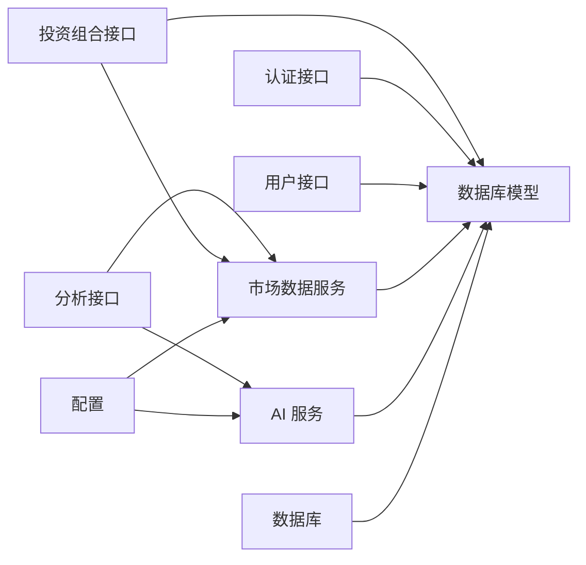

# 数据流设计

<cite>
**本文引用的文件**   
- [backend/app/main.py](file://backend/app/main.py)
- [backend/app/api/analysis.py](file://backend/app/api/analysis.py)
- [backend/app/api/portfolio.py](file://backend/app/api/portfolio.py)
- [backend/app/api/user.py](file://backend/app/api/user.py)
- [backend/app/api/auth.py](file://backend/app/api/auth.py)
- [backend/app/api/deps.py](file://backend/app/api/deps.py)
- [backend/app/services/market_data.py](file://backend/app/services/market_data.py)
- [backend/app/services/ai_service.py](file://backend/app/services/ai_service.py)
- [backend/app/models/stock.py](file://backend/app/models/stock.py)
- [backend/app/models/portfolio.py](file://backend/app/models/portfolio.py)
- [backend/app/models/user.py](file://backend/app/models/user.py)
- [backend/app/models/analysis.py](file://backend/app/models/analysis.py)
- [backend/app/core/config.py](file://backend/app/core/config.py)
- [backend/app/core/database.py](file://backend/app/core/database.py)
- [backend/scripts/data_collector.py](file://backend/scripts/data_collector.py)
- [doc/Database Schema & Data Flow Specification.md](file://doc/Database Schema & Data Flow Specification.md)
</cite>

## 目录
1. [引言](#引言)
2. [项目结构](#项目结构)
3. [核心组件](#核心组件)
4. [架构总览](#架构总览)
5. [详细组件分析](#详细组件分析)
6. [依赖关系分析](#依赖关系分析)
7. [性能考量与缓存策略](#性能考量与缓存策略)
8. [故障排查指南](#故障排查指南)
9. [结论](#结论)
10. [附录](#附录)

## 引言
本文件面向“AI股票顾问系统”的数据流设计，围绕以下目标展开：
- 描述从用户请求到最终响应的完整数据流转路径
- 解释实时数据获取的数据流、缓存策略与更新机制
- 文档化AI分析的数据流，从股票数据获取到分析报告生成
- 说明投资组合数据的读写流程、数据验证与转换、存储过程
- 提供数据流图，展示用户、投资组合、股票等关键实体的关系与数据传递
- 讨论数据一致性与并发控制策略
- 性能优化与缓存策略

## 项目结构
后端采用FastAPI框架，按功能模块组织：
- API层：认证、用户、投资组合、分析接口
- 服务层：市场数据服务、AI服务
- 模型层：用户、股票、市场缓存、分析报告、投资组合
- 核心层：配置、数据库连接
- 脚本：定时数据采集器

图表来源
- [backend/app/main.py](file://backend/app/main.py#L24-L29)
- [backend/app/api/analysis.py](file://backend/app/api/analysis.py#L1-L124)
- [backend/app/api/portfolio.py](file://backend/app/api/portfolio.py#L1-L297)
- [backend/app/api/user.py](file://backend/app/api/user.py#L1-L48)
- [backend/app/api/auth.py](file://backend/app/api/auth.py#L1-L88)
- [backend/app/api/deps.py](file://backend/app/api/deps.py#L1-L44)
- [backend/app/services/market_data.py](file://backend/app/services/market_data.py#L1-L370)
- [backend/app/services/ai_service.py](file://backend/app/services/ai_service.py#L1-L112)
- [backend/app/models/stock.py](file://backend/app/models/stock.py#L1-L85)
- [backend/app/models/portfolio.py](file://backend/app/models/portfolio.py#L1-L26)
- [backend/app/models/user.py](file://backend/app/models/user.py#L1-L31)
- [backend/app/models/analysis.py](file://backend/app/models/analysis.py#L1-L25)
- [backend/app/core/config.py](file://backend/app/core/config.py#L1-L24)
- [backend/app/core/database.py](file://backend/app/core/database.py#L1-L24)
- [backend/scripts/data_collector.py](file://backend/scripts/data_collector.py#L1-L62)

章节来源
- [backend/app/main.py](file://backend/app/main.py#L1-L38)

## 核心组件
- 应用入口与路由挂载：定义CORS、健康检查、根路径，并注册认证、用户、投资组合、分析四个模块路由
- 认证与用户：登录/注册、JWT校验、用户设置更新
- 投资组合：查询、新增、删除；支持本地搜索与远程快速校验；刷新时序化更新缓存
- 实时数据服务：缓存命中优先、多源回退、技术指标计算、新闻入库、缓存更新
- AI分析服务：提示工程、工具调用、JSON模式生成、降级回退
- 数据模型：用户、股票、市场缓存、分析报告、投资组合
- 数据库与配置：异步引擎、会话管理、外部API密钥与代理配置

章节来源
- [backend/app/main.py](file://backend/app/main.py#L1-L38)
- [backend/app/api/auth.py](file://backend/app/api/auth.py#L1-L88)
- [backend/app/api/user.py](file://backend/app/api/user.py#L1-L48)
- [backend/app/api/portfolio.py](file://backend/app/api/portfolio.py#L1-L297)
- [backend/app/api/analysis.py](file://backend/app/api/analysis.py#L1-L124)
- [backend/app/services/market_data.py](file://backend/app/services/market_data.py#L1-L370)
- [backend/app/services/ai_service.py](file://backend/app/services/ai_service.py#L1-L112)
- [backend/app/models/stock.py](file://backend/app/models/stock.py#L1-L85)
- [backend/app/models/portfolio.py](file://backend/app/models/portfolio.py#L1-L26)
- [backend/app/models/user.py](file://backend/app/models/user.py#L1-L31)
- [backend/app/models/analysis.py](file://backend/app/models/analysis.py#L1-L25)
- [backend/app/core/config.py](file://backend/app/core/config.py#L1-L24)
- [backend/app/core/database.py](file://backend/app/core/database.py#L1-L24)

## 架构总览
系统采用分层架构：API层负责请求接入与鉴权，服务层封装数据获取与AI分析，模型层映射数据库表结构，核心层提供配置与数据库连接。

图表来源
- [backend/app/main.py](file://backend/app/main.py#L24-L29)
- [backend/app/api/analysis.py](file://backend/app/api/analysis.py#L1-L124)
- [backend/app/api/portfolio.py](file://backend/app/api/portfolio.py#L1-L297)
- [backend/app/services/market_data.py](file://backend/app/services/market_data.py#L1-L370)
- [backend/app/services/ai_service.py](file://backend/app/services/ai_service.py#L1-L112)
- [backend/app/models/stock.py](file://backend/app/models/stock.py#L1-L85)
- [backend/app/models/analysis.py](file://backend/app/models/analysis.py#L1-L25)

## 详细组件分析

### 实时数据获取与缓存（MarketDataService）
- 缓存策略：按ticker缓存，1分钟内命中直接返回；否则按首选数据源尝试拉取
- 多源回退：首选Alpha Vantage，失败则回退yfinance；均失败时使用模拟数据或基于缓存的小幅扰动
- 技术指标：通过历史数据计算RSI、MACD、布林带、KDJ、ATR、量能指标等，统一写入缓存
- 新闻入库：SQLite Upsert避免重复；仅在yfinance路径下更新
- 并发与稳定性：序列化刷新避免SQLite并发问题；yfinance速率限制指数退避与随机抖动

图表来源
- [backend/app/services/market_data.py](file://backend/app/services/market_data.py#L14-L170)

章节来源
- [backend/app/services/market_data.py](file://backend/app/services/market_data.py#L1-L370)
- [backend/app/models/stock.py](file://backend/app/models/stock.py#L33-L67)

### 投资组合读写流程（Portfolio API）
- 查询：一次性联表查询用户持仓、缓存与股票基础信息，支持强制刷新；刷新时串行调用以规避并发
- 新增：去重约束（user_id + ticker），存在则更新数量与成本，否则新建；若缓存缺失或技术指标不全则后台异步拉取
- 删除：按用户与股票删除
- 数据转换：将缓存与股票字段映射到前端所需字段集，计算市值、未实现盈亏与百分比

图表来源
- [backend/app/api/portfolio.py](file://backend/app/api/portfolio.py#L143-L224)
- [backend/app/services/market_data.py](file://backend/app/services/market_data.py#L14-L170)

章节来源
- [backend/app/api/portfolio.py](file://backend/app/api/portfolio.py#L1-L297)
- [backend/app/models/portfolio.py](file://backend/app/models/portfolio.py#L1-L26)
- [backend/app/models/stock.py](file://backend/app/models/stock.py#L13-L31)

### AI分析数据流（Analysis API）
- 限额检查：免费用户按日统计调用次数，超过阈值拒绝
- 数据聚合：实时行情、新闻、用户持仓（含未实现盈亏）、技术指标
- AI生成：优先使用用户自有Gemini Key；支持JSON模式与降级文本模式
- 结果返回：包含股票代码与分析结果（情感倾向预留）

图表来源
- [backend/app/api/analysis.py](file://backend/app/api/analysis.py#L13-L123)
- [backend/app/services/ai_service.py](file://backend/app/services/ai_service.py#L43-L111)
- [backend/app/services/market_data.py](file://backend/app/services/market_data.py#L14-L170)

章节来源
- [backend/app/api/analysis.py](file://backend/app/api/analysis.py#L1-L124)
- [backend/app/services/ai_service.py](file://backend/app/services/ai_service.py#L1-L112)

### 用户与认证（Auth/User API）
- 登录/注册：邮箱密码校验，签发JWT
- 设置更新：支持更新Gemini/DeepSeek Key与数据源偏好
- 鉴权中间件：从Header提取JWT，解码并加载用户

图表来源
- [backend/app/api/auth.py](file://backend/app/api/auth.py#L24-L87)
- [backend/app/api/user.py](file://backend/app/api/user.py#L22-L47)
- [backend/app/api/deps.py](file://backend/app/api/deps.py#L17-L43)

章节来源
- [backend/app/api/auth.py](file://backend/app/api/auth.py#L1-L88)
- [backend/app/api/user.py](file://backend/app/api/user.py#L1-L48)
- [backend/app/api/deps.py](file://backend/app/api/deps.py#L1-L44)
- [backend/app/models/user.py](file://backend/app/models/user.py#L1-L31)

### 数据模型与实体关系

图表来源
- [backend/app/models/user.py](file://backend/app/models/user.py#L15-L31)
- [backend/app/models/stock.py](file://backend/app/models/stock.py#L13-L85)
- [backend/app/models/portfolio.py](file://backend/app/models/portfolio.py#L7-L26)
- [backend/app/models/analysis.py](file://backend/app/models/analysis.py#L12-L25)

章节来源
- [backend/app/models/user.py](file://backend/app/models/user.py#L1-L31)
- [backend/app/models/stock.py](file://backend/app/models/stock.py#L1-L85)
- [backend/app/models/portfolio.py](file://backend/app/models/portfolio.py#L1-L26)
- [backend/app/models/analysis.py](file://backend/app/models/analysis.py#L1-L25)

### 数据一致性与并发控制
- 会话与事务：异步会话管理，每个请求独立会话；关键写入使用commit确保持久化
- 并发刷新：投资组合刷新采用串行逐个更新，避免SQLite并发写入冲突
- 缓存一致性：缓存有效期1分钟，避免脏读；yfinance失败时对现有缓存做小幅扰动维持“活性”
- 去重与唯一性：投资组合按(user_id, ticker)唯一约束，防止重复持仓

章节来源
- [backend/app/core/database.py](file://backend/app/core/database.py#L1-L24)
- [backend/app/api/portfolio.py](file://backend/app/api/portfolio.py#L162-L174)
- [backend/app/services/market_data.py](file://backend/app/services/market_data.py#L21-L23)
- [backend/app/models/portfolio.py](file://backend/app/models/portfolio.py#L21-L23)

### 数据流图（概念性）
以下为概念性数据流图，展示用户、投资组合、股票、缓存与AI分析之间的交互。

（此图为概念示意，不对应具体源码文件）

## 依赖关系分析
- API层依赖服务层与模型层；服务层依赖模型层与外部API；核心层提供配置与数据库连接
- 关键耦合点：分析接口同时依赖市场数据服务与AI服务；投资组合接口依赖市场数据服务与数据库
- 外部依赖：yfinance、Alpha Vantage、Google Generative AI

图表来源
- [backend/app/api/analysis.py](file://backend/app/api/analysis.py#L1-L124)
- [backend/app/api/portfolio.py](file://backend/app/api/portfolio.py#L1-L297)
- [backend/app/services/market_data.py](file://backend/app/services/market_data.py#L1-L370)
- [backend/app/services/ai_service.py](file://backend/app/services/ai_service.py#L1-L112)
- [backend/app/core/config.py](file://backend/app/core/config.py#L1-L24)
- [backend/app/core/database.py](file://backend/app/core/database.py#L1-L24)

章节来源
- [backend/app/api/analysis.py](file://backend/app/api/analysis.py#L1-L124)
- [backend/app/api/portfolio.py](file://backend/app/api/portfolio.py#L1-L297)
- [backend/app/services/market_data.py](file://backend/app/services/market_data.py#L1-L370)
- [backend/app/services/ai_service.py](file://backend/app/services/ai_service.py#L1-L112)
- [backend/app/core/config.py](file://backend/app/core/config.py#L1-L24)
- [backend/app/core/database.py](file://backend/app/core/database.py#L1-L24)

## 性能考量与缓存策略
- 缓存命中率：1分钟有效期显著降低外部API调用频率，提升响应速度
- 多源回退：优先Alpha Vantage，失败回退yfinance，保障可用性
- 批量与串行：批量刷新采用串行逐个更新，避免并发写入导致的锁竞争
- 速率限制：yfinance指数退避与随机抖动，降低429风险；采集器每只股票间隔至少60秒
- 前端友好：一次查询联表返回全部所需字段，减少往返

章节来源
- [backend/app/services/market_data.py](file://backend/app/services/market_data.py#L21-L23)
- [backend/app/api/portfolio.py](file://backend/app/api/portfolio.py#L162-L174)
- [backend/scripts/data_collector.py](file://backend/scripts/data_collector.py#L16-L56)

## 故障排查指南
- 认证失败：检查JWT签名与算法配置，确认密钥一致；核对token是否过期
- 数据源错误：确认Alpha Vantage与yfinance密钥与网络代理配置；观察重试与回退逻辑
- AI生成失败：检查Gemini API Key；若JSON模式失败，系统会降级为文本模式
- 429限流：关注yfinance的指数退避与随机等待；采集器已内置60秒间隔
- 缓存未更新：确认缓存有效期与last_updated字段；必要时手动刷新

章节来源
- [backend/app/api/deps.py](file://backend/app/api/deps.py#L17-L43)
- [backend/app/services/market_data.py](file://backend/app/services/market_data.py#L300-L318)
- [backend/app/services/ai_service.py](file://backend/app/services/ai_service.py#L47-L51)
- [backend/scripts/data_collector.py](file://backend/scripts/data_collector.py#L47-L51)

## 结论
本系统通过“缓存优先、多源回退、串行刷新、速率限制与降级回退”等策略，在保证数据新鲜度的同时最大化性能与稳定性。AI分析与投资组合读写流程清晰，实体关系明确，具备良好的扩展性与可维护性。

## 附录
- 数据采集器：定时扫描用户组合中的股票，按60±秒间隔抓取并持久化，保护IP安全
- 规范文档：数据库与数据流规范文档提供了实体定义、关系与关键数据流逻辑

章节来源
- [backend/scripts/data_collector.py](file://backend/scripts/data_collector.py#L1-L62)
- [doc/Database Schema & Data Flow Specification.md](file://doc/Database Schema & Data Flow Specification.md#L1-L108)