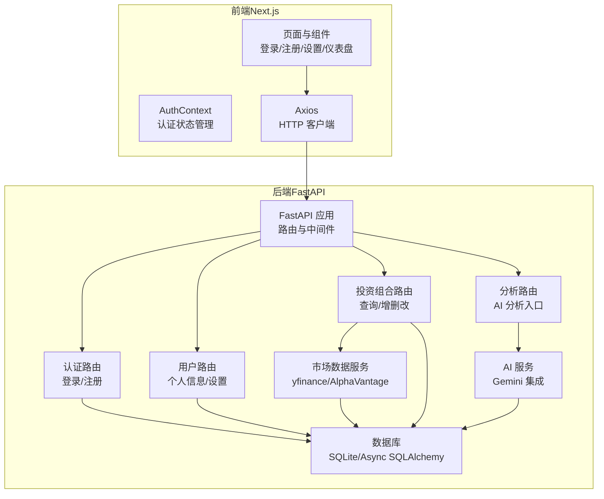
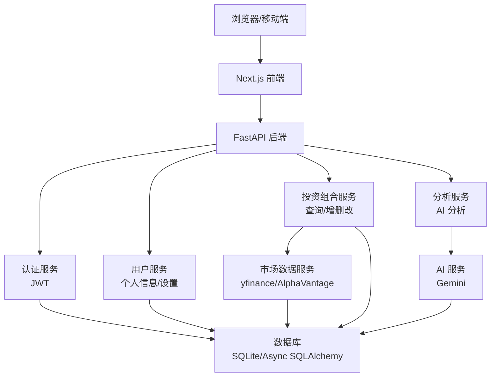
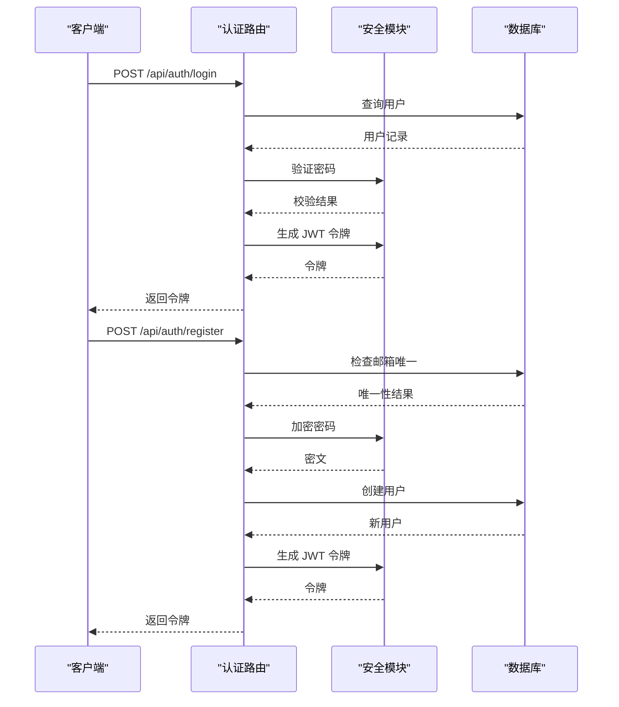
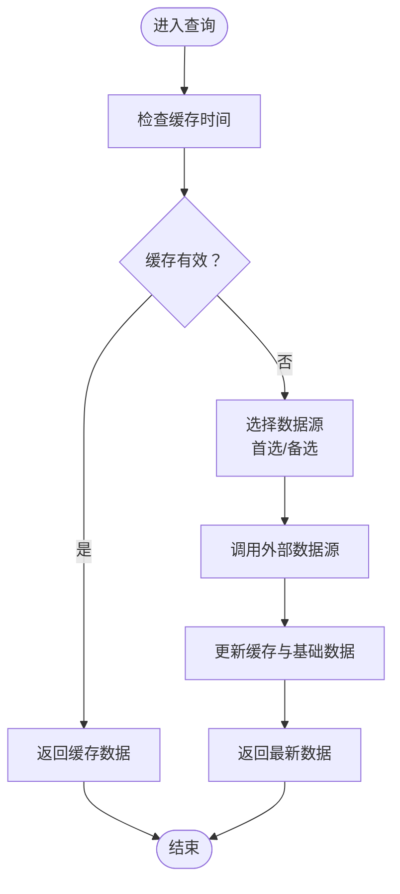
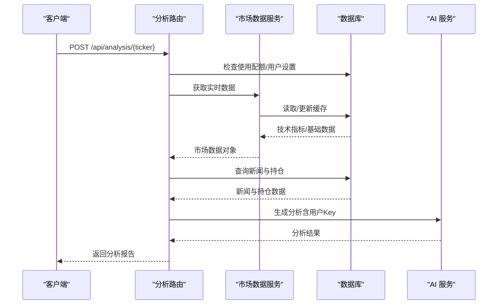
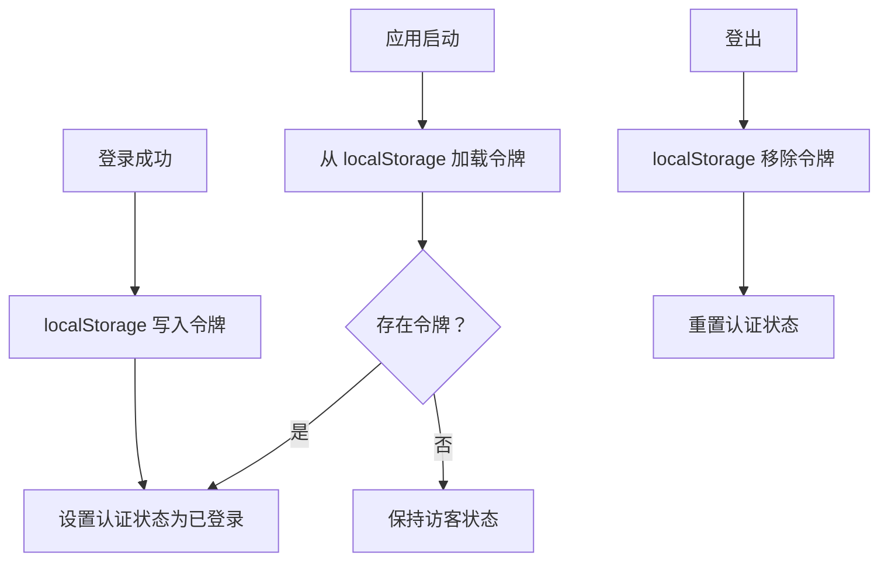
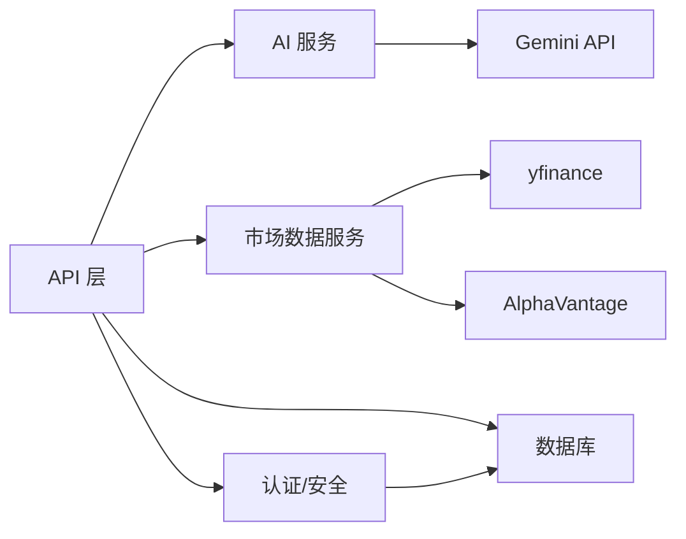

# 整体架构设计

<cite>
**本文档引用的文件**
- [backend/app/main.py](file://backend/app/main.py)
- [backend/app/api/auth.py](file://backend/app/api/auth.py)
- [backend/app/api/portfolio.py](file://backend/app/api/portfolio.py)
- [backend/app/api/user.py](file://backend/app/api/user.py)
- [backend/app/api/analysis.py](file://backend/app/api/analysis.py)
- [backend/app/services/ai_service.py](file://backend/app/services/ai_service.py)
- [backend/app/services/market_data.py](file://backend/app/services/market_data.py)
- [backend/app/models/user.py](file://backend/app/models/user.py)
- [backend/app/models/portfolio.py](file://backend/app/models/portfolio.py)
- [backend/app/core/security.py](file://backend/app/core/security.py)
- [backend/app/core/config.py](file://backend/app/core/config.py)
- [frontend/context/AuthContext.tsx](file://frontend/context/AuthContext.tsx)
- [frontend/package.json](file://frontend/package.json)
- [doc/tech_stack.md](file://doc/tech_stack.md)
- [README.md](file://README.md)
</cite>

## 目录
1. [引言](#引言)
2. [项目结构](#项目结构)
3. [核心组件](#核心组件)
4. [架构总览](#架构总览)
5. [详细组件分析](#详细组件分析)
6. [依赖关系分析](#依赖关系分析)
7. [性能考虑](#性能考虑)
8. [故障排除指南](#故障排除指南)
9. [结论](#结论)

## 引言
本项目是一个前后端分离的微服务化股票投资顾问平台，采用 FastAPI 后端与 Next.js 前端的技术栈组合。系统通过清晰的分层架构实现认证授权、用户管理、投资组合管理、市场数据分析与 AI 投资建议生成等功能。本文档将系统性阐述架构设计、组件职责、数据流与集成点，并提供系统上下文图以展示与外部服务（AI 服务、金融数据 API、OAuth 提供商）的交互。

## 项目结构
项目采用“前后端分离”的微服务架构布局：
- 后端（FastAPI）：提供 RESTful API，负责认证、用户、投资组合、分析等业务逻辑，以及与外部金融数据与 AI 服务的集成。
- 前端（Next.js）：基于 App Router 的单页应用，使用 React Context 管理认证状态，Axios 进行 API 请求，Tailwind CSS 与 Shadcn/UI 构建界面。
- 文档与配置：技术栈说明、数据库模型与数据流规范、环境变量与启动脚本。

图表来源
- [backend/app/main.py](file://backend/app/main.py#L1-L38)
- [backend/app/api/auth.py](file://backend/app/api/auth.py#L1-L88)
- [backend/app/api/user.py](file://backend/app/api/user.py#L1-L48)
- [backend/app/api/portfolio.py](file://backend/app/api/portfolio.py#L1-L297)
- [backend/app/api/analysis.py](file://backend/app/api/analysis.py#L1-L124)
- [backend/app/services/ai_service.py](file://backend/app/services/ai_service.py#L1-L112)
- [backend/app/services/market_data.py](file://backend/app/services/market_data.py#L1-L370)
- [frontend/context/AuthContext.tsx](file://frontend/context/AuthContext.tsx#L1-L60)

章节来源
- [README.md](file://README.md#L45-L50)
- [doc/tech_stack.md](file://doc/tech_stack.md#L1-L51)

## 核心组件
- API 层（FastAPI）
  - 认证路由：登录/注册，使用 OAuth2 密码模式与 JWT 令牌发放。
  - 用户路由：获取当前用户信息、更新用户设置（含 API Key 与数据源偏好）。
  - 投资组合路由：搜索股票、查询/新增/删除投资组合条目；支持刷新缓存与异步后台数据抓取。
  - 分析路由：整合市场数据、新闻与用户持仓，调用 AI 服务生成分析报告。
- 业务逻辑层
  - 市场数据服务：统一接入 yfinance 与 AlphaVantage，缓存技术指标与基础财务数据，处理限流与降级。
  - AI 服务：封装 Gemini SDK，支持用户自定义 API Key 与降级提示。
- 数据访问层（ORM）
  - 用户模型：邮箱唯一、密码哈希、会员等级、第三方 API Key 存储、首选数据源。
  - 投资组合模型：用户与股票多对一关系，唯一约束避免重复持仓。
- 前端组件
  - 认证上下文：本地存储令牌、全局登录状态、路由跳转。
  - 页面与组件：登录、注册、个人设置、主面板等。

章节来源
- [backend/app/api/auth.py](file://backend/app/api/auth.py#L1-L88)
- [backend/app/api/user.py](file://backend/app/api/user.py#L1-L48)
- [backend/app/api/portfolio.py](file://backend/app/api/portfolio.py#L1-L297)
- [backend/app/api/analysis.py](file://backend/app/api/analysis.py#L1-L124)
- [backend/app/services/market_data.py](file://backend/app/services/market_data.py#L1-L370)
- [backend/app/services/ai_service.py](file://backend/app/services/ai_service.py#L1-L112)
- [backend/app/models/user.py](file://backend/app/models/user.py#L1-L31)
- [backend/app/models/portfolio.py](file://backend/app/models/portfolio.py#L1-L26)
- [frontend/context/AuthContext.tsx](file://frontend/context/AuthContext.tsx#L1-L60)

## 架构总览
系统采用“前后端分离 + 微服务化”的架构模式：
- 后端以 FastAPI 为核心，按功能模块拆分为认证、用户、投资组合、分析四个 API 路由，统一通过主应用注册与中间件（CORS）暴露。
- 业务逻辑通过服务层解耦，市场数据与 AI 服务作为外部依赖，通过配置中心集中管理密钥与代理。
- 前端以 Next.js App Router 组织页面与组件，使用 React Context 管理认证状态，Axios 发起 REST 请求。
- 数据层采用异步 SQLAlchemy，SQLite 作为开发数据库，支持迁移工具 Alembic。

图表来源
- [backend/app/main.py](file://backend/app/main.py#L1-L38)
- [backend/app/api/auth.py](file://backend/app/api/auth.py#L1-L88)
- [backend/app/api/user.py](file://backend/app/api/user.py#L1-L48)
- [backend/app/api/portfolio.py](file://backend/app/api/portfolio.py#L1-L297)
- [backend/app/api/analysis.py](file://backend/app/api/analysis.py#L1-L124)
- [backend/app/services/market_data.py](file://backend/app/services/market_data.py#L1-L370)
- [backend/app/services/ai_service.py](file://backend/app/services/ai_service.py#L1-L112)

## 详细组件分析

### 认证与安全（API 层 → 核心）
- 登录/注册流程
  - 登录：校验邮箱与密码，生成 JWT 令牌。
  - 注册：检查邮箱唯一性，加密密码后创建用户并发放令牌。
- 安全机制
  - JWT 令牌有效期与算法配置来自配置中心。
  - 密码使用 bcrypt 哈希，验证通过后签发令牌。

图表来源
- [backend/app/api/auth.py](file://backend/app/api/auth.py#L24-L87)
- [backend/app/core/security.py](file://backend/app/core/security.py#L1-L26)
- [backend/app/core/config.py](file://backend/app/core/config.py#L1-L24)

章节来源
- [backend/app/api/auth.py](file://backend/app/api/auth.py#L1-L88)
- [backend/app/core/security.py](file://backend/app/core/security.py#L1-L26)
- [backend/app/core/config.py](file://backend/app/core/config.py#L1-L24)

### 投资组合管理（API 层 → 服务层）
- 功能要点
  - 搜索股票：优先本地匹配，必要时远程调用 yfinance 并写入缓存。
  - 查询投资组合：一次性联表查询缓存与基础数据，支持刷新。
  - 新增/删除：幂等更新或创建，必要时触发后台数据抓取。
- 性能优化
  - 缓存机制：1 分钟内命中缓存，避免频繁外部请求。
  - 批量与并发：刷新时顺序拉取以规避 SQLite 并发问题，后台异步抓取不阻塞响应。

图表来源
- [backend/app/api/portfolio.py](file://backend/app/api/portfolio.py#L143-L224)
- [backend/app/services/market_data.py](file://backend/app/services/market_data.py#L14-L170)

章节来源
- [backend/app/api/portfolio.py](file://backend/app/api/portfolio.py#L1-L297)
- [backend/app/services/market_data.py](file://backend/app/services/market_data.py#L1-L370)

### AI 分析流程（API 层 → 服务层）
- 流程说明
  - 权限与配额：若未配置 Gemini Key，执行免费层级每日限制。
  - 数据准备：调用市场数据服务获取价格与技术指标，查询新闻与用户持仓。
  - AI 生成：构造提示词，调用 Gemini 生成分析报告，支持降级与错误回退。
- 外部依赖
  - Gemini API Key 可来自用户设置或系统配置。
  - 支持本地代理配置以提升网络稳定性。

图表来源
- [backend/app/api/analysis.py](file://backend/app/api/analysis.py#L13-L123)
- [backend/app/services/ai_service.py](file://backend/app/services/ai_service.py#L42-L111)
- [backend/app/services/market_data.py](file://backend/app/services/market_data.py#L14-L170)

章节来源
- [backend/app/api/analysis.py](file://backend/app/api/analysis.py#L1-L124)
- [backend/app/services/ai_service.py](file://backend/app/services/ai_service.py#L1-L112)
- [backend/app/services/market_data.py](file://backend/app/services/market_data.py#L1-L370)

### 前端认证上下文（前端）
- 功能要点
  - 本地存储令牌，初始化加载。
  - 登录成功写入本地存储并跳转首页；登出清理并跳转登录页。
  - 提供全局认证状态，供页面与组件消费。

图表来源
- [frontend/context/AuthContext.tsx](file://frontend/context/AuthContext.tsx#L15-L51)

章节来源
- [frontend/context/AuthContext.tsx](file://frontend/context/AuthContext.tsx#L1-L60)

## 依赖关系分析
- 组件耦合
  - API 层仅依赖服务层与数据库，低耦合高内聚。
  - 服务层对外部 API 与数据库进行统一封装，便于替换与测试。
- 外部依赖
  - 金融数据：yfinance（本地）、AlphaVantage（付费/备用）。
  - AI 服务：Google Generative AI（Gemini）。
  - 认证：OAuth2 密码模式 + JWT。
- 配置与环境
  - 配置中心集中管理数据库连接、密钥与代理参数，支持 .env 文件加载。

图表来源
- [backend/app/api/analysis.py](file://backend/app/api/analysis.py#L1-L124)
- [backend/app/api/portfolio.py](file://backend/app/api/portfolio.py#L1-L297)
- [backend/app/services/ai_service.py](file://backend/app/services/ai_service.py#L1-L112)
- [backend/app/services/market_data.py](file://backend/app/services/market_data.py#L1-L370)
- [backend/app/core/config.py](file://backend/app/core/config.py#L1-L24)

章节来源
- [backend/app/core/config.py](file://backend/app/core/config.py#L1-L24)
- [doc/tech_stack.md](file://doc/tech_stack.md#L31-L50)

## 性能考虑
- 缓存策略
  - 市场数据缓存 1 分钟，减少外部 API 调用频率。
  - 技术指标与基础数据在缓存中持久化，降低重复计算。
- 并发与限流
  - 外部数据源对 yfinance 实施指数退避与超时控制，避免 429 错误。
  - SQLite 场景下顺序刷新避免会话并发冲突。
- 前端体验
  - 使用 React Context 管理认证状态，Axios 统一拦截器处理鉴权头。
  - 建议引入缓存库（SWR/TanStack Query）优化重复请求与离线体验。

## 故障排除指南
- 认证失败
  - 检查用户名与密码是否正确；确认数据库中用户存在且密码哈希匹配。
  - 核对 JWT 算法与密钥配置，确保与后端一致。
- AI 分析异常
  - 若未配置 Gemini Key，系统将返回降级提示；可在用户设置中添加自有 Key。
  - 观察日志输出，确认 API Key 是否被正确注入。
- 市场数据不可用
  - 检查外部 API 密钥与网络代理配置；确认缓存未过期。
  - 如 AlphaVantage 达到配额，系统将回退至 yfinance 或模拟数据。
- 前端无法登录
  - 确认 localStorage 中存在 token；检查路由跳转逻辑与认证上下文提供者包裹。

章节来源
- [backend/app/api/auth.py](file://backend/app/api/auth.py#L24-L87)
- [backend/app/api/analysis.py](file://backend/app/api/analysis.py#L46-L50)
- [backend/app/services/ai_service.py](file://backend/app/services/ai_service.py#L47-L48)
- [backend/app/services/market_data.py](file://backend/app/services/market_data.py#L30-L37)
- [frontend/context/AuthContext.tsx](file://frontend/context/AuthContext.tsx#L27-L37)

## 结论
本系统通过前后端分离与微服务化设计，实现了清晰的职责划分与良好的扩展性。FastAPI 提供高性能的 API 能力，Next.js 前端带来现代化的用户体验。通过统一的服务层封装外部依赖、严格的配置管理与缓存策略，系统在保证功能完整性的同时兼顾了性能与可靠性。未来可进一步引入缓存层（Redis）、消息队列与可观测性工具，以支撑更大规模的并发与更复杂的业务场景。